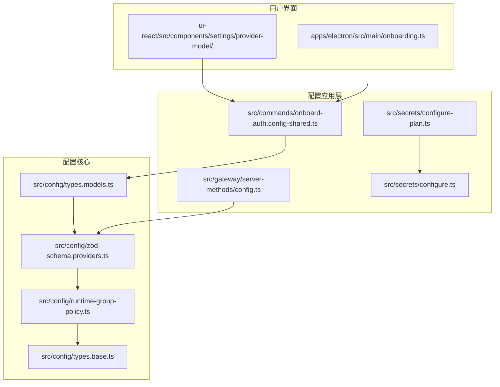
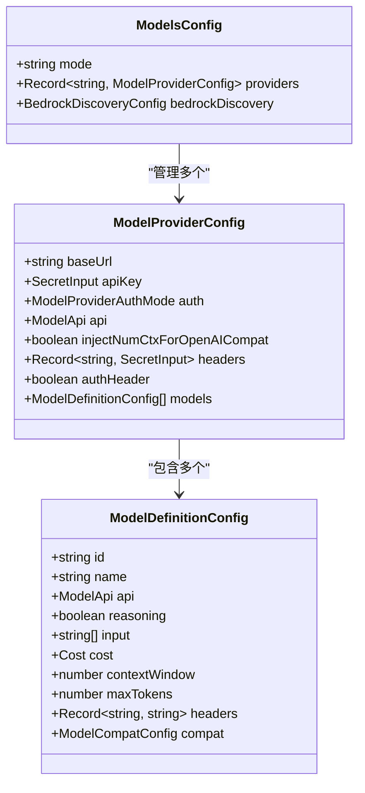
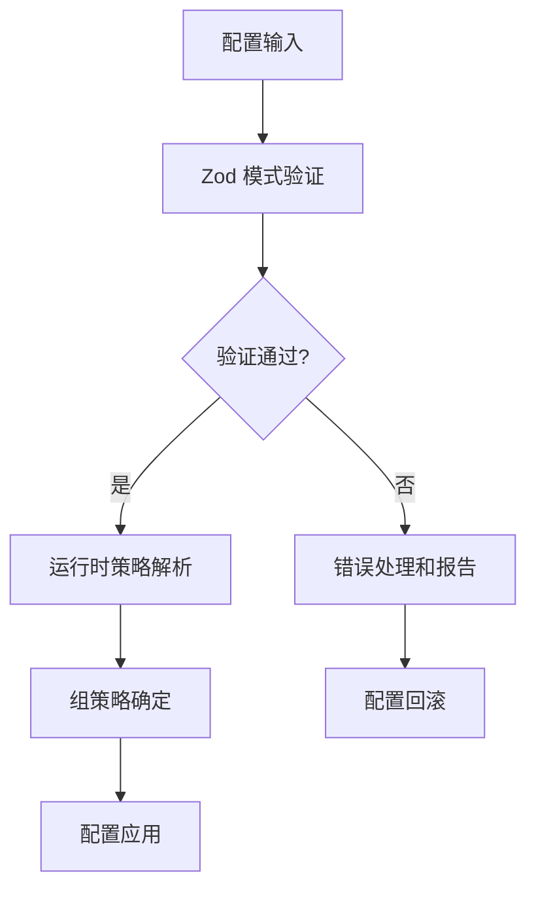
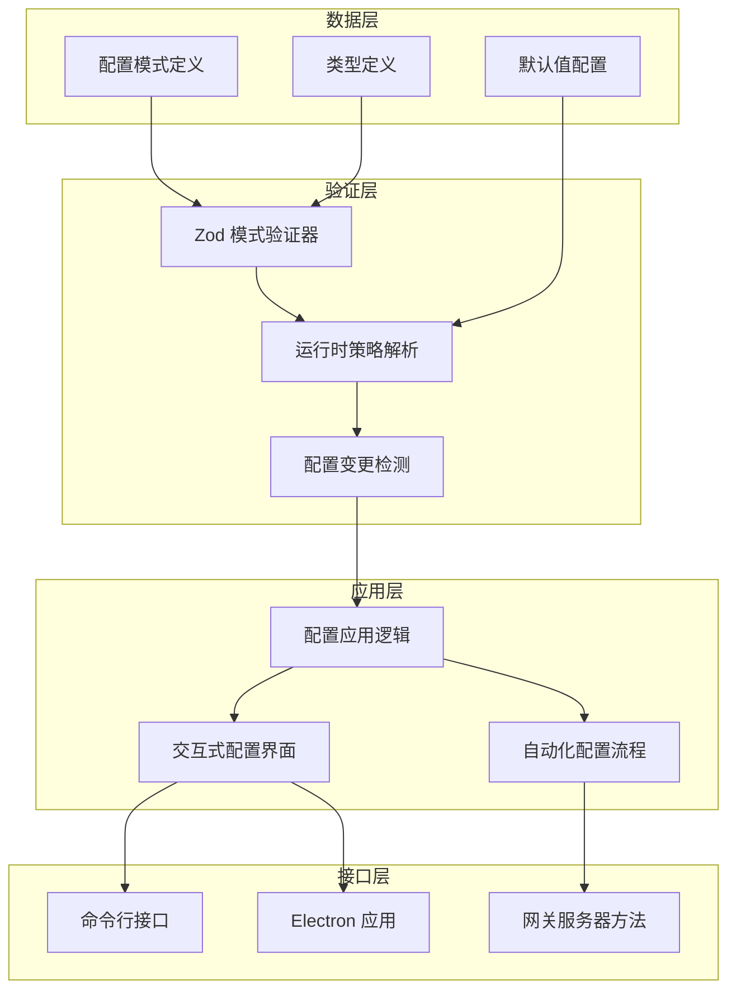
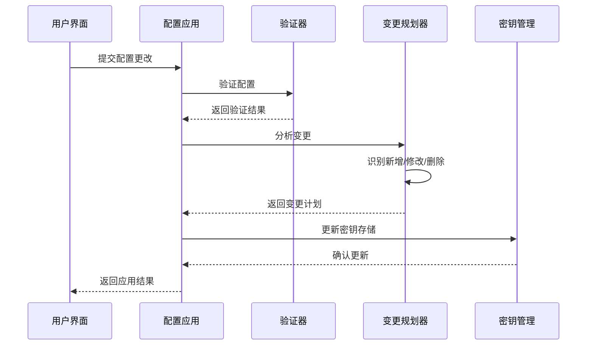
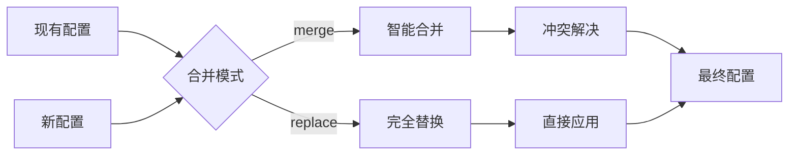
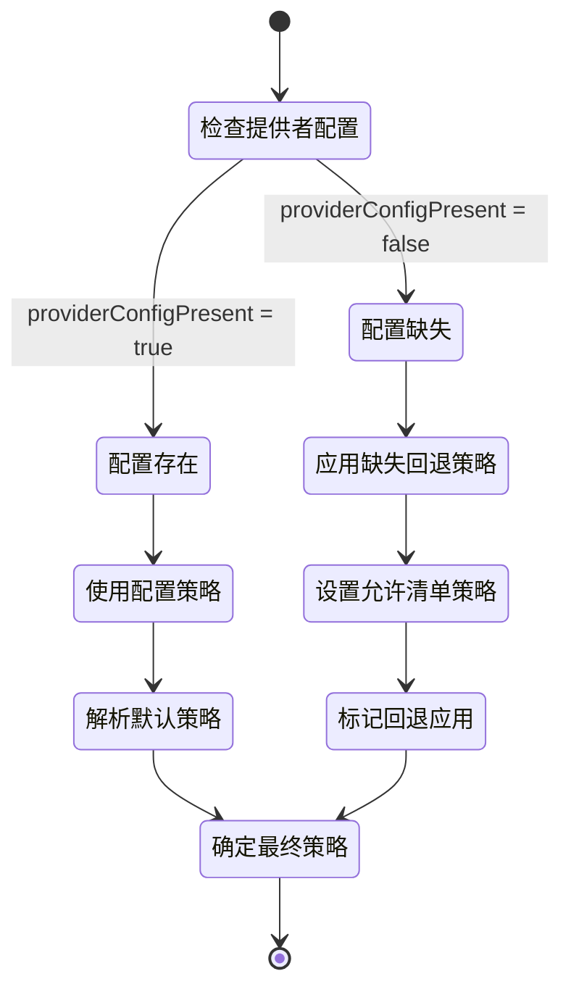
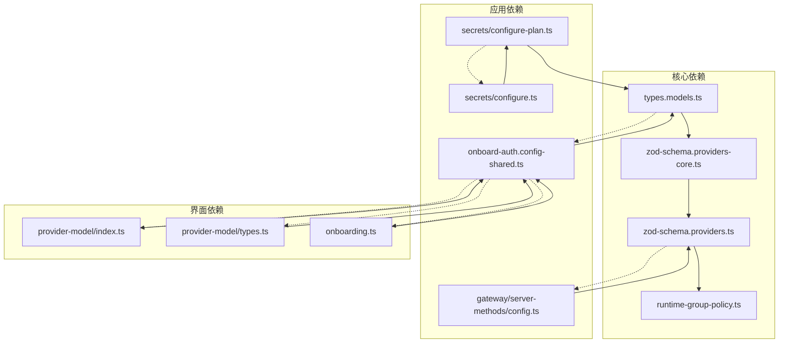

# 提供者配置编排

<cite>
**本文档引用的文件**
- [src/config/types.models.ts](file://src/config/types.models.ts)
- [src/config/zod-schema.providers.ts](file://src/config/zod-schema.providers.ts)
- [src/config/zod-schema.providers-core.ts](file://src/config/zod-schema.providers-core.ts)
- [src/config/zod-schema.providers-whatsapp.ts](file://src/config/zod-schema.providers-whatsapp.ts)
- [src/config/runtime-group-policy.ts](file://src/config/runtime-group-policy.ts)
- [src/config/types.base.ts](file://src/config/types.base.ts)
- [src/commands/onboard-auth.config-shared.ts](file://src/commands/onboard-auth.config-shared.ts)
- [src/gateway/server-methods/config.ts](file://src/gateway/server-methods/config.ts)
- [src/secrets/configure-plan.ts](file://src/secrets/configure-plan.ts)
- [src/secrets/configure.ts](file://src/secrets/configure.ts)
- [apps/electron/src/main/onboarding.ts](file://apps/electron/src/main/onboarding.ts)
- [ui-react/src/components/settings/provider-model/index.ts](file://ui-react/src/components/settings/provider-model/index.ts)
- [ui-react/src/components/settings/provider-model/types.ts](file://ui-react/src/components/settings/provider-model/types.ts)
</cite>

## 目录
1. [简介](#简介)
2. [项目结构](#项目结构)
3. [核心组件](#核心组件)
4. [架构概览](#架构概览)
5. [详细组件分析](#详细组件分析)
6. [依赖关系分析](#依赖关系分析)
7. [性能考虑](#性能考虑)
8. [故障排除指南](#故障排除指南)
9. [结论](#结论)

## 简介

提供者配置编排是 OpenClaw 项目中的一个关键功能模块，负责管理和协调各种外部服务提供者的配置。该系统支持多种模型提供者（如 OpenAI、Anthropic、Google等）和通信渠道（如 Telegram、Discord、WhatsApp 等），通过统一的配置框架实现灵活的提供者管理。

本系统的核心目标包括：
- 统一管理不同提供者的认证信息和配置参数
- 支持动态添加、修改和删除提供者配置
- 提供类型安全的配置验证和错误处理
- 实现提供者配置的版本控制和变更追踪
- 支持交互式配置界面和自动化配置流程

## 项目结构

OpenClaw 的提供者配置编排系统主要分布在以下目录中：

**图表来源**
- [src/config/types.models.ts:1-77](file://src/config/types.models.ts#L1-L77)
- [src/config/zod-schema.providers.ts:1-48](file://src/config/zod-schema.providers.ts#L1-L48)
- [src/config/runtime-group-policy.ts:1-119](file://src/config/runtime-group-policy.ts#L1-L119)

**章节来源**
- [src/config/types.models.ts:1-77](file://src/config/types.models.ts#L1-L77)
- [src/config/zod-schema.providers.ts:1-48](file://src/config/zod-schema.providers.ts#L1-L48)
- [src/config/runtime-group-policy.ts:1-119](file://src/config/runtime-group-policy.ts#L1-L119)

## 核心组件

### 模型提供者配置架构

模型提供者配置是整个系统的核心数据结构，定义了如何配置和管理不同的 AI 模型提供者。

**图表来源**
- [src/config/types.models.ts:52-76](file://src/config/types.models.ts#L52-L76)

### 配置验证和策略系统

系统使用 Zod 模式验证器确保配置的完整性和正确性，并实现了运行时组策略解析机制。

**图表来源**
- [src/config/zod-schema.providers-core.ts:1-800](file://src/config/zod-schema.providers-core.ts#L1-L800)
- [src/config/runtime-group-policy.ts:16-27](file://src/config/runtime-group-policy.ts#L16-L27)

**章节来源**
- [src/config/types.models.ts:1-77](file://src/config/types.models.ts#L1-L77)
- [src/config/zod-schema.providers-core.ts:1-800](file://src/config/zod-schema.providers-core.ts#L1-L800)
- [src/config/runtime-group-policy.ts:1-119](file://src/config/runtime-group-policy.ts#L1-L119)

## 架构概览

提供者配置编排系统采用分层架构设计，从底层的数据模型到上层的应用逻辑形成了完整的配置管理链路。

**图表来源**
- [src/config/zod-schema.providers.ts:25-47](file://src/config/zod-schema.providers.ts#L25-L47)
- [src/config/runtime-group-policy.ts:16-27](file://src/config/runtime-group-policy.ts#L16-L27)
- [src/commands/onboard-auth.config-shared.ts:20-41](file://src/commands/onboard-auth.config-shared.ts#L20-L41)

## 详细组件分析

### 配置应用和变更管理

系统提供了完整的配置应用和变更管理机制，支持增量更新和批量操作。

**图表来源**
- [src/gateway/server-methods/config.ts:509-523](file://src/gateway/server-methods/config.ts#L509-L523)
- [src/secrets/configure-plan.ts:186-214](file://src/secrets/configure-plan.ts#L186-L214)
- [src/secrets/configure.ts:745-775](file://src/secrets/configure.ts#L745-L775)

### 提供者配置合并策略

系统实现了智能的提供者配置合并策略，支持多种合并模式和优先级规则。

**图表来源**
- [src/commands/onboard-auth.config-shared.ts:169-192](file://src/commands/onboard-auth.config-shared.ts#L169-L192)

### 运行时组策略解析

系统实现了灵活的运行时组策略解析机制，支持不同场景下的策略选择。

**图表来源**
- [src/config/runtime-group-policy.ts:16-27](file://src/config/runtime-group-policy.ts#L16-L27)

**章节来源**
- [src/gateway/server-methods/config.ts:509-523](file://src/gateway/server-methods/config.ts#L509-L523)
- [src/secrets/configure-plan.ts:186-214](file://src/secrets/configure-plan.ts#L186-L214)
- [src/secrets/configure.ts:745-775](file://src/secrets/configure.ts#L745-L775)
- [src/commands/onboard-auth.config-shared.ts:169-192](file://src/commands/onboard-auth.config-shared.ts#L169-L192)
- [src/config/runtime-group-policy.ts:16-27](file://src/config/runtime-group-policy.ts#L16-L27)

## 依赖关系分析

提供者配置编排系统的依赖关系呈现清晰的层次化结构，各组件之间的耦合度适中，便于维护和扩展。

**图表来源**
- [src/config/types.models.ts:1-77](file://src/config/types.models.ts#L1-L77)
- [src/config/zod-schema.providers-core.ts:1-800](file://src/config/zod-schema.providers-core.ts#L1-L800)
- [src/config/zod-schema.providers.ts:1-48](file://src/config/zod-schema.providers.ts#L1-L48)
- [src/config/runtime-group-policy.ts:1-119](file://src/config/runtime-group-policy.ts#L1-L119)
- [src/commands/onboard-auth.config-shared.ts:1-214](file://src/commands/onboard-auth.config-shared.ts#L1-L214)

**章节来源**
- [src/config/types.models.ts:1-77](file://src/config/types.models.ts#L1-L77)
- [src/config/zod-schema.providers-core.ts:1-800](file://src/config/zod-schema.providers-core.ts#L1-L800)
- [src/config/zod-schema.providers.ts:1-48](file://src/config/zod-schema.providers.ts#L1-L48)
- [src/config/runtime-group-policy.ts:1-119](file://src/config/runtime-group-policy.ts#L1-L119)
- [src/commands/onboard-auth.config-shared.ts:1-214](file://src/commands/onboard-auth.config-shared.ts#L1-L214)

## 性能考虑

提供者配置编排系统在设计时充分考虑了性能优化，主要体现在以下几个方面：

### 并发处理优化
- 支持多提供者并发解析
- 限制最大引用数量防止资源滥用
- 控制提供者并发数避免系统过载

### 内存管理
- 结构化克隆确保配置变更的原子性
- 智能缓存减少重复计算
- 变更检测算法优化内存使用

### 配置验证效率
- Zod 模式验证器提供快速类型检查
- 运行时策略解析缓存机制
- 增量验证减少全量验证开销

## 故障排除指南

### 常见配置错误

系统提供了详细的错误诊断和恢复机制：

1. **配置验证失败**
   - 检查必填字段是否完整
   - 验证数据类型和格式
   - 确认依赖关系满足条件

2. **提供者认证问题**
   - 验证 API 密钥有效性
   - 检查网络连接状态
   - 确认权限范围设置

3. **配置应用失败**
   - 查看变更日志
   - 回滚到上一个稳定版本
   - 检查依赖提供者状态

**章节来源**
- [src/gateway/server-methods/config.ts:509-523](file://src/gateway/server-methods/config.ts#L509-L523)
- [src/secrets/configure.ts:731-743](file://src/secrets/configure.ts#L731-L743)

## 结论

提供者配置编排系统通过其模块化的架构设计和完善的验证机制，为 OpenClaw 项目提供了强大而灵活的配置管理能力。系统不仅支持多种提供者的统一管理，还提供了丰富的工具和接口来简化配置流程。

该系统的主要优势包括：
- 类型安全的配置管理
- 灵活的合并策略
- 完善的错误处理机制
- 用户友好的交互界面
- 高效的性能表现

未来的发展方向可能包括增强对更多提供者的支持、优化配置性能、以及提供更丰富的配置模板和预设选项。