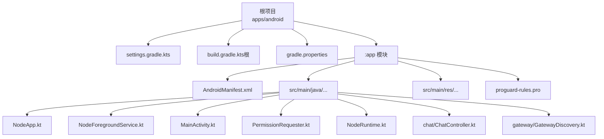
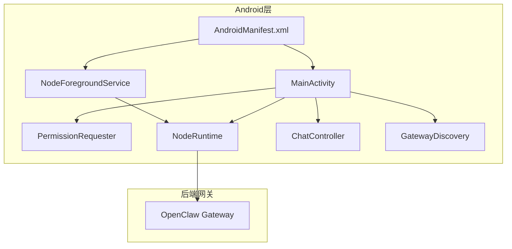
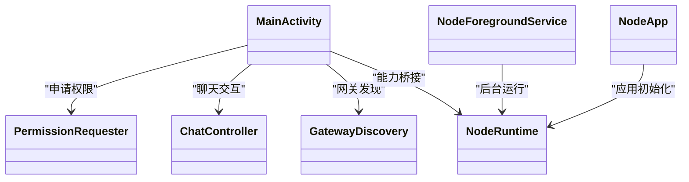
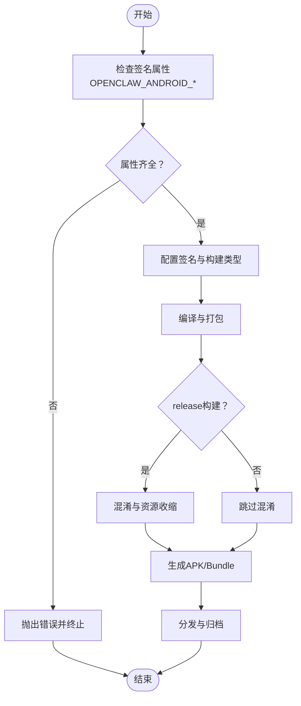

# Android节点

<cite>
**本文引用的文件**
- [apps/android/build.gradle.kts](file://apps/android/build.gradle.kts)
- [apps/android/app/build.gradle.kts](file://apps/android/app/build.gradle.kts)
- [apps/android/settings.gradle.kts](file://apps/android/settings.gradle.kts)
- [apps/android/gradle.properties](file://apps/android/gradle.properties)
- [apps/android/app/src/main/AndroidManifest.xml](file://apps/android/app/src/main/AndroidManifest.xml)
- [apps/android/app/proguard-rules.pro](file://apps/android/app/proguard-rules.pro)
- [apps/android/README.md](file://apps/android/README.md)
- [apps/android/app/src/main/java/ai/openclaw/app/NodeApp.kt](file://apps/android/app/src/main/java/ai/openclaw/app/NodeApp.kt)
- [apps/android/app/src/main/java/ai/openclaw/app/NodeForegroundService.kt](file://apps/android/app/src/main/java/ai/openclaw/app/NodeForegroundService.kt)
- [apps/android/app/src/main/java/ai/openclaw/app/MainActivity.kt](file://apps/android/app/src/main/java/ai/openclaw/app/MainActivity.kt)
- [apps/android/app/src/main/java/ai/openclaw/app/PermissionRequester.kt](file://apps/android/app/src/main/java/ai/openclaw/app/PermissionRequester.kt)
- [apps/android/app/src/main/java/ai/openclaw/app/NodeRuntime.kt](file://apps/android/app/src/main/java/ai/openclaw/app/NodeRuntime.kt)
- [apps/android/app/src/main/java/ai/openclaw/app/chat/ChatController.kt](file://apps/android/app/src/main/java/ai/openclaw/app/chat/ChatController.kt)
- [apps/android/app/src/main/java/ai/openclaw/app/gateway/GatewayDiscovery.kt](file://apps/android/app/src/main/java/ai/openclaw/app/gateway/GatewayDiscovery.kt)
</cite>

## 目录

1. [简介](#简介)
2. [项目结构](#项目结构)
3. [核心组件](#核心组件)
4. [架构总览](#架构总览)
5. [详细组件分析](#详细组件分析)
6. [依赖关系分析](#依赖关系分析)
7. [性能考虑](#性能考虑)
8. [故障排查指南](#故障排查指南)
9. [结论](#结论)
10. [附录](#附录)

## 简介

本文件面向Android节点（OpenClaw Node on Android）的开发者与维护者，系统化梳理其构建配置、APK打包与发布准备、平台能力（音频、摄像头、图像识别、位置服务、媒体理解、语音唤醒）、权限体系、后台服务与电池优化策略，并覆盖Gradle配置、混淆规则、多架构ABI支持与版本兼容性。同时提供Android Studio开发环境配置、调试方法与性能监控工具使用指南，帮助快速上手与稳定交付。

## 项目结构

Android节点位于apps/android目录，采用Gradle Kotlin DSL与Kotlin语言实现，核心模块为app子工程，包含应用清单、资源、前台服务、权限请求器、运行时桥接与聊天控制器等关键组件。settings.gradle.kts统一管理仓库源与模块包含；根级build.gradle.kts声明插件版本；gradle.properties集中控制Gradle与Android编译行为。

图表来源

- [apps/android/settings.gradle.kts:1-20](file://apps/android/settings.gradle.kts#L1-L20)
- [apps/android/build.gradle.kts:1-8](file://apps/android/build.gradle.kts#L1-L8)
- [apps/android/gradle.properties:1-10](file://apps/android/gradle.properties#L1-L10)
- [apps/android/app/src/main/AndroidManifest.xml:1-77](file://apps/android/app/src/main/AndroidManifest.xml#L1-L77)

章节来源

- [apps/android/settings.gradle.kts:1-20](file://apps/android/settings.gradle.kts#L1-L20)
- [apps/android/build.gradle.kts:1-8](file://apps/android/build.gradle.kts#L1-L8)
- [apps/android/gradle.properties:1-10](file://apps/android/gradle.properties#L1-L10)

## 核心组件

- 应用入口与生命周期：NodeApp负责应用初始化与全局状态；MainActivity承载UI与导航；NodeForegroundService以前台服务形式维持长连接与数据同步。
- 权限与安全：PermissionRequester封装运行时权限申请流程；NodeRuntime桥接Node能力与Android平台；SecurePrefs用于加密持久化。
- 能力适配层：GatewayDiscovery负责网关发现与连接；ChatController承载聊天交互与命令执行。
- 构建与打包：app/build.gradle.kts定义SDK版本、ABI过滤、混淆与签名策略；根级build.gradle.kts统一插件版本；gradle.properties启用AndroidX与R8全量模式。

章节来源

- [apps/android/app/src/main/java/ai/openclaw/app/NodeApp.kt](file://apps/android/app/src/main/java/ai/openclaw/app/NodeApp.kt)
- [apps/android/app/src/main/java/ai/openclaw/app/NodeForegroundService.kt](file://apps/android/app/src/main/java/ai/openclaw/app/NodeForegroundService.kt)
- [apps/android/app/src/main/java/ai/openclaw/app/MainActivity.kt](file://apps/android/app/src/main/java/ai/openclaw/app/MainActivity.kt)
- [apps/android/app/src/main/java/ai/openclaw/app/PermissionRequester.kt](file://apps/android/app/src/main/java/ai/openclaw/app/PermissionRequester.kt)
- [apps/android/app/src/main/java/ai/openclaw/app/NodeRuntime.kt](file://apps/android/app/src/main/java/ai/openclaw/app/NodeRuntime.kt)
- [apps/android/app/src/main/java/ai/openclaw/app/chat/ChatController.kt](file://apps/android/app/src/main/java/ai/openclaw/app/chat/ChatController.kt)
- [apps/android/app/src/main/java/ai/openclaw/app/gateway/GatewayDiscovery.kt](file://apps/android/app/src/main/java/ai/openclaw/app/gateway/GatewayDiscovery.kt)

## 架构总览

Android节点通过NodeRuntime桥接到后端网关，前台服务保障后台运行，权限请求器在合适时机申请必要权限，聊天控制器与网关发现模块协同完成消息与设备发现能力。应用清单声明所需权限与服务，proguard-rules.pro确保关键类与序列化规则不被混淆。

图表来源

- [apps/android/app/src/main/AndroidManifest.xml:1-77](file://apps/android/app/src/main/AndroidManifest.xml#L1-L77)
- [apps/android/app/src/main/java/ai/openclaw/app/MainActivity.kt](file://apps/android/app/src/main/java/ai/openclaw/app/MainActivity.kt)
- [apps/android/app/src/main/java/ai/openclaw/app/NodeForegroundService.kt](file://apps/android/app/src/main/java/ai/openclaw/app/NodeForegroundService.kt)
- [apps/android/app/src/main/java/ai/openclaw/app/PermissionRequester.kt](file://apps/android/app/src/main/java/ai/openclaw/app/PermissionRequester.kt)
- [apps/android/app/src/main/java/ai/openclaw/app/NodeRuntime.kt](file://apps/android/app/src/main/java/ai/openclaw/app/NodeRuntime.kt)
- [apps/android/app/src/main/java/ai/openclaw/app/chat/ChatController.kt](file://apps/android/app/src/main/java/ai/openclaw/app/chat/ChatController.kt)
- [apps/android/app/src/main/java/ai/openclaw/app/gateway/GatewayDiscovery.kt](file://apps/android/app/src/main/java/ai/openclaw/app/gateway/GatewayDiscovery.kt)

## 详细组件分析

### 构建与打包配置

- 插件与版本：根级build.gradle.kts统一声明Android应用、测试、Ktlint、Compose与Serialization插件版本，避免子模块重复配置。
- 模块与仓库：settings.gradle.kts集中管理仓库源与模块包含，确保依赖解析一致性。
- 编译与目标：app/build.gradle.kts设置compileSdk/targetSdk/minSdk、Java 17兼容、Compose与BuildConfig开启。
- ABI与打包：defaultConfig中启用四架构ABI过滤，减少包体并覆盖主流设备；打包排除大量无关资源，降低DEX体积。
- 混淆与资源压缩：release类型开启混淆与资源收缩，使用默认优化规则与自定义proguard-rules.pro；debug关闭混淆便于调试。
- 输出命名：androidComponents钩子按版本名与构建类型重命名输出APK，便于分发与归档。
- Gradle属性：gradle.properties启用AndroidX、R8全量模式、严格约束等，提升构建稳定性与产物质量。

章节来源

- [apps/android/build.gradle.kts:1-8](file://apps/android/build.gradle.kts#L1-L8)
- [apps/android/settings.gradle.kts:1-20](file://apps/android/settings.gradle.kts#L1-L20)
- [apps/android/app/build.gradle.kts:40-125](file://apps/android/app/build.gradle.kts#L40-L125)
- [apps/android/app/build.gradle.kts:127-145](file://apps/android/app/build.gradle.kts#L127-L145)
- [apps/android/gradle.properties:1-10](file://apps/android/gradle.properties#L1-L10)

### 权限系统与后台服务

- 权限清单：AndroidManifest.xml声明网络、通知、定位、相机、录音、短信、媒体读取、联系人、日历、运动识别、近场WiFi设备等权限，满足节点能力需求。
- 运行时权限：PermissionRequester在合适时机发起权限申请，确保节点功能可用。
- 前台服务：NodeForegroundService以“数据同步”类型注册，配合通知保持前台运行，规避系统限制。
- 通知监听：注册NotificationListenerService以接收系统通知事件，结合权限与服务声明使用。

章节来源

- [apps/android/app/src/main/AndroidManifest.xml:1-77](file://apps/android/app/src/main/AndroidManifest.xml#L1-L77)
- [apps/android/app/src/main/java/ai/openclaw/app/PermissionRequester.kt](file://apps/android/app/src/main/java/ai/openclaw/app/PermissionRequester.kt)
- [apps/android/app/src/main/java/ai/openclaw/app/NodeForegroundService.kt](file://apps/android/app/src/main/java/ai/openclaw/app/NodeForegroundService.kt)

### 音频处理

- 录音权限：Manifest声明RECORD_AUDIO权限，满足录音与音频输入场景。
- 组件与库：app/build.gradle.kts引入OkHttp、Kotlin协程与序列化库，支撑网络传输与数据处理。
- 使用建议：在需要录音的节点能力调用前，通过PermissionRequester申请权限并处理拒绝场景；音频数据经NodeRuntime上传至网关或本地处理。

章节来源

- [apps/android/app/src/main/AndroidManifest.xml:13](file://apps/android/app/src/main/AndroidManifest.xml#L13)
- [apps/android/app/build.gradle.kts:178-189](file://apps/android/app/build.gradle.kts#L178-L189)

### 摄像头管理与图像识别

- 摄像权限：Manifest声明CAMERA权限；CameraX相关依赖已引入，满足拍照与视频录制能力。
- 图像读取：Manifest声明READ_MEDIA_IMAGES与READ_MEDIA_VISUAL_USER_SELECTED，满足从相册选择图片场景。
- 组件与库：app/build.gradle.kts引入CameraX核心、Lifecycle、Video、View与ZXing二维码扫描库，支撑节点camera.\*能力。
- 使用建议：在调用camera.snap/camera.clip前，通过PermissionRequester申请CAMERA与RECORD_AUDIO（如包含音频），并在UI层使用CameraX预览与捕获。

章节来源

- [apps/android/app/src/main/AndroidManifest.xml:12-16](file://apps/android/app/src/main/AndroidManifest.xml#L12-L16)
- [apps/android/app/build.gradle.kts:191-197](file://apps/android/app/build.gradle.kts#L191-L197)

### 位置服务

- 定位权限：Manifest声明ACCESS_FINE_LOCATION与ACCESS_COARSE_LOCATION；Android 13+另需NEARBY_WIFI_DEVICES用于发现；Android 12及以下仍需ACCESS_FINE_LOCATION。
- 使用建议：在需要位置能力时，通过PermissionRequester申请权限；根据系统版本动态调整提示文案与降级策略。

章节来源

- [apps/android/app/src/main/AndroidManifest.xml:7-24](file://apps/android/app/src/main/AndroidManifest.xml#L7-L24)
- [apps/android/README.md:165-174](file://apps/android/README.md#L165-L174)

### 媒体理解与屏幕内容

- 屏幕内容：节点的屏幕内容能力（如A2UI）依赖于应用处于前台且Canvas WebView已就绪；集成能力测试要求保持前台与Screen标签激活。
- 使用建议：在进行屏幕内容相关操作前，确保应用在前台且Screen标签可见，避免“NODE_BACKGROUND_UNAVAILABLE”错误。

章节来源

- [apps/android/README.md:184-189](file://apps/android/README.md#L184-L189)

### 语音唤醒

- 词表与模式：项目内包含WakeWords与VoiceWakeMode等类，表明具备语音唤醒的基础能力组织。
- 使用建议：结合硬件与系统能力，在满足权限的前提下加载唤醒模型并进行唤醒检测；注意后台运行与电池优化对唤醒的影响。

章节来源

- [apps/android/app/src/main/java/ai/openclaw/app/VoiceWakeMode.kt](file://apps/android/app/src/main/java/ai/openclaw/app/VoiceWakeMode.kt)
- [apps/android/app/src/main/java/ai/openclaw/app/WakeWords.kt](file://apps/android/app/src/main/java/ai/openclaw/app/WakeWords.kt)

### Google Play发布准备

- 签名与密钥：app/build.gradle.kts在检测到完整签名参数时启用release签名；建议在~/.gradle/gradle.properties中配置密钥参数，避免提交到仓库。
- 发布类型：release构建开启混淆与资源收缩，适合发布；debug构建关闭混淆便于调试。
- 版本号：versionCode/versionName在defaultConfig中集中管理，遵循语义化版本策略。
- 输出命名：androidComponents钩子按版本名与构建类型生成APK文件名，便于分发。

章节来源

- [apps/android/app/build.gradle.kts:3-31](file://apps/android/app/build.gradle.kts#L3-L31)
- [apps/android/app/build.gradle.kts:74-86](file://apps/android/app/build.gradle.kts#L74-L86)
- [apps/android/app/build.gradle.kts:127-139](file://apps/android/app/build.gradle.kts#L127-L139)

### 混淆设置与多架构支持

- 混淆规则：proguard-rules.pro保留应用类、BouncyCastle、CameraX、kotlinx.serialization等关键类，避免混淆导致的运行时异常。
- 多架构：abiFilters启用armeabi-v7a、arm64-v8a、x86、x86_64，覆盖主流设备；release构建启用R8全量模式，进一步减小体积。

章节来源

- [apps/android/app/proguard-rules.pro:1-29](file://apps/android/app/proguard-rules.pro#L1-L29)
- [apps/android/app/build.gradle.kts:68-71](file://apps/android/app/build.gradle.kts#L68-L71)
- [apps/android/gradle.properties:5](file://apps/android/gradle.properties#L5)

### 版本兼容性

- SDK版本：compileSdk/targetSdk=36，minSdk=31，满足现代设备与系统特性；Compose与Material3等依赖版本在BOM中统一管理。
- Java版本：Java 17兼容，确保新语法与性能特性可用。
- AndroidX：启用AndroidX，保证向后兼容与现代化组件生态。

章节来源

- [apps/android/app/build.gradle.kts:42-46](file://apps/android/app/build.gradle.kts#L42-L46)
- [apps/android/app/build.gradle.kts:93-96](file://apps/android/app/build.gradle.kts#L93-L96)
- [apps/android/gradle.properties:3](file://apps/android/gradle.properties#L3)

### Android Studio开发环境与调试

- 开启方式：直接打开apps/android目录；Gradle自动检测Android SDK路径。
- 构建与安装：提供pnpm脚本与Gradle任务，支持Debug构建、安装与单元测试。
- 性能基准：包含Macrobenchmark与perf脚本，支持冷启动、帧时序与热点分析。
- 真机调试：启用开发者选项与USB调试，使用adb devices确认设备；支持adb reverse进行USB-only网关联调。
- 热重载：Compose UI支持Live Edit与Apply Changes，非结构性变更可快速迭代。

章节来源

- [apps/android/README.md:22-142](file://apps/android/README.md#L22-L142)
- [apps/android/README.md:143-229](file://apps/android/README.md#L143-L229)

## 依赖关系分析

- 组件耦合：MainActivity依赖PermissionRequester、ChatController与GatewayDiscovery；NodeRuntime作为桥接层被多个组件复用；NodeForegroundService与NodeApp共同保障运行时稳定性。
- 外部依赖：Compose BOM统一管理UI栈；OkHttp、Kotlinx系列、CameraX、Material等库按需引入；测试框架与MockWebServer用于单元与集成测试。
- 潜在循环：当前结构以NodeRuntime为中心向外辐射，未见明显循环依赖；建议后续通过接口抽象进一步解耦。

图表来源

- [apps/android/app/src/main/java/ai/openclaw/app/MainActivity.kt](file://apps/android/app/src/main/java/ai/openclaw/app/MainActivity.kt)
- [apps/android/app/src/main/java/ai/openclaw/app/PermissionRequester.kt](file://apps/android/app/src/main/java/ai/openclaw/app/PermissionRequester.kt)
- [apps/android/app/src/main/java/ai/openclaw/app/chat/ChatController.kt](file://apps/android/app/src/main/java/ai/openclaw/app/chat/ChatController.kt)
- [apps/android/app/src/main/java/ai/openclaw/app/gateway/GatewayDiscovery.kt](file://apps/android/app/src/main/java/ai/openclaw/app/gateway/GatewayDiscovery.kt)
- [apps/android/app/src/main/java/ai/openclaw/app/NodeRuntime.kt](file://apps/android/app/src/main/java/ai/openclaw/app/NodeRuntime.kt)
- [apps/android/app/src/main/java/ai/openclaw/app/NodeForegroundService.kt](file://apps/android/app/src/main/java/ai/openclaw/app/NodeForegroundService.kt)
- [apps/android/app/src/main/java/ai/openclaw/app/NodeApp.kt](file://apps/android/app/src/main/java/ai/openclaw/app/NodeApp.kt)

## 性能考虑

- 启动性能：使用Macrobenchmark与perf脚本进行冷启动与热点分析；保持Compose与WebView初始化逻辑轻量化。
- 包体与DEX：启用R8全量模式与资源收缩；ABI仅保留四大架构；排除无关资源与版本文件。
- 后台与电量：前台服务配合通知，避免被系统回收；合理安排任务调度，避免频繁唤醒；在权限允许范围内使用系统能力（如位置、通知监听）。

[本节为通用指导，无需列出章节来源]

## 故障排查指南

- 权限相关
  - 症状：节点能力调用失败或弹窗拒绝。
  - 排查：确认AndroidManifest.xml权限声明与运行时申请流程；检查PermissionRequester是否正确触发。
- 网关连接
  - 症状：无法连接或超时。
  - 排查：确认GatewayDiscovery配置与网络可达性；USB-only联调时使用adb reverse；检查网关TLS与端口设置。
- 屏幕内容不可用
  - 症状：A2UI相关报错或“NODE_BACKGROUND_UNAVAILABLE”。
  - 排查：确保应用处于前台且Screen标签激活；确认Canvas主机已启动并可达。
- 集成能力测试失败
  - 症状：测试中断或断言失败。
  - 排查：按README中的预置条件逐项核对；批准设备配对请求；确保测试期间无系统弹窗阻塞。

章节来源

- [apps/android/README.md:165-229](file://apps/android/README.md#L165-L229)

## 结论

Android节点以清晰的模块划分与现代化的构建配置为基础，围绕NodeRuntime形成能力桥接，辅以前台服务、权限请求器与网关发现模块，覆盖音频、摄像头、图像识别、位置服务、媒体理解与语音唤醒等核心能力。通过严格的混淆与ABI策略、完善的权限与后台运行机制，以及系统化的性能监控与调试工具链，能够稳定支撑Alpha阶段的功能演进与后续发布准备。

[本节为总结性内容，无需列出章节来源]

## 附录

### 构建与发布流程图

图表来源

- [apps/android/app/build.gradle.kts:3-31](file://apps/android/app/build.gradle.kts#L3-L31)
- [apps/android/app/build.gradle.kts:74-86](file://apps/android/app/build.gradle.kts#L74-L86)
- [apps/android/app/build.gradle.kts:127-139](file://apps/android/app/build.gradle.kts#L127-L139)
