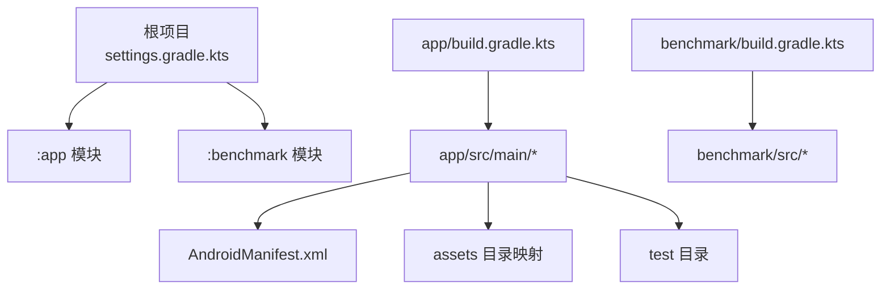
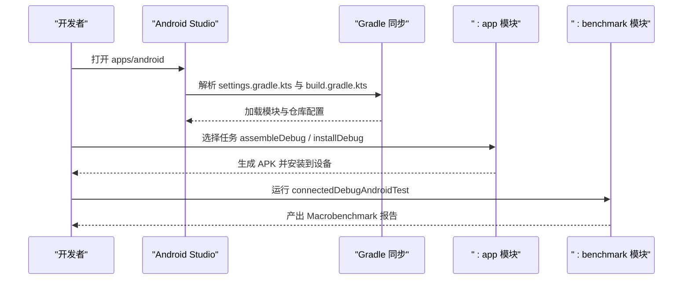
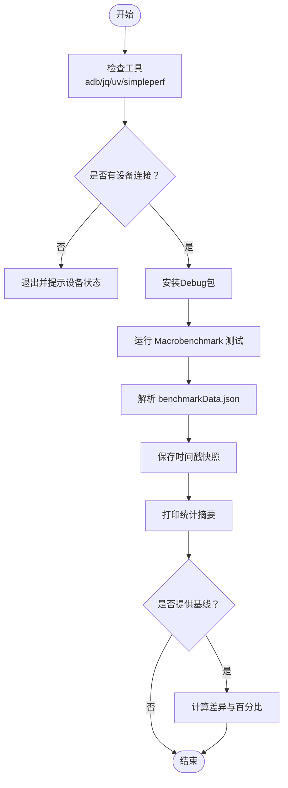
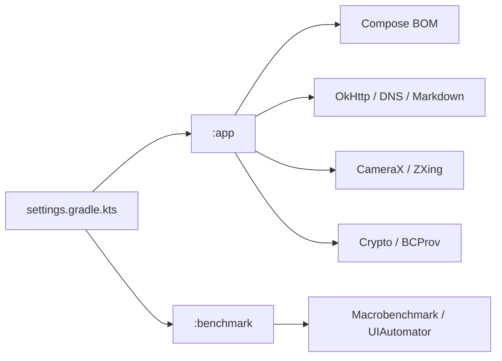

# 开发环境配置

<cite>
**本文档引用的文件**
- [apps/android/README.md](file://apps/android/README.md)
- [apps/android/build.gradle.kts](file://apps/android/build.gradle.kts)
- [apps/android/settings.gradle.kts](file://apps/android/settings.gradle.kts)
- [apps/android/gradle.properties](file://apps/android/gradle.properties)
- [apps/android/app/build.gradle.kts](file://apps/android/app/build.gradle.kts)
- [apps/android/benchmark/build.gradle.kts](file://apps/android/benchmark/build.gradle.kts)
- [apps/android/app/src/main/AndroidManifest.xml](file://apps/android/app/src/main/AndroidManifest.xml)
- [apps/android/style.md](file://apps/android/style.md)
- [apps/android/scripts/perf-startup-benchmark.sh](file://apps/android/scripts/perf-startup-benchmark.sh)
- [apps/android/scripts/perf-startup-hotspots.sh](file://apps/android/scripts/perf-startup-hotspots.sh)
</cite>

## 目录

1. [简介](#简介)
2. [项目结构](#项目结构)
3. [核心组件](#核心组件)
4. [架构总览](#架构总览)
5. [详细组件分析](#详细组件分析)
6. [依赖关系分析](#依赖关系分析)
7. [性能考虑](#性能考虑)
8. [故障排除指南](#故障排除指南)
9. [结论](#结论)
10. [附录](#附录)

## 简介

本文件面向Android开发者，提供从零到一的完整开发环境配置指南。内容覆盖Android Studio安装与项目导入、Gradle构建配置、多模块项目结构与依赖管理、Android SDK与API级别要求、代码格式化与资源检查、开发工具链与调试准备、以及性能测试工具使用方法。目标是帮助你快速搭建可运行、可维护、可测试的Android开发环境。

## 项目结构

OpenClaw Android子项目位于 apps/android，采用多模块结构：根级settings包含应用模块与基准测试模块；应用模块负责主应用与单元测试；基准模块负责连接式性能测试（Macrobenchmark）。

图表来源

- [apps/android/settings.gradle.kts](file://apps/android/settings.gradle.kts)
- [apps/android/app/build.gradle.kts](file://apps/android/app/build.gradle.kts)
- [apps/android/benchmark/build.gradle.kts](file://apps/android/benchmark/build.gradle.kts)
- [apps/android/app/src/main/AndroidManifest.xml](file://apps/android/app/src/main/AndroidManifest.xml)

章节来源

- [apps/android/settings.gradle.kts](file://apps/android/settings.gradle.kts)
- [apps/android/app/build.gradle.kts](file://apps/android/app/build.gradle.kts)
- [apps/android/benchmark/build.gradle.kts](file://apps/android/benchmark/build.gradle.kts)

## 核心组件

- 多模块Gradle工程：根settings声明模块，app为应用模块，benchmark为测试模块。
- 构建脚本：Kotlin DSL，统一配置compileSdk、minSdk、targetSdk、Java/Kotlin编译选项、签名配置、打包与资源排除。
- 依赖管理：Compose BOM统一版本，网络、安全、相机、DNS等库按需引入。
- 资源与清单：权限、服务、Provider、Activity声明齐全；支持通知、相机、位置、存储等能力。
- 工具链：Ktlint格式与检查、Android资源Lint、宏基准测试、启动性能脚本。

章节来源

- [apps/android/build.gradle.kts](file://apps/android/build.gradle.kts)
- [apps/android/app/build.gradle.kts](file://apps/android/app/build.gradle.kts)
- [apps/android/benchmark/build.gradle.kts](file://apps/android/benchmark/build.gradle.kts)
- [apps/android/app/src/main/AndroidManifest.xml](file://apps/android/app/src/main/AndroidManifest.xml)

## 架构总览

下图展示Android Studio导入、Gradle同步、构建与安装的关键流程。

图表来源

- [apps/android/settings.gradle.kts](file://apps/android/settings.gradle.kts)
- [apps/android/app/build.gradle.kts](file://apps/android/app/build.gradle.kts)
- [apps/android/benchmark/build.gradle.kts](file://apps/android/benchmark/build.gradle.kts)

## 详细组件分析

### Android Studio安装与项目导入

- 安装Android Studio后，直接打开 apps/android 文件夹即可导入工程。
- 首次导入会触发Gradle同步，自动解析settings与各模块build脚本。
- 如未自动识别SDK，请在IDE中设置Android SDK路径或通过环境变量ANDROID_SDK_ROOT/ANDROID_HOME指向SDK目录。

章节来源

- [apps/android/README.md](file://apps/android/README.md)

### Gradle构建配置与多模块结构

- 根级插件与仓库：在根build脚本中集中声明Android Application/Test插件、Ktlint、Compose与Serialization插件；settings中统一仓库源与解析策略。
- 模块包含：settings中显式include app与benchmark模块。
- 全局属性：gradle.properties启用AndroidX、R8全量优化、新DSL等，提升兼容性与产物体积优化。

章节来源

- [apps/android/build.gradle.kts](file://apps/android/build.gradle.kts)
- [apps/android/settings.gradle.kts](file://apps/android/settings.gradle.kts)
- [apps/android/gradle.properties](file://apps/android/gradle.properties)

### 应用模块配置（:app）

- SDK与编译选项：compileSdk、minSdk、targetSdk明确；Java/Kotlin均使用JDK 17。
- 签名配置：支持本地release签名，缺失时构建阶段报错提示；debug默认不启用混淆。
- 打包与资源：排除非必要META-INF与调试文件；开启资源压缩与代码混淆以减小体积。
- Compose与BuildConfig：启用Compose UI与BuildConfig生成。
- 依赖：通过Compose BOM统一版本，引入核心UI、导航、网络、安全、相机、DNS等库。
- 输出命名：变体输出重命名为 openclaw-{versionName}-{buildType}.apk。

章节来源

- [apps/android/app/build.gradle.kts](file://apps/android/app/build.gradle.kts)

### 基准模块配置（:benchmark）

- 测试运行器：指定AndroidJUnitRunner，并抑制部分非关键错误。
- 目标模块：targetProjectPath指向:app，实现对主应用的自测式基准。
- 编译选项：JDK 17；ktlint启用；依赖Macrobenchmark与UIAutomator。

章节来源

- [apps/android/benchmark/build.gradle.kts](file://apps/android/benchmark/build.gradle.kts)

### Android SDK配置、API级别与最低系统版本

- compileSdk：36
- targetSdk：36
- minSdk：31（对应Android 12，满足Live Edit与前台服务等特性）
- JDK：Java 17（Kotlin/JVM 17）

章节来源

- [apps/android/app/build.gradle.kts](file://apps/android/app/build.gradle.kts)
- [apps/android/benchmark/build.gradle.kts](file://apps/android/benchmark/build.gradle.kts)

### 权限与清单配置

- 网络与通知：INTERNET、ACCESS_NETWORK_STATE、FOREGROUND_SERVICE、FOREGROUND_SERVICE_DATA_SYNC、POST_NOTIFICATIONS。
- 发现与定位：NEARBLY_WIFI_DEVICES（标记neverForLocation）、ACCESS_FINE_LOCATION、ACCESS_COARSE_LOCATION。
- 摄像头与录音：CAMERA、RECORD_AUDIO。
- 存储与联系人日历：READ/MEDIA\_\*、READ_EXTERNAL_STORAGE（限制至SDK 32）、READ/WRITE_CONTACTS、READ/WRITE_CALENDAR。
- 设备功能：相机、电话硬件可选。
- 服务与Provider：前台服务、通知监听服务、FileProvider。
- Activity：MainActivity作为Launcher。

章节来源

- [apps/android/app/src/main/AndroidManifest.xml](file://apps/android/app/src/main/AndroidManifest.xml)

### 代码格式化与资源检查

- Kotlin格式与检查：通过Ktlint插件执行ktlintCheck/ktlintFormat；全局禁用失败忽略，过滤build目录。
- Android资源Lint：提供独立命令pnpm android:lint:android进行资源校验。
- 统一风格：Jetpack Compose UI遵循style.md中的设计令牌、排版、布局与可访问性规范。

章节来源

- [apps/android/app/build.gradle.kts](file://apps/android/app/build.gradle.kts)
- [apps/android/benchmark/build.gradle.kts](file://apps/android/benchmark/build.gradle.kts)
- [apps/android/style.md](file://apps/android/style.md)

### 开发工具链与调试准备

- 真机调试：启用开发者选项与USB调试，使用adb devices确认设备；支持adb reverse建立端口转发。
- 快速迭代：Live Edit（物理机调试）、Apply Changes（多数非结构性变更）、结构性变更需重新安装。
- 连接配对：启动网关，使用Connect标签页的“Setup Code”或“Manual”模式完成配对；批准设备请求。

章节来源

- [apps/android/README.md](file://apps/android/README.md)

### 性能测试工具使用

- 宏基准（Startup + 帧时序）：运行 :benchmark:connectedDebugAndroidTest，报告输出在 benchmark/build/reports/androidTests/connected/。
- 启动性能脚本：perf-startup-benchmark.sh仅运行coldStartup，输出中位数/最小值/最大值/CoeffOfVariation，并保存带时间戳的快照JSON。
- 热点分析脚本：perf-startup-hotspots.sh通过simpleperf采集CPU数据，输出Top DSO、Top Symbols及关键路径线索（Compose/MainActivity/NodeRuntime/WebView等），支持自定义包名与Activity。

图表来源

- [apps/android/scripts/perf-startup-benchmark.sh](file://apps/android/scripts/perf-startup-benchmark.sh)
- [apps/android/scripts/perf-startup-hotspots.sh](file://apps/android/scripts/perf-startup-hotspots.sh)

章节来源

- [apps/android/README.md](file://apps/android/README.md)
- [apps/android/scripts/perf-startup-benchmark.sh](file://apps/android/scripts/perf-startup-benchmark.sh)
- [apps/android/scripts/perf-startup-hotspots.sh](file://apps/android/scripts/perf-startup-hotspots.sh)

## 依赖关系分析

- 模块耦合：benchmark通过targetProjectPath依赖app；app依赖Compose BOM与各类Android/第三方库。
- 仓库与解析：根settings统一仓库源，避免项目级重复配置。
- 插件与版本：根build集中声明插件版本，app与benchmark各自启用所需插件。

图表来源

- [apps/android/settings.gradle.kts](file://apps/android/settings.gradle.kts)
- [apps/android/app/build.gradle.kts](file://apps/android/app/build.gradle.kts)
- [apps/android/benchmark/build.gradle.kts](file://apps/android/benchmark/build.gradle.kts)

章节来源

- [apps/android/settings.gradle.kts](file://apps/android/settings.gradle.kts)
- [apps/android/app/build.gradle.kts](file://apps/android/app/build.gradle.kts)
- [apps/android/benchmark/build.gradle.kts](file://apps/android/benchmark/build.gradle.kts)

## 性能考虑

- 启动性能：使用Macrobenchmark聚焦冷启动与帧时序；结合perf-startup-benchmark.sh输出统计指标，便于回归对比。
- 热点定位：通过perf-startup-hotspots.sh抓取simpleperf数据，提取DSO与符号热点，结合正则线索定位关键路径。
- 产物体积：开启R8全量优化、资源压缩与代码混淆；排除调试与非必要文件，降低APK体积。
- 运行时条件：确保设备处于前台、已授予所需权限、Canvas WebView已就绪，避免测试抖动。

章节来源

- [apps/android/app/build.gradle.kts](file://apps/android/app/build.gradle.kts)
- [apps/android/scripts/perf-startup-benchmark.sh](file://apps/android/scripts/perf-startup-benchmark.sh)
- [apps/android/scripts/perf-startup-hotspots.sh](file://apps/android/scripts/perf-startup-hotspots.sh)

## 故障排除指南

- 设备未授权/未连接：执行adb devices -l核对状态，必要时重新插拔并接受信任提示。
- 缺少ADB：安装Android Platform Tools并加入PATH。
- 缺少simpleperf：设置ANDROID_NDK_HOME或在~/Library/Android/sdk/ndk/下安装NDK；脚本会自动查找最新simpleperf。
- 缺少jq：安装jq以解析benchmarkData.json。
- 缺少uv：安装uv以运行Python脚本（app_profiler.py、report.py）。
- 无可用设备：脚本检测到设备数量不足会直接退出并提示。
- 基线文件缺失：若提供--baseline但文件不存在，脚本会报错并退出。
- 网关连通性：使用adb reverse建立本地端口转发，确保应用通过127.0.0.1:18789访问本机网关。
- 权限问题：确保在Connect/Manual中关闭TLS、正确填写主机与端口；在设备上授予相机/录音/通知等权限。

章节来源

- [apps/android/README.md](file://apps/android/README.md)
- [apps/android/scripts/perf-startup-benchmark.sh](file://apps/android/scripts/perf-startup-benchmark.sh)
- [apps/android/scripts/perf-startup-hotspots.sh](file://apps/android/scripts/perf-startup-hotspots.sh)

## 结论

通过本指南，你可以完成Android Studio导入、Gradle同步、构建与安装、权限与清单配置、代码风格与资源检查、以及性能测试全流程。建议在本地保留稳定的SDK与NDK路径，配合adb与uv工具，形成可复现的性能回归体系，持续优化启动与运行时表现。

## 附录

- 常用命令速查
  - 导入：打开 apps/android
  - 构建与安装：./gradlew :app:assembleDebug / :app:installDebug
  - 单元测试：./gradlew :app:testDebugUnitTest
  - 资源Lint：pnpm android:lint:android
  - 宏基准：./gradlew :benchmark:connectedDebugAndroidTest
  - 启动性能：./scripts/perf-startup-benchmark.sh
  - 热点分析：./scripts/perf-startup-hotspots.sh

章节来源

- [apps/android/README.md](file://apps/android/README.md)
