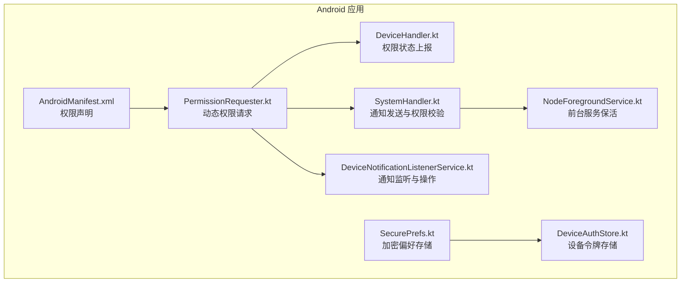
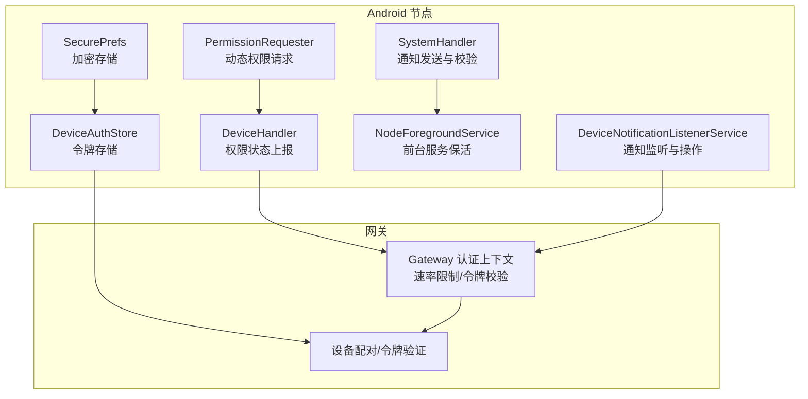
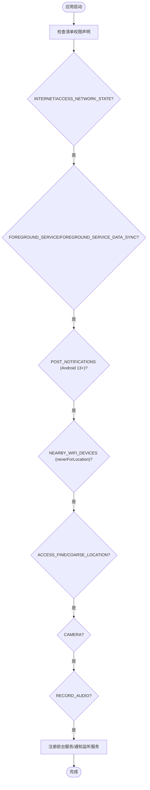
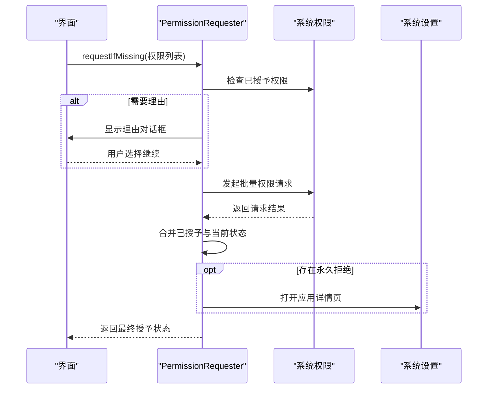
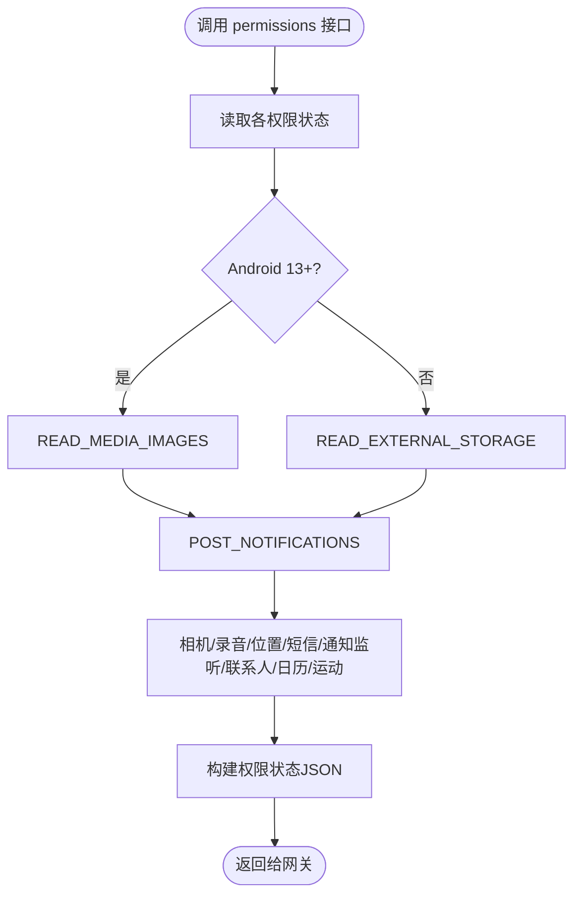
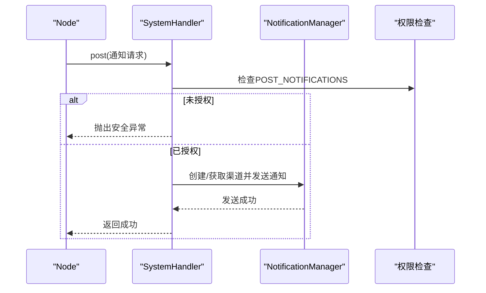
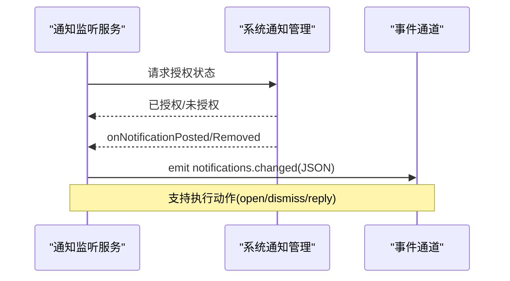
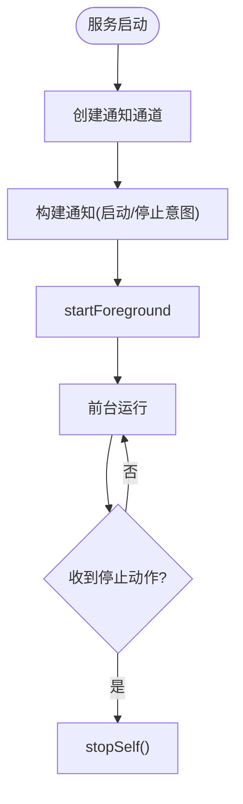
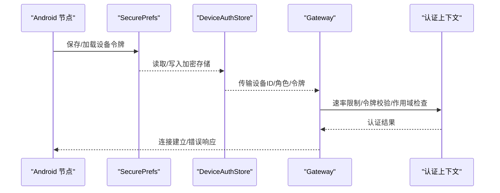
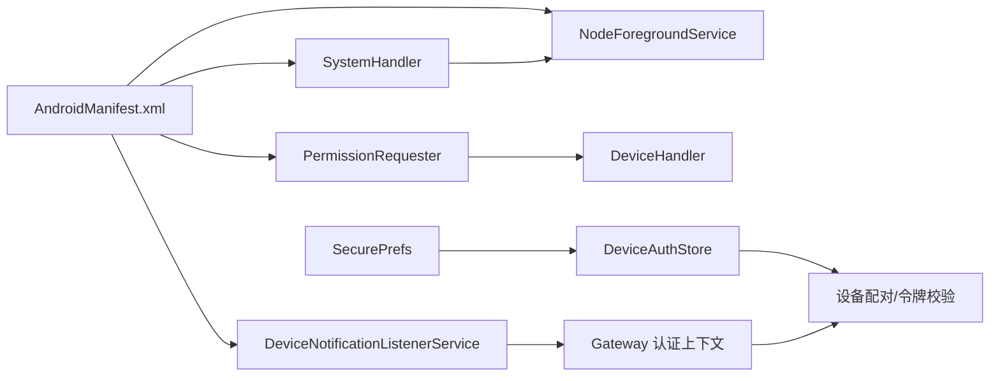

# 权限管理与安全

<cite>
**本文引用的文件**
- [AndroidManifest.xml](file://apps/android/app/src/main/AndroidManifest.xml)
- [PermissionRequester.kt](file://apps/android/app/src/main/java/ai/openclaw/app/PermissionRequester.kt)
- [DeviceHandler.kt](file://apps/android/app/src/main/java/ai/openclaw/app/node/DeviceHandler.kt)
- [SystemHandler.kt](file://apps/android/app/src/main/java/ai/openclaw/app/node/SystemHandler.kt)
- [DeviceNotificationListenerService.kt](file://apps/android/app/src/main/java/ai/openclaw/app/node/DeviceNotificationListenerService.kt)
- [NodeForegroundService.kt](file://apps/android/app/src/main/java/ai/openclaw/app/NodeForegroundService.kt)
- [SecurePrefs.kt](file://apps/android/app/src/main/java/ai/openclaw/app/SecurePrefs.kt)
- [DeviceAuthStore.kt](file://apps/android/app/src/main/java/ai/openclaw/app/gateway/DeviceAuthStore.kt)
- [android.md](file://docs/platforms/android.md)
- [auth-context.ts](file://src/gateway/server/ws-connection/auth-context.ts)
- [device-pairing.ts](file://src/infra/device-pairing.ts)
- [SECURITY.md](file://SECURITY.md)
</cite>

## 目录

1. [简介](#简介)
2. [项目结构](#项目结构)
3. [核心组件](#核心组件)
4. [架构总览](#架构总览)
5. [详细组件分析](#详细组件分析)
6. [依赖关系分析](#依赖关系分析)
7. [性能考虑](#性能考虑)
8. [故障排查指南](#故障排查指南)
9. [结论](#结论)
10. [附录](#附录)

## 简介

本文件聚焦于Android平台的权限管理与安全机制，覆盖Android 13+新增权限（如NEARBY_WIFI_DEVICES、POST_NOTIFICATIONS等）、相机与录音权限的申请流程，以及前台服务通知权限、位置权限、通知监听器权限的实现方式。同时阐述应用侧的安全策略、设备令牌处理机制与生物识别锁定能力的边界，并提供权限状态检查、动态权限请求与拒绝处理的最佳实践与合规建议。

## 项目结构

Android相关实现主要位于apps/android/app模块中，涉及权限声明、运行时请求、系统通知与通知监听服务、前台服务保活、安全存储与设备令牌持久化等。文档与平台说明位于docs目录。

**图表来源**

- [AndroidManifest.xml:1-77](file://apps/android/app/src/main/AndroidManifest.xml#L1-L77)
- [PermissionRequester.kt:1-134](file://apps/android/app/src/main/java/ai/openclaw/app/PermissionRequester.kt#L1-L134)
- [DeviceHandler.kt:1-399](file://apps/android/app/src/main/java/ai/openclaw/app/node/DeviceHandler.kt#L1-L399)
- [SystemHandler.kt:46-98](file://apps/android/app/src/main/java/ai/openclaw/app/node/SystemHandler.kt#L46-L98)
- [DeviceNotificationListenerService.kt:1-378](file://apps/android/app/src/main/java/ai/openclaw/app/node/DeviceNotificationListenerService.kt#L1-L378)
- [NodeForegroundService.kt:1-112](file://apps/android/app/src/main/java/ai/openclaw/app/NodeForegroundService.kt#L1-L112)
- [SecurePrefs.kt:1-256](file://apps/android/app/src/main/java/ai/openclaw/app/SecurePrefs.kt#L1-L256)
- [DeviceAuthStore.kt:1-32](file://apps/android/app/src/main/java/ai/openclaw/app/gateway/DeviceAuthStore.kt#L1-L32)

**章节来源**

- [AndroidManifest.xml:1-77](file://apps/android/app/src/main/AndroidManifest.xml#L1-L77)
- [android.md:1-165](file://docs/platforms/android.md#L1-L165)

## 核心组件

- 权限声明与前台服务：在清单中声明网络、前台服务、通知、Wi-Fi直连、位置、相机、录音等权限，并注册前台服务与通知监听服务。
- 动态权限请求：通过统一的PermissionRequester封装多权限批量请求、理由说明与设置引导。
- 权限状态上报：DeviceHandler聚合并上报各类权限状态（含通知监听与通知权限）。
- 通知发送与权限校验：SystemHandler在发送通知前进行权限校验，确保Android 13+的POST_NOTIFICATIONS权限已授予。
- 通知监听与操作：DeviceNotificationListenerService监听系统通知变化并支持打开、清除、回复等操作。
- 前台服务保活：NodeForegroundService以低重要性通知持续运行，维持连接稳定。
- 安全存储与令牌：SecurePrefs使用加密SharedPreferences存储敏感信息；DeviceAuthStore负责设备令牌的键空间组织与持久化。
- 网关侧认证上下文：Gateway侧对设备令牌进行速率限制、校验与作用域控制，保障接入安全。

**章节来源**

- [AndroidManifest.xml:1-77](file://apps/android/app/src/main/AndroidManifest.xml#L1-L77)
- [PermissionRequester.kt:1-134](file://apps/android/app/src/main/java/ai/openclaw/app/PermissionRequester.kt#L1-L134)
- [DeviceHandler.kt:130-225](file://apps/android/app/src/main/java/ai/openclaw/app/node/DeviceHandler.kt#L130-L225)
- [SystemHandler.kt:46-98](file://apps/android/app/src/main/java/ai/openclaw/app/node/SystemHandler.kt#L46-L98)
- [DeviceNotificationListenerService.kt:128-272](file://apps/android/app/src/main/java/ai/openclaw/app/node/DeviceNotificationListenerService.kt#L128-L272)
- [NodeForegroundService.kt:20-112](file://apps/android/app/src/main/java/ai/openclaw/app/NodeForegroundService.kt#L20-L112)
- [SecurePrefs.kt:18-237](file://apps/android/app/src/main/java/ai/openclaw/app/SecurePrefs.kt#L18-L237)
- [DeviceAuthStore.kt:1-32](file://apps/android/app/src/main/java/ai/openclaw/app/gateway/DeviceAuthStore.kt#L1-L32)
- [auth-context.ts:180-218](file://src/gateway/server/ws-connection/auth-context.ts#L180-L218)
- [device-pairing.ts:470-508](file://src/infra/device-pairing.ts#L470-L508)

## 架构总览

Android节点通过前台服务维持与网关的WebSocket连接，动态请求所需权限并在权限变更时上报状态。SystemHandler在需要推送系统通知时进行权限校验；DeviceNotificationListenerService在获得系统授权后监听通知变化并向网关推送事件。设备令牌由SecurePrefs加密存储，DeviceAuthStore负责键空间管理，Gateway侧在握手阶段进行速率限制与令牌校验。

**图表来源**

- [PermissionRequester.kt:1-134](file://apps/android/app/src/main/java/ai/openclaw/app/PermissionRequester.kt#L1-L134)
- [DeviceHandler.kt:130-225](file://apps/android/app/src/main/java/ai/openclaw/app/node/DeviceHandler.kt#L130-L225)
- [SystemHandler.kt:46-98](file://apps/android/app/src/main/java/ai/openclaw/app/node/SystemHandler.kt#L46-L98)
- [DeviceNotificationListenerService.kt:128-272](file://apps/android/app/src/main/java/ai/openclaw/app/node/DeviceNotificationListenerService.kt#L128-L272)
- [NodeForegroundService.kt:20-112](file://apps/android/app/src/main/java/ai/openclaw/app/NodeForegroundService.kt#L20-L112)
- [SecurePrefs.kt:18-237](file://apps/android/app/src/main/java/ai/openclaw/app/SecurePrefs.kt#L18-L237)
- [DeviceAuthStore.kt:1-32](file://apps/android/app/src/main/java/ai/openclaw/app/gateway/DeviceAuthStore.kt#L1-L32)
- [auth-context.ts:180-218](file://src/gateway/server/ws-connection/auth-context.ts#L180-L218)
- [device-pairing.ts:470-508](file://src/infra/device-pairing.ts#L470-L508)

## 详细组件分析

### Android 13+权限清单与前台服务

- 清单声明了互联网访问、网络状态、前台服务类型、通知权限（Android 13+）、Wi-Fi直连且不用于定位、位置权限、相机、录音、短信、媒体图片读取、联系人与日历、运动识别等。
- 注册前台服务与通知监听服务，绑定通知监听权限。

**图表来源**

- [AndroidManifest.xml:1-77](file://apps/android/app/src/main/AndroidManifest.xml#L1-L77)

**章节来源**

- [AndroidManifest.xml:1-77](file://apps/android/app/src/main/AndroidManifest.xml#L1-L77)

### 动态权限请求与拒绝处理

- 使用ActivityResultContracts.RequestMultiplePermissions发起批量请求。
- 对已拒绝但非“不应再提示”的情况，弹出理由对话框；若用户继续，则进入系统权限页。
- 合并已授予与当前状态，对永久拒绝的权限引导至设置页。

**图表来源**

- [PermissionRequester.kt:33-85](file://apps/android/app/src/main/java/ai/openclaw/app/PermissionRequester.kt#L33-L85)

**章节来源**

- [PermissionRequester.kt:1-134](file://apps/android/app/src/main/java/ai/openclaw/app/PermissionRequester.kt#L1-L134)

### 权限状态检查与上报

- DeviceHandler根据SDK版本差异判断媒体图片读取权限与通知权限，并汇总相机、麦克风、位置、短信、通知监听、通知、照片、联系人、日历、运动等权限状态。
- 提供promptable字段指示是否可再次触发系统权限弹窗。

**图表来源**

- [DeviceHandler.kt:130-225](file://apps/android/app/src/main/java/ai/openclaw/app/node/DeviceHandler.kt#L130-L225)

**章节来源**

- [DeviceHandler.kt:130-225](file://apps/android/app/src/main/java/ai/openclaw/app/node/DeviceHandler.kt#L130-L225)

### 通知发送与权限校验

- SystemHandler在发送通知前检查POST_NOTIFICATIONS权限（Android 13+），未授权则抛出安全异常。
- 自动创建或复用通知渠道，支持静音模式与优先级映射。

**图表来源**

- [SystemHandler.kt:46-98](file://apps/android/app/src/main/java/ai/openclaw/app/node/SystemHandler.kt#L46-L98)

**章节来源**

- [SystemHandler.kt:46-98](file://apps/android/app/src/main/java/ai/openclaw/app/node/SystemHandler.kt#L46-L98)

### 通知监听器权限与操作

- 通过NotificationManager.isNotificationListenerAccessGranted检测授权状态。
- 监听通知发布/移除事件，序列化为JSON并推送给网关。
- 支持打开、清除、回复等动作，针对不可清除通知进行约束。

**图表来源**

- [DeviceNotificationListenerService.kt:128-272](file://apps/android/app/src/main/java/ai/openclaw/app/node/DeviceNotificationListenerService.kt#L128-L272)

**章节来源**

- [DeviceNotificationListenerService.kt:1-378](file://apps/android/app/src/main/java/ai/openclaw/app/node/DeviceNotificationListenerService.kt#L1-L378)

### 前台服务保活与通知

- NodeForegroundService创建低重要性通知通道，启动前台服务以维持连接稳定。
- 通知点击跳转主界面，停止服务通过显式意图触发。

**图表来源**

- [NodeForegroundService.kt:20-112](file://apps/android/app/src/main/java/ai/openclaw/app/NodeForegroundService.kt#L20-L112)

**章节来源**

- [NodeForegroundService.kt:1-112](file://apps/android/app/src/main/java/ai/openclaw/app/NodeForegroundService.kt#L1-L112)

### 设备令牌处理与安全存储

- SecurePrefs使用AES256-GCM加密SharedPreferences存储网关令牌、密码与TLS指纹等敏感数据。
- DeviceAuthStore按“设备ID+角色”组织键空间，避免冲突并便于清理。
- Gateway侧在握手阶段进行速率限制、令牌校验与作用域检查，防止暴力破解与越权。

**图表来源**

- [SecurePrefs.kt:18-237](file://apps/android/app/src/main/java/ai/openclaw/app/SecurePrefs.kt#L18-L237)
- [DeviceAuthStore.kt:1-32](file://apps/android/app/src/main/java/ai/openclaw/app/gateway/DeviceAuthStore.kt#L1-L32)
- [auth-context.ts:180-218](file://src/gateway/server/ws-connection/auth-context.ts#L180-L218)
- [device-pairing.ts:470-508](file://src/infra/device-pairing.ts#L470-L508)

**章节来源**

- [SecurePrefs.kt:1-256](file://apps/android/app/src/main/java/ai/openclaw/app/SecurePrefs.kt#L1-L256)
- [DeviceAuthStore.kt:1-32](file://apps/android/app/src/main/java/ai/openclaw/app/gateway/DeviceAuthStore.kt#L1-L32)
- [auth-context.ts:180-218](file://src/gateway/server/ws-connection/auth-context.ts#L180-L218)
- [device-pairing.ts:470-508](file://src/infra/device-pairing.ts#L470-L508)

### 生物识别锁定与安全策略

- 仓库安全策略明确信任模型与边界，强调仅在满足认证、策略与沙箱边界的情况下才构成漏洞。
- 平台侧未实现生物识别锁定功能，安全存储与令牌处理遵循加密首选项与严格的键空间设计。

**章节来源**

- [SECURITY.md:48-131](file://SECURITY.md#L48-L131)

## 依赖关系分析

- 权限声明依赖Android系统权限模型；动态请求依赖Activity Result API；通知发送依赖NotificationManager；通知监听依赖NotificationListenerService；前台服务依赖系统前台服务类型；令牌存储依赖AndroidX EncryptedSharedPreferences。
- 网关侧认证上下文与设备配对逻辑共同构成接入安全防线。

**图表来源**

- [AndroidManifest.xml:1-77](file://apps/android/app/src/main/AndroidManifest.xml#L1-L77)
- [PermissionRequester.kt:1-134](file://apps/android/app/src/main/java/ai/openclaw/app/PermissionRequester.kt#L1-L134)
- [DeviceHandler.kt:1-399](file://apps/android/app/src/main/java/ai/openclaw/app/node/DeviceHandler.kt#L1-L399)
- [SystemHandler.kt:46-98](file://apps/android/app/src/main/java/ai/openclaw/app/node/SystemHandler.kt#L46-L98)
- [DeviceNotificationListenerService.kt:1-378](file://apps/android/app/src/main/java/ai/openclaw/app/node/DeviceNotificationListenerService.kt#L1-L378)
- [NodeForegroundService.kt:1-112](file://apps/android/app/src/main/java/ai/openclaw/app/NodeForegroundService.kt#L1-L112)
- [SecurePrefs.kt:18-237](file://apps/android/app/src/main/java/ai/openclaw/app/SecurePrefs.kt#L18-L237)
- [DeviceAuthStore.kt:1-32](file://apps/android/app/src/main/java/ai/openclaw/app/gateway/DeviceAuthStore.kt#L1-L32)
- [auth-context.ts:180-218](file://src/gateway/server/ws-connection/auth-context.ts#L180-L218)
- [device-pairing.ts:470-508](file://src/infra/device-pairing.ts#L470-L508)

**章节来源**

- [AndroidManifest.xml:1-77](file://apps/android/app/src/main/AndroidManifest.xml#L1-L77)
- [auth-context.ts:180-218](file://src/gateway/server/ws-connection/auth-context.ts#L180-L218)
- [device-pairing.ts:470-508](file://src/infra/device-pairing.ts#L470-L508)

## 性能考虑

- 前台服务通知采用低重要性，减少对用户体验的影响。
- 通知监听服务仅在授权后启用，避免无谓的系统资源占用。
- 动态权限请求合并已授予状态，减少重复弹窗与系统交互。
- 令牌存储使用加密首选项，避免明文落盘带来的性能与安全风险。

## 故障排查指南

- 通知发送失败：确认Android 13+已授予POST_NOTIFICATIONS权限；检查通知渠道是否存在且未被禁用。
- 通知监听无事件：确认已在系统设置中开启通知监听权限；检查服务是否处于连接状态；必要时请求rebind。
- 权限弹窗无效：确认未勾选“不再提示”；引导用户前往设置手动开启。
- 连接不稳定：检查前台服务是否正常运行；确认网络可达性与网关绑定配置。
- 令牌认证失败：检查设备令牌是否正确存储与传输；核对角色与作用域匹配；查看速率限制状态。

**章节来源**

- [SystemHandler.kt:46-98](file://apps/android/app/src/main/java/ai/openclaw/app/node/SystemHandler.kt#L46-L98)
- [DeviceNotificationListenerService.kt:242-272](file://apps/android/app/src/main/java/ai/openclaw/app/node/DeviceNotificationListenerService.kt#L242-L272)
- [PermissionRequester.kt:80-85](file://apps/android/app/src/main/java/ai/openclaw/app/PermissionRequester.kt#L80-L85)
- [NodeForegroundService.kt:20-112](file://apps/android/app/src/main/java/ai/openclaw/app/NodeForegroundService.kt#L20-L112)
- [auth-context.ts:180-218](file://src/gateway/server/ws-connection/auth-context.ts#L180-L218)
- [device-pairing.ts:470-508](file://src/infra/device-pairing.ts#L470-L508)

## 结论

该Android实现遵循Android 13+权限模型，通过清单声明、动态请求、状态上报与权限校验形成闭环；前台服务与通知监听服务配合保证连接稳定性与可观测性；安全存储与令牌机制结合网关侧认证上下文，提供多层防护。建议在生产环境中严格遵循权限最小化原则，完善权限拒绝处理与用户引导，并持续关注系统权限策略演进。

## 附录

- 平台文档与使用说明参见平台文档。
- 安全策略与信任模型参见安全文档。

**章节来源**

- [android.md:1-165](file://docs/platforms/android.md#L1-L165)
- [SECURITY.md:48-131](file://SECURITY.md#L48-L131)
