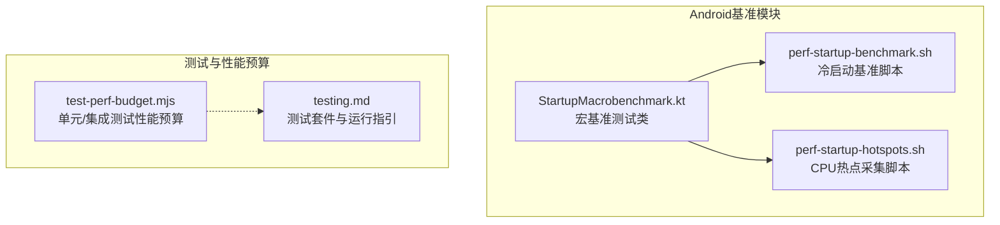
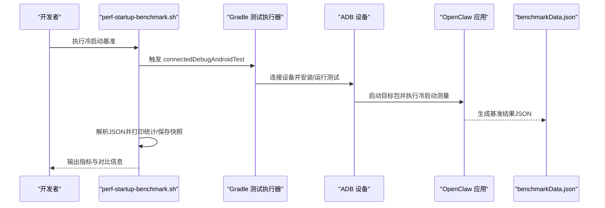
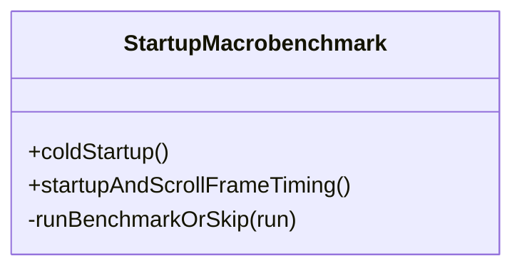
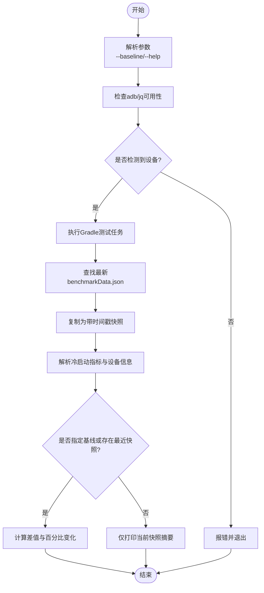
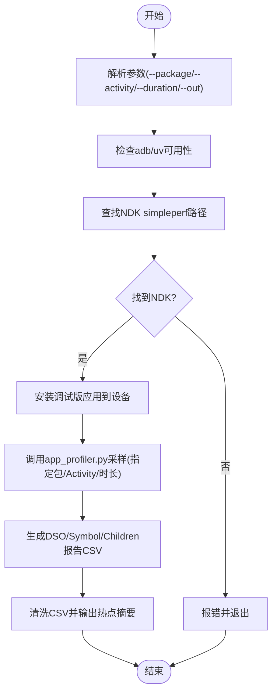
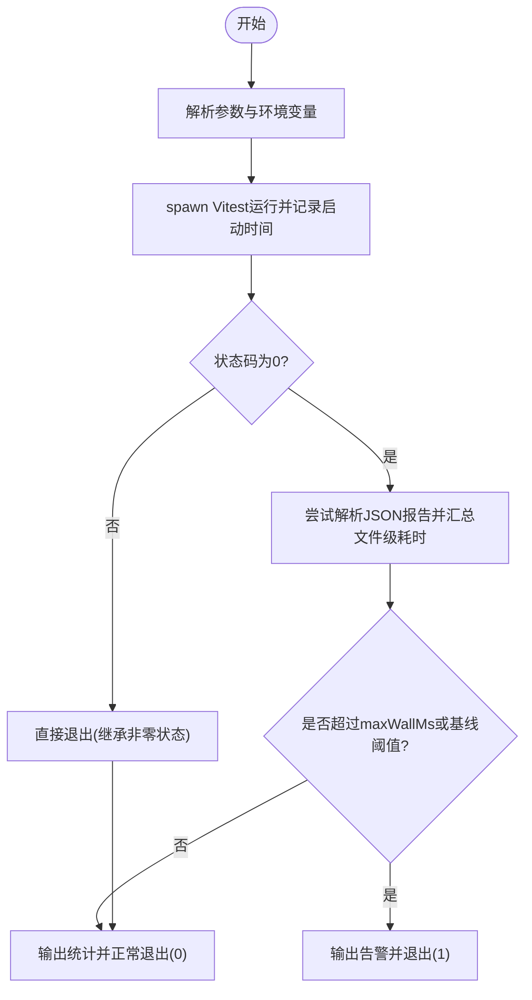
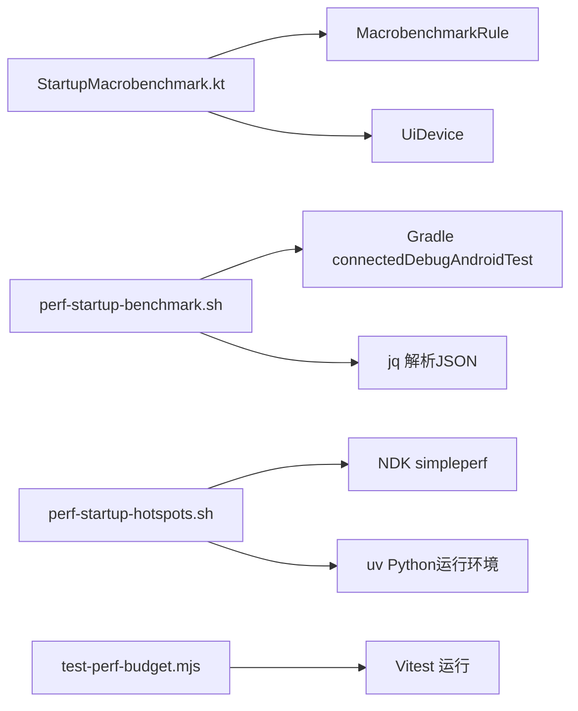

# 测试与性能基准

<cite>
**本文引用的文件**
- [apps/android/benchmark/src/main/java/ai/openclaw/app/benchmark/StartupMacrobenchmark.kt](file://apps/android/benchmark/src/main/java/ai/openclaw/app/benchmark/StartupMacrobenchmark.kt)
- [apps/android/scripts/perf-startup-benchmark.sh](file://apps/android/scripts/perf-startup-benchmark.sh)
- [apps/android/scripts/perf-startup-hotspots.sh](file://apps/android/scripts/perf-startup-hotspots.sh)
- [scripts/test-perf-budget.mjs](file://scripts/test-perf-budget.mjs)
- [docs/help/testing.md](file://docs/help/testing.md)
</cite>

## 目录

1. [简介](#简介)
2. [项目结构](#项目结构)
3. [核心组件](#核心组件)
4. [架构总览](#架构总览)
5. [详细组件分析](#详细组件分析)
6. [依赖关系分析](#依赖关系分析)
7. [性能考量](#性能考量)
8. [故障排查指南](#故障排查指南)
9. [结论](#结论)
10. [附录](#附录)

## 简介

本文件面向Android应用的测试与性能基准，系统化介绍以下内容：

- 宏基准测试（冷启动时间、帧率测量）
- 性能CLI工具（基准脚本、热点分析、性能数据收集）
- 集成测试套件、预条件检查与自动化测试流程
- 冷启动测试、内存使用分析与电池消耗评估的实践建议
- 性能优化策略、基准数据对比与持续性能监控方法

## 项目结构

Android测试与性能基准主要分布在以下位置：

- 宏基准测试：apps/android/benchmark 模块中的 StartupMacrobenchmark.kt
- 基准执行脚本：apps/android/scripts 下的 perf-startup-benchmark.sh、perf-startup-hotspots.sh
- 单元/集成测试性能预算：scripts/test-perf-budget.mjs
- 测试体系概览：docs/help/testing.md

**图表来源**

- [apps/android/benchmark/src/main/java/ai/openclaw/app/benchmark/StartupMacrobenchmark.kt:1-77](file://apps/android/benchmark/src/main/java/ai/openclaw/app/benchmark/StartupMacrobenchmark.kt#L1-L77)
- [apps/android/scripts/perf-startup-benchmark.sh:1-125](file://apps/android/scripts/perf-startup-benchmark.sh#L1-L125)
- [apps/android/scripts/perf-startup-hotspots.sh:1-155](file://apps/android/scripts/perf-startup-hotspots.sh#L1-L155)
- [scripts/test-perf-budget.mjs:1-128](file://scripts/test-perf-budget.mjs#L1-L128)
- [docs/help/testing.md:1-415](file://docs/help/testing.md#L1-L415)

**章节来源**

- [apps/android/benchmark/src/main/java/ai/openclaw/app/benchmark/StartupMacrobenchmark.kt:1-77](file://apps/android/benchmark/src/main/java/ai/openclaw/app/benchmark/StartupMacrobenchmark.kt#L1-L77)
- [apps/android/scripts/perf-startup-benchmark.sh:1-125](file://apps/android/scripts/perf-startup-benchmark.sh#L1-L125)
- [apps/android/scripts/perf-startup-hotspots.sh:1-155](file://apps/android/scripts/perf-startup-hotspots.sh#L1-L155)
- [scripts/test-perf-budget.mjs:1-128](file://scripts/test-perf-budget.mjs#L1-L128)
- [docs/help/testing.md:1-415](file://docs/help/testing.md#L1-L415)

## 核心组件

- 宏基准测试类：基于MacrobenchmarkRule，支持冷启动与“启动后滚动”场景下的帧时序测量，并对设备兼容性问题进行跳过处理。
- 冷启动基准脚本：通过Gradle连接设备执行基准测试，解析benchmarkData.json并输出关键统计指标，支持与历史快照对比。
- CPU热点采集脚本：使用NDK simpleperf采集启动阶段CPU样本，生成DSO与符号级热点报告，辅助定位性能瓶颈。
- 测试性能预算：在本地或CI中限制测试总耗时与回归阈值，保障测试稳定性与性能基线。

**章节来源**

- [apps/android/benchmark/src/main/java/ai/openclaw/app/benchmark/StartupMacrobenchmark.kt:23-76](file://apps/android/benchmark/src/main/java/ai/openclaw/app/benchmark/StartupMacrobenchmark.kt#L23-L76)
- [apps/android/scripts/perf-startup-benchmark.sh:62-124](file://apps/android/scripts/perf-startup-benchmark.sh#L62-L124)
- [apps/android/scripts/perf-startup-hotspots.sh:104-154](file://apps/android/scripts/perf-startup-hotspots.sh#L104-L154)
- [scripts/test-perf-budget.mjs:15-128](file://scripts/test-perf-budget.mjs#L15-L128)

## 架构总览

下图展示从命令行到Android设备的端到端性能测试链路：

**图表来源**

- [apps/android/scripts/perf-startup-benchmark.sh:62-98](file://apps/android/scripts/perf-startup-benchmark.sh#L62-L98)
- [apps/android/benchmark/src/main/java/ai/openclaw/app/benchmark/StartupMacrobenchmark.kt:24-37](file://apps/android/benchmark/src/main/java/ai/openclaw/app/benchmark/StartupMacrobenchmark.kt#L24-L37)

## 详细组件分析

### 宏基准测试类：StartupMacrobenchmark.kt

- 冷启动测试：使用StartupTimingMetric与COLD模式，重复10次，测量首次显示时间等指标。
- 启动后滚动帧时序：使用FrameTimingMetric与WARM模式，在启动后进行多次滑动以评估滚动流畅度。
- 兼容性处理：捕获特定设备异常（如无法确认启动完成、无渲染切片），按已知问题跳过当前设备测试。

**图表来源**

- [apps/android/benchmark/src/main/java/ai/openclaw/app/benchmark/StartupMacrobenchmark.kt:17-76](file://apps/android/benchmark/src/main/java/ai/openclaw/app/benchmark/StartupMacrobenchmark.kt#L17-L76)

**章节来源**

- [apps/android/benchmark/src/main/java/ai/openclaw/app/benchmark/StartupMacrobenchmark.kt:23-76](file://apps/android/benchmark/src/main/java/ai/openclaw/app/benchmark/StartupMacrobenchmark.kt#L23-L76)

### 冷启动基准脚本：perf-startup-benchmark.sh

- 功能要点
  - 仅运行冷启动宏基准，输出紧凑摘要（中位数/最小/最大/变异系数/迭代次数/设备/SDK）。
  - 自动保存带时间戳的JSON快照至benchmark/results目录。
  - 支持--baseline参数与自动查找最近快照进行对比，输出基线中位数、差值与百分比变化。
  - 依赖adb与jq；若未连接设备或缺少工具则直接报错退出。
- 数据解析
  - 从benchmarkData.json提取coldStartup指标与设备上下文信息。
  - 计算与基线的绝对差值与相对百分比变化，便于趋势追踪。

**图表来源**

- [apps/android/scripts/perf-startup-benchmark.sh:10-124](file://apps/android/scripts/perf-startup-benchmark.sh#L10-L124)

**章节来源**

- [apps/android/scripts/perf-startup-benchmark.sh:1-125](file://apps/android/scripts/perf-startup-benchmark.sh#L1-L125)

### CPU热点采集脚本：perf-startup-hotspots.sh

- 功能要点
  - 使用NDK simpleperf的app_profiler.py采集启动阶段CPU样本，支持自定义包名、Activity、采样时长与输出路径。
  - 自动查找NDK路径（优先ANDROID_NDK_HOME/ANDROID_NDK_ROOT，其次用户目录下的最新NDK）。
  - 生成三类报告：DSO自耗时、符号自耗时、父子调用关系（children），并过滤应用进程名。
  - 输出top DSO、top符号以及与应用路径相关的热点线索（如Compose/MainActivity/NodeRuntime等关键词）。
- 依赖与前置
  - 需要adb、uv（Python运行环境）、可写入的输出路径。
  - 若未连接设备或找不到NDK，则直接报错退出。

**图表来源**

- [apps/android/scripts/perf-startup-hotspots.sh:12-154](file://apps/android/scripts/perf-startup-hotspots.sh#L12-L154)

**章节来源**

- [apps/android/scripts/perf-startup-hotspots.sh:1-155](file://apps/android/scripts/perf-startup-hotspots.sh#L1-L155)

### 测试性能预算：test-perf-budget.mjs

- 功能要点
  - 通过Vitest运行测试，支持从环境变量或命令行参数设置上限与基线。
  - 统计总墙钟时间与按文件聚合的耗时，用于快速判断整体回归。
  - 当超过maxWallMs或超过基线允许的回归阈值时，失败并输出详细日志。
- 使用建议
  - 在CI中结合OPENCLAW_TEST_PERF_MAX_WALL_MS与OPENCLAW_TEST_PERF_MAX_REGRESSION_PCT控制质量门禁。
  - 与单元/集成测试配置配合，形成“功能正确 + 性能稳定”的双重保障。

**图表来源**

- [scripts/test-perf-budget.mjs:15-128](file://scripts/test-perf-budget.mjs#L15-L128)

**章节来源**

- [scripts/test-perf-budget.mjs:1-128](file://scripts/test-perf-budget.mjs#L1-L128)

### 集成测试套件与自动化流程

- 测试套件概览
  - 单元/集成：默认套件，覆盖纯单元、进程内集成与确定性回归，强调速度与稳定性。
  - E2E：网关烟测，关注多实例行为、WebSocket/HTTP接口与配对流程。
  - Live：真实提供商与模型，验证“直接模型”与“网关+代理”两层烟测，支持按需缩小范围。
- Android节点能力扫描
  - 通过“Live: Android node capability sweep”对已配对节点的命令进行逐项验证，要求应用保持前台、授予权限等预条件。
- 自动化建议
  - 将perf-startup-benchmark.sh与perf-startup-hotspots.sh纳入CI矩阵，按机型/系统版本分层运行。
  - 结合test-perf-budget.mjs在PR中快速拦截显著回归。

**章节来源**

- [docs/help/testing.md:38-120](file://docs/help/testing.md#L38-L120)
- [docs/help/testing.md:104-120](file://docs/help/testing.md#L104-L120)

## 依赖关系分析

- 宏基准测试类依赖AndroidX Macrobenchmark与UIAutomator，用于启动测量与交互模拟。
- 基准脚本依赖Gradle、ADB与jq，负责触发测试、收集与解析结果。
- 热点脚本依赖NDK simpleperf与Python工具链（uv），负责CPU采样与报告生成。
- 测试预算脚本依赖Vitest与Node子进程，负责统计与阈值判定。

**图表来源**

- [apps/android/benchmark/src/main/java/ai/openclaw/app/benchmark/StartupMacrobenchmark.kt:1-15](file://apps/android/benchmark/src/main/java/ai/openclaw/app/benchmark/StartupMacrobenchmark.kt#L1-L15)
- [apps/android/scripts/perf-startup-benchmark.sh:39-47](file://apps/android/scripts/perf-startup-benchmark.sh#L39-L47)
- [apps/android/scripts/perf-startup-hotspots.sh:52-60](file://apps/android/scripts/perf-startup-hotspots.sh#L52-L60)
- [scripts/test-perf-budget.mjs:63-77](file://scripts/test-perf-budget.mjs#L63-L77)

**章节来源**

- [apps/android/benchmark/src/main/java/ai/openclaw/app/benchmark/StartupMacrobenchmark.kt:1-15](file://apps/android/benchmark/src/main/java/ai/openclaw/app/benchmark/StartupMacrobenchmark.kt#L1-L15)
- [apps/android/scripts/perf-startup-benchmark.sh:39-47](file://apps/android/scripts/perf-startup-benchmark.sh#L39-L47)
- [apps/android/scripts/perf-startup-hotspots.sh:52-60](file://apps/android/scripts/perf-startup-hotspots.sh#L52-L60)
- [scripts/test-perf-budget.mjs:63-77](file://scripts/test-perf-budget.mjs#L63-L77)

## 性能考量

- 冷启动时间
  - 使用StartupTimingMetric与COLD模式，关注首次显示时间的中位数、最小/最大与变异系数，识别异常波动。
  - 建议在不同机型与系统版本上建立基线，定期对比回归阈值。
- 帧率与滚动流畅度
  - 使用FrameTimingMetric与WARM模式，启动后进行典型滚动操作，观察卡顿分布与掉帧情况。
- CPU热点
  - 使用simpleperf采集启动阶段CPU样本，聚焦应用进程内的DSO与符号热点，结合应用路径关键词定位问题模块。
- 测试执行效率
  - 通过test-perf-budget.mjs限制测试总耗时与回归幅度，避免长尾用例拖慢整体交付节奏。
- 内存与电池
  - 文档未提供专用脚本，建议结合系统自带工具（如adb shell dumpsys meminfo、Battery Historian）与现有脚本组合进行补充分析。

[本节为通用指导，不直接分析具体文件]

## 故障排查指南

- 宏基准测试跳过
  - 已知设备问题（如无法确认启动完成、无渲染切片）会触发Assume.skip，可在日志中查看具体错误信息并更换设备。
- 基准脚本失败
  - 缺少adb或jq：先安装并确保PATH可用。
  - 未连接设备：使用adb devices检查状态。
  - 未找到benchmarkData.json：查看脚本日志尾部定位原因。
- 热点脚本失败
  - 缺少uv或adb：先安装并确保可用。
  - 未找到NDK：设置ANDROID_NDK_HOME或ANDROID_NDK_ROOT，或在用户目录安装NDK。
  - simpleperf采样失败：查看capture.log尾部输出，确认包名/Activity与采样时长配置。
- 测试预算失败
  - 超出maxWallMs或基线阈值：调整实现或放宽阈值，同时审查回归引入点。

**章节来源**

- [apps/android/benchmark/src/main/java/ai/openclaw/app/benchmark/StartupMacrobenchmark.kt:62-75](file://apps/android/benchmark/src/main/java/ai/openclaw/app/benchmark/StartupMacrobenchmark.kt#L62-L75)
- [apps/android/scripts/perf-startup-benchmark.sh:39-53](file://apps/android/scripts/perf-startup-benchmark.sh#L39-L53)
- [apps/android/scripts/perf-startup-hotspots.sh:52-87](file://apps/android/scripts/perf-startup-hotspots.sh#L52-L87)
- [scripts/test-perf-budget.mjs:104-117](file://scripts/test-perf-budget.mjs#L104-L117)

## 结论

通过宏基准测试、基准脚本与热点分析工具的协同，可以系统地评估Android应用的冷启动与滚动性能，并在CI中以测试预算机制保障回归可控。建议将上述工具纳入常规开发与发布流程，结合设备差异与系统版本建立长期基线，持续监控性能趋势并及时优化。

[本节为总结性内容，不直接分析具体文件]

## 附录

- 关键命令速查
  - 冷启动基准：./scripts/perf-startup-benchmark.sh [--baseline <基准文件>]
  - CPU热点：./scripts/perf-startup-hotspots.sh [--package <包名>] [--activity <Activity>] [--duration <秒>] [--out <输出路径>]
  - 测试预算：node scripts/test-perf-budget.mjs [--config <vitest配置>] [--max-wall-ms <上限>] [--baseline-wall-ms <基线>] [--max-regression-pct <百分比>]
- 参考文档
  - 测试套件与运行指引：docs/help/testing.md

[本节为参考性内容，不直接分析具体文件]
