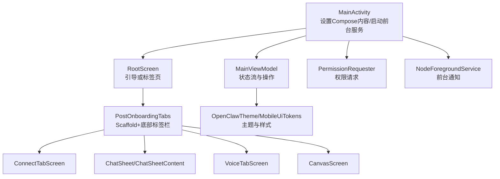
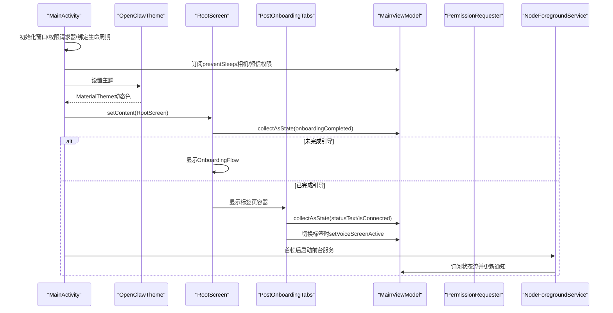
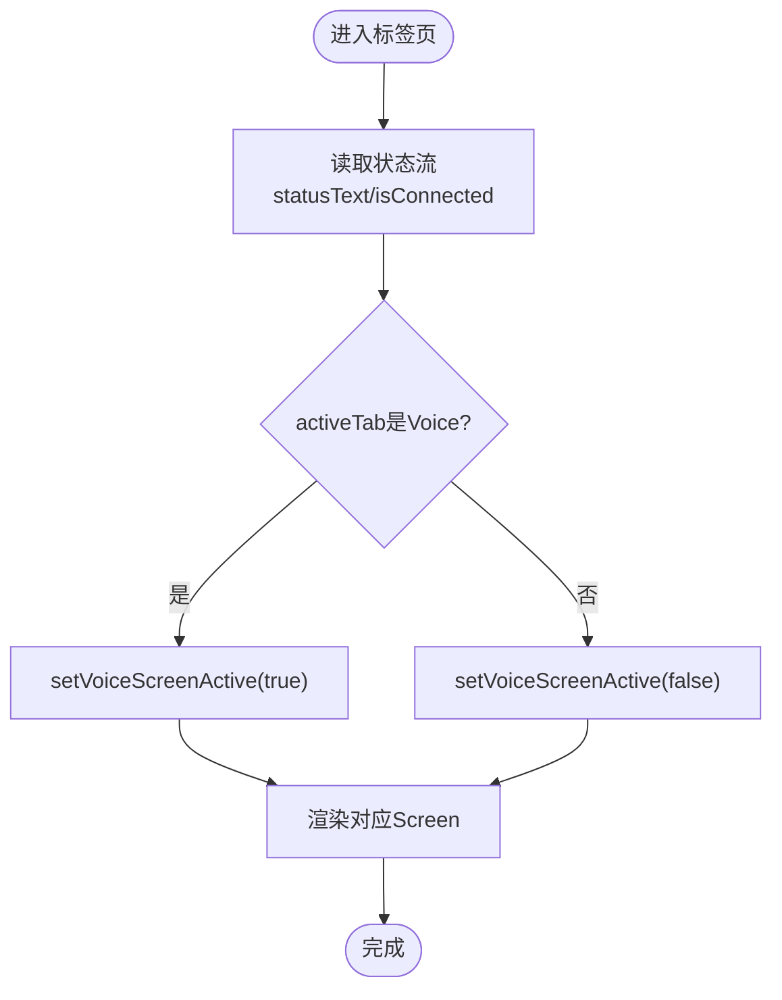
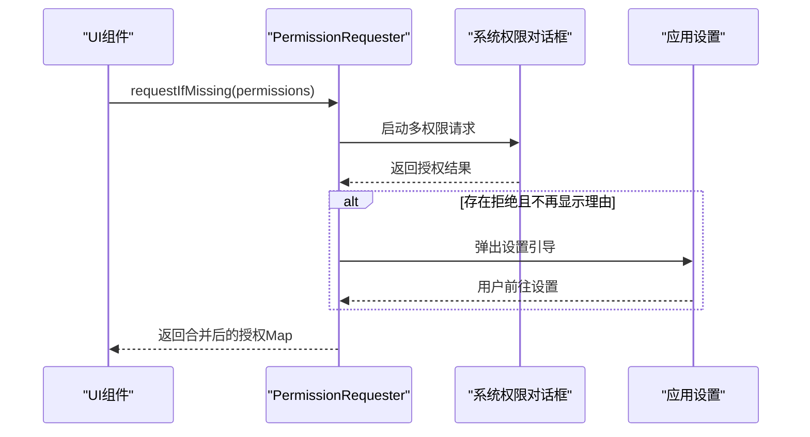
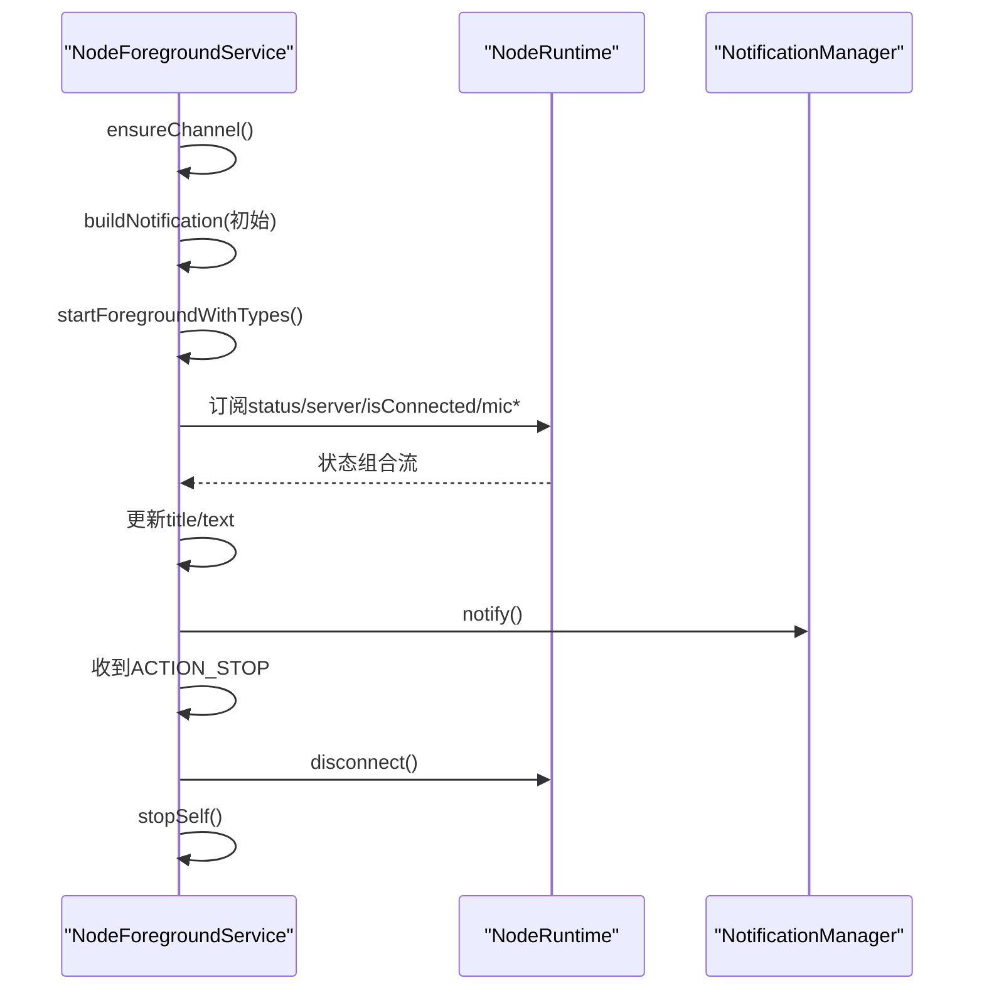
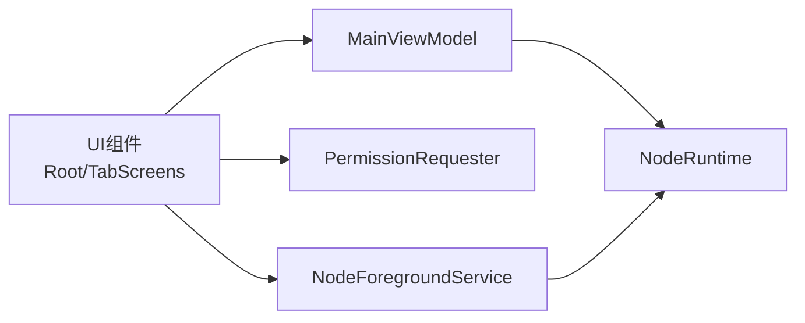

# 界面导航与布局

<cite>
**本文引用的文件**
- [MainActivity.kt](file://apps/android/app/src/main/java/ai/openclaw/app/MainActivity.kt)
- [MainViewModel.kt](file://apps/android/app/src/main/java/ai/openclaw/app/MainViewModel.kt)
- [RootScreen.kt](file://apps/android/app/src/main/java/ai/openclaw/app/ui/RootScreen.kt)
- [PostOnboardingTabs.kt](file://apps/android/app/src/main/java/ai/openclaw/app/ui/PostOnboardingTabs.kt)
- [OpenClawTheme.kt](file://apps/android/app/src/main/java/ai/openclaw/app/ui/OpenClawTheme.kt)
- [MobileUiTokens.kt](file://apps/android/app/src/main/java/ai/openclaw/app/ui/MobileUiTokens.kt)
- [PermissionRequester.kt](file://apps/android/app/src/main/java/ai/openclaw/app/PermissionRequester.kt)
- [NodeForegroundService.kt](file://apps/android/app/src/main/java/ai/openclaw/app/NodeForegroundService.kt)
- [ConnectTabScreen.kt](file://apps/android/app/src/main/java/ai/openclaw/app/ui/ConnectTabScreen.kt)
- [ChatSheet.kt](file://apps/android/app/src/main/java/ai/openclaw/app/ui/ChatSheet.kt)
- [ChatSheetContent.kt](file://apps/android/app/src/main/java/ai/openclaw/app/ui/chat/ChatSheetContent.kt)
- [CanvasScreen.kt](file://apps/android/app/src/main/java/ai/openclaw/app/ui/CanvasScreen.kt)
- [VoiceTabScreen.kt](file://apps/android/app/src/main/java/ai/openclaw/app/ui/VoiceTabScreen.kt)
</cite>

## 目录

1. [简介](#简介)
2. [项目结构](#项目结构)
3. [核心组件](#核心组件)
4. [架构总览](#架构总览)
5. [详细组件分析](#详细组件分析)
6. [依赖关系分析](#依赖关系分析)
7. [性能考虑](#性能考虑)
8. [故障排查指南](#故障排查指南)
9. [结论](#结论)

## 简介

本文件面向Android端的Jetpack Compose界面导航与布局，系统性阐述主界面的标签页组织、屏幕跳转机制、响应式设计、主题系统与样式定制、国际化支持现状、权限申请流程、通知权限与后台服务通知，以及UI组件复用、状态管理与用户体验优化方法。内容基于仓库中apps/android/app/src/main/java/ai/openclaw/app及子目录下的实际实现进行归纳总结。

## 项目结构

Android应用采用Compose UI + ViewModel + Service 的分层架构：

- 应用入口：MainActivity 负责设置Compose内容、启动前台服务、绑定生命周期与权限请求器。
- 视图模型：MainViewModel 汇聚运行时状态（连接、相机、短信、语音、画布等），并提供状态流与操作接口。
- 导航与布局：RootScreen 根据引导完成状态决定显示 Onboarding 或 PostOnboardingTabs；后者通过 Scaffold + BottomTabBar 实现标签页切换与内容区渲染。
- 主题与样式：OpenClawTheme 基于系统深色模式动态选择颜色；MobileUiTokens 定义移动端配色、字体与排版令牌。
- 权限与通知：PermissionRequester 统一处理多权限请求与引导；NodeForegroundService 提供连接状态通知与后台常驻能力。
- 功能页面：ConnectTabScreen（连接控制）、ChatSheet/ChatSheetContent（会话与消息）、VoiceTabScreen（语音交互）、CanvasScreen（画布/屏幕共享）。

**图表来源**

- [MainActivity.kt:18-62](file://apps/android/app/src/main/java/ai/openclaw/app/MainActivity.kt#L18-L62)
- [RootScreen.kt:10-20](file://apps/android/app/src/main/java/ai/openclaw/app/ui/RootScreen.kt#L10-L20)
- [PostOnboardingTabs.kt:68-132](file://apps/android/app/src/main/java/ai/openclaw/app/ui/PostOnboardingTabs.kt#L68-L132)
- [MainViewModel.kt:13-202](file://apps/android/app/src/main/java/ai/openclaw/app/MainViewModel.kt#L13-L202)
- [OpenClawTheme.kt:11-18](file://apps/android/app/src/main/java/ai/openclaw/app/ui/OpenClawTheme.kt#L11-L18)
- [MobileUiTokens.kt:12-106](file://apps/android/app/src/main/java/ai/openclaw/app/ui/MobileUiTokens.kt#L12-L106)
- [PermissionRequester.kt:22-85](file://apps/android/app/src/main/java/ai/openclaw/app/PermissionRequester.kt#L22-L85)
- [NodeForegroundService.kt:20-77](file://apps/android/app/src/main/java/ai/openclaw/app/NodeForegroundService.kt#L20-L77)

**章节来源**

- [MainActivity.kt:18-62](file://apps/android/app/src/main/java/ai/openclaw/app/MainActivity.kt#L18-L62)
- [RootScreen.kt:10-20](file://apps/android/app/src/main/java/ai/openclaw/app/ui/RootScreen.kt#L10-L20)
- [PostOnboardingTabs.kt:68-132](file://apps/android/app/src/main/java/ai/openclaw/app/ui/PostOnboardingTabs.kt#L68-L132)

## 核心组件

- MainActivity：负责窗口装饰适配、权限请求器初始化、相机与短信权限绑定、防止休眠标志收集、首帧后启动前台服务，并以OpenClawTheme包裹根布局RootScreen。
- MainViewModel：集中暴露运行时状态流（连接、画布、相机、短信、语音、聊天等）与操作方法，作为UI层唯一数据源。
- RootScreen：根据onboardingCompleted状态在引导与标签页之间切换。
- PostOnboardingTabs：使用Scaffold构建顶部状态栏与底部标签栏，通过rememberSaveable保存当前激活标签，LaunchedEffect在标签切换时同步语音屏活跃状态。
- OpenClawTheme + MobileUiTokens：动态颜色方案与移动端统一的配色、字体、字号、行高、字重、间距等令牌。
- PermissionRequester：统一多权限请求、理由说明、超时与设置页引导。
- NodeForegroundService：前台通知通道与通知构建，随运行时状态流更新标题与文本，支持断开动作。

**章节来源**

- [MainViewModel.kt:13-202](file://apps/android/app/src/main/java/ai/openclaw/app/MainViewModel.kt#L13-L202)
- [OpenClawTheme.kt:11-33](file://apps/android/app/src/main/java/ai/openclaw/app/ui/OpenClawTheme.kt#L11-L33)
- [MobileUiTokens.kt:12-106](file://apps/android/app/src/main/java/ai/openclaw/app/ui/MobileUiTokens.kt#L12-L106)
- [PermissionRequester.kt:22-133](file://apps/android/app/src/main/java/ai/openclaw/app/PermissionRequester.kt#L22-L133)
- [NodeForegroundService.kt:20-156](file://apps/android/app/src/main/java/ai/openclaw/app/NodeForegroundService.kt#L20-L156)

## 架构总览

下图展示从Activity到UI、状态与服务的整体调用链路与职责边界：

**图表来源**

- [MainActivity.kt:22-52](file://apps/android/app/src/main/java/ai/openclaw/app/MainActivity.kt#L22-L52)
- [RootScreen.kt:11-19](file://apps/android/app/src/main/java/ai/openclaw/app/ui/RootScreen.kt#L11-L19)
- [PostOnboardingTabs.kt:68-75](file://apps/android/app/src/main/java/ai/openclaw/app/ui/PostOnboardingTabs.kt#L68-L75)
- [MainViewModel.kt:13-62](file://apps/android/app/src/main/java/ai/openclaw/app/MainViewModel.kt#L13-L62)
- [NodeForegroundService.kt:32-56](file://apps/android/app/src/main/java/ai/openclaw/app/NodeForegroundService.kt#L32-L56)

## 详细组件分析

### 标签页导航与页面跳转

- 导航结构：RootScreen根据onboardingCompleted决定显示引导或PostOnboardingTabs；标签页枚举HomeTab包含Connect/Chat/Voice/Screen/Settings五类。
- 底部标签栏：BottomTabBar使用RoundedCornerShape圆角与权重布局，按需隐藏以避免键盘遮挡；点击切换activeTab。
- 内容区：when(activeTab)分发至对应Screen，如ConnectTabScreen、ChatSheet、VoiceTabScreen、ScreenTabScreen（内部含CanvasScreen）与SettingsSheet。
- 语音屏活跃：LaunchedEffect监听activeTab变化，将VoiceScreenActive写入运行时，离开时停止TTS。

**图表来源**

- [PostOnboardingTabs.kt:68-75](file://apps/android/app/src/main/java/ai/openclaw/app/ui/PostOnboardingTabs.kt#L68-L75)
- [PostOnboardingTabs.kt:123-129](file://apps/android/app/src/main/java/ai/openclaw/app/ui/PostOnboardingTabs.kt#L123-L129)

**章节来源**

- [PostOnboardingTabs.kt:49-132](file://apps/android/app/src/main/java/ai/openclaw/app/ui/PostOnboardingTabs.kt#L49-L132)

### 主界面布局与响应式设计

- Scaffold：顶部TopStatusBar显示品牌名与状态指示；底部BottomTabBar在IME弹出时可隐藏以避免遮挡输入。
- 状态指示：根据statusText与isConnected映射为Connected/Connecting/Warning/Error/Offline五态，分别使用不同背景、描边与点色。
- 屏幕Tab：当画布URL为空或A2UI未水合且处于可恢复条件时，顶部显示“恢复”提示，点击触发requestCanvasRehydrate。
- 窗口内边距：consumeWindowInsets与innerPadding确保内容不被安全区域与系统窗口遮挡。

**章节来源**

- [PostOnboardingTabs.kt:177-175](file://apps/android/app/src/main/java/ai/openclaw/app/ui/PostOnboardingTabs.kt#L177-L175)
- [PostOnboardingTabs.kt:178-265](file://apps/android/app/src/main/java/ai/openclaw/app/ui/PostOnboardingTabs.kt#L178-L265)
- [PostOnboardingTabs.kt:267-326](file://apps/android/app/src/main/java/ai/openclaw/app/ui/PostOnboardingTabs.kt#L267-L326)

### 主题系统与样式定制

- 动态主题：OpenClawTheme根据系统深色模式选择动态亮/暗色方案，MaterialTheme包裹内容。
- 移动端令牌：MobileUiTokens定义移动端配色（背景、表面、边框、文本、强调、成功/警告/危险等）、字体家族与多级TextStyle（标题、正文、说明、脚注等）。
- 叠加容器与图标：overlayContainerColor/overlayIconColor提供在动态色基础上的覆盖层颜色策略。

**章节来源**

- [OpenClawTheme.kt:11-33](file://apps/android/app/src/main/java/ai/openclaw/app/ui/OpenClawTheme.kt#L11-L33)
- [MobileUiTokens.kt:12-106](file://apps/android/app/src/main/java/ai/openclaw/app/ui/MobileUiTokens.kt#L12-L106)

### 国际化支持现状

- 代码中未发现直接的资源字符串本地化文件（values-xx）或国际化键值映射逻辑。
- 字体资源通过R.font引用，但未见多语言字符串资源的切换逻辑。
- 结论：当前未实现运行时多语言切换；若需国际化，建议引入资源目录与字符串键值映射并在主题/样式中按需切换。

[本节为概念性说明，不直接分析具体文件]

### 权限申请流程

- 多权限请求：PermissionRequester封装ActivityResultContracts.RequestMultiplePermissions，支持超时、互斥、合并结果与拒绝后引导至系统设置。
- 相机/麦克风/SMS：MainActivity在onCreate中将相机与短信权限请求器绑定到runtime；VoiceTabScreen单独处理录音权限。
- 权限理由与设置引导：showRationaleDialog与showSettingsDialog分别用于解释权限必要性与打开系统设置。

**图表来源**

- [PermissionRequester.kt:26-85](file://apps/android/app/src/main/java/ai/openclaw/app/PermissionRequester.kt#L26-L85)
- [MainActivity.kt:25-28](file://apps/android/app/src/main/java/ai/openclaw/app/MainActivity.kt#L25-L28)
- [VoiceTabScreen.kt:113-120](file://apps/android/app/src/main/java/ai/openclaw/app/ui/VoiceTabScreen.kt#L113-L120)

**章节来源**

- [PermissionRequester.kt:22-133](file://apps/android/app/src/main/java/ai/openclaw/app/PermissionRequester.kt#L22-L133)
- [MainActivity.kt:25-28](file://apps/android/app/src/main/java/ai/openclaw/app/MainActivity.kt#L25-L28)
- [VoiceTabScreen.kt:95-120](file://apps/android/app/src/main/java/ai/openclaw/app/ui/VoiceTabScreen.kt#L95-L120)

### 通知权限与后台服务通知

- 前台服务：NodeForegroundService在onCreate中创建通知通道并首次启动前台，随后订阅运行时状态流，动态更新通知标题与文本。
- 通知内容：标题随连接状态变化；当麦克风启用且正在监听/待机时追加状态后缀；内容包含服务器名与状态文本。
- 断开动作：通知提供“断开”动作按钮，点击触发停止服务与断开连接。
- 类型声明：使用FOREGROUND_SERVICE_TYPE_DATA_SYNC类型，确保后台同步场景的合规性。

**图表来源**

- [NodeForegroundService.kt:25-56](file://apps/android/app/src/main/java/ai/openclaw/app/NodeForegroundService.kt#L25-L56)
- [NodeForegroundService.kt:93-124](file://apps/android/app/src/main/java/ai/openclaw/app/NodeForegroundService.kt#L93-L124)
- [NodeForegroundService.kt:140-155](file://apps/android/app/src/main/java/ai/openclaw/app/NodeForegroundService.kt#L140-L155)

**章节来源**

- [NodeForegroundService.kt:20-156](file://apps/android/app/src/main/java/ai/openclaw/app/NodeForegroundService.kt#L20-L156)

### UI组件复用与状态管理

- 组件复用：各Tab均通过函数参数注入MainViewModel，实现跨页面状态共享与命令下发；例如ConnectTabScreen、ChatSheetContent、VoiceTabScreen、CanvasScreen。
- 状态管理：MainViewModel集中暴露StateFlow，UI侧通过collectAsState订阅；同时提供setter方法与业务操作方法（如connect、disconnect、sendChat、requestCanvasRehydrate等）。
- 生命周期：MainActivity在STARTED状态收集preventSleep以控制屏幕常亮；VoiceTabScreen在ON_RESUME检查权限，在释放时停止语音屏活跃状态。
- 数据桥接：CanvasScreen通过JavaScript Bridge与WebView交互，将A2UI动作回传给ViewModel。

**章节来源**

- [MainViewModel.kt:13-202](file://apps/android/app/src/main/java/ai/openclaw/app/MainViewModel.kt#L13-L202)
- [MainActivity.kt:30-40](file://apps/android/app/src/main/java/ai/openclaw/app/MainActivity.kt#L30-L40)
- [VoiceTabScreen.kt:98-111](file://apps/android/app/src/main/java/ai/openclaw/app/ui/VoiceTabScreen.kt#L98-L111)
- [CanvasScreen.kt:124-126](file://apps/android/app/src/main/java/ai/openclaw/app/ui/CanvasScreen.kt#L124-L126)

### 具体功能页面分析

#### 连接控制（ConnectTabScreen）

- 输入模式：支持“设置码”与“手动配置”，自动解析endpoint并预览。
- 高级控制：TLS开关、Token/Password、快速填充（Android Emulator/Localhost）。
- 连接状态：根据isConnected与statusText决定按钮文案与颜色；支持Operator离线时刷新连接。
- 信任提示：首次TLS指纹校验通过后弹窗确认。

**章节来源**

- [ConnectTabScreen.kt:56-416](file://apps/android/app/src/main/java/ai/openclaw/app/ui/ConnectTabScreen.kt#L56-L416)

#### 聊天（ChatSheet/ChatSheetContent）

- 会话选择：顶部显示当前会话与健康状态，横向滚动切换历史会话。
- 错误提示：错误文本以rail形式展示，便于用户感知。
- 附件上传：支持多图选择，转换为Base64并随消息发送。
- 发送/刷新/中断：提供发送、刷新、中断等操作入口。

**章节来源**

- [ChatSheet.kt:7-10](file://apps/android/app/src/main/java/ai/openclaw/app/ui/ChatSheet.kt#L7-L10)
- [ChatSheetContent.kt:56-156](file://apps/android/app/src/main/java/ai/openclaw/app/ui/chat/ChatSheetContent.kt#L56-L156)

#### 语音（VoiceTabScreen）

- 录音权限：首次启用时请求RECORD_AUDIO；无权限时引导至设置。
- 实时可视化：麦克风环形强度随micInputLevel变化；显示实时转写与队列数/发送中/冷却状态。
- 交互反馈：列表自动滚动至最新项；思维气泡在AI思考时显示。
- 设备兼容：在生命周期事件中检查权限与清理资源。

**章节来源**

- [VoiceTabScreen.kt:74-327](file://apps/android/app/src/main/java/ai/openclaw/app/ui/VoiceTabScreen.kt#L74-L327)

#### 屏幕共享（CanvasScreen）

- WebView集成：启用JS/DOM存储/禁用缩放/算法暗化兼容；设置WebViewClient/WebChromeClient处理错误与日志。
- A2UI桥接：通过addJavascriptInterface注入openclawCanvasA2UIAction桥，接收前端动作并转发至ViewModel。
- 资源回收：DisposableEffect在销毁时移除桥接、停止加载与销毁WebView。

**章节来源**

- [CanvasScreen.kt:26-131](file://apps/android/app/src/main/java/ai/openclaw/app/ui/CanvasScreen.kt#L26-L131)

## 依赖关系分析

- 组件耦合：UI层仅依赖MainViewModel的状态流与命令；服务层（NodeForegroundService）依赖运行时状态流；权限层（PermissionRequester）与UI层解耦。
- 状态流：MainViewModel聚合来自NodeRuntime的多路状态，UI通过collectAsState一次性订阅，降低重复计算。
- 通知与服务：NodeForegroundService独立于UI，通过运行时状态流驱动通知更新，避免阻塞主线程。

**图表来源**

- [MainViewModel.kt:13-202](file://apps/android/app/src/main/java/ai/openclaw/app/MainViewModel.kt#L13-L202)
- [NodeForegroundService.kt:31-56](file://apps/android/app/src/main/java/ai/openclaw/app/NodeForegroundService.kt#L31-L56)
- [PermissionRequester.kt:22-31](file://apps/android/app/src/main/java/ai/openclaw/app/PermissionRequester.kt#L22-L31)

**章节来源**

- [MainViewModel.kt:13-202](file://apps/android/app/src/main/java/ai/openclaw/app/MainViewModel.kt#L13-L202)
- [NodeForegroundService.kt:31-56](file://apps/android/app/src/main/java/ai/openclaw/app/NodeForegroundService.kt#L31-L56)

## 性能考虑

- 首帧启动：MainActivity在首帧后才启动前台服务，减少冷启动路径开销。
- 状态订阅：UI侧使用collectAsState按需重组，避免不必要的重绘；LaunchedEffect仅在标签变化时触发语音屏活跃切换。
- WebView：CanvasScreen在销毁时主动移除桥接、停止加载与销毁实例，避免内存泄漏与资源浪费。
- 通知更新：NodeForegroundService通过combine聚合多状态，减少通知更新频率与UI抖动。

[本节提供通用指导，不直接分析具体文件]

## 故障排查指南

- 无法连接网关
  - 检查ConnectTabScreen输入是否有效；Operator离线时尝试刷新连接。
  - 关注状态文本与连接状态，确认TLS/Token/密码配置正确。
- 语音无法启用
  - 确认已授予RECORD_AUDIO权限；无权限时引导至设置。
  - 检查micCooldown与micEnabled状态，避免在冷却期频繁切换。
- 画布/屏幕共享异常
  - 查看CanvasScreen日志输出（调试模式下）；确认WebViewClient错误回调与渲染进程退出日志。
  - 确保A2UI桥接已注入且payload有效。
- 前台通知不更新
  - 检查NodeForegroundService是否已startForeground；确认运行时状态流是否正常推送。
  - 确认通知通道已创建且IMPORTANCE低、不显示徽章。

**章节来源**

- [ConnectTabScreen.kt:164-208](file://apps/android/app/src/main/java/ai/openclaw/app/ui/ConnectTabScreen.kt#L164-L208)
- [VoiceTabScreen.kt:301-325](file://apps/android/app/src/main/java/ai/openclaw/app/ui/VoiceTabScreen.kt#L301-L325)
- [CanvasScreen.kt:68-110](file://apps/android/app/src/main/java/ai/openclaw/app/ui/CanvasScreen.kt#L68-L110)
- [NodeForegroundService.kt:79-91](file://apps/android/app/src/main/java/ai/openclaw/app/NodeForegroundService.kt#L79-L91)

## 结论

该Android应用以Jetpack Compose为核心，结合ViewModel与前台服务，实现了清晰的导航与布局、完善的权限与通知体系、以及可扩展的主题与样式系统。通过状态流驱动UI与服务，组件间保持低耦合高内聚；在性能方面采取了首帧延迟启动与资源回收等策略。若需进一步增强国际化与多语言体验，可在现有主题与样式基础上引入资源键值映射与运行时切换机制。
