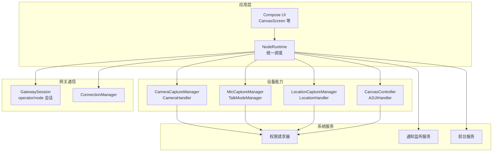
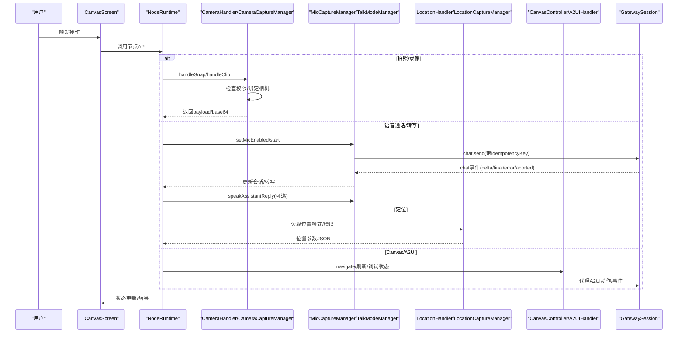
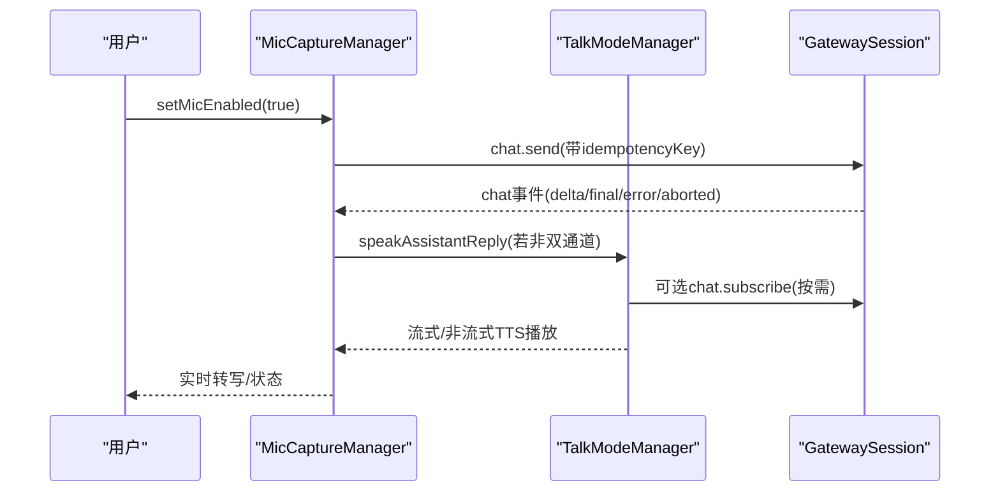
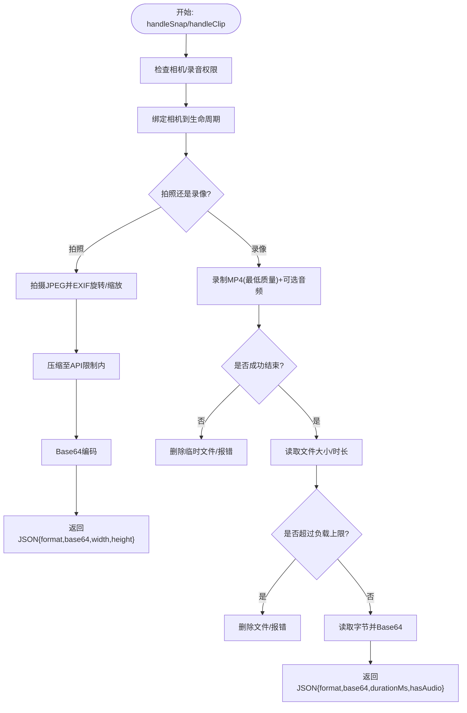
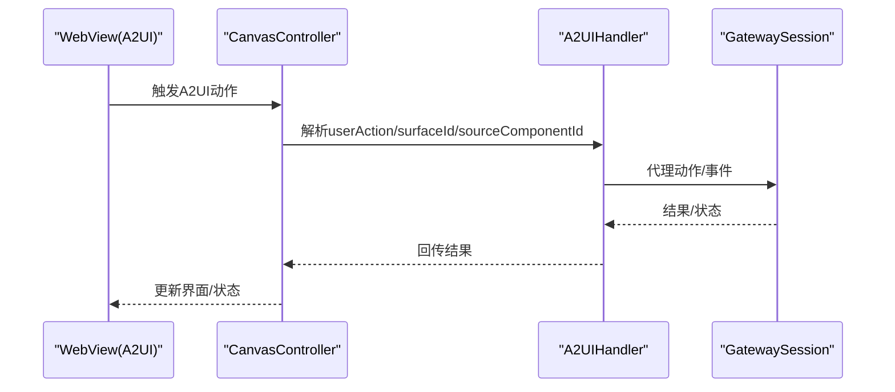
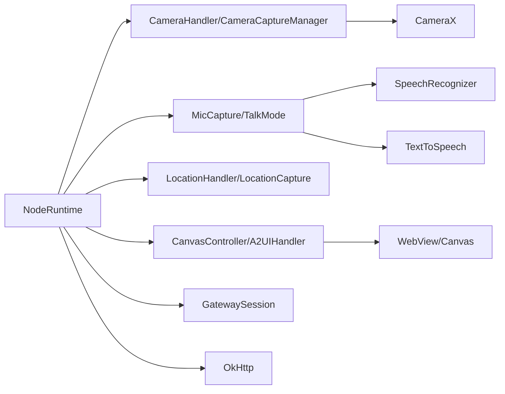

# 节点功能特性

<cite>
**本文引用的文件**
- [AndroidManifest.xml](file://apps/android/app/src/main/AndroidManifest.xml)
- [build.gradle.kts](file://apps/android/app/build.gradle.kts)
- [NodeApp.kt](file://apps/android/app/src/main/java/ai/openclaw/app/NodeApp.kt)
- [NodeRuntime.kt](file://apps/android/app/src/main/java/ai/openclaw/app/NodeRuntime.kt)
- [CameraHandler.kt](file://apps/android/app/src/main/java/ai/openclaw/app/node/CameraHandler.kt)
- [CameraCaptureManager.kt](file://apps/android/app/src/main/java/ai/openclaw/app/node/CameraCaptureManager.kt)
- [MicCaptureManager.kt](file://apps/android/app/src/main/java/ai/openclaw/app/voice/MicCaptureManager.kt)
- [TalkModeManager.kt](file://apps/android/app/src/main/java/ai/openclaw/app/voice/TalkModeManager.kt)
- [VoiceWakeManager.kt](file://apps/android/app/src/main/java/ai/openclaw/app/voice/VoiceWakeManager.kt)
- [LocationCaptureManager.kt](file://apps/android/app/src/main/java/ai/openclaw/app/node/LocationCaptureManager.kt)
- [LocationHandler.kt](file://apps/android/app/src/main/java/ai/openclaw/app/node/LocationHandler.kt)
- [CanvasController.kt](file://apps/android/app/src/main/java/ai/openclaw/app/node/CanvasController.kt)
- [A2UIHandler.kt](file://apps/android/app/src/main/java/ai/openclaw/app/node/A2UIHandler.kt)
- [OpenClawCanvasA2UIAction.kt](file://apps/android/app/src/main/java/ai/openclaw/app/protocol/OpenClawCanvasA2UIAction.kt)
- [CanvasScreen.kt](file://apps/android/app/src/main/java/ai/openclaw/app/ui/CanvasScreen.kt)
</cite>

## 目录

1. [简介](#简介)
2. [项目结构](#项目结构)
3. [核心组件](#核心组件)
4. [架构总览](#架构总览)
5. [详细组件分析](#详细组件分析)
6. [依赖关系分析](#依赖关系分析)
7. [性能考量](#性能考量)
8. [故障排查指南](#故障排查指南)
9. [结论](#结论)
10. [附录](#附录)

## 简介

本文件面向Android节点功能特性，系统化梳理音频处理、摄像头管理、图像识别与位置服务实现；详解媒体理解、语音唤醒与屏幕录制能力；解释Canvas可视化系统、A2UI交互与WebView集成；覆盖语音通话、媒体播放与设备控制；并提供各模块API接口、使用示例与性能优化建议。

## 项目结构

Android节点应用位于apps/android/app，采用Compose UI与Kotlin协程构建，核心运行时NodeRuntime负责统一调度网关连接、会话管理、设备能力（相机、麦克风、定位）与Canvas/A2UI交互。应用清单声明了网络、通知、定位、相机、录音等权限，并注册前台服务、通知监听服务与FileProvider。

图示来源

- [NodeRuntime.kt](file://apps/android/app/src/main/java/ai/openclaw/app/NodeRuntime.kt)
- [AndroidManifest.xml](file://apps/android/app/src/main/AndroidManifest.xml)

章节来源

- [AndroidManifest.xml:1-77](file://apps/android/app/src/main/AndroidManifest.xml#L1-L77)
- [build.gradle.kts:1-214](file://apps/android/app/build.gradle.kts#L1-L214)
- [NodeApp.kt:1-27](file://apps/android/app/src/main/java/ai/openclaw/app/NodeApp.kt#L1-L27)
- [NodeRuntime.kt:44-166](file://apps/android/app/src/main/java/ai/openclaw/app/NodeRuntime.kt#L44-L166)

## 核心组件

- NodeRuntime：应用运行时核心，聚合相机、定位、短信、Canvas、A2UI、网关会话与连接管理，暴露状态流与操作方法。
- CameraCaptureManager/CameraHandler：封装CameraX拍照与视频录制，支持设备选择、质量压缩、EXIF旋转、Base64回传与文件录制。
- MicCaptureManager/TalkModeManager：实现离线/在线语音转写、消息队列、网关事件驱动的对话轮次、TTS播放与音频焦点管理。
- VoiceWakeManager：基于SpeechRecognizer的触发词监听，用于语音唤醒。
- LocationCaptureManager/LocationHandler：封装位置采集与网关参数转换。
- CanvasController/A2UIHandler：WebView/Canvas承载与A2UI动作解析、代理到网关或本地渲染。
- 权限与系统服务：权限请求器、通知监听服务、前台服务。

章节来源

- [NodeRuntime.kt:44-166](file://apps/android/app/src/main/java/ai/openclaw/app/NodeRuntime.kt#L44-L166)
- [CameraCaptureManager.kt:44-160](file://apps/android/app/src/main/java/ai/openclaw/app/node/CameraCaptureManager.kt#L44-L160)
- [CameraHandler.kt:22-94](file://apps/android/app/src/main/java/ai/openclaw/app/node/CameraHandler.kt#L22-L94)
- [MicCaptureManager.kt:39-127](file://apps/android/app/src/main/java/ai/openclaw/app/voice/MicCaptureManager.kt#L39-L127)
- [TalkModeManager.kt:51-176](file://apps/android/app/src/main/java/ai/openclaw/app/voice/TalkModeManager.kt#L51-L176)
- [VoiceWakeManager.kt:18-76](file://apps/android/app/src/main/java/ai/openclaw/app/voice/VoiceWakeManager.kt#L18-L76)
- [LocationCaptureManager.kt](file://apps/android/app/src/main/java/ai/openclaw/app/node/LocationCaptureManager.kt)
- [LocationHandler.kt](file://apps/android/app/src/main/java/ai/openclaw/app/node/LocationHandler.kt)
- [CanvasController.kt](file://apps/android/app/src/main/java/ai/openclaw/app/node/CanvasController.kt)
- [A2UIHandler.kt](file://apps/android/app/src/main/java/ai/openclaw/app/node/A2UIHandler.kt)

## 架构总览

下图展示从用户交互到设备能力与网关通信的端到端流程，包括Canvas/A2UI与语音通话路径。

图示来源

- [NodeRuntime.kt:294-300](file://apps/android/app/src/main/java/ai/openclaw/app/NodeRuntime.kt#L294-L300)
- [CameraHandler.kt:30-94](file://apps/android/app/src/main/java/ai/openclaw/app/node/CameraHandler.kt#L30-L94)
- [MicCaptureManager.kt:140-181](file://apps/android/app/src/main/java/ai/openclaw/app/voice/MicCaptureManager.kt#L140-L181)
- [TalkModeManager.kt:336-415](file://apps/android/app/src/main/java/ai/openclaw/app/voice/TalkModeManager.kt#L336-L415)
- [LocationHandler.kt](file://apps/android/app/src/main/java/ai/openclaw/app/node/LocationHandler.kt)
- [CanvasController.kt](file://apps/android/app/src/main/java/ai/openclaw/app/node/CanvasController.kt)
- [A2UIHandler.kt](file://apps/android/app/src/main/java/ai/openclaw/app/node/A2UIHandler.kt)

## 详细组件分析

### 音频处理与语音通话

- 录音与转写
  - MicCaptureManager：维护转写会话、分段拼接、消息队列、网关事件驱动的最终文本与错误处理，支持静默窗口与超时重试。
  - TalkModeManager：在“听-思考-说”闭环中订阅聊天、等待最终回复、缓存完成的run文本、支持ElevenLabs流式TTS与系统TTS回退。
- 语音唤醒
  - VoiceWakeManager：基于触发词列表监听，去抖与重复抑制，调用回调后短暂重启避免误唤醒。
- 语音通话
  - 通过chat.send与聊天订阅实现“听-思考-说”语音通话；TalkModeManager支持中断播放与音频焦点管理，避免与系统TTS冲突。

图示来源

- [MicCaptureManager.kt:140-181](file://apps/android/app/src/main/java/ai/openclaw/app/voice/MicCaptureManager.kt#L140-L181)
- [TalkModeManager.kt:336-415](file://apps/android/app/src/main/java/ai/openclaw/app/voice/TalkModeManager.kt#L336-L415)
- [VoiceWakeManager.kt:111-119](file://apps/android/app/src/main/java/ai/openclaw/app/voice/VoiceWakeManager.kt#L111-L119)

章节来源

- [MicCaptureManager.kt:39-574](file://apps/android/app/src/main/java/ai/openclaw/app/voice/MicCaptureManager.kt#L39-L574)
- [TalkModeManager.kt:51-800](file://apps/android/app/src/main/java/ai/openclaw/app/voice/TalkModeManager.kt#L51-L800)
- [VoiceWakeManager.kt:18-174](file://apps/android/app/src/main/java/ai/openclaw/app/voice/VoiceWakeManager.kt#L18-L174)

### 摄像头管理与图像识别

- 设备枚举与拍照
  - CameraHandler：列举设备、执行拍照，返回JPEG Base64与尺寸信息，含HUD提示与错误映射。
  - CameraCaptureManager：使用CameraX绑定生命周期，拍摄JPEG并按EXIF旋转缩放，压缩至API限制内，支持外部音频同步。
- 录制与屏幕录制
  - CameraCaptureManager：以最低质量录制MP4，预览激活编码器，支持可选音频，超时与失败清理临时文件。
- 图像识别
  - 当前实现聚焦于媒体捕获与传输，未见专用推理模块；可在网关侧进行媒体理解或通过自定义节点扩展。

图示来源

- [CameraHandler.kt:30-154](file://apps/android/app/src/main/java/ai/openclaw/app/node/CameraHandler.kt#L30-L154)
- [CameraCaptureManager.kt:97-266](file://apps/android/app/src/main/java/ai/openclaw/app/node/CameraCaptureManager.kt#L97-L266)

章节来源

- [CameraHandler.kt:22-176](file://apps/android/app/src/main/java/ai/openclaw/app/node/CameraHandler.kt#L22-L176)
- [CameraCaptureManager.kt:44-420](file://apps/android/app/src/main/java/ai/openclaw/app/node/CameraCaptureManager.kt#L44-L420)

### 位置服务

- 位置采集与参数
  - LocationHandler：将位置模式、精度开关等转换为网关可用的JSON参数。
  - LocationCaptureManager：封装底层位置能力（具体实现文件）。
- 使用场景
  - 与网关事件结合，用于导航、地理围栏、位置共享等。

章节来源

- [LocationHandler.kt](file://apps/android/app/src/main/java/ai/openclaw/app/node/LocationHandler.kt)
- [LocationCaptureManager.kt](file://apps/android/app/src/main/java/ai/openclaw/app/node/LocationCaptureManager.kt)

### Canvas可视化系统与A2UI交互

- CanvasController
  - 承载WebView/Canvas，支持调试状态显示、URL导航、A2UI复水合触发与错误提示。
- A2UIHandler
  - 解析来自WebView的A2UI动作，格式化为代理消息，路由到网关或本地渲染。
- WebView集成
  - 通过CanvasScreen与CanvasController桥接，支持A2UI动作与节点状态联动。

图示来源

- [CanvasController.kt](file://apps/android/app/src/main/java/ai/openclaw/app/node/CanvasController.kt)
- [A2UIHandler.kt](file://apps/android/app/src/main/java/ai/openclaw/app/node/A2UIHandler.kt)
- [OpenClawCanvasA2UIAction.kt](file://apps/android/app/src/main/java/ai/openclaw/app/protocol/OpenClawCanvasA2UIAction.kt)
- [CanvasScreen.kt](file://apps/android/app/src/main/java/ai/openclaw/app/ui/CanvasScreen.kt)

章节来源

- [CanvasController.kt](file://apps/android/app/src/main/java/ai/openclaw/app/node/CanvasController.kt)
- [A2UIHandler.kt](file://apps/android/app/src/main/java/ai/openclaw/app/node/A2UIHandler.kt)
- [OpenClawCanvasA2UIAction.kt](file://apps/android/app/src/main/java/ai/openclaw/app/protocol/OpenClawCanvasA2UIAction.kt)
- [CanvasScreen.kt](file://apps/android/app/src/main/java/ai/openclaw/app/ui/CanvasScreen.kt)

### 设备控制与系统服务

- 前台服务与通知
  - NodeForegroundService：数据同步类型前台服务，提升任务存活性。
  - DeviceNotificationListenerService：监听通知事件并转发到节点事件通道。
- 权限与安全
  - 严格模式仅在调试启用，日志检测线程与虚拟机策略。
  - 网关TLS指纹验证与信任提示，首次连接捕获指纹并存储。

章节来源

- [AndroidManifest.xml:43-55](file://apps/android/app/src/main/AndroidManifest.xml#L43-L55)
- [NodeApp.kt:9-25](file://apps/android/app/src/main/java/ai/openclaw/app/NodeApp.kt#L9-L25)
- [NodeRuntime.kt:709-744](file://apps/android/app/src/main/java/ai/openclaw/app/NodeRuntime.kt#L709-L744)

## 依赖关系分析

- 运行时耦合
  - NodeRuntime聚合各子系统，通过状态流与回调解耦UI与设备能力。
  - InvokeDispatcher将网关invoke命令分派到对应处理器（相机、定位、通知、系统、照片、联系人、日历、运动、短信、A2UI、调试）。
- 外部依赖
  - CameraX：拍照与视频录制。
  - OkHttp：HTTP/WebSocket通信。
  - Material3/Compose：UI框架。
  - Kotlinx Serialization：JSON序列化。
  - 语音：Android SpeechRecognizer与TextToSpeech。

图示来源

- [NodeRuntime.kt:65-166](file://apps/android/app/src/main/java/ai/openclaw/app/NodeRuntime.kt#L65-L166)
- [build.gradle.kts:155-209](file://apps/android/app/build.gradle.kts#L155-L209)

章节来源

- [NodeRuntime.kt:65-166](file://apps/android/app/src/main/java/ai/openclaw/app/NodeRuntime.kt#L65-L166)
- [build.gradle.kts:155-209](file://apps/android/app/build.gradle.kts#L155-L209)

## 性能考量

- 拍摄与录制
  - JPEG压缩：按最大编码字节数限制，避免超大负载；录制使用最低质量以减小文件体积。
  - EXIF旋转与缩放：减少后续处理成本。
- 语音
  - 分段发送与静默窗口：降低网络压力与延迟。
  - 流式TTS：ElevenLabs流式优先，系统TTS回退，避免重复播放与冲突。
- Canvas/A2UI
  - 调试状态仅在开启时显示，避免无谓开销。
  - 复水合机制带超时与错误提示，防止长时间阻塞。
- 网络与连接
  - TLS指纹缓存与自动连接策略，减少握手与认证开销。
  - 前台服务与通知监听确保后台稳定性。

章节来源

- [CameraCaptureManager.kt:129-160](file://apps/android/app/src/main/java/ai/openclaw/app/node/CameraCaptureManager.kt#L129-L160)
- [CameraCaptureManager.kt:179-266](file://apps/android/app/src/main/java/ai/openclaw/app/node/CameraCaptureManager.kt#L179-L266)
- [MicCaptureManager.kt:266-283](file://apps/android/app/src/main/java/ai/openclaw/app/voice/MicCaptureManager.kt#L266-L283)
- [TalkModeManager.kt:249-321](file://apps/android/app/src/main/java/ai/openclaw/app/voice/TalkModeManager.kt#L249-L321)
- [NodeRuntime.kt:442-491](file://apps/android/app/src/main/java/ai/openclaw/app/NodeRuntime.kt#L442-L491)

## 故障排查指南

- 权限问题
  - 相机/录音权限缺失：触发异常并提示授权；请通过PermissionRequester授予。
- 语音问题
  - 识别器不可用/语言不支持：检查系统设置与语言模型；MicCaptureManager与VoiceWakeManager均会反馈状态。
  - 错误码与重试：根据SpeechRecognizer错误码调整重试间隔与策略。
- 录制失败
  - 录制结束事件含错误：检查文件存在与大小，确认预览绑定与编码器初始化。
- Canvas/A2UI
  - 复水合失败：检查节点连接状态与超时；查看错误提示并重试。
- 网关连接
  - 首次TLS指纹：弹出信任提示，确认后缓存指纹并重连。

章节来源

- [CameraCaptureManager.kt:73-95](file://apps/android/app/src/main/java/ai/openclaw/app/node/CameraCaptureManager.kt#L73-L95)
- [MicCaptureManager.kt:505-546](file://apps/android/app/src/main/java/ai/openclaw/app/voice/MicCaptureManager.kt#L505-L546)
- [VoiceWakeManager.kt:137-158](file://apps/android/app/src/main/java/ai/openclaw/app/voice/VoiceWakeManager.kt#L137-L158)
- [CameraCaptureManager.kt:241-258](file://apps/android/app/src/main/java/ai/openclaw/app/node/CameraCaptureManager.kt#L241-L258)
- [NodeRuntime.kt:442-491](file://apps/android/app/src/main/java/ai/openclaw/app/NodeRuntime.kt#L442-L491)
- [NodeRuntime.kt:709-744](file://apps/android/app/src/main/java/ai/openclaw/app/NodeRuntime.kt#L709-L744)

## 结论

Android节点在音频、相机、定位与Canvas/A2UI方面提供了完整的能力集：高质量的语音转写与TTS、灵活的拍照/录像与负载控制、可扩展的网关通信与信任机制、以及稳定的前台服务与通知监听。通过状态流与事件驱动，系统实现了低耦合、高可靠的功能组合，适合在移动设备上部署复杂的人机交互与自动化场景。

## 附录

### API接口与使用示例（路径索引）

- 相机
  - 列表设备：[CameraHandler.handleList:30-56](file://apps/android/app/src/main/java/ai/openclaw/app/node/CameraHandler.kt#L30-L56)
  - 拍照：[CameraHandler.handleSnap:58-94](file://apps/android/app/src/main/java/ai/openclaw/app/node/CameraHandler.kt#L58-L94)，[CameraCaptureManager.snap:97-160](file://apps/android/app/src/main/java/ai/openclaw/app/node/CameraCaptureManager.kt#L97-L160)
  - 录像：[CameraHandler.handleClip:96-154](file://apps/android/app/src/main/java/ai/openclaw/app/node/CameraHandler.kt#L96-L154)，[CameraCaptureManager.clip:163-266](file://apps/android/app/src/main/java/ai/openclaw/app/node/CameraCaptureManager.kt#L163-L266)
- 语音
  - 启用/禁用麦克风：[MicCaptureManager.setMicEnabled:102-127](file://apps/android/app/src/main/java/ai/openclaw/app/voice/MicCaptureManager.kt#L102-L127)
  - 语音事件处理：[MicCaptureManager.handleGatewayEvent:140-181](file://apps/android/app/src/main/java/ai/openclaw/app/voice/MicCaptureManager.kt#L140-L181)
  - Talk模式启用/停止：[TalkModeManager.setEnabled:166-176](file://apps/android/app/src/main/java/ai/openclaw/app/voice/TalkModeManager.kt#L166-L176)
  - 语音唤醒：[VoiceWakeManager.start/stop:43-76](file://apps/android/app/src/main/java/ai/openclaw/app/voice/VoiceWakeManager.kt#L43-L76)
- 位置
  - 参数转换：[LocationHandler](file://apps/android/app/src/main/java/ai/openclaw/app/node/LocationHandler.kt)
- Canvas/A2UI
  - 导航/调试状态：[CanvasController](file://apps/android/app/src/main/java/ai/openclaw/app/node/CanvasController.kt)
  - 动作解析与代理：[A2UIHandler](file://apps/android/app/src/main/java/ai/openclaw/app/node/A2UIHandler.kt)，[OpenClawCanvasA2UIAction](file://apps/android/app/src/main/java/ai/openclaw/app/protocol/OpenClawCanvasA2UIAction.kt)
- 网关连接
  - 连接/断开/信任提示：[NodeRuntime.connect/disconnect/accept/decline:709-744](file://apps/android/app/src/main/java/ai/openclaw/app/NodeRuntime.kt#L709-L744)
