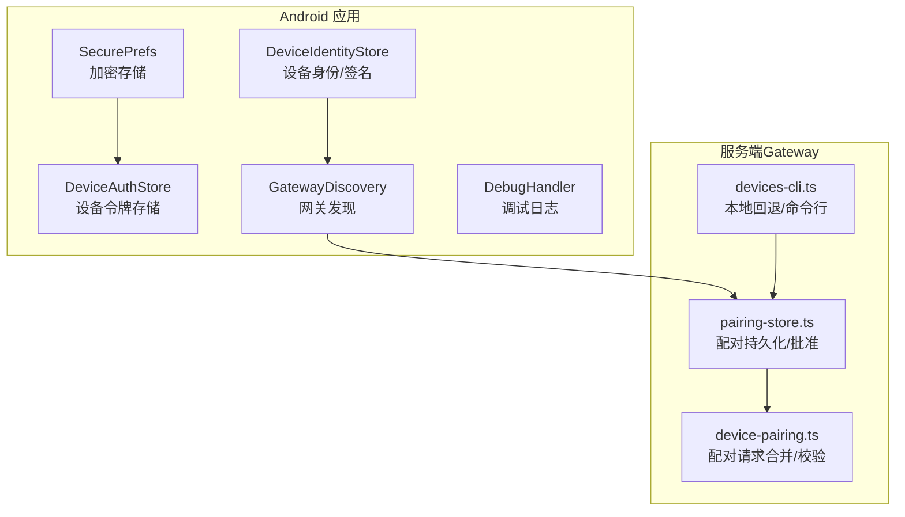
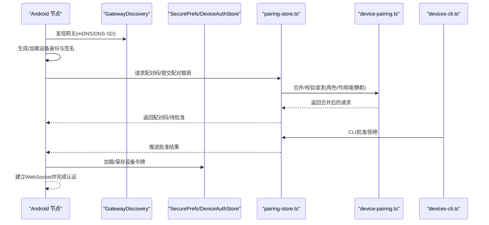
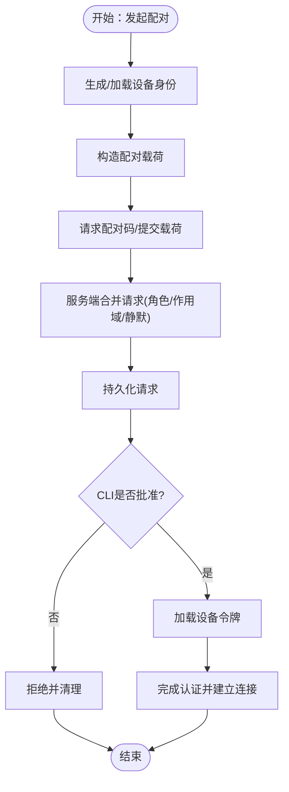
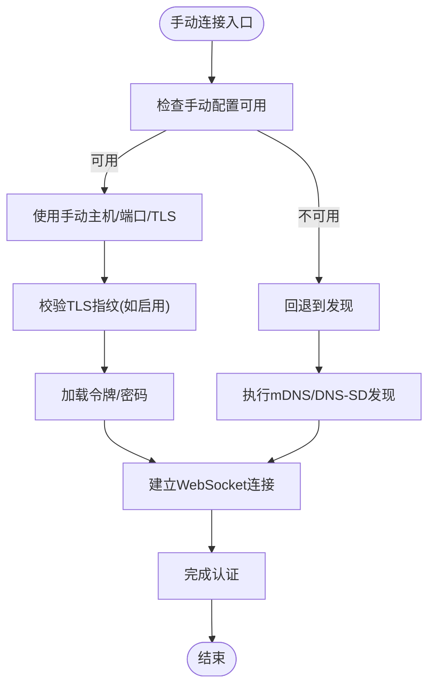
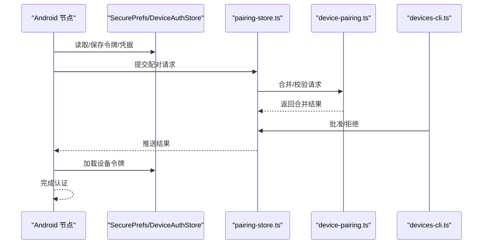
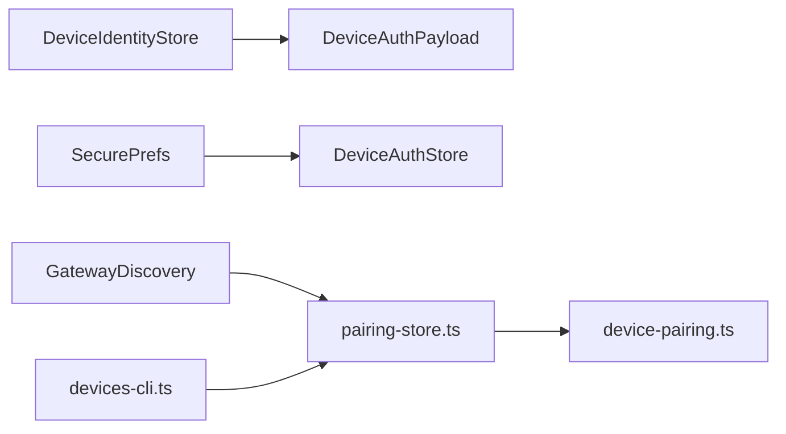

# 连接与配对

<cite>
**本文引用的文件**
- [apps/android/app/src/main/java/ai/openclaw/app/SecurePrefs.kt](file://apps/android/app/src/main/java/ai/openclaw/app/SecurePrefs.kt)
- [apps/android/app/src/main/java/ai/openclaw/app/gateway/DeviceAuthStore.kt](file://apps/android/app/src/main/java/ai/openclaw/app/gateway/DeviceAuthStore.kt)
- [apps/android/app/src/main/java/ai/openclaw/app/gateway/DeviceIdentityStore.kt](file://apps/android/app/src/main/java/ai/openclaw/app/gateway/DeviceIdentityStore.kt)
- [apps/android/app/src/main/java/ai/openclaw/app/gateway/DeviceAuthPayload.kt](file://apps/android/app/src/main/java/ai/openclaw/app/gateway/DeviceAuthPayload.kt)
- [apps/android/app/src/main/java/ai/openclaw/app/gateway/GatewayDiscovery.kt](file://apps/android/app/src/main/java/ai/openclaw/app/gateway/GatewayDiscovery.kt)
- [apps/android/app/src/main/java/ai/openclaw/app/node/DebugHandler.kt](file://apps/android/app/src/main/java/ai/openclaw/app/node/DebugHandler.kt)
- [src/infra/device-pairing.ts](file://src/infra/device-pairing.ts)
- [src/pairing/pairing-store.ts](file://src/pairing/pairing-store.ts)
- [src/cli/devices-cli.ts](file://src/cli/devices-cli.ts)
- [src/gateway/android-node.capabilities.live.test.ts](file://src/gateway/android-node.capabilities.live.test.ts)
- [docs/platforms/android.md](file://docs/platforms/android.md)
- [apps/android/README.md](file://apps/android/README.md)
</cite>

## 目录

1. [简介](#简介)
2. [项目结构](#项目结构)
3. [核心组件](#核心组件)
4. [架构总览](#架构总览)
5. [详细组件分析](#详细组件分析)
6. [依赖关系分析](#依赖关系分析)
7. [性能考量](#性能考量)
8. [故障排除指南](#故障排除指南)
9. [结论](#结论)
10. [附录](#附录)

## 简介

本文件面向Android节点的连接与配对能力，系统性阐述两类连接模式：Setup Code（设置码）与Manual（手动）模式的实现原理、使用流程与最佳实践；详述配对请求的生成、合并、批准与拒绝流程；解释设备身份与签名、加密持久化存储、网关认证状态管理以及生物识别锁定等安全机制；并提供USB调试连接、ADB反向代理与本地网关测试方法，最后给出网络配置与安全最佳实践。

## 项目结构

Android节点侧的关键实现集中在应用模块中，包括：

- 安全偏好与加密存储：用于保存网关令牌、密码、TLS指纹与设备级认证令牌
- 设备身份与签名：生成Ed25519密钥对、派生设备ID、对配对载荷进行签名与自验证
- 网关发现：基于mDNS/NSD与DNS-SD的本地与广域网关发现
- 调试与日志：在调试构建中支持日志抓取与诊断

服务端侧（Gateway）的配对与设备管理逻辑由基础设施与CLI工具支撑，包括配对请求合并、批准/拒绝、持久化与过期清理。

**图表来源**

- [apps/android/app/src/main/java/ai/openclaw/app/SecurePrefs.kt:178-219](file://apps/android/app/src/main/java/ai/openclaw/app/SecurePrefs.kt#L178-L219)
- [apps/android/app/src/main/java/ai/openclaw/app/gateway/DeviceIdentityStore.kt:10-175](file://apps/android/app/src/main/java/ai/openclaw/app/gateway/DeviceIdentityStore.kt#L10-L175)
- [apps/android/app/src/main/java/ai/openclaw/app/gateway/DeviceAuthStore.kt:10-31](file://apps/android/app/src/main/java/ai/openclaw/app/gateway/DeviceAuthStore.kt#L10-L31)
- [apps/android/app/src/main/java/ai/openclaw/app/gateway/GatewayDiscovery.kt:47-193](file://apps/android/app/src/main/java/ai/openclaw/app/gateway/GatewayDiscovery.kt#L47-L193)
- [src/infra/device-pairing.ts:159-193](file://src/infra/device-pairing.ts#L159-L193)
- [src/pairing/pairing-store.ts:768-809](file://src/pairing/pairing-store.ts#L768-L809)
- [src/cli/devices-cli.ts:100-127](file://src/cli/devices-cli.ts#L100-L127)

**章节来源**

- [docs/platforms/android.md:24-120](file://docs/platforms/android.md#L24-L120)
- [apps/android/README.md:179-207](file://apps/android/README.md#L179-L207)

## 核心组件

- 加密持久化存储（Android）
  - SecurePrefs：提供加密SharedPreferences与明文SharedPreferences双通道，用于保存网关令牌、密码、TLS指纹、实例ID与设备显示名等
  - DeviceAuthStore：按设备ID与角色维度存储设备级认证令牌
- 设备身份与签名（Android）
  - DeviceIdentityStore：生成Ed25519密钥对，派生设备ID，对配对载荷进行签名与自验证
  - DeviceAuthPayload：构造标准化的配对载荷字符串，确保跨语言一致性
- 网关发现（Android）
  - GatewayDiscovery：基于mDNS/NSD与DNS-SD的本地与广域网关发现，支持TLS指纹与端口信息解析
- 配对与批准（服务端）
  - device-pairing.ts：合并重复/并发配对请求、角色与作用域合并、静默策略与修复标记
  - pairing-store.ts：生成唯一配对码、持久化请求、批准/拒绝与过期清理
  - devices-cli.ts：在“需要配对”的错误且满足条件时，自动回退到本地配对文件路径

**章节来源**

- [apps/android/app/src/main/java/ai/openclaw/app/SecurePrefs.kt:178-219](file://apps/android/app/src/main/java/ai/openclaw/app/SecurePrefs.kt#L178-L219)
- [apps/android/app/src/main/java/ai/openclaw/app/gateway/DeviceAuthStore.kt:10-31](file://apps/android/app/src/main/java/ai/openclaw/app/gateway/DeviceAuthStore.kt#L10-L31)
- [apps/android/app/src/main/java/ai/openclaw/app/gateway/DeviceIdentityStore.kt:10-175](file://apps/android/app/src/main/java/ai/openclaw/app/gateway/DeviceIdentityStore.kt#L10-L175)
- [apps/android/app/src/main/java/ai/openclaw/app/gateway/DeviceAuthPayload.kt:35-51](file://apps/android/app/src/main/java/ai/openclaw/app/gateway/DeviceAuthPayload.kt#L35-L51)
- [apps/android/app/src/main/java/ai/openclaw/app/gateway/GatewayDiscovery.kt:47-193](file://apps/android/app/src/main/java/ai/openclaw/app/gateway/GatewayDiscovery.kt#L47-L193)
- [src/infra/device-pairing.ts:159-193](file://src/infra/device-pairing.ts#L159-L193)
- [src/pairing/pairing-store.ts:768-809](file://src/pairing/pairing-store.ts#L768-L809)
- [src/cli/devices-cli.ts:100-127](file://src/cli/devices-cli.ts#L100-L127)

## 架构总览

Android节点通过mDNS/NSD或DNS-SD发现网关，建立WebSocket连接，并以“node”角色发起配对请求。请求经服务端合并与持久化后，等待CLI批准。批准后，节点加载设备级令牌并完成认证，随后保持长连接。

**图表来源**

- [apps/android/app/src/main/java/ai/openclaw/app/gateway/GatewayDiscovery.kt:47-193](file://apps/android/app/src/main/java/ai/openclaw/app/gateway/GatewayDiscovery.kt#L47-L193)
- [apps/android/app/src/main/java/ai/openclaw/app/gateway/DeviceIdentityStore.kt:10-175](file://apps/android/app/src/main/java/ai/openclaw/app/gateway/DeviceIdentityStore.kt#L10-L175)
- [apps/android/app/src/main/java/ai/openclaw/app/SecurePrefs.kt:178-219](file://apps/android/app/src/main/java/ai/openclaw/app/SecurePrefs.kt#L178-L219)
- [src/pairing/pairing-store.ts:768-809](file://src/pairing/pairing-store.ts#L768-L809)
- [src/infra/device-pairing.ts:159-193](file://src/infra/device-pairing.ts#L159-L193)
- [src/cli/devices-cli.ts:100-127](file://src/cli/devices-cli.ts#L100-L127)

## 详细组件分析

### Setup Code（设置码）配对模式

- 流程要点
  - Android节点生成设备身份与签名，构造标准化配对载荷
  - 通过服务端配对存储生成唯一配对码并持久化请求
  - CLI批准后，节点加载设备令牌并完成认证
- 关键实现
  - 设备身份与签名：DeviceIdentityStore负责密钥生成、设备ID派生、签名与自验证
  - 配对载荷：DeviceAuthPayload构造标准化字符串，确保跨语言一致性
  - 配对持久化与批准：pairing-store.ts生成配对码、写入文件；device-pairing.ts合并请求与静默策略

**图表来源**

- [apps/android/app/src/main/java/ai/openclaw/app/gateway/DeviceIdentityStore.kt:10-175](file://apps/android/app/src/main/java/ai/openclaw/app/gateway/DeviceIdentityStore.kt#L10-L175)
- [apps/android/app/src/main/java/ai/openclaw/app/gateway/DeviceAuthPayload.kt:35-51](file://apps/android/app/src/main/java/ai/openclaw/app/gateway/DeviceAuthPayload.kt#L35-L51)
- [src/pairing/pairing-store.ts:768-809](file://src/pairing/pairing-store.ts#L768-L809)
- [src/infra/device-pairing.ts:159-193](file://src/infra/device-pairing.ts#L159-L193)

**章节来源**

- [apps/android/app/src/main/java/ai/openclaw/app/gateway/DeviceIdentityStore.kt:10-175](file://apps/android/app/src/main/java/ai/openclaw/app/gateway/DeviceIdentityStore.kt#L10-L175)
- [apps/android/app/src/main/java/ai/openclaw/app/gateway/DeviceAuthPayload.kt:35-51](file://apps/android/app/src/main/java/ai/openclaw/app/gateway/DeviceAuthPayload.kt#L35-L51)
- [src/pairing/pairing-store.ts:768-809](file://src/pairing/pairing-store.ts#L768-L809)
- [src/infra/device-pairing.ts:159-193](file://src/infra/device-pairing.ts#L159-L193)

### Manual（手动）连接模式

- 场景与用途
  - 当发现受限或不可用时，使用手动主机/端口/TLS/令牌/密码进行连接
- 存储与加载
  - SecurePrefs提供手动开关、主机、端口、TLS标志与令牌/密码的读写
  - DeviceAuthStore按设备ID与角色维度保存设备令牌
- 网关发现回退
  - GatewayDiscovery优先本地与广域发现；失败时可切换手动配置

**图表来源**

- [apps/android/app/src/main/java/ai/openclaw/app/SecurePrefs.kt:178-219](file://apps/android/app/src/main/java/ai/openclaw/app/SecurePrefs.kt#L178-L219)
- [apps/android/app/src/main/java/ai/openclaw/app/gateway/DeviceAuthStore.kt:10-31](file://apps/android/app/src/main/java/ai/openclaw/app/gateway/DeviceAuthStore.kt#L10-L31)
- [apps/android/app/src/main/java/ai/openclaw/app/gateway/GatewayDiscovery.kt:47-193](file://apps/android/app/src/main/java/ai/openclaw/app/gateway/GatewayDiscovery.kt#L47-L193)

**章节来源**

- [apps/android/app/src/main/java/ai/openclaw/app/SecurePrefs.kt:178-219](file://apps/android/app/src/main/java/ai/openclaw/app/SecurePrefs.kt#L178-L219)
- [apps/android/app/src/main/java/ai/openclaw/app/gateway/DeviceAuthStore.kt:10-31](file://apps/android/app/src/main/java/ai/openclaw/app/gateway/DeviceAuthStore.kt#L10-L31)
- [apps/android/app/src/main/java/ai/openclaw/app/gateway/GatewayDiscovery.kt:47-193](file://apps/android/app/src/main/java/ai/openclaw/app/gateway/GatewayDiscovery.kt#L47-L193)

### 配对请求流程、权限审批与安全验证

- 请求合并与静默策略
  - device-pairing.ts对相同设备的多次请求进行合并，合并角色与作用域，保留静默策略与修复标记
- 权限审批
  - devices-cli.ts在满足条件时自动回退到本地配对文件路径，避免远程URL导致的意外切换
  - pairing-store.ts批准/拒绝流程返回明确结果，供节点侧处理
- 安全验证
  - DeviceIdentityStore对配对载荷进行Ed25519签名与自验证，防止篡改
  - SecurePrefs使用加密SharedPreferences存储敏感凭据，降低泄露风险

**图表来源**

- [src/infra/device-pairing.ts:159-193](file://src/infra/device-pairing.ts#L159-L193)
- [src/pairing/pairing-store.ts:768-809](file://src/pairing/pairing-store.ts#L768-L809)
- [src/cli/devices-cli.ts:100-127](file://src/cli/devices-cli.ts#L100-L127)
- [apps/android/app/src/main/java/ai/openclaw/app/SecurePrefs.kt:178-219](file://apps/android/app/src/main/java/ai/openclaw/app/SecurePrefs.kt#L178-L219)
- [apps/android/app/src/main/java/ai/openclaw/app/gateway/DeviceAuthStore.kt:10-31](file://apps/android/app/src/main/java/ai/openclaw/app/gateway/DeviceAuthStore.kt#L10-L31)

**章节来源**

- [src/infra/device-pairing.ts:159-193](file://src/infra/device-pairing.ts#L159-L193)
- [src/pairing/pairing-store.ts:768-809](file://src/pairing/pairing-store.ts#L768-L809)
- [src/cli/devices-cli.ts:100-127](file://src/cli/devices-cli.ts#L100-L127)

### 加密持久化存储、网关认证状态管理与生物识别锁定

- 加密存储
  - SecurePrefs使用加密SharedPreferences保存令牌、密码与TLS指纹，确保凭据机密性
- 认证状态
  - DeviceAuthStore按设备ID与角色维度保存令牌，便于节点侧快速恢复认证
- 生物识别锁定
  - 文档未提供Android侧生物识别锁定的具体实现细节；建议结合系统BiometricPrompt与加密存储策略，在应用层实现“解锁后可见/使用”的访问控制

**章节来源**

- [apps/android/app/src/main/java/ai/openclaw/app/SecurePrefs.kt:178-219](file://apps/android/app/src/main/java/ai/openclaw/app/SecurePrefs.kt#L178-L219)
- [apps/android/app/src/main/java/ai/openclaw/app/gateway/DeviceAuthStore.kt:10-31](file://apps/android/app/src/main/java/ai/openclaw/app/gateway/DeviceAuthStore.kt#L10-L31)

### USB调试连接、ADB反向代理与本地网关测试

- USB调试与ADB反向代理
  - 在开发与测试场景中，可通过adb reverse将设备端口转发至本地网关端口，便于快速联调
- 本地网关测试
  - 通过环境变量覆盖网关URL/令牌/密码，配合CLI命令进行自动化测试
  - live测试脚本演示了如何解析连接参数、建立客户端并选择目标节点

**章节来源**

- [apps/android/README.md:179-207](file://apps/android/README.md#L179-L207)
- [src/gateway/android-node.capabilities.live.test.ts:236-427](file://src/gateway/android-node.capabilities.live.test.ts#L236-L427)

## 依赖关系分析

- Android侧组件耦合
  - DeviceIdentityStore与DeviceAuthPayload强关联，前者提供密钥与签名，后者提供标准化载荷
  - SecurePrefs与DeviceAuthStore共同构成凭据生命周期管理
  - GatewayDiscovery为配对与连接提供入口，依赖系统网络与DNS能力
- 服务端耦合
  - pairing-store.ts与device-pairing.ts形成“持久化—合并—批准”的闭环
  - devices-cli.ts在特定条件下触发本地配对文件路径回退，提升可用性

**图表来源**

- [apps/android/app/src/main/java/ai/openclaw/app/gateway/DeviceIdentityStore.kt:10-175](file://apps/android/app/src/main/java/ai/openclaw/app/gateway/DeviceIdentityStore.kt#L10-L175)
- [apps/android/app/src/main/java/ai/openclaw/app/gateway/DeviceAuthPayload.kt:35-51](file://apps/android/app/src/main/java/ai/openclaw/app/gateway/DeviceAuthPayload.kt#L35-L51)
- [apps/android/app/src/main/java/ai/openclaw/app/SecurePrefs.kt:178-219](file://apps/android/app/src/main/java/ai/openclaw/app/SecurePrefs.kt#L178-L219)
- [apps/android/app/src/main/java/ai/openclaw/app/gateway/DeviceAuthStore.kt:10-31](file://apps/android/app/src/main/java/ai/openclaw/app/gateway/DeviceAuthStore.kt#L10-L31)
- [apps/android/app/src/main/java/ai/openclaw/app/gateway/GatewayDiscovery.kt:47-193](file://apps/android/app/src/main/java/ai/openclaw/app/gateway/GatewayDiscovery.kt#L47-L193)
- [src/pairing/pairing-store.ts:768-809](file://src/pairing/pairing-store.ts#L768-L809)
- [src/infra/device-pairing.ts:159-193](file://src/infra/device-pairing.ts#L159-L193)
- [src/cli/devices-cli.ts:100-127](file://src/cli/devices-cli.ts#L100-L127)

**章节来源**

- [apps/android/app/src/main/java/ai/openclaw/app/gateway/DeviceIdentityStore.kt:10-175](file://apps/android/app/src/main/java/ai/openclaw/app/gateway/DeviceIdentityStore.kt#L10-L175)
- [apps/android/app/src/main/java/ai/openclaw/app/gateway/DeviceAuthPayload.kt:35-51](file://apps/android/app/src/main/java/ai/openclaw/app/gateway/DeviceAuthPayload.kt#L35-L51)
- [apps/android/app/src/main/java/ai/openclaw/app/SecurePrefs.kt:178-219](file://apps/android/app/src/main/java/ai/openclaw/app/SecurePrefs.kt#L178-L219)
- [apps/android/app/src/main/java/ai/openclaw/app/gateway/DeviceAuthStore.kt:10-31](file://apps/android/app/src/main/java/ai/openclaw/app/gateway/DeviceAuthStore.kt#L10-L31)
- [apps/android/app/src/main/java/ai/openclaw/app/gateway/GatewayDiscovery.kt:47-193](file://apps/android/app/src/main/java/ai/openclaw/app/gateway/GatewayDiscovery.kt#L47-L193)
- [src/pairing/pairing-store.ts:768-809](file://src/pairing/pairing-store.ts#L768-L809)
- [src/infra/device-pairing.ts:159-193](file://src/infra/device-pairing.ts#L159-L193)
- [src/cli/devices-cli.ts:100-127](file://src/cli/devices-cli.ts#L100-L127)

## 性能考量

- 发现与连接
  - 本地mDNS/NSD优先，广域DNS-SD定期刷新，减少不必要的查询开销
- 配对与批准
  - 合并重复请求与作用域，降低服务端处理压力与用户交互次数
- 存储与缓存
  - 设备身份与令牌缓存于内存，避免频繁磁盘IO；加密存储仅在必要时写入

## 故障排除指南

- 连接失败
  - 检查网关是否在本地或广域网络可达；确认mDNS/NSD与DNS-SD记录正确发布
  - 若发现受限，启用手动主机/端口/TLS/令牌/密码
- 配对被拒或超时
  - 通过CLI查看待批准列表并批准；若出现“需要配对”，确认本地配对文件路径可用
- 调试与诊断
  - 在调试构建中使用日志抓取功能，收集设备端日志辅助定位问题

**章节来源**

- [apps/android/app/src/main/java/ai/openclaw/app/gateway/GatewayDiscovery.kt:47-193](file://apps/android/app/src/main/java/ai/openclaw/app/gateway/GatewayDiscovery.kt#L47-L193)
- [src/cli/devices-cli.ts:100-127](file://src/cli/devices-cli.ts#L100-L127)
- [apps/android/app/src/main/java/ai/openclaw/app/node/DebugHandler.kt:72-95](file://apps/android/app/src/main/java/ai/openclaw/app/node/DebugHandler.kt#L72-L95)

## 结论

Android节点的连接与配对体系以“设备身份—标准化载荷—服务端合并—CLI批准—设备令牌加载”为主线，结合加密存储与发现机制，实现了高可用、可审计且安全的连接流程。通过Setup Code与Manual两种模式互补，既满足易用性也兼顾复杂网络场景下的可控性。建议在生产环境中启用TLS指纹校验与最小权限作用域，并结合生物识别锁定与严格的凭据管理策略，进一步强化安全性。

## 附录

- 参考文档与操作手册
  - Android应用与连接操作手册
  - 广域Bonjour与DNS-SD配置示例
  - 本地网关测试与自动化脚本

**章节来源**

- [docs/platforms/android.md:24-120](file://docs/platforms/android.md#L24-L120)
- [apps/android/README.md:179-207](file://apps/android/README.md#L179-L207)
