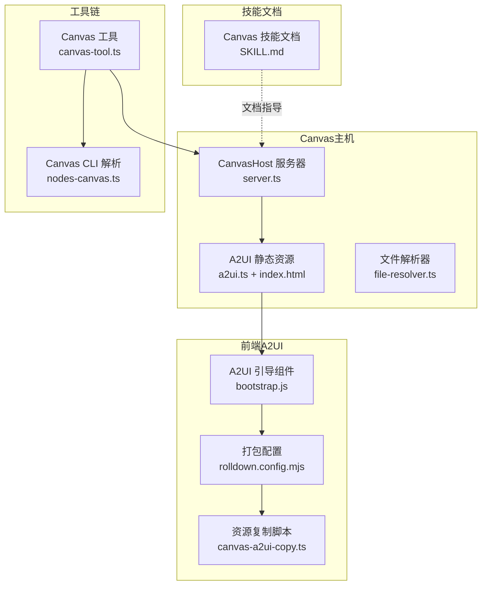
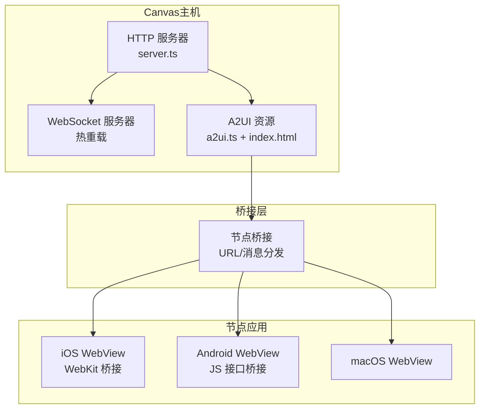
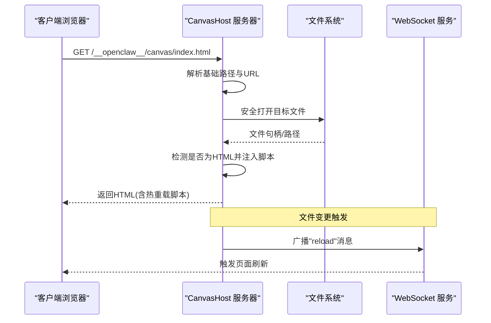
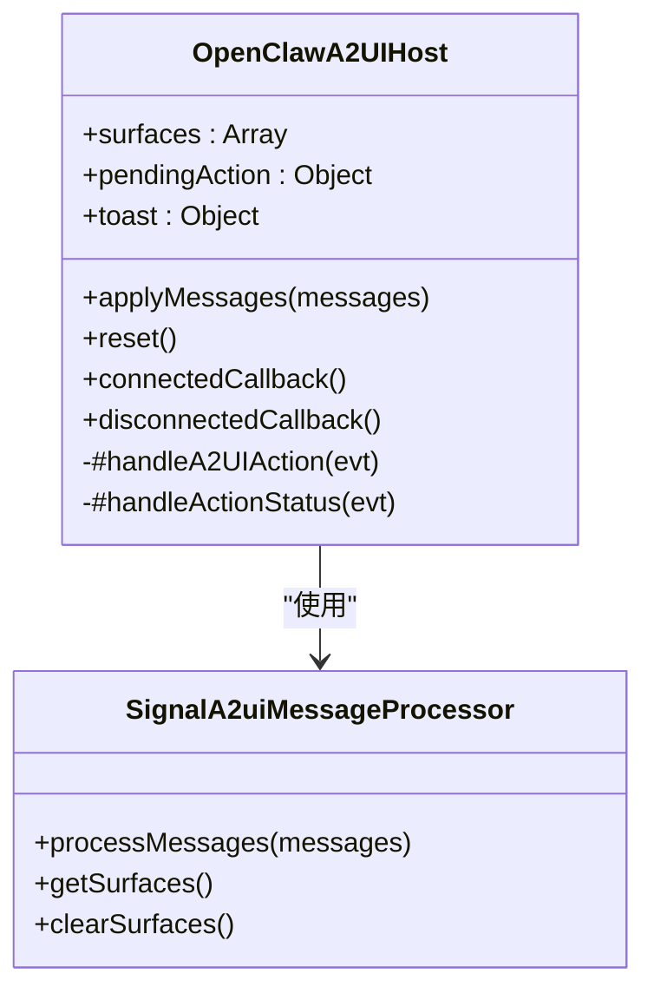
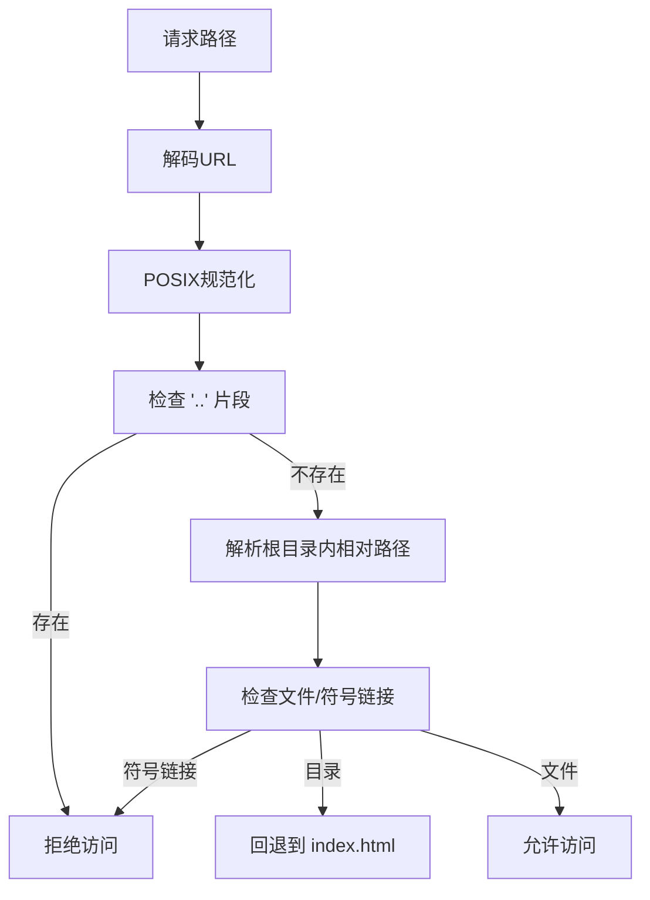
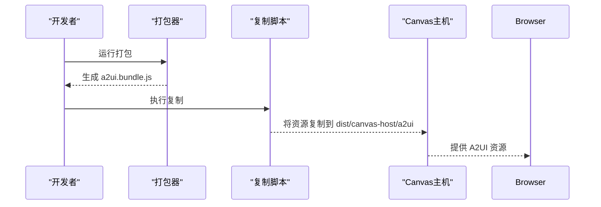
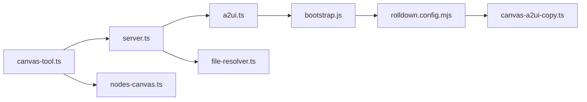

# Canvas可视化系统

<cite>
**本文档引用的文件**
- [server.ts](file://src/canvas-host/server.ts)
- [a2ui.ts](file://src/canvas-host/a2ui.ts)
- [file-resolver.ts](file://src/canvas-host/file-resolver.ts)
- [canvas-tool.ts](file://src/agents/tools/canvas-tool.ts)
- [nodes-canvas.ts](file://src/cli/nodes-canvas.ts)
- [SKILL.md](file://skills/canvas/SKILL.md)
- [bootstrap.js](file://apps/shared/OpenClawKit/Tools/CanvasA2UI/bootstrap.js)
- [rolldown.config.mjs](file://apps/shared/OpenClawKit/Tools/CanvasA2UI/rolldown.config.mjs)
- [canvas-a2ui-copy.ts](file://scripts/canvas-a2ui-copy.ts)
- [index.html](file://src/canvas-host/a2ui/index.html)
- [server.state-dir.test.ts](file://src/canvas-host/server.state-dir.test.ts)
- [server.test.ts](file://src/canvas-host/server.test.ts)
</cite>

## 目录

1. [简介](#简介)
2. [项目结构](#项目结构)
3. [核心组件](#核心组件)
4. [架构总览](#架构总览)
5. [详细组件分析](#详细组件分析)
6. [依赖关系分析](#依赖关系分析)
7. [性能考虑](#性能考虑)
8. [故障排除指南](#故障排除指南)
9. [结论](#结论)
10. [附录](#附录)

## 简介

本文件全面介绍Canvas可视化系统，包括Canvas A2UI架构、跨平台渲染引擎与实时可视化功能；详解Canvas主机服务、客户端连接与数据同步机制；解释Canvas工具链、UI组件库与交互设计规范；并提供配置选项、性能优化与内存管理策略，以及开发指南、调试工具与测试方法，覆盖与各平台节点的集成方案与最佳实践。

## 项目结构

Canvas相关代码主要分布在以下模块：

- canvas-host：Canvas主机HTTP/WebSocket服务器与A2UI静态资源服务
- agents/tools：Canvas工具（present/hide/navigate/eval/snapshot/A2UI）
- cli：Canvas快照解析与临时文件路径处理
- apps/shared/OpenClawKit/Tools/CanvasA2UI：A2UI前端组件与打包配置
- scripts：A2UI资源复制脚本
- skills/canvas：Canvas技能文档与使用说明

**图表来源**

- [server.ts:1-479](file://src/canvas-host/server.ts#L1-L479)
- [a2ui.ts:1-210](file://src/canvas-host/a2ui.ts#L1-L210)
- [file-resolver.ts:1-51](file://src/canvas-host/file-resolver.ts#L1-L51)
- [canvas-tool.ts:1-216](file://src/agents/tools/canvas-tool.ts#L1-L216)
- [nodes-canvas.ts:1-25](file://src/cli/nodes-canvas.ts#L1-L25)
- [bootstrap.js:1-550](file://apps/shared/OpenClawKit/Tools/CanvasA2UI/bootstrap.js#L1-L550)
- [rolldown.config.mjs:1-68](file://apps/shared/OpenClawKit/Tools/CanvasA2UI/rolldown.config.mjs#L1-L68)
- [canvas-a2ui-copy.ts:1-41](file://scripts/canvas-a2ui-copy.ts#L1-L41)
- [SKILL.md:1-199](file://skills/canvas/SKILL.md#L1-L199)

**章节来源**

- [server.ts:1-479](file://src/canvas-host/server.ts#L1-L479)
- [a2ui.ts:1-210](file://src/canvas-host/a2ui.ts#L1-L210)
- [file-resolver.ts:1-51](file://src/canvas-host/file-resolver.ts#L1-L51)
- [canvas-tool.ts:1-216](file://src/agents/tools/canvas-tool.ts#L1-L216)
- [nodes-canvas.ts:1-25](file://src/cli/nodes-canvas.ts#L1-L25)
- [bootstrap.js:1-550](file://apps/shared/OpenClawKit/Tools/CanvasA2UI/bootstrap.js#L1-L550)
- [rolldown.config.mjs:1-68](file://apps/shared/OpenClawKit/Tools/CanvasA2UI/rolldown.config.mjs#L1-L68)
- [canvas-a2ui-copy.ts:1-41](file://scripts/canvas-a2ui-copy.ts#L1-L41)
- [SKILL.md:1-199](file://skills/canvas/SKILL.md#L1-L199)

## 核心组件

- Canvas主机服务器：提供HTTP静态文件服务、WebSocket热重载、A2UI资源服务与安全文件访问控制
- A2UI前端框架：基于Lit与@openclaw主题上下文的跨平台UI组件库，支持消息驱动的界面更新
- Canvas工具：面向代理的Canvas操作工具，封装节点调用与快照输出
- 文件解析器：安全地解析URL到本地文件映射，防止路径穿越与符号链接逃逸
- 打包与复制：Rollup风格打包A2UI前端，复制到Canvas主机可服务目录

**章节来源**

- [server.ts:205-397](file://src/canvas-host/server.ts#L205-L397)
- [a2ui.ts:14-79](file://src/canvas-host/a2ui.ts#L14-L79)
- [canvas-tool.ts:80-216](file://src/agents/tools/canvas-tool.ts#L80-L216)
- [file-resolver.ts:11-50](file://src/canvas-host/file-resolver.ts#L11-L50)
- [rolldown.config.mjs:41-67](file://apps/shared/OpenClawKit/Tools/CanvasA2UI/rolldown.config.mjs#L41-L67)

## 架构总览

Canvas系统采用“主机-桥接-节点”的三层架构：

- Canvas主机：HTTP服务器提供静态内容与WebSocket热重载，同时托管A2UI资源
- 节点桥接：将Canvas URL与A2UI消息推送到各平台节点（iOS/Android/macOS）
- 节点应用：在WebView中渲染Canvas内容，通过原生桥接发送用户动作

**图表来源**

- [server.ts:416-478](file://src/canvas-host/server.ts#L416-L478)
- [a2ui.ts:142-209](file://src/canvas-host/a2ui.ts#L142-L209)
- [SKILL.md:15-27](file://skills/canvas/SKILL.md#L15-L27)

## 详细组件分析

### Canvas主机服务器

- 功能要点
  - 创建HTTP服务器，处理Canvas与A2UI路径请求
  - 支持可选的WebSocket升级用于热重载
  - 使用chokidar监控根目录变更，触发广播重载
  - 安全文件解析，禁止路径穿越与符号链接
  - 默认根目录优先使用状态目录下的canvas子目录
- 关键流程
  - 请求进入时先尝试A2UI路径，再尝试Canvas路径
  - 对HTML注入热重载脚本与跨平台动作桥接
  - 监听文件变更事件，去抖后向所有WebSocket客户端广播“reload”

**图表来源**

- [server.ts:301-379](file://src/canvas-host/server.ts#L301-L379)
- [a2ui.ts:81-140](file://src/canvas-host/a2ui.ts#L81-L140)
- [file-resolver.ts:11-50](file://src/canvas-host/file-resolver.ts#L11-L50)

**章节来源**

- [server.ts:205-397](file://src/canvas-host/server.ts#L205-L397)
- [server.test.ts:95-136](file://src/canvas-host/server.test.ts#L95-L136)

### A2UI前端框架

- 组件模型
  - OpenClawA2UIHost：顶层宿主组件，维护表面集合、待处理动作与吐司提示
  - v0_8.Data.createSignalA2uiMessageProcessor：消息处理器，负责将JSONL消息转换为可渲染的UI表面
  - 主题上下文：@openclaw/a2ui-theme-context，提供统一的主题样式
- 交互流程
  - 监听自定义事件"a2uiaction"，构造userAction并通过原生桥接发送
  - 监听"openclaw:a2ui-action-status"事件，更新动作状态与用户反馈
  - applyMessages接收消息数组，更新UI表面并清除待处理动作
- 跨平台桥接
  - iOS：window.webkit.messageHandlers.openclawCanvasA2UIAction.postMessage
  - Android：window.openclawCanvasA2UIAction.postMessage

**图表来源**

- [bootstrap.js:214-545](file://apps/shared/OpenClawKit/Tools/CanvasA2UI/bootstrap.js#L214-L545)

**章节来源**

- [bootstrap.js:1-550](file://apps/shared/OpenClawKit/Tools/CanvasA2UI/bootstrap.js#L1-L550)
- [a2ui.ts:142-209](file://src/canvas-host/a2ui.ts#L142-L209)

### Canvas工具链与CLI

- Canvas工具
  - 支持动作：present/hide/navigate/eval/snapshot/a2ui_push/a2ui_reset
  - 参数校验与网关调用封装，生成幂等性键
  - 快照输出写入临时文件并返回图像结果
- CLI解析
  - 解析Canvas快照负载格式与base64数据
  - 生成临时文件路径，便于后续展示或归档

```mermaid
flowchart TD
Start(["开始: 调用 canvas 工具"]) --> Parse["解析参数与动作"]
Parse --> Dispatch{"动作类型"}
Dispatch --> |present| Present["调用 canvas.present<br/>可带placement参数"]
Dispatch --> |navigate| Navigate["调用 canvas.navigate"]
Dispatch --> |eval| Eval["调用 canvas.eval<br/>返回结果文本"]
Dispatch --> |snapshot| Snapshot["调用 canvas.snapshot<br/>写入临时文件并返回图片"]
Dispatch --> |a2ui_push| Push["调用 canvas.a2ui.pushJSONL"]
Dispatch --> |a2ui_reset| Reset["调用 canvas.a2ui.reset"]
Present --> End(["结束"])
Navigate --> End
Eval --> End
Snapshot --> End
Push --> End
Reset --> End
```

**图表来源**

- [canvas-tool.ts:80-216](file://src/agents/tools/canvas-tool.ts#L80-L216)
- [nodes-canvas.ts:10-24](file://src/cli/nodes-canvas.ts#L10-L24)

**章节来源**

- [canvas-tool.ts:1-216](file://src/agents/tools/canvas-tool.ts#L1-L216)
- [nodes-canvas.ts:1-25](file://src/cli/nodes-canvas.ts#L1-L25)

### 文件解析与安全

- 安全策略
  - normalizeUrlPath解码并规范化URL路径
  - resolveFileWithinRoot确保相对路径不包含".."，且不解析符号链接
  - 目录访问自动回退到index.html，避免目录列表泄露
- 测试验证
  - 路径穿越与符号链接被拒绝
  - 目录访问返回默认index.html或404

**图表来源**

- [file-resolver.ts:5-50](file://src/canvas-host/file-resolver.ts#L5-L50)

**章节来源**

- [file-resolver.ts:1-51](file://src/canvas-host/file-resolver.ts#L1-L51)
- [server.test.ts:262-313](file://src/canvas-host/server.test.ts#L262-L313)

### A2UI资源构建与部署

- 构建配置
  - rolldown.config.mjs：将bootstrap.js打包为ESM，解析@lit、@a2ui等依赖别名
  - 输出到src/canvas-host/a2ui/a2ui.bundle.js
- 复制脚本
  - canvas-a2ui-copy.ts：校验源与目标目录存在index.html与bundle，执行递归复制
- 入口页面
  - index.html：设置平台数据属性、注入A2UI组件与背景动画，加载a2ui.bundle.js

**图表来源**

- [rolldown.config.mjs:41-67](file://apps/shared/OpenClawKit/Tools/CanvasA2UI/rolldown.config.mjs#L41-L67)
- [canvas-a2ui-copy.ts:13-28](file://scripts/canvas-a2ui-copy.ts#L13-L28)
- [index.html:211-236](file://src/canvas-host/a2ui/index.html#L211-L236)

**章节来源**

- [rolldown.config.mjs:1-68](file://apps/shared/OpenClawKit/Tools/CanvasA2UI/rolldown.config.mjs#L1-L68)
- [canvas-a2ui-copy.ts:1-41](file://scripts/canvas-a2ui-copy.ts#L1-L41)
- [index.html:1-308](file://src/canvas-host/a2ui/index.html#L1-L308)

## 依赖关系分析

- 组件耦合
  - Canvas主机与A2UI：通过常量路径前缀区分Canvas与A2UI资源，避免冲突
  - 文件解析器：被HTTP处理器与A2UI处理器共同使用，保证一致的安全策略
  - 工具链与网关：Canvas工具通过网关调用节点命令，形成清晰的抽象边界
- 外部依赖
  - ws：WebSocket服务端，用于热重载推送
  - chokidar：文件系统监控，支持测试环境轮询
  - @lit、@a2ui：A2UI组件与主题上下文

**图表来源**

- [server.ts:1-479](file://src/canvas-host/server.ts#L1-L479)
- [a2ui.ts:1-210](file://src/canvas-host/a2ui.ts#L1-L210)
- [file-resolver.ts:1-51](file://src/canvas-host/file-resolver.ts#L1-L51)
- [canvas-tool.ts:1-216](file://src/agents/tools/canvas-tool.ts#L1-L216)
- [nodes-canvas.ts:1-25](file://src/cli/nodes-canvas.ts#L1-L25)
- [bootstrap.js:1-550](file://apps/shared/OpenClawKit/Tools/CanvasA2UI/bootstrap.js#L1-L550)
- [rolldown.config.mjs:1-68](file://apps/shared/OpenClawKit/Tools/CanvasA2UI/rolldown.config.mjs#L1-L68)
- [canvas-a2ui-copy.ts:1-41](file://scripts/canvas-a2ui-copy.ts#L1-L41)

**章节来源**

- [server.ts:1-479](file://src/canvas-host/server.ts#L1-L479)
- [a2ui.ts:1-210](file://src/canvas-host/a2ui.ts#L1-L210)
- [canvas-tool.ts:1-216](file://src/agents/tools/canvas-tool.ts#L1-L216)

## 性能考虑

- 热重载优化
  - 去抖机制：文件变更后延迟触发广播，减少频繁刷新
  - awaitWriteFinish：等待写入完成，避免中间态导致的无效刷新
  - 测试模式下启用轮询，确保CI稳定性
- 内存管理
  - WebSocket连接集合及时清理，断开时移除引用
  - 文件句柄在读取后立即关闭，避免句柄泄漏
- 资源服务
  - A2UI资源缓存解析结果，定期重试null值，降低重复查找成本
  - HTML注入脚本仅在需要时添加，避免对非HTML资源产生额外开销

**章节来源**

- [server.ts:224-285](file://src/canvas-host/server.ts#L224-L285)
- [a2ui.ts:61-79](file://src/canvas-host/a2ui.ts#L61-L79)

## 故障排除指南

- 白屏或内容不加载
  - 检查网关绑定模式与实际URL：不同绑定模式对应不同主机名
  - 使用curl直接访问Canvas URL确认可达性
  - 确认WebSocket路径存在且可升级
- “node required”或“node not connected”
  - 确保在调用时指定node参数
  - 使用openclaw nodes list确认节点在线状态
- 内容未更新
  - 检查liveReload配置与文件是否位于canvas根目录
  - 查看日志中的watcher错误信息
- 路径穿越或符号链接问题
  - 确认请求路径不包含".."片段
  - 避免直接访问符号链接文件

**章节来源**

- [SKILL.md:151-180](file://skills/canvas/SKILL.md#L151-L180)
- [server.test.ts:262-313](file://src/canvas-host/server.test.ts#L262-L313)

## 结论

Canvas可视化系统通过清晰的三层架构实现了跨平台的实时可视化能力：主机侧提供安全可靠的静态资源与热重载服务，A2UI前端以消息驱动的方式构建动态UI，工具链与CLI确保与节点的稳定交互。配合完善的测试与安全策略，系统在开发效率与运行稳定性之间取得良好平衡。

## 附录

### 配置选项与路径

- Canvas主机配置
  - canvasHost.enabled：启用/禁用主机
  - canvasHost.port：监听端口（默认18793）
  - canvasHost.root：Canvas根目录（默认状态目录下的canvas）
  - canvasHost.liveReload：是否启用热重载（默认true）
  - gateway.bind：绑定模式（loopback/lan/tailnet/auto）
- A2UI资源路径
  - A2UI_PATH：/**openclaw**/a2ui
  - CANVAS_HOST_PATH：/**openclaw**/canvas
  - CANVAS_WS_PATH：/**openclaw**/ws

**章节来源**

- [SKILL.md:58-74](file://skills/canvas/SKILL.md#L58-L74)
- [a2ui.ts:8-12](file://src/canvas-host/a2ui.ts#L8-L12)

### 开发与测试指南

- 开发步骤
  - 运行A2UI打包：生成a2ui.bundle.js
  - 复制资源：将A2UI资源复制到Canvas主机目录
  - 启动Canvas主机：监听指定端口与根目录
  - 在节点上展示Canvas URL或A2UI页面
- 测试要点
  - 注入热重载脚本验证
  - 禁用热重载时WebSocket应返回404
  - 路径穿越与符号链接访问应被拒绝
  - A2UI资源可正常加载且包含桥接脚本

**章节来源**

- [rolldown.config.mjs:41-67](file://apps/shared/OpenClawKit/Tools/CanvasA2UI/rolldown.config.mjs#L41-L67)
- [canvas-a2ui-copy.ts:13-28](file://scripts/canvas-a2ui-copy.ts#L13-L28)
- [server.test.ts:95-136](file://src/canvas-host/server.test.ts#L95-L136)
- [server.test.ts:205-260](file://src/canvas-host/server.test.ts#L205-L260)
- [server.test.ts:262-313](file://src/canvas-host/server.test.ts#L262-L313)
