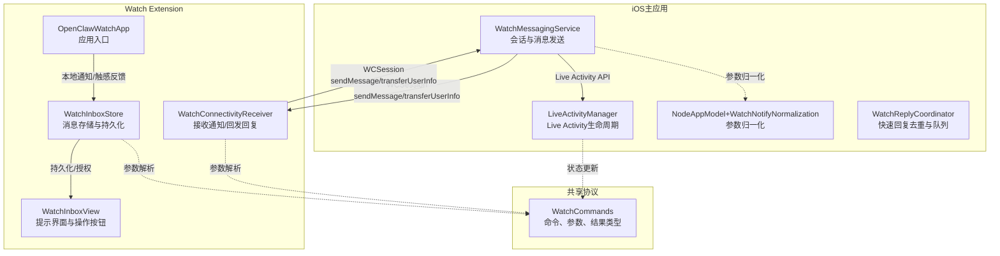
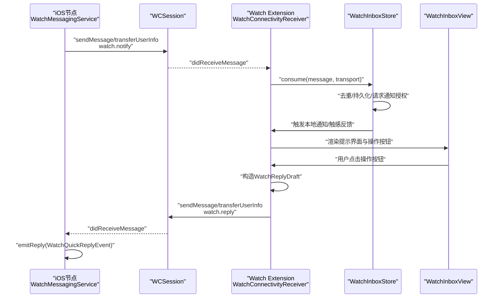
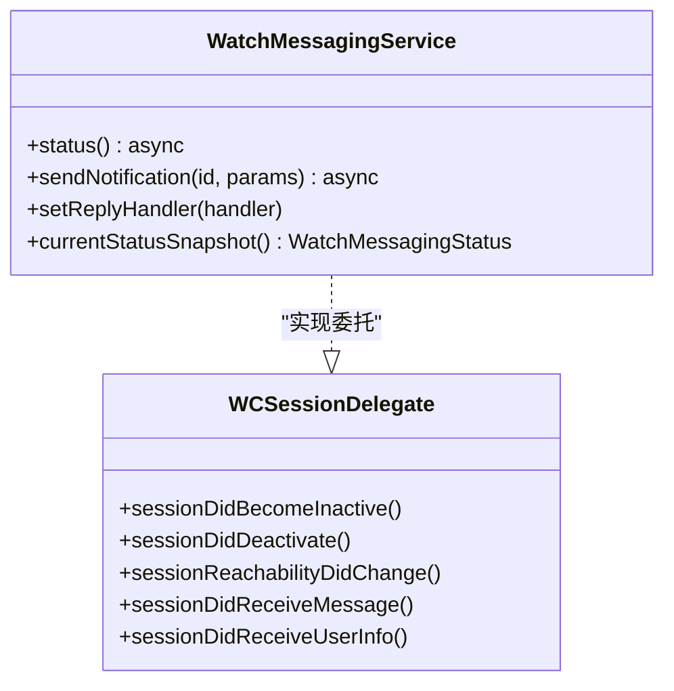
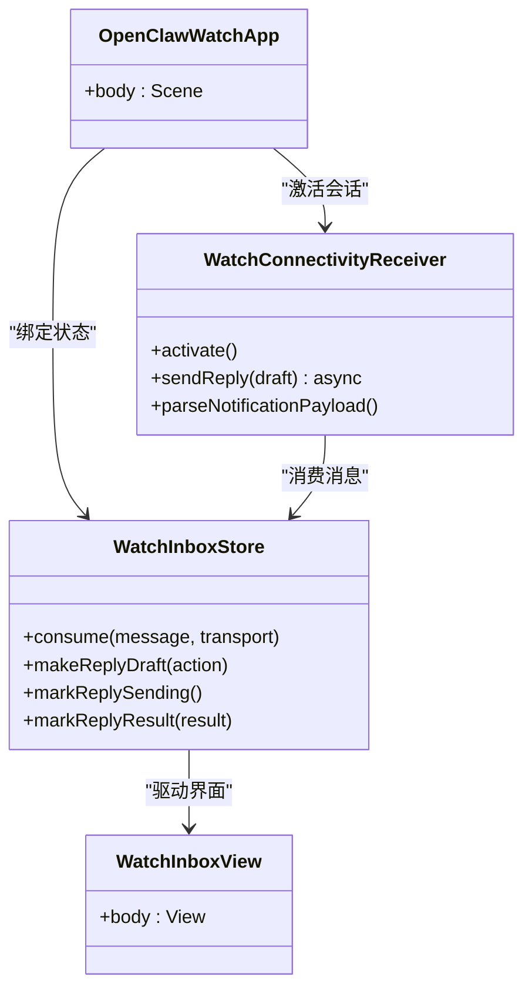
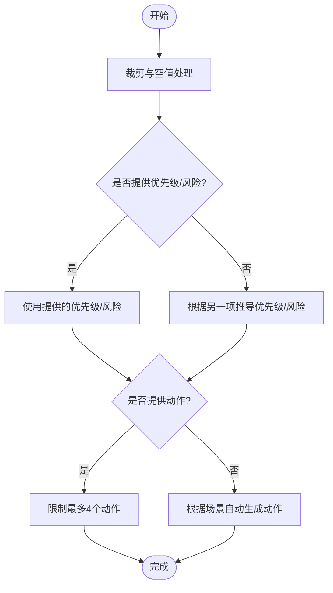
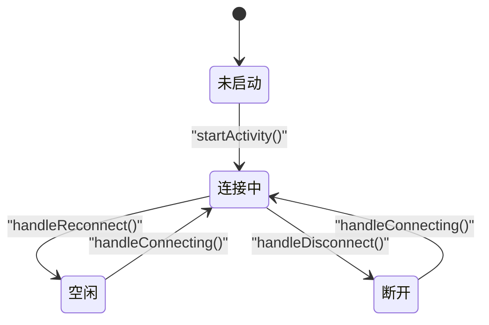
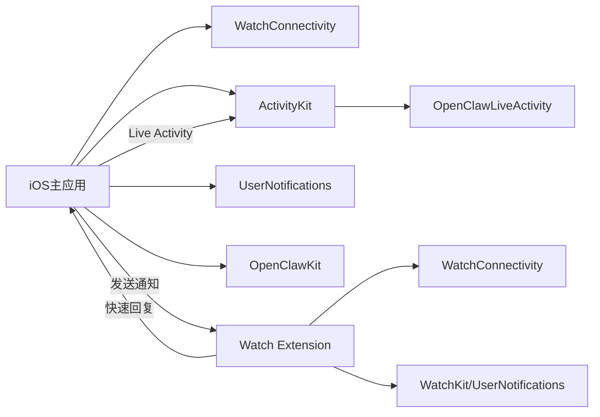

# Apple Watch集成

<cite>
**本文档引用的文件**
- [NodeAppModel+WatchNotifyNormalization.swift](file://apps/ios/Sources/Model/NodeAppModel+WatchNotifyNormalization.swift)
- [WatchReplyCoordinator.swift](file://apps/ios/Sources/Model/WatchReplyCoordinator.swift)
- [WatchMessagingService.swift](file://apps/ios/Sources/Services/WatchMessagingService.swift)
- [OpenClawWatchApp.swift](file://apps/ios/WatchExtension/Sources/OpenClawWatchApp.swift)
- [WatchConnectivityReceiver.swift](file://apps/ios/WatchExtension/Sources/WatchConnectivityReceiver.swift)
- [WatchInboxStore.swift](file://apps/ios/WatchExtension/Sources/WatchInboxStore.swift)
- [WatchInboxView.swift](file://apps/ios/WatchExtension/Sources/WatchInboxView.swift)
- [WatchCommands.swift](file://apps/shared/OpenClawKit/Sources/OpenClawKit/WatchCommands.swift)
- [LiveActivityManager.swift](file://apps/ios/Sources/LiveActivity/LiveActivityManager.swift)
- [OpenClawActivityAttributes.swift](file://apps/ios/Sources/LiveActivity/OpenClawActivityAttributes.swift)
- [OpenClawLiveActivity.swift](file://apps/ios/ActivityWidget/OpenClawLiveActivity.swift)
- [OpenClawActivityWidgetBundle.swift](file://apps/ios/ActivityWidget/OpenClawActivityWidgetBundle.swift)
</cite>

## 目录

1. [简介](#简介)
2. [项目结构](#项目结构)
3. [核心组件](#核心组件)
4. [架构总览](#架构总览)
5. [详细组件分析](#详细组件分析)
6. [依赖关系分析](#依赖关系分析)
7. [性能考虑](#性能考虑)
8. [故障排除指南](#故障排除指南)
9. [结论](#结论)
10. [附录](#附录)

## 简介

本文件面向Apple Watch与iOS节点的集成方案，系统性阐述配对、通信与数据同步机制，解析Watch Extension的架构设计、消息传递与用户交互流程，并覆盖Live Activity功能、通知处理与后台刷新策略。文档同时提供Watch应用界面设计与用户体验优化建议，帮助开发者在保证可靠性的同时提升交互效率。

## 项目结构

Apple Watch集成涉及三个层面：

- iOS主应用：负责WatchConnectivity会话管理、Watch通知发送、Live Activity生命周期控制与状态展示。
- Watch Extension：负责接收通知、渲染提示界面、收集用户快速回复并回传至iPhone。
- 共享协议层：定义跨平台的Watch命令、参数与结果类型，确保两端一致的数据契约。

图表来源

- [WatchMessagingService.swift:24-293](file://apps/ios/Sources/Services/WatchMessagingService.swift#L24-L293)
- [OpenClawWatchApp.swift:4-29](file://apps/ios/WatchExtension/Sources/OpenClawWatchApp.swift#L4-L29)
- [WatchConnectivityReceiver.swift:21-237](file://apps/ios/WatchExtension/Sources/WatchConnectivityReceiver.swift#L21-L237)
- [WatchInboxStore.swift:26-231](file://apps/ios/WatchExtension/Sources/WatchInboxStore.swift#L26-L231)
- [WatchInboxView.swift:3-65](file://apps/ios/WatchExtension/Sources/WatchInboxView.swift#L3-L65)
- [WatchCommands.swift:3-96](file://apps/shared/OpenClawKit/Sources/OpenClawKit/WatchCommands.swift#L3-L96)
- [LiveActivityManager.swift:7-126](file://apps/ios/Sources/LiveActivity/LiveActivityManager.swift#L7-L126)

章节来源

- [WatchMessagingService.swift:24-293](file://apps/ios/Sources/Services/WatchMessagingService.swift#L24-L293)
- [OpenClawWatchApp.swift:4-29](file://apps/ios/WatchExtension/Sources/OpenClawWatchApp.swift#L4-L29)
- [WatchConnectivityReceiver.swift:21-237](file://apps/ios/WatchExtension/Sources/WatchConnectivityReceiver.swift#L21-L237)
- [WatchInboxStore.swift:26-231](file://apps/ios/WatchExtension/Sources/WatchInboxStore.swift#L26-L231)
- [WatchInboxView.swift:3-65](file://apps/ios/WatchExtension/Sources/WatchInboxView.swift#L3-L65)
- [WatchCommands.swift:3-96](file://apps/shared/OpenClawKit/Sources/OpenClawKit/WatchCommands.swift#L3-L96)
- [LiveActivityManager.swift:7-126](file://apps/ios/Sources/LiveActivity/LiveActivityManager.swift#L7-L126)

## 核心组件

- WatchMessagingService（iOS侧）：封装WCSession会话，负责向Watch发送通知、处理快速回复事件、查询连接状态与激活状态。
- WatchConnectivityReceiver（Watch侧）：封装WCSession会话，负责接收来自iPhone的通知消息、解析参数、构造快速回复草稿并发送回iPhone。
- WatchInboxStore（Watch侧）：观察型状态容器，负责消息持久化、去重、本地通知触发与触感反馈映射。
- WatchInboxView（Watch侧）：基于SwiftUI的提示界面，展示标题、正文、详情与可选的操作按钮。
- NodeAppModel+WatchNotifyNormalization（iOS侧）：对发送到Watch的通知参数进行归一化处理，自动补全优先级与风险等级、生成默认快速操作。
- WatchReplyCoordinator（iOS侧）：对快速回复事件进行去重、队列化与重放，保障在网络断开时的可靠交付。
- LiveActivityManager（iOS侧）：管理Live Activity的启动、连接中/空闲/断开状态更新与重复实例清理。
- OpenClawActivityAttributes/OpenClawLiveActivity（iOS侧）：定义Live Activity属性与内容状态，以及锁屏/动态岛屿的Widget视图。
- WatchCommands（共享层）：定义Watch命令、通知参数与结果类型，确保两端一致的数据契约。

章节来源

- [WatchMessagingService.swift:24-293](file://apps/ios/Sources/Services/WatchMessagingService.swift#L24-L293)
- [WatchConnectivityReceiver.swift:21-237](file://apps/ios/WatchExtension/Sources/WatchConnectivityReceiver.swift#L21-L237)
- [WatchInboxStore.swift:26-231](file://apps/ios/WatchExtension/Sources/WatchInboxStore.swift#L26-L231)
- [WatchInboxView.swift:3-65](file://apps/ios/WatchExtension/Sources/WatchInboxView.swift#L3-L65)
- [NodeAppModel+WatchNotifyNormalization.swift:4-104](file://apps/ios/Sources/Model/NodeAppModel+WatchNotifyNormalization.swift#L4-L104)
- [WatchReplyCoordinator.swift:4-47](file://apps/ios/Sources/Model/WatchReplyCoordinator.swift#L4-L47)
- [LiveActivityManager.swift:7-126](file://apps/ios/Sources/LiveActivity/LiveActivityManager.swift#L7-L126)
- [OpenClawActivityAttributes.swift:5-46](file://apps/ios/Sources/LiveActivity/OpenClawActivityAttributes.swift#L5-L46)
- [OpenClawLiveActivity.swift:5-85](file://apps/ios/ActivityWidget/OpenClawLiveActivity.swift#L5-L85)
- [WatchCommands.swift:3-96](file://apps/shared/OpenClawKit/Sources/OpenClawKit/WatchCommands.swift#L3-L96)

## 架构总览

下图展示了从iOS节点到Watch Extension的消息流与状态流转，包括通知发送、快速回复回传、Live Activity状态更新与本地通知触发。

图表来源

- [WatchMessagingService.swift:77-146](file://apps/ios/Sources/Services/WatchMessagingService.swift#L77-L146)
- [WatchConnectivityReceiver.swift:55-111](file://apps/ios/WatchExtension/Sources/WatchConnectivityReceiver.swift#L55-L111)
- [WatchInboxStore.swift:71-106](file://apps/ios/WatchExtension/Sources/WatchInboxStore.swift#L71-L106)
- [WatchInboxView.swift:18-63](file://apps/ios/WatchExtension/Sources/WatchInboxView.swift#L18-L63)

## 详细组件分析

### 组件A：Watch Messaging服务（iOS侧）

职责与特性：

- 会话管理：自动激活WCSession，监听激活状态变化与可达性变化。
- 发送通知：支持立即传输（sendMessage）与队列传输（transferUserInfo），返回交付结果。
- 快速回复：解析来自Watch的回复消息，回调上层处理。
- 错误处理：对不支持设备、未配对、手表应用未安装等场景抛出明确错误。

图表来源

- [WatchMessagingService.swift:24-293](file://apps/ios/Sources/Services/WatchMessagingService.swift#L24-L293)

章节来源

- [WatchMessagingService.swift:24-293](file://apps/ios/Sources/Services/WatchMessagingService.swift#L24-L293)

### 组件B：Watch Extension（Watch侧）

职责与特性：

- 应用入口：初始化消息存储与接收器，启动会话。
- 消息接收：解析watch.notify消息，去重后写入消息存储。
- 快速回复：根据用户选择构造回复草稿，优先使用sendMessage，失败则使用transferUserInfo。
- 用户界面：展示标题、正文、详情与操作按钮；根据状态显示发送中/已发送/排队等提示。

图表来源

- [OpenClawWatchApp.swift:4-29](file://apps/ios/WatchExtension/Sources/OpenClawWatchApp.swift#L4-L29)
- [WatchConnectivityReceiver.swift:21-237](file://apps/ios/WatchExtension/Sources/WatchConnectivityReceiver.swift#L21-L237)
- [WatchInboxStore.swift:26-231](file://apps/ios/WatchExtension/Sources/WatchInboxStore.swift#L26-L231)
- [WatchInboxView.swift:3-65](file://apps/ios/WatchExtension/Sources/WatchInboxView.swift#L3-L65)

章节来源

- [OpenClawWatchApp.swift:4-29](file://apps/ios/WatchExtension/Sources/OpenClawWatchApp.swift#L4-L29)
- [WatchConnectivityReceiver.swift:21-237](file://apps/ios/WatchExtension/Sources/WatchConnectivityReceiver.swift#L21-L237)
- [WatchInboxStore.swift:26-231](file://apps/ios/WatchExtension/Sources/WatchInboxStore.swift#L26-L231)
- [WatchInboxView.swift:3-65](file://apps/ios/WatchExtension/Sources/WatchInboxView.swift#L3-L65)

### 组件C：参数归一化与快速回复协调（iOS侧）

职责与特性：

- 参数归一化：对标题、正文、promptId、sessionKey、kind、details进行裁剪与空值处理；优先使用显式设置的priority/risk，否则按另一者推导。
- 自动快速操作：当无显式动作且处于决策类场景时，自动生成“同意/拒绝/打开iPhone/升级”等常用操作。
- 快速回复协调：对重复replyId去重，网络断开时入队，恢复后批量重放，避免丢失。

图表来源

- [NodeAppModel+WatchNotifyNormalization.swift:5-63](file://apps/ios/Sources/Model/NodeAppModel+WatchNotifyNormalization.swift#L5-L63)
- [WatchReplyCoordinator.swift:15-30](file://apps/ios/Sources/Model/WatchReplyCoordinator.swift#L15-L30)

章节来源

- [NodeAppModel+WatchNotifyNormalization.swift:5-104](file://apps/ios/Sources/Model/NodeAppModel+WatchNotifyNormalization.swift#L5-L104)
- [WatchReplyCoordinator.swift:4-47](file://apps/ios/Sources/Model/WatchReplyCoordinator.swift#L4-L47)

### 组件D：Live Activity与Widget（iOS侧）

职责与特性：

- Live Activity生命周期：启动、连接中、空闲、断开状态切换；启动前检查权限；清理重复实例。
- 属性与内容状态：定义agentName、sessionKey与状态文本、布尔标志与启动时间。
- Widget视图：锁屏/动态岛屿展示连接状态、图标与运行时长；不同布局适配紧凑/扩展视图。

图表来源

- [LiveActivityManager.swift:18-126](file://apps/ios/Sources/LiveActivity/LiveActivityManager.swift#L18-L126)
- [OpenClawActivityAttributes.swift:9-16](file://apps/ios/Sources/LiveActivity/OpenClawActivityAttributes.swift#L9-L16)
- [OpenClawLiveActivity.swift:5-85](file://apps/ios/ActivityWidget/OpenClawLiveActivity.swift#L5-L85)

章节来源

- [LiveActivityManager.swift:7-126](file://apps/ios/Sources/LiveActivity/LiveActivityManager.swift#L7-L126)
- [OpenClawActivityAttributes.swift:5-46](file://apps/ios/Sources/LiveActivity/OpenClawActivityAttributes.swift#L5-L46)
- [OpenClawLiveActivity.swift:5-85](file://apps/ios/ActivityWidget/OpenClawLiveActivity.swift#L5-L85)
- [OpenClawActivityWidgetBundle.swift:4-10](file://apps/ios/ActivityWidget/OpenClawActivityWidgetBundle.swift#L4-L10)

## 依赖关系分析

- iOS主应用依赖WatchConnectivity框架与共享协议层，通过WatchMessagingService统一管理会话与消息。
- Watch Extension依赖WatchConnectivity与系统通知框架，通过WatchInboxStore与WatchInboxView构建用户界面。
- Live Activity依赖ActivityKit与WidgetKit，通过LiveActivityManager与OpenClawLiveActivity实现状态可视化。
- 参数归一化与快速回复协调作为辅助模块，贯穿发送端与接收端，确保一致性与可靠性。

图表来源

- [WatchMessagingService.swift:4-5](file://apps/ios/Sources/Services/WatchMessagingService.swift#L4-L5)
- [WatchConnectivityReceiver.swift:2-3](file://apps/ios/WatchExtension/Sources/WatchConnectivityReceiver.swift#L2-L3)
- [WatchInboxStore.swift:3-4](file://apps/ios/WatchExtension/Sources/WatchInboxStore.swift#L3-L4)
- [LiveActivityManager.swift:1-4](file://apps/ios/Sources/LiveActivity/LiveActivityManager.swift#L1-L4)
- [OpenClawLiveActivity.swift:1-4](file://apps/ios/ActivityWidget/OpenClawLiveActivity.swift#L1-L4)
- [WatchCommands.swift:1-2](file://apps/shared/OpenClawKit/Sources/OpenClawKit/WatchCommands.swift#L1-L2)

章节来源

- [WatchMessagingService.swift:4-5](file://apps/ios/Sources/Services/WatchMessagingService.swift#L4-L5)
- [WatchConnectivityReceiver.swift:2-3](file://apps/ios/WatchExtension/Sources/WatchConnectivityReceiver.swift#L2-L3)
- [WatchInboxStore.swift:3-4](file://apps/ios/WatchExtension/Sources/WatchInboxStore.swift#L3-L4)
- [LiveActivityManager.swift:1-4](file://apps/ios/Sources/LiveActivity/LiveActivityManager.swift#L1-L4)
- [OpenClawLiveActivity.swift:1-4](file://apps/ios/ActivityWidget/OpenClawLiveActivity.swift#L1-L4)
- [WatchCommands.swift:1-2](file://apps/shared/OpenClawKit/Sources/OpenClawKit/WatchCommands.swift#L1-L2)

## 性能考虑

- 传输策略：优先使用sendMessage以获得即时确认；若不可达则回退transferUserInfo进行队列传输，确保消息最终可达。
- 去重与队列：WatchInboxStore对重复消息进行去重；WatchReplyCoordinator在网络断开时缓存快速回复，恢复后批量重放，降低丢失风险。
- 触觉反馈与通知：根据风险级别映射不同触觉类型，避免过度打扰；本地通知采用短延迟触发，减少感知延迟。
- 生命周期管理：LiveActivity启动前检查权限，避免无效调用；重复实例自动清理，防止资源泄漏。

## 故障排除指南

常见问题与定位要点：

- 设备不支持或未配对：WatchMessagingError提供明确错误描述，检查设备能力与配对状态。
- 手表应用未安装：确保Watch Extension正确签名与安装。
- 会话未激活：WatchMessagingService与WatchConnectivityReceiver均会在必要时激活会话；如长时间未激活，检查委托回调与日志。
- 消息未送达：确认reachable状态；若不可达，使用transferUserInfo并等待后续重试。
- 快速回复丢失：检查WatchReplyCoordinator的队列与重放逻辑；确保网络恢复后及时drain。

章节来源

- [WatchMessagingService.swift:6-21](file://apps/ios/Sources/Services/WatchMessagingService.swift#L6-L21)
- [WatchMessagingService.swift:231-293](file://apps/ios/Sources/Services/WatchMessagingService.swift#L231-L293)
- [WatchConnectivityReceiver.swift:35-53](file://apps/ios/WatchExtension/Sources/WatchConnectivityReceiver.swift#L35-L53)
- [WatchReplyCoordinator.swift:15-30](file://apps/ios/Sources/Model/WatchReplyCoordinator.swift#L15-L30)

## 结论

该Apple Watch集成方案通过清晰的分层设计与稳健的消息传递机制，实现了iOS节点与Watch之间的高效协同。参数归一化与快速回复协调提升了可靠性与一致性；Live Activity为用户提供持续可见的状态反馈；Watch Extension以简洁界面承载关键交互。整体架构兼顾了实时性、容错性与用户体验。

## 附录

### 配对与通信流程（概念性说明）

- 首次配对：确保iPhone与Apple Watch已配对并启用相关权限。
- 启动会话：两端在可用时自动激活WCSession，监听可达性变化。
- 发送通知：iOS侧归一化参数后选择最优传输路径。
- 接收与展示：Watch侧解析消息、去重并触发本地通知与触感反馈。
- 回传回复：用户操作后构造回复草稿，优先即时传输，失败则队列传输。

### 用户体验优化建议

- 界面简洁：标题与正文优先，详情作为补充信息；操作按钮数量控制在4以内。
- 反馈及时：发送中/已发送/排队状态明确提示；触觉反馈与声音配合。
- 容错设计：网络断开时保留操作入口，恢复后自动重放；避免重复提交。
- Live Activity：在锁屏与动态岛屿提供关键状态摘要，便于快速了解连接健康状况。
