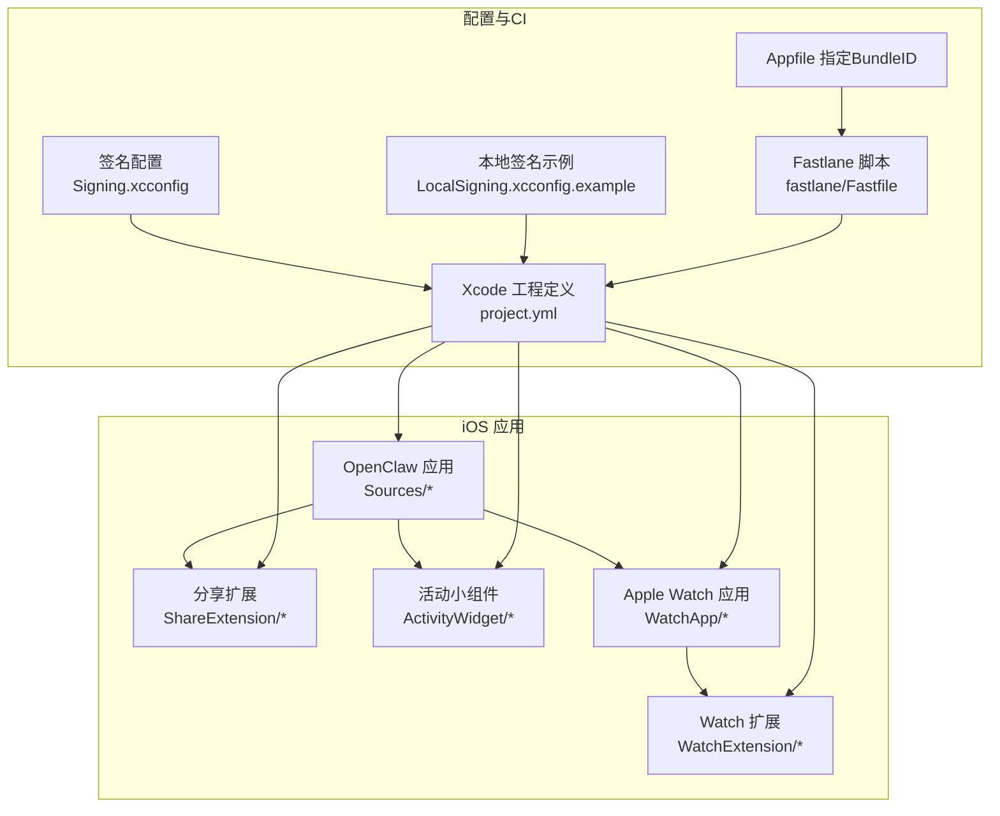
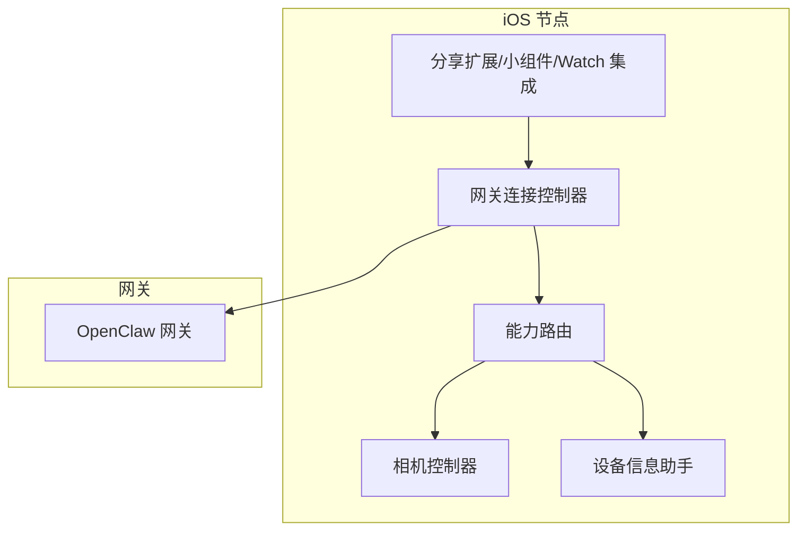
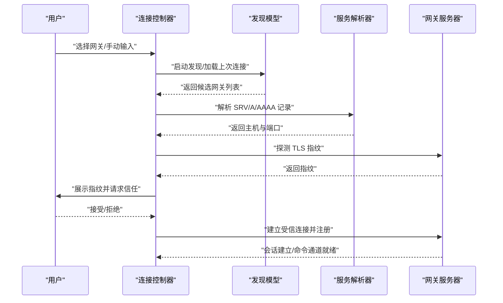
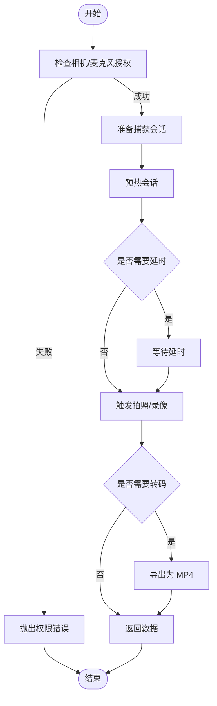
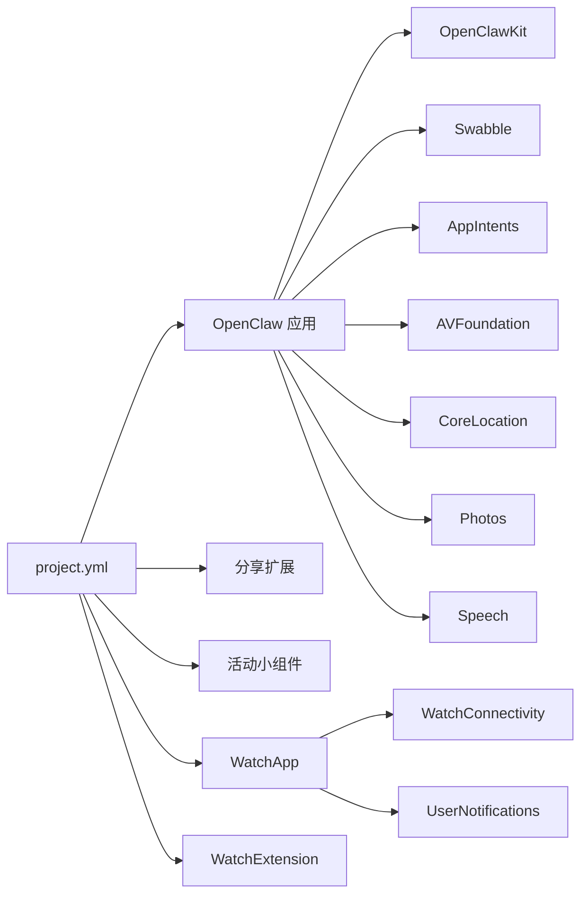

# iOS节点

<cite>
**本文引用的文件**
- [README.md](file://apps/ios/README.md)
- [project.yml](file://apps/ios/project.yml)
- [Signing.xcconfig](file://apps/ios/Signing.xcconfig)
- [LocalSigning.xcconfig.example](file://apps/ios/LocalSigning.xcconfig.example)
- [Fastfile](file://apps/ios/fastlane/Fastfile)
- [Appfile](file://apps/ios/fastlane/Appfile)
- [CameraController.swift](file://apps/ios/Sources/Camera/CameraController.swift)
- [DeviceInfoHelper.swift](file://apps/ios/Sources/Device/DeviceInfoHelper.swift)
- [GatewayConnectionController.swift](file://apps/ios/Sources/Gateway/GatewayConnectionController.swift)
- [NodeCapabilityRouter.swift](file://apps/ios/Sources/Capabilities/NodeCapabilityRouter.swift)
</cite>

## 目录

1. [简介](#简介)
2. [项目结构](#项目结构)
3. [核心组件](#核心组件)
4. [架构总览](#架构总览)
5. [详细组件分析](#详细组件分析)
6. [依赖关系分析](#依赖关系分析)
7. [性能考虑](#性能考虑)
8. [故障排查指南](#故障排查指南)
9. [结论](#结论)
10. [附录](#附录)

## 简介

本文件为 iOS 节点（OpenClaw iOS Node）的完整技术文档，面向开发者与运维人员，覆盖安装部署、签名配置、App Store 发布流程、iOS 特有功能模块（音频录制播放、相机控制、图像处理、位置服务、媒体理解、语音唤醒、Apple Watch 集成）、与网关的安全通信、后台任务处理与权限管理、Xcode 项目配置、代码签名设置、推送通知与深链处理、iOS 版本兼容性、性能优化与调试技巧等。

当前 iOS 节点处于内部超 Alpha 阶段，支持通过发现或手动配置连接到 OpenClaw 网关，具备前台可用的命令能力，并提供分享扩展与小组件、Apple Watch 集成入口。App Store 发布流程已纳入 Fastlane，但当前开发路径未启用 TestFlight。

章节来源

- [README.md:1-142](file://apps/ios/README.md#L1-L142)

## 项目结构

iOS 节点位于 apps/ios 目录，采用 Swift Package Manager 与 XcodeGen 组织工程，核心目录包括：

- Sources：应用主体、网关连接、设备信息、相机控制、能力路由等
- fastlane：自动化构建与上传至 TestFlight 的配置
- ShareExtension/ActivityWidget/WatchApp/WatchExtension：扩展与手表应用
- Config/Signing.xcconfig 与 LocalSigning.xcconfig.example：签名与本地覆盖配置

图示来源

- [project.yml:1-324](file://apps/ios/project.yml#L1-L324)
- [Signing.xcconfig:1-21](file://apps/ios/Signing.xcconfig#L1-L21)
- [LocalSigning.xcconfig.example:1-16](file://apps/ios/LocalSigning.xcconfig.example#L1-L16)
- [Fastfile:1-201](file://apps/ios/fastlane/Fastfile#L1-L201)
- [Appfile:1-16](file://apps/ios/fastlane/Appfile#L1-L16)

章节来源

- [project.yml:1-324](file://apps/ios/project.yml#L1-L324)
- [README.md:21-51](file://apps/ios/README.md#L21-L51)

## 核心组件

- 网关连接控制器：负责发现网关、解析服务端点、TLS 指纹校验、自动重连与会话注册
- 相机控制器：封装相机/麦克风授权、拍照/拍视频、转码与尺寸控制
- 设备信息助手：提供平台版本、设备型号、应用版本等信息
- 能力路由：根据命令分发到具体处理器，统一错误处理
- 分享扩展与活动小组件：桥接系统分享与 Live Activities
- Apple Watch 集成：独立的 WatchApp 与 Watch Extension

章节来源

- [GatewayConnectionController.swift:1-800](file://apps/ios/Sources/Gateway/GatewayConnectionController.swift#L1-L800)
- [CameraController.swift:1-354](file://apps/ios/Sources/Camera/CameraController.swift#L1-L354)
- [DeviceInfoHelper.swift:1-74](file://apps/ios/Sources/Device/DeviceInfoHelper.swift#L1-L74)
- [NodeCapabilityRouter.swift:1-26](file://apps/ios/Sources/Capabilities/NodeCapabilityRouter.swift#L1-L26)

## 架构总览

iOS 节点以“网关连接控制器”为核心，围绕其完成发现、认证、TLS 校验、会话建立与命令分发；同时通过能力路由将来自网关的命令映射到具体能力实现（如相机、位置、屏幕录制等）。应用在 Info.plist 中声明所需权限与后台模式，并通过 entitlements 与签名配置确保安全与功能可用。

图示来源

- [GatewayConnectionController.swift:1-800](file://apps/ios/Sources/Gateway/GatewayConnectionController.swift#L1-L800)
- [NodeCapabilityRouter.swift:1-26](file://apps/ios/Sources/Capabilities/NodeCapabilityRouter.swift#L1-L26)
- [CameraController.swift:1-354](file://apps/ios/Sources/Camera/CameraController.swift#L1-L354)
- [DeviceInfoHelper.swift:1-74](file://apps/ios/Sources/Device/DeviceInfoHelper.swift#L1-L74)

## 详细组件分析

### 网关连接与安全通信

- 发现与解析：使用 Bonjour/MDNS 解析服务端点，必要时回退到地址解析；支持手动主机/端口与 TLS 强制策略
- TLS 指纹校验：首次连接探测指纹，提示用户确认；后续连接基于存储的指纹进行 pinning
- 自动重连：基于场景状态与用户偏好，在后台/前台切换时协调重连
- 会话注册：动态聚合能力、命令与权限，按需刷新注册参数

图示来源

- [GatewayConnectionController.swift:95-278](file://apps/ios/Sources/Gateway/GatewayConnectionController.swift#L95-L278)

章节来源

- [GatewayConnectionController.swift:95-278](file://apps/ios/Sources/Gateway/GatewayConnectionController.swift#L95-L278)

### 相机控制与图像处理

- 授权检查：在执行拍照/录音前检查相机/麦克风授权
- 拍照：支持前置/后置摄像头、指定设备、质量与延迟控制，输出 JPEG 并限制最大宽度
- 录像：支持含/不含音频、时长限制、临时文件管理与 .mov 到 .mp4 转码
- 设备枚举：列出可用摄像头设备及其朝向与类型
- 错误处理：统一映射为可本地化错误描述

图示来源

- [CameraController.swift:40-142](file://apps/ios/Sources/Camera/CameraController.swift#L40-L142)
- [CameraController.swift:154-252](file://apps/ios/Sources/Camera/CameraController.swift#L154-L252)

章节来源

- [CameraController.swift:1-354](file://apps/ios/Sources/Camera/CameraController.swift#L1-L354)

### 设备信息与显示名称

- 提供平台字符串（区分 iPadOS/iPhone）、设备家族、机器型号标识
- 应用版本与构建号展示，支持 UI 显示格式
- 显示名称解析：优先使用用户自定义，否则从设备名与界面形态生成

章节来源

- [DeviceInfoHelper.swift:1-74](file://apps/ios/Sources/Device/DeviceInfoHelper.swift#L1-L74)

### 能力路由与命令分发

- 将命令字符串映射到具体处理器，统一处理未知命令与处理器不可用错误
- 与网关连接控制器配合，动态聚合能力与命令集合

章节来源

- [NodeCapabilityRouter.swift:1-26](file://apps/ios/Sources/Capabilities/NodeCapabilityRouter.swift#L1-L26)

### 分享扩展、活动小组件与 Apple Watch 集成

- 分享扩展：支持文本/图片/视频分享，转发到网关会话
- 活动小组件：Live Activities 支持，声明所需权限
- Apple Watch：独立 WatchApp 与 Watch Extension，声明与 Companion 的 Bundle 关联

章节来源

- [project.yml:145-264](file://apps/ios/project.yml#L145-L264)

## 依赖关系分析

- 工程定义：通过 XcodeGen 与 project.yml 生成工程，集中管理目标、依赖、配置与构建脚本
- 包依赖：OpenClawKit（协议/工具）、Swabble（语言/对话相关）
- SDK 依赖：AppIntents、AVFoundation、CoreLocation、Photos、Speech、WatchConnectivity 等
- 签名与配置：Signing.xcconfig 提供默认签名参数，LocalSigning.xcconfig.example 提供本地覆盖模板

图示来源

- [project.yml:38-144](file://apps/ios/project.yml#L38-L144)

章节来源

- [project.yml:38-144](file://apps/ios/project.yml#L38-L144)

## 性能考虑

- 相机与录制
  - 默认限制照片最大宽度与视频时长，避免网关传输压力
  - 录制完成后进行 .mov 到 .mp4 转码，便于下游处理
- 后台行为
  - 前台优先：后台可能被系统挂起，后台命令受限
  - 位置事件用于自动化信号而非持续常驻
- 连接与重试
  - 自动重连策略与信任提示结合，减少手动干预
  - 场景切换时协调发现与重连，降低死连接状态

章节来源

- [README.md:101-118](file://apps/ios/README.md#L101-L118)
- [CameraController.swift:206-215](file://apps/ios/Sources/Camera/CameraController.swift#L206-L215)
- [GatewayConnectionController.swift:64-75](file://apps/ios/Sources/Gateway/GatewayConnectionController.swift#L64-L75)

## 故障排查指南

- 构建与签名基线
  - 重新生成工程、核对团队与 Bundle ID
- 网关状态与配对
  - 在设置中查看状态、服务器与远端地址；若提示配对/认证阻塞，先在 Telegram 完成配对批准
- 发现与网络
  - 开启发现调试日志，查看发现日志；必要时切换到手动主机/端口+TLS
- 日志过滤
  - Xcode 控制台按子系统/类别过滤，如 ai.openclaw.ios、GatewayDiag、APNs 注册失败
- 背景期望
  - 先在前台复现，再测试后台切换与返回后的重连

章节来源

- [README.md:120-142](file://apps/ios/README.md#L120-L142)

## 结论

iOS 节点以清晰的组件边界与安全的连接流程为基础，覆盖了相机、位置、屏幕录制、语音唤醒与 Apple Watch 等关键能力。通过工程化配置与 Fastlane 流水线，具备了从本地调试到 TestFlight 的发布能力。建议在后续版本中进一步完善后台稳定性、权限一致性与 App Store 上架流程。

## 附录

### 安装与部署（本地手动）

- 前置条件：Xcode 16+、pnpm、xcodegen、Apple Development 签名
- 步骤：安装依赖 → 配置签名 → 生成工程 → 打开项目运行
- 个人团队签名失败时，使用 LocalSigning.xcconfig 示例进行本地覆盖

章节来源

- [README.md:21-51](file://apps/ios/README.md#L21-L51)
- [LocalSigning.xcconfig.example:1-16](file://apps/ios/LocalSigning.xcconfig.example#L1-L16)

### 代码签名与配置

- 默认签名参数由 Signing.xcconfig 提供，支持本地 include 覆盖
- 本地签名示例：复制 LocalSigning.xcconfig.example 为 LocalSigning.xcconfig，按需修改团队与 Bundle ID

章节来源

- [Signing.xcconfig:1-21](file://apps/ios/Signing.xcconfig#L1-L21)
- [LocalSigning.xcconfig.example:1-16](file://apps/ios/LocalSigning.xcconfig.example#L1-L16)

### App Store 发布流程（Fastlane）

- 使用 Fastlane beta lane 构建并上传至 TestFlight
- 通过 App Store Connect API Key 认证，支持多种密钥来源
- metadata lane 可上传元数据与截图

章节来源

- [Fastfile:135-167](file://apps/ios/fastlane/Fastfile#L135-L167)
- [Fastfile:169-193](file://apps/ios/fastlane/Fastfile#L169-L193)
- [Appfile:1-16](file://apps/ios/fastlane/Appfile#L1-16)

### 权限与后台模式

- Info.plist 声明相机、麦克风、定位、运动、照片库、网络使用、后台模式（音频、远程通知）等
- Live Activities 与本地网络使用描述按需启用

章节来源

- [project.yml:106-143](file://apps/ios/project.yml#L106-L143)

### 深度链接与推送通知

- 深链：CFBundleURLTypes 指定 openclaw 协议，用于从外部唤起应用
- 推送：应用启动即注册远程通知；entitlements 中 aps-environment 设置为 development；本地/发布构建分别走沙盒/生产环境

章节来源

- [project.yml:106-112](file://apps/ios/project.yml#L106-L112)
- [README.md:53-61](file://apps/ios/README.md#L53-L61)

### iOS 版本兼容性

- 最低部署版本：iOS 18.0（project.yml）
- Swift 版本：6.0（project.yml）
- WatchOS：11.0（WatchApp/WatchExtension）

章节来源

- [project.yml:4-6](file://apps/ios/project.yml#L4-L6)
- [project.yml:217-218](file://apps/ios/project.yml#L217-L218)
