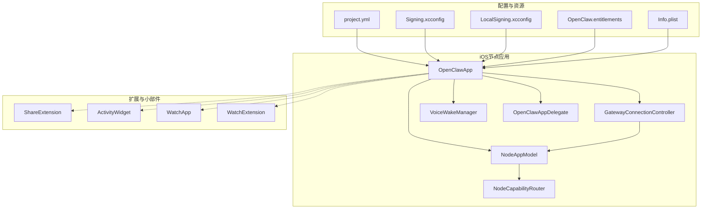
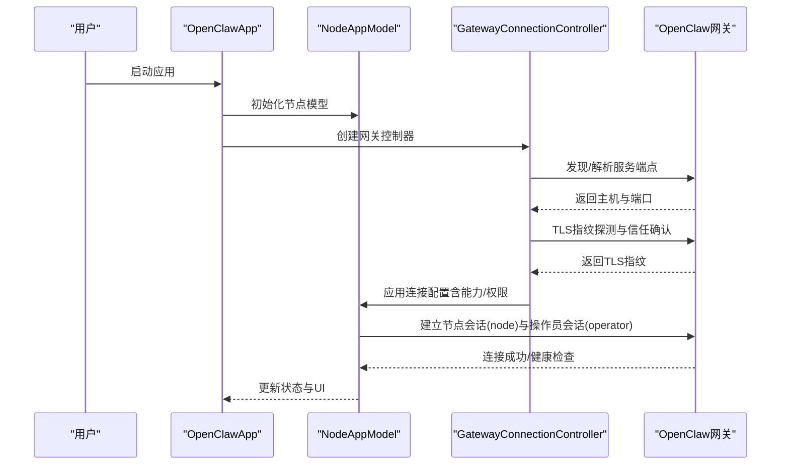
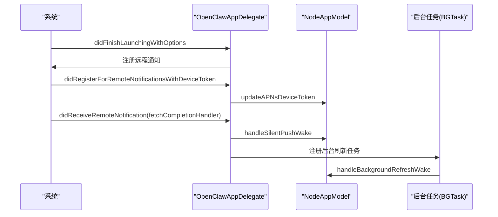
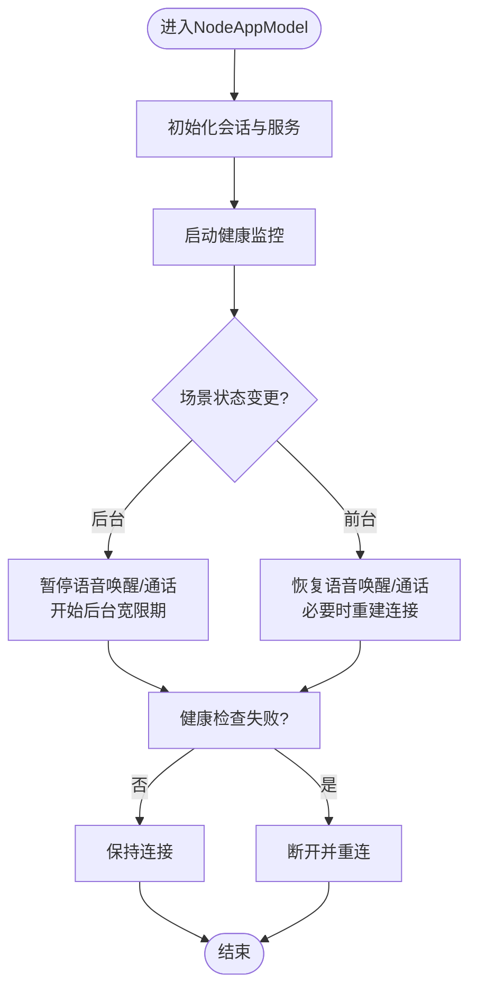
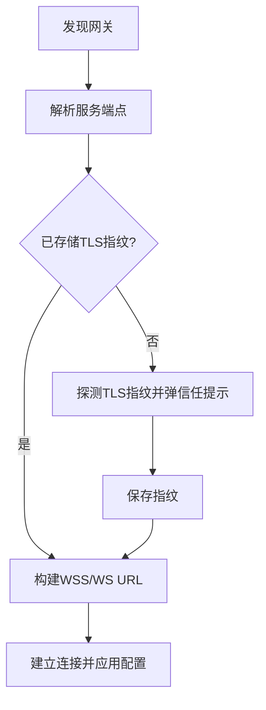
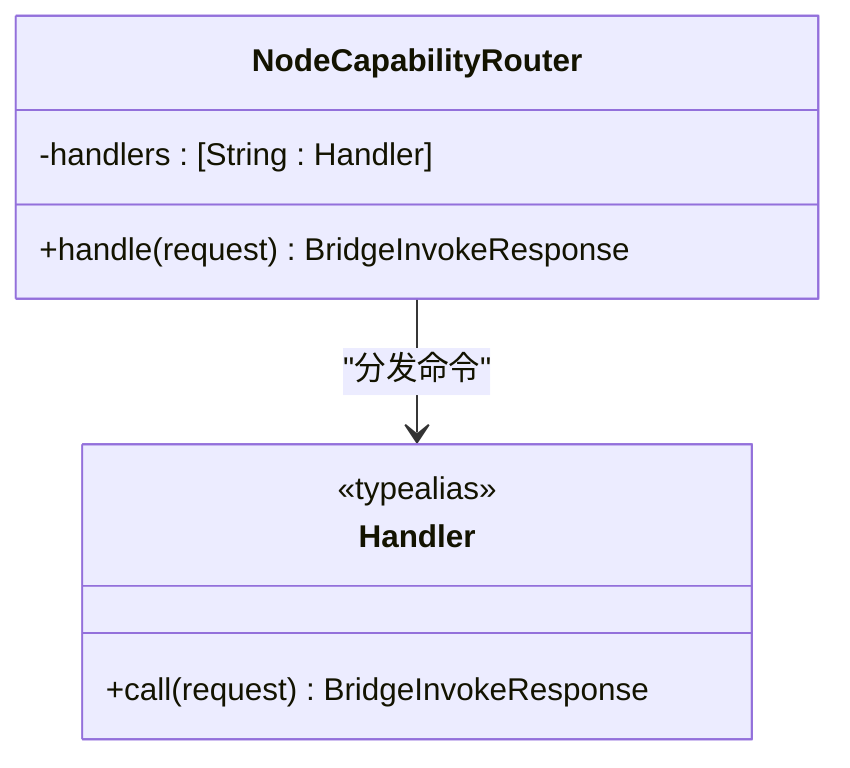
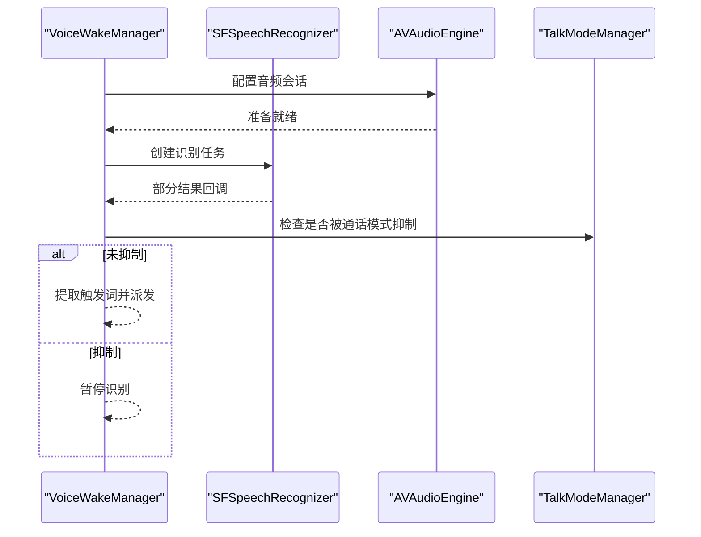
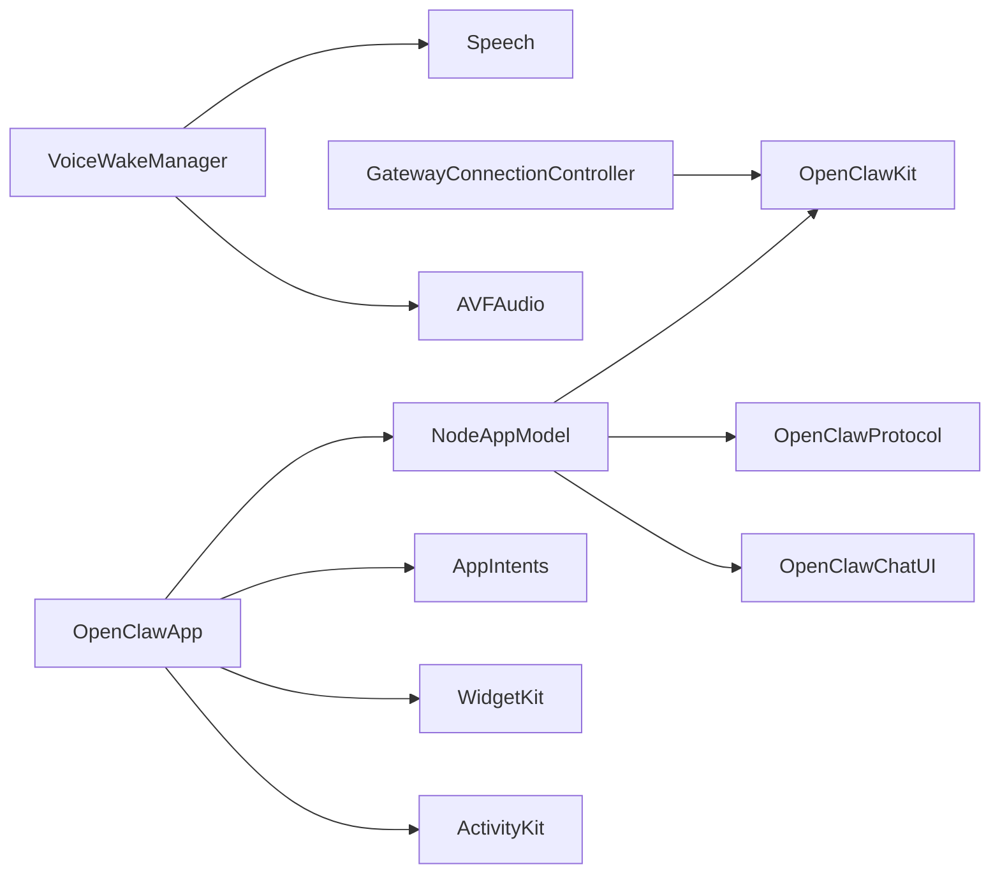

# iOS节点概述

<cite>
**本文档引用的文件**
- [README.md](file://apps/ios/README.md)
- [project.yml](file://apps/ios/project.yml)
- [OpenClawApp.swift](file://apps/ios/Sources/OpenClawApp.swift)
- [NodeAppModel.swift](file://apps/ios/Sources/Model/NodeAppModel.swift)
- [GatewayConnectionController.swift](file://apps/ios/Sources/Gateway/GatewayConnectionController.swift)
- [VoiceWakeManager.swift](file://apps/ios/Sources/Voice/VoiceWakeManager.swift)
- [NodeCapabilityRouter.swift](file://apps/ios/Sources/Capabilities/NodeCapabilityRouter.swift)
- [Signing.xcconfig](file://apps/ios/Signing.xcconfig)
- [LocalSigning.xcconfig.example](file://apps/ios/LocalSigning.xcconfig.example)
- [OpenClaw.entitlements](file://apps/ios/Sources/OpenClaw.entitlements)
- [Info.plist](file://apps/ios/Sources/Info.plist)
</cite>

## 目录

1. [简介](#简介)
2. [项目结构](#项目结构)
3. [核心组件](#核心组件)
4. [架构总览](#架构总览)
5. [详细组件分析](#详细组件分析)
6. [依赖关系分析](#依赖关系分析)
7. [性能考虑](#性能考虑)
8. [故障排除指南](#故障排除指南)
9. [结论](#结论)
10. [附录](#附录)

## 简介

本文件为OpenClaw生态中iOS节点（iPhone应用）的全面概述文档。iOS节点作为OpenClaw体系中的“设备节点”（role: node），负责连接到OpenClaw网关（Gateway），提供设备能力调用、语音唤醒、位置事件、屏幕录制、相机拍照等能力，并通过共享扩展与操作员会话进行交互。该应用当前处于超级Alpha阶段，仅限内部使用，支持前台可靠运行，后台行为仍在加固中。

## 项目结构

iOS节点位于apps/ios目录下，采用XcodeGen生成工程，核心模块包括：

- 应用主体：OpenClawApp、NodeAppModel、RootCanvas、RootTabs等
- 网关连接：GatewayConnectionController、GatewayDiscoveryModel、GatewayTrustPrompt等
- 能力路由：NodeCapabilityRouter及各服务模块（相机、屏幕、位置、联系人、日历、提醒事项、运动、照片等）
- 语音功能：VoiceWakeManager、TalkModeManager
- 扩展与小部件：ShareExtension、ActivityWidget、WatchApp/WatchExtension
- 配置与签名：project.yml、Signing.xcconfig、LocalSigning.xcconfig、OpenClaw.entitlements、Info.plist

**图表来源**

- [project.yml:1-324](file://apps/ios/project.yml#L1-L324)
- [OpenClawApp.swift:492-542](file://apps/ios/Sources/OpenClawApp.swift#L492-L542)
- [NodeAppModel.swift:50-221](file://apps/ios/Sources/Model/NodeAppModel.swift#L50-L221)
- [GatewayConnectionController.swift:22-58](file://apps/ios/Sources/Gateway/GatewayConnectionController.swift#L22-L58)
- [VoiceWakeManager.swift:83-144](file://apps/ios/Sources/Voice/VoiceWakeManager.swift#L83-L144)
- [NodeCapabilityRouter.swift:4-25](file://apps/ios/Sources/Capabilities/NodeCapabilityRouter.swift#L4-L25)

**章节来源**

- [project.yml:1-324](file://apps/ios/project.yml#L1-L324)
- [README.md:1-142](file://apps/ios/README.md#L1-L142)

## 核心组件

- 应用入口与生命周期管理：OpenClawApp、OpenClawAppDelegate负责应用初始化、场景状态变化、远程通知处理、后台唤醒任务调度等。
- 节点模型：NodeAppModel封装了节点与网关的双重连接（node与operator）、能力路由、设备状态、语音唤醒与通话模式协调、位置事件、分享通道等。
- 网关控制器：GatewayConnectionController负责发现网关、解析服务端点、TLS指纹验证、自动重连策略、手动/自动连接配置。
- 能力路由：NodeCapabilityRouter根据命令分发到具体处理器，统一错误处理与权限检查。
- 语音功能：VoiceWakeManager提供本地语音唤醒识别；TalkModeManager与VoiceWakeManager协同控制麦克风占用。
- 扩展与小部件：ShareExtension用于从系统分享面板转发内容至网关会话；ActivityWidget与WatchApp/WatchExtension提供活动小部件与手表联动。

**章节来源**

- [OpenClawApp.swift:492-542](file://apps/ios/Sources/OpenClawApp.swift#L492-L542)
- [NodeAppModel.swift:50-221](file://apps/ios/Sources/Model/NodeAppModel.swift#L50-L221)
- [GatewayConnectionController.swift:22-58](file://apps/ios/Sources/Gateway/GatewayConnectionController.swift#L22-L58)
- [NodeCapabilityRouter.swift:4-25](file://apps/ios/Sources/Capabilities/NodeCapabilityRouter.swift#L4-L25)
- [VoiceWakeManager.swift:83-144](file://apps/ios/Sources/Voice/VoiceWakeManager.swift#L83-L144)

## 架构总览

iOS节点在OpenClaw生态中扮演“设备节点”的角色，通过两个WebSocket会话与网关交互：

- 节点会话（node）：用于设备能力调用（如camera._, screen._, canvas.\*）与节点级指令。
- 操作员会话（operator）：用于聊天、语音通话、语音唤醒配置同步、健康检查等。

应用通过Bonjour服务发现网关，支持TLS指纹信任流程；支持前台可靠运行，后台行为受限且正在优化中。APNs用于静默推送唤醒与后台刷新任务调度。

**图表来源**

- [GatewayConnectionController.swift:95-156](file://apps/ios/Sources/Gateway/GatewayConnectionController.swift#L95-L156)
- [NodeAppModel.swift:688-731](file://apps/ios/Sources/Model/NodeAppModel.swift#L688-L731)

**章节来源**

- [GatewayConnectionController.swift:95-156](file://apps/ios/Sources/Gateway/GatewayConnectionController.swift#L95-L156)
- [NodeAppModel.swift:688-731](file://apps/ios/Sources/Model/NodeAppModel.swift#L688-L731)

## 详细组件分析

### 应用入口与生命周期（OpenClawApp/OpenClawAppDelegate）

- OpenClawApp负责应用初始化、场景状态监听、深链处理、环境注入等。
- OpenClawAppDelegate处理应用生命周期事件、远程通知注册、静默推送唤醒、后台刷新任务、手表提示镜像通知等。

**图表来源**

- [OpenClawApp.swift:50-96](file://apps/ios/Sources/OpenClawApp.swift#L50-L96)
- [OpenClawApp.swift:104-156](file://apps/ios/Sources/OpenClawApp.swift#L104-L156)
- [OpenClawApp.swift:232-262](file://apps/ios/Sources/OpenClawApp.swift#L232-L262)

**章节来源**

- [OpenClawApp.swift:50-96](file://apps/ios/Sources/OpenClawApp.swift#L50-L96)
- [OpenClawApp.swift:104-156](file://apps/ios/Sources/OpenClawApp.swift#L104-L156)
- [OpenClawApp.swift:232-262](file://apps/ios/Sources/OpenClawApp.swift#L232-L262)

### 节点模型（NodeAppModel）

- 双会话架构：维护节点会话与操作员会话，分别用于设备能力调用与聊天/语音/配置。
- 能力路由：通过NodeCapabilityRouter分发命令，统一处理后台限制、权限检查与错误返回。
- 健康监控：周期性健康检查，异常时断开并触发重连。
- 场景切换：前台/后台切换时暂停/恢复语音唤醒与通话模式，必要时强制握手重建连接。
- 位置事件：基于位置授权模式与显著位置变化事件驱动自动化。

**图表来源**

- [NodeAppModel.swift:301-383](file://apps/ios/Sources/Model/NodeAppModel.swift#L301-L383)
- [NodeAppModel.swift:688-731](file://apps/ios/Sources/Model/NodeAppModel.swift#L688-L731)

**章节来源**

- [NodeAppModel.swift:301-383](file://apps/ios/Sources/Model/NodeAppModel.swift#L301-L383)
- [NodeAppModel.swift:688-731](file://apps/ios/Sources/Model/NodeAppModel.swift#L688-L731)

### 网关连接控制器（GatewayConnectionController）

- 发现与解析：通过Bonjour解析服务端点，支持LAN内自动发现与手动输入主机端口。
- TLS信任：首次连接时探测TLS指纹，弹出信任提示；后续连接使用存储的指纹进行严格校验。
- 自动重连：根据用户设置与历史连接记录，优先可信连接，避免明文连接。
- 权限与能力：动态构建连接选项，包含显示名、客户端ID、能力列表、命令集与权限。

**图表来源**

- [GatewayConnectionController.swift:95-156](file://apps/ios/Sources/Gateway/GatewayConnectionController.swift#L95-L156)
- [GatewayConnectionController.swift:516-523](file://apps/ios/Sources/Gateway/GatewayConnectionController.swift#L516-L523)

**章节来源**

- [GatewayConnectionController.swift:95-156](file://apps/ios/Sources/Gateway/GatewayConnectionController.swift#L95-L156)
- [GatewayConnectionController.swift:516-523](file://apps/ios/Sources/Gateway/GatewayConnectionController.swift#L516-L523)

### 能力路由（NodeCapabilityRouter）

- 统一命令分发：根据命令前缀路由到对应处理器，未知命令返回错误。
- 错误处理：区分未知命令与处理器不可用两类错误，便于上层提示与降级。

**图表来源**

- [NodeCapabilityRouter.swift:4-25](file://apps/ios/Sources/Capabilities/NodeCapabilityRouter.swift#L4-L25)

**章节来源**

- [NodeCapabilityRouter.swift:4-25](file://apps/ios/Sources/Capabilities/NodeCapabilityRouter.swift#L4-L25)

### 语音唤醒（VoiceWakeManager）

- 本地识别：使用SFSpeech在设备侧进行关键词检测，避免云端传输敏感音频。
- 权限与会话：请求麦克风与语音识别权限，配置音频会话，处理识别回调。
- 协同控制：与TalkModeManager协同，避免麦克风抢占；外部音频捕获时暂停识别。

**图表来源**

- [VoiceWakeManager.swift:160-213](file://apps/ios/Sources/Voice/VoiceWakeManager.swift#L160-L213)
- [VoiceWakeManager.swift:301-350](file://apps/ios/Sources/Voice/VoiceWakeManager.swift#L301-L350)

**章节来源**

- [VoiceWakeManager.swift:160-213](file://apps/ios/Sources/Voice/VoiceWakeManager.swift#L160-L213)
- [VoiceWakeManager.swift:301-350](file://apps/ios/Sources/Voice/VoiceWakeManager.swift#L301-L350)

### 安装要求与系统兼容性

- 开发工具：Xcode 16+、Swift 6.0、SwiftFormat、SwiftLint。
- 签名与配置：通过Signing.xcconfig与LocalSigning.xcconfig管理Bundle ID、开发团队、Provisioning Profile；支持本地覆盖。
- 系统版本：iOS 18.0+（部署目标）。
- 权限与能力：相机、麦克风、位置、照片库、运动、网络发现等系统权限需按功能启用。

**章节来源**

- [README.md:21-51](file://apps/ios/README.md#L21-L51)
- [project.yml:4-6](file://apps/ios/project.yml#L4-L6)
- [project.yml:88-143](file://apps/ios/project.yml#L88-L143)
- [Signing.xcconfig:1-21](file://apps/ios/Signing.xcconfig#L1-L21)
- [LocalSigning.xcconfig.example:1-16](file://apps/ios/LocalSigning.xcconfig.example#L1-L16)

### 基本使用流程

- 首次配对：通过Telegram执行/pair与/pair approve，完成网关配对。
- 连接网关：使用Bonjour自动发现或手动输入主机端口，完成TLS指纹信任后连接。
- 前台使用：相机拍照/录像、屏幕录制、画布交互、位置事件、联系人/日历/提醒事项、运动数据、本地通知等。
- 分享扩展：从系统分享面板将文本/图片/视频转发到网关会话。
- 位置自动化：启用后台位置权限，触发显著位置变化或地理围栏事件，验证网关侧效果与资源影响。

**章节来源**

- [README.md:62-100](file://apps/ios/README.md#L62-L100)
- [README.md:101-142](file://apps/ios/README.md#L101-L142)

### 应用图标、启动画面与界面设计规范

- 应用图标：位于Assets.xcassets/AppIcon.appiconset，包含多尺寸规格，满足App Store与系统展示需求。
- 启动画面：Info.plist中配置UILaunchScreen为空，采用系统默认启动体验。
- 界面方向：支持竖屏与横屏（正反向），适配iPhone/iPad方向设置。
- Live Activities：支持Live Activities与Widget，体现实时状态与快捷操作。

**章节来源**

- [project.yml:101-143](file://apps/ios/project.yml#L101-L143)
- [project.yml:195-210](file://apps/ios/project.yml#L195-L210)

## 依赖关系分析

- 内部依赖：NodeAppModel依赖OpenClawKit、OpenClawProtocol、OpenClawChatUI；GatewayConnectionController依赖OpenClawKit与网络栈；VoiceWakeManager依赖Speech与AVFAudio。
- 外部依赖：通过Swift Package Manager引入OpenClawKit、Swabble；通过Xcode内置框架集成AppIntents、WidgetKit、ActivityKit、WatchConnectivity等。
- 工程配置：XcodeGen根据project.yml生成工程，Signing.xcconfig与LocalSigning.xcconfig控制签名与Bundle ID。

**图表来源**

- [project.yml:13-59](file://apps/ios/project.yml#L13-L59)
- [OpenClawApp.swift:1-10](file://apps/ios/Sources/OpenClawApp.swift#L1-L10)

**章节来源**

- [project.yml:13-59](file://apps/ios/project.yml#L13-L59)
- [OpenClawApp.swift:1-10](file://apps/ios/Sources/OpenClawApp.swift#L1-L10)

## 性能考虑

- 后台限制：iOS可能在后台挂起网络套接字，应用通过后台刷新任务与静默推送唤醒减少死连接状态。
- 资源占用：语音唤醒与通话模式竞争麦克风，应避免同时启用；后台录音/录制受系统限制。
- 连接稳定性：健康检查与自动重连策略降低网络波动影响；TLS指纹严格校验提升安全性。
- 电池与热管理：位置事件驱动自动化需避免持续高负载，建议按测试路径验证资源影响。

[本节为通用指导，无需特定文件引用]

## 故障排除指南

- 构建与签名基线：重新生成工程、核对团队与Bundle ID、检查Provisioning Profile。
- 网关状态检查：在设置中查看网关状态、服务器与远端地址，确认是否处于配对/认证阻塞。
- 配对问题：在Telegram执行/pair approve后重连；若Discovery不稳定，开启发现调试日志查看详情。
- 网络路径：在网络不明确时切换到手动主机/端口+TLS，在网关高级设置中指定。
- 日志过滤：在Xcode控制台按子系统/类别筛选日志，如ai.openclaw.ios、GatewayDiag、APNs registration failed。
- 背景期望：先在前台复现，再测试后台切换与返回后的重连行为。

**章节来源**

- [README.md:120-142](file://apps/ios/README.md#L120-L142)

## 结论

iOS节点作为OpenClaw生态中的关键设备节点，提供了从设备能力到语音交互的完整能力集，并通过严格的TLS信任与健康监控保障连接安全与稳定。当前版本强调前台可靠性，后台行为与权限仍处于持续优化中。通过清晰的模块划分与统一的路由机制，iOS节点能够高效地与网关协作，支撑跨平台的自动化与智能交互。

[本节为总结性内容，无需特定文件引用]

## 附录

- 分布状态：当前为本地/手动部署，App Store流程不在当前内部开发路径。
- 超级Alpha声明：可能存在破坏性变更、UI与引导流程变动、前台使用最可靠等风险提示。
- APNs期望：本地/手动构建注册为沙盒环境，Release构建使用生产环境；推送能力需正确配置推送通知与Provisioning。

**章节来源**

- [README.md:7-20](file://apps/ios/README.md#L7-L20)
- [README.md:53-61](file://apps/ios/README.md#L53-L61)
