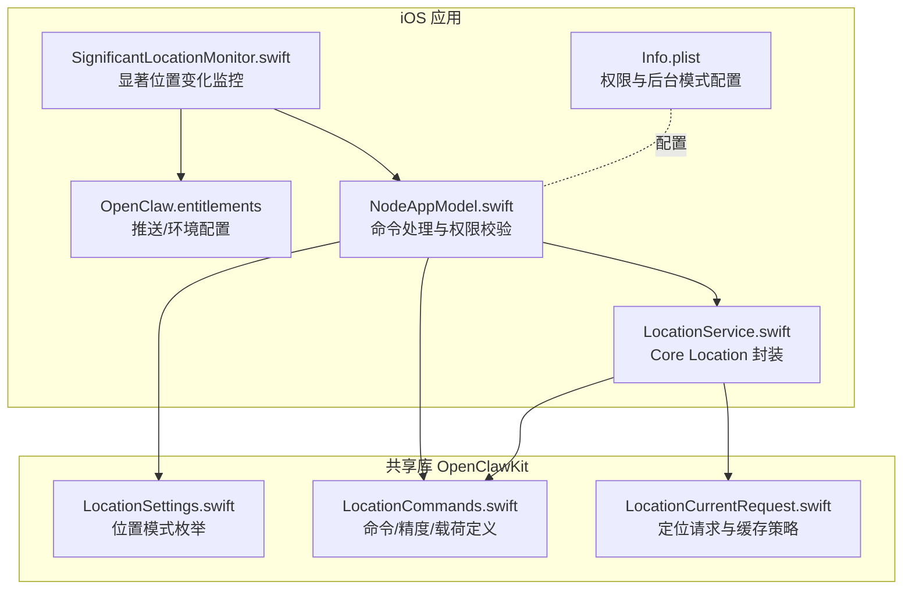
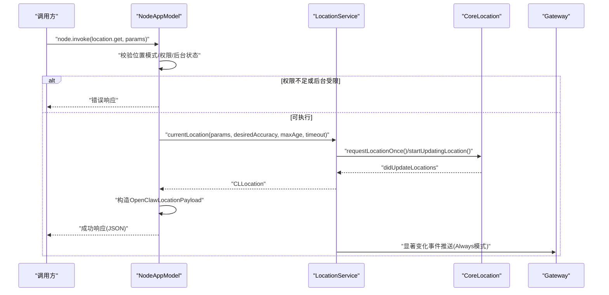
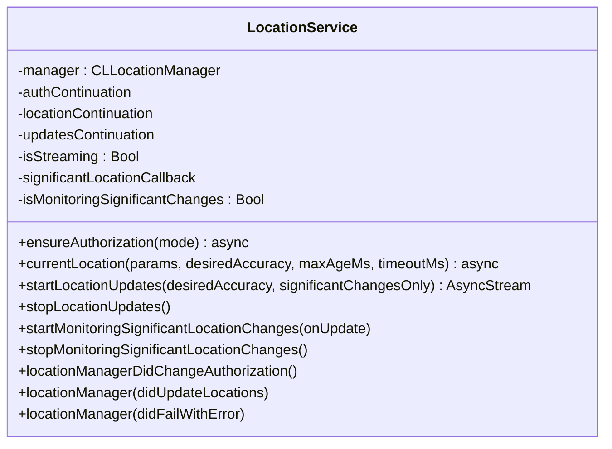
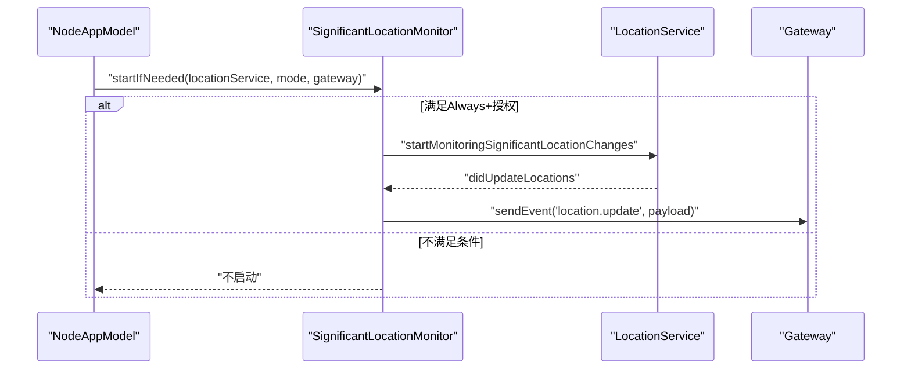
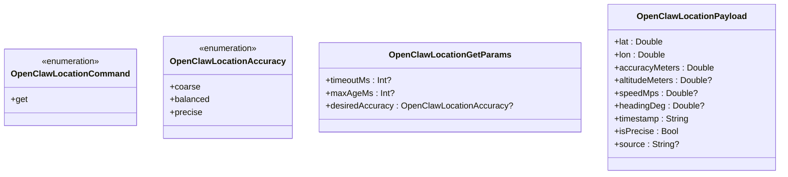
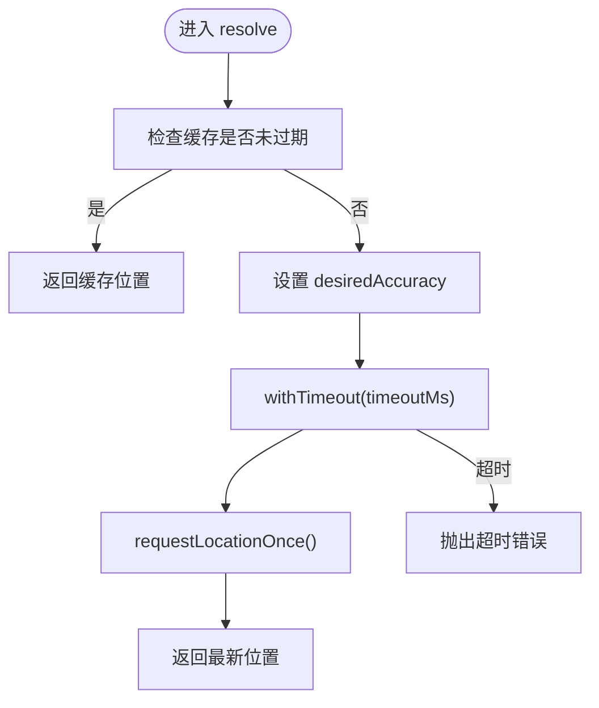
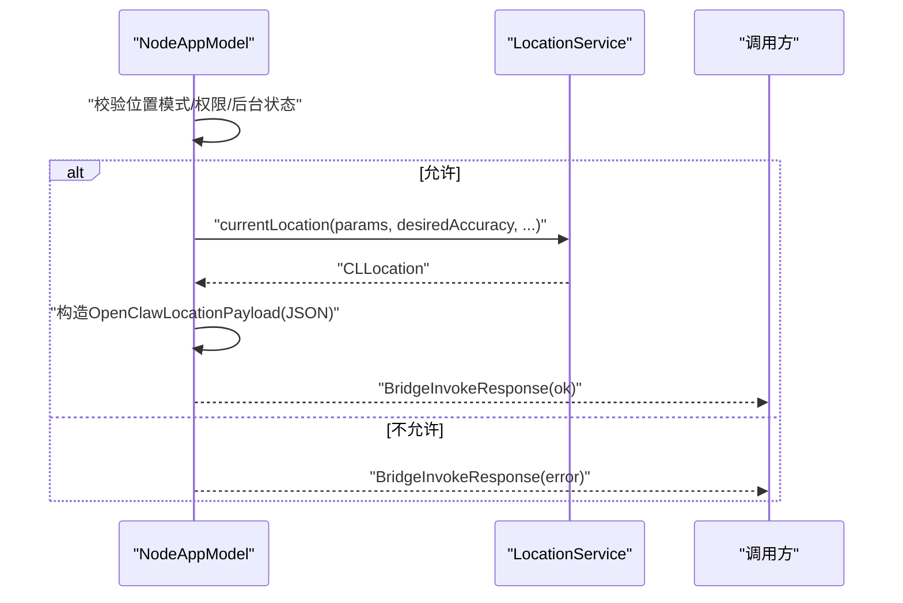
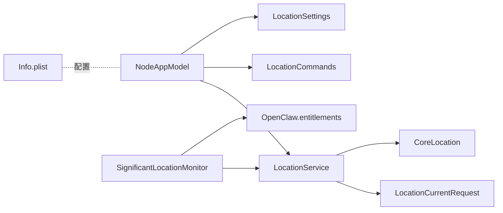

# 位置服务

<cite>
**本文引用的文件**
- [apps/ios/Sources/Location/LocationService.swift](file://apps/ios/Sources/Location/LocationService.swift)
- [apps/ios/Sources/Location/SignificantLocationMonitor.swift](file://apps/ios/Sources/Location/SignificantLocationMonitor.swift)
- [apps/ios/Sources/Info.plist](file://apps/ios/Sources/Info.plist)
- [apps/ios/Sources/OpenClaw.entitlements](file://apps/ios/Sources/OpenClaw.entitlements)
- [apps/shared/OpenClawKit/Sources/OpenClawKit/LocationCommands.swift](file://apps/shared/OpenClawKit/Sources/OpenClawKit/LocationCommands.swift)
- [apps/shared/OpenClawKit/Sources/OpenClawKit/LocationSettings.swift](file://apps/shared/OpenClawKit/Sources/OpenClawKit/LocationSettings.swift)
- [apps/shared/OpenClawKit/Sources/OpenClawKit/LocationCurrentRequest.swift](file://apps/shared/OpenClawKit/Sources/OpenClawKit/LocationCurrentRequest.swift)
- [apps/ios/Sources/Model/NodeAppModel.swift](file://apps/ios/Sources/Model/NodeAppModel.swift)
- [docs/zh-CN/nodes/location-command.md](file://docs/zh-CN/nodes/location-command.md)
</cite>

## 目录

1. [简介](#简介)
2. [项目结构](#项目结构)
3. [核心组件](#核心组件)
4. [架构总览](#架构总览)
5. [详细组件分析](#详细组件分析)
6. [依赖关系分析](#依赖关系分析)
7. [性能考量](#性能考量)
8. [故障排查指南](#故障排查指南)
9. [结论](#结论)
10. [附录](#附录)

## 简介

本文件面向iOS节点位置服务功能，系统化阐述以下内容：

- Core Location框架的使用方式与权限申请流程
- 定位精度控制策略与位置数据处理
- 位置更新监听、显著位置变化监控
- 位置命令调用链路、后台行为约束与隐私保护
- 地图集成、地址解析与位置分享的实现路径
- 电池优化、后台定位限制与安全传输建议
- 提供可直接参考的代码片段路径，帮助快速落地

## 项目结构

iOS位置服务相关代码主要位于iOS应用工程的Sources/Location目录，并通过共享的OpenClawKit定义跨平台的数据结构与协议。Node层通过NodeAppModel桥接命令调用到具体的服务实现。

图表来源

- [apps/ios/Sources/Model/NodeAppModel.swift:785-842](file://apps/ios/Sources/Model/NodeAppModel.swift#L785-L842)
- [apps/ios/Sources/Location/LocationService.swift:1-179](file://apps/ios/Sources/Location/LocationService.swift#L1-L179)
- [apps/ios/Sources/Location/SignificantLocationMonitor.swift:1-43](file://apps/ios/Sources/Location/SignificantLocationMonitor.swift#L1-L43)
- [apps/ios/Sources/Info.plist:1-97](file://apps/ios/Sources/Info.plist#L1-L97)
- [apps/ios/Sources/OpenClaw.entitlements:1-10](file://apps/ios/Sources/OpenClaw.entitlements#L1-L10)
- [apps/shared/OpenClawKit/Sources/OpenClawKit/LocationCommands.swift:1-57](file://apps/shared/OpenClawKit/Sources/OpenClawKit/LocationCommands.swift#L1-L57)
- [apps/shared/OpenClawKit/Sources/OpenClawKit/LocationCurrentRequest.swift:1-44](file://apps/shared/OpenClawKit/Sources/OpenClawKit/LocationCurrentRequest.swift#L1-L44)
- [apps/shared/OpenClawKit/Sources/OpenClawKit/LocationSettings.swift:1-7](file://apps/shared/OpenClawKit/Sources/OpenClawKit/LocationSettings.swift#L1-L7)

章节来源

- [apps/ios/Sources/Model/NodeAppModel.swift:785-842](file://apps/ios/Sources/Model/NodeAppModel.swift#L785-L842)
- [apps/ios/Sources/Location/LocationService.swift:1-179](file://apps/ios/Sources/Location/LocationService.swift#L1-L179)
- [apps/ios/Sources/Location/SignificantLocationMonitor.swift:1-43](file://apps/ios/Sources/Location/SignificantLocationMonitor.swift#L1-L43)
- [apps/ios/Sources/Info.plist:1-97](file://apps/ios/Sources/Info.plist#L1-L97)
- [apps/ios/Sources/OpenClaw.entitlements:1-10](file://apps/ios/Sources/OpenClaw.entitlements#L1-L10)
- [apps/shared/OpenClawKit/Sources/OpenClawKit/LocationCommands.swift:1-57](file://apps/shared/OpenClawKit/Sources/OpenClawKit/LocationCommands.swift#L1-L57)
- [apps/shared/OpenClawKit/Sources/OpenClawKit/LocationCurrentRequest.swift:1-44](file://apps/shared/OpenClawKit/Sources/OpenClawKit/LocationCurrentRequest.swift#L1-L44)
- [apps/shared/OpenClawKit/Sources/OpenClawKit/LocationSettings.swift:1-7](file://apps/shared/OpenClawKit/Sources/OpenClawKit/LocationSettings.swift#L1-L7)

## 核心组件

- 位置服务封装（LocationService）：负责授权管理、一次性定位、持续位置流、显著位置变化监控与回调分发。
- 显著位置变化监控（SignificantLocationMonitor）：在始终授权且模式为“始终”时启动显著变化监听，并将位置事件推送到网关。
- 命令与数据模型（LocationCommands）：定义location.get命令、精度级别、请求参数与响应载荷。
- 当前定位请求策略（LocationCurrentRequest）：基于缓存与超时的定位解析器，支持最大年龄与期望精度。
- 位置模式（LocationSettings）：位置访问模式枚举（Off/WhileUsing/Always）。
- Node层接入（NodeAppModel）：统一处理location.get调用、权限校验、后台限制与响应编码。

章节来源

- [apps/ios/Sources/Location/LocationService.swift:1-179](file://apps/ios/Sources/Location/LocationService.swift#L1-L179)
- [apps/ios/Sources/Location/SignificantLocationMonitor.swift:1-43](file://apps/ios/Sources/Location/SignificantLocationMonitor.swift#L1-L43)
- [apps/shared/OpenClawKit/Sources/OpenClawKit/LocationCommands.swift:1-57](file://apps/shared/OpenClawKit/Sources/OpenClawKit/LocationCommands.swift#L1-L57)
- [apps/shared/OpenClawKit/Sources/OpenClawKit/LocationCurrentRequest.swift:1-44](file://apps/shared/OpenClawKit/Sources/OpenClawKit/LocationCurrentRequest.swift#L1-L44)
- [apps/shared/OpenClawKit/Sources/OpenClawKit/LocationSettings.swift:1-7](file://apps/shared/OpenClawKit/Sources/OpenClawKit/LocationSettings.swift#L1-L7)
- [apps/ios/Sources/Model/NodeAppModel.swift:785-842](file://apps/ios/Sources/Model/NodeAppModel.swift#L785-L842)

## 架构总览

下图展示了从命令调用到Core Location、再到网关事件推送的整体流程。

图表来源

- [apps/ios/Sources/Model/NodeAppModel.swift:785-842](file://apps/ios/Sources/Model/NodeAppModel.swift#L785-L842)
- [apps/ios/Sources/Location/LocationService.swift:56-121](file://apps/ios/Sources/Location/LocationService.swift#L56-L121)
- [apps/ios/Sources/Location/SignificantLocationMonitor.swift:10-41](file://apps/ios/Sources/Location/SignificantLocationMonitor.swift#L10-L41)
- [apps/shared/OpenClawKit/Sources/OpenClawKit/LocationCommands.swift:13-57](file://apps/shared/OpenClawKit/Sources/OpenClawKit/LocationCommands.swift#L13-L57)

## 详细组件分析

### 组件A：位置服务封装（LocationService）

- 授权管理
  - 支持“使用时”和“始终”两种模式；当请求“始终”而当前为“使用时”时，会触发再次授权。
  - 使用异步续体等待授权状态变更，避免阻塞主线程。
- 一次性定位
  - 通过LocationCurrentRequest解析缓存、精度与超时，确保在合理时间内返回最新位置。
- 持续位置流
  - 支持普通更新与显著位置变化两种模式；自动暂停与后台更新开关按需开启。
  - 通过AsyncStream对外提供最新的CLLocation，终止时自动清理。
- 回调分发
  - 在didUpdateLocations中同时分发给一次性定位续体、显著变化回调与位置流，保证多消费者一致性。

图表来源

- [apps/ios/Sources/Location/LocationService.swift:6-179](file://apps/ios/Sources/Location/LocationService.swift#L6-L179)

章节来源

- [apps/ios/Sources/Location/LocationService.swift:34-121](file://apps/ios/Sources/Location/LocationService.swift#L34-L121)
- [apps/shared/OpenClawKit/Sources/OpenClawKit/LocationCurrentRequest.swift:11-32](file://apps/shared/OpenClawKit/Sources/OpenClawKit/LocationCurrentRequest.swift#L11-L32)

### 组件B：显著位置变化监控（SignificantLocationMonitor）

- 触发条件
  - 仅在位置模式为“始终”，且授权状态为“始终”时启动。
- 事件推送
  - 将经纬度、精度等信息编码为JSON并通过网关发送“location.update”事件。
- 生命周期
  - 与LocationService的显著变化监听保持一致，避免重复启动。

图表来源

- [apps/ios/Sources/Location/SignificantLocationMonitor.swift:10-41](file://apps/ios/Sources/Location/SignificantLocationMonitor.swift#L10-L41)
- [apps/ios/Sources/Location/LocationService.swift:123-135](file://apps/ios/Sources/Location/LocationService.swift#L123-L135)

章节来源

- [apps/ios/Sources/Location/SignificantLocationMonitor.swift:1-43](file://apps/ios/Sources/Location/SignificantLocationMonitor.swift#L1-L43)

### 组件C：命令与数据模型（LocationCommands）

- 命令
  - location.get：用于请求当前位置。
- 精度级别
  - coarse/balanced/precise：映射到不同定位精度常量。
- 请求参数
  - timeoutMs、maxAgeMs、desiredAccuracy：控制超时、缓存与精度。
- 响应载荷
  - 包含经纬度、精度、海拔、速度、航向、时间戳、是否精确、来源等字段。

图表来源

- [apps/shared/OpenClawKit/Sources/OpenClawKit/LocationCommands.swift:3-57](file://apps/shared/OpenClawKit/Sources/OpenClawKit/LocationCommands.swift#L3-L57)

章节来源

- [apps/shared/OpenClawKit/Sources/OpenClawKit/LocationCommands.swift:1-57](file://apps/shared/OpenClawKit/Sources/OpenClawKit/LocationCommands.swift#L1-L57)

### 组件D：当前定位请求策略（LocationCurrentRequest）

- 缓存策略
  - 若缓存位置未过期（maxAgeMs），直接返回。
- 精度与超时
  - 设置desiredAccuracy后在指定超时内请求位置。
- 失败处理
  - 超时返回特定错误类型，便于上层区分。

图表来源

- [apps/shared/OpenClawKit/Sources/OpenClawKit/LocationCurrentRequest.swift:11-32](file://apps/shared/OpenClawKit/Sources/OpenClawKit/LocationCurrentRequest.swift#L11-L32)

章节来源

- [apps/shared/OpenClawKit/Sources/OpenClawKit/LocationCurrentRequest.swift:1-44](file://apps/shared/OpenClawKit/Sources/OpenClawKit/LocationCurrentRequest.swift#L1-L44)

### 组件E：Node层接入（NodeAppModel）

- 权限与后台限制
  - 若位置模式为Off则直接返回不可用；后台场景要求Always授权。
- 参数与精度
  - 解析请求参数，若未指定desiredAccuracy则根据“精确位置”开关选择平衡或精确。
- 响应构造
  - 从CLLocation提取必要字段，编码为JSON返回。

图表来源

- [apps/ios/Sources/Model/NodeAppModel.swift:785-842](file://apps/ios/Sources/Model/NodeAppModel.swift#L785-L842)
- [apps/shared/OpenClawKit/Sources/OpenClawKit/LocationCommands.swift:13-57](file://apps/shared/OpenClawKit/Sources/OpenClawKit/LocationCommands.swift#L13-L57)

章节来源

- [apps/ios/Sources/Model/NodeAppModel.swift:785-842](file://apps/ios/Sources/Model/NodeAppModel.swift#L785-L842)

## 依赖关系分析

- NodeAppModel依赖LocationService进行实际定位，依赖LocationCommands与LocationCurrentRequest进行参数与载荷处理。
- LocationService依赖CoreLocation与LocationCurrentRequest实现定位逻辑。
- SignificantLocationMonitor依赖LocationService与网关会话进行事件推送。
- Info.plist与OpenClaw.entitlements为位置权限与后台能力提供基础配置。

图表来源

- [apps/ios/Sources/Model/NodeAppModel.swift:785-842](file://apps/ios/Sources/Model/NodeAppModel.swift#L785-L842)
- [apps/ios/Sources/Location/LocationService.swift:1-179](file://apps/ios/Sources/Location/LocationService.swift#L1-L179)
- [apps/ios/Sources/Location/SignificantLocationMonitor.swift:1-43](file://apps/ios/Sources/Location/SignificantLocationMonitor.swift#L1-L43)
- [apps/ios/Sources/Info.plist:1-97](file://apps/ios/Sources/Info.plist#L1-L97)
- [apps/ios/Sources/OpenClaw.entitlements:1-10](file://apps/ios/Sources/OpenClaw.entitlements#L1-L10)
- [apps/shared/OpenClawKit/Sources/OpenClawKit/LocationCommands.swift:1-57](file://apps/shared/OpenClawKit/Sources/OpenClawKit/LocationCommands.swift#L1-L57)
- [apps/shared/OpenClawKit/Sources/OpenClawKit/LocationCurrentRequest.swift:1-44](file://apps/shared/OpenClawKit/Sources/OpenClawKit/LocationCurrentRequest.swift#L1-L44)
- [apps/shared/OpenClawKit/Sources/OpenClawKit/LocationSettings.swift:1-7](file://apps/shared/OpenClawKit/Sources/OpenClawKit/LocationSettings.swift#L1-L7)

章节来源

- [apps/ios/Sources/Model/NodeAppModel.swift:785-842](file://apps/ios/Sources/Model/NodeAppModel.swift#L785-L842)
- [apps/ios/Sources/Location/LocationService.swift:1-179](file://apps/ios/Sources/Location/LocationService.swift#L1-L179)
- [apps/ios/Sources/Location/SignificantLocationMonitor.swift:1-43](file://apps/ios/Sources/Location/SignificantLocationMonitor.swift#L1-L43)
- [apps/ios/Sources/Info.plist:1-97](file://apps/ios/Sources/Info.plist#L1-L97)
- [apps/ios/Sources/OpenClaw.entitlements:1-10](file://apps/ios/Sources/OpenClaw.entitlements#L1-L10)
- [apps/shared/OpenClawKit/Sources/OpenClawKit/LocationCommands.swift:1-57](file://apps/shared/OpenClawKit/Sources/OpenClawKit/LocationCommands.swift#L1-L57)
- [apps/shared/OpenClawKit/Sources/OpenClawKit/LocationCurrentRequest.swift:1-44](file://apps/shared/OpenClawKit/Sources/OpenClawKit/LocationCurrentRequest.swift#L1-L44)
- [apps/shared/OpenClawKit/Sources/OpenClawKit/LocationSettings.swift:1-7](file://apps/shared/OpenClawKit/Sources/OpenClawKit/LocationSettings.swift#L1-L7)

## 性能考量

- 精度与能耗
  - coarse适合弱定位需求，balanced在精度与耗电间折中，precise在需要高精度时使用，但会增加电量消耗。
- 缓存与超时
  - 利用maxAgeMs减少频繁定位；通过timeoutMs避免长时间等待。
- 自动暂停与后台更新
  - 开启pausesLocationUpdatesAutomatically可降低移动中的功耗；后台更新需Always授权并受系统限制。
- 显著位置变化
  - 在不需要高频更新时优先使用显著变化监听，减少定位频率。

## 故障排查指南

- 常见错误码
  - LOCATION_DISABLED：位置模式为Off。
  - LOCATION_PERMISSION_REQUIRED：缺少所需授权（使用时或始终）。
  - LOCATION_BACKGROUND_UNAVAILABLE：后台场景下未启用始终授权。
  - LOCATION_TIMEOUT：定位超时。
  - LOCATION_UNAVAILABLE：系统故障或无可用定位源。
- 定位失败排查步骤
  - 确认Info.plist中位置使用描述与后台模式配置正确。
  - 确认OpenClaw.entitlements满足推送/开发环境需求。
  - 在Node层检查位置模式与权限状态，确保满足后台场景要求。
  - 使用LocationCurrentRequest.resolve的超时与缓存策略验证定位链路。

章节来源

- [docs/zh-CN/nodes/location-command.md:82-88](file://docs/zh-CN/nodes/location-command.md#L82-L88)
- [apps/ios/Sources/Model/NodeAppModel.swift:785-842](file://apps/ios/Sources/Model/NodeAppModel.swift#L785-L842)
- [apps/shared/OpenClawKit/Sources/OpenClawKit/LocationCurrentRequest.swift:11-32](file://apps/shared/OpenClawKit/Sources/OpenClawKit/LocationCurrentRequest.swift#L11-L32)
- [apps/ios/Sources/Info.plist:55-58](file://apps/ios/Sources/Info.plist#L55-L58)
- [apps/ios/Sources/OpenClaw.entitlements:5-7](file://apps/ios/Sources/OpenClaw.entitlements#L5-L7)

## 结论

该iOS位置服务通过清晰的职责划分与跨平台数据模型，实现了从命令到Core Location的完整链路。结合显著位置变化监控与严格的权限/后台限制，既满足了功能需求，也兼顾了电池优化与隐私保护。后续可在地图集成、地址解析与位置分享方面扩展，以进一步完善用户体验。

## 附录

- 代码片段路径参考
  - 一次性定位与超时处理：[apps/ios/Sources/Location/LocationService.swift:56-72](file://apps/ios/Sources/Location/LocationService.swift#L56-L72)
  - 显著位置变化监听与事件推送：[apps/ios/Sources/Location/SignificantLocationMonitor.swift:19-41](file://apps/ios/Sources/Location/SignificantLocationMonitor.swift#L19-L41)
  - 位置模式与权限校验（Node层）：[apps/ios/Sources/Model/NodeAppModel.swift:785-842](file://apps/ios/Sources/Model/NodeAppModel.swift#L785-L842)
  - 命令与载荷定义：[apps/shared/OpenClawKit/Sources/OpenClawKit/LocationCommands.swift:13-57](file://apps/shared/OpenClawKit/Sources/OpenClawKit/LocationCommands.swift#L13-L57)
  - 当前定位请求策略（缓存/精度/超时）：[apps/shared/OpenClawKit/Sources/OpenClawKit/LocationCurrentRequest.swift:11-32](file://apps/shared/OpenClawKit/Sources/OpenClawKit/LocationCurrentRequest.swift#L11-L32)
  - 位置模式枚举：[apps/shared/OpenClawKit/Sources/OpenClawKit/LocationSettings.swift:3-7](file://apps/shared/OpenClawKit/Sources/OpenClawKit/LocationSettings.swift#L3-L7)
  - Info.plist权限与后台模式配置：[apps/ios/Sources/Info.plist:55-78](file://apps/ios/Sources/Info.plist#L55-L78)
  - 推送/环境配置：[apps/ios/Sources/OpenClaw.entitlements:5-7](file://apps/ios/Sources/OpenClaw.entitlements#L5-L7)
