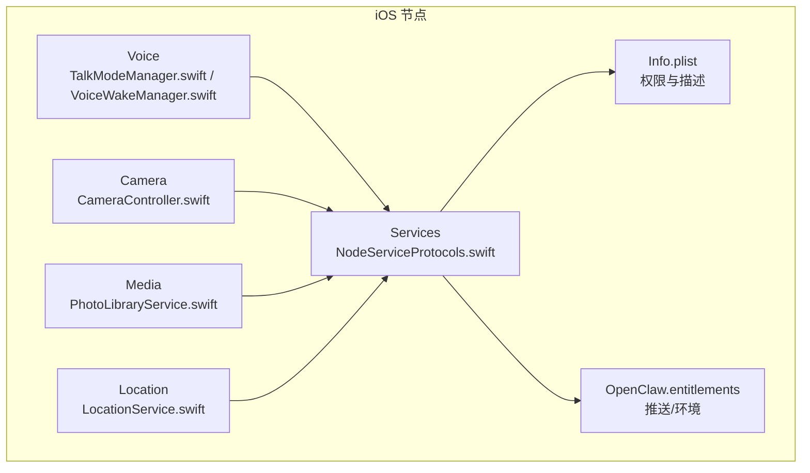
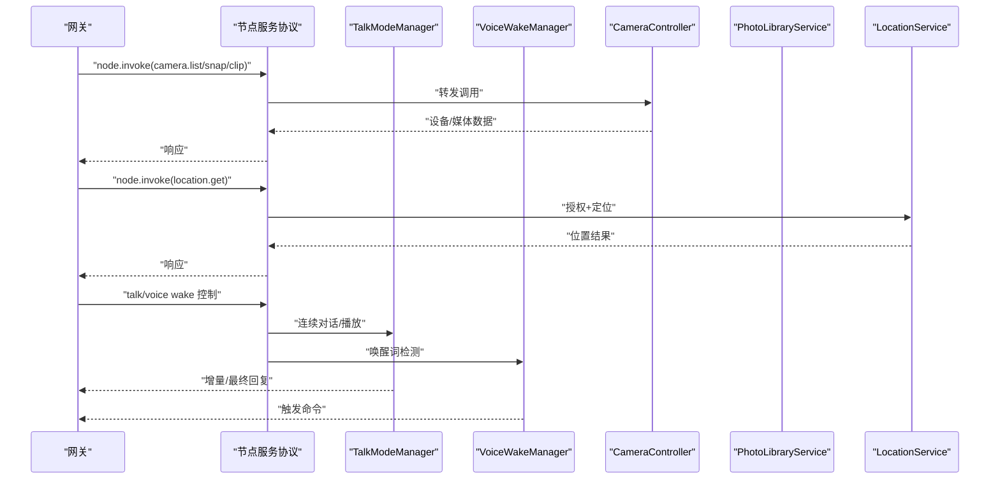
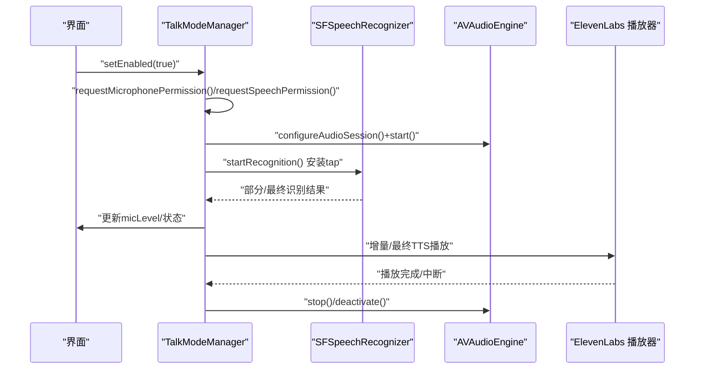
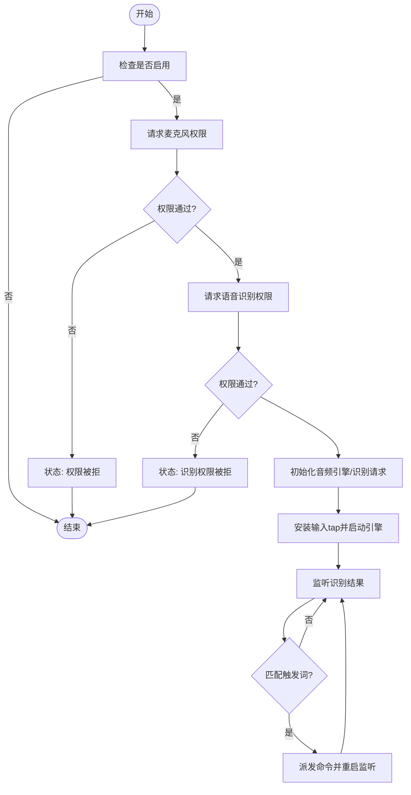
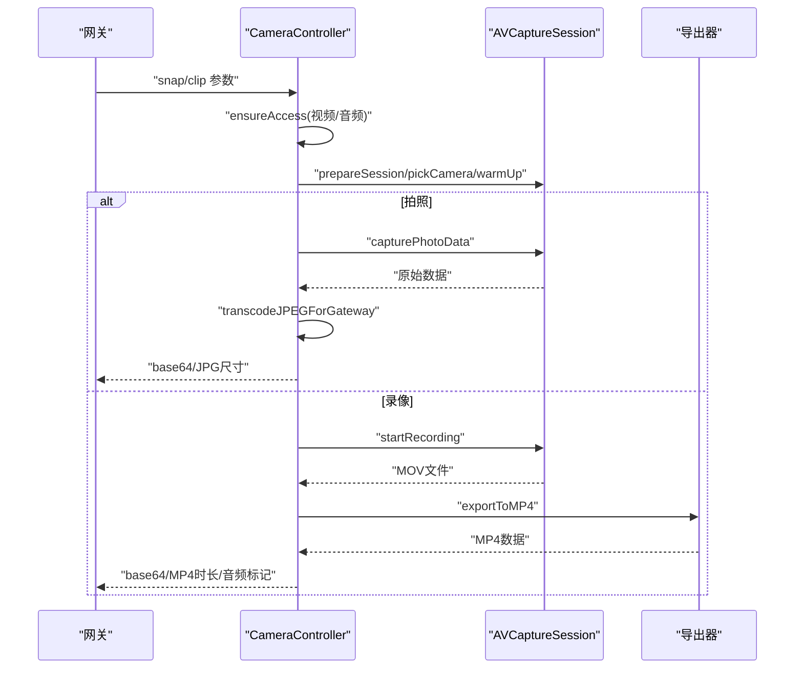
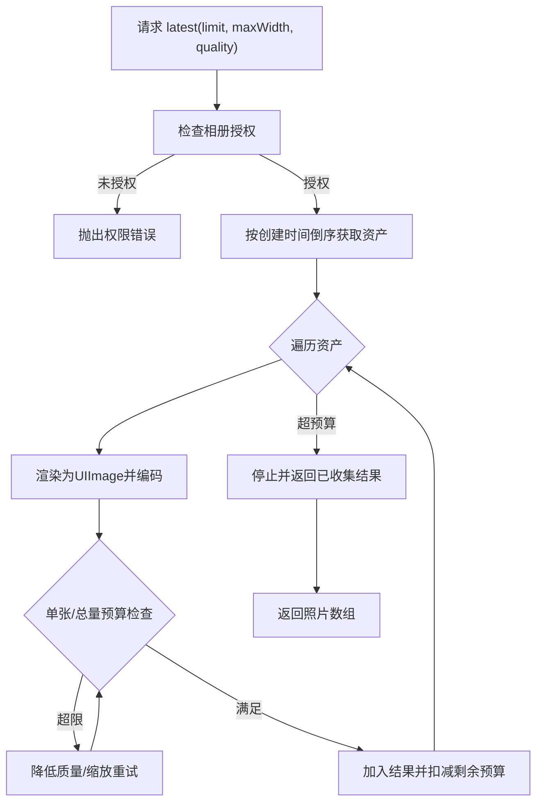
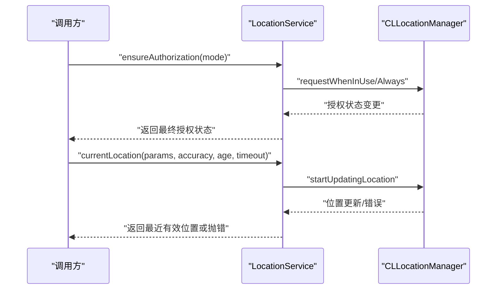
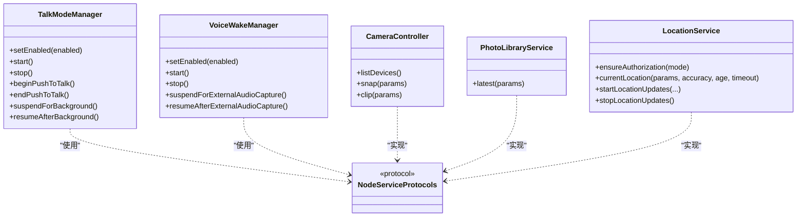

# 功能模块

<cite>
**本文引用的文件**
- [apps/ios/Sources/Voice/TalkModeManager.swift](file://apps/ios/Sources/Voice/TalkModeManager.swift)
- [apps/ios/Sources/Camera/CameraController.swift](file://apps/ios/Sources/Camera/CameraController.swift)
- [apps/ios/Sources/Media/PhotoLibraryService.swift](file://apps/ios/Sources/Media/PhotoLibraryService.swift)
- [apps/ios/Sources/Location/LocationService.swift](file://apps/ios/Sources/Location/LocationService.swift)
- [apps/ios/Sources/Voice/VoiceWakeManager.swift](file://apps/ios/Sources/Voice/VoiceWakeManager.swift)
- [apps/ios/Sources/Services/NodeServiceProtocols.swift](file://apps/ios/Sources/Services/NodeServiceProtocols.swift)
- [apps/ios/Sources/Info.plist](file://apps/ios/Sources/Info.plist)
- [apps/ios/Sources/OpenClaw.entitlements](file://apps/ios/Sources/OpenClaw.entitlements)
- [apps/ios/Sources/Voice/TalkDefaults.swift](file://apps/ios/Sources/Voice/TalkDefaults.swift)
- [apps/ios/Sources/Voice/VoiceWakePreferences.swift](file://apps/ios/Sources/Voice/VoiceWakePreferences.swift)
- [docs/nodes/audio.md](file://docs/nodes/audio.md)
- [docs/nodes/camera.md](file://docs/nodes/camera.md)
- [docs/nodes/media-understanding.md](file://docs/nodes/media-understanding.md)
- [docs/nodes/location-command.md](file://docs/nodes/location-command.md)
- [docs/nodes/talk.md](file://docs/nodes/talk.md)
</cite>

## 目录

1. [简介](#简介)
2. [项目结构](#项目结构)
3. [核心组件](#核心组件)
4. [架构总览](#架构总览)
5. [详细组件分析](#详细组件分析)
6. [依赖关系分析](#依赖关系分析)
7. [性能考量](#性能考量)
8. [故障排查指南](#故障排查指南)
9. [结论](#结论)
10. [附录](#附录)

## 简介

本文件面向iOS节点功能模块，系统性梳理并说明以下五大能力域：

- 音频处理（语音识别、流式TTS、连续对话）
- 相机控制（拍照、短视频录制、设备枚举）
- 媒体管理（相册读取、按预算压缩传输）
- 位置服务（定位授权、一次性定位、持续更新）
- 语音交互（唤醒词检测、免提/PTT模式）

文档覆盖实现原理、API接口、权限与资源访问策略、性能优化建议，并提供可直接定位到源码的路径指引与集成参考。

## 项目结构

iOS节点相关代码集中在 apps/ios/Sources 下，按功能域划分目录：

- Voice：连续对话、语音唤醒、TTS播放等
- Camera：相机拍照/录像、设备选择与参数控制
- Media：相册读取与传输优化
- Location：定位授权与查询
- Services：节点能力协议与适配层
- 其他：设备信息、屏幕录制、日历/联系人/提醒等

图表来源

- [apps/ios/Sources/Voice/TalkModeManager.swift:1-2201](file://apps/ios/Sources/Voice/TalkModeManager.swift#L1-L2201)
- [apps/ios/Sources/Camera/CameraController.swift:1-354](file://apps/ios/Sources/Camera/CameraController.swift#L1-L354)
- [apps/ios/Sources/Media/PhotoLibraryService.swift:1-165](file://apps/ios/Sources/Media/PhotoLibraryService.swift#L1-L165)
- [apps/ios/Sources/Location/LocationService.swift:1-179](file://apps/ios/Sources/Location/LocationService.swift#L1-L179)
- [apps/ios/Sources/Services/NodeServiceProtocols.swift:1-108](file://apps/ios/Sources/Services/NodeServiceProtocols.swift#L1-L108)
- [apps/ios/Sources/Info.plist:1-97](file://apps/ios/Sources/Info.plist#L1-L97)
- [apps/ios/Sources/OpenClaw.entitlements:1-10](file://apps/ios/Sources/OpenClaw.entitlements#L1-L10)

章节来源

- [apps/ios/Sources/Services/NodeServiceProtocols.swift:1-108](file://apps/ios/Sources/Services/NodeServiceProtocols.swift#L1-L108)
- [apps/ios/Sources/Info.plist:51-66](file://apps/ios/Sources/Info.plist#L51-L66)

## 核心组件

- 语音连续对话（Talk Mode）
  - 支持持续监听、静音窗口触发、增量TTS、打断播放、免提/PTT模式
  - 关键实现：TalkModeManager.swift
- 语音唤醒（Voice Wake）
  - 唤醒词检测、外部音频捕获时暂停、权限请求与超时处理
  - 关键实现：VoiceWakeManager.swift
- 相机控制（Camera）
  - 拍照（JPG）、短视频（MP4，含可选音频）、设备列表、参数裁剪
  - 关键实现：CameraController.swift
- 媒体管理（Photo Library）
  - 最新照片批量读取、按预算压缩（总/单张限制）、安全传输
  - 关键实现：PhotoLibraryService.swift
- 位置服务（Location）
  - 授权模式切换、一次性定位、持续更新、显著位置变化
  - 关键实现：LocationService.swift
- 能力协议（NodeServiceProtocols）
  - 统一的节点能力接口抽象，便于在不同平台复用调用方逻辑

章节来源

- [apps/ios/Sources/Voice/TalkModeManager.swift:166-800](file://apps/ios/Sources/Voice/TalkModeManager.swift#L166-L800)
- [apps/ios/Sources/Voice/VoiceWakeManager.swift:160-350](file://apps/ios/Sources/Voice/VoiceWakeManager.swift#L160-L350)
- [apps/ios/Sources/Camera/CameraController.swift:40-142](file://apps/ios/Sources/Camera/CameraController.swift#L40-L142)
- [apps/ios/Sources/Media/PhotoLibraryService.swift:16-55](file://apps/ios/Sources/Media/PhotoLibraryService.swift#L16-L55)
- [apps/ios/Sources/Location/LocationService.swift:56-72](file://apps/ios/Sources/Location/LocationService.swift#L56-L72)
- [apps/ios/Sources/Services/NodeServiceProtocols.swift:9-50](file://apps/ios/Sources/Services/NodeServiceProtocols.swift#L9-L50)

## 架构总览

iOS节点通过统一的节点服务协议对外暴露能力，内部以模块化组件实现具体功能；与系统框架（AVFoundation、Speech、CoreLocation）深度集成，并遵循iOS权限模型与后台行为约束。

图表来源

- [apps/ios/Sources/Services/NodeServiceProtocols.swift:9-50](file://apps/ios/Sources/Services/NodeServiceProtocols.swift#L9-L50)
- [apps/ios/Sources/Voice/TalkModeManager.swift:166-244](file://apps/ios/Sources/Voice/TalkModeManager.swift#L166-L244)
- [apps/ios/Sources/Voice/VoiceWakeManager.swift:160-236](file://apps/ios/Sources/Voice/VoiceWakeManager.swift#L160-L236)
- [apps/ios/Sources/Camera/CameraController.swift:144-152](file://apps/ios/Sources/Camera/CameraController.swift#L144-L152)
- [apps/ios/Sources/Media/PhotoLibraryService.swift:16-55](file://apps/ios/Sources/Media/PhotoLibraryService.swift#L16-L55)
- [apps/ios/Sources/Location/LocationService.swift:56-72](file://apps/ios/Sources/Location/LocationService.swift#L56-L72)

## 详细组件分析

### 语音连续对话（Talk Mode）

- 实现要点
  - 权限申请：麦克风与语音识别
  - 音频会话：配置录音/播放模式，安装输入tap，启动AVAudioEngine
  - 识别流程：SFSpeechAudioBufferRecognitionRequest，分段/最终结果回调
  - 静音窗口：基于时间阈值自动提交，支持PTT一次性模式
  - TTS播放：ElevenLabs流式播放，支持中断、格式回退（PCM/MP3）
  - 增量TTS：按片段逐步输出，提升感知延迟
  - 状态管理：启用/禁用、暂停/恢复、错误重试
- 关键API与状态
  - 启停与状态：setEnabled/isEnabled、suspendForBackground/resumeAfterBackground
  - PTT：beginPushToTalk/endPushToTalk/runPushToTalkOnce/cancelPushToTalk
  - 配置：silenceTimeoutMs、interruptOnSpeech、默认voice/model/outputFormat
- 性能与体验
  - 降噪与阈值：动态噪声基底估计，避免误触发
  - 错误自愈：识别任务失败后短暂休眠再重启
  - 流式播放：降低端到端延迟

图表来源

- [apps/ios/Sources/Voice/TalkModeManager.swift:166-244](file://apps/ios/Sources/Voice/TalkModeManager.swift#L166-L244)
- [apps/ios/Sources/Voice/TalkModeManager.swift:488-622](file://apps/ios/Sources/Voice/TalkModeManager.swift#L488-L622)
- [apps/ios/Sources/Voice/TalkModeManager.swift:758-800](file://apps/ios/Sources/Voice/TalkModeManager.swift#L758-L800)
- [apps/ios/Sources/Voice/TalkDefaults.swift:1-4](file://apps/ios/Sources/Voice/TalkDefaults.swift#L1-L4)

章节来源

- [apps/ios/Sources/Voice/TalkModeManager.swift:166-800](file://apps/ios/Sources/Voice/TalkModeManager.swift#L166-L800)
- [apps/ios/Sources/Voice/TalkDefaults.swift:1-4](file://apps/ios/Sources/Voice/TalkDefaults.swift#L1-L4)
- [docs/nodes/talk.md:1-93](file://docs/nodes/talk.md#L1-L93)

### 语音唤醒（Voice Wake）

- 实现要点
  - 在免提/PTT之外独立运行，使用独立的音频管道
  - 外部音频捕获（如相机录制）时主动暂停，避免冲突
  - 权限超时保护与错误提示
  - 触发词匹配采用门控算法，支持最小后置间隔
- 关键API
  - setEnabled/setEnabled + start/stop
  - setSuppressedByTalk/suspendForExternalAudioCapture/resumeAfterExternalAudioCapture
  - 触发词加载/保存/清洗

图表来源

- [apps/ios/Sources/Voice/VoiceWakeManager.swift:160-236](file://apps/ios/Sources/Voice/VoiceWakeManager.swift#L160-L236)
- [apps/ios/Sources/Voice/VoiceWakeManager.swift:352-364](file://apps/ios/Sources/Voice/VoiceWakeManager.swift#L352-L364)

章节来源

- [apps/ios/Sources/Voice/VoiceWakeManager.swift:160-350](file://apps/ios/Sources/Voice/VoiceWakeManager.swift#L160-L350)
- [apps/ios/Sources/Voice/VoiceWakePreferences.swift:23-44](file://apps/ios/Sources/Voice/VoiceWakePreferences.swift#L23-L44)

### 相机控制（Camera）

- 能力范围
  - 设备枚举：返回设备ID、名称、朝向、类型
  - 拍照：JPG，支持最大宽度、质量、延时
  - 录像：MP4，支持音频开关、时长裁剪
  - 参数校验与导出：质量/时长边界、MOV转MP4
- 权限与异常
  - 运行前确保授权；未授权抛出明确错误
  - 导出失败/捕获失败有对应错误码

图表来源

- [apps/ios/Sources/Camera/CameraController.swift:40-88](file://apps/ios/Sources/Camera/CameraController.swift#L40-L88)
- [apps/ios/Sources/Camera/CameraController.swift:90-142](file://apps/ios/Sources/Camera/CameraController.swift#L90-L142)
- [apps/ios/Sources/Camera/CameraController.swift:217-252](file://apps/ios/Sources/Camera/CameraController.swift#L217-L252)

章节来源

- [apps/ios/Sources/Camera/CameraController.swift:40-142](file://apps/ios/Sources/Camera/CameraController.swift#L40-L142)
- [apps/ios/Sources/Camera/CameraController.swift:144-204](file://apps/ios/Sources/Camera/CameraController.swift#L144-L204)
- [docs/nodes/camera.md:27-62](file://docs/nodes/camera.md#L27-L62)

### 媒体管理（相册读取与传输）

- 能力范围
  - 获取最新N张照片，按最大宽度与质量压缩
  - 单张与总量预算控制，避免网关WS帧过大
  - 时间戳格式化、尺寸回传
- 传输策略
  - 严格限制单张与总长度，必要时先降质再缩放
  - 仅在授权允许范围内读取（读写或受限授权）

图表来源

- [apps/ios/Sources/Media/PhotoLibraryService.swift:16-55](file://apps/ios/Sources/Media/PhotoLibraryService.swift#L16-L55)
- [apps/ios/Sources/Media/PhotoLibraryService.swift:111-148](file://apps/ios/Sources/Media/PhotoLibraryService.swift#L111-L148)

章节来源

- [apps/ios/Sources/Media/PhotoLibraryService.swift:16-165](file://apps/ios/Sources/Media/PhotoLibraryService.swift#L16-L165)
- [docs/nodes/media-understanding.md:20-33](file://docs/nodes/media-understanding.md#L20-L33)

### 位置服务（Location）

- 能力范围
  - 授权模式：WhenInUse/Always，精确度授权
  - 一次性定位：超时、年龄、精度参数
  - 持续更新：显著位置变化或常规更新
- 错误与状态
  - 超时、不可用、权限缺失等稳定错误码
  - 授权状态变更异步通知

图表来源

- [apps/ios/Sources/Location/LocationService.swift:34-72](file://apps/ios/Sources/Location/LocationService.swift#L34-L72)
- [apps/ios/Sources/Location/LocationService.swift:87-121](file://apps/ios/Sources/Location/LocationService.swift#L87-L121)

章节来源

- [apps/ios/Sources/Location/LocationService.swift:34-121](file://apps/ios/Sources/Location/LocationService.swift#L34-L121)
- [docs/nodes/location-command.md:44-81](file://docs/nodes/location-command.md#L44-L81)

## 依赖关系分析

- 模块耦合
  - TalkModeManager/VoiceWakeManager 依赖 AVFoundation/Speech/CoreAudio
  - CameraController 依赖 AVFoundation（会话、输出、导出）
  - PhotoLibraryService 依赖 Photos（授权、请求图像）
  - LocationService 依赖 CoreLocation
- 协议解耦
  - NodeServiceProtocols 抽象各能力接口，便于替换实现与测试
- 外部依赖
  - ElevenLabs TTS（Talk Mode）
  - SwabbleKit（唤醒词匹配/门控）

图表来源

- [apps/ios/Sources/Services/NodeServiceProtocols.swift:9-50](file://apps/ios/Sources/Services/NodeServiceProtocols.swift#L9-L50)
- [apps/ios/Sources/Voice/TalkModeManager.swift:155-164](file://apps/ios/Sources/Voice/TalkModeManager.swift#L155-L164)
- [apps/ios/Sources/Voice/VoiceWakeManager.swift:137-144](file://apps/ios/Sources/Voice/VoiceWakeManager.swift#L137-L144)
- [apps/ios/Sources/Camera/CameraController.swift:144-152](file://apps/ios/Sources/Camera/CameraController.swift#L144-L152)
- [apps/ios/Sources/Media/PhotoLibraryService.swift:16-55](file://apps/ios/Sources/Media/PhotoLibraryService.swift#L16-L55)
- [apps/ios/Sources/Location/LocationService.swift:34-72](file://apps/ios/Sources/Location/LocationService.swift#L34-L72)

章节来源

- [apps/ios/Sources/Services/NodeServiceProtocols.swift:1-108](file://apps/ios/Sources/Services/NodeServiceProtocols.swift#L1-L108)

## 性能考量

- 音频处理
  - 使用输入tap直连识别请求，减少拷贝开销
  - 动态噪声基底估计，降低误触发
  - 识别失败后短暂退避再重启，避免忙轮询
- 相机
  - 默认限制最大宽度与质量，避免超大payload
  - MOV转MP4在后台异步执行，避免阻塞主线程
- 媒体传输
  - 单张与总量双预算控制，优先降质再缩放
- 位置
  - 显著位置变化监控用于低功耗场景
  - 超时与年龄策略平衡实时性与能耗

[本节为通用指导，不直接分析具体文件]

## 故障排查指南

- 权限相关
  - 语音/麦克风/相册/定位权限未授予会导致调用失败或UI提示
  - Info.plist 中的UsageDescription需完整，否则系统拒绝弹窗
- 识别与播放
  - Talk Mode识别错误会尝试重启；若持续失败，检查音频会话配置与设备占用
  - TTS播放失败可能因格式不支持，自动回退至MP3
- 相机
  - 导出失败常见于系统版本差异；iOS 18+使用异步导出API
  - 无相机/麦克风权限或设备不可用时抛出明确错误
- 媒体
  - 若照片过大无法传输，调整maxWidth/quality或降低limit
- 位置
  - 背景定位受限时，前台调用失败；确认授权模式与系统设置

章节来源

- [apps/ios/Sources/Info.plist:51-66](file://apps/ios/Sources/Info.plist#L51-L66)
- [apps/ios/Sources/Voice/TalkModeManager.swift:575-621](file://apps/ios/Sources/Voice/TalkModeManager.swift#L575-L621)
- [apps/ios/Sources/Camera/CameraController.swift:217-252](file://apps/ios/Sources/Camera/CameraController.swift#L217-L252)
- [apps/ios/Sources/Media/PhotoLibraryService.swift:111-148](file://apps/ios/Sources/Media/PhotoLibraryService.swift#L111-L148)
- [apps/ios/Sources/Location/LocationService.swift:34-54](file://apps/ios/Sources/Location/LocationService.swift#L34-L54)

## 结论

iOS节点围绕“语音连续对话、语音唤醒、相机控制、相册媒体、位置服务”构建了完整的本地能力闭环，通过协议抽象与模块化设计，既保证了与网关的稳定交互，也兼顾了用户体验与系统资源的合理使用。建议在集成时重点关注权限声明、参数边界与错误处理，结合本文提供的路径快速定位实现细节。

[本节为总结性内容，不直接分析具体文件]

## 附录

- 集成参考
  - 语音连续对话：参考 TalkModeManager 的 start/stop/setEnabled 等入口
  - 语音唤醒：参考 VoiceWakeManager 的 start/stop/setSuppressedByTalk
  - 相机：参考 CameraController 的 snap/clip/listDevices
  - 媒体：参考 PhotoLibraryService 的 latest
  - 位置：参考 LocationService 的 ensureAuthorization/currentLocation/startLocationUpdates
- 文档对照
  - 音频/语音笔记：docs/nodes/audio.md、docs/nodes/media-understanding.md
  - 相机：docs/nodes/camera.md
  - 位置：docs/nodes/location-command.md
  - Talk模式：docs/nodes/talk.md

章节来源

- [docs/nodes/audio.md:1-188](file://docs/nodes/audio.md#L1-L188)
- [docs/nodes/media-understanding.md:1-388](file://docs/nodes/media-understanding.md#L1-L388)
- [docs/nodes/camera.md:1-163](file://docs/nodes/camera.md#L1-L163)
- [docs/nodes/location-command.md:1-99](file://docs/nodes/location-command.md#L1-L99)
- [docs/nodes/talk.md:1-93](file://docs/nodes/talk.md#L1-L93)
