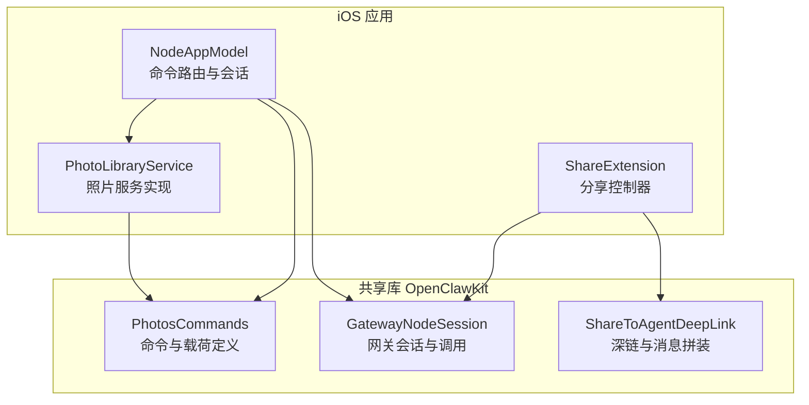
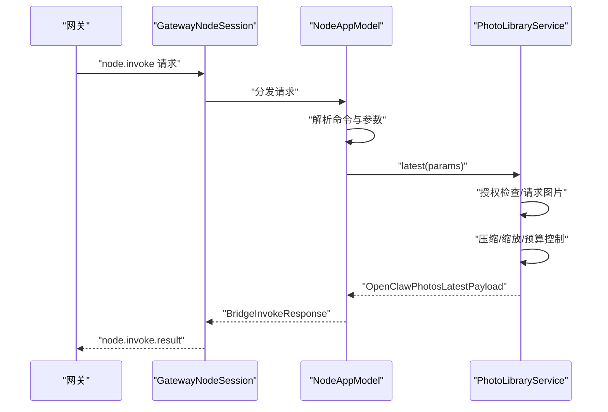
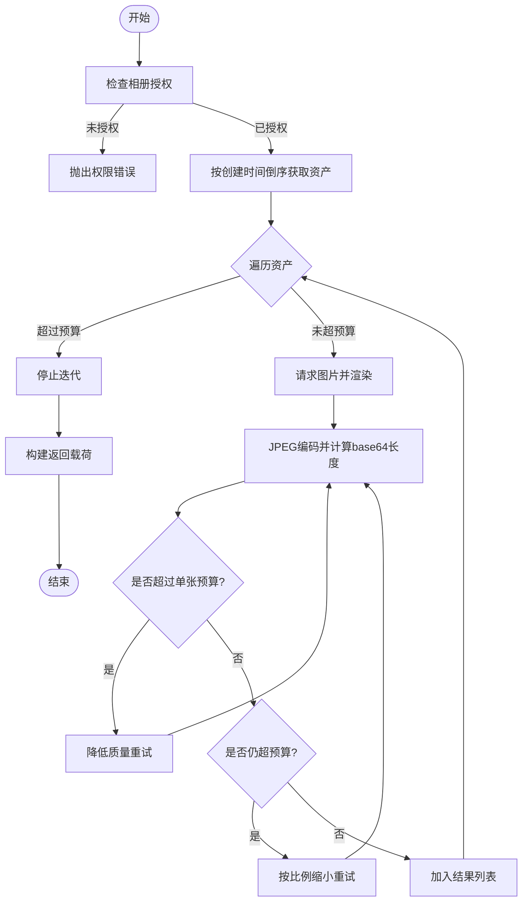
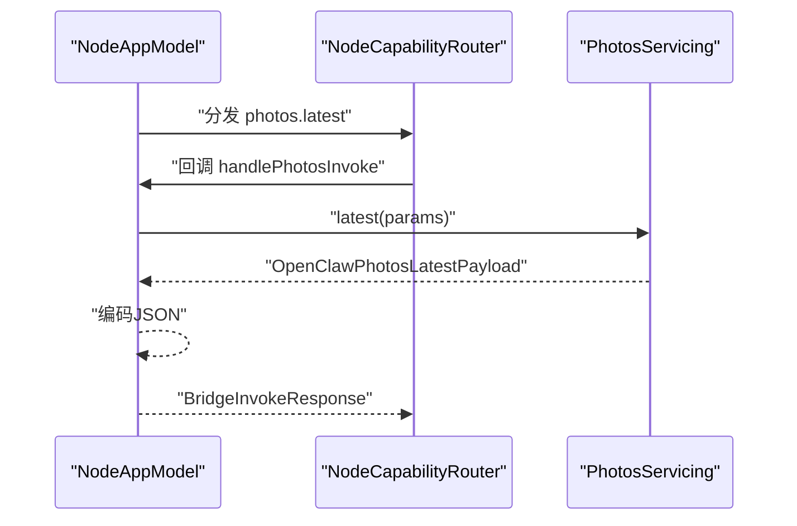
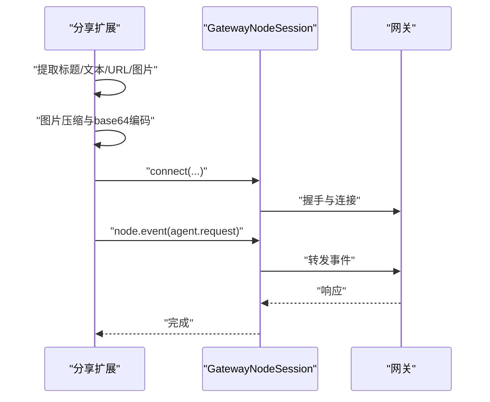
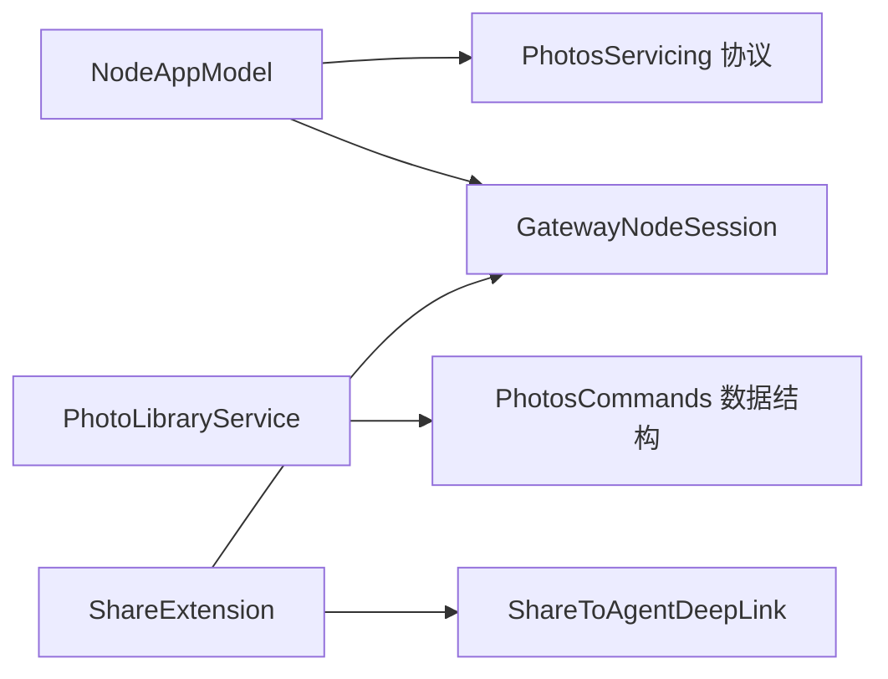

# 媒体管理

<cite>
**本文引用的文件**
- [PhotoLibraryService.swift](file://apps/ios/Sources/Media/PhotoLibraryService.swift)
- [PhotosCommands.swift](file://apps/shared/OpenClawKit/Sources/OpenClawKit/PhotosCommands.swift)
- [GatewayNodeSession.swift](file://apps/shared/OpenClawKit/Sources/OpenClawKit/GatewayNodeSession.swift)
- [NodeServiceProtocols.swift](file://apps/ios/Sources/Services/NodeServiceProtocols.swift)
- [NodeAppModel.swift](file://apps/ios/Sources/Model/NodeAppModel.swift)
- [ShareViewController.swift](file://apps/ios/ShareExtension/ShareViewController.swift)
- [ShareToAgentDeepLink.swift](file://apps/shared/OpenClawKit/Sources/OpenClawKit/ShareToAgentDeepLink.swift)
</cite>

## 目录

1. [简介](#简介)
2. [项目结构](#项目结构)
3. [核心组件](#核心组件)
4. [架构总览](#架构总览)
5. [详细组件分析](#详细组件分析)
6. [依赖关系分析](#依赖关系分析)
7. [性能考量](#性能考量)
8. [故障排查指南](#故障排查指南)
9. [结论](#结论)
10. [附录](#附录)

## 简介

本文件面向iOS节点的媒体管理能力，聚焦于图片、视频、音频等多媒体的存储、检索与管理。文档基于仓库中的现有实现，系统阐述以下主题：

- 使用PhotoKit框架访问相册、请求授权与读取媒体资源
- 媒体库访问权限控制与错误处理
- 文件系统操作与媒体元数据处理（时间戳、尺寸）
- 图片压缩、质量控制与缩放策略
- 媒体传输限制与WebSocket承载约束
- 分享扩展与跨应用媒体转发
- 缓存策略、离线访问与存储空间管理建议
- 具体调用路径与端到端流程（不直接展示代码，仅给出文件路径）

## 项目结构

iOS节点媒体管理主要分布在以下模块：

- iOS应用层：媒体服务实现、应用模型路由、分享扩展
- OpenClawKit共享库：命令定义、数据模型、工具方法

图表来源

- [NodeAppModel.swift](file://apps/ios/Sources/Model/NodeAppModel.swift)
- [PhotoLibraryService.swift](file://apps/ios/Sources/Media/PhotoLibraryService.swift)
- [ShareViewController.swift](file://apps/ios/ShareExtension/ShareViewController.swift)
- [PhotosCommands.swift](file://apps/shared/OpenClawKit/Sources/OpenClawKit/PhotosCommands.swift)
- [GatewayNodeSession.swift](file://apps/shared/OpenClawKit/Sources/OpenClawKit/GatewayNodeSession.swift)
- [ShareToAgentDeepLink.swift](file://apps/shared/OpenClawKit/Sources/OpenClawKit/ShareToAgentDeepLink.swift)

章节来源

- [NodeAppModel.swift](file://apps/ios/Sources/Model/NodeAppModel.swift)
- [PhotoLibraryService.swift](file://apps/ios/Sources/Media/PhotoLibraryService.swift)
- [ShareViewController.swift](file://apps/ios/ShareExtension/ShareViewController.swift)
- [PhotosCommands.swift](file://apps/shared/OpenClawKit/Sources/OpenClawKit/PhotosCommands.swift)
- [GatewayNodeSession.swift](file://apps/shared/OpenClawKit/Sources/OpenClawKit/GatewayNodeSession.swift)
- [ShareToAgentDeepLink.swift](file://apps/shared/OpenClawKit/Sources/OpenClawKit/ShareToAgentDeepLink.swift)

## 核心组件

- 照片服务实现（PhotoLibraryService）：封装PhotoKit访问、授权检查、图片请求与编码、质量/尺寸控制、传输预算控制
- 命令与载荷（PhotosCommands）：定义photos.latest命令参数与返回结构
- 应用模型路由（NodeAppModel）：将node.invoke请求分发至对应服务处理器
- 网关会话（GatewayNodeSession）：负责与网关建立连接、超时控制、请求/响应编解码
- 分享扩展（ShareExtension）：从系统分享面板提取媒体并发送到网关
- 深链与消息拼装（ShareToAgentDeepLink）：将分享内容转为消息文本与URL

章节来源

- [PhotoLibraryService.swift](file://apps/ios/Sources/Media/PhotoLibraryService.swift)
- [PhotosCommands.swift](file://apps/shared/OpenClawKit/Sources/OpenClawKit/PhotosCommands.swift)
- [NodeAppModel.swift](file://apps/ios/Sources/Model/NodeAppModel.swift)
- [GatewayNodeSession.swift](file://apps/shared/OpenClawKit/Sources/OpenClawKit/GatewayNodeSession.swift)
- [ShareViewController.swift](file://apps/ios/ShareExtension/ShareViewController.swift)
- [ShareToAgentDeepLink.swift](file://apps/shared/OpenClawKit/Sources/OpenClawKit/ShareToAgentDeepLink.swift)

## 架构总览

iOS节点通过NodeAppModel统一接收来自网关的node.invoke请求，根据命令名路由到具体服务处理器；照片服务通过PhotoLibraryService访问相册，按参数进行压缩与尺寸调整，并将结果以base64形式返回给网关。

图表来源

- [GatewayNodeSession.swift](file://apps/shared/OpenClawKit/Sources/OpenClawKit/GatewayNodeSession.swift)
- [NodeAppModel.swift](file://apps/ios/Sources/Model/NodeAppModel.swift)
- [PhotoLibraryService.swift](file://apps/ios/Sources/Media/PhotoLibraryService.swift)
- [PhotosCommands.swift](file://apps/shared/OpenClawKit/Sources/OpenClawKit/PhotosCommands.swift)

## 详细组件分析

### 照片服务实现（PhotoLibraryService）

职责与特性

- 授权状态检查：避免在node.invoke期间弹窗导致超时
- 照片检索：按创建时间倒序获取最新N张图片
- 图片请求与渲染：使用PHImageManager异步请求目标尺寸图片
- 压缩与尺寸控制：优先降低JPEG质量，再按需缩放，确保单张与整体base64长度在传输预算内
- 返回结构：包含格式、base64、宽高、创建时间

关键实现要点

- 传输预算：单张最大字符数与总字符数限制，避免WebSocket帧过大
- 尺寸计算：根据像素宽高计算目标尺寸，保持纵横比
- 错误处理：对授权不足、加载失败、编码失败、超出预算等情况抛出明确错误

图表来源

- [PhotoLibraryService.swift](file://apps/ios/Sources/Media/PhotoLibraryService.swift)

章节来源

- [PhotoLibraryService.swift](file://apps/ios/Sources/Media/PhotoLibraryService.swift)

### 命令与载荷定义（PhotosCommands）

- 命令：photos.latest
- 参数：limit（数量）、maxWidth（像素）、quality（0~1）
- 返回：OpenClawPhotosLatestPayload，包含若干OpenClawPhotoPayload
- 载荷字段：format、base64、width、height、createdAt（ISO8601字符串）

章节来源

- [PhotosCommands.swift](file://apps/shared/OpenClawKit/Sources/OpenClawKit/PhotosCommands.swift)

### 应用模型路由（NodeAppModel）

- 注册路由：将photos.latest映射到handlePhotosInvoke
- 处理流程：解码参数、调用photosService.latest、编码返回、封装BridgeInvokeResponse
- 异常处理：未知命令、服务不可用、背景态限制等

图表来源

- [NodeAppModel.swift](file://apps/ios/Sources/Model/NodeAppModel.swift)
- [NodeServiceProtocols.swift](file://apps/ios/Sources/Services/NodeServiceProtocols.swift)

章节来源

- [NodeAppModel.swift](file://apps/ios/Sources/Model/NodeAppModel.swift)
- [NodeServiceProtocols.swift](file://apps/ios/Sources/Services/NodeServiceProtocols.swift)

### 网关会话（GatewayNodeSession）

- 连接与断开：支持重连、选项键校验、快照等待
- 超时控制：invokeWithTimeout确保权限弹窗等阻塞不会导致请求永久挂起
- 请求/响应：request方法对paramsJSON进行UTF-8与JSON校验，sendEvent用于事件推送

章节来源

- [GatewayNodeSession.swift](file://apps/shared/OpenClawKit/Sources/OpenClawKit/GatewayNodeSession.swift)

### 分享扩展（ShareExtension）

- 内容提取：从NSExtensionItem中识别URL、文本、图片、视频、文件
- 图片处理：限制最大附件数量与大小，统一转为JPEG并base64编码
- 发送流程：构造agent.request事件，通过node.event发送到网关

图表来源

- [ShareViewController.swift](file://apps/ios/ShareExtension/ShareViewController.swift)
- [GatewayNodeSession.swift](file://apps/shared/OpenClawKit/Sources/OpenClawKit/GatewayNodeSession.swift)

章节来源

- [ShareViewController.swift](file://apps/ios/ShareExtension/ShareViewController.swift)
- [ShareToAgentDeepLink.swift](file://apps/shared/OpenClawKit/Sources/OpenClawKit/ShareToAgentDeepLink.swift)

## 依赖关系分析

- NodeAppModel依赖NodeServiceProtocols定义的服务接口，并注入PhotoLibraryService实现
- PhotoLibraryService依赖PhotosCommands的数据结构与GatewayNodeSession的超时控制机制
- 分享扩展依赖GatewayNodeSession进行一次性连接与事件发送
- ShareToAgentDeepLink提供消息拼装与URL深链生成

图表来源

- [NodeAppModel.swift](file://apps/ios/Sources/Model/NodeAppModel.swift)
- [NodeServiceProtocols.swift](file://apps/ios/Sources/Services/NodeServiceProtocols.swift)
- [PhotoLibraryService.swift](file://apps/ios/Sources/Media/PhotoLibraryService.swift)
- [PhotosCommands.swift](file://apps/shared/OpenClawKit/Sources/OpenClawKit/PhotosCommands.swift)
- [ShareViewController.swift](file://apps/ios/ShareExtension/ShareViewController.swift)
- [ShareToAgentDeepLink.swift](file://apps/shared/OpenClawKit/Sources/OpenClawKit/ShareToAgentDeepLink.swift)

章节来源

- [NodeAppModel.swift](file://apps/ios/Sources/Model/NodeAppModel.swift)
- [NodeServiceProtocols.swift](file://apps/ios/Sources/Services/NodeServiceProtocols.swift)
- [PhotoLibraryService.swift](file://apps/ios/Sources/Media/PhotoLibraryService.swift)
- [PhotosCommands.swift](file://apps/shared/OpenClawKit/Sources/OpenClawKit/PhotosCommands.swift)
- [ShareViewController.swift](file://apps/ios/ShareExtension/ShareViewController.swift)
- [ShareToAgentDeepLink.swift](file://apps/shared/OpenClawKit/Sources/OpenClawKit/ShareToAgentDeepLink.swift)

## 性能考量

- 传输预算控制：通过单张与总base64字符上限限制，避免WebSocket帧过大导致断连
- 渲染与压缩策略：先降质后降尺寸，平衡画质与体积
- 同步请求与网络访问：使用PHImageManager的同步模式与网络访问开关，结合异步回调，减少主线程阻塞
- 超时与重试：GatewayNodeSession对node.invoke设置显式超时，避免权限弹窗等阻塞
- 分享扩展：对图片进行预压缩，限制附件数量，降低网关负载

## 故障排查指南

常见问题与定位

- 权限不足
  - 现象：调用返回“需要相册权限”
  - 定位：PhotoLibraryService在授权状态非authorized或limited时抛错
  - 参考路径：[PhotoLibraryService.swift](file://apps/ios/Sources/Media/PhotoLibraryService.swift)
- 图片加载失败
  - 现象：无法获取图片或编码失败
  - 定位：渲染阶段未获取到UIImage或JPEG编码失败
  - 参考路径：[PhotoLibraryService.swift](file://apps/ios/Sources/Media/PhotoLibraryService.swift)
- 超出传输预算
  - 现象：返回“图片过大，请减小maxWidth/quality”
  - 定位：单张或整体base64长度超过限制
  - 参考路径：[PhotoLibraryService.swift](file://apps/ios/Sources/Media/PhotoLibraryService.swift)
- 网关超时
  - 现象：node.invoke超时
  - 定位：GatewayNodeSession的invokeWithTimeout逻辑
  - 参考路径：[GatewayNodeSession.swift](file://apps/shared/OpenClawKit/Sources/OpenClawKit/GatewayNodeSession.swift)
- 分享发送失败
  - 现象：分享扩展发送失败
  - 定位：连接参数、clientId兼容性、事件发送失败
  - 可参考：[ShareViewController.swift](file://apps/ios/ShareExtension/ShareViewController.swift)

章节来源

- [PhotoLibraryService.swift](file://apps/ios/Sources/Media/PhotoLibraryService.swift)
- [GatewayNodeSession.swift](file://apps/shared/OpenClawKit/Sources/OpenClawKit/GatewayNodeSession.swift)
- [ShareViewController.swift](file://apps/ios/ShareExtension/ShareViewController.swift)

## 结论

该实现以PhotoLibraryService为核心，结合OpenClawKit的命令与数据结构，在iOS节点上提供了稳定的照片检索与传输能力。通过严格的传输预算控制与超时机制，兼顾了实时性与可靠性。分享扩展进一步打通了系统级媒体转发通道。后续可在缓存策略、离线访问与存储空间管理方面引入更细粒度的优化，以提升用户体验与资源利用率。

## 附录

- 代码示例路径（不展示具体代码内容）
  - 照片最新列表调用：[NodeAppModel.swift](file://apps/ios/Sources/Model/NodeAppModel.swift)
  - 照片服务实现：[PhotoLibraryService.swift](file://apps/ios/Sources/Media/PhotoLibraryService.swift)
  - 命令与载荷定义：[PhotosCommands.swift](file://apps/shared/OpenClawKit/Sources/OpenClawKit/PhotosCommands.swift)
  - 网关会话与超时控制：[GatewayNodeSession.swift](file://apps/shared/OpenClawKit/Sources/OpenClawKit/GatewayNodeSession.swift)
  - 分享扩展发送流程：[ShareViewController.swift](file://apps/ios/ShareExtension/ShareViewController.swift)
  - 深链与消息拼装：[ShareToAgentDeepLink.swift](file://apps/shared/OpenClawKit/Sources/OpenClawKit/ShareToAgentDeepLink.swift)
