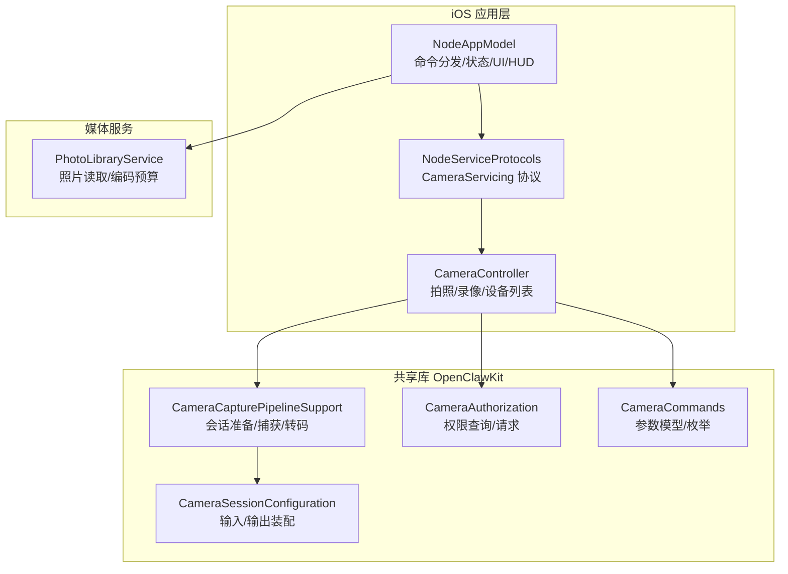
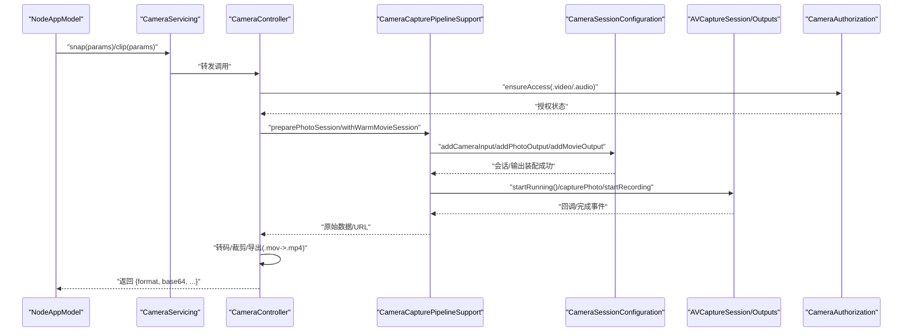
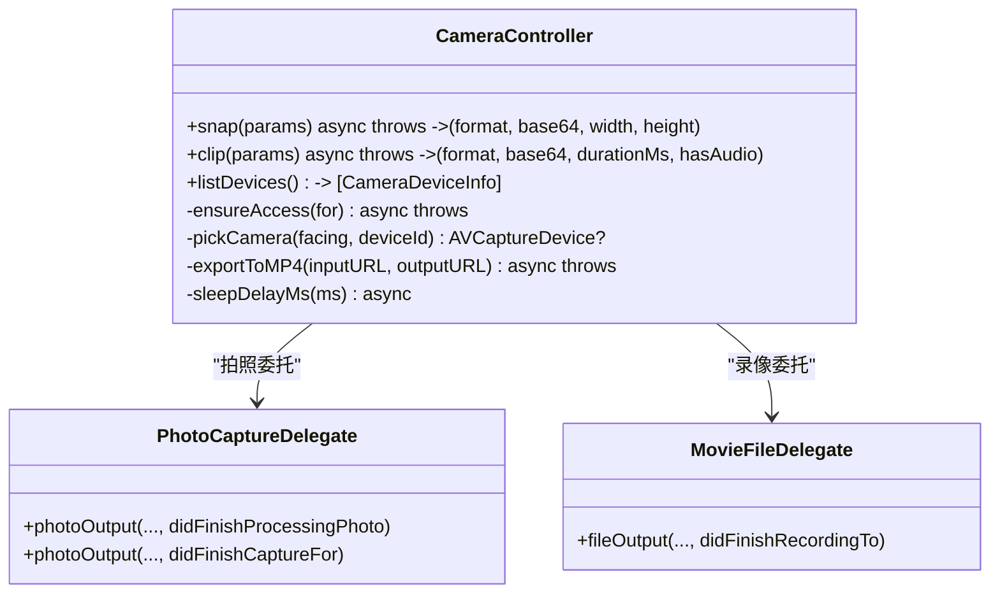
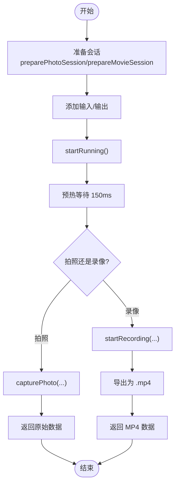
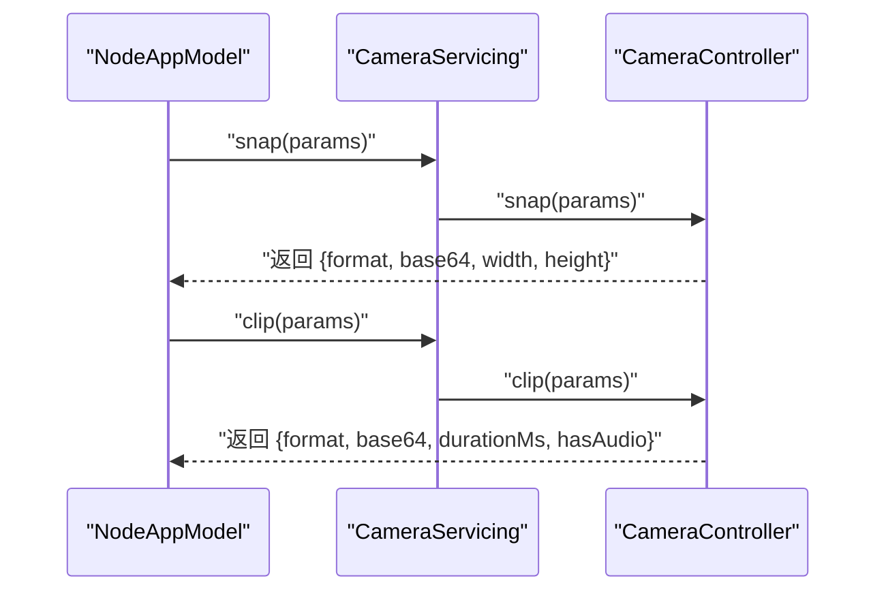
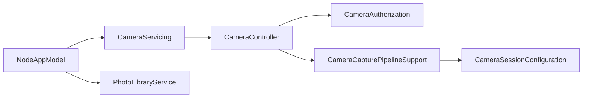

# 相机控制

<cite>
**本文引用的文件**
- [CameraController.swift](file://apps/ios/Sources/Camera/CameraController.swift)
- [CameraCapturePipelineSupport.swift](file://apps/shared/OpenClawKit/Sources/OpenClawKit/CameraCapturePipelineSupport.swift)
- [CameraSessionConfiguration.swift](file://apps/shared/OpenClawKit/Sources/OpenClawKit/CameraSessionConfiguration.swift)
- [CameraAuthorization.swift](file://apps/shared/OpenClawKit/Sources/OpenClawKit/CameraAuthorization.swift)
- [CameraCommands.swift](file://apps/shared/OpenClawKit/Sources/OpenClawKit/CameraCommands.swift)
- [NodeServiceProtocols.swift](file://apps/ios/Sources/Services/NodeServiceProtocols.swift)
- [NodeAppModel.swift](file://apps/ios/Sources/Model/NodeAppModel.swift)
- [PhotoLibraryService.swift](file://apps/ios/Sources/Media/PhotoLibraryService.swift)
</cite>

## 目录

1. [简介](#简介)
2. [项目结构](#项目结构)
3. [核心组件](#核心组件)
4. [架构总览](#架构总览)
5. [详细组件分析](#详细组件分析)
6. [依赖关系分析](#依赖关系分析)
7. [性能考量](#性能考量)
8. [故障排查指南](#故障排查指南)
9. [结论](#结论)
10. [附录：完整实现路径与示例](#附录完整实现路径与示例)

## 简介

本文件系统化梳理 iOS 节点相机控制能力，覆盖以下关键主题：

- 相机访问权限与授权流程
- 图像捕获（拍照）与视频录制（短视频）
- 相机参数配置（朝向、分辨率上限、质量、格式、设备选择、延时）
- 音频录制开关与导出为 MP4 的转码流程
- 设备发现与相机切换（前后摄像头）
- 会话管理与预览层设置要点
- 照片与视频的保存与传输策略
- 错误处理、设备兼容性与性能优化建议
- 完整的调用链路与实现路径参考

## 项目结构

iOS 相机功能主要由以下模块构成：

- iOS 应用层：负责命令分发、UI HUD、语音唤醒暂停/恢复、以及对相机服务的调用
- OpenClawKit 共享库：提供跨平台的相机会话配置、捕获管线支持、权限封装与命令参数模型
- 媒体服务：照片库读取与编码策略（用于对比与参考）

**图表来源**

- [NodeAppModel.swift: 990-1045:990-1045](file://apps/ios/Sources/Model/NodeAppModel.swift#L990-L1045)
- [NodeServiceProtocols.swift: 9-13:9-13](file://apps/ios/Sources/Services/NodeServiceProtocols.swift#L9-L13)
- [CameraController.swift: 6-260:6-260](file://apps/ios/Sources/Camera/CameraController.swift#L6-L260)
- [CameraCapturePipelineSupport.swift: 4-152:4-152](file://apps/shared/OpenClawKit/Sources/OpenClawKit/CameraCapturePipelineSupport.swift#L4-L152)
- [CameraSessionConfiguration.swift: 27-71:27-71](file://apps/shared/OpenClawKit/Sources/OpenClawKit/CameraSessionConfiguration.swift#L27-L71)
- [CameraAuthorization.swift: 3-22:3-22](file://apps/shared/OpenClawKit/Sources/OpenClawKit/CameraAuthorization.swift#L3-L22)
- [CameraCommands.swift: 3-69:3-69](file://apps/shared/OpenClawKit/Sources/OpenClawKit/CameraCommands.swift#L3-L69)
- [PhotoLibraryService.swift: 6-165:6-165](file://apps/ios/Sources/Media/PhotoLibraryService.swift#L6-L165)

**章节来源**

- [NodeAppModel.swift: 990-1045:990-1045](file://apps/ios/Sources/Model/NodeAppModel.swift#L990-L1045)
- [NodeServiceProtocols.swift: 9-13:9-13](file://apps/ios/Sources/Services/NodeServiceProtocols.swift#L9-L13)
- [CameraController.swift: 6-260:6-260](file://apps/ios/Sources/Camera/CameraController.swift#L6-L260)
- [CameraCapturePipelineSupport.swift: 4-152:4-152](file://apps/shared/OpenClawKit/Sources/OpenClawKit/CameraCapturePipelineSupport.swift#L4-L152)
- [CameraSessionConfiguration.swift: 27-71:27-71](file://apps/shared/OpenClawKit/Sources/OpenClawKit/CameraSessionConfiguration.swift#L27-L71)
- [CameraAuthorization.swift: 3-22:3-22](file://apps/shared/OpenClawKit/Sources/OpenClawKit/CameraAuthorization.swift#L3-L22)
- [CameraCommands.swift: 3-69:3-69](file://apps/shared/OpenClawKit/Sources/OpenClawKit/CameraCommands.swift#L3-L69)
- [PhotoLibraryService.swift: 6-165:6-165](file://apps/ios/Sources/Media/PhotoLibraryService.swift#L6-L165)

## 核心组件

- CameraController：面向节点调用的相机控制器，提供拍照、录像、设备列表等能力；内部通过权限校验、设备选择、会话准备与捕获委托完成全流程
- CameraCapturePipelineSupport：封装 AV 捕获管线的准备、启动、捕获与转码逻辑，统一 photo/movie 会话配置
- CameraSessionConfiguration：将摄像头/麦克风输入与照片/电影输出接入 AVCaptureSession，并处理错误映射
- CameraAuthorization：封装相机/麦克风授权状态查询与请求
- CameraCommands：定义相机命令、朝向、图片/视频格式、参数模型
- NodeServiceProtocols：定义 CameraServicing 协议，约束节点侧调用接口
- NodeAppModel：在节点命令分发中调用相机服务，处理 UI HUD、语音唤醒暂停/恢复、结果封装
- PhotoLibraryService：照片库读取与编码策略，可作为大图场景的参考

**章节来源**

- [CameraController.swift: 6-260:6-260](file://apps/ios/Sources/Camera/CameraController.swift#L6-L260)
- [CameraCapturePipelineSupport.swift: 4-152:4-152](file://apps/shared/OpenClawKit/Sources/OpenClawKit/CameraCapturePipelineSupport.swift#L4-L152)
- [CameraSessionConfiguration.swift: 27-71:27-71](file://apps/shared/OpenClawKit/Sources/OpenClawKit/CameraSessionConfiguration.swift#L27-L71)
- [CameraAuthorization.swift: 3-22:3-22](file://apps/shared/OpenClawKit/Sources/OpenClawKit/CameraAuthorization.swift#L3-L22)
- [CameraCommands.swift: 3-69:3-69](file://apps/shared/OpenClawKit/Sources/OpenClawKit/CameraCommands.swift#L3-L69)
- [NodeServiceProtocols.swift: 9-13:9-13](file://apps/ios/Sources/Services/NodeServiceProtocols.swift#L9-L13)
- [NodeAppModel.swift: 990-1045:990-1045](file://apps/ios/Sources/Model/NodeAppModel.swift#L990-L1045)
- [PhotoLibraryService.swift: 6-165:6-165](file://apps/ios/Sources/Media/PhotoLibraryService.swift#L6-L165)

## 架构总览

相机控制的端到端调用链如下：

**图表来源**

- [NodeAppModel.swift: 996-1038:996-1038](file://apps/ios/Sources/Model/NodeAppModel.swift#L996-L1038)
- [NodeServiceProtocols.swift: 9-13:9-13](file://apps/ios/Sources/Services/NodeServiceProtocols.swift#L9-L13)
- [CameraController.swift: 40-142:40-142](file://apps/ios/Sources/Camera/CameraController.swift#L40-L142)
- [CameraCapturePipelineSupport.swift: 5-101:5-101](file://apps/shared/OpenClawKit/Sources/OpenClawKit/CameraCapturePipelineSupport.swift#L5-L101)
- [CameraSessionConfiguration.swift: 27-71:27-71](file://apps/shared/OpenClawKit/Sources/OpenClawKit/CameraSessionConfiguration.swift#L27-L71)
- [CameraAuthorization.swift: 4-20:4-20](file://apps/shared/OpenClawKit/Sources/OpenClawKit/CameraAuthorization.swift#L4-L20)

## 详细组件分析

### 组件一：CameraController（相机控制器）

职责与能力

- 拍照：支持前置/后置选择、最大宽度裁剪、质量控制、延时拍摄、返回格式/尺寸/base64
- 录像：支持前置/后置、时长限制、音频开关、导出为 MP4
- 设备列表：列出可用摄像头（含位置/类型）
- 权限保障：在执行前确保相机/麦克风授权
- 会话与捕获：委托底层管线进行会话准备、启动、捕获与导出

关键实现要点

- 参数校验与默认值：如最大宽度、质量、时长、延时等均有安全边界
- 会话准备：通过 CameraCapturePipelineSupport 统一准备 photo/movie 会话
- 捕获委托：使用私有类实现 AVCapturePhotoCaptureDelegate/AVCaptureFileOutputRecordingDelegate，避免重复代码
- 导出策略：.mov -> .mp4 转码，兼容不同 iOS 版本
- 错误映射：将底层错误映射为统一的 CameraError

**图表来源**

- [CameraController.swift: 6-260:6-260](file://apps/ios/Sources/Camera/CameraController.swift#L6-L260)
- [CameraController.swift: 262-353:262-353](file://apps/ios/Sources/Camera/CameraController.swift#L262-L353)

**章节来源**

- [CameraController.swift: 6-260:6-260](file://apps/ios/Sources/Camera/CameraController.swift#L6-L260)
- [CameraController.swift: 262-353:262-353](file://apps/ios/Sources/Camera/CameraController.swift#L262-L353)

### 组件二：CameraCapturePipelineSupport（捕获管线支持）

职责与能力

- 准备照片会话：创建会话、添加相机输入、配置照片输出
- 准备电影会话：创建会话、添加相机输入、按需添加麦克风输入、配置电影输出并设置最大录制时长
- 预热会话：启动后短暂休眠以减少首帧空白
- 捕获照片数据：封装捕获流程，返回原始数据
- 录制操作：提供 withWarmMovieSession 封装，自动启动/停止会话并执行操作

**图表来源**

- [CameraCapturePipelineSupport.swift: 5-101:5-101](file://apps/shared/OpenClawKit/Sources/OpenClawKit/CameraCapturePipelineSupport.swift#L5-L101)
- [CameraCapturePipelineSupport.swift: 125-137:125-137](file://apps/shared/OpenClawKit/Sources/OpenClawKit/CameraCapturePipelineSupport.swift#L125-L137)

**章节来源**

- [CameraCapturePipelineSupport.swift: 5-101:5-101](file://apps/shared/OpenClawKit/Sources/OpenClawKit/CameraCapturePipelineSupport.swift#L5-L101)
- [CameraCapturePipelineSupport.swift: 125-137:125-137](file://apps/shared/OpenClawKit/Sources/OpenClawKit/CameraCapturePipelineSupport.swift#L125-L137)

### 组件三：CameraSessionConfiguration（会话配置）

职责与能力

- 添加相机输入：校验并添加摄像头输入
- 添加照片输出：校验并添加照片输出，设置优先质量
- 添加电影输出：可选添加麦克风输入与电影输出，并设置最大录制时长

错误映射

- 将添加失败或麦克风不可用等错误映射为统一的 CameraSessionConfigurationError

**章节来源**

- [CameraSessionConfiguration.swift: 27-71:27-71](file://apps/shared/OpenClawKit/Sources/OpenClawKit/CameraSessionConfiguration.swift#L27-L71)

### 组件四：CameraAuthorization（权限封装）

职责与能力

- 查询授权状态：返回是否已授权
- 请求授权：未决定时触发系统授权请求并等待结果

**章节来源**

- [CameraAuthorization.swift: 4-20:4-20](file://apps/shared/OpenClawKit/Sources/OpenClawKit/CameraAuthorization.swift#L4-L20)

### 组件五：CameraCommands（参数与枚举）

职责与能力

- 命令枚举：camera.list/camera.snap/camera.clip
- 朝向枚举：front/back
- 图片/视频格式枚举：jpg/jpeg/mp4
- 参数模型：OpenClawCameraSnapParams/OpenClawCameraClipParams，包含设备 ID、朝向、宽高、质量、格式、延时、时长、音频开关等

**章节来源**

- [CameraCommands.swift: 3-69:3-69](file://apps/shared/OpenClawKit/Sources/OpenClawKit/CameraCommands.swift#L3-L69)

### 组件六：NodeServiceProtocols 与 NodeAppModel（协议与调用入口）

职责与能力

- CameraServicing 协议：定义 listDevices/snap/clip 接口
- NodeAppModel：解析节点命令，调用相机服务，处理 UI HUD、语音唤醒暂停/恢复、结果封装

**图表来源**

- [NodeServiceProtocols.swift: 9-13:9-13](file://apps/ios/Sources/Services/NodeServiceProtocols.swift#L9-L13)
- [NodeAppModel.swift: 996-1038:996-1038](file://apps/ios/Sources/Model/NodeAppModel.swift#L996-L1038)

**章节来源**

- [NodeServiceProtocols.swift: 9-13:9-13](file://apps/ios/Sources/Services/NodeServiceProtocols.swift#L9-L13)
- [NodeAppModel.swift: 996-1038:996-1038](file://apps/ios/Sources/Model/NodeAppModel.swift#L996-L1038)

### 组件七：PhotoLibraryService（照片读取与编码预算）

职责与能力

- 读取最新照片：限制数量与总大小预算，按需降采样与降质量，保证网关传输安全
- 编码策略：JPEG 压缩与尺寸调整，避免超限

参考价值

- 对比相机返回的大图场景，可采用类似“预算控制 + 渐进降质/降尺度”的策略

**章节来源**

- [PhotoLibraryService.swift: 16-55:16-55](file://apps/ios/Sources/Media/PhotoLibraryService.swift#L16-L55)
- [PhotoLibraryService.swift: 111-148:111-148](file://apps/ios/Sources/Media/PhotoLibraryService.swift#L111-L148)

## 依赖关系分析

- NodeAppModel 依赖 CameraServicing 协议，实际注入 CameraController 实例
- CameraController 依赖 CameraAuthorization 进行权限校验
- CameraController 依赖 CameraCapturePipelineSupport 进行会话准备与捕获
- CameraCapturePipelineSupport 依赖 CameraSessionConfiguration 完成输入/输出装配
- NodeAppModel 同时依赖 PhotoLibraryService（用于照片读取场景对比）

**图表来源**

- [NodeAppModel.swift: 152-166:152-166](file://apps/ios/Sources/Model/NodeAppModel.swift#L152-L166)
- [NodeServiceProtocols.swift: 105](file://apps/ios/Sources/Services/NodeServiceProtocols.swift#L105)
- [CameraController.swift: 154-158:154-158](file://apps/ios/Sources/Camera/CameraController.swift#L154-L158)
- [CameraCapturePipelineSupport.swift: 12-27:12-27](file://apps/shared/OpenClawKit/Sources/OpenClawKit/CameraCapturePipelineSupport.swift#L12-L27)
- [CameraSessionConfiguration.swift: 27-44:27-44](file://apps/shared/OpenClawKit/Sources/OpenClawKit/CameraSessionConfiguration.swift#L27-L44)
- [PhotoLibraryService.swift: 6](file://apps/ios/Sources/Media/PhotoLibraryService.swift#L6)

**章节来源**

- [NodeAppModel.swift: 152-166:152-166](file://apps/ios/Sources/Model/NodeAppModel.swift#L152-L166)
- [NodeServiceProtocols.swift: 105](file://apps/ios/Sources/Services/NodeServiceProtocols.swift#L105)
- [CameraController.swift: 154-158:154-158](file://apps/ios/Sources/Camera/CameraController.swift#L154-L158)
- [CameraCapturePipelineSupport.swift: 12-27:12-27](file://apps/shared/OpenClawKit/Sources/OpenClawKit/CameraCapturePipelineSupport.swift#L12-L27)
- [CameraSessionConfiguration.swift: 27-44:27-44](file://apps/shared/OpenClawKit/Sources/OpenClawKit/CameraSessionConfiguration.swift#L27-L44)
- [PhotoLibraryService.swift: 6](file://apps/ios/Sources/Media/PhotoLibraryService.swift#L6)

## 性能考量

- 会话预热：启动后短暂等待以降低首帧空白概率
- 传输预算：默认限制拍照最大宽度，避免超大 base64；同时对网关消息体大小进行预算控制
- 质量与尺寸：先降质量再降尺寸，渐进式压缩
- 时长限制：默认短时录制，避免过大的视频负载
- 音频录制：仅在需要时启用麦克风输入，减少资源占用

[本节为通用性能建议，不直接分析具体文件]

## 故障排查指南

常见问题与定位思路

- 权限被拒：检查 CameraAuthorization 返回状态；若为 denied/restricted，需引导用户在系统设置中开启
- 无法添加输入/输出：检查 CameraSessionConfiguration 的错误映射，确认设备是否存在、权限是否满足
- 录制提前结束：检查最大录制时长设置与导出回调中的错误域/码
- 导出失败：检查 AVAssetExportSession 的状态与错误信息
- 首帧空白：确认已执行预热等待

定位参考

- 权限与错误映射：CameraAuthorization、CameraController 中的错误类型
- 会话装配：CameraSessionConfiguration
- 导出与转码：CameraController.exportToMP4
- 录制委托：MovieFileDelegate

**章节来源**

- [CameraAuthorization.swift: 4-20:4-20](file://apps/shared/OpenClawKit/Sources/OpenClawKit/CameraAuthorization.swift#L4-L20)
- [CameraSessionConfiguration.swift: 4-25:4-25](file://apps/shared/OpenClawKit/Sources/OpenClawKit/CameraSessionConfiguration.swift#L4-L25)
- [CameraController.swift: 144-182:144-182](file://apps/ios/Sources/Camera/CameraController.swift#L144-L182)
- [CameraController.swift: 217-252:217-252](file://apps/ios/Sources/Camera/CameraController.swift#L217-L252)
- [CameraController.swift: 319-353:319-353](file://apps/ios/Sources/Camera/CameraController.swift#L319-L353)

## 结论

该相机控制实现以协议解耦、共享库复用为核心，结合统一的会话配置与捕获管线，提供了稳定、可控的拍照与短视频录制能力。通过严格的参数边界、权限前置与导出策略，兼顾了用户体验与网关传输效率。后续可在 HDR 支持、焦距/变焦控制、闪光灯管理等方面扩展，以满足更丰富的拍摄需求。

[本节为总结性内容，不直接分析具体文件]

## 附录：完整实现路径与示例

以下为关键实现路径的参考（以文件路径标注代替具体代码片段）：

- 相机初始化与会话准备
  - [CameraCapturePipelineSupport.preparePhotoSession:5-27](file://apps/shared/OpenClawKit/Sources/OpenClawKit/CameraCapturePipelineSupport.swift#L5-L27)
  - [CameraCapturePipelineSupport.prepareMovieSession:29-56](file://apps/shared/OpenClawKit/Sources/OpenClawKit/CameraCapturePipelineSupport.swift#L29-L56)
- 实时预览层设置
  - 在实际项目中通常通过将会话的预览层添加到 UIView 上实现，此处以会话准备为主，预览层设置属于常规 AVFoundation 使用方式
- 拍照与照片保存
  - [CameraController.snap:40-88](file://apps/ios/Sources/Camera/CameraController.swift#L40-L88)
  - [CameraCapturePipelineSupport.capturePhotoData:125-137](file://apps/shared/OpenClawKit/Sources/OpenClawKit/CameraCapturePipelineSupport.swift#L125-L137)
  - [PhotoLibraryService.latest（对比大图场景）:16-55](file://apps/ios/Sources/Media/PhotoLibraryService.swift#L16-L55)
- 录像与视频导出
  - [CameraController.clip:90-142](file://apps/ios/Sources/Camera/CameraController.swift#L90-L142)
  - [CameraController.exportToMP4:217-252](file://apps/ios/Sources/Camera/CameraController.swift#L217-L252)
- 相机切换与设备发现
  - [CameraController.listDevices:144-152](file://apps/ios/Sources/Camera/CameraController.swift#L144-L152)
  - [CameraController.pickCamera:160-175](file://apps/ios/Sources/Camera/CameraController.swift#L160-L175)
- 权限处理与设备兼容性
  - [CameraAuthorization.isAuthorized:4-20](file://apps/shared/OpenClawKit/Sources/OpenClawKit/CameraAuthorization.swift#L4-L20)
  - [CameraSessionConfiguration.addCameraInput/addPhotoOutput/addMovieOutput:27-71](file://apps/shared/OpenClawKit/Sources/OpenClawKit/CameraSessionConfiguration.swift#L27-L71)
- 相机参数配置
  - [OpenClawCameraSnapParams/OpenClawCameraClipParams:23-68](file://apps/shared/OpenClawKit/Sources/OpenClawKit/CameraCommands.swift#L23-L68)
  - [CameraController.clampQuality/clampDurationMs:206-216](file://apps/ios/Sources/Camera/CameraController.swift#L206-L216)
- 节点命令集成
  - [NodeAppModel.handleInvoke(camera.list/snap/clip):990-1045](file://apps/ios/Sources/Model/NodeAppModel.swift#L990-1045)
