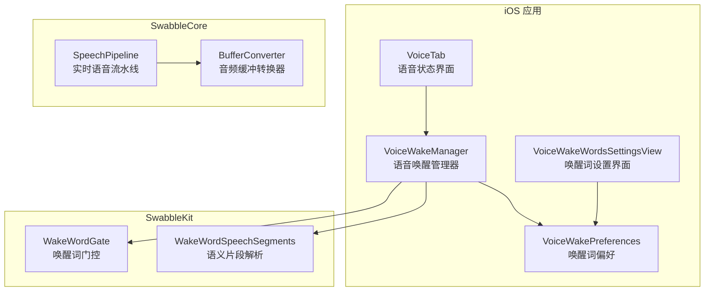
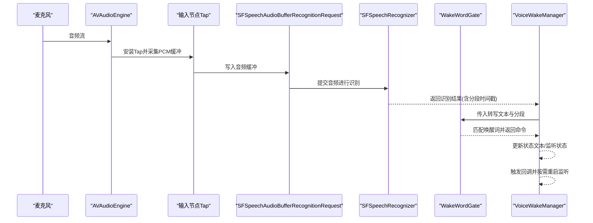
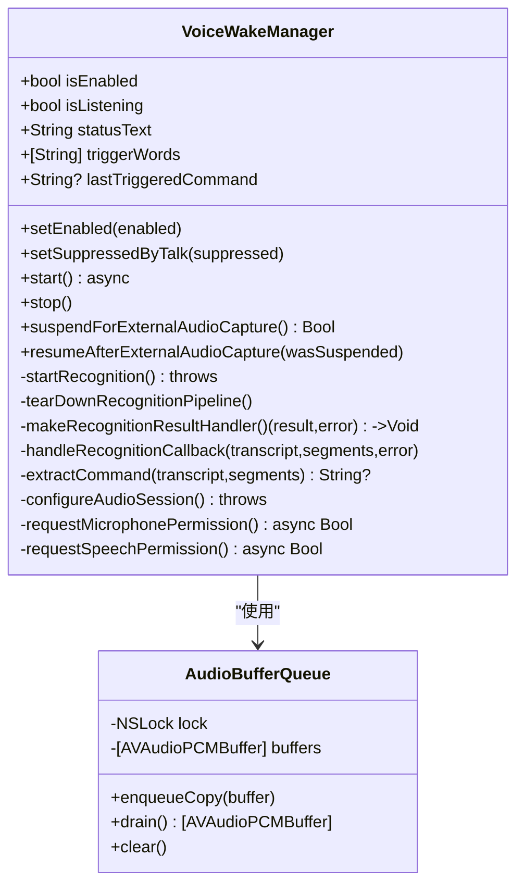
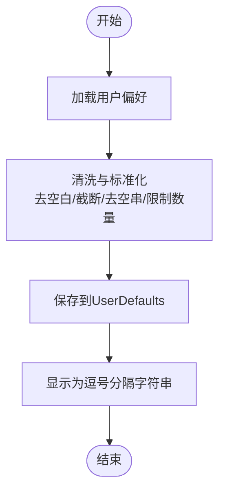
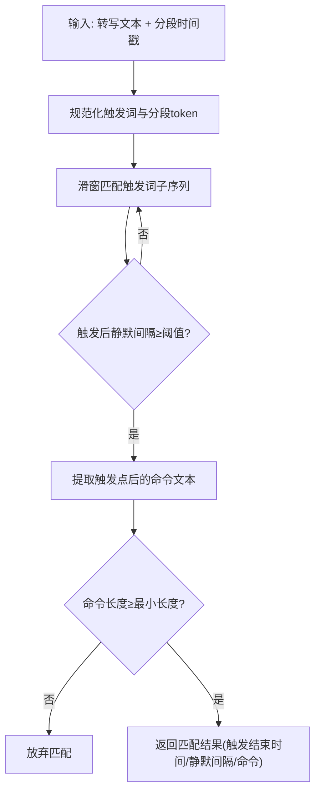
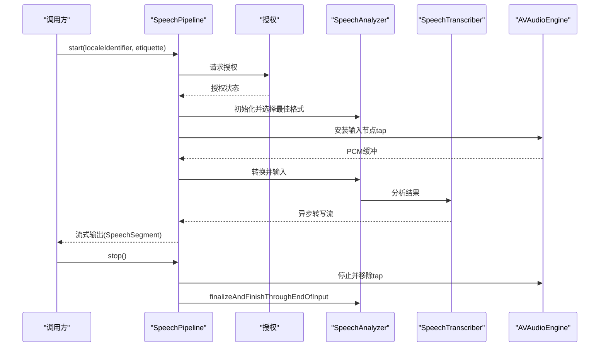
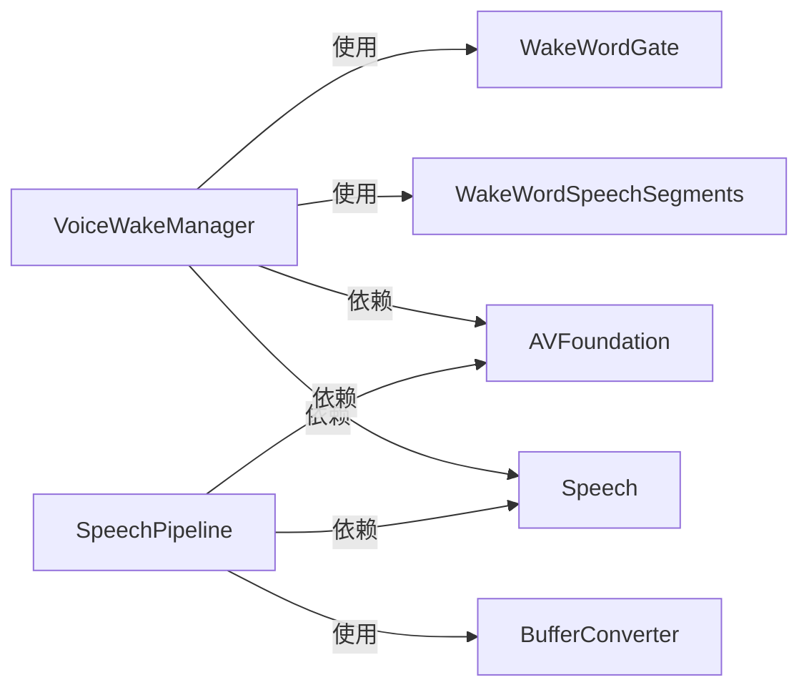

# 语音交互

<cite>
**本文引用的文件**
- [VoiceWakeManager.swift](file://apps/ios/Sources/Voice/VoiceWakeManager.swift)
- [VoiceWakePreferences.swift](file://apps/ios/Sources/Voice/VoiceWakePreferences.swift)
- [VoiceTab.swift](file://apps/ios/Sources/Voice/VoiceTab.swift)
- [VoiceWakeWordsSettingsView.swift](file://apps/ios/Sources/Settings/VoiceWakeWordsSettingsView.swift)
- [WakeWordGate.swift](file://Swabble/Sources/SwabbleKit/WakeWordGate.swift)
- [SpeechPipeline.swift](file://Swabble/Sources/SwabbleCore/Speech/SpeechPipeline.swift)
- [BufferConverter.swift](file://Swabble/Sources/SwabbleCore/Speech/BufferConverter.swift)
</cite>

## 目录

1. [简介](#简介)
2. [项目结构](#项目结构)
3. [核心组件](#核心组件)
4. [架构总览](#架构总览)
5. [详细组件分析](#详细组件分析)
6. [依赖关系分析](#依赖关系分析)
7. [性能考量](#性能考量)
8. [故障排查指南](#故障排查指南)
9. [结论](#结论)
10. [附录](#附录)

## 简介

本文件面向iOS节点的语音交互能力，系统性阐述语音命令识别、语音响应生成与语音状态管理的实现方式。重点覆盖以下方面：

- 使用Speech框架进行语音转文本（STT），并结合Swabble的唤醒词门控算法提取有效指令
- 基于AVFoundation的音频引擎与实时音频缓冲队列，构建低延迟的麦克风采集与识别流水线
- 语音状态管理：启用/禁用、监听中/空闲、暂停、错误恢复等
- 语音唤醒词配置、指令过滤与触发后的回调分发
- 多语言支持与语音质量控制（采样率转换、音频格式适配）
- 语音个性化设置（唤醒词列表、默认值、长度限制）
- 安全与隐私：权限请求、会话激活策略与错误处理
- 提供端到端流程图与类图，帮助开发者快速理解与扩展

## 项目结构

iOS语音交互主要由三部分组成：

- iOS侧语音唤醒管理器：负责权限申请、音频引擎启动、实时音频采集与识别任务调度、状态更新与错误恢复
- SwabbleKit：提供唤醒词匹配算法（WakeWordGate）与语义片段解析（WakeWordSpeechSegments）
- SwabbleCore：提供更高阶的实时语音流水线（SpeechPipeline），用于更通用的语音输入场景

**图表来源**

- [VoiceWakeManager.swift:83-477](file://apps/ios/Sources/Voice/VoiceWakeManager.swift#L83-L477)
- [WakeWordGate.swift:46-198](file://Swabble/Sources/SwabbleKit/WakeWordGate.swift#L46-L198)
- [SpeechPipeline.swift:20-115](file://Swabble/Sources/SwabbleCore/Speech/SpeechPipeline.swift#L20-L115)
- [BufferConverter.swift:4-51](file://Swabble/Sources/SwabbleCore/Speech/BufferConverter.swift#L4-L51)
- [VoiceWakePreferences.swift:3-45](file://apps/ios/Sources/Voice/VoiceWakePreferences.swift#L3-L45)
- [VoiceTab.swift:3-47](file://apps/ios/Sources/Voice/VoiceTab.swift#L3-L47)
- [VoiceWakeWordsSettingsView.swift:4-99](file://apps/ios/Sources/Settings/VoiceWakeWordsSettingsView.swift#L4-L99)

**章节来源**

- [VoiceWakeManager.swift:1-477](file://apps/ios/Sources/Voice/VoiceWakeManager.swift#L1-L477)
- [WakeWordGate.swift:1-198](file://Swabble/Sources/SwabbleKit/WakeWordGate.swift#L1-L198)
- [SpeechPipeline.swift:1-115](file://Swabble/Sources/SwabbleCore/Speech/SpeechPipeline.swift#L1-L115)
- [BufferConverter.swift:1-51](file://Swabble/Sources/SwabbleCore/Speech/BufferConverter.swift#L1-L51)
- [VoiceWakePreferences.swift:1-45](file://apps/ios/Sources/Voice/VoiceWakePreferences.swift#L1-L45)
- [VoiceTab.swift:1-47](file://apps/ios/Sources/Voice/VoiceTab.swift#L1-L47)
- [VoiceWakeWordsSettingsView.swift:1-99](file://apps/ios/Sources/Settings/VoiceWakeWordsSettingsView.swift#L1-L99)

## 核心组件

- 语音唤醒管理器（VoiceWakeManager）
  - 负责麦克风权限与语音识别授权的申请与超时处理
  - 配置AVAudioSession为录音+播放模式，启用蓝牙耳机/扬声器混音
  - 启动AVAudioEngine，安装输入节点tap，将PCM缓冲区写入队列
  - 创建SFSpeechAudioBufferRecognitionRequest并提交音频缓冲，接收识别结果
  - 使用Swabble的WakeWordGate进行唤醒词匹配与指令提取
  - 维护状态文本、监听状态、最后触发命令等
- 唤醒词偏好（VoiceWakePreferences）
  - 存储与加载唤醒词列表，默认值与最大长度/数量限制
  - 提供从网关同步的触发词解码方法
  - 清洗与标准化用户输入的唤醒词
- 唤醒词门控（WakeWordGate）
  - 将SFSpeech的分段时间戳映射为可比较的规范化token序列
  - 在token序列中查找触发词连续子序列，并确保触发后存在最小静默间隔
  - 提取触发点之后的命令文本，去除前后空白与标点
- 实时语音流水线（SpeechPipeline）
  - 更通用的麦克风→分析器→转写器流水线，支持多模块组合
  - 自动请求授权、选择最佳可用音频格式、异步流式输出转写结果
  - 提供停止与资源释放逻辑
- 音频缓冲转换器（BufferConverter）
  - 将输入缓冲转换为目标格式，处理采样率与通道差异
  - 错误分类与降级处理，避免转换失败导致的崩溃

**章节来源**

- [VoiceWakeManager.swift:83-477](file://apps/ios/Sources/Voice/VoiceWakeManager.swift#L83-L477)
- [VoiceWakePreferences.swift:3-45](file://apps/ios/Sources/Voice/VoiceWakePreferences.swift#L3-L45)
- [WakeWordGate.swift:46-198](file://Swabble/Sources/SwabbleKit/WakeWordGate.swift#L46-L198)
- [SpeechPipeline.swift:20-115](file://Swabble/Sources/SwabbleCore/Speech/SpeechPipeline.swift#L20-L115)
- [BufferConverter.swift:4-51](file://Swabble/Sources/SwabbleCore/Speech/BufferConverter.swift#L4-L51)

## 架构总览

下图展示了从语音输入到AI响应的完整流程：麦克风采集→音频引擎→识别请求→识别结果→唤醒词匹配→命令提取→回调分发→重启监听。

**图表来源**

- [VoiceWakeManager.swift:238-350](file://apps/ios/Sources/Voice/VoiceWakeManager.swift#L238-L350)
- [WakeWordGate.swift:65-101](file://Swabble/Sources/SwabbleKit/WakeWordGate.swift#L65-L101)

## 详细组件分析

### 语音唤醒管理器（VoiceWakeManager）

- 关键职责
  - 权限管理：麦克风与语音识别授权，带超时保护
  - 音频会话：设置category/mode/options，激活会话
  - 实时识别：安装输入节点tap，将PCM缓冲写入队列，再提交给识别请求
  - 结果处理：在主线程回调中解析最佳转写、分段，匹配唤醒词，去重与去抖
  - 状态管理：启用/禁用、监听中/空闲、暂停、错误提示与自动重启
- 数据结构与复杂度
  - AudioBufferQueue：基于锁的线程安全队列，入队/出队均摊O(1)，内存占用与缓冲数量线性相关
  - WakeWordGate匹配：对长度为N的token序列与长度为M的触发词序列进行滑窗匹配，时间复杂度O(N\*M)，实际受触发词长度与分段数量影响
- 错误处理与恢复
  - 识别错误时设置状态文本并尝试延迟重启
  - 外部音频捕获（如相机视频）会触发暂停，结束后自动恢复
  - 会话去激活与引擎停止，避免资源泄漏

**图表来源**

- [VoiceWakeManager.swift:83-477](file://apps/ios/Sources/Voice/VoiceWakeManager.swift#L83-L477)
- [VoiceWakeManager.swift:15-79](file://apps/ios/Sources/Voice/VoiceWakeManager.swift#L15-L79)

**章节来源**

- [VoiceWakeManager.swift:83-477](file://apps/ios/Sources/Voice/VoiceWakeManager.swift#L83-L477)

### 唤醒词偏好（VoiceWakePreferences）

- 功能要点
  - 默认唤醒词列表与最大数量/长度限制
  - 从网关payload解码触发词数组
  - 清洗与标准化：去空白、截断、去空串、限定数量
  - UI层读取与保存，支持重置默认值
- 复杂度
  - 清洗操作对每个字符串执行trim/filter/prefix，整体O(k)，k为输入项数

**图表来源**

- [VoiceWakePreferences.swift:23-44](file://apps/ios/Sources/Voice/VoiceWakePreferences.swift#L23-L44)

**章节来源**

- [VoiceWakePreferences.swift:3-45](file://apps/ios/Sources/Voice/VoiceWakePreferences.swift#L3-L45)
- [VoiceWakeWordsSettingsView.swift:4-99](file://apps/ios/Sources/Settings/VoiceWakeWordsSettingsView.swift#L4-L99)

### 唤醒词门控（WakeWordGate）

- 功能要点
  - 将SFSpeech分段的时间戳与范围映射为规范化token序列
  - 滑窗匹配触发词连续子序列
  - 确保触发点后存在最小静默间隔（minPostTriggerGap）
  - 提取触发点之后的命令文本，去除前后空白与标点
- 复杂度
  - 匹配过程对长度为N的序列与长度为M的触发词进行滑窗，时间复杂度O(N\*M)，空间O(N+M)

**图表来源**

- [WakeWordGate.swift:65-101](file://Swabble/Sources/SwabbleKit/WakeWordGate.swift#L65-L101)
- [WakeWordGate.swift:185-196](file://Swabble/Sources/SwabbleKit/WakeWordGate.swift#L185-L196)

**章节来源**

- [WakeWordGate.swift:46-198](file://Swabble/Sources/SwabbleKit/WakeWordGate.swift#L46-L198)

### 实时语音流水线（SpeechPipeline）

- 功能要点
  - 自动请求语音识别授权
  - 选择与转写器兼容的最佳音频格式
  - 安装输入节点tap，异步流式输出转写结果
  - 提供停止与资源释放逻辑
- 适用场景
  - 需要更通用的实时语音输入能力，或与其他模块组合使用

**图表来源**

- [SpeechPipeline.swift:32-85](file://Swabble/Sources/SwabbleCore/Speech/SpeechPipeline.swift#L32-L85)

**章节来源**

- [SpeechPipeline.swift:20-115](file://Swabble/Sources/SwabbleCore/Speech/SpeechPipeline.swift#L20-L115)
- [BufferConverter.swift:4-51](file://Swabble/Sources/SwabbleCore/Speech/BufferConverter.swift#L4-L51)

## 依赖关系分析

- iOS侧VoiceWakeManager依赖：
  - AVFoundation（AVAudioEngine、AVAudioSession、AVAudioPCMBuffer）
  - Speech（SFSpeechRecognizer、SFSpeechAudioBufferRecognitionRequest、SFSpeechAuthorization）
  - SwabbleKit（WakeWordGate、WakeWordSpeechSegments）
  - OpenClawKit（节点模型与应用模型集成）
- SwabbleCore依赖：
  - AVFoundation（音频格式转换与缓冲）
  - Speech（SpeechAnalyzer、SpeechTranscriber）
- 依赖耦合与内聚
  - VoiceWakeManager与SwabbleKit通过WakeWordGate接口耦合，职责清晰：前者负责实时音频与状态管理，后者负责语义匹配
  - SpeechPipeline作为更高层抽象，封装了授权、格式选择与流式输出，便于复用

**图表来源**

- [VoiceWakeManager.swift:1-7](file://apps/ios/Sources/Voice/VoiceWakeManager.swift#L1-L7)
- [SpeechPipeline.swift:1-4](file://Swabble/Sources/SwabbleCore/Speech/SpeechPipeline.swift#L1-L4)
- [BufferConverter.swift:1-3](file://Swabble/Sources/SwabbleCore/Speech/BufferConverter.swift#L1-L3)

**章节来源**

- [VoiceWakeManager.swift:1-7](file://apps/ios/Sources/Voice/VoiceWakeManager.swift#L1-L7)
- [SpeechPipeline.swift:1-4](file://Swabble/Sources/SwabbleCore/Speech/SpeechPipeline.swift#L1-L4)
- [BufferConverter.swift:1-3](file://Swabble/Sources/SwabbleCore/Speech/BufferConverter.swift#L1-L3)

## 性能考量

- 实时性与延迟
  - 输入节点tap以固定bufferSize（如1024/2048）写入，降低CPU占用与延迟
  - 识别结果回调在主线程处理，避免阻塞音频线程；识别任务与tap队列分离
- 音频格式与采样率
  - 通过BufferConverter在输入与分析器之间进行格式转换，保证兼容性
  - 采样率缩放时计算目标frameCapacity，避免溢出
- 资源管理
  - 识别任务取消、tap移除、引擎停止、会话去激活，防止资源泄漏
  - 错误发生时延迟重启，避免频繁重启造成抖动
- 可靠性
  - 权限请求超时保护，避免UI无响应
  - 识别错误时记录状态文本并尝试自动恢复

[本节为通用性能建议，不直接分析具体文件]

## 故障排查指南

- 常见问题与定位
  - 无法启动监听：检查麦克风与语音识别权限是否已授予；查看状态文本提示
  - 识别错误：关注识别回调中的错误信息，确认网络与设备状态
  - 模拟器不支持：模拟器音频栈不稳定，状态文本会提示不支持
  - 外部音频捕获冲突：相机视频录制会暂停监听，结束后自动恢复
- 关键检查点
  - 权限超时：确认授权弹窗已出现且在超时时间内完成
  - 会话状态：确保会话被正确激活并在需要时去激活
  - 音频格式：确认输入与分析器格式兼容，必要时调整bufferSize
- 相关实现位置
  - 权限与超时处理、状态文本更新、错误恢复与自动重启
  - 识别结果回调与唤醒词匹配逻辑
  - 会话配置与引擎停止清理

**章节来源**

- [VoiceWakeManager.swift:160-220](file://apps/ios/Sources/Voice/VoiceWakeManager.swift#L160-L220)
- [VoiceWakeManager.swift:315-350](file://apps/ios/Sources/Voice/VoiceWakeManager.swift#L315-L350)
- [VoiceWakeManager.swift:366-376](file://apps/ios/Sources/Voice/VoiceWakeManager.swift#L366-L376)

## 结论

该iOS语音交互方案通过VoiceWakeManager与SwabbleKit的协作，实现了低延迟、可恢复的语音唤醒与指令提取。其核心优势包括：

- 明确的状态管理与错误恢复机制
- 唤醒词门控算法提升指令准确性
- 高层SpeechPipeline提供通用的实时语音输入能力
- 清晰的权限与会话管理，兼顾性能与可靠性

建议在生产环境中进一步完善：

- 增加更多唤醒词与自定义规则
- 扩展多语言与方言支持
- 加强隐私与数据安全策略（如本地化处理与传输加密）

[本节为总结性内容，不直接分析具体文件]

## 附录

### 多语言支持与语音质量控制

- 多语言支持
  - 通过SpeechPipeline的locale参数指定语言环境，实现多语言转写
  - 唤醒词匹配基于token规范化，可在不同语言环境下保持一致性
- 语音质量控制
  - 采用最佳可用音频格式，确保与转写器兼容
  - BufferConverter进行采样率与格式转换，避免失真与溢出
  - AVAudioSession配置混音与蓝牙支持，提升通话/外设场景体验

**章节来源**

- [SpeechPipeline.swift:32-41](file://Swabble/Sources/SwabbleCore/Speech/SpeechPipeline.swift#L32-L41)
- [BufferConverter.swift:14-49](file://Swabble/Sources/SwabbleCore/Speech/BufferConverter.swift#L14-L49)
- [VoiceWakeManager.swift:366-376](file://apps/ios/Sources/Voice/VoiceWakeManager.swift#L366-L376)

### 语音个性化设置与网关同步

- 唤醒词个性化
  - 支持用户编辑唤醒词列表，限制数量与长度，提供默认值与重置功能
  - 设置界面与偏好存储解耦，支持延迟同步至全局配置
- 网关同步
  - 从网关payload解码触发词数组，清洗后写入本地偏好
  - 全局设置变更后延迟同步，避免频繁网络请求

**章节来源**

- [VoiceWakePreferences.swift:12-21](file://apps/ios/Sources/Voice/VoiceWakePreferences.swift#L12-L21)
- [VoiceWakeWordsSettingsView.swift:88-98](file://apps/ios/Sources/Settings/VoiceWakeWordsSettingsView.swift#L88-L98)

### 语音数据安全与隐私

- 权限与会话
  - 麦克风与语音识别授权均需用户同意，超时保护避免长时间无响应
  - 会话激活与去激活遵循系统策略，减少后台占用
- 错误处理
  - 识别错误与权限拒绝均有明确状态提示，便于用户自助排查
- 建议
  - 对敏感指令与转写结果进行本地化处理与最小化存储
  - 在传输链路增加加密与访问控制

**章节来源**

- [VoiceWakeManager.swift:377-442](file://apps/ios/Sources/Voice/VoiceWakeManager.swift#L377-L442)
- [VoiceWakeManager.swift:29-39](file://apps/ios/Sources/Voice/VoiceWakeManager.swift#L29-L39)
