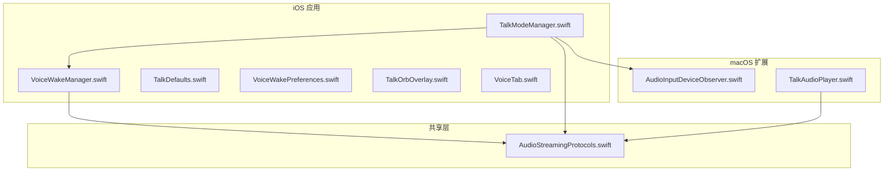
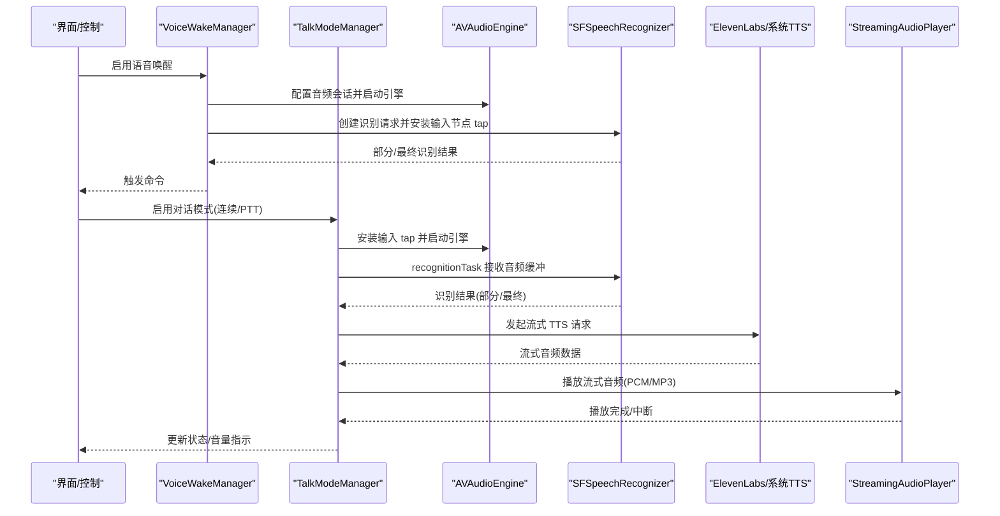
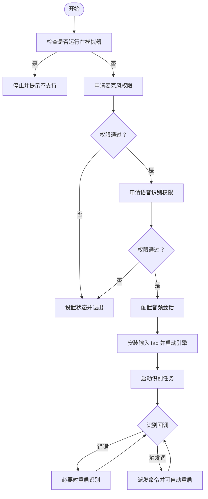
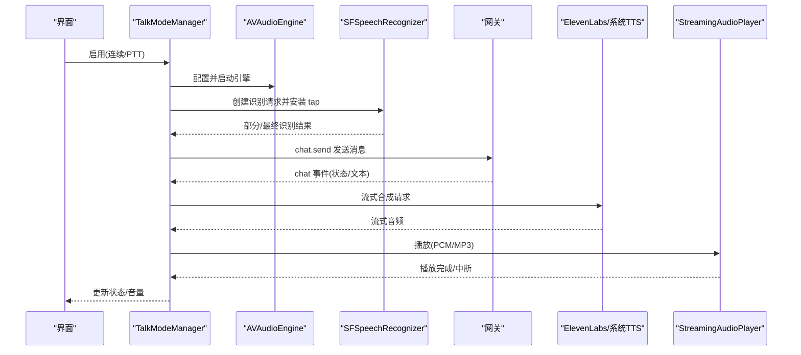
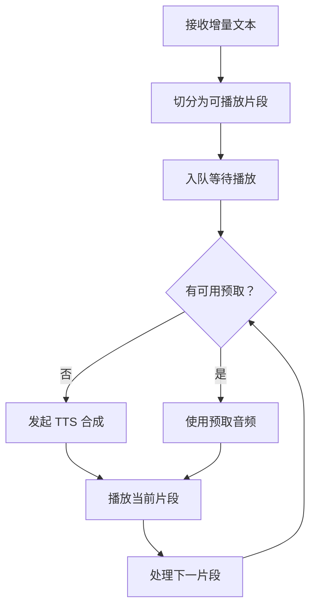
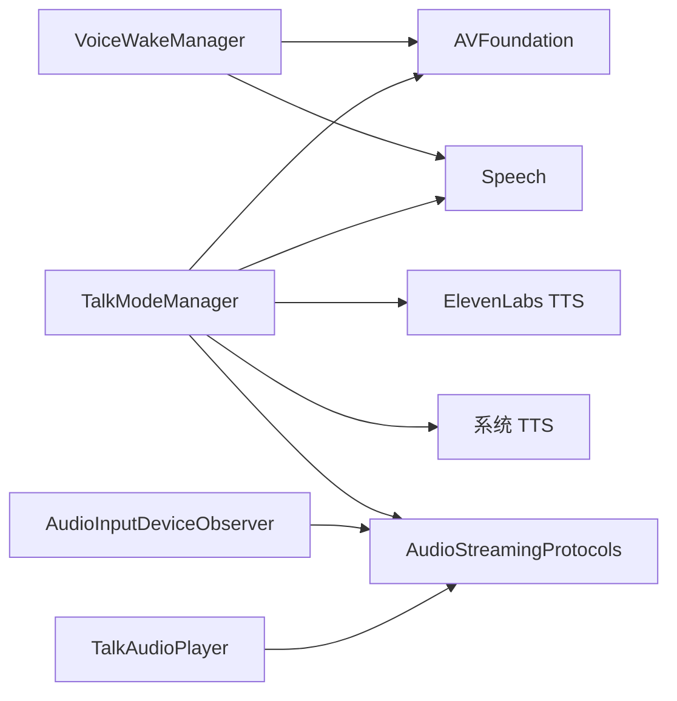

# 音频处理

<cite>
**本文引用的文件**
- [TalkModeManager.swift](file://apps/ios/Sources/Voice/TalkModeManager.swift)
- [VoiceWakeManager.swift](file://apps/ios/Sources/Voice/VoiceWakeManager.swift)
- [TalkDefaults.swift](file://apps/ios/Sources/Voice/TalkDefaults.swift)
- [VoiceWakePreferences.swift](file://apps/ios/Sources/Voice/VoiceWakePreferences.swift)
- [TalkOrbOverlay.swift](file://apps/ios/Sources/Voice/TalkOrbOverlay.swift)
- [VoiceTab.swift](file://apps/ios/Sources/Voice/VoiceTab.swift)
- [AudioInputDeviceObserver.swift](file://apps/macos/Sources/OpenClaw/AudioInputDeviceObserver.swift)
- [TalkAudioPlayer.swift](file://apps/macos/Sources/OpenClaw/TalkAudioPlayer.swift)
- [AudioStreamingProtocols.swift](file://apps/shared/OpenClawKit/Sources/OpenClawKit/AudioStreamingProtocols.swift)
</cite>

## 目录

1. [简介](#简介)
2. [项目结构](#项目结构)
3. [核心组件](#核心组件)
4. [架构总览](#架构总览)
5. [详细组件分析](#详细组件分析)
6. [依赖关系分析](#依赖关系分析)
7. [性能考量](#性能考量)
8. [故障排查指南](#故障排查指南)
9. [结论](#结论)
10. [附录](#附录)

## 简介

本文件系统化梳理 iOS 节点的音频处理能力，覆盖录音、播放、语音识别（STT）与语音合成（TTS）全流程。重点解析以下方面：

- 基于 AVFoundation 的实时音频采集与回放、基于 Speech 的离线/在线语音识别
- 基于 ElevenLabs 的流式 TTS 与系统 TTS 双通道回放
- 实时音频流处理、格式协商与降噪阈值动态估计
- 权限申请流程、设备兼容性与质量优化策略
- 错误处理、性能监控与调试技巧

## 项目结构

iOS 音频相关代码集中在 apps/ios/Sources/Voice 目录，围绕“语音唤醒（Voice Wake）”和“对话模式（Talk Mode）”两大功能域组织；macOS 侧提供音频输入设备观察与播放器抽象，共享层定义了音频流协议。

图表来源

- [VoiceWakeManager.swift:83-477](file://apps/ios/Sources/Voice/VoiceWakeManager.swift#L83-L477)
- [TalkModeManager.swift:33-2201](file://apps/ios/Sources/Voice/TalkModeManager.swift#L33-L2201)
- [VoiceWakePreferences.swift:1-45](file://apps/ios/Sources/Voice/VoiceWakePreferences.swift#L1-L45)
- [TalkDefaults.swift:1-4](file://apps/ios/Sources/Voice/TalkDefaults.swift#L1-L4)
- [TalkOrbOverlay.swift:1-88](file://apps/ios/Sources/Voice/TalkOrbOverlay.swift#L1-L88)
- [VoiceTab.swift:1-47](file://apps/ios/Sources/Voice/VoiceTab.swift#L1-L47)
- [AudioStreamingProtocols.swift](file://apps/shared/OpenClawKit/Sources/OpenClawKit/AudioStreamingProtocols.swift)
- [AudioInputDeviceObserver.swift](file://apps/macos/Sources/OpenClaw/AudioInputDeviceObserver.swift)
- [TalkAudioPlayer.swift](file://apps/macos/Sources/OpenClaw/TalkAudioPlayer.swift)

章节来源

- [VoiceWakeManager.swift:83-477](file://apps/ios/Sources/Voice/VoiceWakeManager.swift#L83-L477)
- [TalkModeManager.swift:33-2201](file://apps/ios/Sources/Voice/TalkModeManager.swift#L33-L2201)
- [VoiceWakePreferences.swift:1-45](file://apps/ios/Sources/Voice/VoiceWakePreferences.swift#L1-L45)
- [TalkDefaults.swift:1-4](file://apps/ios/Sources/Voice/TalkDefaults.swift#L1-L4)
- [TalkOrbOverlay.swift:1-88](file://apps/ios/Sources/Voice/TalkOrbOverlay.swift#L1-L88)
- [VoiceTab.swift:1-47](file://apps/ios/Sources/Voice/VoiceTab.swift#L1-L47)

## 核心组件

- 语音唤醒（Voice Wake）
  - 使用 AVAudioEngine 捕获麦克风音频，通过 SFSpeechRecognizer 进行关键词触发检测
  - 支持外部音频捕获（如相机视频录制）时的临时暂停与恢复
- 对话模式（Talk Mode）
  - 连续/按压说话（PTT）两种录音模式，结合 SFSpeechRecognizer 实时转写
  - 流式 TTS：优先 ElevenLabs，失败则回退系统 TTS；支持增量 TTS 与预取
  - 音频会话管理、静音窗口检测、噪声基底估计与动态阈值
- 配置与偏好
  - 触发词配置、默认静音超时等参数
- UI 展示
  - 音量指示球、状态文本、设置页与触发词提示

章节来源

- [VoiceWakeManager.swift:83-477](file://apps/ios/Sources/Voice/VoiceWakeManager.swift#L83-L477)
- [TalkModeManager.swift:33-2201](file://apps/ios/Sources/Voice/TalkModeManager.swift#L33-L2201)
- [VoiceWakePreferences.swift:1-45](file://apps/ios/Sources/Voice/VoiceWakePreferences.swift#L1-L45)
- [TalkDefaults.swift:1-4](file://apps/ios/Sources/Voice/TalkDefaults.swift#L1-L4)
- [TalkOrbOverlay.swift:1-88](file://apps/ios/Sources/Voice/TalkOrbOverlay.swift#L1-L88)
- [VoiceTab.swift:1-47](file://apps/ios/Sources/Voice/VoiceTab.swift#L1-L47)

## 架构总览

整体采用“识别-推理-合成-播放”的流水线，iOS 侧以 AVFoundation 为底层音频引擎，Speech 提供识别能力，ElevenLabs 或系统 TTS 提供语音输出，共享层协议统一流式播放接口。

图表来源

- [VoiceWakeManager.swift:160-350](file://apps/ios/Sources/Voice/VoiceWakeManager.swift#L160-L350)
- [TalkModeManager.swift:166-857](file://apps/ios/Sources/Voice/TalkModeManager.swift#L166-L857)
- [AudioStreamingProtocols.swift](file://apps/shared/OpenClawKit/Sources/OpenClawKit/AudioStreamingProtocols.swift)

## 详细组件分析

### 语音唤醒（VoiceWakeManager）

- 功能要点
  - 音频会话配置：使用测量模式，允许蓝牙耳机/车载系统接入
  - 输入 tap 将 PCM 缓冲复制到队列，后台任务周期性取出并注入识别请求
  - 识别回调中提取触发词并派发命令，支持在启用状态下自动重启
  - 外部音频捕获时可暂停自身监听，避免冲突
- 关键流程
  - 权限申请（麦克风、语音识别）
  - 音频引擎准备与启动
  - 安装 tap 并启动识别任务
  - 回调处理与命令派发

图表来源

- [VoiceWakeManager.swift:160-350](file://apps/ios/Sources/Voice/VoiceWakeManager.swift#L160-L350)

章节来源

- [VoiceWakeManager.swift:83-477](file://apps/ios/Sources/Voice/VoiceWakeManager.swift#L83-L477)
- [VoiceWakePreferences.swift:1-45](file://apps/ios/Sources/Voice/VoiceWakePreferences.swift#L1-L45)

### 对话模式（TalkModeManager）

- 功能要点
  - 支持连续录音与 PTT 两种模式；PTT 支持一次性录音与超时自动结束
  - 静音窗口检测：基于最后音频活动时间与最后转写时间判断结束
  - 噪声基底估计：动态计算阈值，避免背景噪声导致误判
  - 识别结果处理：区分部分/最终结果，支持增量 TTS 与预取
  - TTS 输出：ElevenLabs 流式 PCM/MP3，失败回退系统 TTS；支持语音打断
- 关键流程
  - 权限申请与音频会话配置
  - 安装输入 tap，启动识别任务
  - 处理识别结果，构建消息并发送至网关
  - 等待聊天完成事件，获取助手文本
  - 流式播放 TTS，支持中断与恢复

图表来源

- [TalkModeManager.swift:166-857](file://apps/ios/Sources/Voice/TalkModeManager.swift#L166-L857)
- [TalkModeManager.swift:991-1140](file://apps/ios/Sources/Voice/TalkModeManager.swift#L991-L1140)

章节来源

- [TalkModeManager.swift:33-2201](file://apps/ios/Sources/Voice/TalkModeManager.swift#L33-L2201)
- [TalkDefaults.swift:1-4](file://apps/ios/Sources/Voice/TalkDefaults.swift#L1-L4)

### 增量 TTS 与预取

- 设计目标
  - 在流式生成过程中尽早播放已到达的片段，降低感知延迟
  - 预取下一个片段以减少切换停顿
- 实现要点
  - 维护增量缓冲区与上下文，按段入队播放
  - 预取任务在后台执行，成功后缓存音频块
  - 当输出格式为 PCM 且播放失败时，自动回退到 MP3

图表来源

- [TalkModeManager.swift:1219-1477](file://apps/ios/Sources/Voice/TalkModeManager.swift#L1219-L1477)

章节来源

- [TalkModeManager.swift:1188-1599](file://apps/ios/Sources/Voice/TalkModeManager.swift#L1188-L1599)

### 音频会话与设备兼容性

- 音频会话配置
  - 类别：播放与录音；模式：测量；选项：降低其他声音、允许蓝牙耳机/车载系统、默认扬声器
  - 与系统其他音频会话交互时，遵循混音与降音策略
- 设备与模拟器限制
  - 模拟器下禁用录音或提示不支持，避免 CoreAudio 权限提示后的死锁
  - 内置扬声器/听筒路由下限制语音打断，避免自反馈
- 输入格式与 tap
  - 从输入节点获取格式，安装 tap 将缓冲传递给识别请求
  - 通过诊断回调更新 UI 音量与噪声基底估计

章节来源

- [VoiceWakeManager.swift:366-375](file://apps/ios/Sources/Voice/VoiceWakeManager.swift#L366-L375)
- [TalkModeManager.swift:517-565](file://apps/ios/Sources/Voice/TalkModeManager.swift#L517-L565)
- [TalkModeManager.swift:1174-1186](file://apps/ios/Sources/Voice/TalkModeManager.swift#L1174-L1186)

### 权限申请与错误处理

- 权限
  - 麦克风权限：通过 AVAudioApplication 请求，带超时保护
  - 语音识别权限：通过 SFSpeechRecognizer 请求授权
- 错误处理
  - 识别错误分类：取消、无语音、其他；对瞬时错误尝试重启
  - TTS 播放失败：记录错误并回退到 MP3 或系统 TTS
  - PTT 超时：自动结束录音并提交
- 性能与监控
  - 通过日志与诊断工具记录会话状态、噪声阈值、播放耗时等

章节来源

- [VoiceWakeManager.swift:377-442](file://apps/ios/Sources/Voice/VoiceWakeManager.swift#L377-L442)
- [TalkModeManager.swift:575-642](file://apps/ios/Sources/Voice/TalkModeManager.swift#L575-L642)
- [TalkModeManager.swift:1070-1136](file://apps/ios/Sources/Voice/TalkModeManager.swift#L1070-L1136)

## 依赖关系分析

- iOS 侧
  - VoiceWakeManager 与 TalkModeManager 共享 AVFoundation 与 Speech 能力
  - TalkModeManager 依赖 ElevenLabs TTS 与系统 TTS 播放器
  - 通过共享协议抽象流式播放接口
- macOS 侧
  - AudioInputDeviceObserver 提供输入设备变更监听
  - TalkAudioPlayer 提供统一播放器抽象，便于跨平台复用

图表来源

- [VoiceWakeManager.swift:83-477](file://apps/ios/Sources/Voice/VoiceWakeManager.swift#L83-L477)
- [TalkModeManager.swift:33-2201](file://apps/ios/Sources/Voice/TalkModeManager.swift#L33-L2201)
- [AudioStreamingProtocols.swift](file://apps/shared/OpenClawKit/Sources/OpenClawKit/AudioStreamingProtocols.swift)
- [AudioInputDeviceObserver.swift](file://apps/macos/Sources/OpenClaw/AudioInputDeviceObserver.swift)
- [TalkAudioPlayer.swift](file://apps/macos/Sources/OpenClaw/TalkAudioPlayer.swift)

章节来源

- [VoiceWakeManager.swift:83-477](file://apps/ios/Sources/Voice/VoiceWakeManager.swift#L83-L477)
- [TalkModeManager.swift:33-2201](file://apps/ios/Sources/Voice/TalkModeManager.swift#L33-L2201)
- [AudioStreamingProtocols.swift](file://apps/shared/OpenClawKit/Sources/OpenClawKit/AudioStreamingProtocols.swift)
- [AudioInputDeviceObserver.swift](file://apps/macos/Sources/OpenClaw/AudioInputDeviceObserver.swift)
- [TalkAudioPlayer.swift](file://apps/macos/Sources/OpenClaw/TalkAudioPlayer.swift)

## 性能考量

- 采样率与格式
  - 增量 TTS 预取时根据输出格式选择 MP3 或 PCM，避免播放失败
  - 当 API 明确拒绝 PCM 时，后续会话默认使用 MP3
- 延迟优化
  - 增量 TTS 与预取减少首包等待时间
  - 静音窗口与噪声阈值动态估计降低误触发与延迟
- 资源管理
  - 及时移除 tap、停止引擎与释放识别任务，避免资源泄漏
  - 在后台或外部音频捕获场景主动暂停自身监听

章节来源

- [TalkModeManager.swift:1565-1599](file://apps/ios/Sources/Voice/TalkModeManager.swift#L1565-L1599)
- [TalkModeManager.swift:1317-1332](file://apps/ios/Sources/Voice/TalkModeManager.swift#L1317-L1332)
- [VoiceWakeManager.swift:283-299](file://apps/ios/Sources/Voice/VoiceWakeManager.swift#L283-L299)

## 故障排查指南

- 录音不可用
  - 检查麦克风权限是否被拒绝；在设置中重新授权
  - 模拟器环境会直接提示不支持，请在真机上测试
- 识别不稳定
  - 确认语音识别权限已授权
  - 降低背景噪音，确保静音窗口合理（默认约 900ms）
  - 观察噪声阈值日志，确认阈值估计正常
- 播放异常
  - 若 PCM 播放失败，系统会自动回退 MP3；若 API 明确拒绝 PCM，后续会话默认使用 MP3
  - 检查网络连通性与 TTS 密钥配置
- 语音打断问题
  - 内置扬声器/听筒路由下会限制打断，建议使用耳机/蓝牙设备
- UI 与状态
  - 音量球与状态文本用于直观反馈；若长时间显示“识别错误”，可尝试重启识别

章节来源

- [VoiceWakeManager.swift:169-213](file://apps/ios/Sources/Voice/VoiceWakeManager.swift#L169-L213)
- [TalkModeManager.swift:176-208](file://apps/ios/Sources/Voice/TalkModeManager.swift#L176-L208)
- [TalkModeManager.swift:1070-1136](file://apps/ios/Sources/Voice/TalkModeManager.swift#L1070-L1136)
- [TalkModeManager.swift:1174-1186](file://apps/ios/Sources/Voice/TalkModeManager.swift#L1174-L1186)

## 结论

该实现以 AVFoundation 为核心，结合 Speech 完成高可靠录音与识别，配合 ElevenLabs 与系统 TTS 提供流畅自然的语音输出。通过增量 TTS、预取与动态阈值等策略，在保证稳定性的同时显著降低了感知延迟。权限管理、设备兼容性与错误回退机制共同保障了用户体验。

## 附录

### 代码示例路径（不含具体代码内容）

- 录音与识别初始化
  - [VoiceWakeManager.swift:238-281](file://apps/ios/Sources/Voice/VoiceWakeManager.swift#L238-L281)
  - [TalkModeManager.swift:488-622](file://apps/ios/Sources/Voice/TalkModeManager.swift#L488-L622)
- 权限申请
  - [VoiceWakeManager.swift:377-442](file://apps/ios/Sources/Voice/VoiceWakeManager.swift#L377-L442)
  - [TalkModeManager.swift:176-190](file://apps/ios/Sources/Voice/TalkModeManager.swift#L176-L190)
- 增量 TTS 与预取
  - [TalkModeManager.swift:1219-1477](file://apps/ios/Sources/Voice/TalkModeManager.swift#L1219-L1477)
- 流式播放与回退
  - [TalkModeManager.swift:1070-1136](file://apps/ios/Sources/Voice/TalkModeManager.swift#L1070-L1136)
- 音频会话配置
  - [VoiceWakeManager.swift:366-375](file://apps/ios/Sources/Voice/VoiceWakeManager.swift#L366-L375)
  - [TalkModeManager.swift:194-194](file://apps/ios/Sources/Voice/TalkModeManager.swift#L194-L194)
