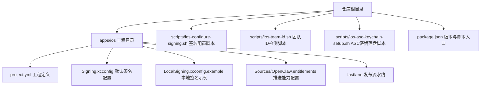
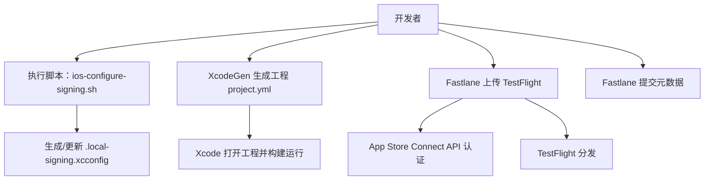
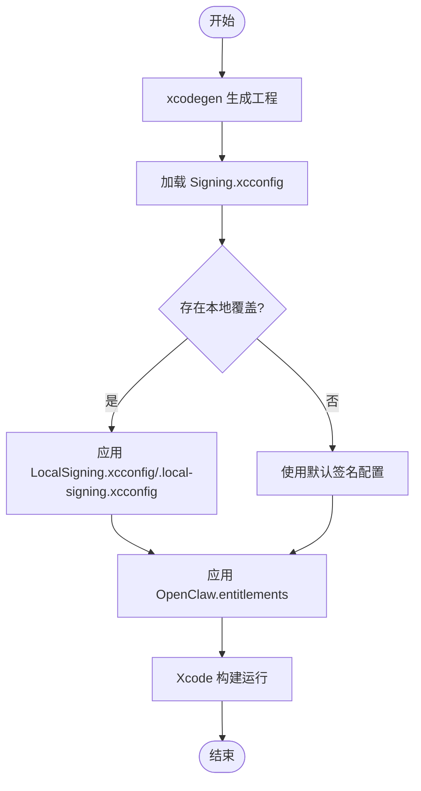
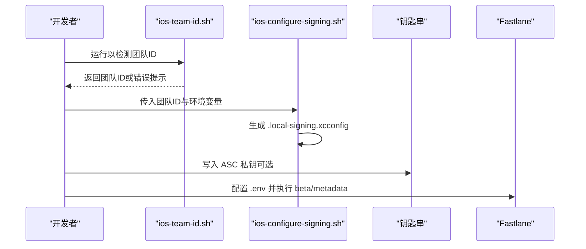
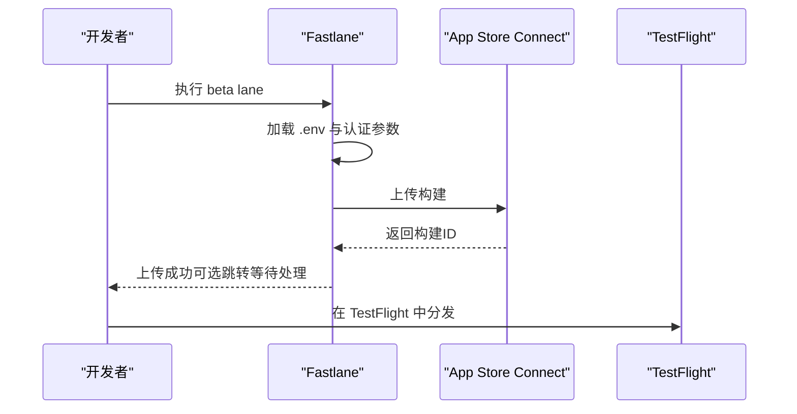
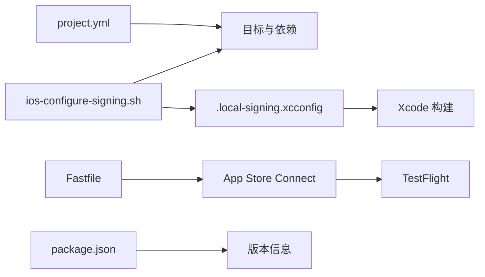

# 安装与配置

<cite>
**本文引用的文件**
- [apps/ios/README.md](file://apps/ios/README.md)
- [apps/ios/project.yml](file://apps/ios/project.yml)
- [apps/ios/Signing.xcconfig](file://apps/ios/Signing.xcconfig)
- [apps/ios/LocalSigning.xcconfig.example](file://apps/ios/LocalSigning.xcconfig.example)
- [apps/ios/Sources/OpenClaw.entitlements](file://apps/ios/Sources/OpenClaw.entitlements)
- [scripts/ios-configure-signing.sh](file://scripts/ios-configure-signing.sh)
- [scripts/ios-team-id.sh](file://scripts/ios-team-id.sh)
- [scripts/ios-asc-keychain-setup.sh](file://scripts/ios-asc-keychain-setup.sh)
- [apps/ios/fastlane/Fastfile](file://apps/ios/fastlane/Fastfile)
- [apps/ios/fastlane/Appfile](file://apps/ios/fastlane/Appfile)
- [apps/ios/fastlane/SETUP.md](file://apps/ios/fastlane/SETUP.md)
- [package.json](file://package.json)
</cite>

## 目录

1. [简介](#简介)
2. [项目结构](#项目结构)
3. [核心组件](#核心组件)
4. [架构总览](#架构总览)
5. [详细组件分析](#详细组件分析)
6. [依赖关系分析](#依赖关系分析)
7. [性能考虑](#性能考虑)
8. [故障排查指南](#故障排查指南)
9. [结论](#结论)
10. [附录](#附录)

## 简介

本文件面向iOS节点（OpenClaw iOS客户端）的安装与配置，覆盖从开发环境准备、Xcode项目生成与签名配置，到本地运行、App Store Connect发布前准备、TestFlight测试与生产部署的关键流程。同时提供常见安装问题的解决方案与调试技巧，帮助开发者快速完成一次可运行的本地构建与发布准备。

## 项目结构

iOS节点位于 apps/ios 目录，采用 Swift 6、XcodeGen 生成工程、Fastlane 自动化发布的工作流。核心配置包括：

- 工程定义：通过 project.yml 描述目标、方案、依赖与构建设置
- 签名与配置：通过 Signing.xcconfig 与 LocalSigning.xcconfig 提供默认与本地覆盖
- 能力与推送：通过 OpenClaw.entitlements 配置 aps-environment
- 自动化脚本：通过 ios-configure-signing.sh、ios-team-id.sh、ios-asc-keychain-setup.sh 实现团队ID检测、签名配置与App Store Connect密钥落盘
- 发布流水线：通过 fastlane/Fastfile、fastlane/Appfile、fastlane/SETUP.md 完成构建、上传与元数据提交

图表来源

- [apps/ios/project.yml:1-324](file://apps/ios/project.yml#L1-L324)
- [apps/ios/Signing.xcconfig:1-21](file://apps/ios/Signing.xcconfig#L1-L21)
- [apps/ios/LocalSigning.xcconfig.example:1-16](file://apps/ios/LocalSigning.xcconfig.example#L1-L16)
- [apps/ios/Sources/OpenClaw.entitlements:1-10](file://apps/ios/Sources/OpenClaw.entitlements#L1-L10)
- [apps/ios/fastlane/Fastfile:1-201](file://apps/ios/fastlane/Fastfile#L1-L201)
- [scripts/ios-configure-signing.sh:1-104](file://scripts/ios-configure-signing.sh#L1-L104)
- [scripts/ios-team-id.sh:1-208](file://scripts/ios-team-id.sh#L1-L208)
- [scripts/ios-asc-keychain-setup.sh:1-188](file://scripts/ios-asc-keychain-setup.sh#L1-L188)
- [package.json:1-200](file://package.json#L1-L200)

章节来源

- [apps/ios/README.md:1-142](file://apps/ios/README.md#L1-L142)
- [apps/ios/project.yml:1-324](file://apps/ios/project.yml#L1-L324)
- [package.json:1-200](file://package.json#L1-L200)

## 核心组件

- 工程与目标
  - 应用目标 OpenClaw 及其扩展（分享扩展、小组件、Watch App/Extension）
  - 测试目标 OpenClawTests、OpenClawLogicTests
  - 依赖包 OpenClawKit、Swabble
- 构建与签名
  - 使用 XcodeGen 基于 project.yml 生成工程
  - Debug/Release 共用 Signing.xcconfig，默认 Manual 签名策略
  - 支持本地覆盖（LocalSigning.xcconfig）与自动签名（Automatic）
- 能力与权限
  - 推送通知：aps-environment 设置为 development（本地调试）
  - 后台模式：audio、remote-notification
  - 权限描述：相机、麦克风、位置、相册、运动等
- 发布自动化
  - Fastlane lanes：beta（构建并上传TestFlight）、metadata（提交元数据）、auth_check（验证认证）
  - App Store Connect API 密钥支持多种注入方式（文件、Keychain、环境变量）

章节来源

- [apps/ios/project.yml:38-324](file://apps/ios/project.yml#L38-L324)
- [apps/ios/Signing.xcconfig:1-21](file://apps/ios/Signing.xcconfig#L1-L21)
- [apps/ios/LocalSigning.xcconfig.example:1-16](file://apps/ios/LocalSigning.xcconfig.example#L1-L16)
- [apps/ios/Sources/OpenClaw.entitlements:1-10](file://apps/ios/Sources/OpenClaw.entitlements#L1-L10)
- [apps/ios/fastlane/Fastfile:135-200](file://apps/ios/fastlane/Fastfile#L135-L200)

## 架构总览

下图展示从本地开发到发布的关键路径：本地签名配置、Xcode工程生成、本地运行、以及通过Fastlane上传TestFlight与提交元数据。

图表来源

- [scripts/ios-configure-signing.sh:1-104](file://scripts/ios-configure-signing.sh#L1-L104)
- [apps/ios/project.yml:1-324](file://apps/ios/project.yml#L1-L324)
- [apps/ios/fastlane/Fastfile:135-200](file://apps/ios/fastlane/Fastfile#L135-L200)
- [apps/ios/fastlane/Appfile:1-16](file://apps/ios/fastlane/Appfile#L1-L16)

## 详细组件分析

### 组件A：本地安装与开发环境准备

- 必备工具
  - Xcode 16+
  - pnpm
  - xcodegen
  - Apple 开发者账号与已配置的签名集（用于本地签名）
- 关键步骤
  - 在仓库根目录安装依赖并生成本地签名配置
  - 进入 apps/ios 目录，使用 xcodegen 生成工程并打开
  - 在 Xcode 中选择 OpenClaw 方案、连接的 iPhone 设备、Debug 配置进行运行
- 个人团队签名失败时的处理
  - 使用 LocalSigning.xcconfig 示例文件复制为 LocalSigning.xcconfig，切换为 Automatic 签名并设置唯一本地 Bundle ID
- 快捷命令
  - 一键执行上述流程并打开工程

章节来源

- [apps/ios/README.md:21-51](file://apps/ios/README.md#L21-L51)
- [apps/ios/README.md:43-46](file://apps/ios/README.md#L43-L46)

### 组件B：Xcode 项目配置与签名

- 工程生成
  - 使用 xcodegen 基于 project.yml 生成 Xcode 工程
  - 工程包含应用主目标、扩展、测试目标与依赖包
- 签名配置
  - 默认签名策略为 Manual，团队ID与 Bundle ID 在 Signing.xcconfig 中定义
  - 本地覆盖优先级高于默认值，可通过 LocalSigning.xcconfig 或 .local-signing.xcconfig 指定
- 能力与权限
  - 通过 CODE_SIGN_ENTITLEMENTS 指向 OpenClaw.entitlements
  - entitlements 中 aps-environment 设置为 development，确保本地调试可用
  - Info.plist 中声明后台模式、网络发现、权限描述与URL Scheme

图表来源

- [apps/ios/project.yml:42-96](file://apps/ios/project.yml#L42-L96)
- [apps/ios/Signing.xcconfig:1-21](file://apps/ios/Signing.xcconfig#L1-L21)
- [apps/ios/LocalSigning.xcconfig.example:1-16](file://apps/ios/LocalSigning.xcconfig.example#L1-L16)
- [apps/ios/Sources/OpenClaw.entitlements:1-10](file://apps/ios/Sources/OpenClaw.entitlements#L1-L10)

章节来源

- [apps/ios/project.yml:42-96](file://apps/ios/project.yml#L42-L96)
- [apps/ios/Signing.xcconfig:1-21](file://apps/ios/Signing.xcconfig#L1-L21)
- [apps/ios/LocalSigning.xcconfig.example:1-16](file://apps/ios/LocalSigning.xcconfig.example#L1-L16)
- [apps/ios/Sources/OpenClaw.entitlements:1-10](file://apps/ios/Sources/OpenClaw.entitlements#L1-L10)

### 组件C：代码签名配置与证书管理

- 团队ID检测
  - ios-team-id.sh 会从 Xcode 偏好、旧版偏好、已安装的托管配置文件中解析团队ID；若启用回退，也可从钥匙串中识别
  - 若未找到团队ID，提示在 Xcode 中登录账户或手动设置 IOS_DEVELOPMENT_TEAM
- 签名配置生成
  - ios-configure-signing.sh 读取团队ID与用户/环境变量，生成 .local-signing.xcconfig，包含：
    - 签名风格（Manual/Automatic）
    - 开发团队ID
    - 多个 Bundle ID（应用、分享扩展、小组件、Watch App/Extension）
    - 可选的 Provisioning Profile 名称
- App Store Connect 密钥落盘
  - ios-asc-keychain-setup.sh 将私钥写入 macOS 钥匙串，导出 ASC_KEY_ID、ASC_ISSUER_ID、ASC_KEYCHAIN_SERVICE、ASC_KEYCHAIN_ACCOUNT 等变量
  - 支持将非敏感变量写入 apps/ios/fastlane/.env，便于 Fastlane 使用

图表来源

- [scripts/ios-team-id.sh:1-208](file://scripts/ios-team-id.sh#L1-L208)
- [scripts/ios-configure-signing.sh:1-104](file://scripts/ios-configure-signing.sh#L1-L104)
- [scripts/ios-asc-keychain-setup.sh:1-188](file://scripts/ios-asc-keychain-setup.sh#L1-L188)
- [apps/ios/fastlane/Fastfile:135-200](file://apps/ios/fastlane/Fastfile#L135-L200)

章节来源

- [scripts/ios-team-id.sh:1-208](file://scripts/ios-team-id.sh#L1-L208)
- [scripts/ios-configure-signing.sh:1-104](file://scripts/ios-configure-signing.sh#L1-L104)
- [scripts/ios-asc-keychain-setup.sh:1-188](file://scripts/ios-asc-keychain-setup.sh#L1-L188)

### 组件D：App Store 发布前准备、TestFlight 测试与生产部署

- TestFlight 上传
  - Fastlane lane beta：构建应用并上传至 TestFlight，支持自动签名与团队ID回退
  - 通过 Appfile 指定 bundle ID，支持多种 App Store Connect API 认证方式
- 元数据提交
  - Fastlane lane metadata：提交应用元数据与截图（可选），支持按需跳过
- 发布前检查清单
  - 确认团队ID、Bundle ID、推送能力与证书状态
  - 在 Xcode 控制台过滤日志子系统以定位问题
  - 在 Settings -> Gateway 中确认网关状态与配对状态

图表来源

- [apps/ios/fastlane/Fastfile:135-200](file://apps/ios/fastlane/Fastfile#L135-L200)
- [apps/ios/fastlane/Appfile:1-16](file://apps/ios/fastlane/Appfile#L1-16)
- [apps/ios/fastlane/SETUP.md:1-69](file://apps/ios/fastlane/SETUP.md#L1-L69)

章节来源

- [apps/ios/fastlane/Fastfile:135-200](file://apps/ios/fastlane/Fastfile#L135-L200)
- [apps/ios/fastlane/Appfile:1-16](file://apps/ios/fastlane/Appfile#L1-L16)
- [apps/ios/fastlane/SETUP.md:1-69](file://apps/ios/fastlane/SETUP.md#L1-L69)

### 组件E：推送通知与本地调试要点

- 本地调试
  - 应用启动时调用注册远程通知；entitlements 中 aps-environment 为 development，本地构建使用沙盒 APNs
  - 若推送能力或配置不正确，运行时会记录“APNs registration failed”相关日志
- 生产构建
  - Release 构建使用 production 的 aps-environment
- 调试建议
  - 在 Xcode 控制台过滤 ai.openclaw.ios、GatewayDiag、APNs registration failed 等关键字
  - 在 Settings -> Gateway 中查看网关状态与发现日志

章节来源

- [apps/ios/README.md:53-61](file://apps/ios/README.md#L53-L61)
- [apps/ios/Sources/OpenClaw.entitlements:1-10](file://apps/ios/Sources/OpenClaw.entitlements#L1-L10)

## 依赖关系分析

- 工程与脚本
  - project.yml 定义了目标、依赖与构建设置，依赖 OpenClawKit、Swabble 等包
  - ios-configure-signing.sh 依赖 ios-team-id.sh 获取团队ID，并生成 .local-signing.xcconfig
  - Fastlane 依赖 apps/ios/fastlane/.env 与钥匙串中的 ASC 私钥
- 版本与元数据
  - package.json 中包含版本号与导出项，可用于发布时的版本一致性核对

图表来源

- [apps/ios/project.yml:13-324](file://apps/ios/project.yml#L13-L324)
- [scripts/ios-configure-signing.sh:1-104](file://scripts/ios-configure-signing.sh#L1-L104)
- [apps/ios/fastlane/Fastfile:1-201](file://apps/ios/fastlane/Fastfile#L1-L201)
- [package.json:1-200](file://package.json#L1-L200)

章节来源

- [apps/ios/project.yml:13-324](file://apps/ios/project.yml#L13-L324)
- [scripts/ios-configure-signing.sh:1-104](file://scripts/ios-configure-signing.sh#L1-L104)
- [apps/ios/fastlane/Fastfile:1-201](file://apps/ios/fastlane/Fastfile#L1-L201)
- [package.json:1-200](file://package.json#L1-L200)

## 性能考虑

- 前台优先：iOS 可能在后台挂起 socket，当前实现仍处于优化中，建议优先在前台验证功能
- 后台限制：后台状态下 canvas._、camera._、screen._、talk._ 等命令受限
- 位置事件：后台位置需要 Always 权限；建议仅用于触发自动化信号而非持续唤醒
- 资源影响：关注热耗与电池消耗，避免长时间高负载运行

章节来源

- [apps/ios/README.md:101-118](file://apps/ios/README.md#L101-L118)
- [apps/ios/README.md:70-94](file://apps/ios/README.md#L70-L94)

## 故障排查指南

- 构建/签名基线确认
  - 重新生成工程并检查所选团队与 Bundle ID
- 网关状态与配对
  - 在应用“设置 -> 网关”中确认状态文本、服务器与远端地址；若显示配对/鉴权阻塞，先在 Telegram 上执行配对批准
- 发现日志与网络路径
  - 启用“发现调试日志”，查看“设置 -> 网关 -> 发现日志”
  - 如发现不稳定，切换到手动主机/端口 + TLS 并在网关高级设置中信任指纹
- 日志过滤
  - 在 Xcode 控制台过滤 ai.openclaw.ios、GatewayDiag、APNs registration failed
- 背景行为验证
  - 先在前台复现，再测试后台切换与返回后的重连

章节来源

- [apps/ios/README.md:120-142](file://apps/ios/README.md#L120-L142)

## 结论

通过本指南，您可以完成 iOS 节点的本地安装与开发环境准备，掌握 Xcode 工程生成、签名配置与推送能力设置，并了解如何使用 Fastlane 准备 TestFlight 分发与 App Store 元数据提交。结合故障排查清单，可在开发过程中快速定位并解决问题，确保节点稳定运行与顺利发布。

## 附录

- 快速参考
  - 本地运行：在 apps/ios 目录执行 xcodegen 生成工程后，在 Xcode 中选择 OpenClaw 方案并运行
  - 本地签名：执行 ios-configure-signing.sh，必要时复制 LocalSigning.xcconfig.example 为 LocalSigning.xcconfig 并切换为 Automatic
  - TestFlight：在 apps/ios 目录执行 fastlane beta，或按 fastlane/SETUP.md 完成认证后执行
  - 版本信息：package.json 中包含版本号与导出项，可用于发布核对

章节来源

- [apps/ios/README.md:21-51](file://apps/ios/README.md#L21-L51)
- [apps/ios/fastlane/SETUP.md:1-69](file://apps/ios/fastlane/SETUP.md#L1-L69)
- [package.json:1-200](file://package.json#L1-L200)
