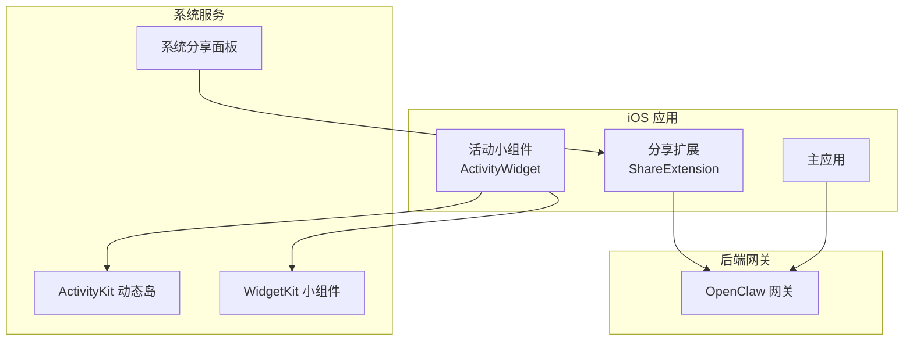
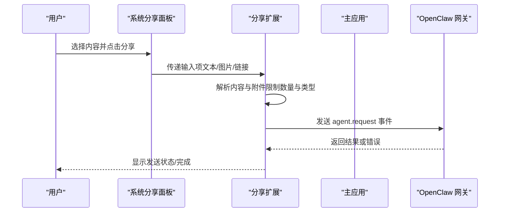
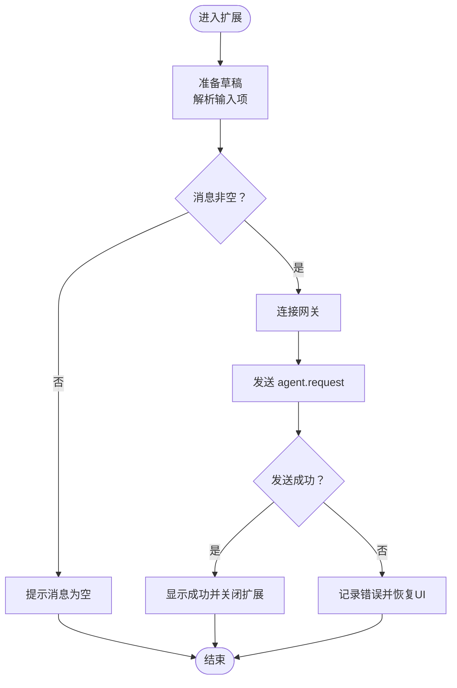
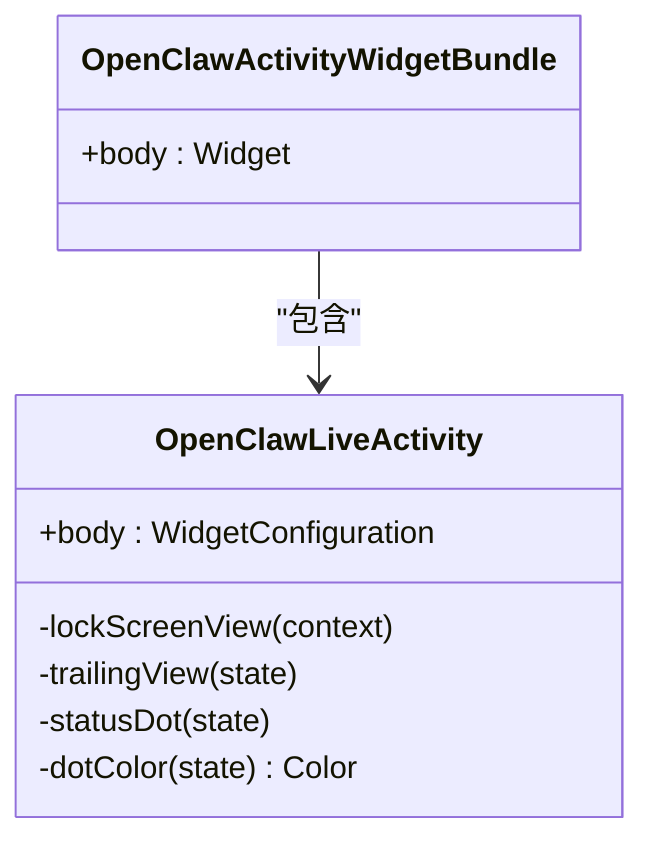
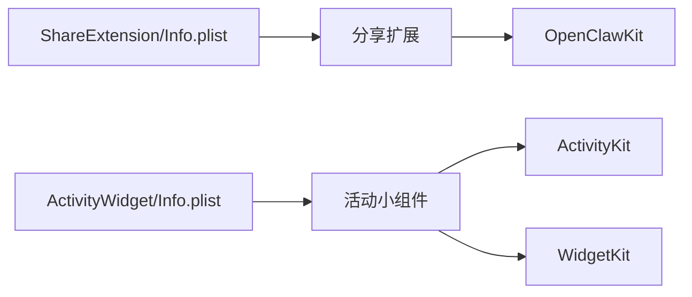

# 扩展功能

<cite>
**本文引用的文件**
- [ShareExtension/Info.plist](file://apps/ios/ShareExtension/Info.plist)
- [ShareViewController.swift](file://apps/ios/ShareExtension/ShareViewController.swift)
- [ActivityWidget/Info.plist](file://apps/ios/ActivityWidget/Info.plist)
- [OpenClawActivityWidgetBundle.swift](file://apps/ios/ActivityWidget/OpenClawActivityWidgetBundle.swift)
- [OpenClawLiveActivity.swift](file://apps/ios/ActivityWidget/OpenClawLiveActivity.swift)
- [fastlane/Fastfile](file://apps/ios/fastlane/Fastfile)
- [fastlane/Appfile](file://apps/ios/fastlane/Appfile)
- [fastlane/metadata/README.md](file://apps/ios/fastlane/metadata/README.md)
- [apps/ios/README.md](file://apps/ios/README.md)
</cite>

## 目录

1. [简介](#简介)
2. [项目结构](#项目结构)
3. [核心组件](#核心组件)
4. [架构总览](#架构总览)
5. [详细组件分析](#详细组件分析)
6. [依赖关系分析](#依赖关系分析)
7. [性能考量](#性能考量)
8. [故障排查指南](#故障排查指南)
9. [结论](#结论)
10. [附录](#附录)

## 简介

本文件聚焦于iOS节点扩展能力，系统性介绍“分享扩展”与“活动小组件（Live Activity）”的实现与使用方法，并覆盖安装、配置、权限管理、Fastlane自动化部署、App Store元数据管理与发布策略，以及开发与最佳实践建议。当前仓库中的iOS子工程提供了分享扩展与活动小组件的基础实现，配合应用主工程通过网关进行消息转发与状态展示。

## 项目结构

iOS扩展相关代码位于apps/ios目录下，主要包含：

- 分享扩展：ShareExtension，负责从系统分享面板收集内容并转发到网关
- 活动小组件：ActivityWidget，负责在锁屏/动态岛展示连接状态与运行时信息
- Fastlane自动化：用于构建、上传测试版本与管理App Store元数据
- iOS工程说明：包含本地部署、签名、权限与调试要点

图表来源

- [ShareExtension/Info.plist:23-43](file://apps/ios/ShareExtension/Info.plist#L23-L43)
- [ActivityWidget/Info.plist:23-31](file://apps/ios/ActivityWidget/Info.plist#L23-L31)
- [OpenClawActivityWidgetBundle.swift:4-9](file://apps/ios/ActivityWidget/OpenClawActivityWidgetBundle.swift#L4-L9)
- [OpenClawLiveActivity.swift:5-33](file://apps/ios/ActivityWidget/OpenClawLiveActivity.swift#L5-L33)

章节来源

- [apps/ios/README.md:1-142](file://apps/ios/README.md#L1-L142)

## 核心组件

- 分享扩展（Share Extension）
  - 负责从系统分享面板接收图片、视频、文本、链接等资源，生成草稿并发送至网关
  - 支持最多10张图片与1部视频的批量选择
  - 发送前会校验消息是否为空，失败时显示错误状态
- 活动小组件（Live Activity）
  - 在锁屏与动态岛展示连接状态、颜色指示与时间计数
  - 提供紧凑/展开视图，支持最小化显示
  - 与系统ActivityKit集成，实时反映连接状态变化

章节来源

- [ShareExtension/Info.plist:27-37](file://apps/ios/ShareExtension/Info.plist#L27-L37)
- [ShareViewController.swift:84-108](file://apps/ios/ShareExtension/ShareViewController.swift#L84-L108)
- [ActivityWidget/Info.plist:28-29](file://apps/ios/ActivityWidget/Info.plist#L28-L29)
- [OpenClawLiveActivity.swift:5-33](file://apps/ios/ActivityWidget/OpenClawLiveActivity.swift#L5-L33)

## 架构总览

分享扩展与活动小组件均通过主应用与网关进行交互，形成“本地采集—扩展处理—网关转发—状态反馈”的闭环。

图表来源

- [ShareViewController.swift:157-275](file://apps/ios/ShareExtension/ShareViewController.swift#L157-L275)
- [ShareExtension/Info.plist:27-37](file://apps/ios/ShareExtension/Info.plist#L27-L37)

## 详细组件分析

### 分享扩展（ShareViewController）

- 视图与交互
  - 初始化草稿文本框、发送与取消按钮，设置推荐尺寸
  - 首次出现时异步准备草稿，解析标题、文本、URL与图片附件
- 内容提取
  - 支持图片（最多3个）、视频、URL、纯文本
  - 图片压缩至最大5MB，转换为JPEG Base64
  - 过滤系统自带的冗余提示文本
- 发送流程
  - 校验消息非空；加载网关配置并建立会话
  - 发送 node.event(agent.request) 请求，等待响应
  - 成功后自动关闭扩展，失败则回退UI并记录日志
- 错误处理
  - 网关连接参数兼容旧版客户端ID，必要时重试
  - 对无效网关URL、空消息、编码失败等情况给出明确提示

图表来源

- [ShareViewController.swift:121-155](file://apps/ios/ShareExtension/ShareViewController.swift#L121-L155)
- [ShareViewController.swift:157-275](file://apps/ios/ShareExtension/ShareViewController.swift#L157-L275)

章节来源

- [ShareViewController.swift:29-108](file://apps/ios/ShareExtension/ShareViewController.swift#L29-L108)
- [ShareViewController.swift:361-418](file://apps/ios/ShareExtension/ShareViewController.swift#L361-L418)
- [ShareViewController.swift:420-461](file://apps/ios/ShareExtension/ShareViewController.swift#L420-L461)
- [ShareViewController.swift:463-499](file://apps/ios/ShareExtension/ShareViewController.swift#L463-L499)
- [ShareViewController.swift:501-547](file://apps/ios/ShareExtension/ShareViewController.swift#L501-L547)

### 活动小组件（Live Activity）

- 组件定义
  - 使用 WidgetBundle 暴露 OpenClawLiveActivity
  - 通过 ActivityConfiguration 配置锁屏与动态岛视图
- 视图逻辑
  - 锁屏视图：左侧状态点、中间标题与状态文本、右侧根据状态显示进度或图标或计时
  - 动态岛：展开区域显示状态文本与尾部计时；紧凑/最小化仅显示状态点
  - 状态点颜色：断开（红）、连接中（灰）、空闲（绿）、活跃（蓝）

图表来源

- [OpenClawActivityWidgetBundle.swift:4-9](file://apps/ios/ActivityWidget/OpenClawActivityWidgetBundle.swift#L4-L9)
- [OpenClawLiveActivity.swift:5-33](file://apps/ios/ActivityWidget/OpenClawLiveActivity.swift#L5-L33)
- [OpenClawLiveActivity.swift:35-84](file://apps/ios/ActivityWidget/OpenClawLiveActivity.swift#L35-L84)

章节来源

- [ActivityWidget/Info.plist:23-31](file://apps/ios/ActivityWidget/Info.plist#L23-L31)
- [OpenClawActivityWidgetBundle.swift:4-9](file://apps/ios/ActivityWidget/OpenClawActivityWidgetBundle.swift#L4-L9)
- [OpenClawLiveActivity.swift:5-33](file://apps/ios/ActivityWidget/OpenClawLiveActivity.swift#L5-L33)
- [OpenClawLiveActivity.swift:35-84](file://apps/ios/ActivityWidget/OpenClawLiveActivity.swift#L35-L84)

## 依赖关系分析

- 分享扩展依赖
  - OpenClawKit：提供网关会话与节点事件调用能力
  - 系统框架：UIKit、UniformTypeIdentifiers、ActivityKit（小组件）
- 配置与清单
  - ShareExtension/Info.plist：声明扩展激活规则（支持图片/视频/文本/链接）
  - ActivityWidget/Info.plist：声明扩展点为 widgetkit-extension，启用 Live Activities

图表来源

- [ShareExtension/Info.plist:23-43](file://apps/ios/ShareExtension/Info.plist#L23-L43)
- [ActivityWidget/Info.plist:23-31](file://apps/ios/ActivityWidget/Info.plist#L23-L31)

章节来源

- [ShareExtension/Info.plist:23-43](file://apps/ios/ShareExtension/Info.plist#L23-L43)
- [ActivityWidget/Info.plist:23-31](file://apps/ios/ActivityWidget/Info.plist#L23-L31)

## 性能考量

- 图片处理
  - 限制图片数量与大小，避免超大附件导致发送失败或内存压力
- 网络与会话
  - 建立一次性会话用于发送请求，完成后及时断开，降低资源占用
- UI线程
  - 所有UI更新在主线程执行，保证流畅与一致性

章节来源

- [ShareViewController.swift:376-398](file://apps/ios/ShareExtension/ShareViewController.swift#L376-L398)
- [ShareViewController.swift:450-461](file://apps/ios/ShareExtension/ShareViewController.swift#L450-L461)
- [ShareViewController.swift:171-174](file://apps/ios/ShareExtension/ShareViewController.swift#L171-L174)

## 故障排查指南

- 分享扩展无法发送
  - 检查网关配置是否存在、URL与凭据是否有效
  - 查看扩展状态提示与日志输出（子系统 ai.openclaw.ios）
- 活动小组件不显示或状态异常
  - 确认已启用 Live Activities 并正确注册 Activity
  - 检查动态岛/锁屏权限与小组件授权
- 本地部署与签名
  - 使用脚本生成Xcode工程并确保团队/证书/推送能力配置正确
  - 若个人团队签名失败，可参考本地签名配置示例

章节来源

- [apps/ios/README.md:53-61](file://apps/ios/README.md#L53-L61)
- [apps/ios/README.md:120-142](file://apps/ios/README.md#L120-L142)

## 结论

分享扩展与活动小组件为iOS节点提供了便捷的内容转发入口与状态可视化能力。通过清晰的输入解析、严格的附件限制与稳健的错误处理，扩展能够在不同场景下稳定工作。结合Fastlane自动化与App Store元数据管理，可进一步提升发布效率与合规性。

## 附录

### 安装与配置

- 分享扩展
  - 在Info.plist中声明了对图片、视频、文本、链接的支持
  - 通过扩展入口接收内容并调用网关事件
- 活动小组件
  - 在Info.plist中声明扩展点为widgetkit-extension并启用Live Activities
  - 通过OpenClawLiveActivity渲染锁屏与动态岛视图

章节来源

- [ShareExtension/Info.plist:27-37](file://apps/ios/ShareExtension/Info.plist#L27-L37)
- [ActivityWidget/Info.plist:23-31](file://apps/ios/ActivityWidget/Info.plist#L23-L31)
- [OpenClawActivityWidgetBundle.swift:4-9](file://apps/ios/ActivityWidget/OpenClawActivityWidgetBundle.swift#L4-L9)
- [OpenClawLiveActivity.swift:5-33](file://apps/ios/ActivityWidget/OpenClawLiveActivity.swift#L5-L33)

### 权限管理

- 推送通知（APNs）
  - 主应用启动时注册远程通知，网关连接后进行APNs注册
  - 开发/生产环境由entitlements与构建配置决定
- 位置权限
  - 后台位置需要“始终允许”，以支持移动事件触发自动化

章节来源

- [apps/ios/README.md:53-61](file://apps/ios/README.md#L53-L61)
- [apps/ios/README.md:80-94](file://apps/ios/README.md#L80-L94)

### Fastlane自动化部署

- 测试分发（TestFlight）
  - 通过beta lane构建并上传至TestFlight，支持从Keychain加载App Store Connect密钥
- App Store元数据
  - 使用metadata lane上传文本与截图，支持从Keychain或文件路径加载密钥
- 认证检查
  - 提供auth_check lane验证认证配置是否正确

章节来源

- [fastlane/Fastfile:87-167](file://apps/ios/fastlane/Fastfile#L87-L167)
- [fastlane/Fastfile:169-193](file://apps/ios/fastlane/Fastfile#L169-L193)
- [fastlane/Fastfile:195-200](file://apps/ios/fastlane/Fastfile#L195-L200)
- [fastlane/Appfile:1-16](file://apps/ios/fastlane/Appfile#L1-L16)
- [fastlane/metadata/README.md:1-48](file://apps/ios/fastlane/metadata/README.md#L1-L48)

### 发布策略与最佳实践

- 版本与标识
  - 扩展Info.plist中包含版本号与短版本字符串，便于App Store与内部追踪
- 兼容性
  - 分享扩展支持多类型输入，图片默认转JPEG并控制大小
- 可靠性
  - 发送前校验消息非空；连接失败时尝试兼容旧版客户端ID
- 可观测性
  - 使用统一子系统日志，便于过滤与定位问题

章节来源

- [ShareExtension/Info.plist:19-22](file://apps/ios/ShareExtension/Info.plist#L19-L22)
- [ActivityWidget/Info.plist:19-22](file://apps/ios/ActivityWidget/Info.plist#L19-L22)
- [ShareViewController.swift:121-155](file://apps/ios/ShareExtension/ShareViewController.swift#L121-L155)
- [ShareViewController.swift:277-296](file://apps/ios/ShareExtension/ShareViewController.swift#L277-L296)
