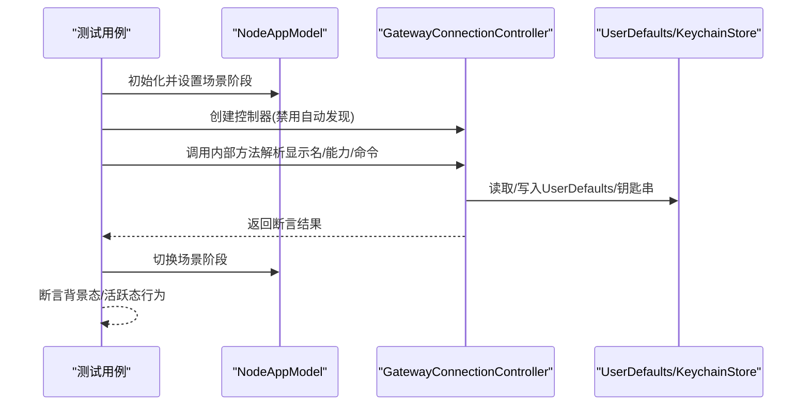
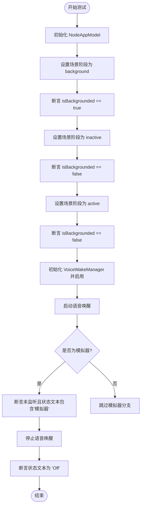
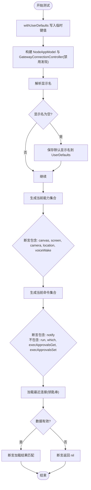
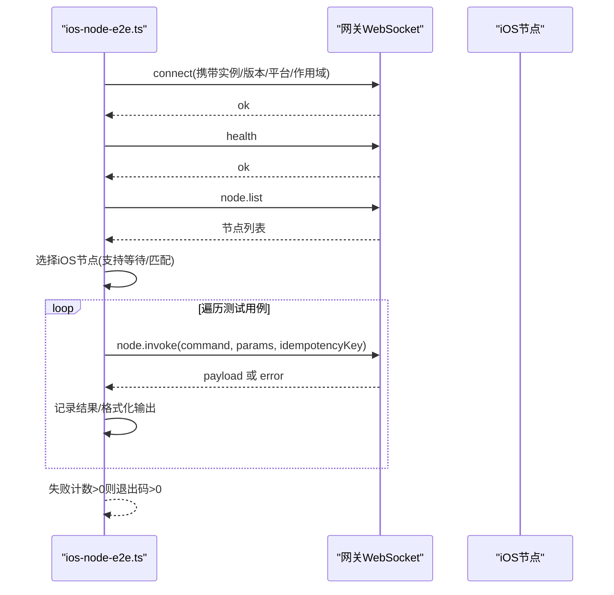
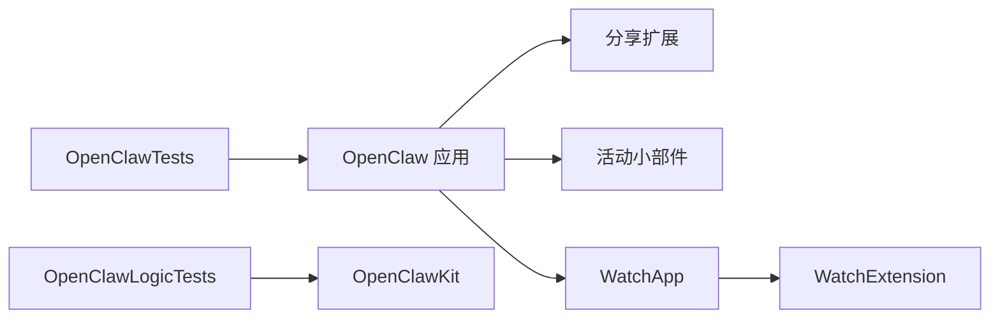

# 测试与调试

<cite>
**本文引用的文件**
- [apps/ios/project.yml](file://apps/ios/project.yml)
- [apps/ios/Signing.xcconfig](file://apps/ios/Signing.xcconfig)
- [apps/ios/Tests/AppCoverageTests.swift](file://apps/ios/Tests/AppCoverageTests.swift)
- [apps/ios/Tests/GatewayConnectionControllerTests.swift](file://apps/ios/Tests/GatewayConnectionControllerTests.swift)
- [apps/ios/Tests/TestDefaultsSupport.swift](file://apps/ios/Tests/TestDefaultsSupport.swift)
- [scripts/dev/ios-node-e2e.ts](file://scripts/dev/ios-node-e2e.ts)
</cite>

## 目录

1. [简介](#简介)
2. [项目结构](#项目结构)
3. [核心组件](#核心组件)
4. [架构总览](#架构总览)
5. [详细组件分析](#详细组件分析)
6. [依赖关系分析](#依赖关系分析)
7. [性能考量](#性能考量)
8. [故障排查指南](#故障排查指南)
9. [结论](#结论)
10. [附录](#附录)

## 简介

本文件面向iOS节点的测试与调试，覆盖测试策略、单元测试与集成测试方法，测试环境搭建（含模拟器与真机）、日志与性能监控，以及常见问题诊断与质量保障流程。文档以仓库中的Xcode工程配置、测试用例与端到端脚本为依据，帮助开发者在本地与CI中稳定地验证iOS节点的功能与行为。

## 项目结构

iOS节点位于 apps/ios 目录，采用 XcodeGen 工程定义（project.yml），包含应用主体、扩展、测试套件与签名配置。测试分为两类：

- 应用层单元测试：OpenClawTests（覆盖UI、状态、权限、网关连接等）
- 逻辑层单元测试：OpenClawLogicTests（聚焦OpenClawKit逻辑）

```mermaid
graph TB
subgraph "iOS 工程"
A["OpenClaw 应用"]
B["分享扩展"]
C["活动小部件"]
D["WatchApp"]
E["WatchExtension"]
T1["OpenClawTests 单元测试"]
T2["OpenClawLogicTests 单元测试"]
end
A --- B
A --- C
A --- D
D --- E
A -. 依赖 .-> T1
A -. 依赖 .-> T2
T2 -. 依赖 .->|"OpenClawKit"| A
```

图表来源

- [apps/ios/project.yml:38-324](file://apps/ios/project.yml#L38-L324)

章节来源

- [apps/ios/project.yml:1-324](file://apps/ios/project.yml#L1-L324)

## 核心组件

- 测试目标与分层
  - OpenClawTests：应用层测试，覆盖场景切换、语音唤醒（模拟器行为）、网关发现与连接、设置存储、命令能力集合等。
  - OpenClawLogicTests：逻辑层测试，聚焦OpenClawKit相关逻辑（如Talk模式解析、增量缓冲等）。
- 测试运行与并发
  - 部分测试使用序列化执行（@Suite(.serialized)），确保共享资源访问顺序性。
- 测试辅助
  - TestDefaultsSupport 提供临时写入 UserDefaults 的工具函数，便于隔离与回滚测试状态。

章节来源

- [apps/ios/project.yml:19-37](file://apps/ios/project.yml#L19-L37)
- [apps/ios/project.yml:266-324](file://apps/ios/project.yml#L266-L324)
- [apps/ios/Tests/TestDefaultsSupport.swift:1-27](file://apps/ios/Tests/TestDefaultsSupport.swift#L1-L27)

## 架构总览

iOS节点通过OpenClawKit与网关通信，遵循能力(capabilities)与命令(command)协议。测试围绕以下关键路径展开：

- 能力与命令生成：根据用户偏好与权限动态决定暴露的能力与命令集合。
- 网关连接与发现：解析显示名、加载上次连接、校验数据有效性。
- 语音唤醒：在模拟器上报告不支持，在真机上进行启动/停止与状态断言。
- 设置存储：UserDefaults与钥匙串的读写一致性与迁移。



图表来源

- [apps/ios/Tests/GatewayConnectionControllerTests.swift:1-117](file://apps/ios/Tests/GatewayConnectionControllerTests.swift#L1-L117)
- [apps/ios/Tests/AppCoverageTests.swift:1-32](file://apps/ios/Tests/AppCoverageTests.swift#L1-L32)

## 详细组件分析

### 组件A：应用覆盖率与场景状态测试

- 覆盖点
  - 场景阶段对后台态标记的影响。
  - 模拟器下语音唤醒的不支持行为与状态文本断言。
- 关键流程
  - 初始化NodeAppModel，设置scenePhase为background/inactive/active，断言isBackgrounded状态。
  - 初始化VoiceWakeManager，启用后启动，断言未进入监听且状态文本包含“Simulator”提示；随后stop并断言状态重置为“Off”。



图表来源

- [apps/ios/Tests/AppCoverageTests.swift:5-31](file://apps/ios/Tests/AppCoverageTests.swift#L5-L31)

章节来源

- [apps/ios/Tests/AppCoverageTests.swift:1-32](file://apps/ios/Tests/AppCoverageTests.swift#L1-L32)

### 组件B：网关连接控制器测试

- 覆盖点
  - 显示名解析：当缺失时设置默认值并持久化。
  - 能力集合：根据相机、位置、语音唤醒等开关生成集合。
  - 命令集合：包含通知命令，排除系统危险命令（如exec、which、审批管理）。
  - 最近连接：从钥匙串加载手动连接信息；无效数据应返回nil。
- 关键流程
  - 使用withUserDefaults临时注入键值，构造NodeAppModel与GatewayConnectionController。
  - 调用内部方法解析显示名、当前能力与命令，断言集合包含/不包含特定项。
  - 对最近连接加载进行正向与负向（无效数据）测试。



图表来源

- [apps/ios/Tests/GatewayConnectionControllerTests.swift:7-116](file://apps/ios/Tests/GatewayConnectionControllerTests.swift#L7-L116)
- [apps/ios/Tests/TestDefaultsSupport.swift:3-26](file://apps/ios/Tests/TestDefaultsSupport.swift#L3-L26)

章节来源

- [apps/ios/Tests/GatewayConnectionControllerTests.swift:1-117](file://apps/ios/Tests/GatewayConnectionControllerTests.swift#L1-L117)
- [apps/ios/Tests/TestDefaultsSupport.swift:1-27](file://apps/ios/Tests/TestDefaultsSupport.swift#L1-L27)

### 组件C：端到端集成测试（Node E2E）

- 目标
  - 在真实网关环境下，对iOS节点执行设备信息、通知、联系人、日历、提醒、运动计数、相册、拍照、录屏等命令的端到端验证。
- 关键流程
  - 连接网关、健康检查、列举节点、选择iOS节点（可带前缀/名称匹配或等待）。
  - 依次调用node.invoke，记录成功/失败与错误信息。
  - 可按需过滤危险命令（如拍照、录屏），并支持JSON输出。



图表来源

- [scripts/dev/ios-node-e2e.ts:84-284](file://scripts/dev/ios-node-e2e.ts#L84-L284)

章节来源

- [scripts/dev/ios-node-e2e.ts:1-284](file://scripts/dev/ios-node-e2e.ts#L1-L284)

## 依赖关系分析

- 工程与目标
  - OpenClaw 应用依赖 OpenClawShareExtension、OpenClawActivityWidget、OpenClawWatchApp/WachExtension。
  - 测试目标依赖应用或OpenClawKit逻辑包，确保逻辑层独立验证。
- 签名与配置
  - Signing.xcconfig 提供bundle ID与Provisioning Profile的默认值，支持本地覆盖文件叠加。
- 并发与严格并发
  - 工程开启Swift严格并发，测试目标同样启用，有助于捕获竞态与线程安全问题。



图表来源

- [apps/ios/project.yml:38-324](file://apps/ios/project.yml#L38-L324)

章节来源

- [apps/ios/project.yml:1-324](file://apps/ios/project.yml#L1-L324)
- [apps/ios/Signing.xcconfig:1-21](file://apps/ios/Signing.xcconfig#L1-L21)

## 性能考量

- 测试并发
  - 部分测试使用@Suite(.serialized)以避免共享资源竞争，但可能延长整体测试时间。建议仅对确有共享状态的目标使用序列化。
- 模拟器与真机差异
  - 语音唤醒在模拟器上不支持，测试中应明确区分并避免在模拟器上执行耗时操作（如拍照/录屏）。
- 日志与可观测性
  - 建议在测试中输出关键步骤与参数，便于定位失败原因；端到端脚本已提供JSON输出选项。

## 故障排查指南

- 测试失败定位
  - 使用TestDefaultsSupport临时注入键值，缩小问题范围；测试结束后自动回滚。
  - 对网关连接类测试，优先检查UserDefaults与钥匙串的读写路径，确认数据迁移与校验逻辑。
- 端到端失败
  - 确认网关连接参数与令牌正确；若无iOS节点在线，脚本会等待指定秒数后失败，可调整--wait-seconds。
  - 对危险命令（如camera.snap、screen.record）失败，优先检查设备权限与安全限制。
- 日志与输出
  - 端到端脚本支持--json输出，便于自动化收集与分析；同时提供表格化输出，快速查看各命令执行结果。

章节来源

- [apps/ios/Tests/TestDefaultsSupport.swift:1-27](file://apps/ios/Tests/TestDefaultsSupport.swift#L1-L27)
- [scripts/dev/ios-node-e2e.ts:133-149](file://scripts/dev/ios-node-e2e.ts#L133-L149)
- [scripts/dev/ios-node-e2e.ts:237-273](file://scripts/dev/ios-node-e2e.ts#L237-L273)

## 结论

本项目的iOS节点测试体系由应用层与逻辑层单元测试构成，并辅以端到端脚本验证真实网关交互。通过工程化的签名配置、严格的并发设置与清晰的测试辅助工具，能够稳定地在本地与CI环境中进行验证。建议持续完善测试覆盖面，结合端到端脚本与日志输出，形成闭环的质量保障流程。

## 附录

- 测试环境搭建要点
  - 使用XcodeGen生成工程，确保Swift 6与iOS 18+部署目标。
  - 配置Signing.xcconfig中的开发团队与Provisioning Profile，必要时在本地覆盖文件中补充。
  - 在模拟器上运行单元测试；需要真机功能（如相机/录屏）时，切换至真机并授予相应权限。
- 质量保证流程建议
  - 单元测试：保持高覆盖率，关注边界条件与异常路径。
  - 集成测试：定期运行端到端脚本，记录失败并建立回归基线。
  - 日志与监控：统一输出格式，保留关键上下文（命令、参数、时间戳）。
  - 回归与发布：在合并前强制运行全部测试套件，避免引入新问题。
