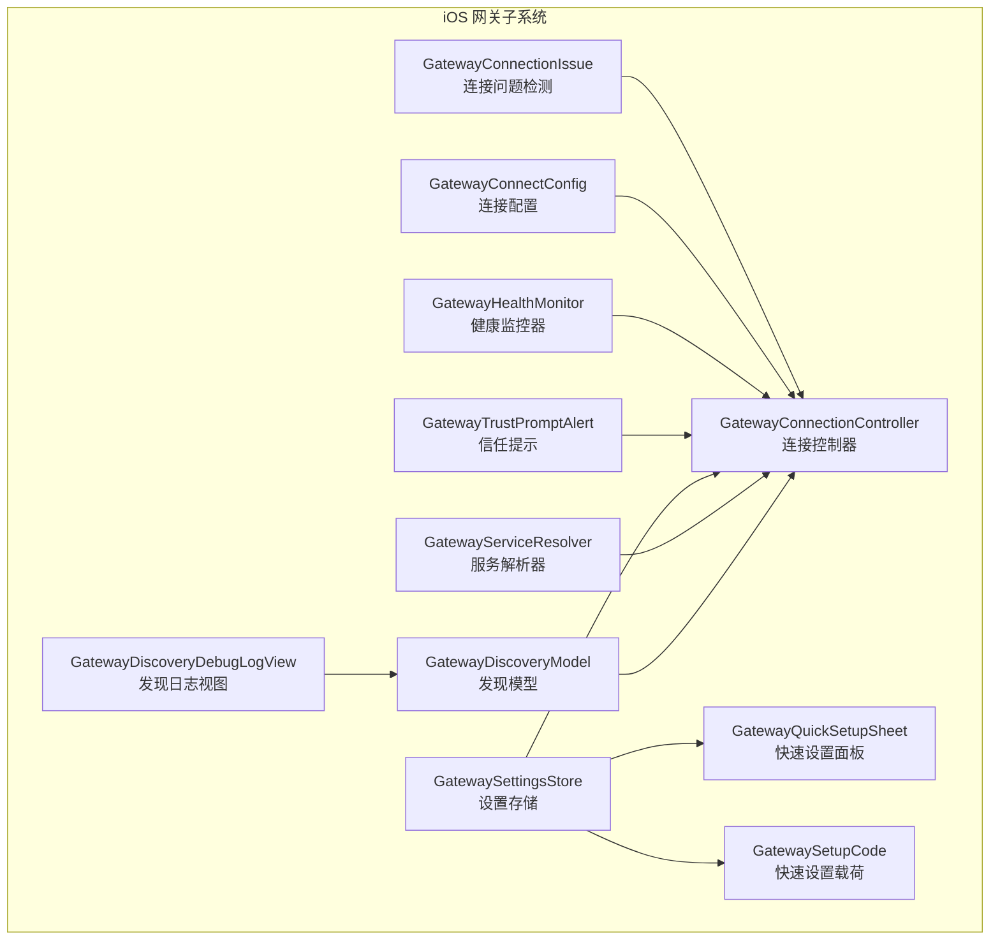
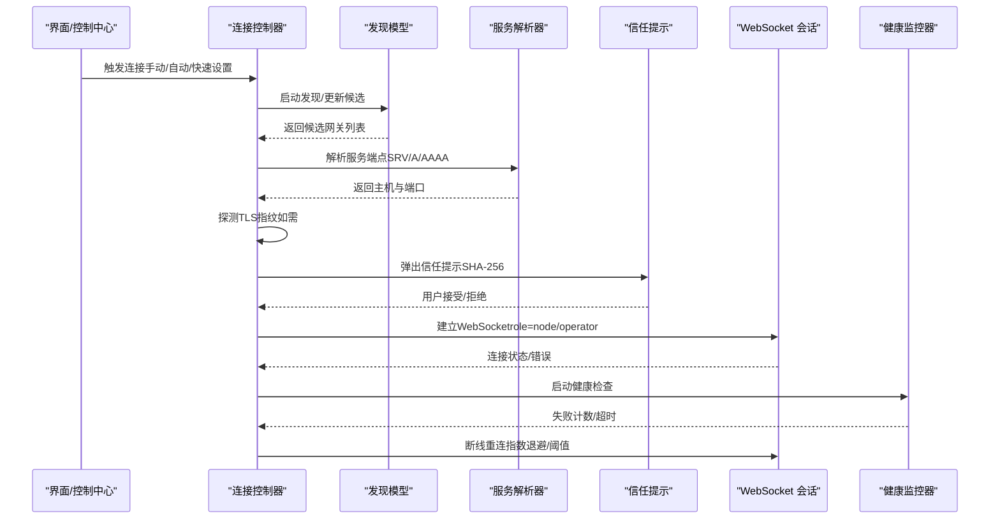
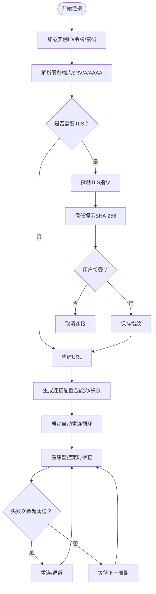
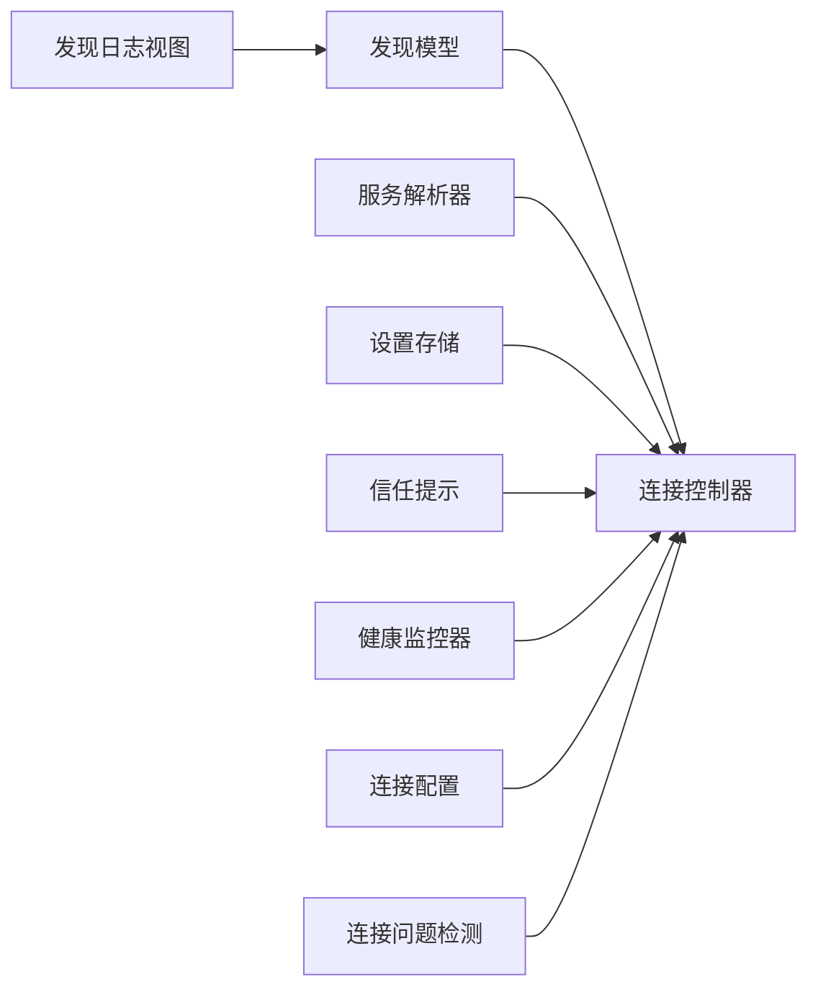

# 网关通信

<cite>
**本文引用的文件**
- [apps/ios/Sources/Gateway/GatewayConnectionController.swift](file://apps/ios/Sources/Gateway/GatewayConnectionController.swift)
- [apps/ios/Sources/Gateway/GatewayDiscoveryModel.swift](file://apps/ios/Sources/Gateway/GatewayDiscoveryModel.swift)
- [apps/ios/Sources/Gateway/GatewayServiceResolver.swift](file://apps/ios/Sources/Gateway/GatewayServiceResolver.swift)
- [apps/ios/Sources/Gateway/GatewayHealthMonitor.swift](file://apps/ios/Sources/Gateway/GatewayHealthMonitor.swift)
- [apps/ios/Sources/Gateway/GatewayConnectConfig.swift](file://apps/ios/Sources/Gateway/GatewayConnectConfig.swift)
- [apps/ios/Sources/Gateway/GatewaySettingsStore.swift](file://apps/ios/Sources/Gateway/GatewaySettingsStore.swift)
- [apps/ios/Sources/Gateway/GatewayTrustPromptAlert.swift](file://apps/ios/Sources/Gateway/GatewayTrustPromptAlert.swift)
- [apps/ios/Sources/Gateway/GatewaySetupCode.swift](file://apps/ios/Sources/Gateway/GatewaySetupCode.swift)
- [apps/ios/Sources/Gateway/GatewayQuickSetupSheet.swift](file://apps/ios/Sources/Gateway/GatewayQuickSetupSheet.swift)
- [apps/ios/Sources/Gateway/GatewayConnectionIssue.swift](file://apps/ios/Sources/Gateway/GatewayConnectionIssue.swift)
- [apps/ios/Sources/Gateway/GatewayDiscoveryDebugLogView.swift](file://apps/ios/Sources/Gateway/GatewayDiscoveryDebugLogView.swift)
</cite>

## 目录

1. [简介](#简介)
2. [项目结构](#项目结构)
3. [核心组件](#核心组件)
4. [架构总览](#架构总览)
5. [详细组件分析](#详细组件分析)
6. [依赖关系分析](#依赖关系分析)
7. [性能考虑](#性能考虑)
8. [故障排查指南](#故障排查指南)
9. [结论](#结论)
10. [附录](#附录)

## 简介

本文件面向iOS节点与OpenClaw网关的通信实现，系统性阐述连接建立、身份验证与安全通信机制；覆盖WebSocket连接管理、心跳检测与断线重连策略；包含网关发现、信任管理与配置同步；并给出聊天传输、消息路由与状态同步的技术实现要点。内容基于iOS应用层源码进行归纳总结，帮助开发者快速理解并维护该模块。

## 项目结构

iOS侧网关通信相关代码集中在apps/ios/Sources/Gateway目录，围绕“发现—解析—信任—连接—健康监测—重连”的闭环展开，并通过设置存储与诊断日志完善用户体验与可运维性。

**图表来源**

- [apps/ios/Sources/Gateway/GatewayConnectionController.swift:20-800](file://apps/ios/Sources/Gateway/GatewayConnectionController.swift#L20-L800)
- [apps/ios/Sources/Gateway/GatewayDiscoveryModel.swift:6-182](file://apps/ios/Sources/Gateway/GatewayDiscoveryModel.swift#L6-L182)
- [apps/ios/Sources/Gateway/GatewayServiceResolver.swift:1-53](file://apps/ios/Sources/Gateway/GatewayServiceResolver.swift#L1-L53)
- [apps/ios/Sources/Gateway/GatewayHealthMonitor.swift:4-86](file://apps/ios/Sources/Gateway/GatewayHealthMonitor.swift#L4-L86)
- [apps/ios/Sources/Gateway/GatewayConnectConfig.swift:1-28](file://apps/ios/Sources/Gateway/GatewayConnectConfig.swift#L1-L28)
- [apps/ios/Sources/Gateway/GatewaySettingsStore.swift:1-520](file://apps/ios/Sources/Gateway/GatewaySettingsStore.swift#L1-L520)
- [apps/ios/Sources/Gateway/GatewayTrustPromptAlert.swift:1-42](file://apps/ios/Sources/Gateway/GatewayTrustPromptAlert.swift#L1-L42)
- [apps/ios/Sources/Gateway/GatewaySetupCode.swift:1-43](file://apps/ios/Sources/Gateway/GatewaySetupCode.swift#L1-L43)
- [apps/ios/Sources/Gateway/GatewayQuickSetupSheet.swift:1-114](file://apps/ios/Sources/Gateway/GatewayQuickSetupSheet.swift#L1-L114)
- [apps/ios/Sources/Gateway/GatewayConnectionIssue.swift:1-72](file://apps/ios/Sources/Gateway/GatewayConnectionIssue.swift#L1-L72)
- [apps/ios/Sources/Gateway/GatewayDiscoveryDebugLogView.swift:1-69](file://apps/ios/Sources/Gateway/GatewayDiscoveryDebugLogView.swift#L1-L69)

**章节来源**

- [apps/ios/Sources/Gateway/GatewayConnectionController.swift:20-800](file://apps/ios/Sources/Gateway/GatewayConnectionController.swift#L20-L800)
- [apps/ios/Sources/Gateway/GatewayDiscoveryModel.swift:6-182](file://apps/ios/Sources/Gateway/GatewayDiscoveryModel.swift#L6-L182)

## 核心组件

- 连接控制器：负责发现、解析、信任提示、连接发起、自动重连与能力/权限注入等。
- 发现模型：基于Bonjour扫描网关，解析TXT记录，聚合结果并输出稳定ID与端口信息。
- 服务解析器：独立解析SRV/A/AAAA，避免仅凭TXT进行路由。
- 健康监控器：周期性检查连接健康，超时失败计数触发处理。
- 连接配置：统一承载URL、TLS参数、令牌/密码、节点选项等。
- 设置存储：实例ID、令牌/密码、上次连接、客户端ID覆盖、选中代理等持久化。
- 信任提示：首次TLS指纹校验弹窗，支持用户接受或拒绝。
- 快速设置：一键连接候选网关，展示状态与错误。
- 连接问题检测：从状态文本推断未配对、网络异常等常见问题。
- 发现日志视图：可视化展示发现过程与调试信息。

**章节来源**

- [apps/ios/Sources/Gateway/GatewayConnectionController.swift:20-800](file://apps/ios/Sources/Gateway/GatewayConnectionController.swift#L20-L800)
- [apps/ios/Sources/Gateway/GatewayDiscoveryModel.swift:6-182](file://apps/ios/Sources/Gateway/GatewayDiscoveryModel.swift#L6-L182)
- [apps/ios/Sources/Gateway/GatewayServiceResolver.swift:1-53](file://apps/ios/Sources/Gateway/GatewayServiceResolver.swift#L1-L53)
- [apps/ios/Sources/Gateway/GatewayHealthMonitor.swift:4-86](file://apps/ios/Sources/Gateway/GatewayHealthMonitor.swift#L4-L86)
- [apps/ios/Sources/Gateway/GatewayConnectConfig.swift:1-28](file://apps/ios/Sources/Gateway/GatewayConnectConfig.swift#L1-L28)
- [apps/ios/Sources/Gateway/GatewaySettingsStore.swift:1-520](file://apps/ios/Sources/Gateway/GatewaySettingsStore.swift#L1-L520)
- [apps/ios/Sources/Gateway/GatewayTrustPromptAlert.swift:1-42](file://apps/ios/Sources/Gateway/GatewayTrustPromptAlert.swift#L1-L42)
- [apps/ios/Sources/Gateway/GatewaySetupCode.swift:1-43](file://apps/ios/Sources/Gateway/GatewaySetupCode.swift#L1-L43)
- [apps/ios/Sources/Gateway/GatewayQuickSetupSheet.swift:1-114](file://apps/ios/Sources/Gateway/GatewayQuickSetupSheet.swift#L1-L114)
- [apps/ios/Sources/Gateway/GatewayConnectionIssue.swift:1-72](file://apps/ios/Sources/Gateway/GatewayConnectionIssue.swift#L1-L72)
- [apps/ios/Sources/Gateway/GatewayDiscoveryDebugLogView.swift:1-69](file://apps/ios/Sources/Gateway/GatewayDiscoveryDebugLogView.swift#L1-L69)

## 架构总览

下图展示iOS节点到网关的端到端流程：Bonjour发现→服务解析→TLS指纹探测→信任确认→WebSocket连接（双会话）→健康监测→断线重连。

**图表来源**

- [apps/ios/Sources/Gateway/GatewayConnectionController.swift:90-470](file://apps/ios/Sources/Gateway/GatewayConnectionController.swift#L90-L470)
- [apps/ios/Sources/Gateway/GatewayDiscoveryModel.swift:51-100](file://apps/ios/Sources/Gateway/GatewayDiscoveryModel.swift#L51-L100)
- [apps/ios/Sources/Gateway/GatewayServiceResolver.swift:23-47](file://apps/ios/Sources/Gateway/GatewayServiceResolver.swift#L23-L47)
- [apps/ios/Sources/Gateway/GatewayTrustPromptAlert.swift:16-34](file://apps/ios/Sources/Gateway/GatewayTrustPromptAlert.swift#L16-L34)
- [apps/ios/Sources/Gateway/GatewayHealthMonitor.swift:26-57](file://apps/ios/Sources/Gateway/GatewayHealthMonitor.swift#L26-L57)

## 详细组件分析

### 组件一：连接控制器（GatewayConnectionController）

职责与特性

- 发现与观察：启动/停止Bonjour发现，监听变更并更新候选网关。
- 自动连接策略：根据偏好/上次连接/单候选等条件自动尝试连接；仅在已信任的TLS指纹前提下自动连接。
- 手动/快速连接：支持手动输入主机/端口/TLS，或从快速设置面板一键连接。
- 信任管理：首次TLS连接时探测指纹，弹窗提示用户确认；接受后保存指纹并继续连接。
- 双会话设计：为节点能力与操作者聊天分别建立WebSocket会话，参数均来自统一配置。
- 能力/权限注入：将当前设备能力、命令与权限打包进连接选项，动态刷新以适配设置变化。
- 场景生命周期：应用进入后台暂停发现，回到前台恢复发现并尝试自动重连。

关键流程示意

**图表来源**

- [apps/ios/Sources/Gateway/GatewayConnectionController.swift:90-470](file://apps/ios/Sources/Gateway/GatewayConnectionController.swift#L90-L470)

**章节来源**

- [apps/ios/Sources/Gateway/GatewayConnectionController.swift:20-800](file://apps/ios/Sources/Gateway/GatewayConnectionController.swift#L20-L800)

### 组件二：网关发现模型（GatewayDiscoveryModel）

职责与特性

- 多域浏览：遍历支持的服务域，使用NWBrowser扫描网关服务类型。
- 结果聚合：合并各域结果，去重排序，计算新增/移除事件。
- TXT解析：从TXT记录提取显示名、端口、TLS开关与指纹等元数据。
- 状态与日志：维护状态文本与调试日志，支持开启/关闭与容量限制。

**章节来源**

- [apps/ios/Sources/Gateway/GatewayDiscoveryModel.swift:6-182](file://apps/ios/Sources/Gateway/GatewayDiscoveryModel.swift#L6-L182)

### 组件三：服务解析器（GatewayServiceResolver）

职责与特性

- SRV/A/AAAA解析：通过NetService解析服务名称，获取主机与端口。
- 生命周期管理：确保在主线程调度，超时保护，完成一次即清理。

**章节来源**

- [apps/ios/Sources/Gateway/GatewayServiceResolver.swift:1-53](file://apps/ios/Sources/Gateway/GatewayServiceResolver.swift#L1-L53)

### 组件四：健康监控器（GatewayHealthMonitor）

职责与特性

- 定时检查：按间隔执行检查回调，支持超时包装。
- 失败计数：连续失败达到阈值触发外部回调，清零重来。
- 取消与睡眠：支持自定义sleep以适配测试或不同平台。

**章节来源**

- [apps/ios/Sources/Gateway/GatewayHealthMonitor.swift:4-86](file://apps/ios/Sources/Gateway/GatewayHealthMonitor.swift#L4-L86)

### 组件五：连接配置（GatewayConnectConfig）

职责与特性

- 单一真相源：统一承载URL、稳定ID、TLS参数、令牌/密码与节点选项。
- 会话分离：为节点角色与操作者角色分别建立会话，共享同一配置来源。

**章节来源**

- [apps/ios/Sources/Gateway/GatewayConnectConfig.swift:1-28](file://apps/ios/Sources/Gateway/GatewayConnectConfig.swift#L1-L28)

### 组件六：设置存储（GatewaySettingsStore）

职责与特性

- 持久化键空间：实例ID、首选/上次发现网关稳定ID、最近一次连接（手动/发现）、客户端ID覆盖、选中代理等。
- 凭据管理：网关令牌与密码按实例ID分账户存储于钥匙串。
- 迁移策略：首次访问将旧的UserDefaults迁移至单一钥匙串条目。
- 诊断日志：提供网关诊断日志的引导、写入、截断与保护。

**章节来源**

- [apps/ios/Sources/Gateway/GatewaySettingsStore.swift:1-520](file://apps/ios/Sources/Gateway/GatewaySettingsStore.swift#L1-L520)

### 组件七：信任提示与快速设置

- 信任提示：首次TLS连接弹窗展示指纹，用户选择接受/拒绝，接受后保存并继续连接。
- 快速设置：展示最佳候选网关，一键连接，显示发现/节点/操作者状态与错误信息。

**章节来源**

- [apps/ios/Sources/Gateway/GatewayTrustPromptAlert.swift:1-42](file://apps/ios/Sources/Gateway/GatewayTrustPromptAlert.swift#L1-L42)
- [apps/ios/Sources/Gateway/GatewayQuickSetupSheet.swift:1-114](file://apps/ios/Sources/Gateway/GatewayQuickSetupSheet.swift#L1-L114)

### 组件八：连接问题检测与发现日志

- 连接问题检测：从状态文本识别配对缺失、未授权、网络异常等场景。
- 发现日志视图：可复制调试日志，便于问题定位。

**章节来源**

- [apps/ios/Sources/Gateway/GatewayConnectionIssue.swift:1-72](file://apps/ios/Sources/Gateway/GatewayConnectionIssue.swift#L1-L72)
- [apps/ios/Sources/Gateway/GatewayDiscoveryDebugLogView.swift:1-69](file://apps/ios/Sources/Gateway/GatewayDiscoveryDebugLogView.swift#L1-L69)

### 组件九：快速设置载荷（GatewaySetupCode）

- 支持JSON与Base64(JSON)两种格式的快速设置载荷解码，用于导入URL、主机、端口、TLS、令牌与密码等。

**章节来源**

- [apps/ios/Sources/Gateway/GatewaySetupCode.swift:1-43](file://apps/ios/Sources/Gateway/GatewaySetupCode.swift#L1-L43)

## 依赖关系分析

- 控制器依赖发现模型、服务解析器、设置存储与信任提示；同时产出连接配置并驱动健康监控。
- 发现模型依赖Bonjour与TXT记录解析；输出稳定ID与端口信息。
- 健康监控器作为通用工具被控制器复用。
- 设置存储贯穿连接、信任与诊断全流程。

**图表来源**

- [apps/ios/Sources/Gateway/GatewayConnectionController.swift:20-800](file://apps/ios/Sources/Gateway/GatewayConnectionController.swift#L20-L800)
- [apps/ios/Sources/Gateway/GatewayDiscoveryModel.swift:6-182](file://apps/ios/Sources/Gateway/GatewayDiscoveryModel.swift#L6-L182)
- [apps/ios/Sources/Gateway/GatewayServiceResolver.swift:1-53](file://apps/ios/Sources/Gateway/GatewayServiceResolver.swift#L1-L53)
- [apps/ios/Sources/Gateway/GatewayHealthMonitor.swift:4-86](file://apps/ios/Sources/Gateway/GatewayHealthMonitor.swift#L4-L86)
- [apps/ios/Sources/Gateway/GatewayConnectConfig.swift:1-28](file://apps/ios/Sources/Gateway/GatewayConnectConfig.swift#L1-L28)
- [apps/ios/Sources/Gateway/GatewaySettingsStore.swift:1-520](file://apps/ios/Sources/Gateway/GatewaySettingsStore.swift#L1-L520)
- [apps/ios/Sources/Gateway/GatewayTrustPromptAlert.swift:1-42](file://apps/ios/Sources/Gateway/GatewayTrustPromptAlert.swift#L1-L42)
- [apps/ios/Sources/Gateway/GatewayConnectionIssue.swift:1-72](file://apps/ios/Sources/Gateway/GatewayConnectionIssue.swift#L1-L72)
- [apps/ios/Sources/Gateway/GatewayDiscoveryDebugLogView.swift:1-69](file://apps/ios/Sources/Gateway/GatewayDiscoveryDebugLogView.swift#L1-L69)

**章节来源**

- [apps/ios/Sources/Gateway/GatewayConnectionController.swift:20-800](file://apps/ios/Sources/Gateway/GatewayConnectionController.swift#L20-L800)
- [apps/ios/Sources/Gateway/GatewayDiscoveryModel.swift:6-182](file://apps/ios/Sources/Gateway/GatewayDiscoveryModel.swift#L6-L182)

## 性能考虑

- 发现与解析：Bonjour扫描与NetService解析在主线程调度，避免无RunLoop导致回调丢失；解析超时回退保障UI不卡死。
- TLS探测：首次连接采用短超时探测指纹，避免阻塞主流程。
- 健康检查：可配置间隔与超时，失败计数阈值防止频繁抖动。
- 日志截断：诊断日志定期截断，保留最近大小，降低IO开销。
- 自动重连：建议结合失败计数与指数退避策略，避免风暴式重试。

[本节为通用指导，无需特定文件引用]

## 故障排查指南

常见问题与定位方法

- 配对缺失：状态文本包含“配对所需”字样时，优先引导用户完成配对流程。
- 未授权：检查令牌/密码是否正确，或是否需要重新登录。
- 网络异常：检查本地网络、防火墙、DNS与Bonjour可用性。
- TLS指纹不匹配：若拒绝信任，需重新接受或检查网关证书变更。
- 连接反复断开：启用健康监控与诊断日志，观察失败计数与超时情况。

实用工具

- 快速设置面板：一键连接候选网关，查看发现/节点/操作者状态。
- 发现日志视图：复制日志并提交给支持团队。
- 连接问题检测：从状态文本自动识别问题类别，辅助定位。

**章节来源**

- [apps/ios/Sources/Gateway/GatewayConnectionIssue.swift:32-71](file://apps/ios/Sources/Gateway/GatewayConnectionIssue.swift#L32-L71)
- [apps/ios/Sources/Gateway/GatewayQuickSetupSheet.swift:109-114](file://apps/ios/Sources/Gateway/GatewayQuickSetupSheet.swift#L109-L114)
- [apps/ios/Sources/Gateway/GatewayDiscoveryDebugLogView.swift:35-40](file://apps/ios/Sources/Gateway/GatewayDiscoveryDebugLogView.swift#L35-L40)

## 结论

iOS节点与OpenClaw网关的通信体系以“发现—解析—信任—连接—健康—重连”为主线，通过统一配置与设置存储实现能力/权限动态注入与状态同步；以健康监控与诊断日志提升稳定性与可观测性。双会话设计满足节点能力调用与聊天/配置交互的差异化需求；自动重连与信任管理兼顾易用性与安全性。

[本节为总结，无需特定文件引用]

## 附录

### 技术实现要点清单

- 连接建立
  - 使用Bonjour发现网关，解析TXT记录提取元数据。
  - 通过服务解析器获取最终主机与端口，避免仅依赖TXT路由。
  - 首次TLS连接探测指纹并通过信任提示确认。
- 身份验证与安全
  - 实例ID、令牌与密码按实例维度存于钥匙串。
  - 仅在已信任的TLS指纹前提下自动连接，防止中间人攻击。
- WebSocket管理
  - 为节点能力与操作者聊天分别建立会话，参数来自统一配置。
  - 动态刷新能力/权限，使设置变更即时生效。
- 心跳与断线重连
  - 周期性健康检查，失败计数达到阈值触发重连。
  - 应用前后台切换时恢复/暂停发现与重连。
- 网关发现与信任管理
  - 多域浏览聚合结果，支持调试日志与复制。
  - 首次连接必须人工确认指纹，后续自动信任。
- 配置同步
  - 通过设置存储持久化实例ID、令牌/密码、上次连接与客户端ID覆盖。
  - 首次访问迁移旧配置，保证兼容性。
- 聊天传输与消息路由
  - 通过操作者会话承载聊天/配置类RPC（如talk._、chat._），由网关路由至对应通道。
  - 节点会话承载设备能力调用（如node.invoke.\*）。
- 状态同步
  - 控制器维护发现状态、连接状态与健康状态，供UI与诊断使用。

[本节为概要，无需特定文件引用]
