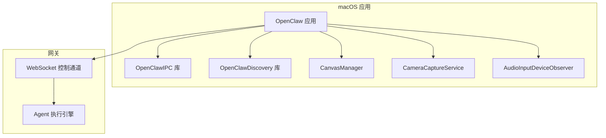
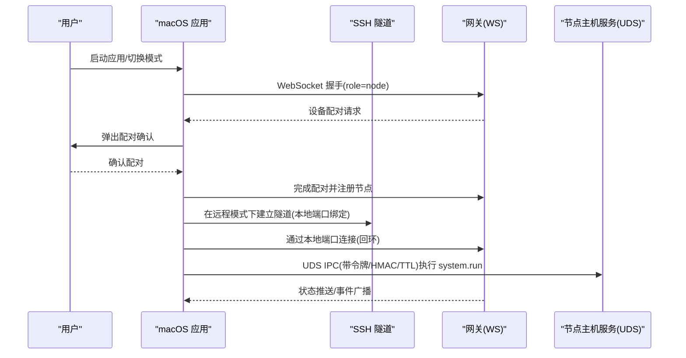
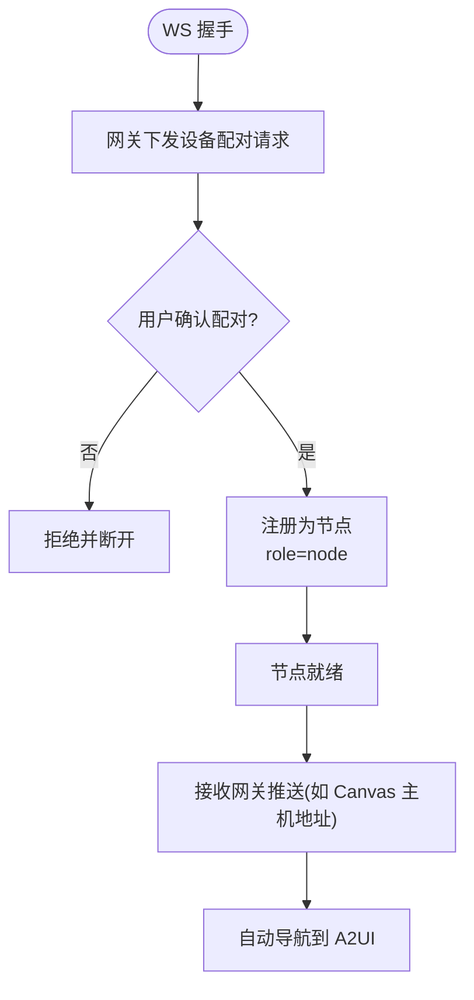
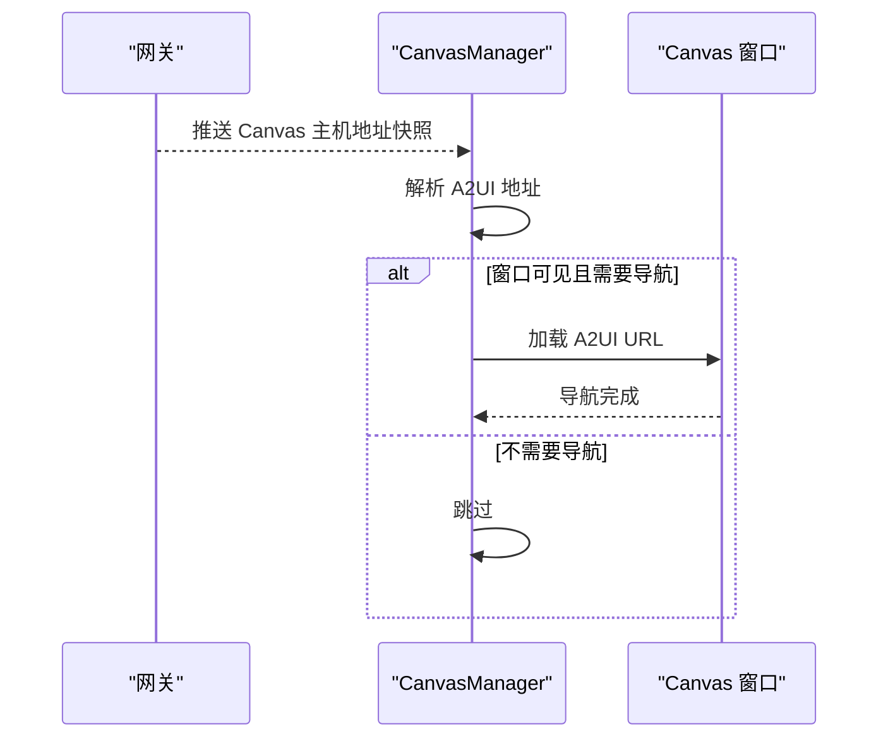
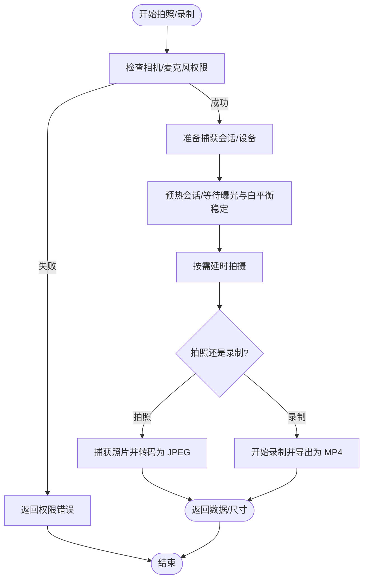
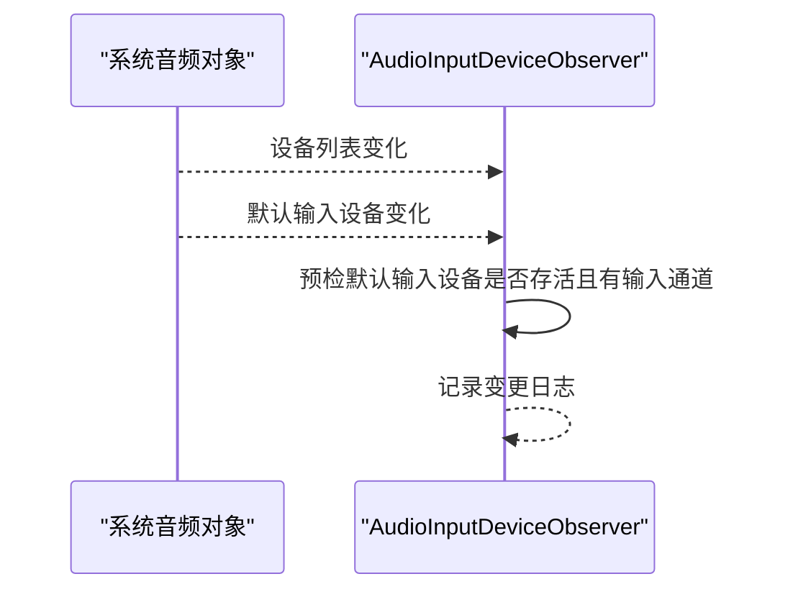
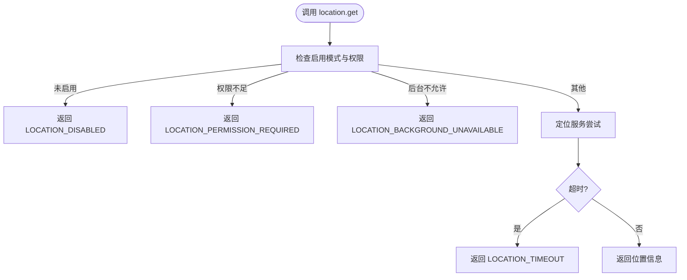
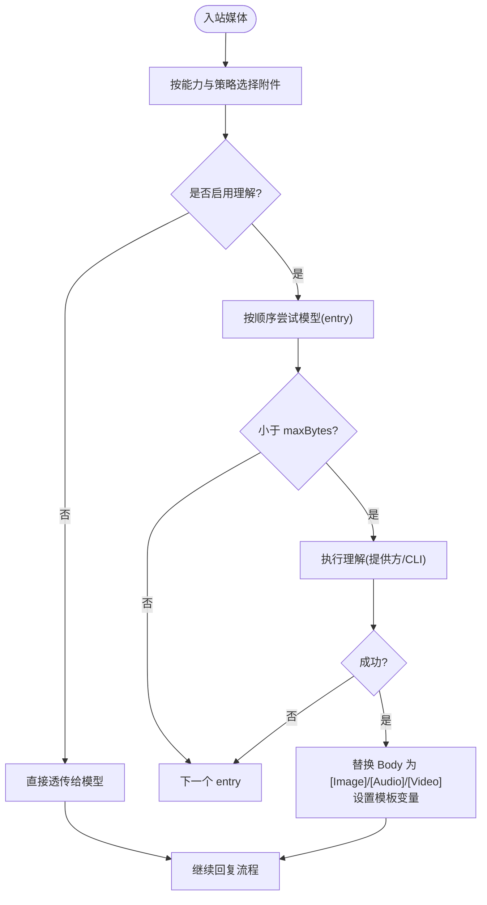
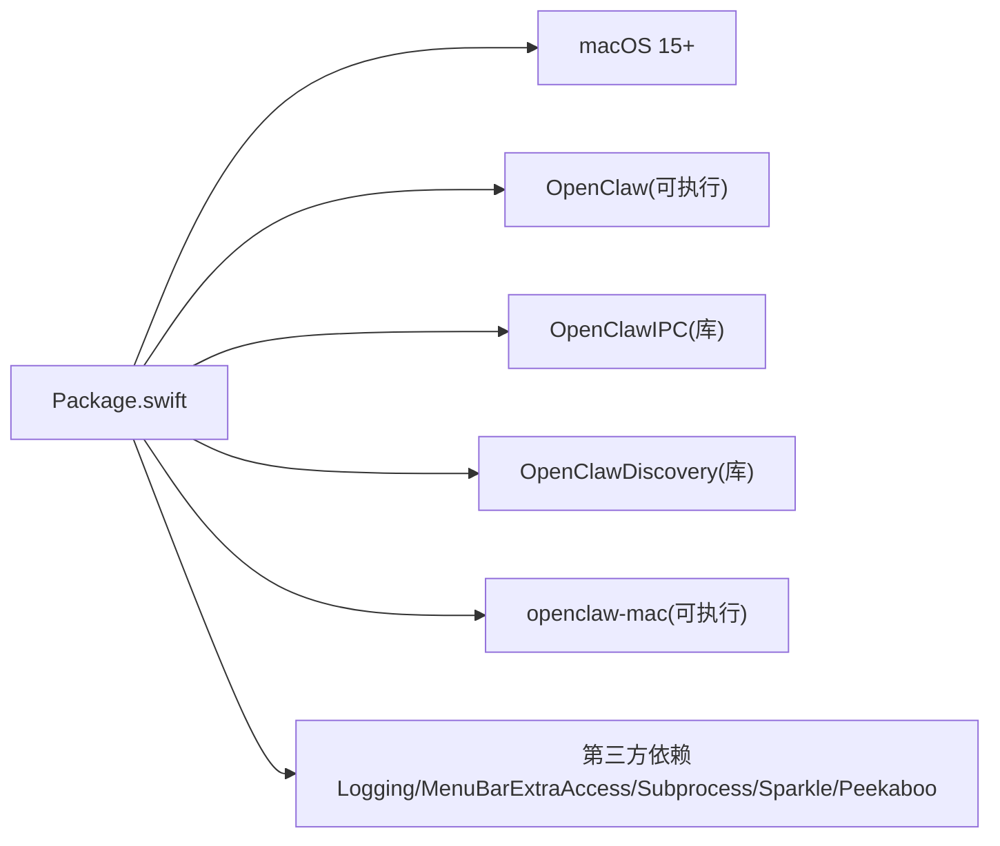

# macOS节点

<cite>
**本文引用的文件**
- [apps/macos/README.md](file://apps/macos/README.md)
- [apps/macos/Package.swift](file://apps/macos/Package.swift)
- [docs/platforms/macos.md](file://docs/platforms/macos.md)
- [docs/nodes/index.md](file://docs/nodes/index.md)
- [docs/nodes/audio.md](file://docs/nodes/audio.md)
- [docs/nodes/camera.md](file://docs/nodes/camera.md)
- [docs/nodes/images.md](file://docs/nodes/images.md)
- [docs/nodes/location-command.md](file://docs/nodes/location-command.md)
- [docs/nodes/media-understanding.md](file://docs/nodes/media-understanding.md)
- [docs/nodes/voicewake.md](file://docs/nodes/voicewake.md)
- [apps/macos/Sources/OpenClaw/CameraCaptureService.swift](file://apps/macos/Sources/OpenClaw/CameraCaptureService.swift)
- [apps/macos/Sources/OpenClaw/AudioInputDeviceObserver.swift](file://apps/macos/Sources/OpenClaw/AudioInputDeviceObserver.swift)
- [apps/macos/Sources/OpenClaw/CanvasManager.swift](file://apps/macos/Sources/OpenClaw/CanvasManager.swift)
</cite>

## 目录

1. [简介](#简介)
2. [项目结构](#项目结构)
3. [核心组件](#核心组件)
4. [架构总览](#架构总览)
5. [详细组件分析](#详细组件分析)
6. [依赖关系分析](#依赖关系分析)
7. [性能考量](#性能考量)
8. [故障排除指南](#故障排除指南)
9. [结论](#结论)
10. [附录](#附录)

## 简介

本文件面向在 macOS 上部署与使用 OpenClaw 节点（macOS 应用）的工程师与运维人员，系统阐述以下内容：

- 安装与开发环境搭建、打包与签名流程
- 连接建立与认证（WS 节点握手、设备配对）
- 音频输入设备监听与可用性检测
- 摄像头拍照与短视频录制（含权限与导出）
- Canvas 图形界面与 A2UI 自动导航
- 位置服务命令与权限模型
- 媒体理解（图像/音频/视频）与语音转写
- 语音唤醒全局触发词同步
- 与网关的通信协议、数据传输与状态同步
- 配置示例、命令行操作与故障排除
- 性能优化、安全配置与系统兼容性

## 项目结构

macOS 节点由一个菜单栏应用与若干 Swift 模块组成，通过 Swift Package 管理依赖与产物；应用以“节点”身份连接到网关，暴露 Canvas、Camera、Screen 录制、系统运行等能力，并在远程模式下通过 SSH 隧道与远端网关互通。



图表来源

- [apps/macos/Package.swift:1-93](file://apps/macos/Package.swift#L1-L93)
- [docs/platforms/macos.md:66-74](file://docs/platforms/macos.md#L66-L74)

章节来源

- [apps/macos/Package.swift:1-93](file://apps/macos/Package.swift#L1-L93)
- [docs/platforms/macos.md:15-34](file://docs/platforms/macos.md#L15-L34)

## 核心组件

- 菜单栏应用：负责权限提示、本地/远程模式切换、与网关的 WebSocket 连接、系统运行命令执行、Canvas 展示与调试面板更新。
- OpenClawIPC：跨进程通信（Unix Domain Socket + Token + HMAC + TTL）用于本地节点主机服务与应用之间的安全交互。
- OpenClawDiscovery：网关发现与健康探测逻辑（macOS CLI 同步实现）。
- CanvasManager：Canvas 窗口控制器、会话管理、A2UI 自动导航、调试状态刷新。
- CameraCaptureService：相机设备枚举、拍照、短视频录制、导出为 mp4、曝光与白平衡稳定等待。
- AudioInputDeviceObserver：系统默认麦克风变更监听、可用性检测，避免无麦克风设备导致崩溃。

章节来源

- [docs/platforms/macos.md:50-74](file://docs/platforms/macos.md#L50-L74)
- [apps/macos/Sources/OpenClaw/CanvasManager.swift:1-343](file://apps/macos/Sources/OpenClaw/CanvasManager.swift#L1-L343)
- [apps/macos/Sources/OpenClaw/CameraCaptureService.swift:1-377](file://apps/macos/Sources/OpenClaw/CameraCaptureService.swift#L1-L377)
- [apps/macos/Sources/OpenClaw/AudioInputDeviceObserver.swift:1-217](file://apps/macos/Sources/OpenClaw/AudioInputDeviceObserver.swift#L1-L217)

## 架构总览

macOS 节点作为“节点”接入网关，支持本地与远程两种模式：

- 本地模式：若本地已有网关实例则附加；否则通过 launchd 安装并启动网关。
- 远程模式：通过 SSH 隧道将远端网关端口映射到本地回环，节点连接本地端口，实现“本地 UI 组件与远端网关通信”的透明化。



图表来源

- [docs/platforms/macos.md:26-34](file://docs/platforms/macos.md#L26-L34)
- [docs/platforms/macos.md:200-220](file://docs/platforms/macos.md#L200-L220)
- [docs/nodes/index.md:12-23](file://docs/nodes/index.md#L12-L23)

章节来源

- [docs/platforms/macos.md:26-34](file://docs/platforms/macos.md#L26-L34)
- [docs/platforms/macos.md:200-220](file://docs/platforms/macos.md#L200-L220)
- [docs/nodes/index.md:12-23](file://docs/nodes/index.md#L12-L23)

## 详细组件分析

### 节点与网关通信协议

- 角色与配对：节点以 role=node 连接网关，首次连接会触发设备配对请求，需在网关侧批准后方可成为已配对节点。
- 认证方式：支持令牌或密码认证，优先使用环境变量或配置项中的凭据。
- 事件与状态：节点可接收网关推送（如 Canvas 主机地址快照），并据此进行自动导航至 A2UI。



图表来源

- [docs/nodes/index.md:24-44](file://docs/nodes/index.md#L24-L44)
- [docs/platforms/macos.md:140-145](file://docs/platforms/macos.md#L140-L145)

章节来源

- [docs/nodes/index.md:24-44](file://docs/nodes/index.md#L24-L44)
- [docs/platforms/macos.md:140-145](file://docs/platforms/macos.md#L140-L145)

### Canvas 管理与 A2UI 自动导航

- 会话管理：按会话键维护 Canvas 窗口，支持锚定到鼠标或菜单栏状态项，支持首选布局与调试面板状态显示。
- 自动导航：当网关推送 Canvas 主机地址时，节点自动解析并导航到 A2UI 地址，避免重复跳转。
- 快照与评估：支持对当前页面进行截图与 JavaScript 评估，便于代理上下文采集。



图表来源

- [apps/macos/Sources/OpenClaw/CanvasManager.swift:140-200](file://apps/macos/Sources/OpenClaw/CanvasManager.swift#L140-L200)

章节来源

- [apps/macos/Sources/OpenClaw/CanvasManager.swift:1-343](file://apps/macos/Sources/OpenClaw/CanvasManager.swift#L1-L343)

### 摄像头管理与图像处理

- 设备枚举：自动发现内置/外置摄像头，支持按位置与设备 ID 选择。
- 拍照：支持最大宽度与质量参数归一化、曝光与白平衡稳定等待、延迟拍摄、JPEG 转码与尺寸返回。
- 录制：支持开启/关闭音频、限制最大时长、临时 MOV 录制后导出为 MP4，确保网络优化与平台兼容。
- 权限与错误：统一的错误类型与权限检查，拒绝时返回明确错误码。



图表来源

- [apps/macos/Sources/OpenClaw/CameraCaptureService.swift:51-164](file://apps/macos/Sources/OpenClaw/CameraCaptureService.swift#L51-L164)

章节来源

- [apps/macos/Sources/OpenClaw/CameraCaptureService.swift:1-377](file://apps/macos/Sources/OpenClaw/CameraCaptureService.swift#L1-L377)
- [docs/nodes/camera.md:113-146](file://docs/nodes/camera.md#L113-L146)

### 音频输入设备监听

- 默认输入设备 UID 获取与名称解析
- 系统设备列表变化与默认输入设备变化监听
- 可用性检测：在访问 AVAudioEngine.inputNode 前进行预检，避免无麦克风设备导致崩溃
- 日志记录：变更原因与摘要信息输出



图表来源

- [apps/macos/Sources/OpenClaw/AudioInputDeviceObserver.swift:79-122](file://apps/macos/Sources/OpenClaw/AudioInputDeviceObserver.swift#L79-L122)

章节来源

- [apps/macos/Sources/OpenClaw/AudioInputDeviceObserver.swift:1-217](file://apps/macos/Sources/OpenClaw/AudioInputDeviceObserver.swift#L1-L217)

### 位置服务命令

- 命令：location.get 支持超时、最大年龄、期望精度等参数；返回经纬度、海拔、速度、方向、时间戳、精度来源等。
- 权限模型：支持关闭/前台使用/后台“始终”等多级模式；精确位置为单独授权。
- 错误码：包括未启用、权限不足、后台不可用、超时、不可用等。



图表来源

- [docs/nodes/location-command.md:44-81](file://docs/nodes/location-command.md#L44-L81)

章节来源

- [docs/nodes/location-command.md:1-99](file://docs/nodes/location-command.md#L1-L99)

### 媒体理解与语音转写

- 入站媒体理解：在回复前对图片/音频/视频进行描述或转写，支持提供方 API 与 CLI 回退。
- 自动检测：在未显式配置模型时，按顺序尝试本地 CLI、Gemini CLI、提供方密钥。
- 配置策略：支持共享模型列表与各能力覆盖、并发度、附件策略（首条/全部）、范围门控（scope）。
- 限制与边界：大小上限、空/小文件跳过、超时回退、代理环境变量支持。



图表来源

- [docs/nodes/media-understanding.md:20-33](file://docs/nodes/media-understanding.md#L20-L33)
- [docs/nodes/media-understanding.md:135-166](file://docs/nodes/media-understanding.md#L135-L166)

章节来源

- [docs/nodes/media-understanding.md:1-388](file://docs/nodes/media-understanding.md#L1-L388)
- [docs/nodes/audio.md:10-36](file://docs/nodes/audio.md#L10-L36)

### 语音唤醒（全局触发词）

- 存储：网关主机上存储触发词列表与更新时间戳。
- 协议：提供 get/set 方法与 changed 事件；所有客户端（WS 客户端、节点）均会收到广播。
- 客户端行为：macOS/iOS 使用全局列表控制触发；Android 当前禁用语音唤醒，采用手动麦克风采集。

```mermaid
sequenceDiagram
participant GW as "网关"
participant App as "macOS 应用"
participant iOS as "iOS 节点"
participant And as "Android 节点"
GW->>GW : 更新触发词列表
GW-->>App : 广播 voicewake.changed
GW-->>iOS : 广播 voicewake.changed
GW-->>And : 广播 voicewake.changed
App->>App : 使用全局列表控制触发
iOS->>iOS : 使用全局列表控制触发
And->>And : 保持禁用(手动采集)
```

图表来源

- [docs/nodes/voicewake.md:30-50](file://docs/nodes/voicewake.md#L30-L50)

章节来源

- [docs/nodes/voicewake.md:1-67](file://docs/nodes/voicewake.md#L1-L67)

## 依赖关系分析

- 包与平台：最低 macOS 版本要求、产品目标（可执行与库）、依赖第三方框架（日志、菜单栏扩展、子进程、Sparkle、Peekaboo 等）。
- 产物与资源：应用图标、设备模型资源复制到包内；严格并发特性启用。



图表来源

- [apps/macos/Package.swift:8-16](file://apps/macos/Package.swift#L8-L16)
- [apps/macos/Package.swift:17-25](file://apps/macos/Package.swift#L17-L25)
- [apps/macos/Package.swift:42-67](file://apps/macos/Package.swift#L42-L67)

章节来源

- [apps/macos/Package.swift:1-93](file://apps/macos/Package.swift#L1-L93)

## 性能考量

- 媒体理解并发：默认并发度为 2，避免同时处理过多能力导致资源争用。
- 媒体大小上限：图像/音频/视频分别设定上限，超限跳过当前模型并尝试下一个 entry。
- 导出优化：录制导出使用网络优化预设，MP4 导出在新平台上异步完成，旧平台使用回调。
- Canvas 导航去重：仅在 A2UI 地址变化时才触发导航，减少不必要的页面跳转。
- 麦克风可用性预检：在访问输入节点前进行默认设备可用性检测，避免崩溃与无效等待。

章节来源

- [docs/nodes/media-understanding.md:47-48](file://docs/nodes/media-understanding.md#L47-L48)
- [docs/nodes/media-understanding.md:119-125](file://docs/nodes/media-understanding.md#L119-L125)
- [apps/macos/Sources/OpenClaw/CameraCaptureService.swift:239-274](file://apps/macos/Sources/OpenClaw/CameraCaptureService.swift#L239-L274)
- [apps/macos/Sources/OpenClaw/CanvasManager.swift:185-195](file://apps/macos/Sources/OpenClaw/CanvasManager.swift#L185-L195)
- [apps/macos/Sources/OpenClaw/AudioInputDeviceObserver.swift:42-49](file://apps/macos/Sources/OpenClaw/AudioInputDeviceObserver.swift#L42-L49)

## 故障排除指南

- 开发运行与签名
  - 快速开发运行：脚本重启应用并可选择不签名或强制签名。
  - 签名身份自动选择顺序：Developer ID Application → Apple Distribution → Apple Development → 第一个可用身份。
  - 禁止签名：允许使用 ad-hoc 签名（开发场景）。
  - Sparkle Team ID 审计：签名后校验嵌入二进制 Team ID 一致性，不一致则失败；可跳过审计或禁用库验证（开发专用）。
- 打包与分发
  - 打包脚本生成并签名应用，输出 dist/OpenClaw.app。
- 连接与发现
  - 使用 macOS CLI 的 discover/connect 命令复现网关发现与握手逻辑，便于独立排查。
  - 对比 Node CLI 与 macOS 应用的发现路径差异（NWBrowser + tailnet DNS-SD）。
- 远程模式隧道
  - 控制隧道：复用稳定端口，SSH 保持连接与退出转发失败保护；隧道使用回环地址，节点 IP 显示为 127.0.0.1。
- 执行审批与 system.run
  - macOS 节点模式下 system.run 受 Exec approvals 控制，支持 ask/allowlist/full 策略与持久化决策。
  - shell 包装器与环境变量过滤规则，避免危险注入。
- Canvas/A2UI
  - 若自动导航未生效，检查网关推送的 Canvas 主机地址是否有效，以及窗口是否可见。
- 摄像头/录音
  - 检查相机/麦克风权限；确认设备存在且可用；录制时长限制与导出异常处理。
- 音频设备
  - 无内置麦克风或外设断开时，预检失败；请插入可用设备或调整默认输入设备。

章节来源

- [apps/macos/README.md:1-65](file://apps/macos/README.md#L1-L65)
- [docs/platforms/macos.md:171-199](file://docs/platforms/macos.md#L171-L199)
- [docs/platforms/macos.md:200-220](file://docs/platforms/macos.md#L200-L220)
- [docs/nodes/index.md:74-100](file://docs/nodes/index.md#L74-L100)
- [apps/macos/Sources/OpenClaw/CanvasManager.swift:153-172](file://apps/macos/Sources/OpenClaw/CanvasManager.swift#L153-L172)
- [apps/macos/Sources/OpenClaw/CameraCaptureService.swift:166-170](file://apps/macos/Sources/OpenClaw/CameraCaptureService.swift#L166-L170)
- [apps/macos/Sources/OpenClaw/AudioInputDeviceObserver.swift:42-49](file://apps/macos/Sources/OpenClaw/AudioInputDeviceObserver.swift#L42-L49)

## 结论

macOS 节点通过严格的权限模型、稳健的媒体处理与网关协议实现，既满足本地网关直连，也支持远程模式下的透明隧道访问。其模块化设计（Canvas、Camera、Audio、Discovery、IPC）便于扩展与维护；配合完善的故障排除与性能优化策略，可在多场景下稳定运行。

## 附录

### 安装与开发

- 本地构建与运行：进入 apps/macos 目录，使用 swift build 与 swift run。
- 打包与签名：使用 scripts/package-mac-app.sh 生成并签名应用；根据需要设置签名身份与审计开关。

章节来源

- [apps/macos/README.md:17-24](file://apps/macos/README.md#L17-L24)
- [apps/macos/README.md:58-65](file://apps/macos/README.md#L58-L65)

### 命令行操作要点

- 发现与连接：使用 openclaw-mac discover/connect，支持 JSON 输出与超时控制。
- Canvas：present/navigate/eval/snapshot/a2ui push/reset 等。
- Camera：list/snap/clip，支持 facing、duration、no-audio、device-id 等参数。
- Screen：screen.record 支持时长、帧率、音频开关与屏幕索引。
- Location：location.get 支持超时、最大年龄、精度等级。
- System：nodes run/notify，macOS 节点模式下受 Exec approvals 控制。

章节来源

- [docs/platforms/macos.md:171-199](file://docs/platforms/macos.md#L171-L199)
- [docs/nodes/index.md:169-201](file://docs/nodes/index.md#L169-L201)
- [docs/nodes/index.md:206-228](file://docs/nodes/index.md#L206-L228)
- [docs/nodes/index.md:229-244](file://docs/nodes/index.md#L229-L244)
- [docs/nodes/index.md:245-261](file://docs/nodes/index.md#L245-L261)
- [docs/nodes/index.md:302-328](file://docs/nodes/index.md#L302-L328)

### 安全与合规

- Exec approvals：在节点主机（macOS 节点或 headless 节点主机）本地存储，支持 ask/allowlist/full 策略。
- 环境变量过滤：system.run 的环境变量合并时会过滤危险键值，shell 包装器仅保留有限白名单。
- Sparkle Team ID 审计：签名后校验嵌入二进制 Team ID 一致性，防止加载失败。
- 代理与网络：媒体理解与音频转写支持标准代理环境变量。

章节来源

- [docs/nodes/index.md:74-100](file://docs/nodes/index.md#L74-L100)
- [docs/nodes/index.md:320-328](file://docs/nodes/index.md#L320-L328)
- [apps/macos/README.md:37-46](file://apps/macos/README.md#L37-L46)
- [docs/nodes/media-understanding.md:167-179](file://docs/nodes/media-understanding.md#L167-L179)
- [docs/nodes/audio.md:146-156](file://docs/nodes/audio.md#L146-L156)

### 系统兼容性

- 最低系统版本：macOS 15。
- 平台特性：在较新系统上使用异步导出；旧系统使用回调式导出；外置摄像头在特定系统版本可用。
- 网络与隧道：远程模式下通过 SSH 隧道复用稳定端口，回环绑定以隐藏真实客户端 IP。

章节来源

- [apps/macos/Package.swift:8-10](file://apps/macos/Package.swift#L8-L10)
- [apps/macos/Sources/OpenClaw/CameraCaptureService.swift:246-274](file://apps/macos/Sources/OpenClaw/CameraCaptureService.swift#L246-L274)
- [docs/platforms/macos.md:200-220](file://docs/platforms/macos.md#L200-L220)
