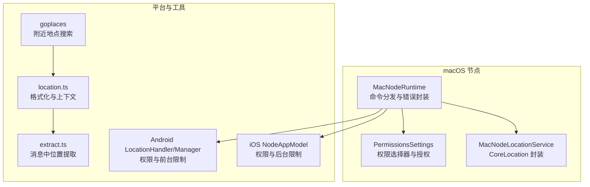
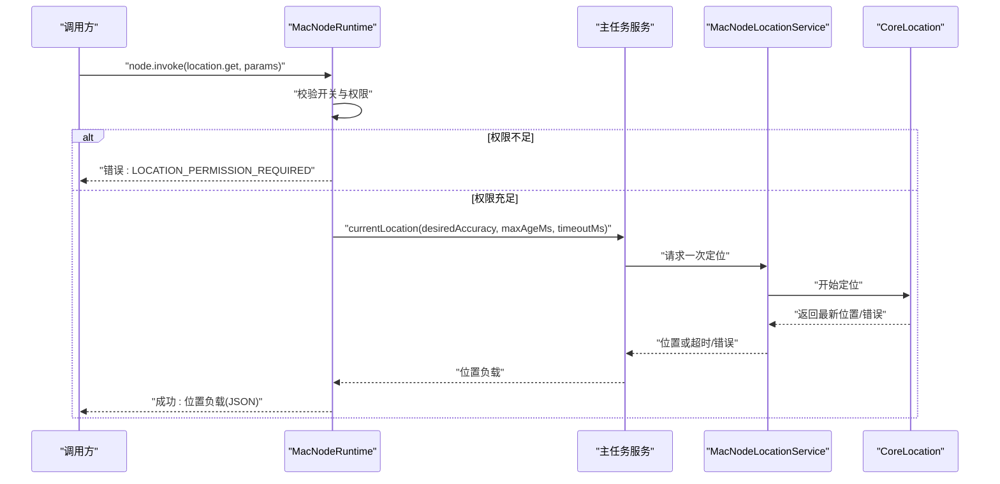
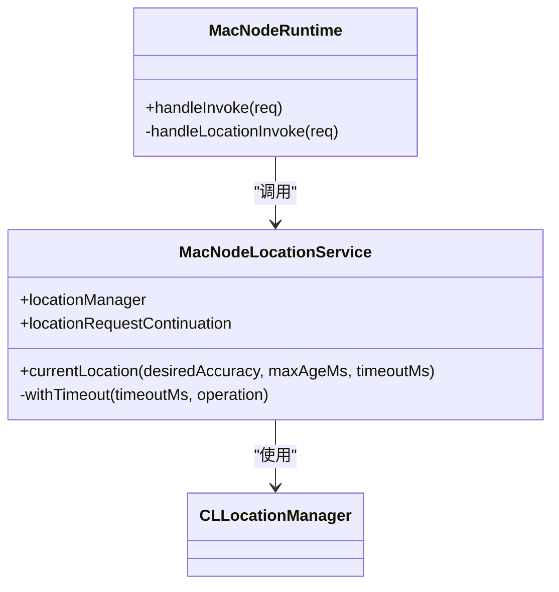
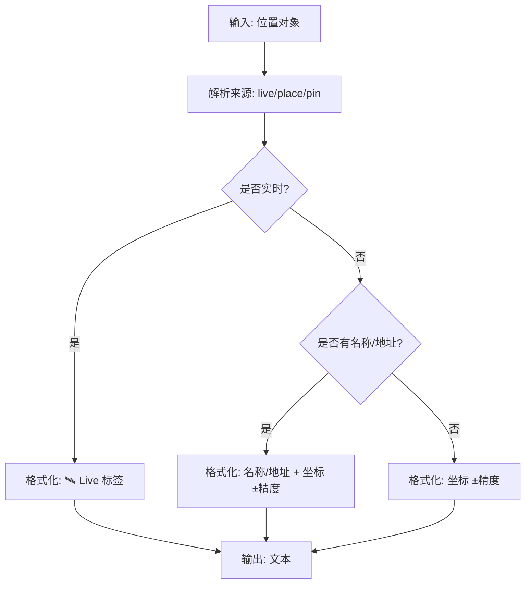
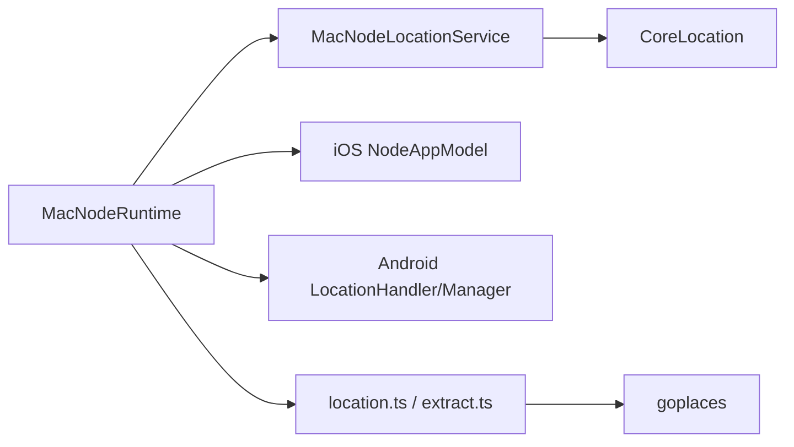

# 位置服务

<cite>
**本文引用的文件**
- [apps/macos/Sources/OpenClaw/NodeMode/MacNodeRuntime.swift](file://apps/macos/Sources/OpenClaw/NodeMode/MacNodeRuntime.swift)
- [apps/macos/Sources/OpenClaw/NodeMode/MacNodeLocationService.swift](file://apps/macos/Sources/OpenClaw/NodeMode/MacNodeLocationService.swift)
- [apps/macos/Sources/OpenClaw/PermissionsSettings.swift](file://apps/macos/Sources/OpenClaw/PermissionsSettings.swift)
- [apps/ios/Sources/Model/NodeAppModel.swift](file://apps/ios/Sources/Model/NodeAppModel.swift)
- [apps/android/app/src/main/java/ai/openclaw/app/node/LocationHandler.kt](file://apps/android/app/src/main/java/ai/openclaw/app/node/LocationHandler.kt)
- [apps/android/app/src/main/java/ai/openclaw/app/node/LocationCaptureManager.kt](file://apps/android/app/src/main/java/ai/openclaw/app/node/LocationCaptureManager.kt)
- [apps/android/app/src/main/java/ai/openclaw/app/ui/SettingsSheet.kt](file://apps/android/app/src/main/java/ai/openclaw/app/ui/SettingsSheet.kt)
- [src/channels/location.ts](file://src/channels/location.ts)
- [src/web/inbound/extract.ts](file://src/web/inbound/extract.ts)
- [docs/nodes/location-command.md](file://docs/nodes/location-command.md)
- [docs/zh-CN/nodes/location-command.md](file://docs/zh-CN/nodes/location-command.md)
- [skills/goplaces/SKILL.md](file://skills/goplaces/SKILL.md)
</cite>

## 目录

1. [简介](#简介)
2. [项目结构](#项目结构)
3. [核心组件](#核心组件)
4. [架构总览](#架构总览)
5. [详细组件分析](#详细组件分析)
6. [依赖关系分析](#依赖关系分析)
7. [性能考量](#性能考量)
8. [故障排除指南](#故障排除指南)
9. [结论](#结论)
10. [附录](#附录)

## 简介

本文件面向 macOS 节点位置服务功能，系统化阐述以下能力与实现细节：

- GPS 定位与多源融合：基于 CoreLocation 的一次性定位请求与超时控制
- 地图集成与位置展示：前端 UI 与消息通道中的位置格式化与上下文注入
- 地理围栏与附近搜索：通过外部工具链（如 Google Places）实现附近地点检索
- 权限申请与隐私保护：系统级权限映射、精确度授权与最小化数据暴露
- 精度控制与更新频率：desiredAccuracy、maxAgeMs、timeoutMs 参数与电池优化策略
- 地址解析与反向地理编码：通过第三方 API 实现名称/地址解析
- 位置历史与轨迹：消息层对位置字段的标准化与上下文化
- 位置共享与安全配置：命令调用边界、错误码与平台差异

## 项目结构

围绕 macOS 节点的位置服务，相关代码分布在如下模块：

- 运行时与桥接：负责命令分发与错误封装
- 位置服务实现：封装 CoreLocation 请求、超时与回调
- 权限设置：系统权限选择器与授权流程
- 平台侧实现：iOS/Android 的位置处理与权限检查
- 通用位置工具：位置文本格式化、上下文注入与消息提取
- 外部能力：Google Places 搜索与详情查询

**图表来源**

- [apps/macos/Sources/OpenClaw/NodeMode/MacNodeRuntime.swift](file://apps/macos/Sources/OpenClaw/NodeMode/MacNodeRuntime.swift)
- [apps/macos/Sources/OpenClaw/NodeMode/MacNodeLocationService.swift](file://apps/macos/Sources/OpenClaw/NodeMode/MacNodeLocationService.swift)
- [apps/macos/Sources/OpenClaw/PermissionsSettings.swift](file://apps/macos/Sources/OpenClaw/PermissionsSettings.swift)
- [apps/ios/Sources/Model/NodeAppModel.swift](file://apps/ios/Sources/Model/NodeAppModel.swift)
- [apps/android/app/src/main/java/ai/openclaw/app/node/LocationHandler.kt](file://apps/android/app/src/main/java/ai/openclaw/app/node/LocationHandler.kt)
- [apps/android/app/src/main/java/ai/openclaw/app/node/LocationCaptureManager.kt](file://apps/android/app/src/main/java/ai/openclaw/app/node/LocationCaptureManager.kt)
- [src/channels/location.ts](file://src/channels/location.ts)
- [src/web/inbound/extract.ts](file://src/web/inbound/extract.ts)
- [skills/goplaces/SKILL.md](file://skills/goplaces/SKILL.md)

**章节来源**

- [apps/macos/Sources/OpenClaw/NodeMode/MacNodeRuntime.swift](file://apps/macos/Sources/OpenClaw/NodeMode/MacNodeRuntime.swift)
- [apps/macos/Sources/OpenClaw/NodeMode/MacNodeLocationService.swift](file://apps/macos/Sources/OpenClaw/NodeMode/MacNodeLocationService.swift)
- [apps/macos/Sources/OpenClaw/PermissionsSettings.swift](file://apps/macos/Sources/OpenClaw/PermissionsSettings.swift)
- [apps/ios/Sources/Model/NodeAppModel.swift](file://apps/ios/Sources/Model/NodeAppModel.swift)
- [apps/android/app/src/main/java/ai/openclaw/app/node/LocationHandler.kt](file://apps/android/app/src/main/java/ai/openclaw/app/node/LocationHandler.kt)
- [apps/android/app/src/main/java/ai/openclaw/app/node/LocationCaptureManager.kt](file://apps/android/app/src/main/java/ai/openclaw/app/node/LocationCaptureManager.kt)
- [src/channels/location.ts](file://src/channels/location.ts)
- [src/web/inbound/extract.ts](file://src/web/inbound/extract.ts)
- [skills/goplaces/SKILL.md](file://skills/goplaces/SKILL.md)

## 核心组件

- macOS 节点运行时：接收 location.get 命令，校验开关与权限，调用位置服务并返回标准化负载
- macOS 位置服务：封装 CLLocationManager，支持 desiredAccuracy、maxAgeMs、timeoutMs，并内置超时控制
- 权限设置：提供“关闭/使用时/始终”三档选择与“精确位置”开关，联动系统授权
- 平台侧实现：iOS 需要 Always 权限与后台模式；Android 当前仅前台可用，后台请求受限
- 通用位置工具：统一位置对象结构、格式化输出、上下文注入与消息提取
- 外部能力：goplaces 提供附近地点搜索与详情查询，作为“附近地点搜索”的实现载体

**章节来源**

- [apps/macos/Sources/OpenClaw/NodeMode/MacNodeRuntime.swift](file://apps/macos/Sources/OpenClaw/NodeMode/MacNodeRuntime.swift)
- [apps/macos/Sources/OpenClaw/NodeMode/MacNodeLocationService.swift](file://apps/macos/Sources/OpenClaw/NodeMode/MacNodeLocationService.swift)
- [apps/macos/Sources/OpenClaw/PermissionsSettings.swift](file://apps/macos/Sources/OpenClaw/PermissionsSettings.swift)
- [apps/ios/Sources/Model/NodeAppModel.swift](file://apps/ios/Sources/Model/NodeAppModel.swift)
- [apps/android/app/src/main/java/ai/openclaw/app/node/LocationHandler.kt](file://apps/android/app/src/main/java/ai/openclaw/app/node/LocationHandler.kt)
- [apps/android/app/src/main/java/ai/openclaw/app/node/LocationCaptureManager.kt](file://apps/android/app/src/main/java/ai/openclaw/app/node/LocationCaptureManager.kt)
- [src/channels/location.ts](file://src/channels/location.ts)
- [skills/goplaces/SKILL.md](file://skills/goplaces/SKILL.md)

## 架构总览

下图展示了 macOS 节点位置服务的关键交互路径：命令入口、权限校验、位置请求与响应封装。

**图表来源**

- [apps/macos/Sources/OpenClaw/NodeMode/MacNodeRuntime.swift](file://apps/macos/Sources/OpenClaw/NodeMode/MacNodeRuntime.swift)
- [apps/macos/Sources/OpenClaw/NodeMode/MacNodeLocationService.swift](file://apps/macos/Sources/OpenClaw/NodeMode/MacNodeLocationService.swift)

**章节来源**

- [apps/macos/Sources/OpenClaw/NodeMode/MacNodeRuntime.swift](file://apps/macos/Sources/OpenClaw/NodeMode/MacNodeRuntime.swift)
- [apps/macos/Sources/OpenClaw/NodeMode/MacNodeLocationService.swift](file://apps/macos/Sources/OpenClaw/NodeMode/MacNodeLocationService.swift)

## 详细组件分析

### macOS 位置运行时与服务

- 命令入口：handleLocationInvoke 校验开关、权限与后台状态，组装 desiredAccuracy，调用主任务服务获取位置
- 位置服务：MacNodeLocationService 封装 CLLocationManager，支持超时控制与异步回调；内部使用 CheckedContinuation 协程式等待
- 超时策略：withTimeout 在指定毫秒内完成定位请求，否则抛出超时错误
- 响应负载：包含经纬度、精度、海拔、速度、航向、时间戳、是否精确、来源等字段

**图表来源**

- [apps/macos/Sources/OpenClaw/NodeMode/MacNodeRuntime.swift](file://apps/macos/Sources/OpenClaw/NodeMode/MacNodeRuntime.swift)
- [apps/macos/Sources/OpenClaw/NodeMode/MacNodeLocationService.swift](file://apps/macos/Sources/OpenClaw/NodeMode/MacNodeLocationService.swift)

**章节来源**

- [apps/macos/Sources/OpenClaw/NodeMode/MacNodeRuntime.swift](file://apps/macos/Sources/OpenClaw/NodeMode/MacNodeRuntime.swift)
- [apps/macos/Sources/OpenClaw/NodeMode/MacNodeLocationService.swift](file://apps/macos/Sources/OpenClaw/NodeMode/MacNodeLocationService.swift)

### 权限设置与隐私保护

- 权限选择器：提供“关闭/使用时/始终”，精确位置为独立开关
- 授权流程：切换选择器时尝试请求系统授权，若未获得则回滚到先前状态
- 隐私提示：Always 可能需要系统设置批准后台位置，避免过度授权

**章节来源**

- [apps/macos/Sources/OpenClaw/PermissionsSettings.swift](file://apps/macos/Sources/OpenClaw/PermissionsSettings.swift)

### 平台差异：iOS 与 Android

- iOS：后台需 Always 权限与后台位置模式；若仅 While Using 或权限不足，将返回相应错误码
- Android：当前仅前台可用，后台请求会直接失败；需要前台服务或特殊权限才可后台定位

**章节来源**

- [apps/ios/Sources/Model/NodeAppModel.swift](file://apps/ios/Sources/Model/NodeAppModel.swift)
- [apps/android/app/src/main/java/ai/openclaw/app/node/LocationHandler.kt](file://apps/android/app/src/main/java/ai/openclaw/app/node/LocationHandler.kt)
- [apps/android/app/src/main/java/ai/openclaw/app/node/LocationCaptureManager.kt](file://apps/android/app/src/main/java/ai/openclaw/app/node/LocationCaptureManager.kt)

### 位置精度控制与更新频率

- desiredAccuracy：coarse/balanced/precise 三档；精确度越高，耗电越大
- maxAgeMs：允许使用缓存位置的最大年龄
- timeoutMs：定位超时时间，0 表示无限制
- 更新频率：当前实现为一次性定位请求；若需持续跟踪，可在上层循环调用或结合后台能力（iOS/Android 特殊配置）

**章节来源**

- [apps/macos/Sources/OpenClaw/NodeMode/MacNodeRuntime.swift](file://apps/macos/Sources/OpenClaw/NodeMode/MacNodeRuntime.swift)
- [apps/macos/Sources/OpenClaw/NodeMode/MacNodeLocationService.swift](file://apps/macos/Sources/OpenClaw/NodeMode/MacNodeLocationService.swift)
- [docs/nodes/location-command.md](file://docs/nodes/location-command.md)
- [docs/zh-CN/nodes/location-command.md](file://docs/zh-CN/nodes/location-command.md)

### 地图集成与位置展示

- 位置格式化：根据是否有名称/地址/实时标记，生成人类可读文本
- 上下文注入：将位置信息注入到消息上下文中，便于后续工具链使用
- 消息提取：从消息中提取 liveLocationMessage 或 locationMessage，标准化为统一结构

**图表来源**

- [src/channels/location.ts](file://src/channels/location.ts)

**章节来源**

- [src/channels/location.ts](file://src/channels/location.ts)
- [src/web/inbound/extract.ts](file://src/web/inbound/extract.ts)

### 地理围栏与附近地点搜索

- 地理围栏：当前仓库未发现直接的地理围栏实现；可通过定时调用位置 API 结合业务逻辑实现
- 附近地点搜索：通过 goplaces 技能对接 Google Places API，支持文本搜索、分页、详情与评论查询

**章节来源**

- [skills/goplaces/SKILL.md](file://skills/goplaces/SKILL.md)

### 地址解析与反向地理编码

- 地址解析：通过 goplaces 的 resolve/resolve 详情能力，将地名/地址解析为坐标
- 反向地理编码：通过 goplaces 的 details 获取详细地址信息
- 注意：需要配置 GOOGLE_PLACES_API_KEY 等环境变量

**章节来源**

- [skills/goplaces/SKILL.md](file://skills/goplaces/SKILL.md)

### 位置历史记录与轨迹跟踪

- 位置历史：消息层提供统一的 NormalizedLocation 结构，便于持久化与轨迹构建
- 轨迹跟踪：可在上层循环调用 location.get 并按时间序列存储；注意隐私与权限

**章节来源**

- [src/channels/location.ts](file://src/channels/location.ts)

### 位置共享与安全配置

- 命令边界：location.get 仅在开启且有权限时可用，错误码明确区分“禁用/权限/后台/超时/不可用”
- 平台差异：iOS/Android 对后台与精确度授权要求不同，需在 UI 中提示用户
- 最小化暴露：默认不分享精确位置，必要时由用户开启“精确位置”

**章节来源**

- [docs/nodes/location-command.md](file://docs/nodes/location-command.md)
- [docs/zh-CN/nodes/location-command.md](file://docs/zh-CN/nodes/location-command.md)

## 依赖关系分析

- macOS 节点依赖 CoreLocation 进行定位；通过主任务服务抽象隔离 UI 线程
- 平台侧依赖各自系统的权限框架与定位服务
- 通用工具依赖于跨平台的消息与位置格式化模块

**图表来源**

- [apps/macos/Sources/OpenClaw/NodeMode/MacNodeRuntime.swift](file://apps/macos/Sources/OpenClaw/NodeMode/MacNodeRuntime.swift)
- [apps/macos/Sources/OpenClaw/NodeMode/MacNodeLocationService.swift](file://apps/macos/Sources/OpenClaw/NodeMode/MacNodeLocationService.swift)
- [apps/ios/Sources/Model/NodeAppModel.swift](file://apps/ios/Sources/Model/NodeAppModel.swift)
- [apps/android/app/src/main/java/ai/openclaw/app/node/LocationHandler.kt](file://apps/android/app/src/main/java/ai/openclaw/app/node/LocationHandler.kt)
- [apps/android/app/src/main/java/ai/openclaw/app/node/LocationCaptureManager.kt](file://apps/android/app/src/main/java/ai/openclaw/app/node/LocationCaptureManager.kt)
- [src/channels/location.ts](file://src/channels/location.ts)
- [src/web/inbound/extract.ts](file://src/web/inbound/extract.ts)
- [skills/goplaces/SKILL.md](file://skills/goplaces/SKILL.md)

**章节来源**

- [apps/macos/Sources/OpenClaw/NodeMode/MacNodeRuntime.swift](file://apps/macos/Sources/OpenClaw/NodeMode/MacNodeRuntime.swift)
- [apps/macos/Sources/OpenClaw/NodeMode/MacNodeLocationService.swift](file://apps/macos/Sources/OpenClaw/NodeMode/MacNodeLocationService.swift)
- [apps/ios/Sources/Model/NodeAppModel.swift](file://apps/ios/Sources/Model/NodeAppModel.swift)
- [apps/android/app/src/main/java/ai/openclaw/app/node/LocationHandler.kt](file://apps/android/app/src/main/java/ai/openclaw/app/node/LocationHandler.kt)
- [apps/android/app/src/main/java/ai/openclaw/app/node/LocationCaptureManager.kt](file://apps/android/app/src/main/java/ai/openclaw/app/node/LocationCaptureManager.kt)
- [src/channels/location.ts](file://src/channels/location.ts)
- [src/web/inbound/extract.ts](file://src/web/inbound/extract.ts)
- [skills/goplaces/SKILL.md](file://skills/goplaces/SKILL.md)

## 性能考量

- 精度与功耗：precise 显著高于 coarse/balanced 的能耗；建议在后台或低频场景使用 balanced/coarse
- 超时与重试：合理设置 timeoutMs，避免长时间占用资源；必要时在上层做指数退避
- 缓存与年龄：利用 maxAgeMs 减少重复定位；注意缓存过期与隐私边界
- 平台差异：iOS 后台需 Always 权限；Android 后台需前台服务或特殊权限，否则频繁失败

[本节为通用指导，无需具体文件引用]

## 故障排除指南

常见错误与排查要点：

- LOCATION_DISABLED：确认“位置访问”开关未关闭
- LOCATION_PERMISSION_REQUIRED：检查“使用时/始终”与“精确位置”授权
- LOCATION_BACKGROUND_UNAVAILABLE：iOS 需 Always 权限；Android 当前仅前台可用
- LOCATION_TIMEOUT：缩短 timeoutMs 或降低 desiredAccuracy；确保 GPS/Wi-Fi 可用
- LOCATION_UNAVAILABLE：系统故障/无定位提供者；检查系统设置与飞行模式

**章节来源**

- [apps/macos/Sources/OpenClaw/NodeMode/MacNodeRuntime.swift](file://apps/macos/Sources/OpenClaw/NodeMode/MacNodeRuntime.swift)
- [apps/ios/Sources/Model/NodeAppModel.swift](file://apps/ios/Sources/Model/NodeAppModel.swift)
- [apps/android/app/src/main/java/ai/openclaw/app/node/LocationHandler.kt](file://apps/android/app/src/main/java/ai/openclaw/app/node/LocationHandler.kt)
- [apps/android/app/src/main/java/ai/openclaw/app/node/LocationCaptureManager.kt](file://apps/android/app/src/main/java/ai/openclaw/app/node/LocationCaptureManager.kt)
- [docs/nodes/location-command.md](file://docs/nodes/location-command.md)
- [docs/zh-CN/nodes/location-command.md](file://docs/zh-CN/nodes/location-command.md)

## 结论

macOS 节点位置服务以 CoreLocation 为核心，结合统一的命令接口与平台侧权限适配，实现了从一次性定位到消息层格式化的完整闭环。通过 desiredAccuracy、maxAgeMs、timeoutMs 的灵活配置，可在精度与能耗之间取得平衡。配合 goplaces 的附近地点搜索与消息层的标准化输出，可满足地图集成、地址解析与附近搜索等典型需求。建议在后台与精确度授权方面遵循平台规范，并在 UI 中清晰提示用户权限与隐私影响。

[本节为总结性内容，无需具体文件引用]

## 附录

- 命令与参数参考：见“位置命令”文档
- 附近地点搜索：见 goplaces 技能说明

**章节来源**

- [docs/nodes/location-command.md](file://docs/nodes/location-command.md)
- [docs/zh-CN/nodes/location-command.md](file://docs/zh-CN/nodes/location-command.md)
- [skills/goplaces/SKILL.md](file://skills/goplaces/SKILL.md)
