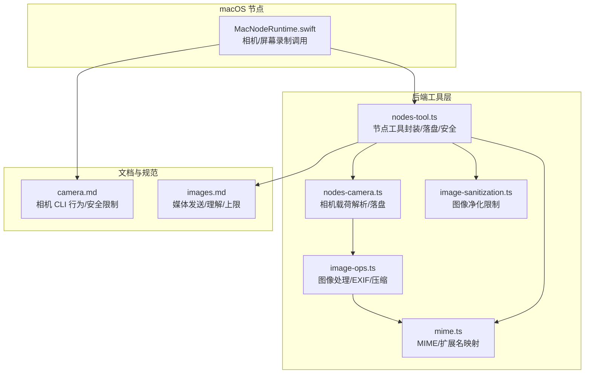
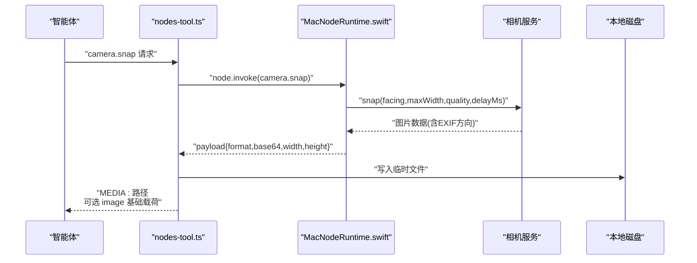
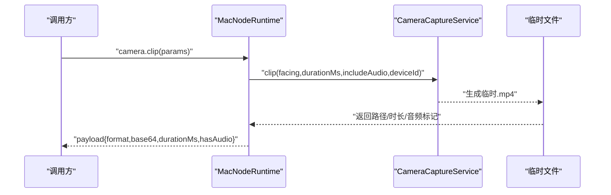
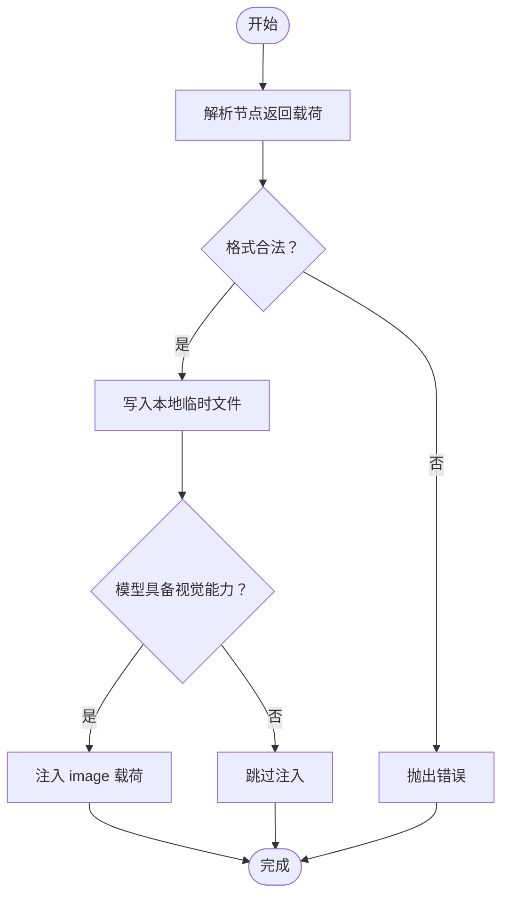
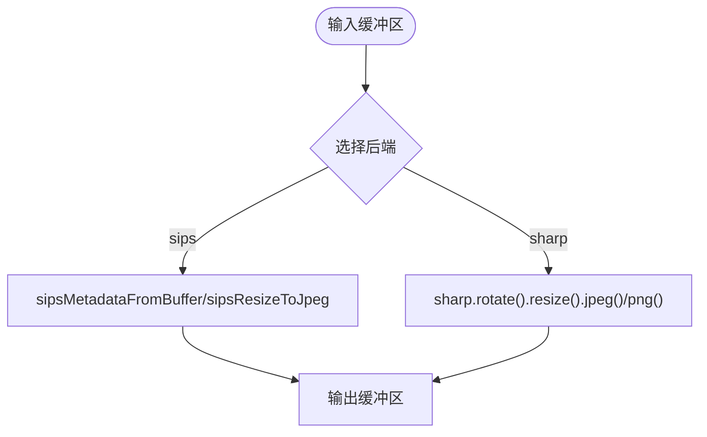
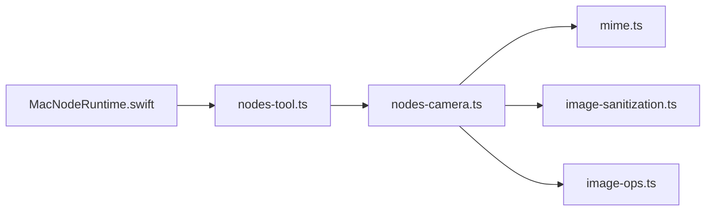

# 图像处理

<cite>
**本文引用的文件**
- [src/media/image-ops.ts](file://src/media/image-ops.ts)
- [apps/macos/Sources/OpenClaw/NodeMode/MacNodeRuntime.swift](file://apps/macos/Sources/OpenClaw/NodeMode/MacNodeRuntime.swift)
- [src/agents/tools/nodes-tool.ts](file://src/agents/tools/nodes-tool.ts)
- [src/cli/nodes-camera.ts](file://src/cli/nodes-camera.ts)
- [src/media/mime.ts](file://src/media/mime.ts)
- [src/agents/image-sanitization.ts](file://src/agents/image-sanitization.ts)
- [docs/zh-CN/nodes/camera.md](file://docs/zh-CN/nodes/camera.md)
- [docs/zh-CN/nodes/images.md](file://docs/zh-CN/nodes/images.md)
</cite>

## 目录

1. [简介](#简介)
2. [项目结构](#项目结构)
3. [核心组件](#核心组件)
4. [架构总览](#架构总览)
5. [详细组件分析](#详细组件分析)
6. [依赖关系分析](#依赖关系分析)
7. [性能考量](#性能考量)
8. [故障排查指南](#故障排查指南)
9. [结论](#结论)
10. [附录](#附录)

## 简介

本文件面向 macOS 节点的图像处理能力，系统性阐述从“图像捕获—存储—传输—质量控制—元数据与地理信息—安全与访问控制—兼容性与性能优化”的完整链路。重点覆盖：

- 图像捕获与视频录制（相机快照与视频片段）
- 存储与传输（本地文件与 base64 载荷）
- 格式支持、压缩与质量控制（JPEG/PNG/HEIC/MP4 等）
- 元数据与 EXIF 处理、地理位置信息
- 图像增强与滤镜（概念性说明）、批量处理
- 安全扫描、隐私保护与访问控制
- 不同图像格式兼容性、性能优化策略与存储空间管理

## 项目结构

围绕 macOS 节点的图像处理，涉及以下关键模块：

- Swift/macOS 节点侧：负责调用相机服务、执行拍摄与录制、生成媒体载荷
- Node.js 后端工具层：负责解析与落盘、安全校验、媒体通道集成
- 媒体处理库：负责尺寸调整、格式转换、EXIF 归一化、PNG 压缩等
- MIME 类型与格式映射：统一识别与输出
- 文档与规范：定义 CLI 行为、安全限制与媒体上限

**图表来源**

- [apps/macos/Sources/OpenClaw/NodeMode/MacNodeRuntime.swift:188-250](file://apps/macos/Sources/OpenClaw/NodeMode/MacNodeRuntime.swift#L188-L250)
- [src/agents/tools/nodes-tool.ts:239-331](file://src/agents/tools/nodes-tool.ts#L239-L331)
- [src/cli/nodes-camera.ts:18-58](file://src/cli/nodes-camera.ts#L18-L58)
- [src/media/image-ops.ts:26-31](file://src/media/image-ops.ts#L26-L31)
- [src/media/mime.ts:167-188](file://src/media/mime.ts#L167-L188)
- [src/agents/image-sanitization.ts:11-17](file://src/agents/image-sanitization.ts#L11-L17)
- [docs/zh-CN/nodes/camera.md:127-163](file://docs/zh-CN/nodes/camera.md#L127-L163)
- [docs/zh-CN/nodes/images.md:35-41](file://docs/zh-CN/nodes/images.md#L35-L41)

**章节来源**

- [apps/macos/Sources/OpenClaw/NodeMode/MacNodeRuntime.swift:188-250](file://apps/macos/Sources/OpenClaw/NodeMode/MacNodeRuntime.swift#L188-L250)
- [src/agents/tools/nodes-tool.ts:239-331](file://src/agents/tools/nodes-tool.ts#L239-L331)
- [src/cli/nodes-camera.ts:18-58](file://src/cli/nodes-camera.ts#L18-L58)
- [src/media/image-ops.ts:26-31](file://src/media/image-ops.ts#L26-L31)
- [src/media/mime.ts:167-188](file://src/media/mime.ts#L167-L188)
- [src/agents/image-sanitization.ts:11-17](file://src/agents/image-sanitization.ts#L11-L17)
- [docs/zh-CN/nodes/camera.md:127-163](file://docs/zh-CN/nodes/camera.md#L127-L163)
- [docs/zh-CN/nodes/images.md:35-41](file://docs/zh-CN/nodes/images.md#L35-L41)

## 核心组件

- macOS 相机与屏幕录制服务：负责实际采集、生成媒体载荷（base64 或 URL），并进行基础参数校验与权限检查
- 节点工具层：封装节点命令调用、解析相机/屏幕载荷、落盘到本地临时目录、注入到智能体回复内容中
- 媒体处理库：提供尺寸调整、EXIF 方向归一化、HEIC 转 JPEG、PNG 压缩、透明度检测等能力
- MIME 与格式映射：统一识别输入媒体类型，输出对应 MIME 与扩展名
- 图像净化与安全限制：根据配置对图像维度与体积进行限制，防止上下文膨胀
- 文档与规范：定义 CLI 行为、安全限制、媒体上限与渠道处理规则

**章节来源**

- [apps/macos/Sources/OpenClaw/NodeMode/MacNodeRuntime.swift:188-250](file://apps/macos/Sources/OpenClaw/NodeMode/MacNodeRuntime.swift#L188-L250)
- [src/agents/tools/nodes-tool.ts:239-331](file://src/agents/tools/nodes-tool.ts#L239-L331)
- [src/media/image-ops.ts:313-364](file://src/media/image-ops.ts#L313-L364)
- [src/media/mime.ts:167-188](file://src/media/mime.ts#L167-L188)
- [src/agents/image-sanitization.ts:11-17](file://src/agents/image-sanitization.ts#L11-L17)
- [docs/zh-CN/nodes/camera.md:127-163](file://docs/zh-CN/nodes/camera.md#L127-L163)
- [docs/zh-CN/nodes/images.md:35-41](file://docs/zh-CN/nodes/images.md#L35-L41)

## 架构总览

下图展示从 macOS 节点发起相机快照到最终落盘与返回给智能体的整体流程。

**图表来源**

- [apps/macos/Sources/OpenClaw/NodeMode/MacNodeRuntime.swift:198-219](file://apps/macos/Sources/OpenClaw/NodeMode/MacNodeRuntime.swift#L198-L219)
- [src/agents/tools/nodes-tool.ts:277-331](file://src/agents/tools/nodes-tool.ts#L277-L331)
- [src/cli/nodes-camera.ts:193-210](file://src/cli/nodes-camera.ts#L193-L210)

## 详细组件分析

### 组件A：macOS 节点相机与屏幕录制

- 功能职责
  - 相机快照：支持前置/后置选择、最大宽度、质量、延迟拍摄、设备 ID 指定
  - 相机视频：支持时长、是否包含音频、格式（MP4）
  - 屏幕录制：MP4 格式，帧率、屏幕索引、是否包含音频
  - 权限与安全：相机/麦克风/屏幕录制权限检查，错误码与提示
- 关键参数与行为
  - 快照默认最大宽度与延迟时间，快照载荷会进行压缩以控制 base64 尺寸
  - 视频片段时长上限，避免超大节点载荷
- 数据流
  - 节点侧生成 base64 或临时文件路径，经网关返回给工具层

**图表来源**

- [apps/macos/Sources/OpenClaw/NodeMode/MacNodeRuntime.swift:220-242](file://apps/macos/Sources/OpenClaw/NodeMode/MacNodeRuntime.swift#L220-L242)

**章节来源**

- [apps/macos/Sources/OpenClaw/NodeMode/MacNodeRuntime.swift:188-250](file://apps/macos/Sources/OpenClaw/NodeMode/MacNodeRuntime.swift#L188-L250)
- [docs/zh-CN/nodes/camera.md:127-163](file://docs/zh-CN/nodes/camera.md#L127-L163)

### 组件B：节点工具层（相机/屏幕/通知/位置）

- 功能职责
  - 解析节点命令返回的相机快照/视频载荷
  - 将 base64 或 URL 写入本地临时文件，生成 MEDIA/FILE 标记
  - 可选将图像数据注入到智能体回复内容中（当模型具备视觉能力）
  - 支持屏幕录制、通知、位置等其他节点命令
- 安全与合规
  - 对相机 URL 载荷进行 HTTPS 与主机白名单校验
  - 对相机快照格式进行白名单校验（jpg/jpeg/png）

**图表来源**

- [src/agents/tools/nodes-tool.ts:290-331](file://src/agents/tools/nodes-tool.ts#L290-L331)
- [src/cli/nodes-camera.ts:193-210](file://src/cli/nodes-camera.ts#L193-L210)

**章节来源**

- [src/agents/tools/nodes-tool.ts:239-331](file://src/agents/tools/nodes-tool.ts#L239-L331)
- [src/cli/nodes-camera.ts:193-210](file://src/cli/nodes-camera.ts#L193-L210)

### 组件C：媒体处理库（尺寸调整、EXIF、格式转换）

- 功能职责
  - 自动选择后端：在 macOS 且满足条件时优先使用 sips；否则使用 sharp
  - EXIF 方向归一化：读取 EXIF 方向并旋转/翻转，确保像素方向正确
  - 尺寸调整：按最大边缩放，支持 withoutEnlargement 控制
  - 格式转换：HEIC 转 JPEG；PNG 保留透明度并可压缩
  - PNG 优化：尝试多种尺寸与压缩等级组合，找到不超过阈值的最小文件
- 关键算法与复杂度
  - sips 路径：O(1) 临时文件 IO，适合系统原生高效处理
  - sharp 路径：基于 libvips 的管线处理，复杂度与像素数近似线性
- 性能要点
  - sips 在 macOS 上默认启用，减少 Node.js 依赖
  - withoutEnlargement 逻辑避免不必要的放大

**图表来源**

- [src/media/image-ops.ts:26-31](file://src/media/image-ops.ts#L26-L31)
- [src/media/image-ops.ts:313-356](file://src/media/image-ops.ts#L313-L356)
- [src/media/image-ops.ts:358-364](file://src/media/image-ops.ts#L358-L364)
- [src/media/image-ops.ts:387-407](file://src/media/image-ops.ts#L387-L407)

**章节来源**

- [src/media/image-ops.ts:26-31](file://src/media/image-ops.ts#L26-L31)
- [src/media/image-ops.ts:313-364](file://src/media/image-ops.ts#L313-L364)
- [src/media/image-ops.ts:387-407](file://src/media/image-ops.ts#L387-L407)

### 组件D：MIME 类型与格式映射

- 功能职责
  - 从缓冲区、HTTP 头、文件扩展名推断 MIME 类型
  - 提供格式到 MIME 的映射，以及媒体种类判定
- 使用场景
  - 工具层根据格式选择合适的扩展名与 MIME，用于落盘与回复注入

**章节来源**

- [src/media/mime.ts:167-188](file://src/media/mime.ts#L167-L188)

### 组件E：图像净化与安全限制

- 功能职责
  - 根据配置解析图像最大边长限制，避免上下文膨胀
  - 与工具层结合，对返回的图像进行维度与体积约束
- 默认策略
  - 默认最大边长与默认最大字节数由配置驱动

**章节来源**

- [src/agents/image-sanitization.ts:11-17](file://src/agents/image-sanitization.ts#L11-L17)
- [src/agents/tools/nodes-tool.ts](file://src/agents/tools/nodes-tool.ts#L330)

### 组件F：文档与规范（CLI 行为、安全限制、媒体上限）

- 相机 CLI
  - 快照默认最大宽度、延迟拍摄、base64 压缩限制
  - 视频片段时长上限、权限要求
- 媒体发送与理解
  - 图像重采样与压缩、最大边与体积上限
  - 媒体理解的体积上限与多附件处理

**章节来源**

- [docs/zh-CN/nodes/camera.md:127-163](file://docs/zh-CN/nodes/camera.md#L127-L163)
- [docs/zh-CN/nodes/images.md:35-41](file://docs/zh-CN/nodes/images.md#L35-L41)

## 依赖关系分析

- 节点侧依赖相机/屏幕录制服务，返回 base64 或文件路径
- 工具层依赖节点侧命令接口，负责落盘与内容注入
- 媒体处理库独立于平台，通过环境变量与运行时判断选择后端
- MIME 映射与图像净化为通用工具，贯穿输入/输出环节

**图表来源**

- [apps/macos/Sources/OpenClaw/NodeMode/MacNodeRuntime.swift:188-250](file://apps/macos/Sources/OpenClaw/NodeMode/MacNodeRuntime.swift#L188-L250)
- [src/agents/tools/nodes-tool.ts:239-331](file://src/agents/tools/nodes-tool.ts#L239-L331)
- [src/cli/nodes-camera.ts:193-210](file://src/cli/nodes-camera.ts#L193-L210)
- [src/media/mime.ts:167-188](file://src/media/mime.ts#L167-L188)
- [src/agents/image-sanitization.ts:11-17](file://src/agents/image-sanitization.ts#L11-L17)
- [src/media/image-ops.ts:26-31](file://src/media/image-ops.ts#L26-L31)

**章节来源**

- [apps/macos/Sources/OpenClaw/NodeMode/MacNodeRuntime.swift:188-250](file://apps/macos/Sources/OpenClaw/NodeMode/MacNodeRuntime.swift#L188-L250)
- [src/agents/tools/nodes-tool.ts:239-331](file://src/agents/tools/nodes-tool.ts#L239-L331)
- [src/cli/nodes-camera.ts:193-210](file://src/cli/nodes-camera.ts#L193-L210)
- [src/media/image-ops.ts:26-31](file://src/media/image-ops.ts#L26-L31)

## 性能考量

- 后端选择
  - macOS 且满足条件时优先使用 sips，减少 Node.js 依赖，提升处理效率
- 缩放与压缩
  - 优先在 sips 路径下进行 EXIF 归一化与缩放，避免 sharp 的额外开销
  - PNG 压缩采用网格搜索最优尺寸与压缩等级，平衡体积与速度
- I/O 与缓存
  - 临时文件写入与清理遵循最小化原则，避免多余拷贝
- 体积控制
  - 快照载荷压缩与工具层落盘，配合图像净化限制，降低上下文开销

[本节为通用性能建议，不直接分析具体文件]

## 故障排查指南

- 相机/屏幕录制权限不足
  - 现象：调用失败并提示权限
  - 处理：在系统设置中授予相机/麦克风/屏幕录制权限
- 快照 base64 过大
  - 现象：超过 5MB 限制
  - 处理：降低最大宽度或质量，或改用文件路径返回
- 视频片段时长超限
  - 现象：超过上限导致失败
  - 处理：缩短时长或分段录制
- 载荷格式不支持
  - 现象：返回格式不在白名单
  - 处理：确认格式为 jpg/jpeg/png
- URL 载荷校验失败
  - 现象：HTTPS 协议或主机不匹配
  - 处理：确保 URL 为 https 且与节点主机一致

**章节来源**

- [docs/zh-CN/nodes/camera.md:147-163](file://docs/zh-CN/nodes/camera.md#L147-L163)
- [src/cli/nodes-camera.ts:199-210](file://src/cli/nodes-camera.ts#L199-L210)
- [src/agents/tools/nodes-tool.ts:290-298](file://src/agents/tools/nodes-tool.ts#L290-L298)

## 结论

macOS 节点图像处理能力以“节点采集—工具层落盘—媒体库处理—MIME 映射—安全净化”为主线，形成闭环。通过 sips/sharp 双后端选择、EXIF 归一化、体积与尺寸控制，兼顾性能与兼容性。配合严格的权限与载荷校验，保障安全性与稳定性。未来可在滤镜与批量处理方面进一步扩展，同时持续优化存储与网络传输策略。

[本节为总结性内容，不直接分析具体文件]

## 附录

### 图像格式支持与压缩算法

- 支持格式
  - 图像：JPEG、PNG、HEIC、WebP、GIF
  - 视频：MP4（MOV 作为 QuickTime 容器亦常见）
- 压缩与质量控制
  - JPEG：可调节质量，sips/sharp 均支持
  - PNG：保留透明度，可调节压缩等级
  - HEIC：转换为 JPEG 以便跨平台兼容
- EXIF 与方向
  - 自动读取 EXIF 方向并归一化，保证像素方向正确

**章节来源**

- [src/media/mime.ts:6-35](file://src/media/mime.ts#L6-L35)
- [src/media/image-ops.ts:313-364](file://src/media/image-ops.ts#L313-L364)
- [src/media/image-ops.ts:472-482](file://src/media/image-ops.ts#L472-L482)

### 元数据提取与地理位置标记

- EXIF 方向与尺寸
  - 通过 EXIF Orientation 与 sips/sharp 旋转/翻转，确保显示方向正确
- 地理位置
  - 位置命令返回经纬度、海拔、速度、朝向等，可用于地理标记与轨迹分析
- 媒体理解上限
  - 图像默认 10MB，音频 20MB，视频 50MB，超限跳过理解但仍可回复

**章节来源**

- [src/media/image-ops.ts:39-134](file://src/media/image-ops.ts#L39-L134)
- [apps/macos/Sources/OpenClaw/NodeMode/MacNodeRuntime.swift:252-317](file://apps/macos/Sources/OpenClaw/NodeMode/MacNodeRuntime.swift#L252-L317)
- [docs/zh-CN/nodes/images.md:68-73](file://docs/zh-CN/nodes/images.md#L68-L73)

### 图像增强、滤镜与批量处理

- 增强与滤镜
  - 代码库未内置图像滤镜或风格化增强；如需可扩展至现有媒体处理管线
- 批量处理
  - 工具层支持多前置/后置拍摄与批量落盘，便于后续统一处理

[本节为概念性说明，不直接分析具体文件]

### 安全扫描、隐私保护与访问控制

- 访问控制
  - 相机/麦克风/屏幕录制权限必须显式授权
  - 节点侧对命令进行开关控制（如 CAMERA_DISABLED）
- 载荷安全
  - 相机 URL 载荷仅允许 HTTPS 且主机白名单匹配
  - 快照 base64 压缩以控制体积
- 隐私保护
  - 严格限制节点载荷体积与时长，避免敏感信息外泄
  - 工具层对图像维度与体积进行净化限制

**章节来源**

- [docs/zh-CN/nodes/camera.md:147-151](file://docs/zh-CN/nodes/camera.md#L147-L151)
- [src/cli/nodes-camera.ts:77-177](file://src/cli/nodes-camera.ts#L77-L177)
- [src/agents/image-sanitization.ts:11-17](file://src/agents/image-sanitization.ts#L11-L17)

### 兼容性、性能优化与存储管理

- 兼容性
  - macOS 优先 sips，其他平台使用 sharp；HEIC 统一转换为 JPEG
- 性能优化
  - sips 路径减少依赖与内存占用；PNG 压缩网格搜索最优参数
- 存储管理
  - 临时文件最小化生命周期；快照与视频均写入本地临时目录

**章节来源**

- [src/media/image-ops.ts:26-31](file://src/media/image-ops.ts#L26-L31)
- [src/media/image-ops.ts:409-466](file://src/media/image-ops.ts#L409-L466)
- [src/cli/nodes-camera.ts:60-75](file://src/cli/nodes-camera.ts#L60-L75)
