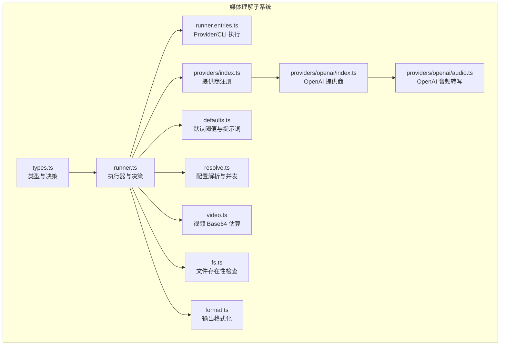
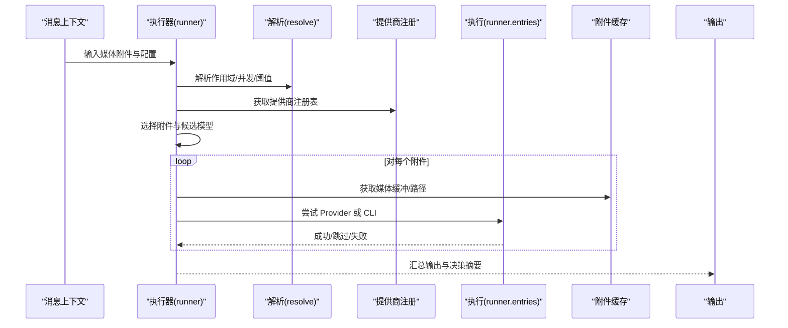
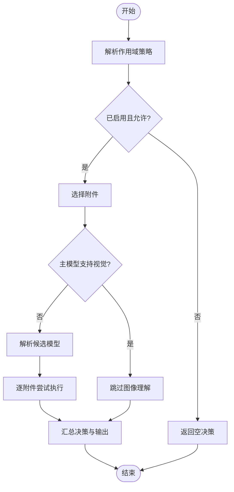
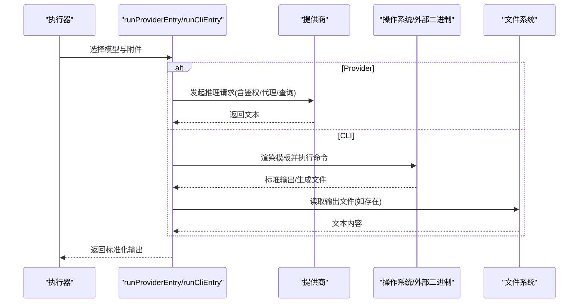
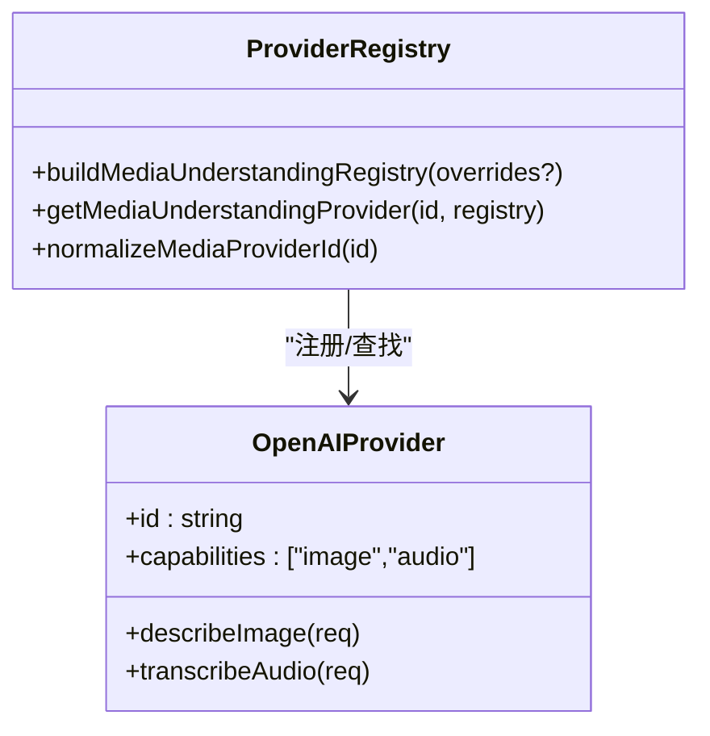
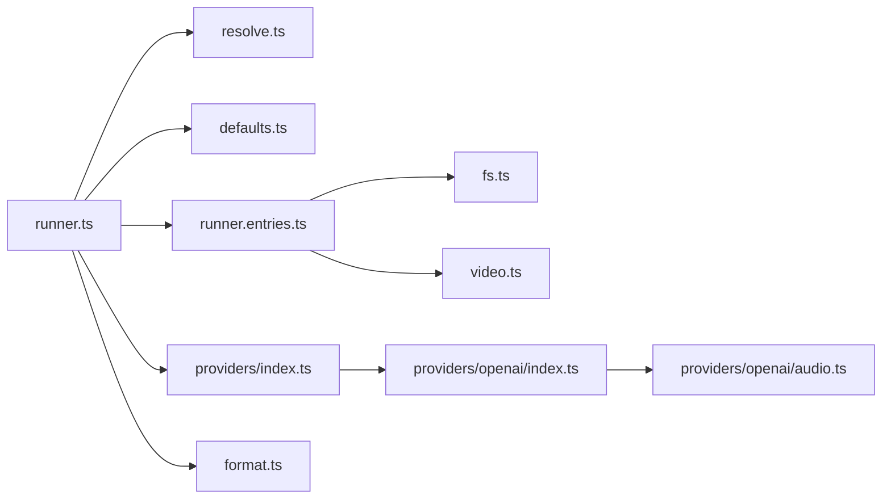

# 媒体理解

<cite>
**本文引用的文件**
- [src/media-understanding/types.ts](file://src/media-understanding/types.ts)
- [src/media-understanding/runner.ts](file://src/media-understanding/runner.ts)
- [src/media-understanding/runner.entries.ts](file://src/media-understanding/runner.entries.ts)
- [src/media-understanding/providers/index.ts](file://src/media-understanding/providers/index.ts)
- [src/media-understanding/providers/openai/index.ts](file://src/media-understanding/providers/openai/index.ts)
- [src/media-understanding/providers/openai/audio.ts](file://src/media-understanding/providers/openai/audio.ts)
- [src/media-understanding/defaults.ts](file://src/media-understanding/defaults.ts)
- [src/media-understanding/resolve.ts](file://src/media-understanding/resolve.ts)
- [src/media-understanding/video.ts](file://src/media-understanding/video.ts)
- [src/media-understanding/fs.ts](file://src/media-understanding/fs.ts)
- [src/media-understanding/format.ts](file://src/media-understanding/format.ts)
- [docs/nodes/media-understanding.md](file://docs/nodes/media-understanding.md)
- [docs/zh-CN/nodes/media-understanding.md](file://docs/zh-CN/nodes/media-understanding.md)
</cite>

## 目录

1. [简介](#简介)
2. [项目结构](#项目结构)
3. [核心组件](#核心组件)
4. [架构总览](#架构总览)
5. [详细组件分析](#详细组件分析)
6. [依赖关系分析](#依赖关系分析)
7. [性能考量](#性能考量)
8. [故障排查指南](#故障排查指南)
9. [结论](#结论)
10. [附录](#附录)

## 简介

本文件面向 macOS 节点的“媒体理解”能力，系统性阐述图像识别、语音转文字与视频描述（多模态内容分析）的实现方式，覆盖 AI 模型集成、本地 CLI 推理加速、结果缓存与格式化输出、内容分类与标签生成、语义理解、多模态融合、上下文感知与个性化推荐配置，并提供 API 使用示例、性能监控与错误处理策略，以及不同 AI 模型支持情况、计算资源需求与隐私保护建议。

## 项目结构

媒体理解子系统位于 src/media-understanding 目录，围绕“能力选择—模型解析—执行—结果聚合”的流水线组织，关键模块包括：

- 类型与决策：定义媒体类型、能力、输出、决策等核心数据结构
- 执行器：统一调度 Provider 与本地 CLI 模型，按策略选择与回退
- 提供商注册：内置多家模型提供商（如 OpenAI、Google、Anthropic 等）
- 配置解析：从全局配置、能力级配置、模型条目中合并参数
- 输出格式化：将多路输出整合为可读文本或结构化摘要

图表来源

- [src/media-understanding/types.ts:1-116](file://src/media-understanding/types.ts#L1-L116)
- [src/media-understanding/runner.ts:1-806](file://src/media-understanding/runner.ts#L1-L806)
- [src/media-understanding/runner.entries.ts:1-666](file://src/media-understanding/runner.entries.ts#L1-L666)
- [src/media-understanding/providers/index.ts:1-64](file://src/media-understanding/providers/index.ts#L1-L64)
- [src/media-understanding/providers/openai/index.ts:1-11](file://src/media-understanding/providers/openai/index.ts#L1-L11)
- [src/media-understanding/providers/openai/audio.ts:1-69](file://src/media-understanding/providers/openai/audio.ts#L1-L69)
- [src/media-understanding/defaults.ts:1-70](file://src/media-understanding/defaults.ts#L1-L70)
- [src/media-understanding/resolve.ts:1-188](file://src/media-understanding/resolve.ts#L1-L188)
- [src/media-understanding/video.ts:1-11](file://src/media-understanding/video.ts#L1-L11)
- [src/media-understanding/fs.ts:1-14](file://src/media-understanding/fs.ts#L1-L14)
- [src/media-understanding/format.ts:47-98](file://src/media-understanding/format.ts#L47-L98)

章节来源

- [src/media-understanding/types.ts:1-116](file://src/media-understanding/types.ts#L1-L116)
- [src/media-understanding/runner.ts:1-806](file://src/media-understanding/runner.ts#L1-L806)
- [src/media-understanding/runner.entries.ts:1-666](file://src/media-understanding/runner.entries.ts#L1-L666)
- [src/media-understanding/providers/index.ts:1-64](file://src/media-understanding/providers/index.ts#L1-L64)
- [src/media-understanding/providers/openai/index.ts:1-11](file://src/media-understanding/providers/openai/index.ts#L1-L11)
- [src/media-understanding/providers/openai/audio.ts:1-69](file://src/media-understanding/providers/openai/audio.ts#L1-L69)
- [src/media-understanding/defaults.ts:1-70](file://src/media-understanding/defaults.ts#L1-L70)
- [src/media-understanding/resolve.ts:1-188](file://src/media-understanding/resolve.ts#L1-L188)
- [src/media-understanding/video.ts:1-11](file://src/media-understanding/video.ts#L1-L11)
- [src/media-understanding/fs.ts:1-14](file://src/media-understanding/fs.ts#L1-L14)
- [src/media-understanding/format.ts:47-98](file://src/media-understanding/format.ts#L47-L98)

## 核心组件

- 能力与输出
  - 支持能力：图像、音频（转写）、视频（描述）
  - 输出结构：包含 kind（类型）、附件索引、文本、提供商与模型信息
- 决策与回退
  - 优先使用显式配置的模型条目；若为空，则自动探测本地 CLI 或云端提供商密钥
  - 对于图像理解，若主模型具备视觉能力则直接注入图像到对话上下文，跳过独立理解步骤
- 执行路径
  - Provider 路径：通过提供商 SDK/HTTP 完成推理
  - CLI 路径：调用本地二进制（如 whisper/sherpa-onnx/gemini 等），读取标准输出或生成的文本文件
- 配置解析
  - 合并全局、能力级、模型条目与活动模型的设置，计算超时、最大字节数、字符数与提示词
- 输出格式化
  - 将多路输出按类型分节，支持音频转写拼接与多附件编号

章节来源

- [src/media-understanding/types.ts:1-116](file://src/media-understanding/types.ts#L1-L116)
- [src/media-understanding/runner.ts:659-806](file://src/media-understanding/runner.ts#L659-L806)
- [src/media-understanding/runner.entries.ts:416-666](file://src/media-understanding/runner.entries.ts#L416-L666)
- [src/media-understanding/resolve.ts:101-188](file://src/media-understanding/resolve.ts#L101-L188)
- [src/media-understanding/format.ts:47-98](file://src/media-understanding/format.ts#L47-L98)

## 架构总览

媒体理解在运行时遵循如下流程：根据消息上下文选择附件，解析作用域策略，构建模型候选列表（显式配置→自动探测→提供商密钥），分别对每个附件尝试 Provider 或 CLI 执行，收集成功输出并汇总决策摘要。

图表来源

- [src/media-understanding/runner.ts:659-806](file://src/media-understanding/runner.ts#L659-L806)
- [src/media-understanding/runner.entries.ts:416-666](file://src/media-understanding/runner.entries.ts#L416-L666)
- [src/media-understanding/resolve.ts:74-147](file://src/media-understanding/resolve.ts#L74-L147)

## 详细组件分析

### 组件A：执行器与决策（runner）

- 功能要点
  - 依据工具配置与作用域策略决定是否启用某能力
  - 自动探测本地 CLI（whisper/sherpa-onnx/gemini）与云端提供商密钥
  - 当主模型具备视觉能力时，跳过图像理解以减少开销
  - 对每个附件记录尝试轨迹与最终选择，便于审计与重试
- 关键行为
  - 附件选择与大小/时间限制校验
  - Provider/CLI 回退与错误归类（跳过/失败）
  - 决策摘要格式化与日志输出

图表来源

- [src/media-understanding/runner.ts:659-806](file://src/media-understanding/runner.ts#L659-L806)

章节来源

- [src/media-understanding/runner.ts:659-806](file://src/media-understanding/runner.ts#L659-L806)

### 组件B：Provider/CLI 执行（runner.entries）

- Provider 执行
  - 图像：调用提供商 describeImage，支持代理环境变量透传
  - 音频：调用 transcribeAudio，支持语言、提示词、查询参数与密钥轮换
  - 视频：进行 Base64 大小估算与上限控制，避免过大载荷
- CLI 执行
  - 渲染模板参数（媒体路径、输出目录、提示词等），执行命令并解析输出
  - 支持从标准输出或本地生成的 txt 文件提取文本
- 错误处理
  - 音频最小字节阈值校验，过小直接跳过
  - 视频 Base64 超限跳过
  - 可配置超时与输出缓冲上限

图表来源

- [src/media-understanding/runner.entries.ts:416-666](file://src/media-understanding/runner.entries.ts#L416-L666)
- [src/media-understanding/video.ts:1-11](file://src/media-understanding/video.ts#L1-L11)

章节来源

- [src/media-understanding/runner.entries.ts:416-666](file://src/media-understanding/runner.entries.ts#L416-L666)
- [src/media-understanding/video.ts:1-11](file://src/media-understanding/video.ts#L1-L11)

### 组件C：提供商注册与 OpenAI 集成

- 注册机制
  - 内置多家提供商，支持按 ID 归一化（如 gemini→google）
  - 允许通过覆盖参数扩展或替换提供商能力
- OpenAI 集成
  - 提供图像描述与音频转写能力
  - 音频转写使用 OpenAI 兼容接口，支持语言、提示词与私有网络访问

图表来源

- [src/media-understanding/providers/index.ts:1-64](file://src/media-understanding/providers/index.ts#L1-L64)
- [src/media-understanding/providers/openai/index.ts:1-11](file://src/media-understanding/providers/openai/index.ts#L1-L11)
- [src/media-understanding/providers/openai/audio.ts:1-69](file://src/media-understanding/providers/openai/audio.ts#L1-L69)

章节来源

- [src/media-understanding/providers/index.ts:1-64](file://src/media-understanding/providers/index.ts#L1-L64)
- [src/media-understanding/providers/openai/index.ts:1-11](file://src/media-understanding/providers/openai/index.ts#L1-L11)
- [src/media-understanding/providers/openai/audio.ts:1-69](file://src/media-understanding/providers/openai/audio.ts#L1-L69)

### 组件D：配置解析与默认值（resolve/defaults）

- 默认阈值
  - 最大字节数、字符数、超时秒数、提示词、并发度、音频最小字节
- 参数解析
  - 合并模型条目、能力级配置与全局配置，计算最大字节数、字符数、超时与提示词
  - 作用域决策：基于会话键、通道与聊天类型判断允许/拒绝
- 并发度
  - 默认并发为 2，可由配置调整

章节来源

- [src/media-understanding/defaults.ts:1-70](file://src/media-understanding/defaults.ts#L1-L70)
- [src/media-understanding/resolve.ts:19-147](file://src/media-understanding/resolve.ts#L19-L147)

### 组件E：输出格式化（format）

- 将多路输出按类型分节展示，支持音频转写拼接与多附件编号
- 在单附件场景下可直接返回纯文本

章节来源

- [src/media-understanding/format.ts:47-98](file://src/media-understanding/format.ts#L47-L98)

## 依赖关系分析

- 模块耦合
  - runner 依赖 resolve/defaults/providers/runner.entries/format 等模块
  - runner.entries 依赖 fs、process/exec、代理与临时目录等基础设施
- 外部依赖
  - Provider HTTP 接口（如 OpenAI 音频转写）
  - 本地二进制（whisper/sherpa-onnx/gemini 等）
- 潜在循环依赖
  - 通过导出函数而非互相 import 避免循环

图表来源

- [src/media-understanding/runner.ts:1-806](file://src/media-understanding/runner.ts#L1-L806)
- [src/media-understanding/resolve.ts:1-188](file://src/media-understanding/resolve.ts#L1-L188)
- [src/media-understanding/defaults.ts:1-70](file://src/media-understanding/defaults.ts#L1-L70)
- [src/media-understanding/providers/index.ts:1-64](file://src/media-understanding/providers/index.ts#L1-L64)
- [src/media-understanding/runner.entries.ts:1-666](file://src/media-understanding/runner.entries.ts#L1-L666)
- [src/media-understanding/fs.ts:1-14](file://src/media-understanding/fs.ts#L1-L14)
- [src/media-understanding/video.ts:1-11](file://src/media-understanding/video.ts#L1-L11)
- [src/media-understanding/providers/openai/index.ts:1-11](file://src/media-understanding/providers/openai/index.ts#L1-L11)
- [src/media-understanding/providers/openai/audio.ts:1-69](file://src/media-understanding/providers/openai/audio.ts#L1-L69)
- [src/media-understanding/format.ts:47-98](file://src/media-understanding/format.ts#L47-L98)

## 性能考量

- 推理加速
  - 本地 CLI：优先使用 sherpa-onnx/offline、whisper/whisper-cli，减少网络往返
  - Provider：启用代理与密钥轮换，避免单点瓶颈
- 资源控制
  - 严格的最大字节数与字符数限制，防止超大媒体导致内存/带宽压力
  - 视频 Base64 估算与上限控制，避免过大的编码负载
- 并发与缓存
  - 默认并发 2，可根据硬件能力提升；注意磁盘与 CPU 的平衡
  - 附件缓存减少重复 IO，CLI 输出目录在临时空间清理

章节来源

- [src/media-understanding/defaults.ts:14-23](file://src/media-understanding/defaults.ts#L14-L23)
- [src/media-understanding/video.ts:3-10](file://src/media-understanding/video.ts#L3-L10)
- [src/media-understanding/runner.entries.ts:619-665](file://src/media-understanding/runner.entries.ts#L619-L665)
- [src/media-understanding/resolve.ts:141-147](file://src/media-understanding/resolve.ts#L141-L147)

## 故障排查指南

- 常见错误与跳过原因
  - 音频过小：小于最小字节阈值会被跳过
  - 超时/网络问题：调整超时与代理配置
  - 视频 Base64 超限：减小媒体或增大阈值
  - 无可用模型：检查显式配置、自动探测与提供商密钥
- 日志与审计
  - 详细决策摘要包含所选模型、尝试轨迹与原因，便于定位问题
- 本地 CLI 诊断
  - 确认二进制可执行、模型文件存在、输出目录权限
- Provider 问题
  - 校验鉴权头、基础 URL、查询参数与语言设置

章节来源

- [src/media-understanding/runner.entries.ts:406-414](file://src/media-understanding/runner.entries.ts#L406-L414)
- [src/media-understanding/runner.entries.ts:550-555](file://src/media-understanding/runner.entries.ts#L550-L555)
- [src/media-understanding/runner.entries.ts:638-644](file://src/media-understanding/runner.entries.ts#L638-L644)
- [src/media-understanding/runner.entries.ts:288-313](file://src/media-understanding/runner.entries.ts#L288-L313)

## 结论

该媒体理解子系统在 macOS 节点上提供了统一的多模态理解能力：通过 Provider 与本地 CLI 的双轨执行、严格的资源与作用域控制、完善的错误处理与审计日志，实现了高鲁棒性的图像识别、语音转文字与视频描述。结合配置解析与输出格式化，可满足从个人助理到企业自动化场景的多样化需求。

## 附录

### 多模态融合与上下文感知

- 图像理解跳过策略：当主模型具备视觉能力时，直接将图像注入对话上下文，避免重复理解
- 提示词与字符数：针对不同能力动态拼接提示词与长度约束，保证输出可控
- 作用域策略：基于会话键、通道与聊天类型进行细粒度开关控制

章节来源

- [src/media-understanding/runner.ts:707-741](file://src/media-understanding/runner.ts#L707-L741)
- [src/media-understanding/resolve.ts:24-34](file://src/media-understanding/resolve.ts#L24-L34)
- [src/media-understanding/resolve.ts:74-84](file://src/media-understanding/resolve.ts#L74-L84)

### 个性化推荐与配置方法

- 活动模型与回退：优先使用显式配置的模型条目，其次使用活动模型（若具备对应能力），最后回退至自动探测
- Provider 选项：可在配置中为特定提供商注入额外查询参数与头部
- 并发与阈值：按硬件能力调整并发度与最大字节数/字符数

章节来源

- [src/media-understanding/resolve.ts:149-187](file://src/media-understanding/resolve.ts#L149-L187)
- [src/media-understanding/runner.entries.ts:265-286](file://src/media-understanding/runner.entries.ts#L265-L286)
- [src/media-understanding/resolve.ts:141-147](file://src/media-understanding/resolve.ts#L141-L147)

### 媒体理解 API 使用示例与最佳实践

- 示例参考
  - 图像描述：通过提供商 describeImage 接口完成
  - 音频转写：通过 OpenAI 兼容接口 transcribeAudio 完成
  - 视频描述：通过提供商 describeVideo 接口完成
- 最佳实践
  - 合理设置超时与最大字节数，避免长时间阻塞
  - 使用代理环境变量确保网络合规
  - 对于大量附件，适当降低并发度并开启缓存

章节来源

- [src/media-understanding/providers/openai/audio.ts:18-68](file://src/media-understanding/providers/openai/audio.ts#L18-L68)
- [src/media-understanding/runner.entries.ts:416-587](file://src/media-understanding/runner.entries.ts#L416-L587)

### 不同 AI 模型的支持情况与资源需求

- 支持的提供商与能力
  - OpenAI：图像描述、音频转写
  - Google：图像/视频描述（通过 google 提供商）
  - Anthropic、Mistral、Groq、Moonshot、Minimax 等：按提供商能力开放
- 本地 CLI
  - whisper/sherpa-onnx/gemini 等，需满足二进制与模型文件存在性
- 资源需求
  - 音频：较小内存占用，受超时与最小字节限制
  - 图像/视频：受最大字节数与字符数限制，注意 Base64 编码膨胀

章节来源

- [src/media-understanding/providers/index.ts:13-24](file://src/media-understanding/providers/index.ts#L13-L24)
- [src/media-understanding/defaults.ts:14-23](file://src/media-understanding/defaults.ts#L14-L23)
- [src/media-understanding/video.ts:3-10](file://src/media-understanding/video.ts#L3-L10)

### 隐私保护与安全

- 本地优先：优先使用本地 CLI 减少外发数据
- 代理与私有网络：通过代理环境变量与私有网络访问控制，避免敏感数据泄露
- 作用域策略：按通道与聊天类型限制能力启用范围

章节来源

- [src/media-understanding/runner.entries.ts:483-485](file://src/media-understanding/runner.entries.ts#L483-L485)
- [src/media-understanding/resolve.ts:74-84](file://src/media-understanding/resolve.ts#L74-L84)
