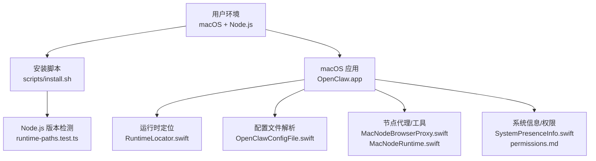
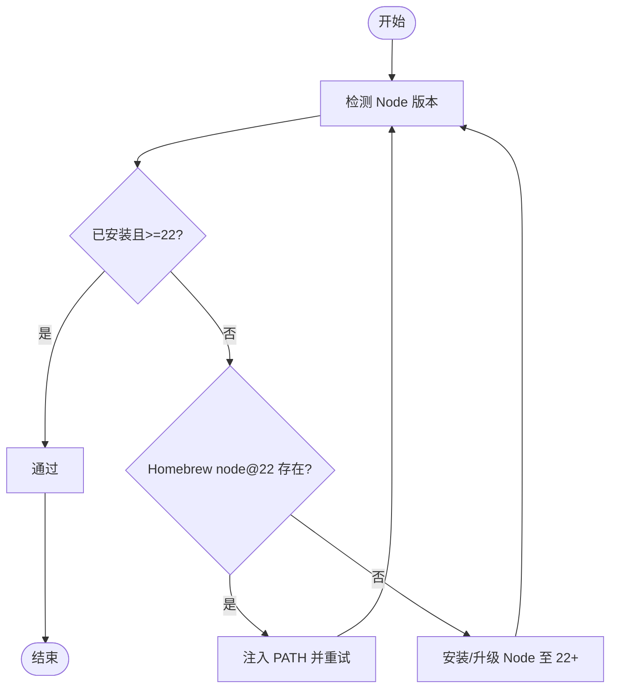
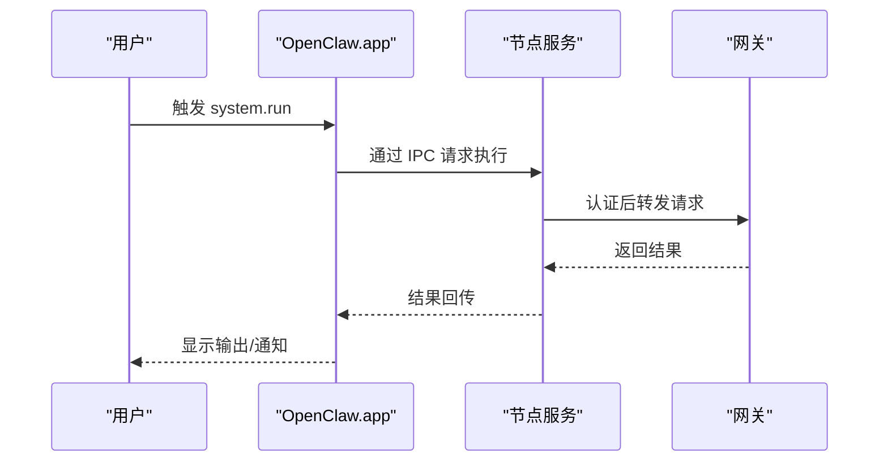
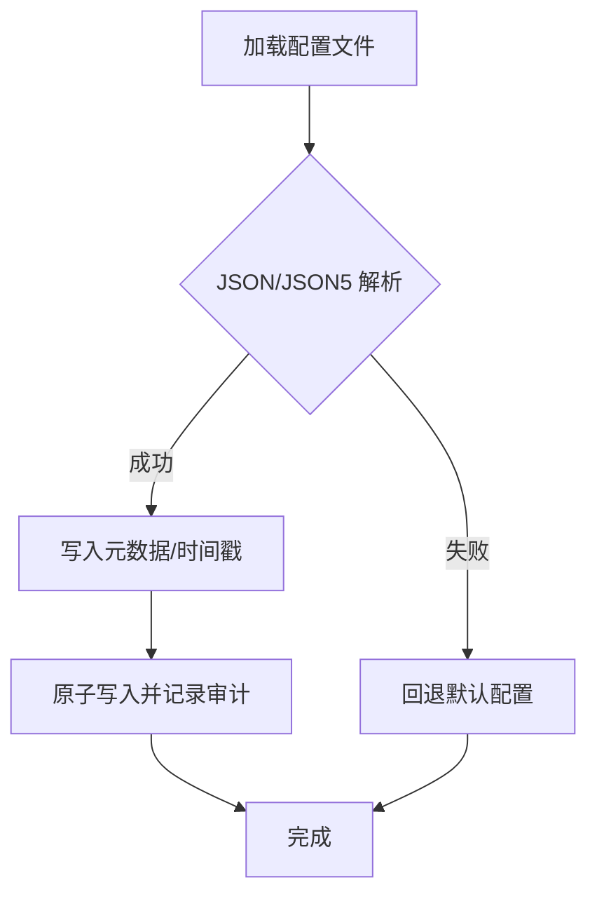
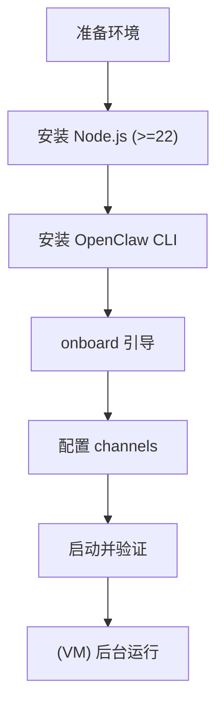
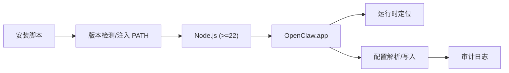

# 安装与配置

<cite>
**本文引用的文件**
- [docs/install/macos-vm.md](file://docs/install/macos-vm.md)
- [docs/platforms/macos.md](file://docs/platforms/macos.md)
- [docs/install/node.md](file://docs/install/node.md)
- [docs/start/onboarding.md](file://docs/start/onboarding.md)
- [docs/help/troubleshooting.md](file://docs/help/troubleshooting.md)
- [docs/platforms/mac/permissions.md](file://docs/platforms/mac/permissions.md)
- [src/daemon/runtime-paths.test.ts](file://src/daemon/runtime-paths.test.ts)
- [apps/macos/Sources/OpenClaw/RuntimeLocator.swift](file://apps/macos/Sources/OpenClaw/RuntimeLocator.swift)
- [apps/macos/Sources/OpenClaw/OpenClawPaths.swift](file://apps/macos/Sources/OpenClaw/OpenClawPaths.swift)
- [apps/macos/Sources/OpenClaw/OpenClawConfigFile.swift](file://apps/macos/Sources/OpenClaw/OpenClawConfigFile.swift)
- [apps/macos/Sources/OpenClawMacCLI/GatewayConfig.swift](file://apps/macos/Sources/OpenClawMacCLI/GatewayConfig.swift)
- [apps/macos/Sources/OpenClaw/NodeMode/MacNodeBrowserProxy.swift](file://apps/macos/Sources/OpenClaw/NodeMode/MacNodeBrowserProxy.swift)
- [apps/macos/Sources/OpenClaw/NodeMode/MacNodeRuntime.swift](file://apps/macos/Sources/OpenClaw/NodeMode/MacNodeRuntime.swift)
- [apps/macos/Sources/OpenClaw/NodeMode/MacNodeScreenCommands.swift](file://apps/macos/Sources/OpenClaw/NodeMode/MacNodeScreenCommands.swift)
- [apps/macos/Sources/OpenClaw/SystemPresenceInfo.swift](file://apps/macos/Sources/OpenClaw/SystemPresenceInfo.swift)
- [apps/macos/Sources/OpenClaw/Resources/DeviceModels/mac-device-identifiers.json](file://apps/macos/Sources/OpenClaw/Resources/DeviceModels/mac-device-identifiers.json)
- [apps/macos/README.md](file://apps/macos/README.md)
- [scripts/install.sh](file://scripts/install.sh)
- [src/node-host/config.ts](file://src/node-host/config.ts)
- [src/config/test-helpers.ts](file://src/config/test-helpers.ts)
- [apps/electron/resources/entitlements.mac.plist](file://apps/electron/resources/entitlements.mac.plist)
</cite>

## 目录

1. [简介](#简介)
2. [项目结构](#项目结构)
3. [核心组件](#核心组件)
4. [架构总览](#架构总览)
5. [详细组件分析](#详细组件分析)
6. [依赖关系分析](#依赖关系分析)
7. [性能考虑](#性能考虑)
8. [故障排查指南](#故障排查指南)
9. [结论](#结论)
10. [附录](#附录)

## 简介

本文件面向在 macOS 上部署与配置 OpenClaw 节点的用户，覆盖系统要求、Node.js 版本与路径检查、配置文件结构与参数、安装步骤（含 VM 场景）、首次启动与引导流程、权限与安全策略、常见问题排查以及性能优化建议。内容基于仓库中的官方文档与源码实现进行整理，确保可操作与可追溯。

## 项目结构

围绕 macOS 节点安装与配置，相关知识与实现主要分布在以下位置：

- 官方安装与平台文档：docs/install、docs/platforms/macos、docs/start、docs/help
- macOS 应用与节点能力：apps/macos 源码（运行时定位、配置解析、节点代理、屏幕录制等）
- 安装脚本与运行时检测：scripts/install.sh、src/daemon/runtime-paths.test.ts
- 配置文件与路径：apps/macos/Sources/OpenClaw/OpenClawPaths.swift、apps/macos/Sources/OpenClaw/OpenClawConfigFile.swift、src/node-host/config.ts
- 权限与签名：docs/platforms/mac/permissions.md、apps/macos/README.md、apps/electron/resources/entitlements.mac.plist



**图表来源**

- [scripts/install.sh](file://scripts/install.sh)
- [src/daemon/runtime-paths.test.ts](file://src/daemon/runtime-paths.test.ts)
- [apps/macos/Sources/OpenClaw/RuntimeLocator.swift](file://apps/macos/Sources/OpenClaw/RuntimeLocator.swift)
- [apps/macos/Sources/OpenClaw/OpenClawConfigFile.swift](file://apps/macos/Sources/OpenClaw/OpenClawConfigFile.swift)
- [apps/macos/Sources/OpenClaw/NodeMode/MacNodeBrowserProxy.swift](file://apps/macos/Sources/OpenClaw/NodeMode/MacNodeBrowserProxy.swift)
- [apps/macos/Sources/OpenClaw/NodeMode/MacNodeRuntime.swift](file://apps/macos/Sources/OpenClaw/NodeMode/MacNodeRuntime.swift)
- [apps/macos/Sources/OpenClaw/SystemPresenceInfo.swift](file://apps/macos/Sources/OpenClaw/SystemPresenceInfo.swift)
- [docs/platforms/mac/permissions.md](file://docs/platforms/mac/permissions.md)

**章节来源**

- [docs/install/macos-vm.md](file://docs/install/macos-vm.md)
- [docs/platforms/macos.md](file://docs/platforms/macos.md)
- [docs/install/node.md](file://docs/install/node.md)
- [docs/start/onboarding.md](file://docs/start/onboarding.md)
- [docs/help/troubleshooting.md](file://docs/help/troubleshooting.md)
- [docs/platforms/mac/permissions.md](file://docs/platforms/mac/permissions.md)
- [src/daemon/runtime-paths.test.ts](file://src/daemon/runtime-paths.test.ts)
- [apps/macos/Sources/OpenClaw/RuntimeLocator.swift](file://apps/macos/Sources/OpenClaw/RuntimeLocator.swift)
- [apps/macos/Sources/OpenClaw/OpenClawPaths.swift](file://apps/macos/Sources/OpenClaw/OpenClawPaths.swift)
- [apps/macos/Sources/OpenClaw/OpenClawConfigFile.swift](file://apps/macos/Sources/OpenClaw/OpenClawConfigFile.swift)
- [apps/macos/Sources/OpenClawMacCLI/GatewayConfig.swift](file://apps/macos/Sources/OpenClawMacCLI/GatewayConfig.swift)
- [apps/macos/Sources/OpenClaw/NodeMode/MacNodeBrowserProxy.swift](file://apps/macos/Sources/OpenClaw/NodeMode/MacNodeBrowserProxy.swift)
- [apps/macos/Sources/OpenClaw/NodeMode/MacNodeRuntime.swift](file://apps/macos/Sources/OpenClaw/NodeMode/MacNodeRuntime.swift)
- [apps/macos/Sources/OpenClaw/NodeMode/MacNodeScreenCommands.swift](file://apps/macos/Sources/OpenClaw/NodeMode/MacNodeScreenCommands.swift)
- [apps/macos/Sources/OpenClaw/SystemPresenceInfo.swift](file://apps/macos/Sources/OpenClaw/SystemPresenceInfo.swift)
- [apps/macos/Sources/OpenClaw/Resources/DeviceModels/mac-device-identifiers.json](file://apps/macos/Sources/OpenClaw/Resources/DeviceModels/mac-device-identifiers.json)
- [apps/macos/README.md](file://apps/macos/README.md)
- [scripts/install.sh](file://scripts/install.sh)
- [src/node-host/config.ts](file://src/node-host/config.ts)
- [src/config/test-helpers.ts](file://src/config/test-helpers.ts)
- [apps/electron/resources/entitlements.mac.plist](file://apps/electron/resources/entitlements.mac.plist)

## 核心组件

- Node.js 运行时与版本要求：macOS 节点需 Node 22 或更高版本；安装脚本与测试用例对版本检测与警告有明确逻辑。
- macOS 应用与节点模式：应用作为“菜单栏伴侣”，负责权限管理、网关连接、暴露 macOS 专属工具（Canvas、Camera、Screen、system.run），并在远程模式下启动本地节点服务。
- 配置文件与路径：支持通过环境变量覆盖配置路径与状态目录；配置文件采用 JSON/JSON5 解析，并记录审计日志。
- 节点代理与工具：浏览器代理、屏幕录制等通过本地控制端口与应用交互，system.run 受执行审批策略约束。
- 权限与签名：TCC 权限与应用签名、Bundle ID、固定路径密切相关；开发与发布阶段的签名策略影响权限持久化。

**章节来源**

- [docs/install/node.md](file://docs/install/node.md)
- [docs/platforms/macos.md](file://docs/platforms/macos.md)
- [apps/macos/Sources/OpenClaw/OpenClawPaths.swift](file://apps/macos/Sources/OpenClaw/OpenClawPaths.swift)
- [apps/macos/Sources/OpenClaw/OpenClawConfigFile.swift](file://apps/macos/Sources/OpenClaw/OpenClawConfigFile.swift)
- [apps/macos/Sources/OpenClaw/NodeMode/MacNodeBrowserProxy.swift](file://apps/macos/Sources/OpenClaw/NodeMode/MacNodeBrowserProxy.swift)
- [apps/macos/Sources/OpenClaw/NodeMode/MacNodeRuntime.swift](file://apps/macos/Sources/OpenClaw/NodeMode/MacNodeRuntime.swift)
- [docs/platforms/mac/permissions.md](file://docs/platforms/mac/permissions.md)

## 架构总览

下图展示 macOS 节点在本地与远程模式下的关键交互：应用负责权限与工具桥接，节点服务通过 WebSocket 连接网关，system.run 在应用 UI/TCC 上下文执行并通过 Unix 套接字通信。

```mermaid
graph TB
subgraph "macOS 设备"
APP["OpenClaw.app<br/>菜单栏 + 权限管理"]
NODE["节点服务<br/>WS 连接网关"]
UDS["Unix Socket IPC<br/>令牌 + HMAC + TTL"]
end
GW["网关 (Gateway)<br/>WebSocket 服务"]
APP --> |"system.run 执行<br/>UI/TCC 上下文"| NODE
NODE -- "WS" --> GW
APP <- --> |"IPC 通道"| NODE
```

**图表来源**

- [docs/platforms/macos.md](file://docs/platforms/macos.md)
- [apps/macos/Sources/OpenClaw/NodeMode/MacNodeBrowserProxy.swift](file://apps/macos/Sources/OpenClaw/NodeMode/MacNodeBrowserProxy.swift)

## 详细组件分析

### Node.js 安装与版本要求

- 版本要求：Node 22 或更高；安装脚本会检测当前 Node 主版本，必要时尝试将 Homebrew 的 node@22/bin 注入 PATH。
- 版本检测与警告：测试用例覆盖系统 Node 太旧或缺失时的行为，以及渲染警告提示的逻辑。
- 常见问题：全局安装命令找不到（openclaw: command not found）通常由 npm 全局前缀未加入 PATH 导致。



**图表来源**

- [scripts/install.sh](file://scripts/install.sh)
- [src/daemon/runtime-paths.test.ts](file://src/daemon/runtime-paths.test.ts)

**章节来源**

- [docs/install/node.md](file://docs/install/node.md)
- [scripts/install.sh](file://scripts/install.sh)
- [src/daemon/runtime-paths.test.ts](file://src/daemon/runtime-paths.test.ts)

### macOS 应用与节点模式

- 节点能力：Canvas、Camera、Screen、System(system.run/system.notify)。
- 本地/远程模式：本地模式默认连接本机网关或通过 launchd 启动；远程模式通过 SSH 隧道连接远端网关，并在本地启动节点服务以供网关访问。
- system.run 审批：macOS 节点模式下受“执行审批”策略控制，存储于本地配置文件中；headless 节点主机则使用独立的审批文件。



**图表来源**

- [docs/platforms/macos.md](file://docs/platforms/macos.md)
- [apps/macos/Sources/OpenClaw/NodeMode/MacNodeBrowserProxy.swift](file://apps/macos/Sources/OpenClaw/NodeMode/MacNodeBrowserProxy.swift)

**章节来源**

- [docs/platforms/macos.md](file://docs/platforms/macos.md)
- [apps/macos/Sources/OpenClaw/NodeMode/MacNodeBrowserProxy.swift](file://apps/macos/Sources/OpenClaw/NodeMode/MacNodeBrowserProxy.swift)
- [apps/macos/Sources/OpenClaw/NodeMode/MacNodeRuntime.swift](file://apps/macos/Sources/OpenClaw/NodeMode/MacNodeRuntime.swift)

### 配置文件结构与参数

- 路径与覆盖：可通过环境变量覆盖配置路径与状态目录；默认位于用户家目录下的状态目录。
- 文件格式：支持 JSON/JSON5 解析；写入时追加元数据与审计日志。
- 关键字段：gateway.mode、gateway.bind、gateway.port、gateway.remote._、channels._ 等。
- 节点主机配置：节点主机配置文件采用原子写入，权限为严格模式。



**图表来源**

- [apps/macos/Sources/OpenClaw/OpenClawPaths.swift](file://apps/macos/Sources/OpenClaw/OpenClawPaths.swift)
- [apps/macos/Sources/OpenClaw/OpenClawConfigFile.swift](file://apps/macos/Sources/OpenClaw/OpenClawConfigFile.swift)
- [apps/macos/Sources/OpenClawMacCLI/GatewayConfig.swift](file://apps/macos/Sources/OpenClawMacCLI/GatewayConfig.swift)
- [src/node-host/config.ts](file://src/node-host/config.ts)

**章节来源**

- [apps/macos/Sources/OpenClaw/OpenClawPaths.swift](file://apps/macos/Sources/OpenClaw/OpenClawPaths.swift)
- [apps/macos/Sources/OpenClaw/OpenClawConfigFile.swift](file://apps/macos/Sources/OpenClaw/OpenClawConfigFile.swift)
- [apps/macos/Sources/OpenClawMacCLI/GatewayConfig.swift](file://apps/macos/Sources/OpenClawMacCLI/GatewayConfig.swift)
- [src/node-host/config.ts](file://src/node-host/config.ts)

### 安装步骤指南（含 VM 场景）

- 通用步骤（本地/远程）：
  1. 安装 Node.js（满足 22+ 要求）
  2. 安装 OpenClaw CLI（全局安装）
  3. 运行引导向导（onboard），完成网关模式选择、权限授予、CLI 安装等
  4. 配置 channels（如需要）
  5. 启动/检查状态（status、gateway status、doctor）

- macOS VM（Lume）场景：
  1. 安装 Lume 并创建 macOS VM
  2. 完成 VM 设置助手，启用 SSH
  3. SSH 登录 VM，安装 OpenClaw CLI 并执行 onboard
  4. 配置 channels，按需启用 BlueBubbles 等
  5. 后台运行 VM，定期检查状态



**图表来源**

- [docs/install/macos-vm.md](file://docs/install/macos-vm.md)
- [docs/install/node.md](file://docs/install/node.md)
- [docs/start/onboarding.md](file://docs/start/onboarding.md)

**章节来源**

- [docs/install/macos-vm.md](file://docs/install/macos-vm.md)
- [docs/install/node.md](file://docs/install/node.md)
- [docs/start/onboarding.md](file://docs/start/onboarding.md)

### 权限与安全选项

- TCC 权限与签名：权限与应用签名、Bundle ID、安装路径强关联；建议使用真实证书签名，避免 ad-hoc 签名导致权限丢失。
- system.run 环境限制：过滤危险环境变量（如 PATH、DYLD*\*、LD*\*、NODE_OPTIONS 等），仅允许白名单内的请求级环境变量。
- 执行审批：macOS 节点模式下通过“执行审批”策略控制；可配置默认策略、代理策略与允许列表。

**章节来源**

- [docs/platforms/mac/permissions.md](file://docs/platforms/mac/permissions.md)
- [docs/platforms/macos.md](file://docs/platforms/macos.md)

## 依赖关系分析

- Node.js 版本与路径：安装脚本优先尝试 Homebrew node@22，并检测主版本是否满足最低要求。
- macOS 应用与运行时：应用侧通过 RuntimeLocator 解析 Node 版本，结合系统版本与路径环境进行匹配。
- 配置与审计：配置文件写入采用原子方式，确保一致性；同时记录审计日志便于追踪。



**图表来源**

- [scripts/install.sh](file://scripts/install.sh)
- [apps/macos/Sources/OpenClaw/RuntimeLocator.swift](file://apps/macos/Sources/OpenClaw/RuntimeLocator.swift)
- [apps/macos/Sources/OpenClaw/OpenClawConfigFile.swift](file://apps/macos/Sources/OpenClaw/OpenClawConfigFile.swift)

**章节来源**

- [scripts/install.sh](file://scripts/install.sh)
- [apps/macos/Sources/OpenClaw/RuntimeLocator.swift](file://apps/macos/Sources/OpenClaw/RuntimeLocator.swift)
- [apps/macos/Sources/OpenClaw/OpenClawConfigFile.swift](file://apps/macos/Sources/OpenClaw/OpenClawConfigFile.swift)

## 性能考虑

- 屏幕录制与媒体处理：屏幕录制参数（时长、帧率、音频）直接影响资源占用；建议按需设置，避免长时间高负载录制。
- 网络与连接：远程模式通过 SSH 隧道连接网关，注意隧道稳定性与延迟；必要时使用直连传输以保留真实客户端 IP。
- 系统状态与输入：应用可获取最近输入时间与主 IPv4 地址，用于会话与诊断；保持系统健康状态有助于稳定运行。
- 设备模型与兼容性：设备标识与模型映射可用于诊断与兼容性判断，确保在不同硬件上行为一致。

**章节来源**

- [apps/macos/Sources/OpenClaw/NodeMode/MacNodeScreenCommands.swift](file://apps/macos/Sources/OpenClaw/NodeMode/MacNodeScreenCommands.swift)
- [apps/macos/Sources/OpenClaw/SystemPresenceInfo.swift](file://apps/macos/Sources/OpenClaw/SystemPresenceInfo.swift)
- [apps/macos/Sources/OpenClaw/Resources/DeviceModels/mac-device-identifiers.json](file://apps/macos/Sources/OpenClaw/Resources/DeviceModels/mac-device-identifiers.json)
- [docs/platforms/macos.md](file://docs/platforms/macos.md)

## 故障排查指南

- 快速排障清单：依次执行 status、status --all、gateway probe/status、doctor、channels status --probe、logs --follow。
- 常见症状与处理：
  - 无回复：检查网关运行状态、通道连接与配对状态。
  - 控制 UI 无法连接：确认网关 URL/端口正确、认证凭据有效。
  - 网关未启动：检查服务状态、绑定地址与认证配置。
  - 通道已连接但消息不流动：检查提及/配对/权限策略。
  - 节点可用但工具调用失败：检查权限授予、执行审批与命令允许列表。
  - 浏览器工具失败：检查浏览器可执行路径、扩展附加状态与 CDP 连接。
- macOS 权限问题：若权限提示消失，按恢复清单清理并重新授予权限；必要时使用 tccutil 重置特定权限类别。

**章节来源**

- [docs/help/troubleshooting.md](file://docs/help/troubleshooting.md)
- [docs/platforms/mac/permissions.md](file://docs/platforms/mac/permissions.md)

## 结论

在 macOS 上部署 OpenClaw 节点的关键在于满足 Node.js 版本要求、正确配置应用与网关、合理设置权限与执行审批策略，并遵循推荐的安装与运行模式（本地/远程）。通过本文档提供的步骤与排障指引，可高效完成安装与配置，并在出现问题时快速定位与解决。

## 附录

### A. 系统要求与兼容性

- Node.js：22 或更高版本。
- macOS：建议使用较新版本以获得更好的系统集成与权限支持。
- 硬件：根据实际工作负载选择合适机型；屏幕录制等任务对 CPU/内存有一定压力。

**章节来源**

- [docs/install/node.md](file://docs/install/node.md)
- [src/daemon/runtime-paths.test.ts](file://src/daemon/runtime-paths.test.ts)

### B. 配置文件示例字段说明

- gateway.mode：local/remote。
- gateway.bind/port：本地绑定地址与端口。
- gateway.remote.\*：远程网关 URL、token、password 等。
- channels.\*：各通道的配置（如 token、策略等）。
- system.run 审批策略：默认策略、代理策略与允许列表。

**章节来源**

- [apps/macos/Sources/OpenClaw/OpenClawConfigFile.swift](file://apps/macos/Sources/OpenClaw/OpenClawConfigFile.swift)
- [apps/macos/Sources/OpenClawMacCLI/GatewayConfig.swift](file://apps/macos/Sources/OpenClawMacCLI/GatewayConfig.swift)
- [docs/platforms/macos.md](file://docs/platforms/macos.md)

### C. 开发与打包签名要点

- 使用真实证书签名，避免 ad-hoc 签名导致权限不持久。
- 固定应用路径与 Bundle ID，确保权限与签名一致性。
- 打包时进行 Team ID 校验，必要时按说明调整。

**章节来源**

- [apps/macos/README.md](file://apps/macos/README.md)
- [docs/platforms/mac/permissions.md](file://docs/platforms/mac/permissions.md)
