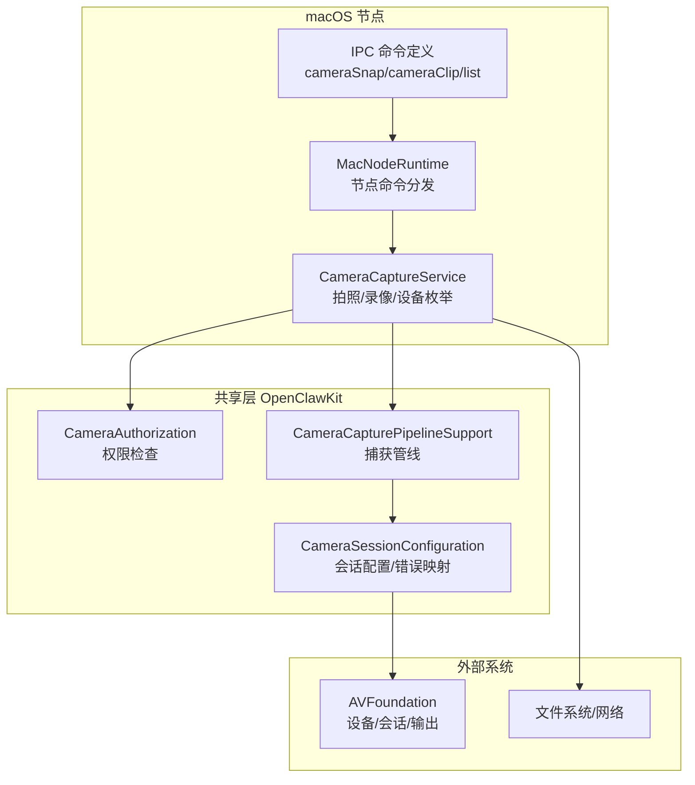
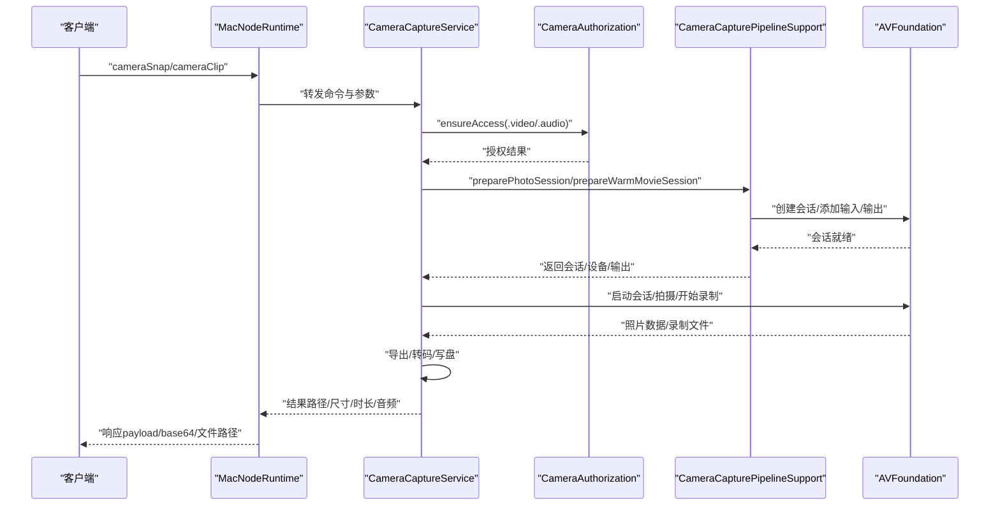
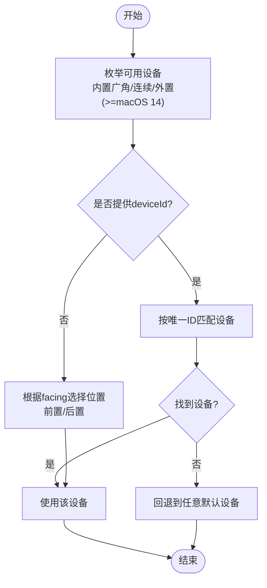
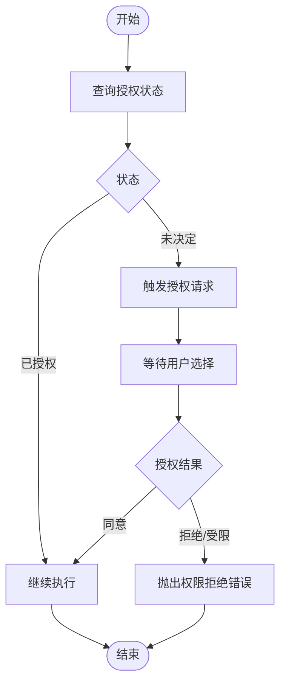
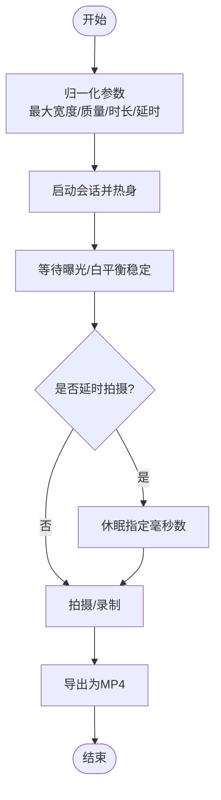
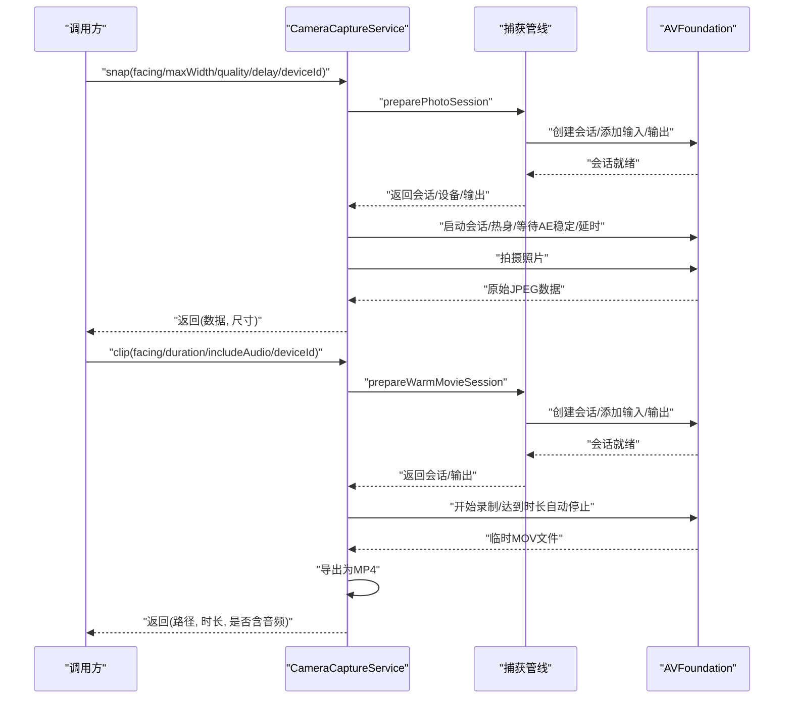
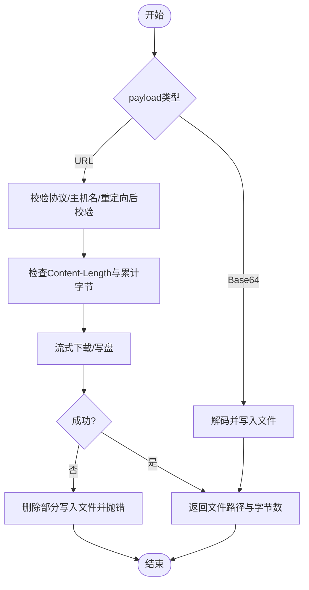
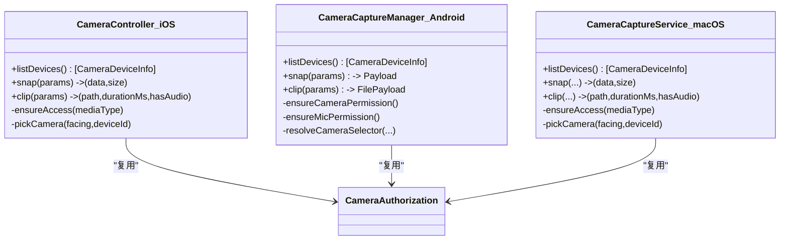
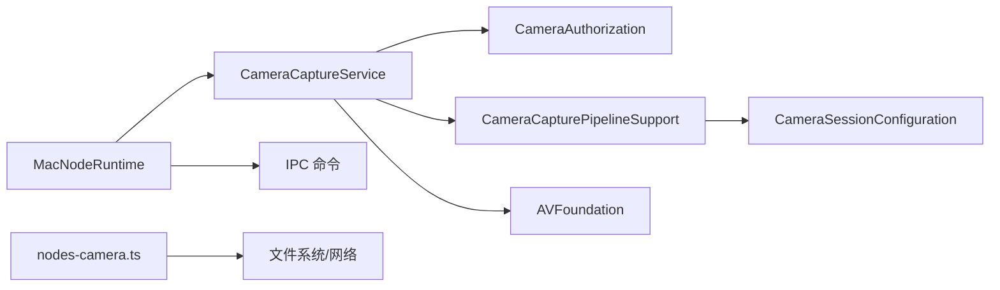

# 摄像头管理

<cite>
**本文引用的文件**
- [CameraCaptureService.swift](file://apps/macos/Sources/OpenClaw/CameraCaptureService.swift)
- [CameraAuthorization.swift](file://apps/shared/OpenClawKit/Sources/OpenClawKit/CameraAuthorization.swift)
- [CameraCapturePipelineSupport.swift](file://apps/shared/OpenClawKit/Sources/OpenClawKit/CameraCapturePipelineSupport.swift)
- [CameraSessionConfiguration.swift](file://apps/shared/OpenClawKit/Sources/OpenClawKit/CameraSessionConfiguration.swift)
- [IPC.swift](file://apps/macos/Sources/OpenClawIPC/IPC.swift)
- [MacNodeRuntime.swift](file://apps/macos/Sources/OpenClaw/NodeMode/MacNodeRuntime.swift)
- [nodes-camera.ts](file://src/cli/nodes-camera.ts)
- [nodes-camera.test.ts](file://src/cli/nodes-camera.test.ts)
- [CameraHandler.kt](file://apps/android/app/src/main/java/ai/openclaw/app/node/CameraHandler.kt)
- [CameraCaptureManager.kt](file://apps/android/app/src/main/java/ai/openclaw/app/node/CameraCaptureManager.kt)
</cite>

## 目录

1. [简介](#简介)
2. [项目结构](#项目结构)
3. [核心组件](#核心组件)
4. [架构总览](#架构总览)
5. [详细组件分析](#详细组件分析)
6. [依赖关系分析](#依赖关系分析)
7. [性能考虑](#性能考虑)
8. [故障排查指南](#故障排查指南)
9. [结论](#结论)
10. [附录](#附录)

## 简介

本文件系统化梳理 macOS 节点摄像头管理能力，覆盖设备发现与枚举、权限申请与隐私保护、视频捕获参数配置（分辨率与质量）、预览与延时拍摄、截图与视频录制、导出与传输、以及跨平台一致性设计。文档同时提供性能调优建议与常见问题诊断路径，帮助开发者在不同机型与系统版本上稳定运行摄像头功能。

## 项目结构

围绕摄像头功能的关键模块分布于多平台共享层与 macOS 特定实现：

- 共享层（OpenClawKit）：封装 AVFoundation 捕获管线、会话配置、权限检查与错误映射，确保 iOS/Android/macOS 的行为一致性。
- macOS 层：通过 IPC 命令桥接节点命令，调用共享层能力并完成最终的导出与传输。
- CLI 工具：负责将远端返回的摄像头数据写入本地临时文件或 Base64 写盘，保障下载安全与大小限制。

**图表来源**

- [IPC.swift:132-136](file://apps/macos/Sources/OpenClawIPC/IPC.swift#L132-L136)
- [MacNodeRuntime.swift:197-249](file://apps/macos/Sources/OpenClaw/NodeMode/MacNodeRuntime.swift#L197-L249)
- [CameraCaptureService.swift:41-164](file://apps/macos/Sources/OpenClaw/CameraCaptureService.swift#L41-L164)
- [CameraAuthorization.swift:4-20](file://apps/shared/OpenClawKit/Sources/OpenClawKit/CameraAuthorization.swift#L4-L20)
- [CameraCapturePipelineSupport.swift:4-151](file://apps/shared/OpenClawKit/Sources/OpenClawKit/CameraCapturePipelineSupport.swift#L4-L151)
- [CameraSessionConfiguration.swift:27-70](file://apps/shared/OpenClawKit/Sources/OpenClawKit/CameraSessionConfiguration.swift#L27-L70)

**章节来源**

- [IPC.swift:18-21](file://apps/macos/Sources/OpenClawIPC/IPC.swift#L18-L21)
- [MacNodeRuntime.swift:197-249](file://apps/macos/Sources/OpenClaw/NodeMode/MacNodeRuntime.swift#L197-L249)
- [CameraCaptureService.swift:41-164](file://apps/macos/Sources/OpenClaw/CameraCaptureService.swift#L41-L164)
- [CameraAuthorization.swift:4-20](file://apps/shared/OpenClawKit/Sources/OpenClawKit/CameraAuthorization.swift#L4-L20)
- [CameraCapturePipelineSupport.swift:4-151](file://apps/shared/OpenClawKit/Sources/OpenClawKit/CameraCapturePipelineSupport.swift#L4-L151)
- [CameraSessionConfiguration.swift:27-70](file://apps/shared/OpenClawKit/Sources/OpenClawKit/CameraSessionConfiguration.swift#L27-L70)

## 核心组件

- 摄像头服务（CameraCaptureService）
  - 设备枚举：支持内置广角与连续相机，并在 macOS 14+ 支持外置相机类型；可按唯一 ID 精确选择设备。
  - 截图：支持前置/后置选择、最大宽度与质量裁剪、曝光与白平衡稳定、可选延时拍摄。
  - 录制：支持前置/后置选择、时长限制、音频开关、临时 MOV 记录与 MP4 导出。
  - 权限：统一调用授权工具进行摄像头与麦克风授权检查。
- 权限工具（CameraAuthorization）
  - 统一处理 AVFoundation 授权状态，必要时触发授权请求。
- 捕获管线（CameraCapturePipelineSupport）
  - 封装照片与影片捕获会话准备、热身、设置生成与错误映射。
- 会话配置（CameraSessionConfiguration）
  - 统一封装输入/输出添加、麦克风可用性检查、最大录制时长设置。
- IPC 与节点运行时（IPC.swift、MacNodeRuntime）
  - 定义节点命令与参数，分发到具体服务执行。
- CLI 工具（nodes-camera.ts）
  - 将远端返回的摄像头数据写入本地文件，支持 HTTPS 下载与 Base64 写盘，含大小与主机名校验。

**章节来源**

- [CameraCaptureService.swift:41-164](file://apps/macos/Sources/OpenClaw/CameraCaptureService.swift#L41-L164)
- [CameraAuthorization.swift:4-20](file://apps/shared/OpenClawKit/Sources/OpenClawKit/CameraAuthorization.swift#L4-L20)
- [CameraCapturePipelineSupport.swift:4-151](file://apps/shared/OpenClawKit/Sources/OpenClawKit/CameraCapturePipelineSupport.swift#L4-L151)
- [CameraSessionConfiguration.swift:27-70](file://apps/shared/OpenClawKit/Sources/OpenClawKit/CameraSessionConfiguration.swift#L27-L70)
- [IPC.swift:18-21](file://apps/macos/Sources/OpenClawIPC/IPC.swift#L18-L21)
- [MacNodeRuntime.swift:197-249](file://apps/macos/Sources/OpenClaw/NodeMode/MacNodeRuntime.swift#L197-L249)
- [nodes-camera.ts:18-58](file://src/cli/nodes-camera.ts#L18-L58)

## 架构总览

下图展示从节点命令到最终导出的关键调用链路，包括权限检查、设备选择、捕获会话准备、拍摄/录制与导出。

**图表来源**

- [MacNodeRuntime.swift:197-249](file://apps/macos/Sources/OpenClaw/NodeMode/MacNodeRuntime.swift#L197-L249)
- [CameraCaptureService.swift:51-164](file://apps/macos/Sources/OpenClaw/CameraCaptureService.swift#L51-L164)
- [CameraAuthorization.swift:4-20](file://apps/shared/OpenClawKit/Sources/OpenClawKit/CameraAuthorization.swift#L4-L20)
- [CameraCapturePipelineSupport.swift:5-101](file://apps/shared/OpenClawKit/Sources/OpenClawKit/CameraCapturePipelineSupport.swift#L5-L101)

**章节来源**

- [MacNodeRuntime.swift:197-249](file://apps/macos/Sources/OpenClaw/NodeMode/MacNodeRuntime.swift#L197-L249)
- [CameraCaptureService.swift:51-164](file://apps/macos/Sources/OpenClaw/CameraCaptureService.swift#L51-L164)
- [CameraAuthorization.swift:4-20](file://apps/shared/OpenClawKit/Sources/OpenClawKit/CameraAuthorization.swift#L4-L20)
- [CameraCapturePipelineSupport.swift:5-101](file://apps/shared/OpenClawKit/Sources/OpenClawKit/CameraCapturePipelineSupport.swift#L5-L101)

## 详细组件分析

### 设备发现与选择

- 发现策略
  - 内置广角相机优先，随后尝试连续相机；在 macOS 14+ 同时探测外置相机类型；若均不可用则回退至任意默认相机。
  - 可通过设备唯一 ID 精确匹配目标设备。
- 位置标签
  - 将设备位置映射为“前置/后置/未指定”，便于 UI 与日志识别。
- 参数约束
  - 截图时对最大宽度与质量进行裁剪，避免过大负载。
  - 录制时对时长进行边界约束，防止过长导致资源占用过高。

**图表来源**

- [CameraCaptureService.swift:172-212](file://apps/macos/Sources/OpenClaw/CameraCaptureService.swift#L172-L212)
- [CameraCaptureService.swift:293-295](file://apps/macos/Sources/OpenClaw/CameraCaptureService.swift#L293-L295)

**章节来源**

- [CameraCaptureService.swift:172-212](file://apps/macos/Sources/OpenClaw/CameraCaptureService.swift#L172-L212)
- [CameraCaptureService.swift:293-295](file://apps/macos/Sources/OpenClaw/CameraCaptureService.swift#L293-L295)

### 权限申请与隐私保护

- 授权流程
  - 检查当前授权状态；若为未决定则触发系统授权弹窗；被拒绝或受限则返回失败。
  - 拍摄前检查摄像头权限，录制前根据是否包含音频决定是否检查麦克风权限。
- 隐私与安全
  - 仅在必要时请求权限，避免无意义的弹窗。
  - 录制导出阶段严格区分系统版本差异，保证导出稳定性与安全性。

**图表来源**

- [CameraAuthorization.swift:4-20](file://apps/shared/OpenClawKit/Sources/OpenClawKit/CameraAuthorization.swift#L4-L20)
- [CameraCaptureService.swift:166-170](file://apps/macos/Sources/OpenClaw/CameraCaptureService.swift#L166-L170)

**章节来源**

- [CameraAuthorization.swift:4-20](file://apps/shared/OpenClawKit/Sources/OpenClawKit/CameraAuthorization.swift#L4-L20)
- [CameraCaptureService.swift:166-170](file://apps/macos/Sources/OpenClaw/CameraCaptureService.swift#L166-L170)

### 视频捕获参数配置与优化

- 截图参数
  - 最大宽度：默认 1600，避免下游负载过大；质量范围裁剪在 5%-100%。
  - 延时拍摄：支持毫秒级延时，最长 10 秒，用于减少手抖。
  - 曝光与白平衡稳定：等待设备完成自动调整后再拍摄，提升成像质量。
- 录制参数
  - 时长：最小 250ms，最大 60s，默认 3s；超过最大时长自动停止。
  - 音频：可选开启，开启时需麦克风授权。
  - 导出：先记录为 MOV，再以中等质量导出为 MP4；macOS 15+ 使用异步导出 API，低版本使用同步回调并校验状态。

**图表来源**

- [CameraCaptureService.swift:219-237](file://apps/macos/Sources/OpenClaw/CameraCaptureService.swift#L219-L237)
- [CameraCaptureService.swift:276-291](file://apps/macos/Sources/OpenClaw/CameraCaptureService.swift#L276-L291)
- [CameraCaptureService.swift:239-274](file://apps/macos/Sources/OpenClaw/CameraCaptureService.swift#L239-L274)

**章节来源**

- [CameraCaptureService.swift:219-237](file://apps/macos/Sources/OpenClaw/CameraCaptureService.swift#L219-L237)
- [CameraCaptureService.swift:276-291](file://apps/macos/Sources/OpenClaw/CameraCaptureService.swift#L276-L291)
- [CameraCaptureService.swift:239-274](file://apps/macos/Sources/OpenClaw/CameraCaptureService.swift#L239-L274)

### 预览、截图与视频录制

- 预览
  - 通过热身会话与短暂休眠减少首帧空白，提升用户体验。
- 截图
  - 使用高质量优先的设置，支持延时拍摄与尺寸裁剪，最终以 JPEG 输出并返回尺寸。
- 录制
  - 支持前置/后置与外置设备；根据 includeAudio 决定是否添加麦克风输入；达到最大时长自动停止并导出 MP4。

**图表来源**

- [CameraCaptureService.swift:51-164](file://apps/macos/Sources/OpenClaw/CameraCaptureService.swift#L51-L164)
- [CameraCapturePipelineSupport.swift:5-101](file://apps/shared/OpenClawKit/Sources/OpenClawKit/CameraCapturePipelineSupport.swift#L5-L101)

**章节来源**

- [CameraCaptureService.swift:51-164](file://apps/macos/Sources/OpenClaw/CameraCaptureService.swift#L51-L164)
- [CameraCapturePipelineSupport.swift:5-101](file://apps/shared/OpenClawKit/Sources/OpenClawKit/CameraCapturePipelineSupport.swift#L5-L101)

### 数据写盘与传输（CLI）

- 支持两种输出格式：HTTPS URL 与 Base64 字符串。
- 安全与限额
  - 仅允许 HTTPS 协议，重定向后仍需满足主机名与协议要求。
  - 对内容长度与总下载字节进行上限控制，防止内存与带宽压力。
  - 流式下载过程中出现异常会删除部分写入的文件，避免残留。
- 文件命名
  - 采用稳定的临时文件命名规则，包含设备朝向与标识符，便于调试与清理。

**图表来源**

- [nodes-camera.ts:77-177](file://src/cli/nodes-camera.ts#L77-L177)
- [nodes-camera.ts:193-234](file://src/cli/nodes-camera.ts#L193-L234)

**章节来源**

- [nodes-camera.ts:77-177](file://src/cli/nodes-camera.ts#L77-L177)
- [nodes-camera.ts:193-234](file://src/cli/nodes-camera.ts#L193-L234)
- [nodes-camera.test.ts:140-222](file://src/cli/nodes-camera.test.ts#L140-L222)

### 跨平台一致性（iOS/Android/macOS）

- iOS
  - 设备枚举与选择逻辑一致，支持按唯一 ID 精确选择；权限检查与错误映射复用共享层。
- Android
  - 通过 CameraX 提供设备枚举、权限请求与拍摄/录制能力；支持外置相机与设备 ID 精确选择。
- macOS
  - 通过 AVFoundation 实现相同能力，结合共享层捕获管线与会话配置，保持行为一致。

**图表来源**

- [CameraCaptureService.swift:41-164](file://apps/macos/Sources/OpenClaw/CameraCaptureService.swift#L41-L164)
- [CameraAuthorization.swift:4-20](file://apps/shared/OpenClawKit/Sources/OpenClawKit/CameraAuthorization.swift#L4-L20)
- [CameraHandler.kt:30-56](file://apps/android/app/src/main/java/ai/openclaw/app/node/CameraHandler.kt#L30-L56)
- [CameraCaptureManager.kt:65-110](file://apps/android/app/src/main/java/ai/openclaw/app/node/CameraCaptureManager.kt#L65-L110)

**章节来源**

- [CameraCaptureService.swift:41-164](file://apps/macos/Sources/OpenClaw/CameraCaptureService.swift#L41-L164)
- [CameraAuthorization.swift:4-20](file://apps/shared/OpenClawKit/Sources/OpenClawKit/CameraAuthorization.swift#L4-L20)
- [CameraHandler.kt:30-56](file://apps/android/app/src/main/java/ai/openclaw/app/node/CameraHandler.kt#L30-L56)
- [CameraCaptureManager.kt:65-110](file://apps/android/app/src/main/java/ai/openclaw/app/node/CameraCaptureManager.kt#L65-L110)

## 依赖关系分析

- 模块耦合
  - CameraCaptureService 依赖 CameraAuthorization 进行权限检查，依赖 CameraCapturePipelineSupport 进行会话准备与导出，依赖 CameraSessionConfiguration 进行输入/输出添加与错误映射。
  - MacNodeRuntime 作为节点命令入口，将 IPC 命令分发给 CameraCaptureService 并负责最终的 payload 编码与返回。
- 外部依赖
  - AVFoundation：设备发现、会话、输入/输出、导出。
  - 文件系统与网络：临时文件写入、HTTPS 下载与 Base64 写盘。
- 循环依赖
  - 未见循环依赖；各模块职责清晰，共享层独立于平台特定实现。

**图表来源**

- [MacNodeRuntime.swift:197-249](file://apps/macos/Sources/OpenClaw/NodeMode/MacNodeRuntime.swift#L197-L249)
- [CameraCaptureService.swift:41-164](file://apps/macos/Sources/OpenClaw/CameraCaptureService.swift#L41-L164)
- [CameraAuthorization.swift:4-20](file://apps/shared/OpenClawKit/Sources/OpenClawKit/CameraAuthorization.swift#L4-L20)
- [CameraCapturePipelineSupport.swift:4-151](file://apps/shared/OpenClawKit/Sources/OpenClawKit/CameraCapturePipelineSupport.swift#L4-L151)
- [CameraSessionConfiguration.swift:27-70](file://apps/shared/OpenClawKit/Sources/OpenClawKit/CameraSessionConfiguration.swift#L27-L70)
- [nodes-camera.ts:77-177](file://src/cli/nodes-camera.ts#L77-L177)

**章节来源**

- [MacNodeRuntime.swift:197-249](file://apps/macos/Sources/OpenClaw/NodeMode/MacNodeRuntime.swift#L197-L249)
- [CameraCaptureService.swift:41-164](file://apps/macos/Sources/OpenClaw/CameraCaptureService.swift#L41-L164)
- [CameraAuthorization.swift:4-20](file://apps/shared/OpenClawKit/Sources/OpenClawKit/CameraAuthorization.swift#L4-L20)
- [CameraCapturePipelineSupport.swift:4-151](file://apps/shared/OpenClawKit/Sources/OpenClawKit/CameraCapturePipelineSupport.swift#L4-L151)
- [CameraSessionConfiguration.swift:27-70](file://apps/shared/OpenClawKit/Sources/OpenClawKit/CameraSessionConfiguration.swift#L27-L70)
- [nodes-camera.ts:77-177](file://src/cli/nodes-camera.ts#L77-L177)

## 性能考虑

- 会话热身与 AE 稳定
  - 在启动会话后进行短暂停顿，显著降低首帧空白概率，提升拍摄成功率。
- 参数裁剪
  - 截图最大宽度默认 1600，质量范围限制在 5%-100%，兼顾画质与传输效率。
  - 录制时长限制在 250ms-60s，避免长时间录制造成资源占用过高。
- 导出策略
  - 使用中等质量导出，启用网络优化选项；macOS 15+ 使用异步导出 API，降低主线程阻塞风险。
- 并发与隔离
  - 摄像头服务采用 actor 模型，避免并发访问 AVFoundation 资源引发竞态。

[本节为通用性能建议，不直接分析具体文件，故无“章节来源”]

## 故障排查指南

- 权限相关
  - 摄像头/麦克风未授权：检查系统隐私设置中的相机/麦克风授权；首次调用会触发授权弹窗。
  - 授权被拒或受限：返回权限拒绝错误，需引导用户在系统设置中开启。
- 设备相关
  - 设备不可用：确认设备唯一 ID 是否正确；若设备位置为“未指定”，回退到任意默认设备。
  - 外置相机：macOS 14+ 才支持外置相机类型发现，旧版本可能无法识别。
- 拍摄/录制失败
  - 会话配置错误：检查相机输入/输出添加是否成功，麦克风可用性（录制含音频时）。
  - 导出失败：检查导出会话状态与错误信息；macOS 15+ 异常会包含详细描述。
- CLI 下载限制
  - 非 HTTPS 或重定向后协议不符：拒绝下载。
  - 超过内容长度或累计字节上限：拒绝写盘并报错。
  - 流式下载异常：删除部分写入文件，避免残留。

**章节来源**

- [CameraAuthorization.swift:4-20](file://apps/shared/OpenClawKit/Sources/OpenClawKit/CameraAuthorization.swift#L4-L20)
- [CameraCaptureService.swift:166-170](file://apps/macos/Sources/OpenClaw/CameraCaptureService.swift#L166-L170)
- [CameraCaptureService.swift:172-212](file://apps/macos/Sources/OpenClaw/CameraCaptureService.swift#L172-L212)
- [CameraSessionConfiguration.swift:27-70](file://apps/shared/OpenClawKit/Sources/OpenClawKit/CameraSessionConfiguration.swift#L27-L70)
- [nodes-camera.ts:77-177](file://src/cli/nodes-camera.ts#L77-L177)
- [nodes-camera.test.ts:150-222](file://src/cli/nodes-camera.test.ts#L150-L222)

## 结论

本方案通过共享层抽象与平台特定实现相结合，实现了跨平台一致的摄像头管理能力。在 macOS 上，借助 AVFoundation 与精心设计的捕获管线，既保证了易用性，也兼顾了性能与稳定性。配合严格的权限与安全策略、参数裁剪与导出优化，能够在不同机型与系统版本上提供可靠的摄像头服务。

[本节为总结性内容，不直接分析具体文件，故无“章节来源”]

## 附录

### 设备兼容性与支持情况

- macOS
  - 内置广角相机：始终支持。
  - 连续相机：支持。
  - 外置相机：macOS 14+ 支持；旧版本通过原始字符串类型识别。
  - 设备位置：部分设备报告为“未指定”，系统会回退到任意默认设备。
- iOS
  - 设备枚举与选择逻辑一致，支持按唯一 ID 精确选择。
- Android
  - 通过 CameraX 提供设备枚举、权限请求与拍摄/录制能力；支持外置相机与设备 ID 精确选择。

**章节来源**

- [CameraCaptureService.swift:172-193](file://apps/macos/Sources/OpenClaw/CameraCaptureService.swift#L172-L193)
- [CameraCaptureService.swift:195-212](file://apps/macos/Sources/OpenClaw/CameraCaptureService.swift#L195-L212)
- [CameraHandler.kt:30-56](file://apps/android/app/src/main/java/ai/openclaw/app/node/CameraHandler.kt#L30-L56)
- [CameraCaptureManager.kt:65-110](file://apps/android/app/src/main/java/ai/openclaw/app/node/CameraCaptureManager.kt#L65-L110)

### 常见问题与解决方案

- 无法拍摄/录制
  - 检查权限状态与授权弹窗；确认会话配置成功且设备可用。
- 导出失败
  - 查看导出状态与错误信息；macOS 15+ 使用异步导出 API，旧版本需检查回调状态。
- CLI 下载失败
  - 确认 URL 为 HTTPS 且主机名匹配；关注内容长度与累计字节限制；异常时检查是否删除了部分写入文件。

**章节来源**

- [CameraCaptureService.swift:239-274](file://apps/macos/Sources/OpenClaw/CameraCaptureService.swift#L239-L274)
- [nodes-camera.ts:77-177](file://src/cli/nodes-camera.ts#L77-L177)
- [nodes-camera.test.ts:150-222](file://src/cli/nodes-camera.test.ts#L150-L222)
