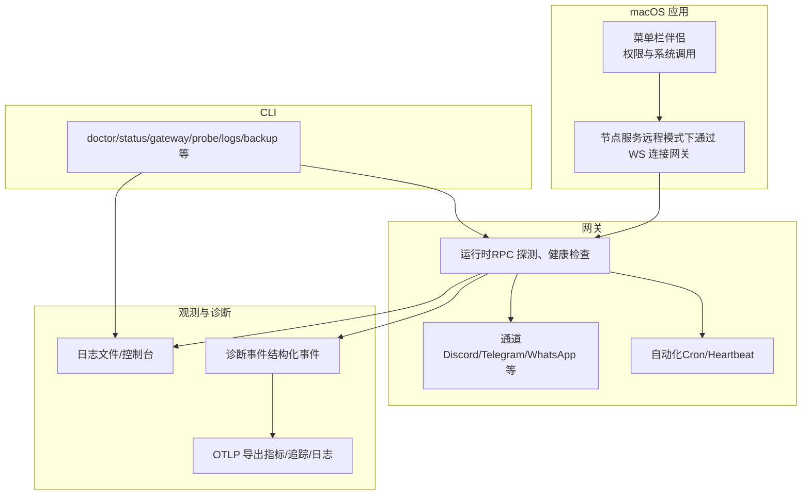
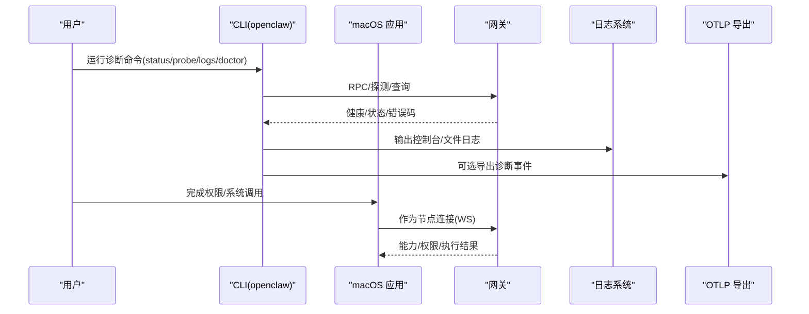
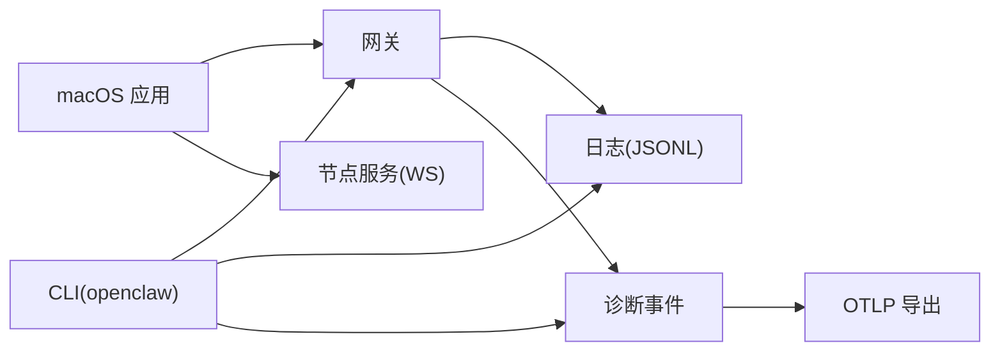

# 故障排除

<cite>
**本文引用的文件**
- [docs/help/troubleshooting.md](file://docs/help/troubleshooting.md)
- [docs/gateway/troubleshooting.md](file://docs/gateway/troubleshooting.md)
- [docs/nodes/troubleshooting.md](file://docs/nodes/troubleshooting.md)
- [docs/platforms/macos.md](file://docs/platforms/macos.md)
- [docs/platforms/mac/permissions.md](file://docs/platforms/mac/permissions.md)
- [docs/logging.md](file://docs/logging.md)
- [docs/cli/logs.md](file://docs/cli/logs.md)
- [docs/cli/backup.md](file://docs/cli/backup.md)
- [docs/install/updating.md](file://docs/install/updating.md)
- [apps/macos/Sources/OpenClaw/PairingAlertSupport.swift](file://apps/macos/Sources/OpenClaw/PairingAlertSupport.swift)
- [apps/macos/Sources/OpenClaw/OpenClawConfigFile.swift](file://apps/macos/Sources/OpenClaw/OpenClawConfigFile.swift)
- [src/infra/diagnostic-events.ts](file://src/infra/diagnostic-events.ts)
- [src/infra/diagnostic-flags.ts](file://src/infra/diagnostic-flags.ts)
- [extensions/diagnostics-otel/src/service.ts](file://extensions/diagnostics-otel/src/service.ts)
- [src/commands/backup-verify.ts](file://src/commands/backup-verify.ts)
- [src/infra/backup-create.ts](file://src/infra/backup-create.ts)
- [src/config/backup-rotation.ts](file://src/config/backup-rotation.ts)
- [src/gateway/protocol/schema/error-codes.ts](file://src/gateway/protocol/schema/error-codes.ts)
- [ui/src/ui/views/overview-hints.ts](file://ui/src/ui/views/overview-hints.ts)
</cite>

## 目录

1. [简介](#简介)
2. [项目结构](#项目结构)
3. [核心组件](#核心组件)
4. [架构总览](#架构总览)
5. [详细组件分析](#详细组件分析)
6. [依赖关系分析](#依赖关系分析)
7. [性能考量](#性能考量)
8. [故障排除指南](#故障排除指南)
9. [结论](#结论)
10. [附录](#附录)

## 简介

本指南聚焦于 macOS 节点的故障排除，覆盖权限问题、连接故障、功能异常、系统兼容性、硬件/软件冲突、日志收集与调试、性能监控、升级注意事项与回滚策略、数据备份与恢复等。文档基于仓库内的官方文档与源码实现，提供可操作的诊断步骤、错误码解释与恢复方法。

## 项目结构

OpenClaw 的 macOS 节点由“菜单栏伴侣应用 + 网关代理 + 本地节点服务”构成，配合 CLI、日志系统、诊断事件与导出插件，形成完整的可观测与可恢复体系。关键模块包括：

- macOS 应用与节点能力暴露（菜单栏、权限、系统调用、Canvas/Camera/Screen）
- 网关与通道（channels）、自动化（cron/heartbeat）、浏览器工具
- 日志与诊断（文件日志、控制台、OTLP 导出、诊断事件）
- 备份与恢复（配置轮转、备份清单校验、状态迁移）

图示来源

- [docs/platforms/macos.md:15-73](file://docs/platforms/macos.md#L15-L73)
- [docs/gateway/troubleshooting.md:14-31](file://docs/gateway/troubleshooting.md#L14-L31)
- [docs/logging.md:142-267](file://docs/logging.md#L142-L267)

章节来源

- [docs/platforms/macos.md:1-227](file://docs/platforms/macos.md#L1-L227)
- [docs/gateway/troubleshooting.md:1-380](file://docs/gateway/troubleshooting.md#L1-L380)
- [docs/logging.md:1-353](file://docs/logging.md#L1-L353)

## 核心组件

- macOS 节点与菜单栏应用：负责权限提示、系统调用执行上下文、节点能力暴露、LaunchAgent 管理与远程模式隧道。
- 网关与通道：提供运行时健康、RPC 探测、通道连通性与消息流诊断。
- 诊断与日志：文件 JSONL 日志、控制台输出、诊断事件、OTLP 导出。
- 备份与恢复：配置轮转、备份清单校验、状态迁移与回滚策略。

章节来源

- [docs/platforms/macos.md:15-111](file://docs/platforms/macos.md#L15-L111)
- [docs/gateway/troubleshooting.md:14-31](file://docs/gateway/troubleshooting.md#L14-L31)
- [docs/logging.md:142-267](file://docs/logging.md#L142-L267)
- [docs/cli/backup.md:1-77](file://docs/cli/backup.md#L1-L77)

## 架构总览

下图展示 macOS 节点与网关之间的交互，以及日志与诊断事件的流向。

图示来源

- [docs/help/troubleshooting.md:13-36](file://docs/help/troubleshooting.md#L13-L36)
- [docs/platforms/macos.md:171-198](file://docs/platforms/macos.md#L171-L198)
- [docs/logging.md:142-267](file://docs/logging.md#L142-L267)

## 详细组件分析

### macOS 权限与签名（TCC）

- 权限稳定性依赖：固定路径、固定 Bundle ID、真实签名、稳定的签名。
- 权限提示消失的恢复清单：退出应用、移除系统设置中的应用条目、从相同路径重启、必要时使用 tccutil 清理、重启系统后重试。
- 文件夹读写权限：终端/后台进程访问桌面/文档/下载可能被限制，需授予对应进程上下文权限；或移动到工作区避免逐目录授权。

章节来源

- [docs/platforms/mac/permissions.md:17-50](file://docs/platforms/mac/permissions.md#L17-L50)
- [docs/platforms/macos.md:146-164](file://docs/platforms/macos.md#L146-L164)

### macOS 节点能力与系统调用

- 节点能力：Canvas、Camera、Screen、System（system.run）。
- system.run 在 macOS 应用 UI/TCC 上下文中执行，通过本地 Unix Socket 通信，支持执行审批（Exec approvals）与环境变量过滤。
- 节点服务与应用 IPC：远程模式下节点服务通过 WebSocket 连接网关，system.run 通过本地 IPC 执行。

章节来源

- [docs/platforms/macos.md:50-111](file://docs/platforms/macos.md#L50-L111)

### 节点工具失败的诊断矩阵

- 常见错误码与定位：前台不可用、权限缺失/拒绝、位置权限、系统执行被拒（需要审批或白名单）。
- 快速恢复循环：检查节点状态/描述、执行审批、查看日志、必要时重新配对/授予权限/调整审批策略。

章节来源

- [docs/nodes/troubleshooting.md:79-107](file://docs/nodes/troubleshooting.md#L79-L107)

### 网关与通道故障

- 健康信号：Runtime: running、RPC probe: ok、通道 ready/connected。
- 常见问题：Anthropic 429（长上下文需额外用量）、Dashboard/Control UI 连接鉴权问题、网关服务未运行（端口占用/绑定与认证不匹配）、通道已连接但消息不流动（提及/允许列表/权限）。
- 升级后问题：URL/认证覆盖行为变化、更严格的绑定与认证保护、设备配对状态变更。

章节来源

- [docs/gateway/troubleshooting.md:26-31](file://docs/gateway/troubleshooting.md#L26-L31)
- [docs/gateway/troubleshooting.md:32-59](file://docs/gateway/troubleshooting.md#L32-L59)
- [docs/gateway/troubleshooting.md:91-151](file://docs/gateway/troubleshooting.md#L91-L151)
- [docs/gateway/troubleshooting.md:152-181](file://docs/gateway/troubleshooting.md#L152-L181)
- [docs/gateway/troubleshooting.md:182-212](file://docs/gateway/troubleshooting.md#L182-L212)
- [docs/gateway/troubleshooting.md:307-380](file://docs/gateway/troubleshooting.md#L307-L380)

### 日志与诊断事件

- 日志位置与格式：默认滚动文件日志（JSON Lines），CLI 与控制台输出；支持 JSON/纯文本/紧凑模式与敏感信息脱敏。
- 诊断事件：结构化事件用于模型使用与消息流遥测，可导出至 OTLP 收集器（指标/追踪/日志）。
- 诊断标志：按子系统/通道启用细粒度调试日志而不提升全局级别。

章节来源

- [docs/logging.md:20-141](file://docs/logging.md#L20-L141)
- [docs/logging.md:142-353](file://docs/logging.md#L142-L353)
- [src/infra/diagnostic-events.ts:191-202](file://src/infra/diagnostic-events.ts#L191-L202)
- [src/infra/diagnostic-flags.ts:44-92](file://src/infra/diagnostic-flags.ts#L44-L92)
- [extensions/diagnostics-otel/src/service.ts:560-587](file://extensions/diagnostics-otel/src/service.ts#L560-L587)

### 备份与恢复

- 备份内容：状态目录、活动配置、凭据目录、工作区（可选）。
- 备份清单校验：验证清单存在、路径遍历防护、资产完整性。
- 配置轮转：环形备份保留、权限加固、孤儿 .bak 文件清理。
- 回滚策略：固定版本（pin）、按日期回退到指定提交、doctor 修复与迁移。

章节来源

- [docs/cli/backup.md:13-77](file://docs/cli/backup.md#L13-L77)
- [src/commands/backup-verify.ts:92-140](file://src/commands/backup-verify.ts#L92-L140)
- [src/infra/backup-create.ts:190-231](file://src/infra/backup-create.ts#L190-L231)
- [src/config/backup-rotation.ts:16-125](file://src/config/backup-rotation.ts#L16-L125)
- [docs/install/updating.md:206-258](file://docs/install/updating.md#L206-L258)

## 依赖关系分析

- macOS 应用与节点服务通过 WebSocket 与本地 IPC 与网关交互。
- CLI 通过 RPC 访问网关日志与状态，驱动诊断流程。
- 诊断事件与 OTLP 插件解耦，便于扩展与禁用。
- 备份与状态迁移在运行时自动维护，降低手动干预成本。

图示来源

- [docs/platforms/macos.md:61-73](file://docs/platforms/macos.md#L61-L73)
- [docs/logging.md:142-267](file://docs/logging.md#L142-L267)

## 性能考量

- 日志级别与导出：在高负载场景下谨慎开启 OTLP 日志导出，结合采样率与刷新间隔控制开销。
- 诊断标志：针对特定通道启用细粒度日志，避免全局提升级别带来的性能影响。
- 备份体积：大工作区是备份体积的主要来源，可通过“仅备份配置”或“不包含工作区”选项减小体积与压缩时间。

章节来源

- [docs/logging.md:268-353](file://docs/logging.md#L268-L353)
- [docs/cli/backup.md:63-77](file://docs/cli/backup.md#L63-L77)

## 故障排除指南

### 通用诊断流程（macOS 节点）

- 快速检查链路：status、status --all、gateway probe、gateway status、doctor、channels status --probe、logs --follow。
- 健康信号：Runtime: running、RPC probe: ok、通道 ready/connected、无重复致命错误。
- 若 Dashboard/Control UI 无法连接：核对 URL、认证模式、安全上下文、设备令牌与配对状态。
- 若节点已配对但工具失败：检查前台状态、系统权限、exec 审批与白名单。

章节来源

- [docs/help/troubleshooting.md:13-36](file://docs/help/troubleshooting.md#L13-L36)
- [docs/gateway/troubleshooting.md:91-151](file://docs/gateway/troubleshooting.md#L91-L151)
- [docs/nodes/troubleshooting.md:13-31](file://docs/nodes/troubleshooting.md#L13-L31)

### 权限问题（TCC）

- 症状：权限提示消失、系统调用失败（如 camera/screen/system.run）。
- 恢复步骤：退出应用、移除系统设置中的应用条目、从固定路径重启、tccutil 清理、必要时重启系统。
- 预防：固定 Bundle ID、固定路径、使用真实签名证书，避免临时签名导致权限丢失。

章节来源

- [docs/platforms/mac/permissions.md:27-50](file://docs/platforms/mac/permissions.md#L27-L50)
- [docs/platforms/macos.md:146-164](file://docs/platforms/macos.md#L146-L164)

### 连接故障

- 网关服务未运行：检查服务是否安装、配置是否匹配、端口是否被占用、绑定与认证是否一致。
- 控制 UI 连接失败：确认 URL/端口正确、认证模式与令牌匹配、非安全上下文下的设备身份要求。
- 通道连接但消息不流动：检查提及/允许列表/权限，通道 API scopes。

章节来源

- [docs/gateway/troubleshooting.md:152-181](file://docs/gateway/troubleshooting.md#L152-L181)
- [docs/gateway/troubleshooting.md:91-151](file://docs/gateway/troubleshooting.md#L91-L151)
- [docs/gateway/troubleshooting.md:182-212](file://docs/gateway/troubleshooting.md#L182-L212)

### 功能异常（节点工具）

- 前台限制：iOS/Android 节点的 canvas/camera/screen 需要前台；macOS 节点也需在前台执行 system.run。
- 权限缺失：\*\_PERMISSION_REQUIRED、LOCATION_PERMISSION_REQUIRED 等。
- 执行被拒：SYSTEM_RUN_DENIED（需要审批或白名单命中）。

章节来源

- [docs/nodes/troubleshooting.md:37-107](file://docs/nodes/troubleshooting.md#L37-L107)

### 错误码速查与处理

- 通用错误码：NOT_LINKED、NOT_PAIRED、AGENT_TIMEOUT、INVALID_REQUEST、UNAVAILABLE。
- 设备配对提示：当 UI 展示配对提示时，检查设备请求状态并批准。

章节来源

- [src/gateway/protocol/schema/error-codes.ts:1-23](file://src/gateway/protocol/schema/error-codes.ts#L1-L23)
- [ui/src/ui/views/overview-hints.ts:3-16](file://ui/src/ui/views/overview-hints.ts#L3-L16)

### 日志收集与调试

- 使用 CLI 实时跟踪：openclaw logs --follow，支持 JSON/纯文本/紧凑模式与本地时区显示。
- 控制台样式与级别：consoleStyle、consoleLevel、OPENCLAW_LOG_LEVEL。
- 诊断标志：按通道/子系统启用细粒度日志，不影响全局文件日志级别。
- OTLP 导出：启用 diagnostics-otel 插件，配置端点、协议、服务名、采样率与刷新间隔。

章节来源

- [docs/cli/logs.md:9-29](file://docs/cli/logs.md#L9-L29)
- [docs/logging.md:40-141](file://docs/logging.md#L40-L141)
- [docs/logging.md:199-267](file://docs/logging.md#L199-L267)

### 性能监控

- 指标与追踪：token 使用、消息队列深度/等待、会话状态、webhook 处理时延等。
- 日志导出：OTLP 日志导出遵循文件日志级别，注意高吞吐场景下的采样与过滤。

章节来源

- [docs/logging.md:268-353](file://docs/logging.md#L268-L353)

### 系统兼容性与升级注意事项

- 升级后断连/鉴权问题：URL/认证覆盖行为变化、更严格的绑定与认证保护、设备配对状态变化。
- 解决步骤：核对 gateway.mode、gateway.remote.url、gateway.auth.mode；必要时 reinstall 服务元数据。
- 回滚策略：固定版本（pin）、按日期回退到指定提交；doctor 修复与迁移。

章节来源

- [docs/gateway/troubleshooting.md:307-380](file://docs/gateway/troubleshooting.md#L307-L380)
- [docs/install/updating.md:206-258](file://docs/install/updating.md#L206-L258)

### 数据备份与恢复

- 备份范围：状态目录、活动配置、凭据目录、工作区（可选）。
- 备份清单校验：防止路径穿越、校验资产完整性。
- 配置轮转：环形备份、权限加固、孤儿文件清理。
- 恢复建议：优先使用 doctor 修复；若配置损坏，可仅备份配置或跳过工作区备份。

章节来源

- [docs/cli/backup.md:13-77](file://docs/cli/backup.md#L13-L77)
- [src/commands/backup-verify.ts:92-140](file://src/commands/backup-verify.ts#L92-L140)
- [src/config/backup-rotation.ts:16-125](file://src/config/backup-rotation.ts#L16-L125)

### macOS 特定工具与界面

- 菜单栏应用：通知、权限提示、网关管理、节点能力暴露。
- 配对提示支持：弹窗宿主窗口、活动告警管理、配对决策事件。
- 配置文件解析：支持 JSON5 解析、元数据标记、网关模式解析。

章节来源

- [docs/platforms/macos.md:9-25](file://docs/platforms/macos.md#L9-L25)
- [apps/macos/Sources/OpenClaw/PairingAlertSupport.swift:15-51](file://apps/macos/Sources/OpenClaw/PairingAlertSupport.swift#L15-L51)
- [apps/macos/Sources/OpenClaw/OpenClawConfigFile.swift:244-279](file://apps/macos/Sources/OpenClaw/OpenClawConfigFile.swift#L244-L279)

## 结论

针对 macOS 节点的故障排除，应以“健康信号优先”的方式快速定位问题：先确认网关与通道健康，再深入到节点工具与权限层面。借助 CLI 的诊断命令、日志与诊断事件、OTLP 导出，可以高效识别根因并实施修复。升级前后务必进行 doctor 与 doctor 引导的修复流程，并保留可验证的备份以便回滚。

## 附录

### 常用命令速查

- 诊断链路：status、gateway status、gateway probe、doctor、channels status --probe、logs --follow
- 日志：logs --follow、logs --json、logs --local-time
- 备份：backup create、backup verify、backup create --only-config、backup create --no-include-workspace
- 更新与回滚：update、doctor、gateway restart、pin/回退到指定提交

章节来源

- [docs/help/troubleshooting.md:13-36](file://docs/help/troubleshooting.md#L13-L36)
- [docs/cli/logs.md:17-29](file://docs/cli/logs.md#L17-L29)
- [docs/cli/backup.md:13-21](file://docs/cli/backup.md#L13-L21)
- [docs/install/updating.md:100-112](file://docs/install/updating.md#L100-L112)
