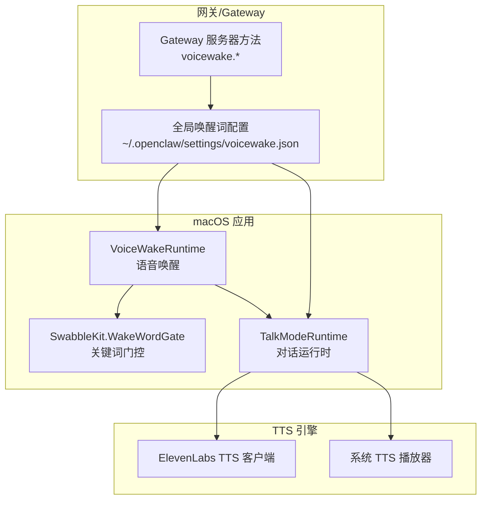
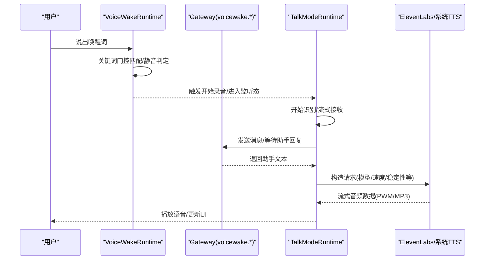
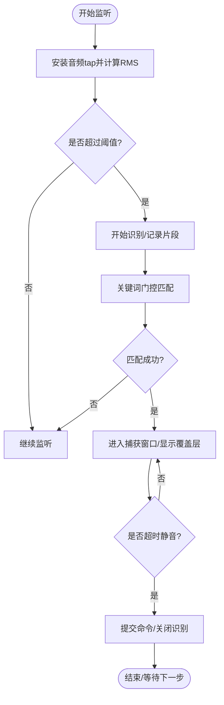
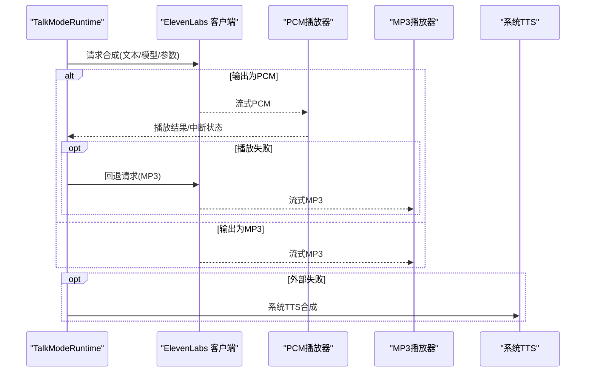
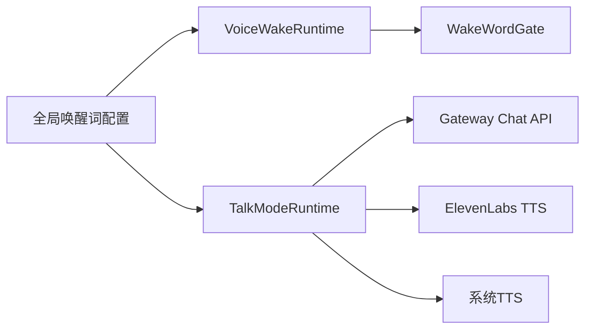

# 语音交互

<cite>
**本文引用的文件**
- [apps/macos/Sources/OpenClaw/TalkModeRuntime.swift](file://apps/macos/Sources/OpenClaw/TalkModeRuntime.swift)
- [apps/macos/Sources/OpenClaw/VoiceWakeRuntime.swift](file://apps/macos/Sources/OpenClaw/VoiceWakeRuntime.swift)
- [Swabble/Sources/SwabbleKit/WakeWordGate.swift](file://Swabble/Sources/SwabbleKit/WakeWordGate.swift)
- [apps/macos/Sources/OpenClaw/VoiceWakeTester.swift](file://apps/macos/Sources/OpenClaw/VoiceWakeTester.swift)
- [docs/nodes/voicewake.md](file://docs/nodes/voicewake.md)
- [src/gateway/server-methods/voicewake.ts](file://src/gateway/server-methods/voicewake.ts)
- [src/tts/tts.ts](file://src/tts/tts.ts)
- [src/tts/tts-core.ts](file://src/tts/tts-core.ts)
- [extensions/voice-call/src/providers/tts-openai.ts](file://extensions/voice-call/src/providers/tts-openai.ts)
- [apps/ios/Sources/Voice/TalkModeManager.swift](file://apps/ios/Sources/Voice/TalkModeManager.swift)
- [apps/android/app/src/main/java/ai/openclaw/app/voice/TalkModeManager.kt](file://apps/android/app/src/main/java/ai/openclaw/app/voice/TalkModeManager.kt)
</cite>

## 目录

1. [简介](#简介)
2. [项目结构](#项目结构)
3. [核心组件](#核心组件)
4. [架构总览](#架构总览)
5. [详细组件分析](#详细组件分析)
6. [依赖关系分析](#依赖关系分析)
7. [性能考量](#性能考量)
8. [故障排查指南](#故障排查指南)
9. [结论](#结论)
10. [附录](#附录)

## 简介

本文件面向 macOS 节点，系统化阐述语音交互能力：包括语音识别（ASR）、语音合成（TTS）与自然语言处理（NLP）链路；语音唤醒、关键词检测与语音指令识别机制；TTS 引擎配置、语音质量优化与多语言支持；以及语音对话管理、上下文保持与情感分析的实现要点。同时提供跨平台（macOS、iOS、Android）的兼容性说明、延迟控制策略与隐私保护配置建议，并给出 API 使用示例与性能调优、用户体验优化实践。

## 项目结构

围绕 macOS 的语音交互由以下层次构成：

- 语音唤醒层：后台常驻监听，基于本地语音识别进行关键词匹配与静音窗口判定，触发后续录音与处理。
- 语音识别层：实时流式识别，输出分段文本与置信度，支持中断与静音终结。
- 自然语言处理层：构建提示词、调用网关聊天接口、等待并提取助手回复。
- 语音合成层：优先使用外部 TTS（ElevenLabs），失败时回退至系统 TTS；支持 PCM/MP3 流式播放与中断。
- 配置与协议层：全局唤醒词列表由网关维护并通过 RPC 同步；TTS 参数校验与默认值在服务端与客户端统一。

图示来源

- [apps/macos/Sources/OpenClaw/VoiceWakeRuntime.swift:141-233](file://apps/macos/Sources/OpenClaw/VoiceWakeRuntime.swift#L141-L233)
- [apps/macos/Sources/OpenClaw/TalkModeRuntime.swift:173-233](file://apps/macos/Sources/OpenClaw/TalkModeRuntime.swift#L173-L233)
- [Swabble/Sources/SwabbleKit/WakeWordGate.swift:65-101](file://Swabble/Sources/SwabbleKit/WakeWordGate.swift#L65-L101)
- [docs/nodes/voicewake.md:18-28](file://docs/nodes/voicewake.md#L18-L28)
- [src/gateway/server-methods/voicewake.ts:7-34](file://src/gateway/server-methods/voicewake.ts#L7-L34)

章节来源

- [apps/macos/Sources/OpenClaw/VoiceWakeRuntime.swift:141-233](file://apps/macos/Sources/OpenClaw/VoiceWakeRuntime.swift#L141-L233)
- [apps/macos/Sources/OpenClaw/TalkModeRuntime.swift:173-233](file://apps/macos/Sources/OpenClaw/TalkModeRuntime.swift#L173-L233)
- [Swabble/Sources/SwabbleKit/WakeWordGate.swift:65-101](file://Swabble/Sources/SwabbleKit/WakeWordGate.swift#L65-L101)
- [docs/nodes/voicewake.md:18-28](file://docs/nodes/voicewake.md#L18-L28)
- [src/gateway/server-methods/voicewake.ts:7-34](file://src/gateway/server-methods/voicewake.ts#L7-L34)

## 核心组件

- 语音唤醒运行时（VoiceWakeRuntime）
  - 延迟创建音频引擎，避免应用启动即占用音频资源；基于 SFSpeechRecognizer 实时监听，结合 RMS 能量阈值与静音窗口判断触发。
  - 关键词门控（WakeWordGate）对分段识别结果进行规范化匹配，确保触发后存在最小后置间隔与命令长度。
  - 支持“仅触发暂停”与“静默回退”两种预检测路径，提升鲁棒性。
- 对话运行时（TalkModeRuntime）
  - 统一管理识别、合成与播放生命周期；支持中断说话以响应用户语音输入；自动选择 PCM 或 MP3 播放并回退。
  - 构建提示词并调用网关聊天接口，等待助手文本，随后进行 TTS 合成与播放。
- 关键词门控（WakeWordGate）
  - 将触发词与识别分段进行归一化对比，计算触发结束时间与后置间隔，提取命令文本。
- 网关唤醒词协议
  - 提供获取/设置唤醒词的 RPC 方法，广播变更事件，确保各节点一致。

章节来源

- [apps/macos/Sources/OpenClaw/VoiceWakeRuntime.swift:141-233](file://apps/macos/Sources/OpenClaw/VoiceWakeRuntime.swift#L141-L233)
- [apps/macos/Sources/OpenClaw/TalkModeRuntime.swift:173-233](file://apps/macos/Sources/OpenClaw/TalkModeRuntime.swift#L173-L233)
- [Swabble/Sources/SwabbleKit/WakeWordGate.swift:65-101](file://Swabble/Sources/SwabbleKit/WakeWordGate.swift#L65-L101)
- [docs/nodes/voicewake.md:30-49](file://docs/nodes/voicewake.md#L30-L49)
- [src/gateway/server-methods/voicewake.ts:7-34](file://src/gateway/server-methods/voicewake.ts#L7-L34)

## 架构总览

下图展示从语音唤醒到 TTS 播放的完整链路，以及跨平台一致性与配置同步：

图示来源

- [apps/macos/Sources/OpenClaw/VoiceWakeRuntime.swift:278-382](file://apps/macos/Sources/OpenClaw/VoiceWakeRuntime.swift#L278-L382)
- [apps/macos/Sources/OpenClaw/TalkModeRuntime.swift:339-405](file://apps/macos/Sources/OpenClaw/TalkModeRuntime.swift#L339-L405)
- [src/gateway/server-methods/voicewake.ts:7-34](file://src/gateway/server-methods/voicewake.ts#L7-L34)

## 详细组件分析

### 语音唤醒与关键词检测

- 音频采集与能量监测
  - 延迟创建 AVAudioEngine，安装输入 tap 获取 PCM 缓冲，计算 RMS 并自适应噪声底噪，动态设定阈值。
- 识别与门控
  - 使用 SFSpeechRecognizer 进行流式识别，分段记录时间戳与范围；通过 WakeWordGate 进行触发词匹配，要求最小后置间隔与命令长度。
- 预检测与回退
  - 在仅触发或长时间无语音时，采用“仅触发暂停”与“静默回退”两条路径，提升误检抑制与体验。
- 触发后处理
  - 播放触发提示音，启动会话覆盖层，监控静音窗口，最终提交命令并转发或自动发送。

图示来源

- [apps/macos/Sources/OpenClaw/VoiceWakeRuntime.swift:186-218](file://apps/macos/Sources/OpenClaw/VoiceWakeRuntime.swift#L186-L218)
- [Swabble/Sources/SwabbleKit/WakeWordGate.swift:65-101](file://Swabble/Sources/SwabbleKit/WakeWordGate.swift#L65-L101)
- [apps/macos/Sources/OpenClaw/VoiceWakeRuntime.swift:531-651](file://apps/macos/Sources/OpenClaw/VoiceWakeRuntime.swift#L531-L651)

章节来源

- [apps/macos/Sources/OpenClaw/VoiceWakeRuntime.swift:186-218](file://apps/macos/Sources/OpenClaw/VoiceWakeRuntime.swift#L186-L218)
- [Swabble/Sources/SwabbleKit/WakeWordGate.swift:65-101](file://Swabble/Sources/SwabbleKit/WakeWordGate.swift#L65-L101)
- [apps/macos/Sources/OpenClaw/VoiceWakeRuntime.swift:531-651](file://apps/macos/Sources/OpenClaw/VoiceWakeRuntime.swift#L531-L651)

### 语音识别与静音终结

- 识别参数
  - 启用部分结果、字典语料提示，便于快速反馈与打断。
- 中断与恢复
  - 识别中若检测到用户说话且允许打断，则停止当前播放并重新开始识别。
- 静音终结
  - 基于最后听到时间与静音窗口判定，提交最终转写文本并进入思考态。

章节来源

- [apps/macos/Sources/OpenClaw/TalkModeRuntime.swift:173-233](file://apps/macos/Sources/OpenClaw/TalkModeRuntime.swift#L173-L233)
- [apps/macos/Sources/OpenClaw/TalkModeRuntime.swift:293-335](file://apps/macos/Sources/OpenClaw/TalkModeRuntime.swift#L293-L335)

### 语音合成与播放

- 外部 TTS（ElevenLabs）
  - 支持多种输出格式（PCM/MP3），按需回退；根据文本长度动态估算合成超时；支持速度、稳定性、相似度、风格、音色增强、种子、语言码、延迟等级等参数。
- 系统 TTS 回退
  - 当外部 TTS 不可用或失败时，回退到系统语音合成器。
- 播放与中断
  - PCM/MP3 分别通过专用播放器流式播放；支持在用户说话时中断并恢复识别。

图示来源

- [apps/macos/Sources/OpenClaw/TalkModeRuntime.swift:567-657](file://apps/macos/Sources/OpenClaw/TalkModeRuntime.swift#L567-L657)
- [apps/macos/Sources/OpenClaw/TalkModeRuntime.swift:659-743](file://apps/macos/Sources/OpenClaw/TalkModeRuntime.swift#L659-L743)

章节来源

- [apps/macos/Sources/OpenClaw/TalkModeRuntime.swift:567-657](file://apps/macos/Sources/OpenClaw/TalkModeRuntime.swift#L567-L657)
- [apps/macos/Sources/OpenClaw/TalkModeRuntime.swift:659-743](file://apps/macos/Sources/OpenClaw/TalkModeRuntime.swift#L659-L743)

### 自然语言处理与对话管理

- 提示词构建
  - 结合最近一次被打断的时间戳，生成上下文感知提示词，提升连续对话连贯性。
- 助手文本等待
  - 通过网关聊天接口发送消息，轮询历史消息，提取最新助手回复文本。
- 上下文保持
  - 通过会话键与时间戳过滤，确保仅取自本次会话之后的消息，避免历史污染。
- 情感分析
  - 代码未直接实现情感分析模块；如需情感适配，可在提示词中注入情感维度或在上游 NLP 层扩展。

章节来源

- [apps/macos/Sources/OpenClaw/TalkModeRuntime.swift:407-450](file://apps/macos/Sources/OpenClaw/TalkModeRuntime.swift#L407-L450)

### 全局唤醒词配置与同步

- 存储位置
  - 网关主机上的 JSON 文件存储全局唤醒词列表与更新时间。
- 协议方法
  - 提供获取/设置唤醒词的 RPC 方法，设置后广播变更事件，所有连接客户端与节点即时同步。
- 客户端行为
  - macOS/iOS 使用全局列表作为触发门控；Android 当前禁用唤醒词，采用手动麦克风模式。

章节来源

- [docs/nodes/voicewake.md:18-49](file://docs/nodes/voicewake.md#L18-L49)
- [src/gateway/server-methods/voicewake.ts:7-34](file://src/gateway/server-methods/voicewake.ts#L7-L34)

### 多平台一致性与跨平台差异

- iOS
  - 与 macOS 类似的 TTS 请求构造与播放流程；支持增量流式合成与失败回退。
- Android
  - 与 macOS 类似的 TTS 请求构造与播放流程；支持 PCM/MP3 回退与文件播放策略。
- 共同点
  - 统一的速度/稳定性/相似度/风格参数校验与默认值；统一的语言码与延迟等级处理。

章节来源

- [apps/ios/Sources/Voice/TalkModeManager.swift:1038-1058](file://apps/ios/Sources/Voice/TalkModeManager.swift#L1038-L1058)
- [apps/android/app/src/main/java/ai/openclaw/app/voice/TalkModeManager.kt:1614-1662](file://apps/android/app/src/main/java/ai/openclaw/app/voice/TalkModeManager.kt#L1614-L1662)

## 依赖关系分析

- 组件耦合
  - VoiceWakeRuntime 与 SwabbleKit 的 WakeWordGate 强耦合，用于关键词匹配；TalkModeRuntime 依赖网关聊天接口与 TTS 客户端。
- 外部依赖
  - macOS 语音识别依赖系统框架（AVFoundation/Speech）；TTS 可选 ElevenLabs 或系统 TTS。
- 配置同步
  - 唤醒词配置通过网关集中管理，客户端仅负责消费与本地 UI 控制。

图示来源

- [apps/macos/Sources/OpenClaw/VoiceWakeRuntime.swift:141-233](file://apps/macos/Sources/OpenClaw/VoiceWakeRuntime.swift#L141-L233)
- [apps/macos/Sources/OpenClaw/TalkModeRuntime.swift:339-405](file://apps/macos/Sources/OpenClaw/TalkModeRuntime.swift#L339-L405)
- [docs/nodes/voicewake.md:18-28](file://docs/nodes/voicewake.md#L18-L28)

章节来源

- [apps/macos/Sources/OpenClaw/VoiceWakeRuntime.swift:141-233](file://apps/macos/Sources/OpenClaw/VoiceWakeRuntime.swift#L141-L233)
- [apps/macos/Sources/OpenClaw/TalkModeRuntime.swift:339-405](file://apps/macos/Sources/OpenClaw/TalkModeRuntime.swift#L339-L405)
- [docs/nodes/voicewake.md:18-28](file://docs/nodes/voicewake.md#L18-L28)

## 性能考量

- 延迟控制
  - 识别：启用部分结果与字典提示，缩短首字节延迟；静音窗口与打断策略减少无效等待。
  - 合成：按文本长度估算超时，合理设置输出格式（PCM/MP3）；失败时快速回退。
- 资源占用
  - 延迟创建音频引擎，避免启动即占用音频资源；空闲时释放引擎与会话。
- 播放健壮性
  - PCM 播放失败自动回退 MP3；Android 采用文件播放规避驱动差异。
- 网络与缓存
  - 合理设置 TTS 超时与重试；对频繁使用的语音参数进行本地缓存与校验。

## 故障排查指南

- 无法启动识别
  - 检查麦克风权限与默认输入设备；确认系统语音识别可用性。
- 唤醒不灵敏
  - 调整静音窗口与阈值参数；检查噪声底噪自适应是否生效；验证唤醒词是否在全局列表中。
- 播放异常
  - 查看 PCM/MP3 回退日志；确认 API Key 与语音 ID；检查网络与 TTS 服务状态。
- 会话错乱
  - 核对会话键与时间戳过滤逻辑；确保仅取自本次会话之后的消息。

章节来源

- [apps/macos/Sources/OpenClaw/VoiceWakeRuntime.swift:169-175](file://apps/macos/Sources/OpenClaw/VoiceWakeRuntime.swift#L169-L175)
- [apps/macos/Sources/OpenClaw/TalkModeRuntime.swift:180-183](file://apps/macos/Sources/OpenClaw/TalkModeRuntime.swift#L180-L183)
- [apps/macos/Sources/OpenClaw/TalkModeRuntime.swift:640-656](file://apps/macos/Sources/OpenClaw/TalkModeRuntime.swift#L640-L656)

## 结论

该语音交互方案在 macOS 上实现了从唤醒、识别、NLP 到合成播放的闭环：通过关键词门控与静音终结保障体验；通过外部 TTS 与系统回退兼顾质量与兼容；通过网关集中管理唤醒词实现跨平台一致性。建议在实际部署中关注延迟控制、播放健壮性与隐私保护，并结合业务场景扩展情感分析与上下文记忆能力。

## 附录

### API 使用示例（RPC）

- 获取唤醒词
  - 方法：voicewake.get
  - 返回：{ triggers: string[] }
- 设置唤醒词
  - 方法：voicewake.set({ triggers: string[] })
  - 返回：{ triggers: string[] }
- 事件订阅
  - 事件：voicewake.changed({ triggers: string[] })

章节来源

- [src/gateway/server-methods/voicewake.ts:7-34](file://src/gateway/server-methods/voicewake.ts#L7-L34)
- [docs/nodes/voicewake.md:30-49](file://docs/nodes/voicewake.md#L30-L49)

### TTS 参数与质量优化

- 参数校验与默认值
  - 速度：0.5–2.0；稳定性/相似度/风格：0–1；种子：非负；语言码：两位 ISO 639-1；文本归一化：auto/on/off。
- 输出格式
  - 支持 PCM/MP3；按需回退；Twilio 场景可进行采样率转换与 μ-law 编码。
- 跨平台一致性
  - iOS/Android 采用相同的参数解析与校验逻辑，保证跨端表现一致。

章节来源

- [src/tts/tts-core.ts:46-81](file://src/tts/tts-core.ts#L46-L81)
- [src/tts/tts.ts:663-690](file://src/tts/tts.ts#L663-L690)
- [extensions/voice-call/src/providers/tts-openai.ts:133-181](file://extensions/voice-call/src/providers/tts-openai.ts#L133-L181)
- [apps/ios/Sources/Voice/TalkModeManager.swift:1038-1058](file://apps/ios/Sources/Voice/TalkModeManager.swift#L1038-L1058)
- [apps/android/app/src/main/java/ai/openclaw/app/voice/TalkModeManager.kt:1629-1662](file://apps/android/app/src/main/java/ai/openclaw/app/voice/TalkModeManager.kt#L1629-L1662)

### 隐私保护配置

- 权限管理
  - 需要麦克风与语音识别授权；应用启动时不占用音频资源，空闲时释放。
- 日志与诊断
  - 仅在调试级别记录必要信息；避免泄露敏感文本；对诊断日志进行分类与脱敏。
- 数据最小化
  - 仅传输必要文本与元数据；避免上传完整对话历史。

章节来源

- [apps/macos/Sources/OpenClaw/VoiceWakeRuntime.swift:112-116](file://apps/macos/Sources/OpenClaw/VoiceWakeRuntime.swift#L112-L116)
- [apps/macos/Sources/OpenClaw/TalkModeRuntime.swift:119-127](file://apps/macos/Sources/OpenClaw/TalkModeRuntime.swift#L119-L127)
