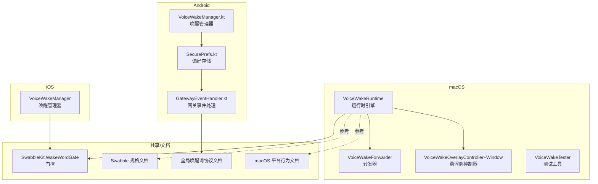
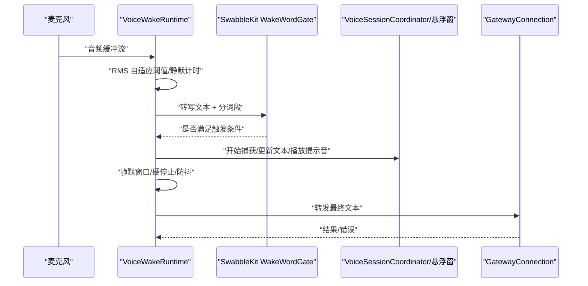
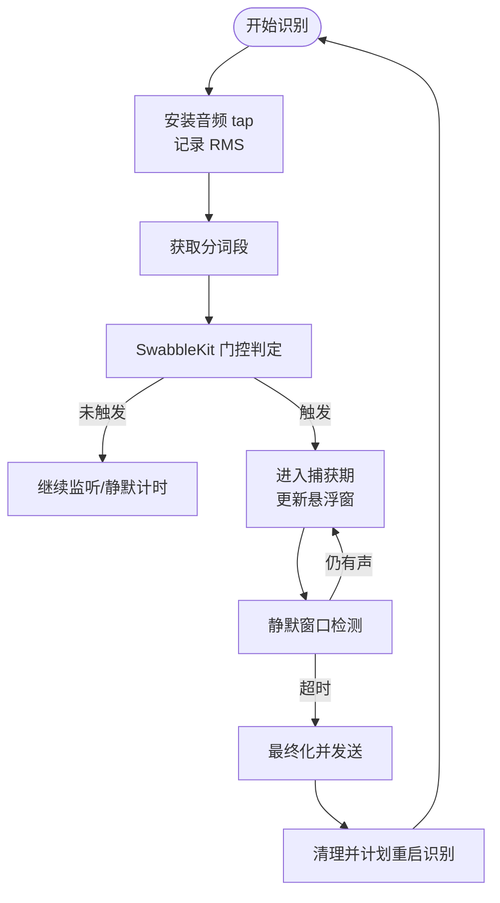
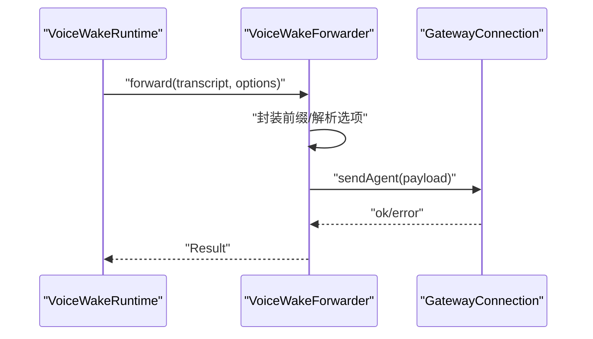
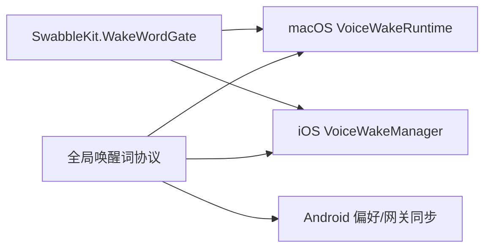

# 语音唤醒

<cite>
**本文引用的文件**
- [apps/macos/Sources/OpenClaw/VoiceWakeRuntime.swift](file://apps/macos/Sources/OpenClaw/VoiceWakeRuntime.swift)
- [apps/macos/Sources/OpenClaw/VoiceWakeForwarder.swift](file://apps/macos/Sources/OpenClaw/VoiceWakeForwarder.swift)
- [apps/macos/Sources/OpenClaw/VoiceWakeOverlayController+Window.swift](file://apps/macos/Sources/OpenClaw/VoiceWakeOverlayController+Window.swift)
- [apps/macos/Sources/OpenClaw/VoiceWakeTester.swift](file://apps/macos/Sources/OpenClaw/VoiceWakeTester.swift)
- [apps/ios/Sources/Voice/VoiceWakeManager.swift](file://apps/ios/Sources/Voice/VoiceWakeManager.swift)
- [apps/android/app/src/main/java/ai/openclaw/app/voice/VoiceWakeManager.kt](file://apps/android/app/src/main/java/ai/openclaw/app/voice/VoiceWakeManager.kt)
- [apps/android/app/src/main/java/ai/openclaw/app/SecurePrefs.kt](file://apps/android/app/src/main/java/ai/openclaw/app/SecurePrefs.kt)
- [apps/android/app/src/main/java/ai/openclaw/app/node/GatewayEventHandler.kt](file://apps/android/app/src/main/java/ai/openclaw/app/node/GatewayEventHandler.kt)
- [docs/nodes/voicewake.md](file://docs/nodes/voicewake.md)
- [docs/platforms/mac/voicewake.md](file://docs/platforms/mac/voicewake.md)
- [Swabble/docs/spec.md](file://Swabble/docs/spec.md)
- [Swabble/Sources/SwabbleKit/WakeWordGate.swift](file://Swabble/Sources/SwabbleKit/WakeWordGate.swift)
</cite>

## 目录

1. [简介](#简介)
2. [项目结构](#项目结构)
3. [核心组件](#核心组件)
4. [架构总览](#架构总览)
5. [详细组件分析](#详细组件分析)
6. [依赖关系分析](#依赖关系分析)
7. [性能考量](#性能考量)
8. [故障排查指南](#故障排查指南)
9. [结论](#结论)
10. [附录](#附录)

## 简介

本文件面向 macOS 节点的“语音唤醒”能力，系统化阐述关键词检测、触发判定、系统响应与任务调度机制。文档覆盖以下主题：

- 关键词检测与唤醒词训练、自定义唤醒词配置与灵敏度调节
- 唤醒检测算法、噪声抑制与误唤醒防护策略
- 唤醒后的系统激活、任务调度与状态同步
- 性能优化、功耗控制与用户体验改进
- 不同唤醒词的识别准确率、环境适应性与隐私保护

## 项目结构

围绕语音唤醒的关键代码分布在多端应用与共享库中：

- macOS 应用：运行时引擎、转发器、悬浮窗控制器、测试工具
- iOS 应用：唤醒管理器与权限请求
- Android 应用：唤醒管理器、偏好存储与网关事件处理
- 文档：全局唤醒词协议、平台行为规范、Swabble 守护进程与门控机制

**图表来源**

- [apps/macos/Sources/OpenClaw/VoiceWakeRuntime.swift:1-777](file://apps/macos/Sources/OpenClaw/VoiceWakeRuntime.swift#L1-L777)
- [apps/macos/Sources/OpenClaw/VoiceWakeForwarder.swift:1-74](file://apps/macos/Sources/OpenClaw/VoiceWakeForwarder.swift#L1-L74)
- [apps/macos/Sources/OpenClaw/VoiceWakeOverlayController+Window.swift:1-114](file://apps/macos/Sources/OpenClaw/VoiceWakeOverlayController+Window.swift#L1-L114)
- [apps/macos/Sources/OpenClaw/VoiceWakeTester.swift:36-467](file://apps/macos/Sources/OpenClaw/VoiceWakeTester.swift#L36-L467)
- [apps/ios/Sources/Voice/VoiceWakeManager.swift:1-477](file://apps/ios/Sources/Voice/VoiceWakeManager.swift#L1-L477)
- [apps/android/app/src/main/java/ai/openclaw/app/voice/VoiceWakeManager.kt:1-174](file://apps/android/app/src/main/java/ai/openclaw/app/voice/VoiceWakeManager.kt#L1-L174)
- [apps/android/app/src/main/java/ai/openclaw/app/SecurePrefs.kt:302-321](file://apps/android/app/src/main/java/ai/openclaw/app/SecurePrefs.kt#L302-L321)
- [apps/android/app/src/main/java/ai/openclaw/app/node/GatewayEventHandler.kt:1-45](file://apps/android/app/src/main/java/ai/openclaw/app/node/GatewayEventHandler.kt#L1-L45)
- [docs/nodes/voicewake.md:1-67](file://docs/nodes/voicewake.md#L1-L67)
- [docs/platforms/mac/voicewake.md:1-32](file://docs/platforms/mac/voicewake.md#L1-L32)
- [Swabble/docs/spec.md:1-34](file://Swabble/docs/spec.md#L1-L34)
- [Swabble/Sources/SwabbleKit/WakeWordGate.swift](file://Swabble/Sources/SwabbleKit/WakeWordGate.swift)

**章节来源**

- [docs/platforms/mac/voicewake.md:1-32](file://docs/platforms/mac/voicewake.md#L1-L32)
- [docs/nodes/voicewake.md:1-67](file://docs/nodes/voicewake.md#L1-L67)
- [Swabble/docs/spec.md:1-34](file://Swabble/docs/spec.md#L1-L34)

## 核心组件

- macOS 运行时引擎（VoiceWakeRuntime）
  - 基于 Speech.framework 的持续识别，使用 SwabbleKit 的 WakeWordGate 实现触发词门控
  - 支持 RMS 自适应噪声阈值、静默窗口检测、硬停止与会话防抖
  - 通过 VoiceSessionCoordinator 驱动悬浮窗与音频状态指示
- 转发器（VoiceWakeForwarder）
  - 将最终转写文本封装并经网关通道发送至目标代理
- 悬浮窗控制器（VoiceWakeOverlayController+Window）
  - 窗口层级与布局管理，支持首次呈现与溢出处理
- 测试工具（VoiceWakeTester）
  - 验证麦克风与语音权限、设备可用性，演示识别流程
- iOS 唤醒管理器（VoiceWakeManager）
  - 权限请求、音频会话配置、识别回调与命令提取
- Android 唤醒管理器与网关同步
  - 本地触发词列表、偏好持久化、与网关的同步与广播

**章节来源**

- [apps/macos/Sources/OpenClaw/VoiceWakeRuntime.swift:1-777](file://apps/macos/Sources/OpenClaw/VoiceWakeRuntime.swift#L1-L777)
- [apps/macos/Sources/OpenClaw/VoiceWakeForwarder.swift:1-74](file://apps/macos/Sources/OpenClaw/VoiceWakeForwarder.swift#L1-L74)
- [apps/macos/Sources/OpenClaw/VoiceWakeOverlayController+Window.swift:1-114](file://apps/macos/Sources/OpenClaw/VoiceWakeOverlayController+Window.swift#L1-L114)
- [apps/macos/Sources/OpenClaw/VoiceWakeTester.swift:36-467](file://apps/macos/Sources/OpenClaw/VoiceWakeTester.swift#L36-L467)
- [apps/ios/Sources/Voice/VoiceWakeManager.swift:1-477](file://apps/ios/Sources/Voice/VoiceWakeManager.swift#L1-L477)
- [apps/android/app/src/main/java/ai/openclaw/app/voice/VoiceWakeManager.kt:1-174](file://apps/android/app/src/main/java/ai/openclaw/app/voice/VoiceWakeManager.kt#L1-L174)
- [apps/android/app/src/main/java/ai/openclaw/app/SecurePrefs.kt:302-321](file://apps/android/app/src/main/java/ai/openclaw/app/SecurePrefs.kt#L302-L321)
- [apps/android/app/src/main/java/ai/openclaw/app/node/GatewayEventHandler.kt:1-45](file://apps/android/app/src/main/java/ai/openclaw/app/node/GatewayEventHandler.kt#L1-L45)

## 架构总览

macOS 语音唤醒采用“本地识别 + 门控触发 + 状态驱动 + 网关转发”的分层设计：

- 本地识别层：Speech.framework 提供实时音频流与分词段信息
- 门控层：SwabbleKit WakeWordGate 基于分词时间戳要求触发词与后续词之间的最小停顿
- 状态层：运行时引擎维护识别生成、静默计时、硬停止与防抖
- UI 层：悬浮窗展示部分/最终文本，伴随音频能量可视化
- 转发层：将最终文本封装并通过网关通道投递到目标代理

**图表来源**

- [apps/macos/Sources/OpenClaw/VoiceWakeRuntime.swift:141-233](file://apps/macos/Sources/OpenClaw/VoiceWakeRuntime.swift#L141-L233)
- [Swabble/Sources/SwabbleKit/WakeWordGate.swift](file://Swabble/Sources/SwabbleKit/WakeWordGate.swift)
- [apps/macos/Sources/OpenClaw/VoiceWakeForwarder.swift:44-66](file://apps/macos/Sources/OpenClaw/VoiceWakeForwarder.swift#L44-L66)

**章节来源**

- [Swabble/docs/spec.md:17-24](file://Swabble/docs/spec.md#L17-L24)
- [docs/platforms/mac/voicewake.md:15-23](file://docs/platforms/mac/voicewake.md#L15-L23)

## 详细组件分析

### macOS 运行时引擎（VoiceWakeRuntime）

- 关键职责
  - 启停识别管线、权限校验、设备可用性检查
  - RMS 自适应噪声阈值与语音活动检测
  - 基于分词段的触发门控与静默窗口策略
  - 捕获期文本拼接、悬浮窗更新与最终发送
  - 硬停止与防抖，确保不会长期占用资源
- 数据结构与复杂度
  - 识别生成号用于丢弃过期回调，避免竞态
  - 分词段集合用于精确计算触发词结束时刻与后续停顿
- 依赖链
  - 依赖 SwabbleKit WakeWordGate 进行触发判定
  - 依赖 VoiceSessionCoordinator 驱动 UI
  - 依赖 VoiceWakeForwarder 执行转发
- 优化点
  - 延迟创建 AVAudioEngine，避免启动时抢占蓝牙耳机高质量配置
  - 自适应阈值随能量变化调整平滑系数，提升稳定性

**图表来源**

- [apps/macos/Sources/OpenClaw/VoiceWakeRuntime.swift:278-382](file://apps/macos/Sources/OpenClaw/VoiceWakeRuntime.swift#L278-L382)
- [apps/macos/Sources/OpenClaw/VoiceWakeRuntime.swift:576-651](file://apps/macos/Sources/OpenClaw/VoiceWakeRuntime.swift#L576-L651)

**章节来源**

- [apps/macos/Sources/OpenClaw/VoiceWakeRuntime.swift:51-77](file://apps/macos/Sources/OpenClaw/VoiceWakeRuntime.swift#L51-L77)
- [apps/macos/Sources/OpenClaw/VoiceWakeRuntime.swift:141-233](file://apps/macos/Sources/OpenClaw/VoiceWakeRuntime.swift#L141-L233)
- [apps/macos/Sources/OpenClaw/VoiceWakeRuntime.swift:278-382](file://apps/macos/Sources/OpenClaw/VoiceWakeRuntime.swift#L278-L382)
- [apps/macos/Sources/OpenClaw/VoiceWakeRuntime.swift:576-651](file://apps/macos/Sources/OpenClaw/VoiceWakeRuntime.swift#L576-L651)

### 转发器（VoiceWakeForwarder）

- 功能
  - 对最终文本进行前缀封装，包含来源主机名等上下文
  - 通过网关连接发送到指定通道与代理
  - 返回成功/失败结果并记录日志
- 通道与交付
  - 默认通道为 webchat，可按需切换
  - deliver 标志由通道策略决定是否实际投递

**图表来源**

- [apps/macos/Sources/OpenClaw/VoiceWakeForwarder.swift:44-66](file://apps/macos/Sources/OpenClaw/VoiceWakeForwarder.swift#L44-L66)

**章节来源**

- [apps/macos/Sources/OpenClaw/VoiceWakeForwarder.swift:1-74](file://apps/macos/Sources/OpenClaw/VoiceWakeForwarder.swift#L1-L74)

### 悬浮窗控制器（VoiceWakeOverlayController+Window）

- 功能
  - 窗口层级与动画呈现，首次呈现保持状态项“正在收听”
  - 文本测量与溢出处理，动态计算高度与最大高度
  - 根据关闭原因与发送结果调整消失帧位置
- 与运行时协作
  - 通过 VoiceSessionCoordinator 更新文本与音量等级
  - 在捕获期保持状态项高亮，在发送后停止

**章节来源**

- [apps/macos/Sources/OpenClaw/VoiceWakeOverlayController+Window.swift:1-114](file://apps/macos/Sources/OpenClaw/VoiceWakeOverlayController+Window.swift#L1-L114)

### 测试工具（VoiceWakeTester）

- 功能
  - 校验麦克风与语音识别权限字符串
  - 配置音频输入设备与识别请求
  - 演示识别回调与静默检测流程
- 适用场景
  - 开发调试与回归验证

**章节来源**

- [apps/macos/Sources/OpenClaw/VoiceWakeTester.swift:36-467](file://apps/macos/Sources/OpenClaw/VoiceWakeTester.swift#L36-L467)

### iOS 唤醒管理器（VoiceWakeManager）

- 功能
  - 请求麦克风与语音识别权限
  - 配置音频会话（测量模式），安装 tap 并启动识别
  - 从识别回调中提取命令并触发回调
- 与门控的关系
  - 使用静态方法调用 WakeWordGate 进行触发判定
  - 支持外部音频捕获时的暂停/恢复

**章节来源**

- [apps/ios/Sources/Voice/VoiceWakeManager.swift:160-213](file://apps/ios/Sources/Voice/VoiceWakeManager.swift#L160-L213)
- [apps/ios/Sources/Voice/VoiceWakeManager.swift:301-354](file://apps/ios/Sources/Voice/VoiceWakeManager.swift#L301-L354)

### Android 唤醒管理器与网关同步

- 唤醒管理器
  - 使用系统 SpeechRecognizer，启用部分结果
  - 通过 VoiceWakeCommandExtractor 提取命令并调度重启
- 偏好与同步
  - SecurePrefs 解析与清洗触发词列表
  - GatewayEventHandler 将本地变更通过网关广播

**章节来源**

- [apps/android/app/src/main/java/ai/openclaw/app/voice/VoiceWakeManager.kt:1-174](file://apps/android/app/src/main/java/ai/openclaw/app/voice/VoiceWakeManager.kt#L1-L174)
- [apps/android/app/src/main/java/ai/openclaw/app/SecurePrefs.kt:302-321](file://apps/android/app/src/main/java/ai/openclaw/app/SecurePrefs.kt#L302-L321)
- [apps/android/app/src/main/java/ai/openclaw/app/node/GatewayEventHandler.kt:22-44](file://apps/android/app/src/main/java/ai/openclaw/app/node/GatewayEventHandler.kt#L22-L44)

## 依赖关系分析

- 门控与协议
  - SwabbleKit WakeWordGate 提供跨平台的触发门控能力
  - 全局唤醒词协议定义了网关持有、节点同步与事件广播
- 平台差异
  - macOS：基于 Speech.framework 与 SwabbleKit，支持分词段门控与自适应阈值
  - iOS：同样使用 Speech.framework，但权限与音频会话配置略有差异
  - Android：使用系统识别器，当前未启用自动唤醒（Voice Tab 手动捕获）

**图表来源**

- [Swabble/Sources/SwabbleKit/WakeWordGate.swift](file://Swabble/Sources/SwabbleKit/WakeWordGate.swift)
- [docs/nodes/voicewake.md:30-49](file://docs/nodes/voicewake.md#L30-L49)
- [docs/platforms/mac/voicewake.md:15-23](file://docs/platforms/mac/voicewake.md#L15-L23)

**章节来源**

- [docs/nodes/voicewake.md:1-67](file://docs/nodes/voicewake.md#L1-L67)
- [Swabble/docs/spec.md:17-24](file://Swabble/docs/spec.md#L17-L24)

## 性能考量

- 资源占用
  - macOS 延迟创建 AVAudioEngine，避免启动时抢占音频资源
  - iOS 使用测量模式音频会话，降低对其他音频的影响
- 识别稳定性
  - RMS 自适应阈值与语音增强因子，减少背景噪声误触发
  - 触发后短静默窗口（2.0s）与仅触发词长静默窗口（5.0s）平衡及时性与准确性
- 会话生命周期
  - 硬停止（120s）防止会话失控
  - 发送后防抖（350ms）避免连续触发
- UI 与能耗
  - 捕获期保持状态项高亮，结束后停止
  - 悬浮窗尺寸动态计算，避免过度绘制

[本节为通用性能建议，不直接分析具体文件]

## 故障排查指南

- 权限问题
  - macOS：确认隐私描述字符串存在，麦克风与语音识别权限已授予
  - iOS：检查麦克风与语音识别授权状态，必要时重新请求
- 设备问题
  - 确认存在可用默认输入设备，避免空格式或采样率异常
- 识别异常
  - 监听识别回调错误码，必要时延迟重启识别
- 网关转发失败
  - 检查网关连接状态与通道策略，确认 deliver 标志

**章节来源**

- [apps/macos/Sources/OpenClaw/VoiceWakeTester.swift:69-87](file://apps/macos/Sources/OpenClaw/VoiceWakeTester.swift#L69-L87)
- [apps/ios/Sources/Voice/VoiceWakeManager.swift:179-213](file://apps/ios/Sources/Voice/VoiceWakeManager.swift#L179-L213)
- [apps/macos/Sources/OpenClaw/VoiceWakeRuntime.swift:282-284](file://apps/macos/Sources/OpenClaw/VoiceWakeRuntime.swift#L282-L284)
- [apps/macos/Sources/OpenClaw/VoiceWakeForwarder.swift:68-72](file://apps/macos/Sources/OpenClaw/VoiceWakeForwarder.swift#L68-L72)

## 结论

macOS 语音唤醒通过本地识别与门控相结合的方式，在保证低误唤醒的同时实现了稳定的触发体验。配合全局唤醒词协议与跨端同步，用户可在多端一致地管理唤醒词并获得一致的系统响应。未来可在以下方面持续优化：

- 更精细的灵敏度调节与自适应阈值
- 多语言与方言适配的分词段门控
- 与更多平台（如 Android）的唤醒能力对齐

[本节为总结性内容，不直接分析具体文件]

## 附录

### 唤醒词训练与自定义配置

- 训练与配置
  - 通过全局唤醒词协议集中管理触发词列表
  - 支持逗号分隔输入、清洗与长度限制
- 同步机制
  - 网关持有全局列表，节点编辑后广播给所有客户端
  - Android 当前禁用自动唤醒，Voice Tab 手动捕获

**章节来源**

- [docs/nodes/voicewake.md:18-67](file://docs/nodes/voicewake.md#L18-L67)
- [apps/android/app/src/main/java/ai/openclaw/app/SecurePrefs.kt:302-321](file://apps/android/app/src/main/java/ai/openclaw/app/SecurePrefs.kt#L302-L321)
- [apps/android/app/src/main/java/ai/openclaw/app/node/GatewayEventHandler.kt:22-44](file://apps/android/app/src/main/java/ai/openclaw/app/node/GatewayEventHandler.kt#L22-L44)

### 灵敏度与误唤醒防护

- 灵敏度
  - RMS 自适应阈值与语音增强因子
  - 触发后短静默窗口与仅触发词长静默窗口
- 误唤醒防护
  - 分词段门控要求触发词与后续词之间的最小停顿
  - 文本仅匹配回退路径与日志记录辅助定位

**章节来源**

- [apps/macos/Sources/OpenClaw/VoiceWakeRuntime.swift:59-63](file://apps/macos/Sources/OpenClaw/VoiceWakeRuntime.swift#L59-L63)
- [apps/macos/Sources/OpenClaw/VoiceWakeRuntime.swift:338-356](file://apps/macos/Sources/OpenClaw/VoiceWakeRuntime.swift#L338-L356)

### 系统激活、任务调度与状态同步

- 系统激活
  - 触发后播放提示音、启动悬浮窗、更新状态项
- 任务调度
  - 捕获期定时器监控静默窗口与硬停止
  - 发送后清理并计划重启识别
- 状态同步
  - 网关广播最新触发词列表，节点本地保持启用开关

**章节来源**

- [apps/macos/Sources/OpenClaw/VoiceWakeRuntime.swift:531-574](file://apps/macos/Sources/OpenClaw/VoiceWakeRuntime.swift#L531-L574)
- [apps/macos/Sources/OpenClaw/VoiceWakeRuntime.swift:576-651](file://apps/macos/Sources/OpenClaw/VoiceWakeRuntime.swift#L576-L651)
- [docs/platforms/mac/voicewake.md:25-28](file://docs/platforms/mac/voicewake.md#L25-L28)

### 环境适应性与隐私保护

- 环境适应性
  - 自适应噪声阈值与语音增强因子提升复杂环境鲁棒性
- 隐私保护
  - 本地识别，不上传音频或转写
  - 仅在用户授权后启动识别与录音

**章节来源**

- [Swabble/docs/spec.md:6-8](file://Swabble/docs/spec.md#L6-L8)
- [apps/macos/Sources/OpenClaw/VoiceWakeTester.swift:69-79](file://apps/macos/Sources/OpenClaw/VoiceWakeTester.swift#L69-L79)
