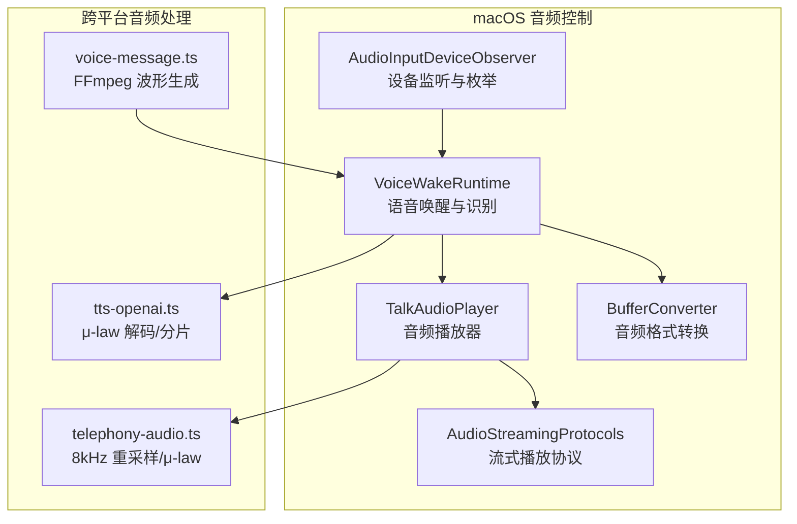
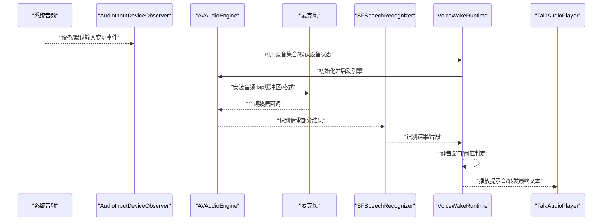
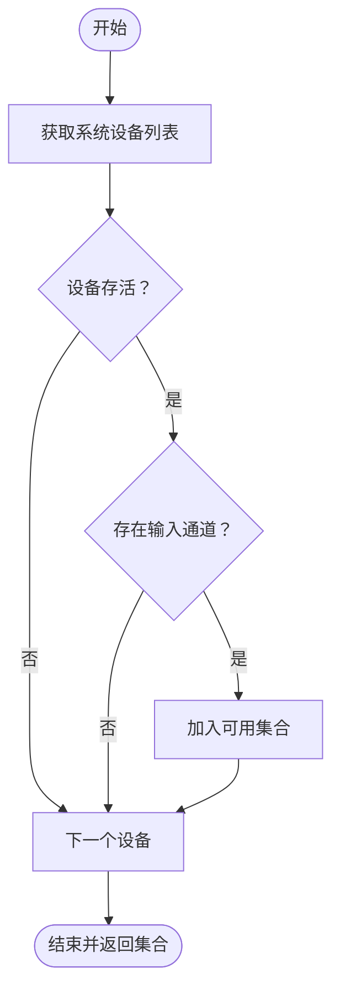
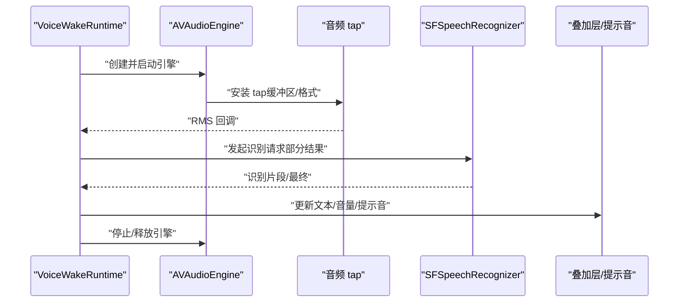
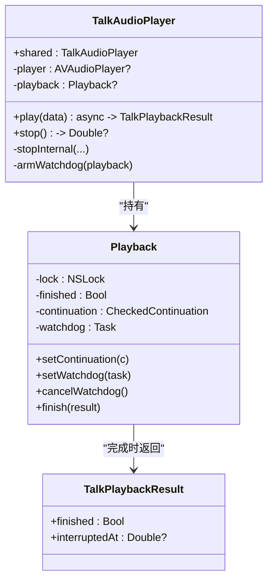
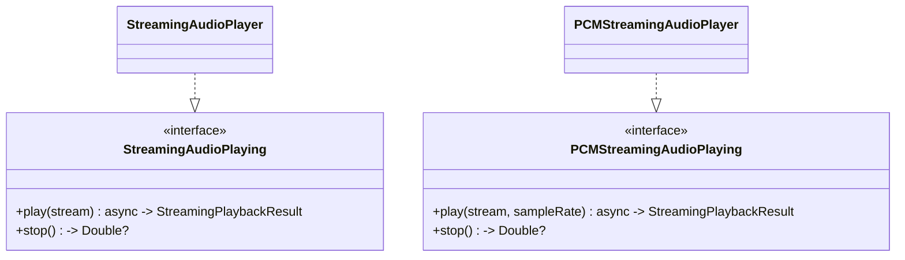
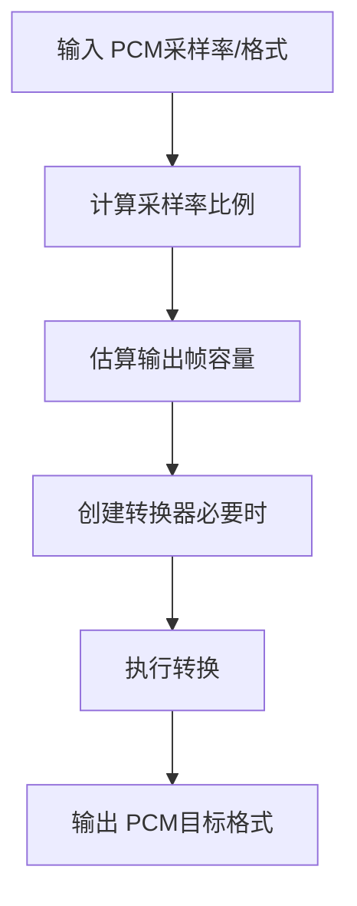
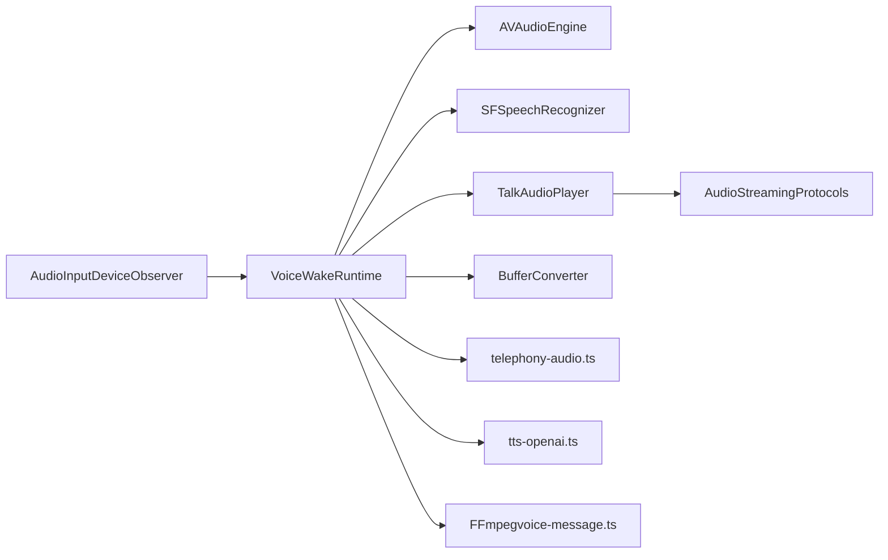

# 音频控制

<cite>
**本文引用的文件**
- [AudioInputDeviceObserver.swift](file://apps/macos/Sources/OpenClaw/AudioInputDeviceObserver.swift)
- [VoiceWakeRuntime.swift](file://apps/macos/Sources/OpenClaw/VoiceWakeRuntime.swift)
- [TalkAudioPlayer.swift](file://apps/macos/Sources/OpenClaw/TalkAudioPlayer.swift)
- [AudioStreamingProtocols.swift](file://apps/shared/OpenClawKit/Sources/OpenClawKit/AudioStreamingProtocols.swift)
- [BufferConverter.swift](file://Swabble/Sources/SwabbleCore/Speech/BufferConverter.swift)
- [telephony-audio.ts](file://extensions/voice-call/src/telephony-audio.ts)
- [tts-openai.ts](file://extensions/voice-call/src/providers/tts-openai.ts)
- [voice-message.ts](file://src/discord/voice-message.ts)
- [AudioInputDeviceObserverTests.swift](file://apps/macos/Tests/OpenClawIPCTests/AudioInputDeviceObserverTests.swift)
- [TalkAudioPlayerTests.swift](file://apps/macos/Tests/OpenClawIPCTests/TalkAudioPlayerTests.swift)
</cite>

## 目录

1. [简介](#简介)
2. [项目结构](#项目结构)
3. [核心组件](#核心组件)
4. [架构总览](#架构总览)
5. [详细组件分析](#详细组件分析)
6. [依赖关系分析](#依赖关系分析)
7. [性能考量](#性能考量)
8. [故障排除指南](#故障排除指南)
9. [结论](#结论)
10. [附录](#附录)

## 简介

本文件面向 macOS 节点的音频控制能力，系统化梳理音频输入输出设备管理、音量控制、音频格式支持、麦克风访问权限配置、录音与播放流程、设备枚举与切换、音频质量与延迟优化、回声消除配置、API 调用示例、错误处理与性能监控方法，并提供兼容性测试与故障排除建议。内容基于仓库中 macOS 平台的 Swift 实现与共享协议定义，辅以跨平台音频处理脚本与工具。

## 项目结构

围绕 macOS 节点的音频控制，主要涉及以下模块：

- 设备观察与枚举：通过 CoreAudio 监听系统默认输入设备变化与可用输入设备集合
- 语音唤醒与识别：基于 AVFoundation 的 AVAudioEngine 与 SFSpeechRecognizer 的录音与识别流水线
- 播放器：基于 AVAudioPlayer 的播放控制与超时看门狗
- 共享协议：StreamingAudioPlaying/PCMStreamingAudioPlaying 定义流式音频播放接口
- 格式转换与编解码：Swift/TypeScript 工具用于 PCM、采样率重采样、μ-law 编解码与分片
- 媒体理解与波形生成：基于 FFmpeg 的 PCM 提取与波形生成

图表来源

- [AudioInputDeviceObserver.swift:1-217](file://apps/macos/Sources/OpenClaw/AudioInputDeviceObserver.swift#L1-L217)
- [VoiceWakeRuntime.swift:1-777](file://apps/macos/Sources/OpenClaw/VoiceWakeRuntime.swift#L1-L777)
- [TalkAudioPlayer.swift:1-159](file://apps/macos/Sources/OpenClaw/TalkAudioPlayer.swift#L1-L159)
- [AudioStreamingProtocols.swift:1-17](file://apps/shared/OpenClawKit/Sources/OpenClawKit/AudioStreamingProtocols.swift#L1-L17)
- [BufferConverter.swift:1-31](file://Swabble/Sources/SwabbleCore/Speech/BufferConverter.swift#L1-L31)
- [telephony-audio.ts:1-90](file://extensions/voice-call/src/telephony-audio.ts#L1-L90)
- [tts-openai.ts:180-218](file://extensions/voice-call/src/providers/tts-openai.ts#L180-L218)
- [voice-message.ts:72-144](file://src/discord/voice-message.ts#L72-L144)

章节来源

- [AudioInputDeviceObserver.swift:1-217](file://apps/macos/Sources/OpenClaw/AudioInputDeviceObserver.swift#L1-L217)
- [VoiceWakeRuntime.swift:1-777](file://apps/macos/Sources/OpenClaw/VoiceWakeRuntime.swift#L1-L777)
- [TalkAudioPlayer.swift:1-159](file://apps/macos/Sources/OpenClaw/TalkAudioPlayer.swift#L1-L159)
- [AudioStreamingProtocols.swift:1-17](file://apps/shared/OpenClawKit/Sources/OpenClawKit/AudioStreamingProtocols.swift#L1-L17)
- [BufferConverter.swift:1-31](file://Swabble/Sources/SwabbleCore/Speech/BufferConverter.swift#L1-L31)
- [telephony-audio.ts:1-90](file://extensions/voice-call/src/telephony-audio.ts#L1-L90)
- [tts-openai.ts:180-218](file://extensions/voice-call/src/providers/tts-openai.ts#L180-L218)
- [voice-message.ts:72-144](file://src/discord/voice-message.ts#L72-L144)

## 核心组件

- 设备观察与枚举（AudioInputDeviceObserver）
  - 监听系统音频设备列表与默认输入设备变化
  - 过滤存活且具备输入通道的设备，返回可用设备 UID 集合
  - 提供“默认输入设备是否可用”的预检，避免访问 AVAudioEngine.inputNode 导致崩溃
- 语音唤醒与识别（VoiceWakeRuntime）
  - 延迟创建 AVAudioEngine，避免应用启动即占用音频资源
  - 使用 SFSpeechAudioBufferRecognitionRequest 与 SFSpeechRecognizer 进行识别
  - 通过音频 tap 获取 RMS，动态噪声阈值，结合静音窗口策略判定触发与结束
  - 支持触发提示音与发送提示音，覆盖“仅触发”和“触发后静音”两种场景
- 音频播放器（TalkAudioPlayer）
  - 基于 AVAudioPlayer 的异步播放与停止控制
  - 内置超时看门狗，防止播放器卡死或长时间无响应
  - 结果封装为可取消的异步任务，便于上层协调
- 流式播放协议（AudioStreamingProtocols）
  - 定义 StreamingAudioPlaying 与 PCMStreamingAudioPlaying 接口
  - 为异步数据流播放提供统一抽象，支持按采样率播放
- 音频格式转换与编解码（BufferConverter、telephony-audio.ts、tts-openai.ts）
  - Swift：AVAudioConverter 动态格式转换，支持采样率与格式适配
  - TypeScript：8kHz 重采样、μ-law 编解码、20ms 分片，满足电话/流媒体传输需求
- 媒体理解与波形生成（voice-message.ts）
  - 使用 FFmpeg 将音频转为 8kHz 单声道 PCM，提取波形数据

章节来源

- [AudioInputDeviceObserver.swift:11-49](file://apps/macos/Sources/OpenClaw/AudioInputDeviceObserver.swift#L11-L49)
- [VoiceWakeRuntime.swift:141-233](file://apps/macos/Sources/OpenClaw/VoiceWakeRuntime.swift#L141-L233)
- [TalkAudioPlayer.swift:52-152](file://apps/macos/Sources/OpenClaw/TalkAudioPlayer.swift#L52-L152)
- [AudioStreamingProtocols.swift:3-17](file://apps/shared/OpenClawKit/Sources/OpenClawKit/AudioStreamingProtocols.swift#L3-L17)
- [BufferConverter.swift:14-31](file://Swabble/Sources/SwabbleCore/Speech/BufferConverter.swift#L14-L31)
- [telephony-audio.ts:10-90](file://extensions/voice-call/src/telephony-audio.ts#L10-L90)
- [tts-openai.ts:194-218](file://extensions/voice-call/src/providers/tts-openai.ts#L194-L218)
- [voice-message.ts:75-131](file://src/discord/voice-message.ts#L75-L131)

## 架构总览

下图展示从设备监听到语音唤醒识别再到播放的整体流程，以及与流式播放协议的关系：

图表来源

- [AudioInputDeviceObserver.swift:79-122](file://apps/macos/Sources/OpenClaw/AudioInputDeviceObserver.swift#L79-L122)
- [VoiceWakeRuntime.swift:163-233](file://apps/macos/Sources/OpenClaw/VoiceWakeRuntime.swift#L163-L233)
- [TalkAudioPlayer.swift:52-152](file://apps/macos/Sources/OpenClaw/TalkAudioPlayer.swift#L52-L152)

## 详细组件分析

### 设备观察与枚举（AudioInputDeviceObserver）

- 关键职责
  - 监听系统设备列表与默认输入设备属性变化
  - 过滤存活且有输入通道的设备，返回可用设备 UID 集合
  - 提供“默认输入设备是否可用”的预检，避免后续访问失败
- 数据结构与复杂度
  - 设备遍历：O(N)，N 为系统设备数量
  - 属性查询：单次 O(1)，整体 O(N)
- 错误处理
  - 监听安装失败记录日志
  - 设备属性获取失败时安全返回空集或空值
- 性能影响
  - 在主线程队列注册监听，避免跨线程同步问题
  - 仅在需要时启动监听，避免常驻开销

图表来源

- [AudioInputDeviceObserver.swift:16-40](file://apps/macos/Sources/OpenClaw/AudioInputDeviceObserver.swift#L16-L40)

章节来源

- [AudioInputDeviceObserver.swift:11-49](file://apps/macos/Sources/OpenClaw/AudioInputDeviceObserver.swift#L11-L49)
- [AudioInputDeviceObserverTests.swift:6-21](file://apps/macos/Tests/OpenClawIPCTests/AudioInputDeviceObserverTests.swift#L6-L21)

### 语音唤醒与识别（VoiceWakeRuntime）

- 关键职责
  - 延迟创建 AVAudioEngine，避免启动即占用音频资源
  - 通过音频 tap 获取 RMS，自适应噪声阈值，结合静音窗口策略判定触发与结束
  - 支持“仅触发”和“触发后静音”两种检测模式，带冷却去抖
  - 触发后显示叠加层并播放提示音，最终转发识别文本
- 处理逻辑
  - 启动前检查权限与可用设备
  - 安装 tap 并启动引擎
  - 识别回调中更新 UI 文本与音量等级
  - 达到硬上限或静音窗口后结束捕获并清理资源
- 性能与稳定性
  - 识别任务与引擎生命周期严格管理，避免泄漏
  - 重启识别器时使用 generation 字段丢弃过期回调
  - 主动释放引擎以释放音频会话资源

图表来源

- [VoiceWakeRuntime.swift:163-233](file://apps/macos/Sources/OpenClaw/VoiceWakeRuntime.swift#L163-L233)
- [VoiceWakeRuntime.swift:576-651](file://apps/macos/Sources/OpenClaw/VoiceWakeRuntime.swift#L576-L651)

章节来源

- [VoiceWakeRuntime.swift:141-233](file://apps/macos/Sources/OpenClaw/VoiceWakeRuntime.swift#L141-L233)
- [VoiceWakeRuntime.swift:576-651](file://apps/macos/Sources/OpenClaw/VoiceWakeRuntime.swift#L576-L651)

### 音频播放器（TalkAudioPlayer）

- 关键职责
  - 异步播放音频数据，支持停止与中断时间查询
  - 内置看门狗：若超过一定时间未开始播放或播放异常，自动结束并返回失败
- 数据结构
  - Playback 类封装协程续体、取消与看门狗任务
- 错误处理
  - 播放器拒绝播放或抛错时记录日志并返回失败结果
  - 取消播放时清理状态并停止引擎

图表来源

- [TalkAudioPlayer.swift:5-159](file://apps/macos/Sources/OpenClaw/TalkAudioPlayer.swift#L5-L159)

章节来源

- [TalkAudioPlayer.swift:52-152](file://apps/macos/Sources/OpenClaw/TalkAudioPlayer.swift#L52-L152)
- [TalkAudioPlayerTests.swift](file://apps/macos/Tests/OpenClawIPCTests/TalkAudioPlayerTests.swift)

### 流式播放协议（AudioStreamingProtocols）

- StreamingAudioPlaying
  - play(stream)：接收异步数据流进行播放
  - stop()：停止播放并返回中断时间
- PCMStreamingAudioPlaying
  - play(stream, sampleRate)：按指定采样率播放 PCM 数据流
  - stop()

图表来源

- [AudioStreamingProtocols.swift:3-17](file://apps/shared/OpenClawKit/Sources/OpenClawKit/AudioStreamingProtocols.swift#L3-L17)

章节来源

- [AudioStreamingProtocols.swift:1-17](file://apps/shared/OpenClawKit/Sources/OpenClawKit/AudioStreamingProtocols.swift#L1-L17)

### 音频格式转换与编解码

- Swift（BufferConverter）
  - 使用 AVAudioConverter 动态创建与复用，避免重复初始化
  - 计算输出帧容量，确保转换缓冲区足够
- TypeScript（telephony-audio.ts）
  - 8kHz 重采样：线性插值
  - μ-law 编码：标准算法
  - 20ms 分片：8kHz 单声道，每包 160 字节
- TypeScript（tts-openai.ts）
  - μ-law 解码：还原为 16-bit PCM
  - 20ms 分片：与编码对应

图表来源

- [BufferConverter.swift:14-31](file://Swabble/Sources/SwabbleCore/Speech/BufferConverter.swift#L14-L31)
- [telephony-audio.ts:10-37](file://extensions/voice-call/src/telephony-audio.ts#L10-L37)
- [tts-openai.ts:194-218](file://extensions/voice-call/src/providers/tts-openai.ts#L194-L218)

章节来源

- [BufferConverter.swift:14-31](file://Swabble/Sources/SwabbleCore/Speech/BufferConverter.swift#L14-L31)
- [telephony-audio.ts:10-90](file://extensions/voice-call/src/telephony-audio.ts#L10-L90)
- [tts-openai.ts:194-218](file://extensions/voice-call/src/providers/tts-openai.ts#L194-L218)

### 媒体理解与波形生成

- voice-message.ts
  - 使用 FFmpeg 将音频转为 8kHz 单声道 PCM
  - 抽取样本并归一化生成波形数组，作为消息预览

章节来源

- [voice-message.ts:75-131](file://src/discord/voice-message.ts#L75-L131)

## 依赖关系分析

- 组件耦合
  - VoiceWakeRuntime 依赖 AudioInputDeviceObserver 的可用设备预检
  - TalkAudioPlayer 与流式播放协议解耦，便于替换实现
  - BufferConverter 与 telephony-audio.ts/tts-openai.ts 形成跨语言格式适配链路
- 外部依赖
  - CoreAudio：系统音频设备属性查询与监听
  - AVFoundation：音频引擎、播放器、识别器
  - Speech：语音识别
  - FFmpeg：音频转码与波形提取

图表来源

- [AudioInputDeviceObserver.swift:1-217](file://apps/macos/Sources/OpenClaw/AudioInputDeviceObserver.swift#L1-L217)
- [VoiceWakeRuntime.swift:1-777](file://apps/macos/Sources/OpenClaw/VoiceWakeRuntime.swift#L1-L777)
- [TalkAudioPlayer.swift:1-159](file://apps/macos/Sources/OpenClaw/TalkAudioPlayer.swift#L1-L159)
- [AudioStreamingProtocols.swift:1-17](file://apps/shared/OpenClawKit/Sources/OpenClawKit/AudioStreamingProtocols.swift#L1-L17)
- [BufferConverter.swift:1-31](file://Swabble/Sources/SwabbleCore/Speech/BufferConverter.swift#L1-L31)
- [telephony-audio.ts:1-90](file://extensions/voice-call/src/telephony-audio.ts#L1-L90)
- [tts-openai.ts:180-218](file://extensions/voice-call/src/providers/tts-openai.ts#L180-L218)
- [voice-message.ts:72-144](file://src/discord/voice-message.ts#L72-L144)

## 性能考量

- 延迟优化
  - 延迟创建 AVAudioEngine，避免应用启动即占用音频资源
  - 识别请求启用部分结果，提升交互体验
- 资源管理
  - 识别完成后主动停止引擎与移除 tap，释放音频会话
  - 使用 generation 字段丢弃过期回调，避免竞态
- 音质与稳定性
  - 自适应噪声阈值与 RMS 归一化，保证 UI 表现稳定
  - 播放器看门狗防止卡死，超时自动清理
- 跨平台一致性
  - 通过 AVAudioConverter 与 μ-law/重采样工具，统一不同采样率与格式的数据流

## 故障排除指南

- 无法找到可用默认输入设备
  - 现象：访问 AVAudioEngine.inputNode 失败或崩溃
  - 处理：启动前调用“默认输入设备是否可用”预检；若不可用，提示用户连接外置麦克风或选择其他设备
  - 参考：hasUsableDefaultInputDevice() 与 start() 中的检查
- 识别器不可用或权限不足
  - 现象：识别器不可用或返回空结果
  - 处理：确认语音识别授权状态；必要时引导用户在系统设置中授予权限
  - 参考：VoiceWakeRuntime 中对识别器可用性的检查
- 播放器无响应或卡住
  - 现象：播放器启动后长时间无声音
  - 处理：查看看门狗日志；检查音频数据有效性与格式；尝试重新初始化播放器
  - 参考：TalkAudioPlayer 的看门狗与错误日志
- 设备切换导致无声
  - 现象：切换默认输入设备后无声音
  - 处理：重新启动语音唤醒流程；监听设备变化并触发重启
  - 参考：AudioInputDeviceObserver 的监听与日志
- 波形生成失败
  - 现象：消息预览波形为空
  - 处理：确认 FFmpeg 可用；检查临时文件清理；降级使用占位波形
  - 参考：voice-message.ts 的波形生成与占位逻辑

章节来源

- [VoiceWakeRuntime.swift:169-175](file://apps/macos/Sources/OpenClaw/VoiceWakeRuntime.swift#L169-L175)
- [VoiceWakeRuntime.swift:229-232](file://apps/macos/Sources/OpenClaw/VoiceWakeRuntime.swift#L229-L232)
- [TalkAudioPlayer.swift:120-152](file://apps/macos/Sources/OpenClaw/TalkAudioPlayer.swift#L120-L152)
- [AudioInputDeviceObserver.swift:79-122](file://apps/macos/Sources/OpenClaw/AudioInputDeviceObserver.swift#L79-L122)
- [voice-message.ts:136-144](file://src/discord/voice-message.ts#L136-L144)

## 结论

该实现以 macOS 平台为核心，结合 CoreAudio、AVFoundation 与 Speech 框架，构建了从设备枚举、权限校验、录音识别到播放反馈的完整音频控制链路。通过延迟初始化、自适应阈值、看门狗与严格的生命周期管理，系统在保证低延迟的同时提升了稳定性与可维护性。跨平台的格式转换与编解码工具进一步增强了音频数据的一致性与传输效率。

## 附录

- API 调用示例（路径）
  - 设备监听：[AudioInputDeviceObserver.swift:79-122](file://apps/macos/Sources/OpenClaw/AudioInputDeviceObserver.swift#L79-L122)
  - 启动语音唤醒：[VoiceWakeRuntime.swift:163-233](file://apps/macos/Sources/OpenClaw/VoiceWakeRuntime.swift#L163-L233)
  - 播放音频：[TalkAudioPlayer.swift:52-79](file://apps/macos/Sources/OpenClaw/TalkAudioPlayer.swift#L52-L79)
  - 流式播放接口：[AudioStreamingProtocols.swift:3-17](file://apps/shared/OpenClawKit/Sources/OpenClawKit/AudioStreamingProtocols.swift#L3-L17)
  - 格式转换：[BufferConverter.swift:14-31](file://Swabble/Sources/SwabbleCore/Speech/BufferConverter.swift#L14-L31)
  - 重采样与 μ-law：[telephony-audio.ts:10-90](file://extensions/voice-call/src/telephony-audio.ts#L10-L90)
  - μ-law 解码与分片：[tts-openai.ts:194-218](file://extensions/voice-call/src/providers/tts-openai.ts#L194-L218)
  - 波形生成：[voice-message.ts:75-131](file://src/discord/voice-message.ts#L75-L131)
- 错误处理与监控
  - 设备监听安装失败日志：[AudioInputDeviceObserver.swift:114-116](file://apps/macos/Sources/OpenClaw/AudioInputDeviceObserver.swift#L114-L116)
  - 语音唤醒启动失败日志：[VoiceWakeRuntime.swift:229-232](file://apps/macos/Sources/OpenClaw/VoiceWakeRuntime.swift#L229-L232)
  - 播放器错误与看门狗日志：[TalkAudioPlayer.swift:71-77](file://apps/macos/Sources/OpenClaw/TalkAudioPlayer.swift#L71-L77), [TalkAudioPlayer.swift:133-136](file://apps/macos/Sources/OpenClaw/TalkAudioPlayer.swift#L133-L136), [TalkAudioPlayer.swift:149-150](file://apps/macos/Sources/OpenClaw/TalkAudioPlayer.swift#L149-L150)
- 兼容性测试
  - 设备可用性测试：[AudioInputDeviceObserverTests.swift:6-21](file://apps/macos/Tests/OpenClawIPCTests/AudioInputDeviceObserverTests.swift#L6-L21)
  - 播放器行为测试：[TalkAudioPlayerTests.swift](file://apps/macos/Tests/OpenClawIPCTests/TalkAudioPlayerTests.swift)
