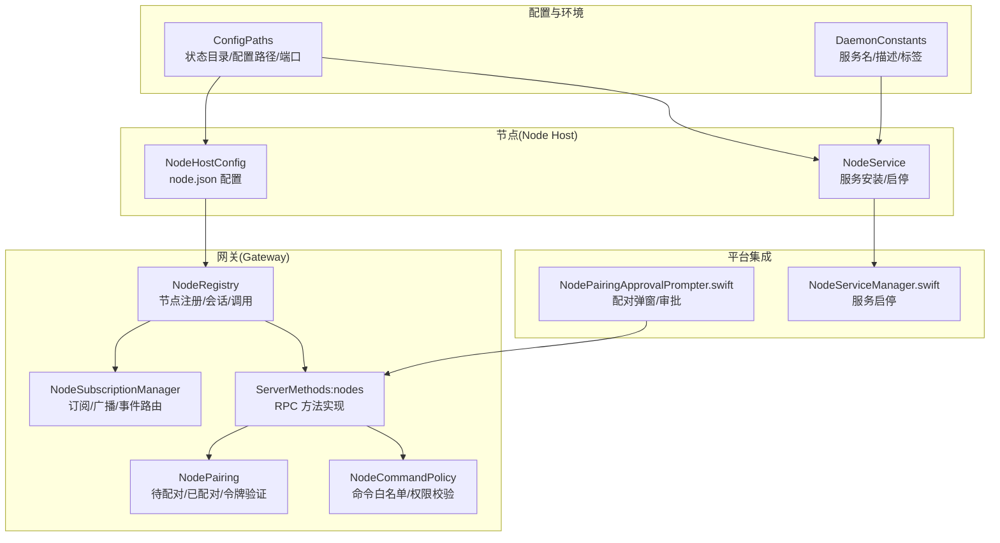
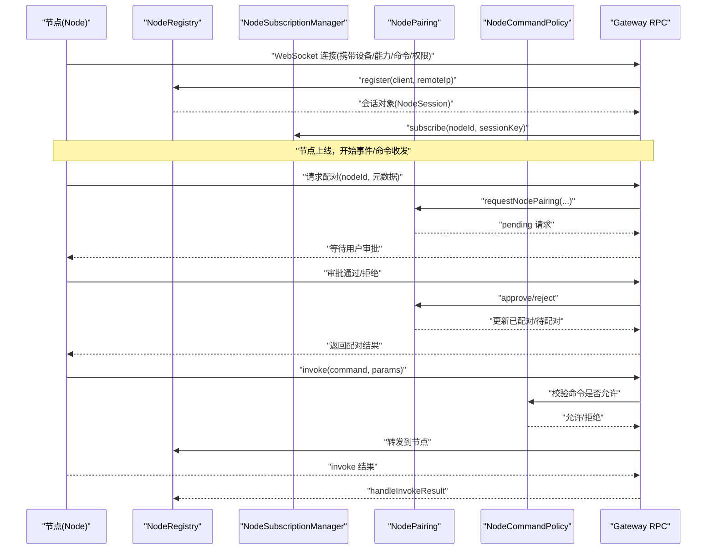
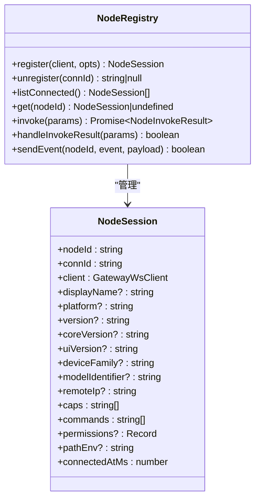
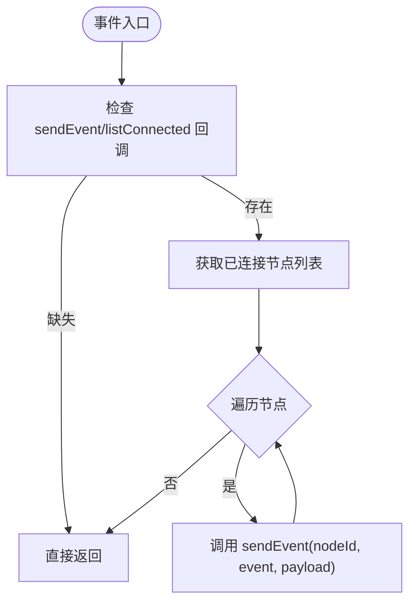
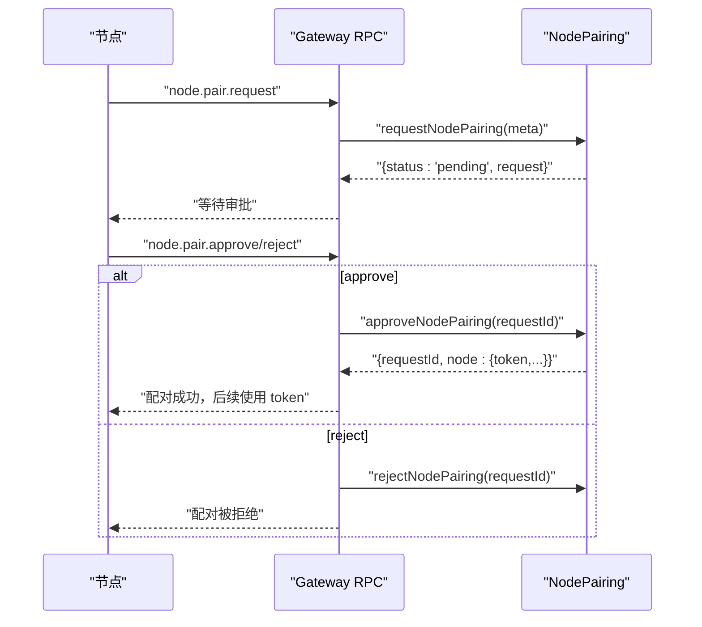
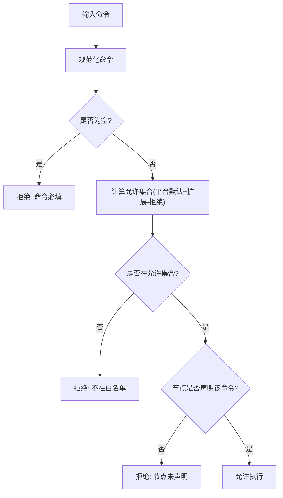
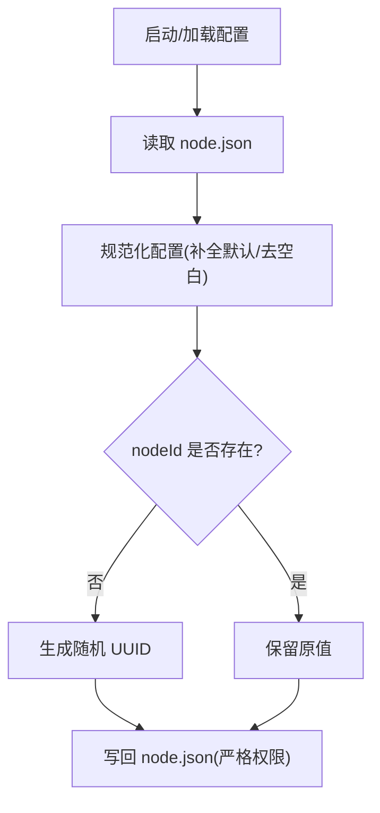
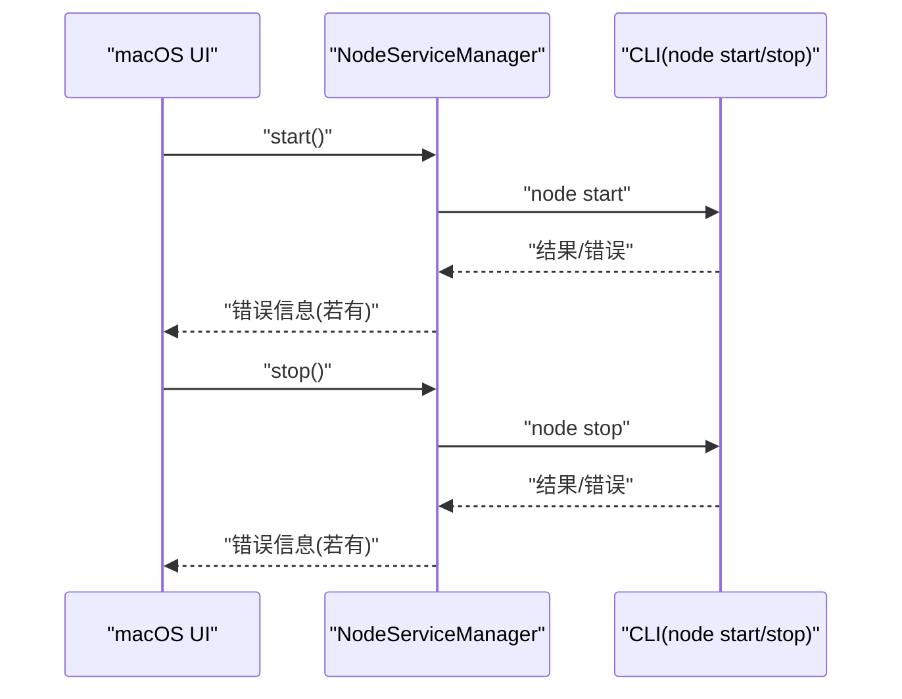
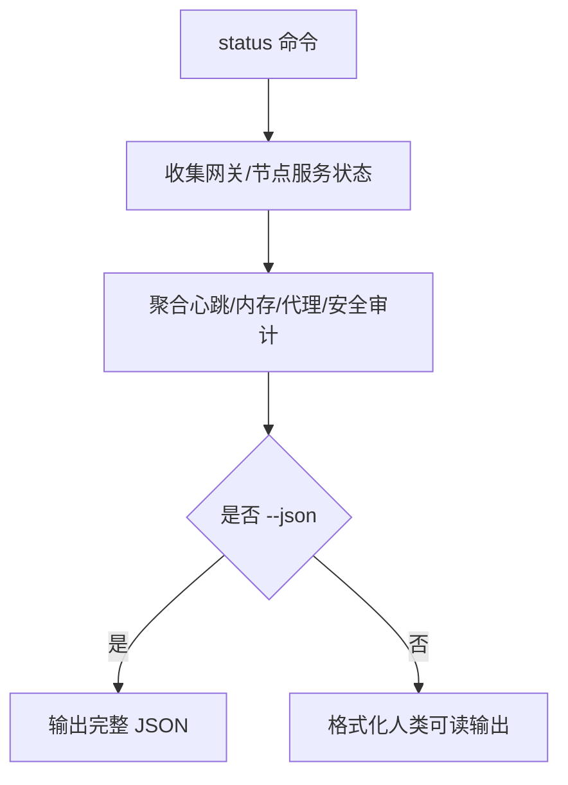
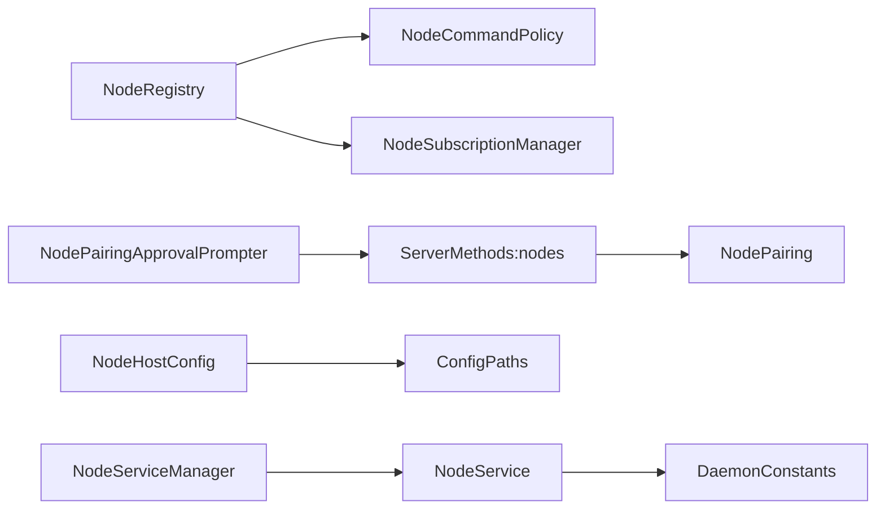

# 节点配置与管理

<cite>
**本文档引用的文件**
- [src/gateway/node-registry.ts](file://src/gateway/node-registry.ts)
- [src/gateway/server-node-subscriptions.ts](file://src/gateway/server-node-subscriptions.ts)
- [src/infra/node-pairing.ts](file://src/infra/node-pairing.ts)
- [src/gateway/node-command-policy.ts](file://src/gateway/node-command-policy.ts)
- [src/gateway/server-methods/nodes.ts](file://src/gateway/server-methods/nodes.ts)
- [src/node-host/config.ts](file://src/node-host/config.ts)
- [src/config/paths.ts](file://src/config/paths.ts)
- [src/daemon/node-service.ts](file://src/daemon/node-service.ts)
- [src/daemon/constants.ts](file://src/daemon/constants.ts)
- [apps/macos/Sources/OpenClaw/NodePairingApprovalPrompter.swift](file://apps/macos/Sources/OpenClaw/NodePairingApprovalPrompter.swift)
- [apps/macos/Sources/OpenClaw/NodeServiceManager.swift](file://apps/macos/Sources/OpenClaw/NodeServiceManager.swift)
- [src/cli/nodes-cli/register.status.ts](file://src/cli/nodes-cli/register.status.ts)
- [src/commands/status.command.ts](file://src/commands/status.command.ts)
</cite>

## 目录

1. [简介](#简介)
2. [项目结构](#项目结构)
3. [核心组件](#核心组件)
4. [架构总览](#架构总览)
5. [详细组件分析](#详细组件分析)
6. [依赖关系分析](#依赖关系分析)
7. [性能考量](#性能考量)
8. [故障排查指南](#故障排查指南)
9. [结论](#结论)
10. [附录](#附录)

## 简介

本文件系统性阐述 OpenClaw 节点配置与管理，覆盖节点注册机制、连接状态管理、节点生命周期控制、节点发现与配对流程、安全认证、命令策略与权限控制、资源管理、配置文件与环境变量、网络配置、监控与日志、故障诊断以及扩容与高可用策略。内容基于仓库源码进行深度解析，并辅以可视化图示帮助不同技术背景的读者理解。

## 项目结构

围绕“节点”主题的关键目录与文件：

- 网关侧（服务端）：节点注册与会话管理、订阅分发、命令策略、配对与认证、节点方法实现等
- 节点侧（客户端）：节点主机配置、服务安装与启动、平台集成（macOS）
- 配置与环境：路径解析、状态目录、配置文件、服务常量、环境变量
- CLI 与监控：节点状态查询、健康检查、服务状态

图表来源

- [src/gateway/node-registry.ts:38-210](file://src/gateway/node-registry.ts#L38-L210)
- [src/gateway/server-node-subscriptions.ts:33-164](file://src/gateway/server-node-subscriptions.ts#L33-L164)
- [src/infra/node-pairing.ts:87-274](file://src/infra/node-pairing.ts#L87-L274)
- [src/gateway/node-command-policy.ts:173-211](file://src/gateway/node-command-policy.ts#L173-L211)
- [src/gateway/server-methods/nodes.ts:1-200](file://src/gateway/server-methods/nodes.ts#L1-L200)
- [src/node-host/config.ts:1-66](file://src/node-host/config.ts#L1-L66)
- [src/config/paths.ts:60-194](file://src/config/paths.ts#L60-L194)
- [src/daemon/node-service.ts:44-66](file://src/daemon/node-service.ts#L44-L66)
- [src/daemon/constants.ts:95-113](file://src/daemon/constants.ts#L95-L113)
- [apps/macos/Sources/OpenClaw/NodePairingApprovalPrompter.swift:138-357](file://apps/macos/Sources/OpenClaw/NodePairingApprovalPrompter.swift#L138-L357)
- [apps/macos/Sources/OpenClaw/NodeServiceManager.swift:1-48](file://apps/macos/Sources/OpenClaw/NodeServiceManager.swift#L1-L48)

章节来源

- [src/gateway/node-registry.ts:1-210](file://src/gateway/node-registry.ts#L1-L210)
- [src/gateway/server-node-subscriptions.ts:1-164](file://src/gateway/server-node-subscriptions.ts#L1-L164)
- [src/infra/node-pairing.ts:1-274](file://src/infra/node-pairing.ts#L1-L274)
- [src/gateway/node-command-policy.ts:1-212](file://src/gateway/node-command-policy.ts#L1-L212)
- [src/gateway/server-methods/nodes.ts:1-200](file://src/gateway/server-methods/nodes.ts#L1-L200)
- [src/node-host/config.ts:1-66](file://src/node-host/config.ts#L1-L66)
- [src/config/paths.ts:1-285](file://src/config/paths.ts#L1-L285)
- [src/daemon/node-service.ts:44-66](file://src/daemon/node-service.ts#L44-L66)
- [src/daemon/constants.ts:81-113](file://src/daemon/constants.ts#L81-L113)
- [apps/macos/Sources/OpenClaw/NodePairingApprovalPrompter.swift:138-357](file://apps/macos/Sources/OpenClaw/NodePairingApprovalPrompter.swift#L138-L357)
- [apps/macos/Sources/OpenClaw/NodeServiceManager.swift:1-48](file://apps/macos/Sources/OpenClaw/NodeServiceManager.swift#L1-L48)

## 核心组件

- 节点注册与会话管理：负责节点连接建立、会话存储、断开清理、命令调用与结果回传
- 订阅与事件分发：支持按节点或会话维度的事件路由与广播
- 节点配对与认证：维护待配对/已配对列表，生成/验证令牌，支持修复配对
- 命令策略与权限控制：基于平台与配置的命令白名单，结合节点声明命令进行二次校验
- 节点主机配置：持久化 node.json，包含节点标识、显示名、网关连接信息
- 配置路径与环境变量：统一解析状态目录、配置文件路径、网关端口等
- 服务管理：跨平台的服务安装、启停、描述与标签解析
- 平台集成：macOS 上的配对弹窗与服务启停封装

章节来源

- [src/gateway/node-registry.ts:38-210](file://src/gateway/node-registry.ts#L38-L210)
- [src/gateway/server-node-subscriptions.ts:33-164](file://src/gateway/server-node-subscriptions.ts#L33-L164)
- [src/infra/node-pairing.ts:87-274](file://src/infra/node-pairing.ts#L87-L274)
- [src/gateway/node-command-policy.ts:173-211](file://src/gateway/node-command-policy.ts#L173-L211)
- [src/node-host/config.ts:1-66](file://src/node-host/config.ts#L1-L66)
- [src/config/paths.ts:60-194](file://src/config/paths.ts#L60-L194)
- [src/daemon/node-service.ts:44-66](file://src/daemon/node-service.ts#L44-L66)
- [src/daemon/constants.ts:95-113](file://src/daemon/constants.ts#L95-L113)

## 架构总览

下图展示从节点连接到命令执行、配对与认证、事件分发的整体流程。

图表来源

- [src/gateway/node-registry.ts:43-155](file://src/gateway/node-registry.ts#L43-L155)
- [src/gateway/server-node-subscriptions.ts:39-164](file://src/gateway/server-node-subscriptions.ts#L39-L164)
- [src/infra/node-pairing.ts:104-182](file://src/infra/node-pairing.ts#L104-L182)
- [src/gateway/node-command-policy.ts:191-211](file://src/gateway/node-command-policy.ts#L191-L211)
- [src/gateway/server-methods/nodes.ts:1-200](file://src/gateway/server-methods/nodes.ts#L1-L200)

## 详细组件分析

### 节点注册与生命周期

- 注册：从握手消息中提取设备/平台/版本/能力/命令/权限等元数据，构建会话并登记
- 断开：根据连接 ID 查找节点 ID，删除映射；清理未完成的 invoke 待处理
- 列表：提供已连接节点列表，供 UI 或 CLI 展示
- 命令调用：构造 invoke 请求，发送到节点；维护 pendingInvokes 映射，超时/成功/失败分别处理
- 事件发送：通过 WebSocket 发送事件，失败时返回 false

图表来源

- [src/gateway/node-registry.ts:4-21](file://src/gateway/node-registry.ts#L4-L21)
- [src/gateway/node-registry.ts:38-210](file://src/gateway/node-registry.ts#L38-L210)

章节来源

- [src/gateway/node-registry.ts:38-210](file://src/gateway/node-registry.ts#L38-L210)

### 订阅与事件分发

- 支持按节点/会话订阅，向订阅者广播事件
- 提供向所有已连接节点广播的能力
- 清理订阅与会话映射，避免内存泄漏

图表来源

- [src/gateway/server-node-subscriptions.ts:135-148](file://src/gateway/server-node-subscriptions.ts#L135-L148)

章节来源

- [src/gateway/server-node-subscriptions.ts:1-164](file://src/gateway/server-node-subscriptions.ts#L1-L164)

### 节点发现、配对与安全认证

- 发现：节点通过握手上报元数据，网关侧记录为待配对请求
- 配对：用户在 UI/CLI 审批，网关写入已配对并生成新令牌
- 认证：节点连接时携带 token，网关验证 token 是否匹配已配对记录
- 修复配对：当节点重新请求配对且已存在记录时标记为修复，生成新 token

图表来源

- [src/infra/node-pairing.ts:104-182](file://src/infra/node-pairing.ts#L104-L182)
- [src/gateway/server-methods/nodes.ts:1-200](file://src/gateway/server-methods/nodes.ts#L1-L200)

章节来源

- [src/infra/node-pairing.ts:87-274](file://src/infra/node-pairing.ts#L87-L274)
- [src/gateway/server-methods/nodes.ts:1-200](file://src/gateway/server-methods/nodes.ts#L1-L200)
- [apps/macos/Sources/OpenClaw/NodePairingApprovalPrompter.swift:138-357](file://apps/macos/Sources/OpenClaw/NodePairingApprovalPrompter.swift#L138-L357)

### 命令策略、权限控制与资源管理

- 平台默认命令集：iOS/Android/macOS/Linux/Windows 分别定义基础命令集合
- 高风险命令：相机/屏幕录制/联系人/日历/提醒/短信等危险命令需显式允许
- 白名单构建：合并平台默认、配置扩展、配置拒绝项，最终形成允许集合
- 命令校验：要求节点声明了该命令，否则拒绝执行
- 资源管理：限制待处理前台受限动作队列长度与 TTL，避免积压

图表来源

- [src/gateway/node-command-policy.ts:173-211](file://src/gateway/node-command-policy.ts#L173-L211)

章节来源

- [src/gateway/node-command-policy.ts:1-212](file://src/gateway/node-command-policy.ts#L1-L212)
- [src/gateway/server-methods/nodes.ts:120-199](file://src/gateway/server-methods/nodes.ts#L120-L199)

### 节点主机配置与环境变量

- 配置文件：node.json，包含版本、nodeId、可选 token、显示名、网关连接参数
- 默认生成：若未提供 nodeId，自动生成 UUID
- 权限保护：写入时使用严格权限模式
- 状态目录：统一解析状态目录与配置文件路径，支持环境变量覆盖
- 网关端口：优先读取环境变量，其次配置文件，最后默认端口

图表来源

- [src/node-host/config.ts:28-66](file://src/node-host/config.ts#L28-L66)
- [src/config/paths.ts:60-194](file://src/config/paths.ts#L60-L194)

章节来源

- [src/node-host/config.ts:1-66](file://src/node-host/config.ts#L1-L66)
- [src/config/paths.ts:60-194](file://src/config/paths.ts#L60-L194)

### 服务管理与跨平台部署

- 服务封装：在通用网关服务基础上，注入节点服务相关环境变量与命令
- 标识解析：跨平台服务名/标签/描述格式化，便于系统集成
- macOS 启停：通过命令行包装器执行 node start/stop，并记录错误

图表来源

- [apps/macos/Sources/OpenClaw/NodeServiceManager.swift:1-48](file://apps/macos/Sources/OpenClaw/NodeServiceManager.swift#L1-L48)
- [src/daemon/node-service.ts:44-66](file://src/daemon/node-service.ts#L44-L66)
- [src/daemon/constants.ts:95-113](file://src/daemon/constants.ts#L95-L113)

章节来源

- [src/daemon/node-service.ts:44-66](file://src/daemon/node-service.ts#L44-L66)
- [src/daemon/constants.ts:81-113](file://src/daemon/constants.ts#L81-L113)
- [apps/macos/Sources/OpenClaw/NodeServiceManager.swift:1-48](file://apps/macos/Sources/OpenClaw/NodeServiceManager.swift#L1-L48)

### 监控、日志与故障诊断

- 节点状态：CLI 提供节点列表、连接数、配对数统计，支持 JSON 输出
- 健康快照：聚合网关与节点服务状态、心跳、内存、代理等指标
- 日志分类：区分 INFO/DEBUG 为日志，WARN/ERROR 为错误，空行忽略
- 故障定位：结合最近心跳、错误信息、探针状态辅助诊断

图表来源

- [src/cli/nodes-cli/register.status.ts:124-162](file://src/cli/nodes-cli/register.status.ts#L124-L162)
- [src/commands/status.command.ts:178-358](file://src/commands/status.command.ts#L178-L358)

章节来源

- [src/cli/nodes-cli/register.status.ts:124-162](file://src/cli/nodes-cli/register.status.ts#L124-L162)
- [src/commands/status.command.ts:178-358](file://src/commands/status.command.ts#L178-L358)

## 依赖关系分析

- 组件耦合
  - NodeRegistry 与 NodeCommandPolicy：命令执行前依赖策略校验
  - NodeRegistry 与 NodeSubscriptionManager：事件路由与广播
  - ServerMethods:nodes 与 NodePairing：配对/认证/令牌验证
  - NodeHostConfig 与 ConfigPaths：配置文件路径与状态目录
  - NodeService 与 DaemonConstants：服务名/描述/标签
- 外部依赖
  - 平台 UI：macOS 的配对弹窗与服务启停
  - CLI：节点状态查询与健康快照

图表来源

- [src/gateway/node-registry.ts:38-210](file://src/gateway/node-registry.ts#L38-L210)
- [src/gateway/node-command-policy.ts:173-211](file://src/gateway/node-command-policy.ts#L173-L211)
- [src/gateway/server-node-subscriptions.ts:33-164](file://src/gateway/server-node-subscriptions.ts#L33-L164)
- [src/gateway/server-methods/nodes.ts:1-200](file://src/gateway/server-methods/nodes.ts#L1-L200)
- [src/infra/node-pairing.ts:87-274](file://src/infra/node-pairing.ts#L87-L274)
- [src/node-host/config.ts:1-66](file://src/node-host/config.ts#L1-L66)
- [src/config/paths.ts:60-194](file://src/config/paths.ts#L60-L194)
- [src/daemon/node-service.ts:44-66](file://src/daemon/node-service.ts#L44-L66)
- [src/daemon/constants.ts:95-113](file://src/daemon/constants.ts#L95-L113)
- [apps/macos/Sources/OpenClaw/NodePairingApprovalPrompter.swift:138-357](file://apps/macos/Sources/OpenClaw/NodePairingApprovalPrompter.swift#L138-L357)
- [apps/macos/Sources/OpenClaw/NodeServiceManager.swift:1-48](file://apps/macos/Sources/OpenClaw/NodeServiceManager.swift#L1-L48)

章节来源

- [src/gateway/node-registry.ts:38-210](file://src/gateway/node-registry.ts#L38-L210)
- [src/gateway/server-node-subscriptions.ts:33-164](file://src/gateway/server-node-subscriptions.ts#L33-L164)
- [src/infra/node-pairing.ts:87-274](file://src/infra/node-pairing.ts#L87-L274)
- [src/gateway/node-command-policy.ts:173-211](file://src/gateway/node-command-policy.ts#L173-L211)
- [src/gateway/server-methods/nodes.ts:1-200](file://src/gateway/server-methods/nodes.ts#L1-L200)
- [src/node-host/config.ts:1-66](file://src/node-host/config.ts#L1-L66)
- [src/config/paths.ts:60-194](file://src/config/paths.ts#L60-L194)
- [src/daemon/node-service.ts:44-66](file://src/daemon/node-service.ts#L44-L66)
- [src/daemon/constants.ts:95-113](file://src/daemon/constants.ts#L95-L113)
- [apps/macos/Sources/OpenClaw/NodePairingApprovalPrompter.swift:138-357](file://apps/macos/Sources/OpenClaw/NodePairingApprovalPrompter.swift#L138-L357)
- [apps/macos/Sources/OpenClaw/NodeServiceManager.swift:1-48](file://apps/macos/Sources/OpenClaw/NodeServiceManager.swift#L1-L48)

## 性能考量

- 事件广播：批量向所有已连接节点广播时，建议限制并发与 payload 大小，避免阻塞
- 命令调用：为 invoke 设置合理超时时间，及时清理 pendingInvokes，防止内存增长
- 队列管理：前台受限动作队列应限制最大长度与 TTL，避免无限堆积
- 配对状态：定期清理过期待配对请求，降低磁盘与内存压力
- 端口与网络：优先使用环境变量指定端口，减少配置解析成本

## 故障排查指南

- 节点无法连接
  - 检查网关端口与防火墙设置（环境变量优先）
  - 使用健康快照查看网关可达性与认证告警
- 命令执行失败
  - 确认命令是否在白名单内，节点是否声明该命令
  - 查看命令策略日志与拒绝原因
- 配对问题
  - 确认待配对请求是否过期（TTL 约 5 分钟）
  - 修复配对场景下确认是否生成了新的 token
- 服务启停异常
  - macOS 平台检查服务启停命令返回与错误信息
  - 对比服务描述与标签，确保安装正确

章节来源

- [src/config/paths.ts:266-284](file://src/config/paths.ts#L266-L284)
- [src/commands/status.command.ts:178-358](file://src/commands/status.command.ts#L178-L358)
- [src/gateway/node-command-policy.ts:191-211](file://src/gateway/node-command-policy.ts#L191-L211)
- [src/infra/node-pairing.ts:53-69](file://src/infra/node-pairing.ts#L53-L69)
- [apps/macos/Sources/OpenClaw/NodeServiceManager.swift:1-48](file://apps/macos/Sources/OpenClaw/NodeServiceManager.swift#L1-L48)

## 结论

本文档从代码层面梳理了 OpenClaw 的节点配置与管理体系，涵盖注册、配对、认证、命令策略、订阅分发、配置与环境、服务管理、监控与故障诊断等关键环节。通过清晰的组件边界与可视化流程，读者可以快速理解节点生命周期与运维要点，并据此制定扩容与高可用策略。

## 附录

### 节点配置文件格式（node.json）

- 字段说明
  - version：配置版本号
  - nodeId：节点唯一标识符（未提供时自动生成）
  - token：已配对后由网关下发的访问令牌
  - displayName：节点显示名称
  - gateway：网关连接参数（host/port/tls/tlsFingerprint）

章节来源

- [src/node-host/config.ts:14-20](file://src/node-host/config.ts#L14-L20)
- [src/node-host/config.ts:28-43](file://src/node-host/config.ts#L28-L43)

### 环境变量与网络配置

- OPENCLAW_STATE_DIR：状态目录覆盖
- OPENCLAW_CONFIG_PATH：配置文件路径覆盖
- OPENCLAW_GATEWAY_PORT：网关端口覆盖
- OPENCLAW_PROFILE / OPENCLAW_SERVICE_VERSION：服务描述与版本
- OPENCLAW_OAUTH_DIR：OAuth 凭据存储目录

章节来源

- [src/config/paths.ts:60-194](file://src/config/paths.ts#L60-L194)
- [src/daemon/constants.ts:81-113](file://src/daemon/constants.ts#L81-L113)

### 扩容、负载均衡与高可用策略

- 负载均衡：多网关实例共享配对状态与令牌，节点通过任一可用实例接入
- 高可用：网关端口与 TLS 配置通过环境变量集中管理，配合健康探针与心跳监控
- 节点伸缩：通过 CLI 查询节点状态与连接数，结合队列与超时策略平滑扩容

章节来源

- [src/gateway/server-methods/nodes.ts:1-200](file://src/gateway/server-methods/nodes.ts#L1-L200)
- [src/cli/nodes-cli/register.status.ts:124-162](file://src/cli/nodes-cli/register.status.ts#L124-L162)
- [src/config/paths.ts:266-284](file://src/config/paths.ts#L266-L284)
