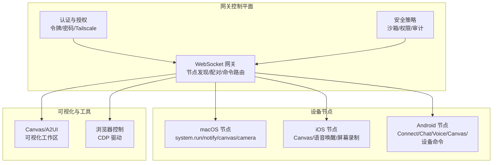
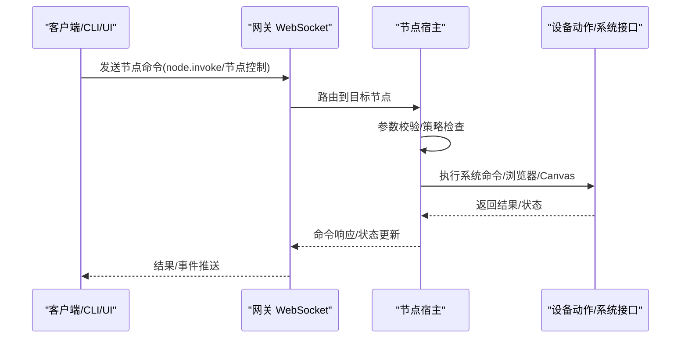
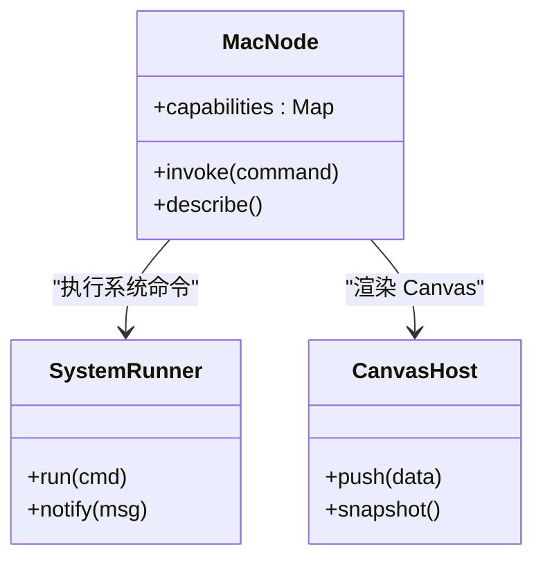
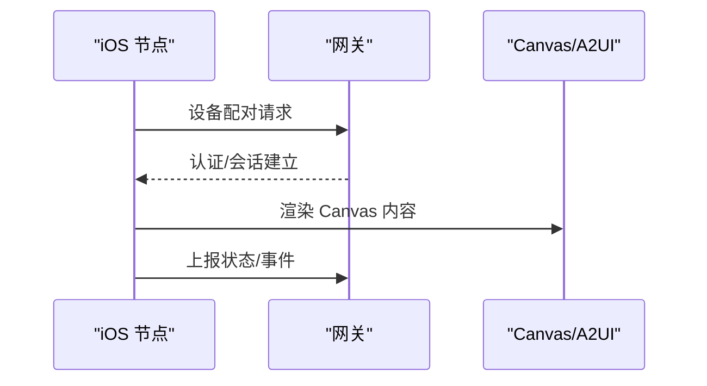
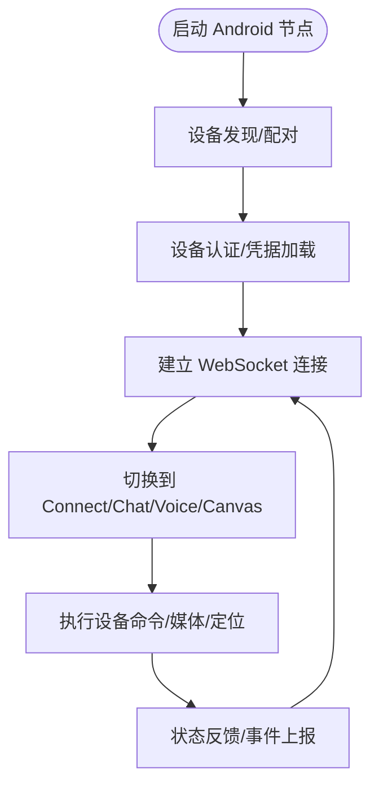
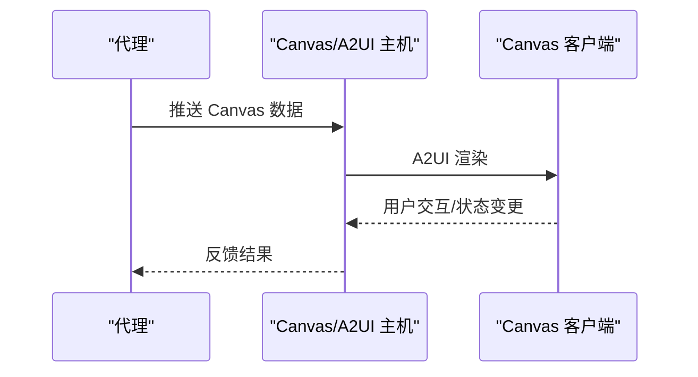
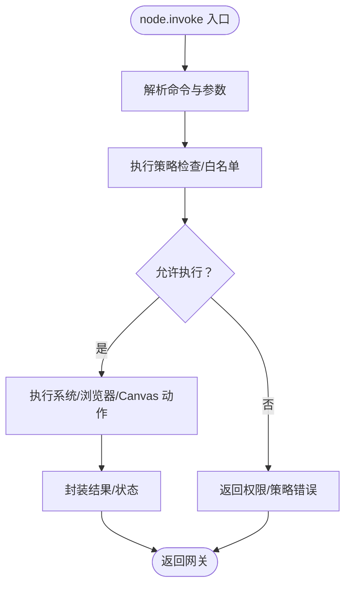
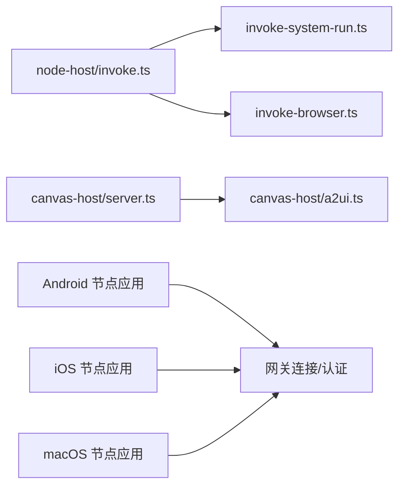

# 设备节点系统

<cite>
**本文档引用的文件**
- [README.md](file://README.md)
- [apps/macos/README.md](file://apps/macos/README.md)
- [src/node-host/config.ts](file://src/node-host/config.ts)
- [src/node-host/invoke.ts](file://src/node-host/invoke.ts)
- [src/node-host/invoke-system-run.ts](file://src/node-host/invoke-system-run.ts)
- [src/node-host/invoke-browser.ts](file://src/node-host/invoke-browser.ts)
- [src/canvas-host/server.ts](file://src/canvas-host/server.ts)
- [src/canvas-host/a2ui.ts](file://src/canvas-host/a2ui.ts)
- [apps/android/app/src/main/java/ai/openclaw/app/NodeApp.kt](file://apps/android/app/src/main/java/ai/openclaw/app/NodeApp.kt)
- [apps/android/app/src/main/java/ai/openclaw/app/NodeRuntime.kt](file://apps/android/app/src/main/java/ai/openclaw/app/NodeRuntime.kt)
- [apps/android/app/src/main/java/ai/openclaw/app/MainActivity.kt](file://apps/android/app/src/main/java/ai/openclaw/app/MainActivity.kt)
- [apps/android/app/src/main/java/ai/openclaw/app/NodeForegroundService.kt](file://apps/android/app/src/main/java/ai/openclaw/app/NodeForegroundService.kt)
- [apps/android/app/src/main/java/ai/openclaw/app/gateway/GatewayDiscovery.kt](file://apps/android/app/src/main/java/ai/openclaw/app/gateway/GatewayDiscovery.kt)
- [apps/android/app/src/main/java/ai/openclaw/app/gateway/DeviceAuthStore.kt](file://apps/android/app/src/main/java/ai/openclaw/app/gateway/DeviceAuthStore.kt)
- [apps/ios/Sources/OpenClawApp.swift](file://apps/ios/Sources/OpenClawApp.swift)
- [apps/ios/Sources/RootCanvas.swift](file://apps/ios/Sources/RootCanvas.swift)
- [apps/ios/Sources/SessionKey.swift](file://apps/ios/Sources/SessionKey.swift)
- [docs/platforms/android.md](file://docs/platforms/android.md)
- [docs/platforms/ios.md](file://docs/platforms/ios.md)
- [docs/gateway/discovery.md](file://docs/gateway/discovery.md)
- [docs/gateway/pairing.md](file://docs/gateway/pairing.md)
- [docs/nodes/index.md](file://docs/nodes/index.md)
- [docs/nodes/audio.md](file://docs/nodes/audio.md)
- [docs/nodes/camera.md](file://docs/nodes/camera.md)
- [docs/nodes/location-command.md](file://docs/nodes/location-command.md)
- [docs/nodes/media-understanding.md](file://docs/nodes/media-understanding.md)
- [docs/nodes/troubleshooting.md](file://docs/nodes/troubleshooting.md)
- [docs/platforms/mac/canvas.md](file://docs/platforms/mac/canvas.md)
- [docs/platforms/mac/canvas.md](file://docs/platforms/mac/canvas.md)
- [docs/gateway/authentication.md](file://docs/gateway/authentication.md)
- [docs/gateway/remote.md](file://docs/gateway/remote.md)
- [docs/gateway/security.md](file://docs/gateway/security.md)
- [docs/cli/devices.md](file://docs/cli/devices.md)
- [docs/cli/nodes.md](file://docs/cli/nodes.md)
</cite>

## 目录

1. [简介](#简介)
2. [项目结构](#项目结构)
3. [核心组件](#核心组件)
4. [架构总览](#架构总览)
5. [详细组件分析](#详细组件分析)
6. [依赖关系分析](#依赖关系分析)
7. [性能考虑](#性能考虑)
8. [故障排查指南](#故障排查指南)
9. [结论](#结论)
10. [附录](#附录)

## 简介

本文件系统性阐述设备节点系统（macOS、iOS、Android）在 OpenClaw 中的连接与认证机制、设备控制命令以及 Canvas 可视化能力。内容覆盖节点发现、配对流程、安全通信协议、节点配置示例、命令执行与状态反馈、开发指南、调试方法与性能优化，并讨论跨平台兼容性、权限管理与远程访问控制。

## 项目结构

OpenClaw 将“网关 WebSocket 控制平面”作为统一控制中心，设备节点通过该平面进行发现、配对与命令调用；同时提供 Canvas/A2UI 的可视化工作区与浏览器控制能力。平台侧分别在 macOS、iOS、Android 提供节点应用以执行本地动作与渲染界面。

图示来源

- [README.md:185-212](file://README.md#L185-L212)
- [docs/platforms/android.md](file://docs/platforms/android.md)
- [docs/platforms/ios.md](file://docs/platforms/ios.md)
- [docs/platforms/mac/canvas.md](file://docs/platforms/mac/canvas.md)

章节来源

- [README.md:185-212](file://README.md#L185-L212)

## 核心组件

- 节点宿主与命令执行：负责解析节点命令、执行系统级操作、浏览器控制与安全策略校验。
- Canvas/A2UI 主机：提供 Canvas 渲染、A2UI 推送与快照能力。
- 平台节点应用：Android/iOS/macOS 节点应用通过网关进行发现与配对，承载设备命令与界面展示。
- 网关与认证：提供节点发现、配对、远程访问与安全控制。

章节来源

- [src/node-host/invoke.ts](file://src/node-host/invoke.ts)
- [src/node-host/invoke-system-run.ts](file://src/node-host/invoke-system-run.ts)
- [src/node-host/invoke-browser.ts](file://src/node-host/invoke-browser.ts)
- [src/canvas-host/server.ts](file://src/canvas-host/server.ts)
- [src/canvas-host/a2ui.ts](file://src/canvas-host/a2ui.ts)

## 架构总览

下图展示了从客户端到节点再到设备动作的整体调用链路与数据流。

图示来源

- [README.md:240-254](file://README.md#L240-L254)
- [src/node-host/invoke.ts](file://src/node-host/invoke.ts)

章节来源

- [README.md:240-254](file://README.md#L240-L254)

## 详细组件分析

### macOS 节点

- 能力描述与权限映射通过网关协议暴露，支持 system.run、system.notify、canvas._、camera._、screen.record、location.get 等。
- macOS 应用可运行在节点模式，通过网关协议执行本地动作并遵循 TCC 权限状态。
- 开发与签名流程见 macOS 应用说明。

图示来源

- [README.md:240-254](file://README.md#L240-L254)
- [apps/macos/README.md:1-65](file://apps/macos/README.md#L1-L65)

章节来源

- [README.md:240-254](file://README.md#L240-L254)
- [apps/macos/README.md:1-65](file://apps/macos/README.md#L1-L65)

### iOS 节点

- 通过网关 WebSocket 以节点形式配对，支持 Canvas 表面与语音触发转发。
- 运行时通过会话密钥与网关建立受信通道。

图示来源

- [docs/platforms/ios.md](file://docs/platforms/ios.md)
- [apps/ios/Sources/OpenClawApp.swift](file://apps/ios/Sources/OpenClawApp.swift)
- [apps/ios/Sources/RootCanvas.swift](file://apps/ios/Sources/RootCanvas.swift)
- [apps/ios/Sources/SessionKey.swift](file://apps/ios/Sources/SessionKey.swift)

章节来源

- [docs/platforms/ios.md](file://docs/platforms/ios.md)
- [apps/ios/Sources/OpenClawApp.swift](file://apps/ios/Sources/OpenClawApp.swift)
- [apps/ios/Sources/RootCanvas.swift](file://apps/ios/Sources/RootCanvas.swift)
- [apps/ios/Sources/SessionKey.swift](file://apps/ios/Sources/SessionKey.swift)

### Android 节点

- 支持 Connect/Chat/Voice/Canvas/设备命令（通知、位置、相机、屏幕录制等）。
- 通过 Bonjour/设备发现与网关建立连接，使用设备认证存储与身份凭据。

图示来源

- [docs/platforms/android.md](file://docs/platforms/android.md)
- [apps/android/app/src/main/java/ai/openclaw/app/NodeApp.kt](file://apps/android/app/src/main/java/ai/openclaw/app/NodeApp.kt)
- [apps/android/app/src/main/java/ai/openclaw/app/NodeRuntime.kt](file://apps/android/app/src/main/java/ai/openclaw/app/NodeRuntime.kt)
- [apps/android/app/src/main/java/ai/openclaw/app/MainActivity.kt](file://apps/android/app/src/main/java/ai/openclaw/app/MainActivity.kt)
- [apps/android/app/src/main/java/ai/openclaw/app/NodeForegroundService.kt](file://apps/android/app/src/main/java/ai/openclaw/app/NodeForegroundService.kt)
- [apps/android/app/src/main/java/ai/openclaw/app/gateway/GatewayDiscovery.kt](file://apps/android/app/src/main/java/ai/openclaw/app/gateway/GatewayDiscovery.kt)
- [apps/android/app/src/main/java/ai/openclaw/app/gateway/DeviceAuthStore.kt](file://apps/android/app/src/main/java/ai/openclaw/app/gateway/DeviceAuthStore.kt)

章节来源

- [docs/platforms/android.md](file://docs/platforms/android.md)
- [apps/android/app/src/main/java/ai/openclaw/app/NodeApp.kt](file://apps/android/app/src/main/java/ai/openclaw/app/NodeApp.kt)
- [apps/android/app/src/main/java/ai/openclaw/app/NodeRuntime.kt](file://apps/android/app/src/main/java/ai/openclaw/app/NodeRuntime.kt)
- [apps/android/app/src/main/java/ai/openclaw/app/MainActivity.kt](file://apps/android/app/src/main/java/ai/openclaw/app/MainActivity.kt)
- [apps/android/app/src/main/java/ai/openclaw/app/NodeForegroundService.kt](file://apps/android/app/src/main/java/ai/openclaw/app/NodeForegroundService.kt)
- [apps/android/app/src/main/java/ai/openclaw/app/gateway/GatewayDiscovery.kt](file://apps/android/app/src/main/java/ai/openclaw/app/gateway/GatewayDiscovery.kt)
- [apps/android/app/src/main/java/ai/openclaw/app/gateway/DeviceAuthStore.kt](file://apps/android/app/src/main/java/ai/openclaw/app/gateway/DeviceAuthStore.kt)

### Canvas 与 A2UI

- Canvas 是代理驱动的可视化工作区，A2UI 为 Canvas 的宿主与推送机制。
- 支持推送、重置、执行与快照等能力，用于实时可视化与交互。

图示来源

- [docs/platforms/mac/canvas.md](file://docs/platforms/mac/canvas.md)
- [src/canvas-host/server.ts](file://src/canvas-host/server.ts)
- [src/canvas-host/a2ui.ts](file://src/canvas-host/a2ui.ts)

章节来源

- [docs/platforms/mac/canvas.md](file://docs/platforms/mac/canvas.md)
- [src/canvas-host/server.ts](file://src/canvas-host/server.ts)
- [src/canvas-host/a2ui.ts](file://src/canvas-host/a2ui.ts)

### 节点命令与执行策略

- 节点命令通过 node.invoke 调用，宿主侧进行参数校验与策略检查。
- system.run/notify 等命令遵循 TCC 权限与沙箱策略；浏览器控制通过独立模块处理。

图示来源

- [src/node-host/invoke.ts](file://src/node-host/invoke.ts)
- [src/node-host/invoke-system-run.ts](file://src/node-host/invoke-system-run.ts)
- [src/node-host/invoke-browser.ts](file://src/node-host/invoke-browser.ts)

章节来源

- [src/node-host/invoke.ts](file://src/node-host/invoke.ts)
- [src/node-host/invoke-system-run.ts](file://src/node-host/invoke-system-run.ts)
- [src/node-host/invoke-browser.ts](file://src/node-host/invoke-browser.ts)

## 依赖关系分析

- 节点宿主依赖于网关协议与安全策略，确保命令执行在受控范围内。
- Canvas/A2UI 依赖于主机服务与前端渲染层。
- 平台节点应用依赖于设备发现、认证存储与网关连接。

图示来源

- [src/node-host/invoke.ts](file://src/node-host/invoke.ts)
- [src/node-host/invoke-system-run.ts](file://src/node-host/invoke-system-run.ts)
- [src/node-host/invoke-browser.ts](file://src/node-host/invoke-browser.ts)
- [src/canvas-host/server.ts](file://src/canvas-host/server.ts)
- [src/canvas-host/a2ui.ts](file://src/canvas-host/a2ui.ts)
- [apps/android/app/src/main/java/ai/openclaw/app/NodeApp.kt](file://apps/android/app/src/main/java/ai/openclaw/app/NodeApp.kt)
- [apps/ios/Sources/OpenClawApp.swift](file://apps/ios/Sources/OpenClawApp.swift)

章节来源

- [src/node-host/invoke.ts](file://src/node-host/invoke.ts)
- [src/canvas-host/server.ts](file://src/canvas-host/server.ts)
- [apps/android/app/src/main/java/ai/openclaw/app/NodeApp.kt](file://apps/android/app/src/main/java/ai/openclaw/app/NodeApp.kt)
- [apps/ios/Sources/OpenClawApp.swift](file://apps/ios/Sources/OpenClawApp.swift)

## 性能考虑

- 节点命令执行应避免阻塞网关线程，必要时采用超时与异步处理。
- Canvas/A2UI 传输应压缩与分片，减少带宽占用。
- Android/iOS 节点应按需启用屏幕录制/摄像头等高开销功能，降低功耗。
- 网关层面启用合理的并发与队列策略，避免资源争用。

## 故障排查指南

- 节点无法发现/配对：检查设备发现与认证存储是否正确初始化。
- 权限缺失：确认 TCC 权限与沙箱策略配置，必要时重新授权。
- 远程访问异常：核对认证模式与暴露方式（Tailscale Serve/Funnel），确保绑定地址与鉴权设置一致。
- Canvas/A2UI 不显示：检查主机服务状态与渲染路径。

章节来源

- [docs/nodes/troubleshooting.md](file://docs/nodes/troubleshooting.md)
- [docs/gateway/discovery.md](file://docs/gateway/discovery.md)
- [docs/gateway/pairing.md](file://docs/gateway/pairing.md)
- [docs/gateway/authentication.md](file://docs/gateway/authentication.md)
- [docs/gateway/remote.md](file://docs/gateway/remote.md)

## 结论

OpenClaw 的设备节点系统以网关 WebSocket 为核心，结合平台节点应用与 Canvas/A2UI，实现了跨平台的设备控制与可视化能力。通过严格的认证、配对与安全策略，系统在保证安全性的同时提供了灵活的命令执行与远程访问能力。开发者可依据本文档的组件与流程进行集成、调试与优化。

## 附录

### 节点发现与配对流程

- 设备通过 Bonjour/本地网络发现网关。
- 使用设备认证凭据完成配对，建立受信通道。
- 配对成功后，节点能力通过网关协议暴露，供客户端调用。

章节来源

- [docs/gateway/discovery.md](file://docs/gateway/discovery.md)
- [docs/gateway/pairing.md](file://docs/gateway/pairing.md)
- [apps/android/app/src/main/java/ai/openclaw/app/gateway/GatewayDiscovery.kt](file://apps/android/app/src/main/java/ai/openclaw/app/gateway/GatewayDiscovery.kt)
- [apps/android/app/src/main/java/ai/openclaw/app/gateway/DeviceAuthStore.kt](file://apps/android/app/src/main/java/ai/openclaw/app/gateway/DeviceAuthStore.kt)

### 安全通信与远程访问

- 支持 Tailscale Serve/Funnel 暴露网关，结合密码或身份验证。
- 网关绑定地址与鉴权模式需一致，避免意外暴露。

章节来源

- [docs/gateway/authentication.md](file://docs/gateway/authentication.md)
- [docs/gateway/remote.md](file://docs/gateway/remote.md)
- [docs/gateway/security.md](file://docs/gateway/security.md)

### 节点配置示例与命令参考

- 节点命令与能力可通过网关协议查询与调用。
- CLI 提供节点与设备管理命令，便于自动化与运维。

章节来源

- [docs/cli/devices.md](file://docs/cli/devices.md)
- [docs/cli/nodes.md](file://docs/cli/nodes.md)
- [docs/nodes/index.md](file://docs/nodes/index.md)
- [docs/nodes/audio.md](file://docs/nodes/audio.md)
- [docs/nodes/camera.md](file://docs/nodes/camera.md)
- [docs/nodes/location-command.md](file://docs/nodes/location-command.md)
- [docs/nodes/media-understanding.md](file://docs/nodes/media-understanding.md)
