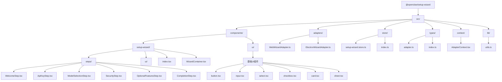
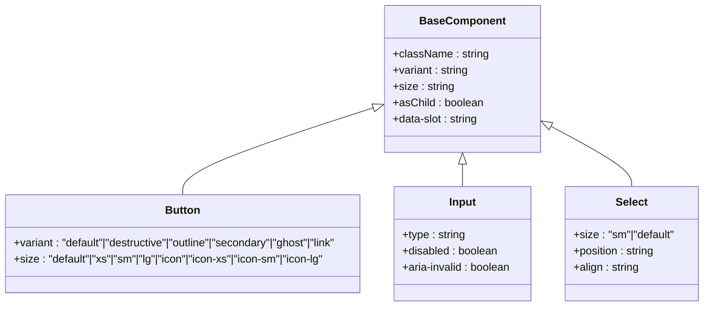
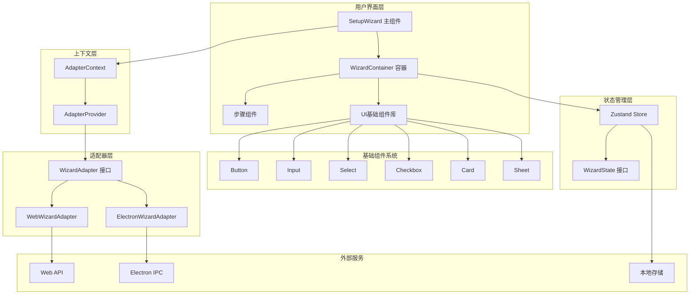
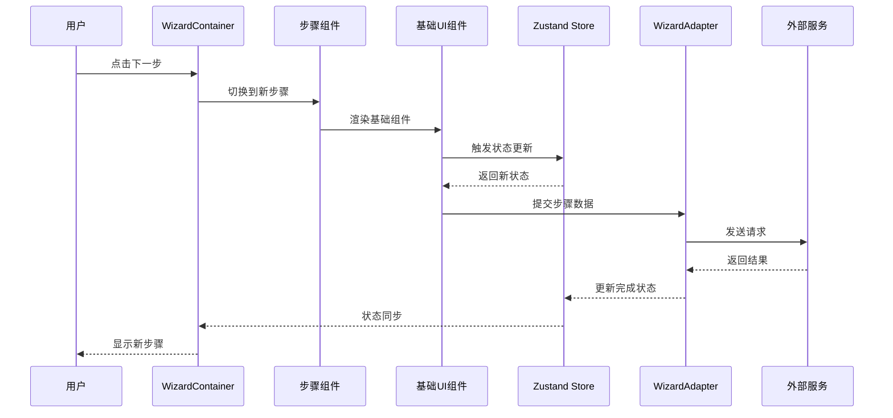
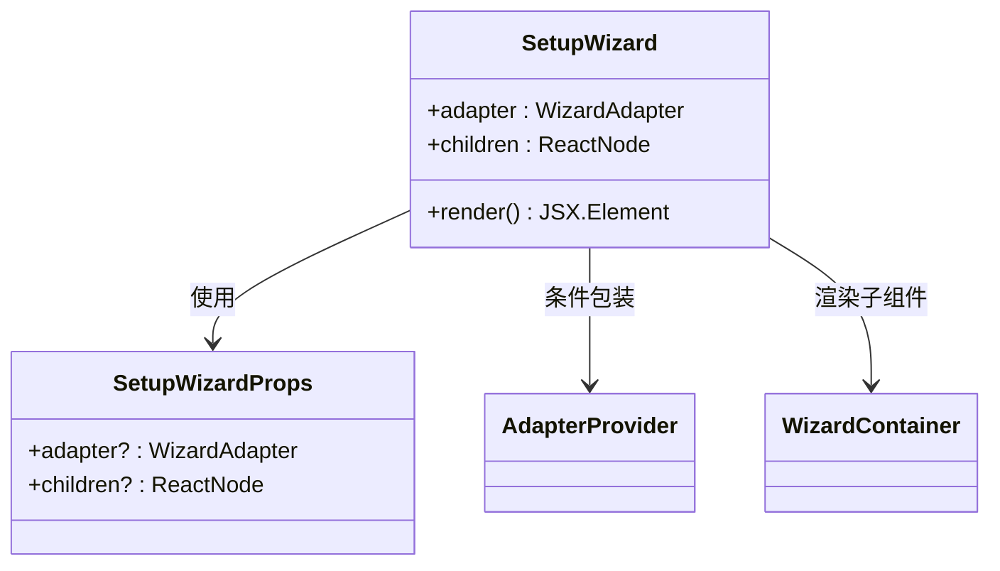
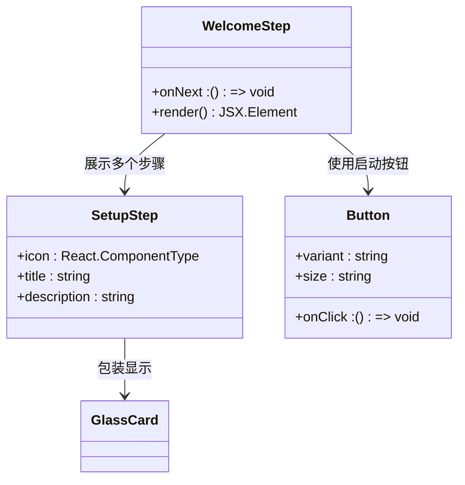
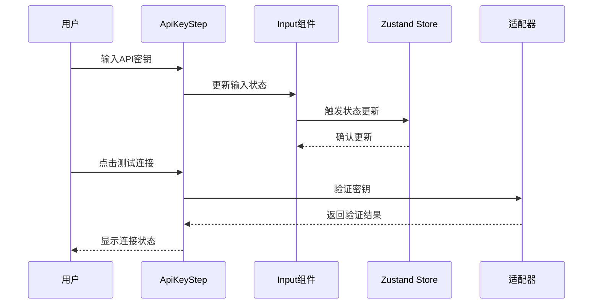
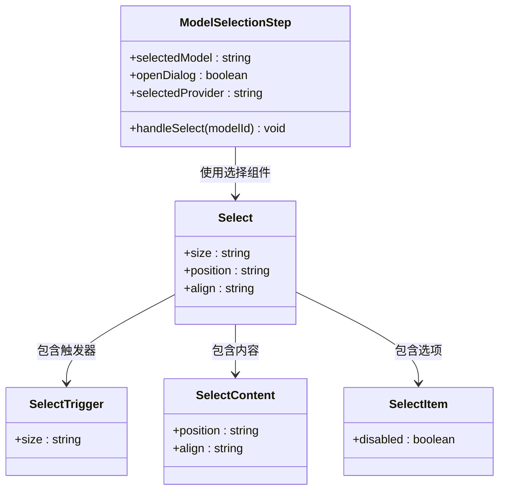
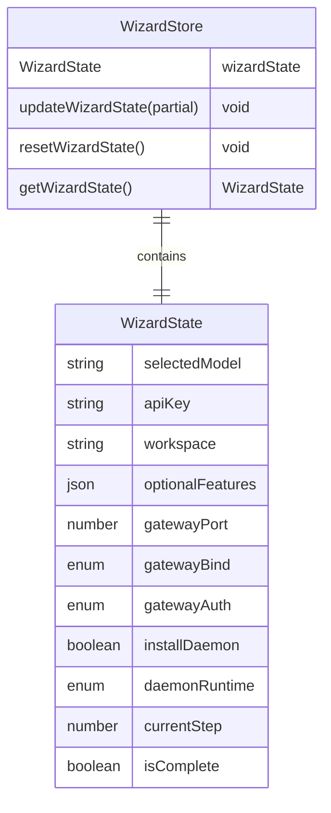
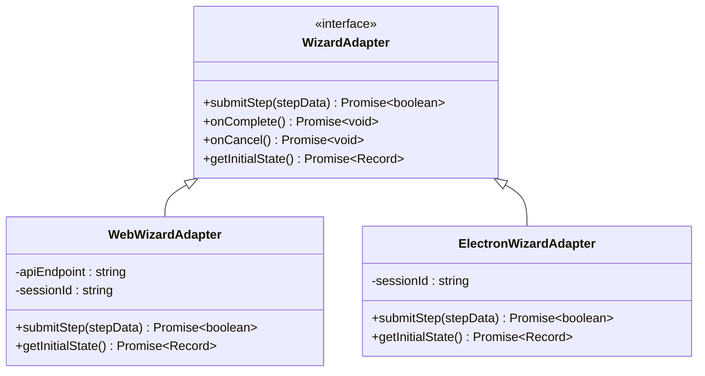

# 设置向导UI组件

<cite>
**本文档引用的文件**
- [packages/setup-wizard/src/components/setup-wizard/index.tsx](file://packages/setup-wizard/src/components/setup-wizard/index.tsx)
- [packages/setup-wizard/src/components/setup-wizard/WizardContainer.tsx](file://packages/setup-wizard/src/components/setup-wizard/WizardContainer.tsx)
- [packages/setup-wizard/src/components/setup-wizard/Header.tsx](file://packages/setup-wizard/src/components/setup-wizard/Header.tsx)
- [packages/setup-wizard/src/components/setup-wizard/ProgressBar.tsx](file://packages/setup-wizard/src/components/setup-wizard/ProgressBar.tsx)
- [packages/setup-wizard/src/components/setup-wizard/GlassCard.tsx](file://packages/setup-wizard/src/components/setup-wizard/GlassCard.tsx)
- [packages/setup-wizard/src/components/setup-wizard/steps/WelcomeStep.tsx](file://packages/setup-wizard/src/components/setup-wizard/steps/WelcomeStep.tsx)
- [packages/setup-wizard/src/components/setup-wizard/steps/ApiKeyStep.tsx](file://packages/setup-wizard/src/components/setup-wizard/steps/ApiKeyStep.tsx)
- [packages/setup-wizard/src/components/setup-wizard/steps/ModelSelectionStep.tsx](file://packages/setup-wizard/src/components/setup-wizard/steps/ModelSelectionStep.tsx)
- [packages/setup-wizard/src/store/setup-wizard.store.ts](file://packages/setup-wizard/src/store/setup-wizard.store.ts)
- [packages/setup-wizard/src/types/adapter.ts](file://packages/setup-wizard/src/types/adapter.ts)
- [packages/setup-wizard/src/adapters/WebWizardAdapter.ts](file://packages/setup-wizard/src/adapters/WebWizardAdapter.ts)
- [packages/setup-wizard/src/adapters/ElectronWizardAdapter.ts](file://packages/setup-wizard/src/adapters/ElectronWizardAdapter.ts)
- [packages/setup-wizard/src/context/AdapterContext.tsx](file://packages/setup-wizard/src/context/AdapterContext.tsx)
- [packages/setup-wizard/src/lib/utils.ts](file://packages/setup-wizard/src/lib/utils.ts)
- [packages/setup-wizard/package.json](file://packages/setup-wizard/package.json)
- [packages/setup-wizard/src/components/ui/button.tsx](file://packages/setup-wizard/src/components/ui/button.tsx)
- [packages/setup-wizard/src/components/ui/input.tsx](file://packages/setup-wizard/src/components/ui/input.tsx)
- [packages/setup-wizard/src/components/ui/select.tsx](file://packages/setup-wizard/src/components/ui/select.tsx)
- [packages/setup-wizard/src/components/ui/checkbox.tsx](file://packages/setup-wizard/src/components/ui/checkbox.tsx)
- [packages/setup-wizard/src/components/ui/card.tsx](file://packages/setup-wizard/src/components/ui/card.tsx)
- [packages/setup-wizard/src/components/ui/sheet.tsx](file://packages/setup-wizard/src/components/ui/sheet.tsx)
</cite>

## 更新摘要
**所做更改**
- 新增UI基础组件系统章节，详细介绍重构后的20+个基础组件
- 更新核心组件部分，反映Button、Input、Select等组件的使用情况
- 新增UI组件架构图，展示基础组件与业务组件的关系
- 更新依赖关系分析，包含新的UI组件依赖
- 新增组件使用示例，展示如何在步骤组件中使用基础UI组件

## 目录
1. [简介](#简介)
2. [项目结构](#项目结构)
3. [UI基础组件系统](#ui基础组件系统)
4. [核心组件](#核心组件)
5. [架构概览](#架构概览)
6. [详细组件分析](#详细组件分析)
7. [依赖关系分析](#依赖关系分析)
8. [性能考虑](#性能考虑)
9. [故障排除指南](#故障排除指南)
10. [结论](#结论)

## 简介

设置向导UI组件是OpenClaw项目中的一个独立React组件包，专门用于提供用户友好的安装和配置体验。该组件包采用模块化设计，支持多种平台适配器，包括Web和Electron环境，并提供了完整的状态管理和持久化功能。

**重大更新**：UI组件库已重构为基础组件系统，包含Button、Input、Select、Checkbox等20+个基础组件，采用现代化的设计系统和原子化组件架构，显著提升了组件的可复用性和一致性。

该组件包的核心目标是为用户提供一个直观、响应式的设置向导界面，涵盖从欢迎页面到最终完成的所有配置步骤。通过使用现代前端技术栈和设计系统，确保了良好的用户体验和跨平台兼容性。

## 项目结构

设置向导UI组件包采用清晰的目录结构，按照功能模块进行组织：

**图表来源**
- [packages/setup-wizard/src/components/setup-wizard/index.tsx:1-31](file://packages/setup-wizard/src/components/setup-wizard/index.tsx#L1-L31)
- [packages/setup-wizard/src/components/ui/button.tsx:1-65](file://packages/setup-wizard/src/components/ui/button.tsx#L1-L65)

**章节来源**
- [packages/setup-wizard/package.json:1-58](file://packages/setup-wizard/package.json#L1-L58)

## UI基础组件系统

**重大更新**：UI组件库已重构为基础组件系统，提供20+个原子化UI组件，采用一致的设计语言和变体系统。

### 组件分类

#### 表单组件
- **Button**：支持多种变体(variant)和尺寸(size)的按钮组件
- **Input**：基础输入框组件，支持状态反馈和无障碍特性
- **Select**：下拉选择组件，包含触发器、内容、选项等子组件
- **Checkbox**：复选框组件，支持受控和非受控状态
- **Label**：标签组件，与表单控件关联

#### 布局组件
- **Card**：卡片组件，包含标题、描述、内容等子组件
- **Sheet**：抽屉组件，支持多方向滑入动画
- **Badge**：徽章标签组件
- **Separator**：分隔线组件

#### 反馈组件
- **Alert**：警告提示组件
- **AlertDialog**：确认对话框组件
- **Tooltip**：工具提示组件
- **Avatar**：头像组件

#### 导航组件
- **Tabs**：标签页组件
- **DropdownMenu**：下拉菜单组件
- **Sidebar**：侧边栏组件

### 设计系统特性

所有基础组件都遵循以下设计原则：

**图表来源**
- [packages/setup-wizard/src/components/ui/button.tsx:7-39](file://packages/setup-wizard/src/components/ui/button.tsx#L7-L39)
- [packages/setup-wizard/src/components/ui/input.tsx:4-18](file://packages/setup-wizard/src/components/ui/input.tsx#L4-L18)
- [packages/setup-wizard/src/components/ui/select.tsx:25-49](file://packages/setup-wizard/src/components/ui/select.tsx#L25-L49)

### 组件变体系统

基础组件采用class-variance-authority库实现统一的变体系统：

- **变体(variant)**：控制组件的主要视觉风格
- **尺寸(size)**：控制组件的大小规格
- **状态(state)**：控制组件的交互状态
- **数据槽(data-slot)**：用于样式覆盖和主题定制

**章节来源**
- [packages/setup-wizard/src/components/ui/button.tsx:1-65](file://packages/setup-wizard/src/components/ui/button.tsx#L1-L65)
- [packages/setup-wizard/src/components/ui/input.tsx:1-21](file://packages/setup-wizard/src/components/ui/input.tsx#L1-L21)
- [packages/setup-wizard/src/components/ui/select.tsx:1-189](file://packages/setup-wizard/src/components/ui/select.tsx#L1-L189)

## 核心组件

设置向导UI组件包包含以下核心组件：

### 主组件 SetupWizard
主组件作为整个向导的入口点，负责包装和提供上下文。它支持两种使用模式：带适配器模式和无适配器模式。

### 容器组件 WizardContainer
容器组件管理整个向导的状态和流程控制，包括步骤导航、数据提交和错误处理。

### 步骤组件
包含多个专门的步骤组件，每个组件负责特定的配置任务：
- **WelcomeStep**：欢迎页面和设置概览，使用Button和GlassCard组件
- **ApiKeyStep**：API密钥输入和验证，使用Input组件
- **ModelSelectionStep**：AI模型选择，使用Select组件
- **SecurityStep**：安全设置
- **OptionalFeaturesStep**：可选功能配置
- **CompletionStep**：完成页面

### UI基础组件
提供通用的UI组件，如玻璃卡片、进度条等，用于构建一致的用户体验。

**更新**：所有步骤组件现在都使用新的基础UI组件系统，提升了组件的一致性和可维护性。

**章节来源**
- [packages/setup-wizard/src/components/setup-wizard/index.tsx:1-31](file://packages/setup-wizard/src/components/setup-wizard/index.tsx#L1-L31)
- [packages/setup-wizard/src/components/setup-wizard/WizardContainer.tsx:1-114](file://packages/setup-wizard/src/components/setup-wizard/WizardContainer.tsx#L1-L114)
- [packages/setup-wizard/src/components/setup-wizard/steps/WelcomeStep.tsx:1-87](file://packages/setup-wizard/src/components/setup-wizard/steps/WelcomeStep.tsx#L1-L87)
- [packages/setup-wizard/src/components/setup-wizard/steps/ApiKeyStep.tsx:1-191](file://packages/setup-wizard/src/components/setup-wizard/steps/ApiKeyStep.tsx#L1-L191)

## 架构概览

设置向导UI组件采用了现代化的前端架构设计，结合了状态管理、依赖注入、平台适配器模式和基础组件系统：

**图表来源**
- [packages/setup-wizard/src/components/setup-wizard/index.tsx:11-28](file://packages/setup-wizard/src/components/setup-wizard/index.tsx#L11-L28)
- [packages/setup-wizard/src/components/ui/button.tsx:41-62](file://packages/setup-wizard/src/components/ui/button.tsx#L41-L62)
- [packages/setup-wizard/src/components/ui/input.tsx:4-18](file://packages/setup-wizard/src/components/ui/input.tsx#L4-L18)
- [packages/setup-wizard/src/components/ui/select.tsx:7-11](file://packages/setup-wizard/src/components/ui/select.tsx#L7-L11)

### 数据流图

**图表来源**
- [packages/setup-wizard/src/components/setup-wizard/WizardContainer.tsx:30-38](file://packages/setup-wizard/src/components/setup-wizard/WizardContainer.tsx#L30-L38)
- [packages/setup-wizard/src/store/setup-wizard.store.ts:56-85](file://packages/setup-wizard/src/store/setup-wizard.store.ts#L56-L85)

## 详细组件分析

### SetupWizard 主组件

SetupWizard是整个设置向导的根组件，提供了灵活的集成方式：

**图表来源**
- [packages/setup-wizard/src/components/setup-wizard/index.tsx:6-30](file://packages/setup-wizard/src/components/setup-wizard/index.tsx#L6-L30)

### WizardContainer 容器组件

WizardContainer是向导的核心控制器，负责管理整个流程：

**图表来源**
- [packages/setup-wizard/src/components/setup-wizard/WizardContainer.tsx:24-73](file://packages/setup-wizard/src/components/setup-wizard/WizardContainer.tsx#L24-L73)

### 步骤组件分析

#### WelcomeStep 欢迎步骤

WelcomeStep提供了一个简洁的欢迎界面，展示设置向导的主要步骤，使用Button和GlassCard组件：

**图表来源**
- [packages/setup-wizard/src/components/setup-wizard/steps/WelcomeStep.tsx:27-86](file://packages/setup-wizard/src/components/setup-wizard/steps/WelcomeStep.tsx#L27-L86)

#### ApiKeyStep API密钥步骤

ApiKeyStep处理API密钥的输入和验证过程，使用Input基础组件：

**图表来源**
- [packages/setup-wizard/src/components/setup-wizard/steps/ApiKeyStep.tsx:29-56](file://packages/setup-wizard/src/components/setup-wizard/steps/ApiKeyStep.tsx#L29-L56)

#### ModelSelectionStep 模型选择步骤

ModelSelectionStep提供了一个丰富的AI模型选择界面，使用Select基础组件：

**图表来源**
- [packages/setup-wizard/src/components/setup-wizard/steps/ModelSelectionStep.tsx:17-118](file://packages/setup-wizard/src/components/setup-wizard/steps/ModelSelectionStep.tsx#L17-L118)

### 状态管理系统

设置向导使用Zustand作为状态管理解决方案，提供了类型安全的状态存储：

**图表来源**
- [packages/setup-wizard/src/store/setup-wizard.store.ts:4-36](file://packages/setup-wizard/src/store/setup-wizard.store.ts#L4-L36)

### 适配器模式实现

设置向导支持多种平台适配器，通过统一的接口实现不同的后端通信方式：

**图表来源**
- [packages/setup-wizard/src/types/adapter.ts:6-28](file://packages/setup-wizard/src/types/adapter.ts#L6-L28)
- [packages/setup-wizard/src/adapters/WebWizardAdapter.ts:7-52](file://packages/setup-wizard/src/adapters/WebWizardAdapter.ts#L7-L52)
- [packages/setup-wizard/src/adapters/ElectronWizardAdapter.ts:17-57](file://packages/setup-wizard/src/adapters/ElectronWizardAdapter.ts#L17-L57)

**章节来源**
- [packages/setup-wizard/src/components/setup-wizard/steps/WelcomeStep.tsx:1-87](file://packages/setup-wizard/src/components/setup-wizard/steps/WelcomeStep.tsx#L1-L87)
- [packages/setup-wizard/src/components/setup-wizard/steps/ApiKeyStep.tsx:1-191](file://packages/setup-wizard/src/components/setup-wizard/steps/ApiKeyStep.tsx#L1-L191)
- [packages/setup-wizard/src/components/setup-wizard/steps/ModelSelectionStep.tsx:1-321](file://packages/setup-wizard/src/components/setup-wizard/steps/ModelSelectionStep.tsx#L1-L321)
- [packages/setup-wizard/src/store/setup-wizard.store.ts:1-86](file://packages/setup-wizard/src/store/setup-wizard.store.ts#L1-L86)

## 依赖关系分析

设置向导UI组件包具有明确的依赖关系和模块边界：

**图表来源**
- [packages/setup-wizard/package.json:21-52](file://packages/setup-wizard/package.json#L21-L52)

### 外部依赖分析

组件包依赖于以下关键外部库：

- **React 19.0.0**: 主要的UI框架
- **Lucide React**: 图标库，提供现代化的SVG图标
- **Zustand 5.0.3**: 轻量级状态管理库
- **Tailwind Merge**: 类名合并工具
- **Class Variance Authority**: 组件变体系统
- **Radix UI**: 无障碍的UI组件库

**新增**：基础UI组件系统引入了class-variance-authority和radix-ui等关键依赖，为组件变体系统和无障碍功能提供了强大支持。

这些依赖的选择体现了组件包对性能、可访问性和开发体验的关注。

**章节来源**
- [packages/setup-wizard/package.json:1-58](file://packages/setup-wizard/package.json#L1-L58)

## 性能考虑

设置向导UI组件包在设计时充分考虑了性能优化：

### 状态管理优化
- 使用Zustand替代Redux，减少不必要的重渲染
- 实现状态持久化，避免重复配置
- 组件级别的状态隔离，提高更新效率

### 渲染优化
- 使用React.memo和useMemo优化昂贵计算
- 条件渲染减少DOM节点数量
- 懒加载非关键资源

### 基础组件优化
- **组件复用**：基础UI组件可在多个步骤中复用，减少重复代码
- **变体系统**：统一的变体和尺寸系统减少了CSS样式的重复
- **数据槽系统**：通过data-slot属性支持精确的样式覆盖
- **无障碍优化**：所有基础组件都内置了ARIA属性和键盘导航支持

### 适配器优化
- 异步加载适配器，避免阻塞主流程
- 错误边界处理，防止单点故障影响整体
- 连接池管理，复用网络连接

## 故障排除指南

### 常见问题及解决方案

#### 适配器初始化失败
**症状**: 向导无法加载或显示初始化错误
**原因**: 适配器未正确配置或网络连接问题
**解决方案**: 
1. 检查适配器配置参数
2. 验证网络连接状态
3. 查看浏览器控制台错误信息

#### 状态同步问题
**症状**: 步骤间状态丢失或不一致
**原因**: 状态持久化失败或并发更新冲突
**解决方案**:
1. 检查localStorage权限
2. 验证状态序列化/反序列化
3. 实现适当的锁机制

#### 基础组件样式问题
**症状**: UI组件样式异常或变体不生效
**原因**: CSS类名冲突或组件使用不当
**解决方案**:
1. 检查data-slot属性是否正确设置
2. 验证变体和尺寸参数的有效性
3. 确保基础组件的导入路径正确

#### 性能问题
**症状**: 向导响应缓慢或卡顿
**原因**: 组件重渲染过多或内存泄漏
**解决方案**:
1. 使用React DevTools分析渲染性能
2. 实施虚拟滚动处理大量数据
3. 优化事件处理器绑定

**章节来源**
- [packages/setup-wizard/src/components/setup-wizard/WizardContainer.tsx:41-62](file://packages/setup-wizard/src/components/setup-wizard/WizardContainer.tsx#L41-L62)

## 结论

设置向导UI组件包是一个设计精良、功能完整的React组件库，专门为OpenClaw项目提供了一套完整的安装和配置解决方案。该组件包具有以下突出特点：

### 技术优势
- **模块化设计**: 清晰的组件分离和职责划分
- **类型安全**: 完整的TypeScript支持和类型定义
- **状态管理**: 高效的Zustand集成和持久化
- **平台适配**: 灵活的适配器模式支持多平台部署
- **基础组件系统**: 重构后的20+个原子化UI组件，提供一致的设计语言

### 用户体验
- **响应式设计**: 适配各种屏幕尺寸和设备
- **渐进式引导**: 直观的步骤导航和进度指示
- **一致性**: 统一的设计语言和交互模式
- **可访问性**: 符合WCAG标准的无障碍设计

### 扩展性
- **插件架构**: 支持自定义步骤和适配器
- **国际化**: 内置多语言支持框架
- **主题系统**: 灵活的主题和样式定制
- **测试友好**: 完善的单元测试和集成测试

**重大更新**：UI组件库重构为基础组件系统后，显著提升了组件的可复用性、一致性和可维护性。新的变体系统和数据槽机制为开发者提供了更强大的样式定制能力，同时保持了设计系统的一致性。

该组件包为OpenClaw项目提供了一个坚实的技术基础，能够有效提升用户的初始体验和产品采用率。其模块化的设计使得未来的功能扩展和维护变得更加容易和可控。