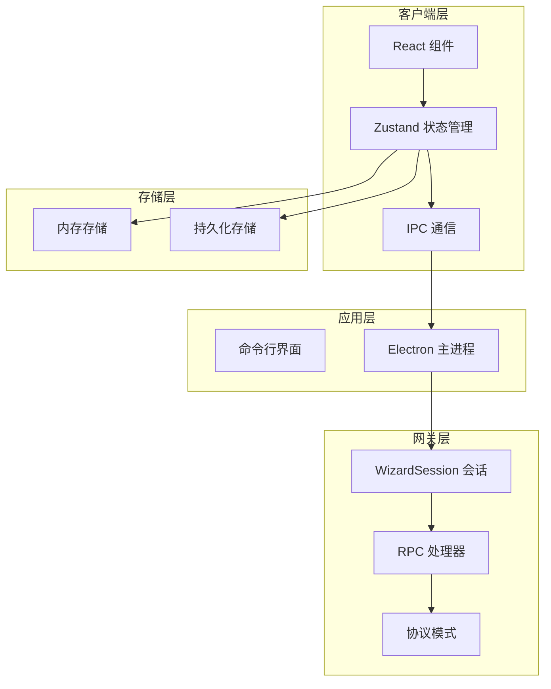
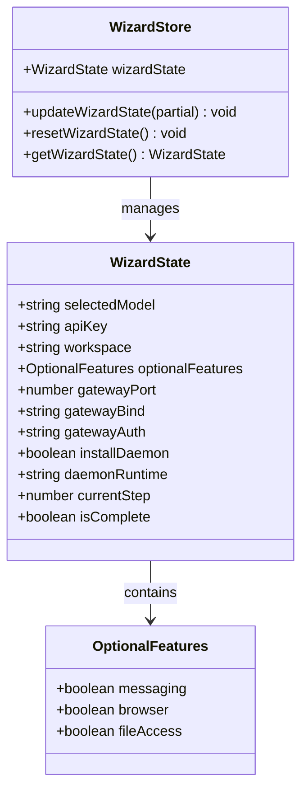
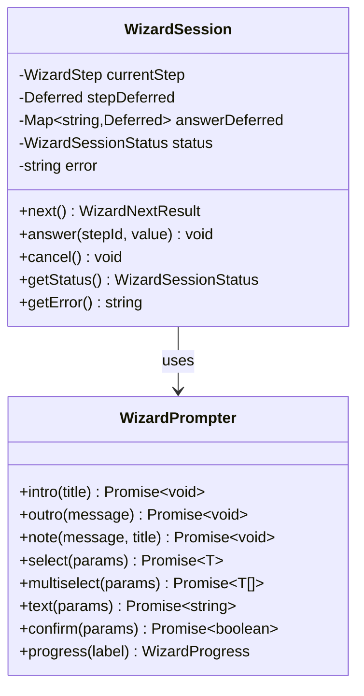
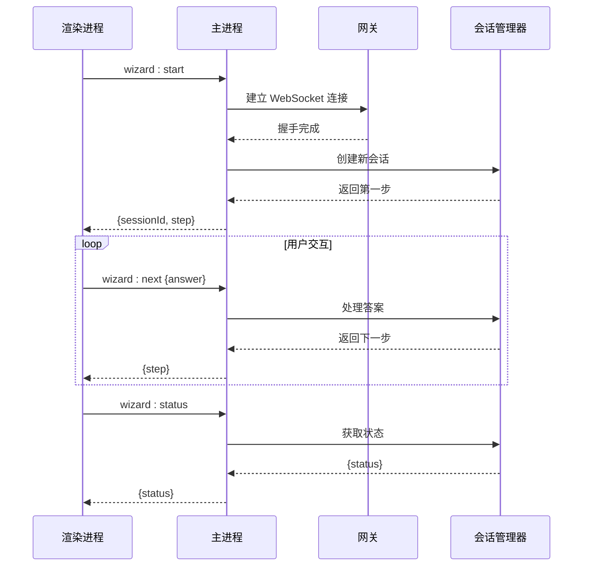
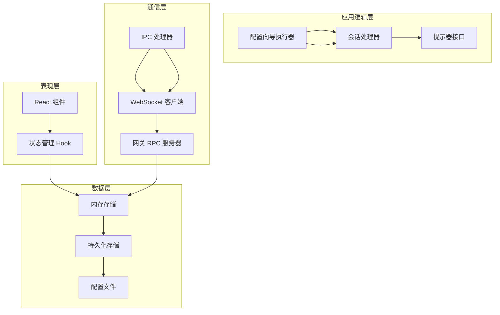
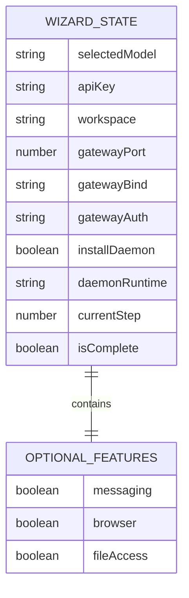
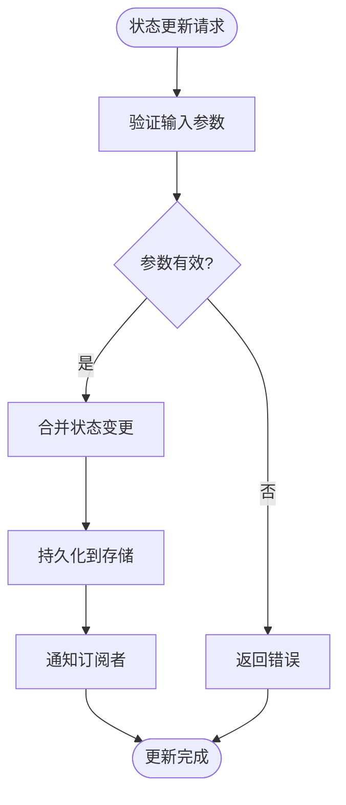
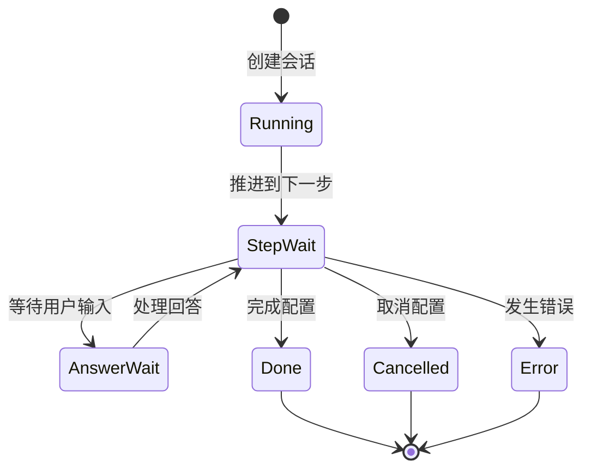
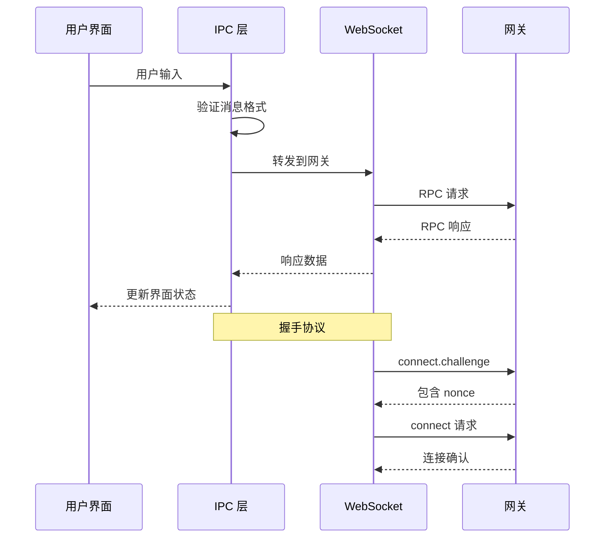
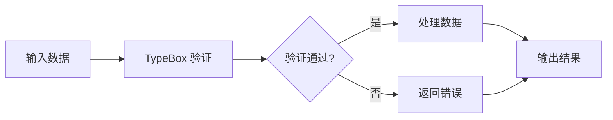

# 设置向导状态管理

<cite>
**本文档引用的文件**
- [packages/setup-wizard/src/store/setup-wizard.store.ts](file://packages/setup-wizard/src/store/setup-wizard.store.ts)
- [src/commands/configure.wizard.ts](file://src/commands/configure.wizard.ts)
- [src/gateway/server-wizard-sessions.ts](file://src/gateway/server-wizard-sessions.ts)
- [apps/electron/src/main/ipc-wizard.ts](file://apps/electron/src/main/ipc-wizard.ts)
- [src/wizard/session.ts](file://src/wizard/session.ts)
- [src/wizard/prompts.ts](file://src/wizard/prompts.ts)
- [src/gateway/protocol/schema/wizard.ts](file://src/gateway/protocol/schema/wizard.ts)
- [src/gateway/server-methods/wizard.ts](file://src/gateway/server-methods/wizard.ts)
- [src/commands/configure.shared.ts](file://src/commands/configure.shared.ts)
- [packages/setup-wizard/package.json](file://packages/setup-wizard/package.json)
- [docs/start/wizard.md](file://docs/start/wizard.md)
</cite>

## 目录
1. [简介](#简介)
2. [项目结构](#项目结构)
3. [核心组件](#核心组件)
4. [架构概览](#架构概览)
5. [详细组件分析](#详细组件分析)
6. [依赖关系分析](#依赖关系分析)
7. [性能考虑](#性能考虑)
8. [故障排除指南](#故障排除指南)
9. [结论](#结论)

## 简介

设置向导状态管理系统是 OpenClaw 项目中的一个关键组件，负责管理用户配置过程中的状态流转和数据持久化。该系统采用分层架构设计，结合了客户端状态管理、服务端会话管理和跨进程通信机制，为用户提供流畅的配置体验。

系统的核心目标包括：
- 提供直观的多步骤配置界面
- 维护配置状态的持久化存储
- 支持中断和恢复功能
- 确保配置过程的可靠性和安全性

## 项目结构

设置向导状态管理系统分布在多个模块中，形成了清晰的分层架构：



**图表来源**
- [packages/setup-wizard/src/store/setup-wizard.store.ts:1-86](file://packages/setup-wizard/src/store/setup-wizard.store.ts#L1-L86)
- [apps/electron/src/main/ipc-wizard.ts:1-243](file://apps/electron/src/main/ipc-wizard.ts#L1-L243)
- [src/gateway/server-methods/wizard.ts:1-119](file://src/gateway/server-methods/wizard.ts#L1-L119)

**章节来源**
- [packages/setup-wizard/src/store/setup-wizard.store.ts:1-86](file://packages/setup-wizard/src/store/setup-wizard.store.ts#L1-L86)
- [src/commands/configure.wizard.ts:1-706](file://src/commands/configure.wizard.ts#L1-L706)
- [apps/electron/src/main/ipc-wizard.ts:1-243](file://apps/electron/src/main/ipc-wizard.ts#L1-L243)

## 核心组件

### 状态存储层

状态存储层使用 Zustand 库实现，提供了类型安全的状态管理和持久化功能：



**图表来源**
- [packages/setup-wizard/src/store/setup-wizard.store.ts:4-29](file://packages/setup-wizard/src/store/setup-wizard.store.ts#L4-L29)

### 会话管理器

会话管理器负责跟踪和管理正在进行的配置会话：



**图表来源**
- [src/wizard/session.ts:163-265](file://src/wizard/session.ts#L163-L265)
- [src/wizard/prompts.ts:37-46](file://src/wizard/prompts.ts#L37-L46)

### IPC 通信层

IPC 通信层处理渲染进程与主进程之间的消息传递：



**图表来源**
- [apps/electron/src/main/ipc-wizard.ts:187-229](file://apps/electron/src/main/ipc-wizard.ts#L187-L229)
- [src/gateway/server-methods/wizard.ts:36-119](file://src/gateway/server-methods/wizard.ts#L36-L119)

**章节来源**
- [packages/setup-wizard/src/store/setup-wizard.store.ts:31-86](file://packages/setup-wizard/src/store/setup-wizard.store.ts#L31-L86)
- [src/wizard/session.ts:163-265](file://src/wizard/session.ts#L163-L265)
- [apps/electron/src/main/ipc-wizard.ts:1-243](file://apps/electron/src/main/ipc-wizard.ts#L1-L243)

## 架构概览

设置向导状态管理系统采用了分层架构设计，确保了各层之间的职责分离和松耦合：



**图表来源**
- [packages/setup-wizard/src/store/setup-wizard.store.ts:56-86](file://packages/setup-wizard/src/store/setup-wizard.store.ts#L56-L86)
- [src/commands/configure.wizard.ts:306-706](file://src/commands/configure.wizard.ts#L306-L706)
- [apps/electron/src/main/ipc-wizard.ts:187-229](file://apps/electron/src/main/ipc-wizard.ts#L187-L229)

系统的关键特性包括：

1. **类型安全**: 使用 TypeScript 和 Sincklein TypeBox 确保数据结构的完整性
2. **状态持久化**: 自动保存配置状态到本地存储
3. **会话管理**: 支持中断恢复和并发会话控制
4. **跨平台支持**: 同时支持 CLI 和 GUI 界面
5. **错误处理**: 完善的异常捕获和恢复机制

## 详细组件分析

### 状态管理组件

状态管理组件是整个系统的核心，负责维护配置过程中的所有状态信息：

#### 数据结构设计



**图表来源**
- [packages/setup-wizard/src/store/setup-wizard.store.ts:4-15](file://packages/setup-wizard/src/store/setup-wizard.store.ts#L4-L15)

#### 状态更新流程



**图表来源**
- [packages/setup-wizard/src/store/setup-wizard.store.ts:61-72](file://packages/setup-wizard/src/store/setup-wizard.store.ts#L61-L72)

#### 默认状态配置

系统提供了合理的默认配置，确保新用户能够快速开始使用：

| 配置项 | 默认值 | 说明 |
|--------|--------|------|
| selectedModel | "claude" | AI 模型选择 |
| apiKey | "" | API 密钥（空字符串表示未设置） |
| workspace | "~/.openclaw/workspace" | 工作空间路径 |
| gatewayPort | 18789 | 网关端口号 |
| gatewayBind | "loopback" | 绑定地址模式 |
| gatewayAuth | "token" | 认证方式 |
| installDaemon | true | 是否安装守护进程 |
| daemonRuntime | "node" | 守护进程运行时 |

**章节来源**
- [packages/setup-wizard/src/store/setup-wizard.store.ts:38-54](file://packages/setup-wizard/src/store/setup-wizard.store.ts#L38-L54)

### 会话管理组件

会话管理组件实现了完整的配置流程控制，包括步骤推进、状态跟踪和错误处理：

#### 会话生命周期



**图表来源**
- [src/wizard/session.ts:22-29](file://src/wizard/session.ts#L22-L29)

#### 步骤定义系统

每个配置步骤都有明确的数据结构定义：

| 步骤类型 | 用途 | 关键属性 |
|----------|------|----------|
| note | 显示信息 | title, message |
| select | 单选选项 | options, initialValue |
| text | 文本输入 | initialValue, placeholder, validate |
| confirm | 确认对话 | initialValue |
| multiselect | 多选选项 | options, initialValues |
| progress | 进度显示 | label |
| action | 动作触发 | executor |

**章节来源**
- [src/wizard/session.ts:10-20](file://src/wizard/session.ts#L10-L20)
- [src/wizard/prompts.ts:1-54](file://src/wizard/prompts.ts#L1-L54)

### IPC 通信组件

IPC 通信组件负责处理渲染进程与主进程之间的消息传递，确保配置过程的实时性：

#### 消息处理流程



**图表来源**
- [apps/electron/src/main/ipc-wizard.ts:20-120](file://apps/electron/src/main/ipc-wizard.ts#L20-L120)

#### 错误处理机制

系统实现了多层次的错误处理机制：

1. **连接错误**: WebSocket 连接失败时的重连机制
2. **协议错误**: RPC 调用失败时的错误传播
3. **超时处理**: 30秒 RPC 超时保护
4. **握手超时**: 10秒握手超时保护

**章节来源**
- [apps/electron/src/main/ipc-wizard.ts:126-175](file://apps/electron/src/main/ipc-wizard.ts#L126-L175)

### 协议定义组件

协议定义组件使用 TypeBox 库定义了完整的 RPC 协议规范：

#### RPC 方法定义

| 方法名 | 参数 | 返回值 | 用途 |
|--------|------|--------|------|
| wizard.start | mode, workspace | sessionId, step | 开始配置会话 |
| wizard.next | sessionId, answer | step/status | 获取下一步或状态 |
| wizard.cancel | sessionId | status | 取消配置会话 |
| wizard.status | sessionId | status | 查询会话状态 |

#### 数据验证

系统使用严格的类型验证确保数据完整性：



**图表来源**
- [src/gateway/protocol/schema/wizard.ts:11-44](file://src/gateway/protocol/schema/wizard.ts#L11-L44)

**章节来源**
- [src/gateway/protocol/schema/wizard.ts:1-104](file://src/gateway/protocol/schema/wizard.ts#L1-L104)

## 依赖关系分析

设置向导状态管理系统具有清晰的依赖关系，遵循了依赖倒置原则：

```mermaid
graph TB
subgraph "外部依赖"
A[zustand]
B[@sinclair/typebox]
C[ws]
D[react]
end
subgraph "内部模块"
E[setup-wizard/store]
F[gateway/server-methods]
G[wizard/session]
H[commands/configure]
end
subgraph "应用集成"
I[electron/main]
J[cli/commands]
end
A --> E
B --> F
C --> I
D --> E
E --> H
F --> G
G --> H
I --> F
J --> H
```

**图表来源**
- [packages/setup-wizard/package.json:25-49](file://packages/setup-wizard/package.json#L25-L49)
- [apps/electron/src/main/ipc-wizard.ts:1-11](file://apps/electron/src/main/ipc-wizard.ts#L1-L11)

### 核心依赖分析

| 依赖包 | 版本 | 用途 | 重要性 |
|--------|------|------|--------|
| zustand | ^5.0.3 | 状态管理 | 核心 |
| @sinclair/typebox | - | 类型验证 | 核心 |
| ws | - | WebSocket 客户端 | 核心 |
| react | ^19.0.0 | UI 组件 | 核心 |
| @clack/prompts | - | CLI 交互 | 辅助 |

**章节来源**
- [packages/setup-wizard/package.json:25-60](file://packages/setup-wizard/package.json#L25-L60)

## 性能考虑

设置向导状态管理系统在设计时充分考虑了性能优化：

### 内存管理

1. **惰性加载**: 状态只在需要时加载到内存
2. **自动清理**: 会话完成后自动清理内存资源
3. **增量更新**: 只更新发生变化的状态部分

### 网络优化

1. **连接池**: 复用 WebSocket 连接减少建立开销
2. **批量处理**: 批量处理 RPC 请求提高效率
3. **超时控制**: 合理的超时设置避免资源浪费

### 存储优化

1. **增量持久化**: 只持久化变化的状态
2. **压缩存储**: 对存储的数据进行压缩
3. **异步写入**: 避免阻塞主线程

## 故障排除指南

### 常见问题及解决方案

#### 状态不同步问题

**症状**: UI 状态与实际配置不一致

**诊断步骤**:
1. 检查状态存储是否正常工作
2. 验证 IPC 通信链路
3. 确认会话状态同步

**解决方法**:
- 重启应用以重置状态
- 清除本地存储缓存
- 检查网络连接稳定性

#### 会话超时问题

**症状**: 配置过程中断

**诊断步骤**:
1. 检查 RPC 调用超时设置
2. 验证网关响应时间
3. 分析网络延迟情况

**解决方法**:
- 增加超时阈值
- 优化网关性能
- 改善网络连接质量

#### 数据验证错误

**症状**: 输入验证失败

**诊断步骤**:
1. 检查 TypeBox 模式定义
2. 验证输入数据格式
3. 确认数据类型匹配

**解决方法**:
- 修正输入数据格式
- 更新验证规则
- 提供更清晰的错误提示

**章节来源**
- [apps/electron/src/main/ipc-wizard.ts:126-175](file://apps/electron/src/main/ipc-wizard.ts#L126-L175)
- [src/gateway/server-methods/wizard.ts:76-82](file://src/gateway/server-methods/wizard.ts#L76-L82)

## 结论

设置向导状态管理系统通过精心设计的架构和实现，为用户提供了可靠的配置体验。系统的主要优势包括：

1. **模块化设计**: 清晰的分层架构便于维护和扩展
2. **类型安全**: 完整的 TypeScript 支持确保代码质量
3. **状态持久化**: 自动保存配置状态提升用户体验
4. **错误处理**: 完善的异常处理机制保证系统稳定性
5. **跨平台支持**: 统一的 API 支持多种部署环境

未来可以考虑的改进方向：
- 添加更多的配置验证规则
- 实现更智能的状态恢复机制
- 优化性能监控和调试工具
- 扩展对更多配置场景的支持