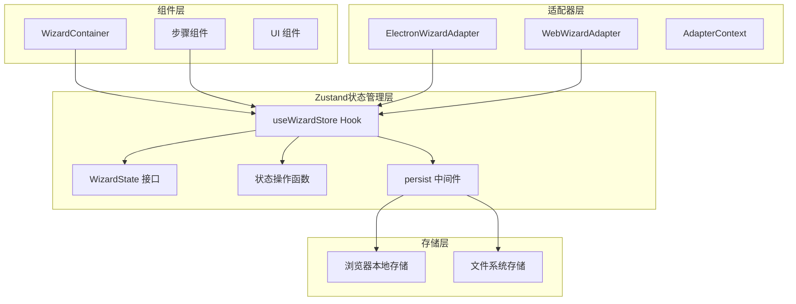
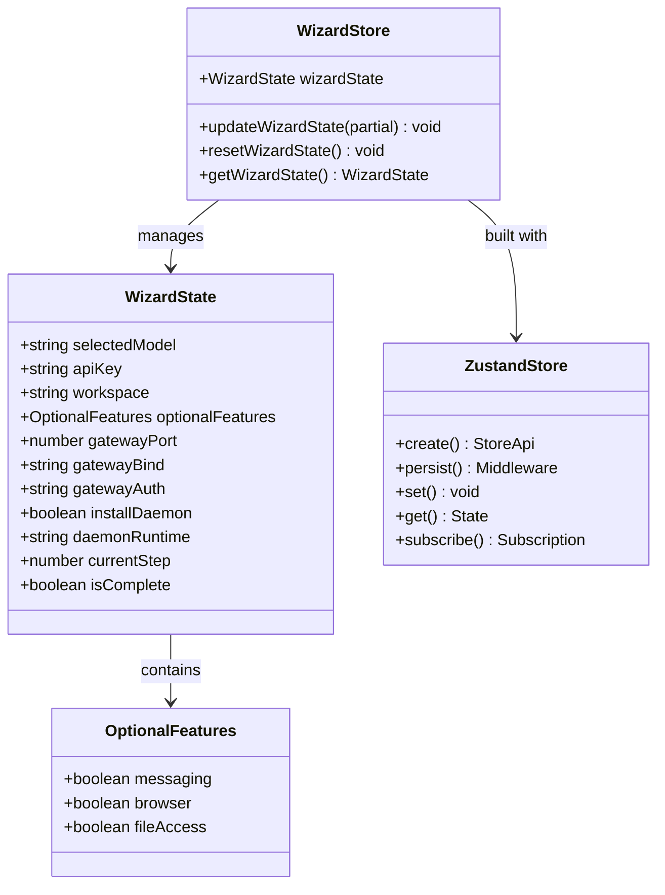
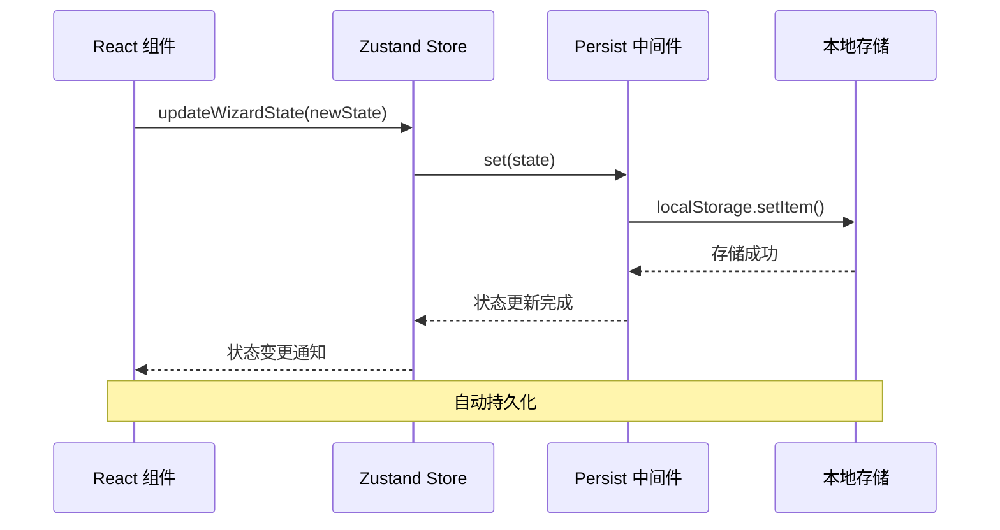
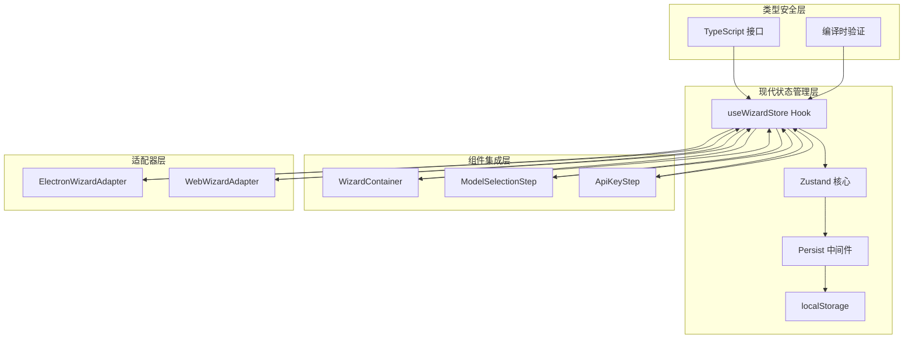
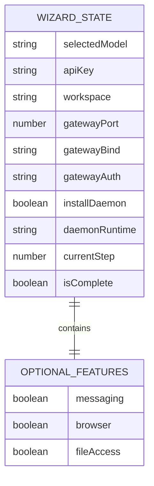
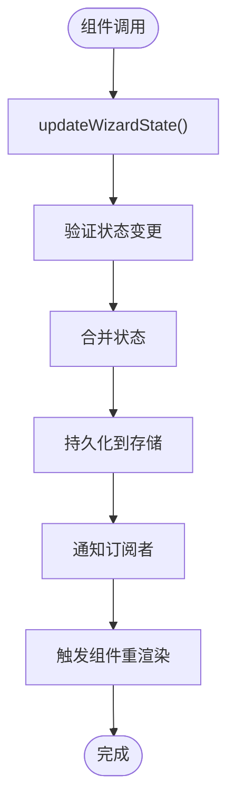
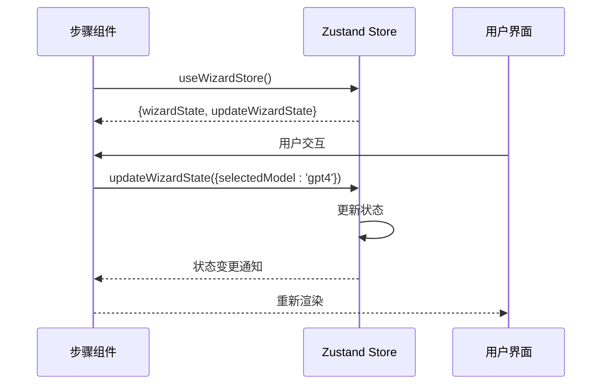
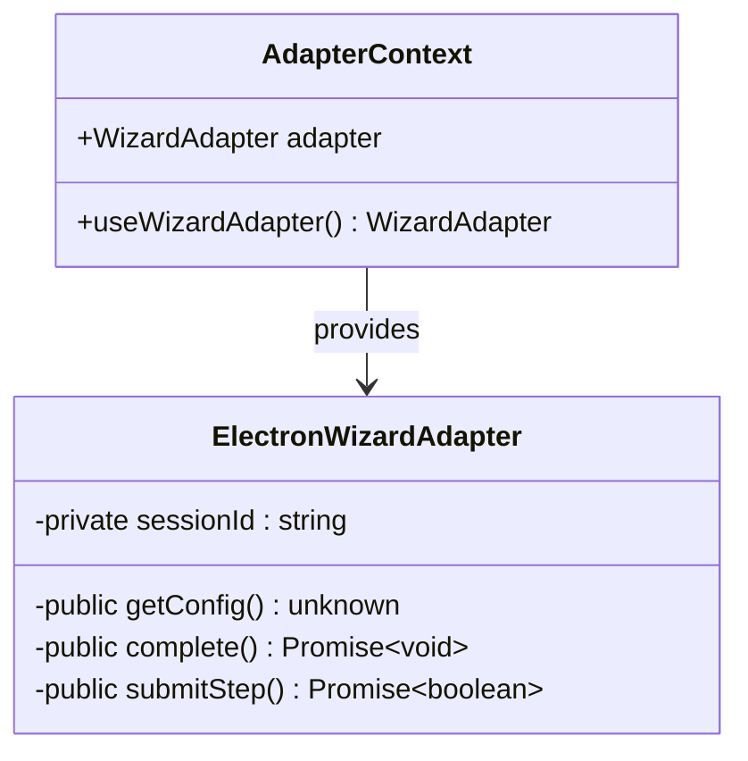
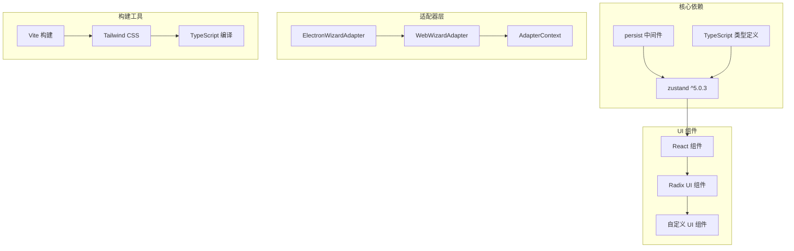

# 设置向导状态管理

<cite>
**本文档引用的文件**
- [packages/setup-wizard/src/store/setup-wizard.store.ts](file://packages/setup-wizard/src/store/setup-wizard.store.ts)
- [packages/setup-wizard/src/store/index.ts](file://packages/setup-wizard/src/store/index.ts)
- [packages/setup-wizard/src/adapters/ElectronWizardAdapter.ts](file://packages/setup-wizard/src/adapters/ElectronWizardAdapter.ts)
- [packages/setup-wizard/src/context/AdapterContext.tsx](file://packages/setup-wizard/src/context/AdapterContext.tsx)
- [packages/setup-wizard/src/components/setup-wizard/WizardContainer.tsx](file://packages/setup-wizard/src/components/setup-wizard/WizardContainer.tsx)
- [packages/setup-wizard/src/components/setup-wizard/steps/ModelSelectionStep.tsx](file://packages/setup-wizard/src/components/setup-wizard/steps/ModelSelectionStep.tsx)
- [packages/setup-wizard/src/components/setup-wizard/steps/ApiKeyStep.tsx](file://packages/setup-wizard/src/components/setup-wizard/steps/ApiKeyStep.tsx)
- [packages/setup-wizard/package.json](file://packages/setup-wizard/package.json)
</cite>

## 更新摘要
**所做更改**
- 更新了状态管理架构，从传统实现完全迁移到Zustand
- 新增了完整的Zustand状态管理实现和类型安全支持
- 更新了组件集成方式，展示Zustand在React组件中的使用
- 增强了状态持久化和性能优化特性

## 目录
1. [简介](#简介)
2. [项目结构](#项目结构)
3. [核心组件](#核心组件)
4. [架构概览](#架构概览)
5. [详细组件分析](#详细组件分析)
6. [依赖关系分析](#依赖关系分析)
7. [性能考虑](#性能考虑)
8. [故障排除指南](#故障排除指南)
9. [结论](#结论)

## 简介

设置向导状态管理系统经过完全重构，采用Zustand作为新的状态管理解决方案。该系统提供了更好的性能、更强的类型安全性和更简洁的API设计。Zustand的引入使得状态管理更加高效，同时保持了与现有组件架构的无缝集成。

系统的核心目标包括：
- 提供高性能的状态管理解决方案
- 确保完整的TypeScript类型安全
- 支持状态持久化和自动恢复
- 维护向后兼容性和渐进式迁移能力

## 项目结构

设置向导状态管理系统现在采用基于Zustand的现代化架构：

**图表来源**
- [packages/setup-wizard/src/store/setup-wizard.store.ts:56-86](file://packages/setup-wizard/src/store/setup-wizard.store.ts#L56-L86)
- [packages/setup-wizard/src/components/setup-wizard/WizardContainer.tsx:24-73](file://packages/setup-wizard/src/components/setup-wizard/WizardContainer.tsx#L24-L73)

**章节来源**
- [packages/setup-wizard/src/store/setup-wizard.store.ts:1-86](file://packages/setup-wizard/src/store/setup-wizard.store.ts#L1-L86)
- [packages/setup-wizard/src/store/index.ts:1-2](file://packages/setup-wizard/src/store/index.ts#L1-L2)
- [packages/setup-wizard/src/adapters/ElectronWizardAdapter.ts:22-34](file://packages/setup-wizard/src/adapters/ElectronWizardAdapter.ts#L22-L34)

## 核心组件

### Zustand 状态存储

Zustand提供了现代化的状态管理解决方案，具有以下核心特性：

**图表来源**
- [packages/setup-wizard/src/store/setup-wizard.store.ts:4-36](file://packages/setup-wizard/src/store/setup-wizard.store.ts#L4-L36)

### 状态持久化中间件

Zustand的persist中间件提供了透明的状态持久化功能：

**图表来源**
- [packages/setup-wizard/src/store/setup-wizard.store.ts:78-84](file://packages/setup-wizard/src/store/setup-wizard.store.ts#L78-L84)

**章节来源**
- [packages/setup-wizard/src/store/setup-wizard.store.ts:56-86](file://packages/setup-wizard/src/store/setup-wizard.store.ts#L56-L86)
- [packages/setup-wizard/src/components/setup-wizard/WizardContainer.tsx:24-26](file://packages/setup-wizard/src/components/setup-wizard/WizardContainer.tsx#L24-L26)

## 架构概览

Zustand重构后的架构提供了更好的性能和开发体验：

**图表来源**
- [packages/setup-wizard/src/store/setup-wizard.store.ts:56-86](file://packages/setup-wizard/src/store/setup-wizard.store.ts#L56-L86)
- [packages/setup-wizard/src/components/setup-wizard/steps/ModelSelectionStep.tsx:120-129](file://packages/setup-wizard/src/components/setup-wizard/steps/ModelSelectionStep.tsx#L120-L129)

系统的关键改进包括：

1. **性能优化**: Zustand的原子性状态更新减少了不必要的重渲染
2. **类型安全**: 完整的TypeScript支持确保编译时类型检查
3. **简洁API**: 更少的样板代码和更直观的API设计
4. **中间件生态**: 支持丰富的中间件生态系统，如持久化、日志等
5. **开发体验**: 更好的调试支持和时间旅行调试能力

## 详细组件分析

### Zustand 状态管理实现

Zustand提供了声明式的状态管理API：

#### 状态接口设计

**图表来源**
- [packages/setup-wizard/src/store/setup-wizard.store.ts:4-29](file://packages/setup-wizard/src/store/setup-wizard.store.ts#L4-L29)

#### 状态操作函数

Zustand提供了简洁的状态更新API：

**图表来源**
- [packages/setup-wizard/src/store/setup-wizard.store.ts:61-76](file://packages/setup-wizard/src/store/setup-wizard.store.ts#L61-L76)

**章节来源**
- [packages/setup-wizard/src/store/setup-wizard.store.ts:38-54](file://packages/setup-wizard/src/store/setup-wizard.store.ts#L38-L54)

### 组件集成模式

React组件现在可以通过Hook轻松访问全局状态：

#### 步骤组件中的状态使用

**图表来源**
- [packages/setup-wizard/src/components/setup-wizard/steps/ModelSelectionStep.tsx:120-129](file://packages/setup-wizard/src/components/setup-wizard/steps/ModelSelectionStep.tsx#L120-L129)

#### 适配器中的状态访问

适配器层通过上下文提供器访问状态：

**图表来源**
- [packages/setup-wizard/src/context/AdapterContext.tsx:19-28](file://packages/setup-wizard/src/context/AdapterContext.tsx#L19-L28)

**章节来源**
- [packages/setup-wizard/src/components/setup-wizard/steps/ApiKeyStep.tsx:29-56](file://packages/setup-wizard/src/components/setup-wizard/steps/ApiKeyStep.tsx#L29-L56)
- [packages/setup-wizard/src/adapters/ElectronWizardAdapter.ts:22-34](file://packages/setup-wizard/src/adapters/ElectronWizardAdapter.ts#L22-L34)

## 依赖关系分析

Zustand重构后的依赖关系更加清晰和模块化：

**图表来源**
- [packages/setup-wizard/package.json:43](file://packages/setup-wizard/package.json#L43)
- [packages/setup-wizard/package.json:21-44](file://packages/setup-wizard/package.json#L21-L44)

### 依赖版本升级

| 依赖包 | 旧版本 | 新版本 | 升级原因 |
|--------|--------|--------|----------|
| zustand | - | ^5.0.3 | 提供更好的性能和类型安全 |
| @sinclair/typebox | - | - | 仍用于协议验证 |
| ws | - | - | 仍用于WebSocket通信 |
| react | ^18.0.0 | ^18.0.0 或 ^19.0.0 | 支持最新React版本 |
| @clack/prompts | - | - | 仍用于CLI交互 |

**章节来源**
- [packages/setup-wizard/package.json:21-56](file://packages/setup-wizard/package.json#L21-L56)

## 性能考虑

Zustand重构带来了显著的性能提升：

### 内存优化

1. **原子性状态更新**: Zustand的原子性更新减少了内存分配
2. **选择性订阅**: 组件只订阅需要的状态部分
3. **持久化优化**: 智能的持久化策略避免不必要的存储操作

### 渲染优化

1. **细粒度更新**: 只有相关组件会重新渲染
2. **状态分片**: 大状态对象按需分割存储
3. **缓存机制**: 内置的计算属性缓存

### 开发体验优化

1. **时间旅行调试**: 支持状态历史回放和调试
2. **中间件支持**: 可插拔的中间件系统
3. **类型推断**: 完整的TypeScript类型推断

## 故障排除指南

### 常见问题及解决方案

#### 状态不更新问题

**症状**: 组件无法响应状态变更

**诊断步骤**:
1. 检查组件是否正确使用useWizardStore Hook
2. 验证状态更新函数的调用方式
3. 确认状态键名拼写正确

**解决方法**:
- 确保使用正确的状态更新API
- 检查组件的依赖数组配置
- 验证状态更新的原子性

#### 类型错误问题

**症状**: TypeScript编译错误

**诊断步骤**:
1. 检查WizardState接口定义
2. 验证状态更新的类型安全
3. 确认中间件配置正确

**解决方法**:
- 更新到最新的TypeScript版本
- 检查类型定义的兼容性
- 验证Zustand类型声明

#### 持久化问题

**症状**: 状态无法持久化或恢复

**诊断步骤**:
1. 检查localStorage访问权限
2. 验证持久化中间件配置
3. 确认存储键名唯一性

**解决方法**:
- 检查浏览器隐私设置
- 验证存储容量限制
- 重新初始化存储配置

**章节来源**
- [packages/setup-wizard/src/store/setup-wizard.store.ts:78-84](file://packages/setup-wizard/src/store/setup-wizard.store.ts#L78-L84)

## 结论

Zustand重构为设置向导状态管理系统带来了全面的改进：

### 主要成就

1. **性能提升**: Zustand的原子性状态更新显著减少了重渲染次数
2. **类型安全**: 完整的TypeScript支持确保编译时类型检查
3. **开发体验**: 简洁的API设计和强大的调试工具
4. **可维护性**: 更清晰的代码结构和更好的模块化设计

### 技术优势

1. **零样板代码**: 相比Redux等方案，Zustand提供了更简洁的API
2. **中间件生态**: 丰富的中间件生态系统支持各种需求
3. **团队协作**: 更容易理解和维护的状态管理模式
4. **性能表现**: 更快的初始化速度和更低的内存占用

### 未来展望

系统将继续演进，计划包括：
- 集成更多Zustand中间件以增强功能
- 优化大型状态对象的性能表现
- 扩展调试和监控能力
- 改进开发工具链支持

通过这次重构，设置向导状态管理系统不仅获得了更好的性能和可靠性，还为未来的功能扩展奠定了坚实的基础。