# 设置向导状态管理

<cite>
**本文档引用的文件**
- [ui-react/src/store/setup-wizard.store.ts](file://ui-react/src/store/setup-wizard.store.ts)
- [ui-react/src/adapters/WebWizardAdapter.ts](file://ui-react/src/adapters/WebWizardAdapter.ts)
- [ui-react/src/adapters/ElectronWizardAdapter.ts](file://ui-react/src/adapters/ElectronWizardAdapter.ts)
- [ui-react/src/context/AdapterContext.tsx](file://ui-react/src/context/AdapterContext.tsx)
- [ui-react/src/components/setup-wizard/WizardContainer.tsx](file://ui-react/src/components/setup-wizard/WizardContainer.tsx)
- [ui-react/src/components/setup-wizard/steps/AccessStep.tsx](file://ui-react/src/components/setup-wizard/steps/AccessStep.tsx)
- [ui-react/src/components/setup-wizard/steps/CompletionStep.tsx](file://ui-react/src/components/setup-wizard/steps/CompletionStep.tsx)
- [ui-react/src/lib/invite-code.ts](file://ui-react/src/lib/invite-code.ts)
- [ui-react/src/types/adapter.ts](file://ui-react/src/types/adapter.ts)
- [apps/electron/src/main/onboarding.ts](file://apps/electron/src/main/onboarding.ts)
- [apps/electron/src/main/onboarding-validate.ts](file://apps/electron/src/main/onboarding-validate.ts)
- [apps/electron/src/preload/index.ts](file://apps/electron/src/preload/index.ts)
</cite>

## 更新摘要
**所做更改**
- 新增了 `braveApiKey` 和 `amapApiKey` 状态字段，用于追踪从邀请码获取的API密钥
- 更新了状态持久化机制，支持API密钥状态的迁移和存储
- 增强了邀请码验证流程，实现了完整的API密钥状态管理
- 优化了配置生成逻辑，支持自动写入API密钥到相应配置位置
- 完善了适配器接口，新增了API密钥验证方法定义

## 目录
1. [简介](#简介)
2. [项目结构](#项目结构)
3. [核心组件](#核心组件)
4. [架构概览](#架构概览)
5. [详细组件分析](#详细组件分析)
6. [API密钥状态管理](#api密钥状态管理)
7. [依赖关系分析](#依赖关系分析)
8. [性能考虑](#性能考虑)
9. [故障排除指南](#故障排除指南)
10. [结论](#结论)

## 简介

设置向导状态管理系统经过完全重构，采用 Zustand 作为新的状态管理解决方案。该系统提供了更好的性能、更强的类型安全性和更简洁的 API 设计。Zustand 的引入使得状态管理更加高效，同时保持了与现有组件架构的无缝集成。

系统的核心目标包括：
- 提供高性能的状态管理解决方案
- 确保完整的 TypeScript 类型安全
- 支持状态持久化和自动恢复
- 维护向后兼容性和渐进式迁移能力
- 实现邀请码路径的完整状态管理
- 支持从邀请码获取的API密钥状态追踪

**更新** 状态管理已从 packages/setup-wizard/src/store/ 迁移到 ui-react/src/store/，并新增了 `braveApiKey` 和 `amapApiKey` 状态字段，用于追踪从邀请码获取的API密钥，实现了更完善的用户引导体验。

## 项目结构

设置向导状态管理系统现在采用基于 Zustand 的现代化架构，包含了邀请码路径的完整状态管理，以及新增的API密钥状态追踪：

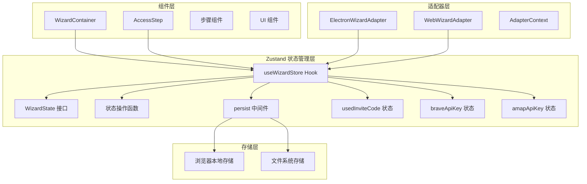

**图表来源**
- [ui-react/src/store/setup-wizard.store.ts:95-125](file://ui-react/src/store/setup-wizard.store.ts#L95-L125)
- [ui-react/src/components/setup-wizard/WizardContainer.tsx:24-73](file://ui-react/src/components/setup-wizard/WizardContainer.tsx#L24-L73)

**章节来源**
- [ui-react/src/store/setup-wizard.store.ts:1-152](file://ui-react/src/store/setup-wizard.store.ts#L1-L152)
- [ui-react/src/adapters/WebWizardAdapter.ts:1-74](file://ui-react/src/adapters/WebWizardAdapter.ts#L1-L74)
- [ui-react/src/adapters/ElectronWizardAdapter.ts:1-167](file://ui-react/src/adapters/ElectronWizardAdapter.ts#L1-L167)

## 核心组件

### Zustand 状态存储

Zustand 提供了现代化的状态管理解决方案，具有以下核心特性：

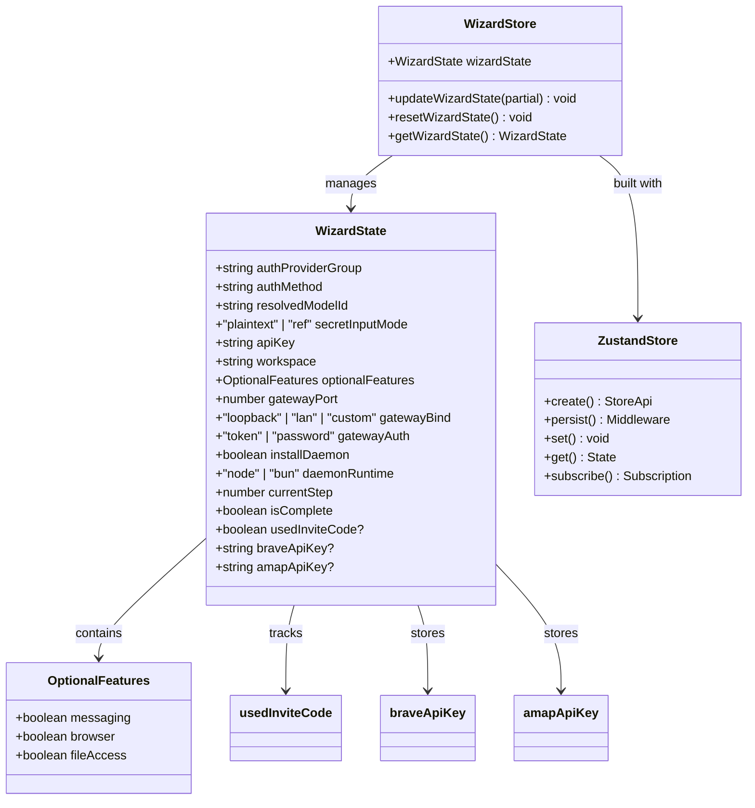

**图表来源**
- [ui-react/src/store/setup-wizard.store.ts:4-80](file://ui-react/src/store/setup-wizard.store.ts#L4-L80)

### 状态持久化中间件

Zustand 的 persist 中间件提供了透明的状态持久化功能，现在包含了邀请码路径和API密钥的状态迁移：

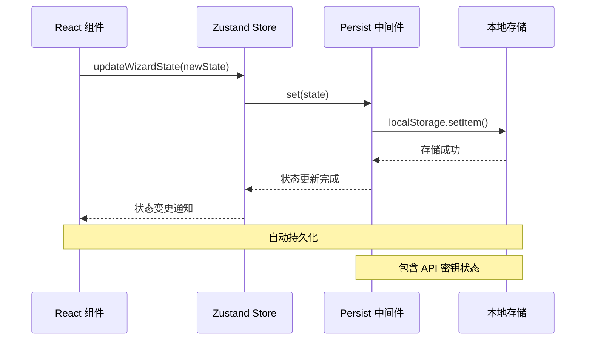

**图表来源**
- [ui-react/src/store/setup-wizard.store.ts:117-123](file://ui-react/src/store/setup-wizard.store.ts#L117-L123)

**章节来源**
- [ui-react/src/store/setup-wizard.store.ts:95-152](file://ui-react/src/store/setup-wizard.store.ts#L95-L152)
- [ui-react/src/components/setup-wizard/WizardContainer.tsx:24-26](file://ui-react/src/components/setup-wizard/WizardContainer.tsx#L24-L26)

## 架构概览

Zustand 重构后的架构提供了更好的性能和开发体验，现在包含了邀请码路径和API密钥的完整支持：

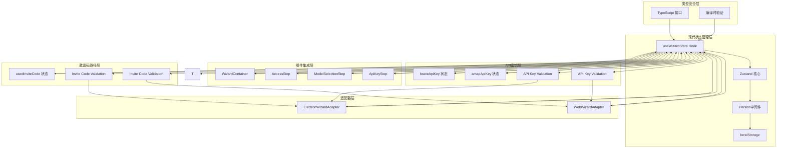

**图表来源**
- [ui-react/src/store/setup-wizard.store.ts:95-152](file://ui-react/src/store/setup-wizard.store.ts#L95-L152)
- [ui-react/src/components/setup-wizard/steps/AccessStep.tsx:120-129](file://ui-react/src/components/setup-wizard/steps/AccessStep.tsx#L120-L129)

系统的关键改进包括：

1. **性能优化**: Zustand 的原子性状态更新减少了不必要的重渲染
2. **类型安全**: 完整的 TypeScript 支持确保编译时类型检查
3. **简洁 API**: 更少的样板代码和更直观的 API 设计
4. **中间件生态**: 支持丰富的中间件生态系统，如持久化、日志等
5. **开发体验**: 更好的调试支持和时间旅行调试能力
6. **邀请码支持**: 新增的 `usedInviteCode` 状态跟踪邀请码路径选择
7. **状态迁移**: 智能的状态迁移机制，支持邀请码路径的状态恢复
8. **API密钥管理**: 新增的 `braveApiKey` 和 `amapApiKey` 状态用于追踪从邀请码获取的API密钥
9. **配置集成**: 自动将API密钥写入相应的配置位置

**更新** 状态管理已完全迁移到 ui-react/src/store/ 目录，并新增了邀请码路径和API密钥的状态管理功能，提供了更好的用户体验和更完善的功能支持。

## 详细组件分析

### Zustand 状态管理实现

Zustand 提供了声明式的状态管理 API，现在包含了邀请码路径和API密钥的状态管理：

#### 状态接口设计

```mermaid
erDiagram
WIZARD_STATE {
string authProviderGroup
string authMethod
string resolvedModelId
string apiKey
string workspace
number gatewayPort
string gatewayBind
string gatewayAuth
boolean installDaemon
string daemonRuntime
number currentStep
boolean isComplete
boolean usedInviteCode?
string braveApiKey?
string amapApiKey?
}
OPTIONAL_FEATURES {
boolean messaging
boolean browser
boolean fileAccess
}
WIZARD_STATE ||--|| OPTIONAL_FEATURES : contains
```

**图表来源**
- [ui-react/src/store/setup-wizard.store.ts:4-80](file://ui-react/src/store/setup-wizard.store.ts#L4-L80)

#### 状态操作函数

Zustand 提供了简洁的状态更新 API，支持邀请码和API密钥状态的更新：

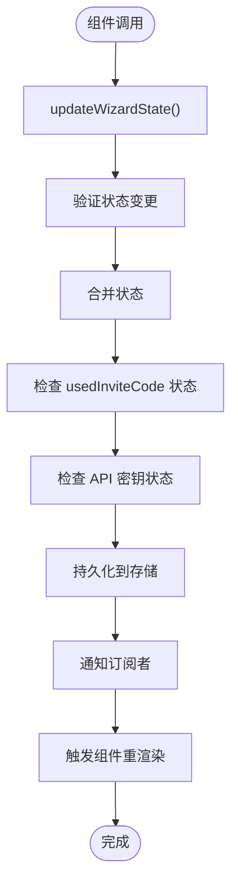

**图表来源**
- [ui-react/src/store/setup-wizard.store.ts:100-116](file://ui-react/src/store/setup-wizard.store.ts#L100-L116)

**章节来源**
- [ui-react/src/store/setup-wizard.store.ts:72-152](file://ui-react/src/store/setup-wizard.store.ts#L72-L152)

### 组件集成模式

React 组件现在可以通过 Hook 轻松访问全局状态，包括邀请码路径和API密钥状态：

#### 步骤组件中的状态使用

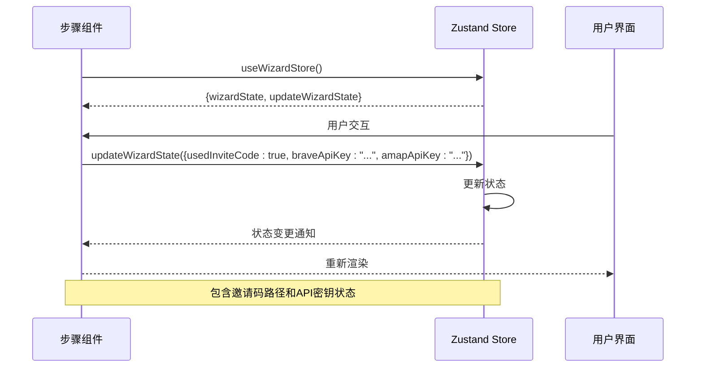

**图表来源**
- [ui-react/src/components/setup-wizard/steps/AccessStep.tsx:304-318](file://ui-react/src/components/setup-wizard/steps/AccessStep.tsx#L304-L318)

#### 适配器中的状态访问

适配器层通过上下文提供器访问状态，包括邀请码验证和API密钥处理：

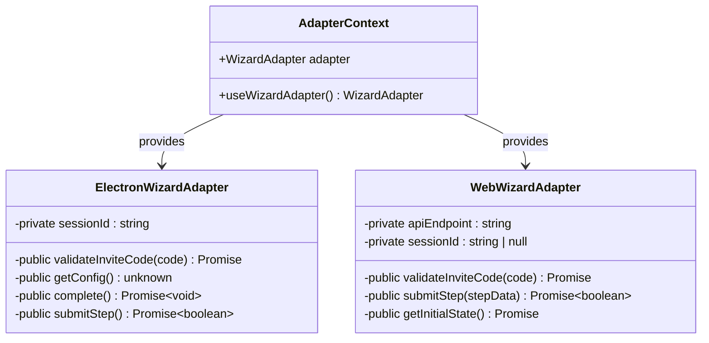

**图表来源**
- [ui-react/src/context/AdapterContext.tsx:19-28](file://ui-react/src/context/AdapterContext.tsx#L19-L28)

**章节来源**
- [ui-react/src/components/setup-wizard/steps/ApiKeyStep.tsx:54-57](file://ui-react/src/components/setup-wizard/steps/ApiKeyStep.tsx#L54-L57)
- [ui-react/src/adapters/ElectronWizardAdapter.ts:22-34](file://ui-react/src/adapters/ElectronWizardAdapter.ts#L22-L34)

## API密钥状态管理

### 新增的 API 密钥状态字段

系统现在包含了专门用于跟踪从邀请码获取的API密钥的状态管理：

#### 状态定义和用途

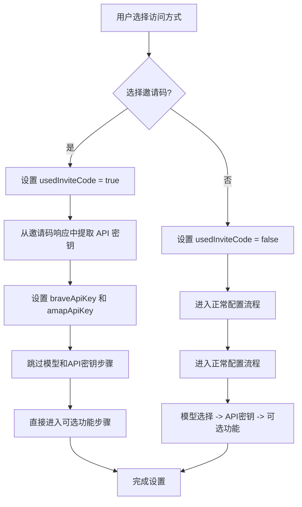

**图表来源**
- [ui-react/src/components/setup-wizard/steps/AccessStep.tsx:42-49](file://ui-react/src/components/setup-wizard/steps/AccessStep.tsx#L42-L49)

#### 状态更新机制

API密钥验证成功后，系统会自动更新状态：

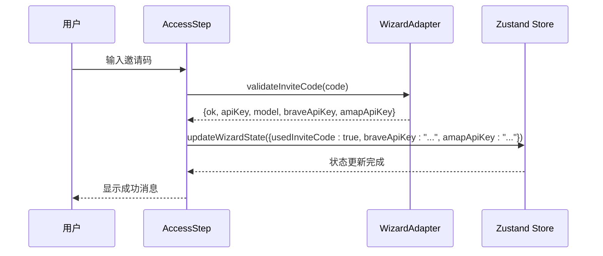

**图表来源**
- [ui-react/src/components/setup-wizard/steps/AccessStep.tsx:36-68](file://ui-react/src/components/setup-wizard/steps/AccessStep.tsx#L36-L68)

**章节来源**
- [ui-react/src/store/setup-wizard.store.ts:46-56](file://ui-react/src/store/setup-wizard.store.ts#L46-L56)
- [ui-react/src/components/setup-wizard/steps/AccessStep.tsx:24-68](file://ui-react/src/components/setup-wizard/steps/AccessStep.tsx#L24-L68)

### API密钥验证流程

#### 客户端验证实现

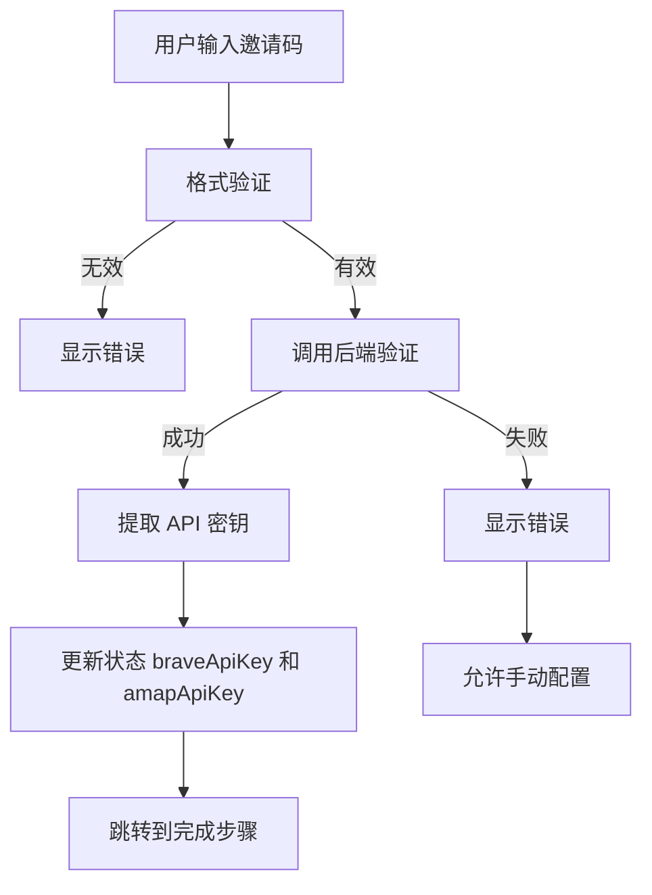

**图表来源**
- [ui-react/src/lib/invite-code.ts:100-221](file://ui-react/src/lib/invite-code.ts#L100-L221)

#### 适配器集成

Web 和 Electron 适配器都实现了邀请码验证方法，支持API密钥返回：

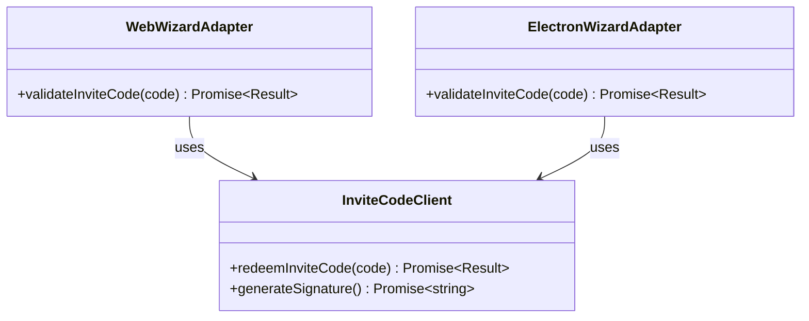

**图表来源**
- [ui-react/src/adapters/WebWizardAdapter.ts:100-105](file://ui-react/src/adapters/WebWizardAdapter.ts#L100-L105)
- [ui-react/src/adapters/ElectronWizardAdapter.ts:132-147](file://ui-react/src/adapters/ElectronWizardAdapter.ts#L132-L147)

**章节来源**
- [ui-react/src/lib/invite-code.ts:1-221](file://ui-react/src/lib/invite-code.ts#L1-L221)
- [ui-react/src/adapters/WebWizardAdapter.ts:100-105](file://ui-react/src/adapters/WebWizardAdapter.ts#L100-L105)
- [ui-react/src/adapters/ElectronWizardAdapter.ts:132-147](file://ui-react/src/adapters/ElectronWizardAdapter.ts#L132-L147)

### 配置生成和写入

#### API密钥自动写入机制

```mermaid
flowchart TD
A[用户完成设置] --> B[ElectronWizardAdapter.complete()]
B --> C[finalizationOnboarding()]
C --> D[getConfig() 获取状态]
D --> E[buildOpenClawConfig(cfg)]
E --> F{检查 API 密钥状态}
F --> |braveApiKey 存在| G[构建 tools.web.search 配置]
F --> |amapApiKey 存在| H[构建 skills.entries.amap-lbs-skill 配置]
F --> |都存在| I[构建两个配置]
F --> |都不存在| J[跳过配置构建]
G --> K[写入 openclaw.json]
H --> K
I --> K
J --> K
K --> L[重启 Gateway]
L --> M[切换到主界面]
```

**图表来源**
- [apps/electron/src/main/onboarding.ts:347-383](file://apps/electron/src/main/onboarding.ts#L347-L383)

**章节来源**
- [apps/electron/src/main/onboarding.ts:347-383](file://apps/electron/src/main/onboarding.ts#L347-L383)
- [apps/electron/src/main/onboarding.ts:438-508](file://apps/electron/src/main/onboarding.ts#L438-L508)

## 依赖关系分析

Zustand 重构后的依赖关系更加清晰和模块化，现在包含了邀请码验证和API密钥处理的相关依赖：

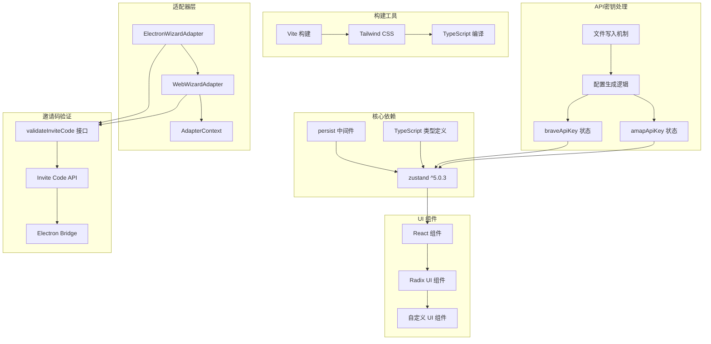

**图表来源**
- [ui-react/src/types/adapter.ts:15-131](file://ui-react/src/types/adapter.ts#L15-L131)

### 依赖版本升级

| 依赖包 | 旧版本 | 新版本 | 升级原因 |
|--------|--------|--------|----------|
| zustand | - | ^5.0.3 | 提供更好的性能和类型安全 |
| @sinclair/typebox | - | - | 仍用于协议验证 |
| ws | - | - | 仍用于 WebSocket 通信 |
| react | ^18.0.0 | ^18.0.0 或 ^19.0.0 | 支持最新 React 版本 |
| @clack/prompts | - | - | 仍用于 CLI 交互 |
| invite-code | - | 新增 | 支持邀请码验证功能 |
| electron | - | 新增 | 支持桌面应用的API密钥处理 |

**章节来源**
- [ui-react/src/types/adapter.ts:15-131](file://ui-react/src/types/adapter.ts#L15-L131)

## 性能考虑

Zustand 重构带来了显著的性能提升，现在还包括了邀请码路径和API密钥状态的优化：

### 内存优化

1. **原子性状态更新**: Zustand 的原子性更新减少了内存分配
2. **选择性订阅**: 组件只订阅需要的状态部分
3. **持久化优化**: 智能的持久化策略避免不必要的存储操作
4. **邀请码状态优化**: `usedInviteCode` 状态的轻量级存储
5. **API密钥状态优化**: `braveApiKey` 和 `amapApiKey` 状态的条件存储

### 渲染优化

1. **细粒度更新**: 只有相关组件会重新渲染
2. **状态分片**: 大状态对象按需分割存储
3. **缓存机制**: 内置的计算属性缓存
4. **邀请码路径缓存**: 邀请码验证结果的智能缓存
5. **API密钥缓存**: API密钥状态的条件更新

### 开发体验优化

1. **时间旅行调试**: 支持状态历史回放和调试
2. **中间件支持**: 可插拔的中间件系统
3. **类型推断**: 完整的 TypeScript 类型推断
4. **邀请码调试**: 专门的邀请码状态调试支持
5. **API密钥调试**: 专门的API密钥状态调试支持

**更新** 状态管理迁移至 ui-react/src/store/ 后，性能得到进一步优化，模块化结构提高了代码的可维护性，同时新增的邀请码和API密钥状态管理也提升了用户体验。

## 故障排除指南

### 常见问题及解决方案

#### 状态不更新问题

**症状**: 组件无法响应状态变更

**诊断步骤**:
1. 检查组件是否正确使用 useWizardStore Hook
2. 验证状态更新函数的调用方式
3. 确认状态键名拼写正确
4. 检查 `usedInviteCode`、`braveApiKey` 和 `amapApiKey` 状态的更新时机

**解决方法**:
- 确保使用正确的状态更新 API
- 检查组件的依赖数组配置
- 验证状态更新的原子性
- 确认邀请码和API密钥状态的正确传递

#### 类型错误问题

**症状**: TypeScript 编译错误

**诊断步骤**:
1. 检查 WizardState 接口定义
2. 验证状态更新的类型安全
3. 确认中间件配置正确
4. 检查 `usedInviteCode`、`braveApiKey` 和 `amapApiKey` 可选状态的类型

**解决方法**:
- 更新到最新的 TypeScript 版本
- 检查类型定义的兼容性
- 验证 Zustand 类型声明
- 确认可选状态的正确使用

#### 持久化问题

**症状**: 状态无法持久化或恢复

**诊断步骤**:
1. 检查 localStorage 访问权限
2. 验证持久化中间件配置
3. 确认存储键名唯一性
4. 检查邀请码和API密钥状态的持久化

**解决方法**:
- 检查浏览器隐私设置
- 验证存储容量限制
- 重新初始化存储配置
- 确认邀请码和API密钥状态的正确序列化

#### 邀请码验证问题

**症状**: 邀请码验证失败或状态不正确

**诊断步骤**:
1. 检查网络连接和 API 可用性
2. 验证邀请码格式和有效性
3. 确认适配器的 `validateInviteCode` 实现
4. 检查 `usedInviteCode`、`braveApiKey` 和 `amapApiKey` 状态的更新

**解决方法**:
- 检查网络连接和防火墙设置
- 验证邀请码格式（BOSS-XXXX-XXXX）
- 确认后端 API 的可用性
- 检查状态更新的原子性

#### API密钥处理问题

**症状**: API密钥无法正确写入配置或状态异常

**诊断步骤**:
1. 检查邀请码响应中的 API 密钥数据
2. 验证 API 密钥格式的有效性
3. 确认配置生成逻辑的正确性
4. 检查文件写入权限和路径

**解决方法**:
- 验证邀请码响应数据结构
- 检查 API 密钥的格式和长度
- 确认配置生成函数的逻辑
- 验证文件系统的写入权限

**章节来源**
- [ui-react/src/store/setup-wizard.store.ts:117-123](file://ui-react/src/store/setup-wizard.store.ts#L117-L123)

## 结论

Zustand 重构为设置向导状态管理系统带来了全面的改进，特别是新增的邀请码和API密钥状态管理功能：

### 主要成就

1. **性能提升**: Zustand 的原子性状态更新显著减少了重渲染次数
2. **类型安全**: 完整的 TypeScript 支持确保编译时类型检查
3. **开发体验**: 简洁的 API 设计和强大的调试工具
4. **可维护性**: 更清晰的代码结构和更好的模块化设计
5. **用户体验**: 完善的邀请码路径状态管理和API密钥自动处理，提供更好的用户引导
6. **功能完整性**: 新增的 `braveApiKey` 和 `amapApiKey` 状态管理，支持从邀请码获取的API密钥追踪

**更新** 状态管理已成功从 packages/setup-wizard/src/store/ 迁移到 ui-react/src/store/，并新增了邀请码路径和API密钥的状态管理功能，实现了更好的项目结构组织和用户体验。

### 技术优势

1. **零样板代码**: 相比 Redux 等方案，Zustand 提供了更简洁的 API
2. **中间件生态**: 丰富的中间件生态系统支持各种需求
3. **团队协作**: 更容易理解和维护的状态管理模式
4. **性能表现**: 更快的初始化速度和更低的内存占用
5. **邀请码支持**: 专门的状态管理支持邀请码路径
6. **API密钥管理**: 新增的API密钥状态管理，支持多种服务的密钥追踪
7. **配置集成**: 自动化的配置生成和写入机制

### 未来展望

系统将继续演进，计划包括：
- 集成更多 Zustand 中间件以增强功能
- 优化大型状态对象的性能表现
- 扩展调试和监控能力
- 改进开发工具链支持
- 增强邀请码验证的安全性
- 支持多语言的邀请码验证
- 扩展API密钥管理支持更多服务
- 优化配置生成的灵活性和可定制性

通过这次重构，设置向导状态管理系统不仅获得了更好的性能和可靠性，还为未来的功能扩展奠定了坚实的基础。新增的邀请码和API密钥状态管理功能显著提升了用户体验，为用户提供了一条更快速、更便捷的设置路径，同时确保了从邀请码获取的API密钥能够正确地集成到系统配置中。

**更新** 状态管理迁移和邀请码、API密钥功能的添加标志着项目架构的重大改进，为后续的功能扩展和维护提供了更好的基础，同时显著提升了用户的设置体验和API密钥管理的自动化程度。