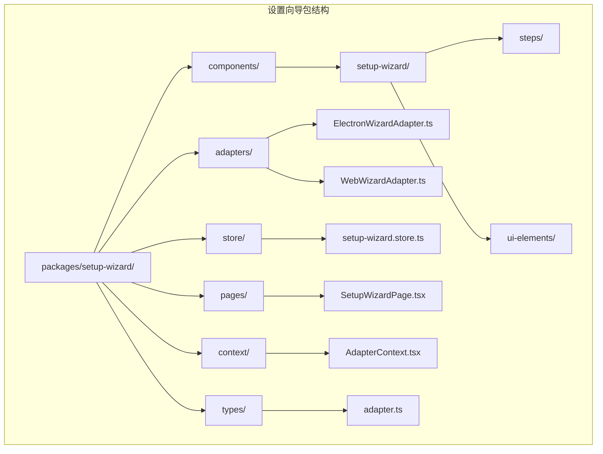
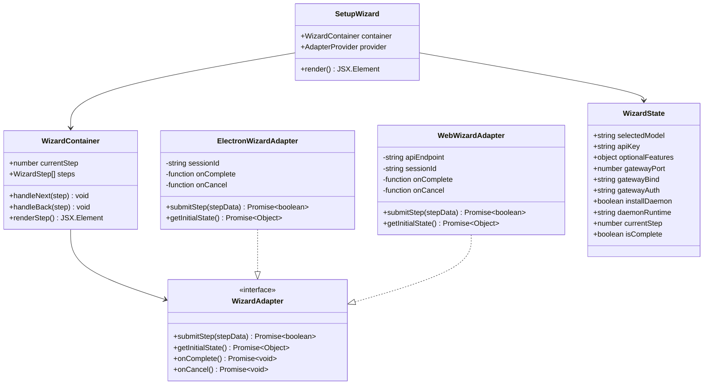
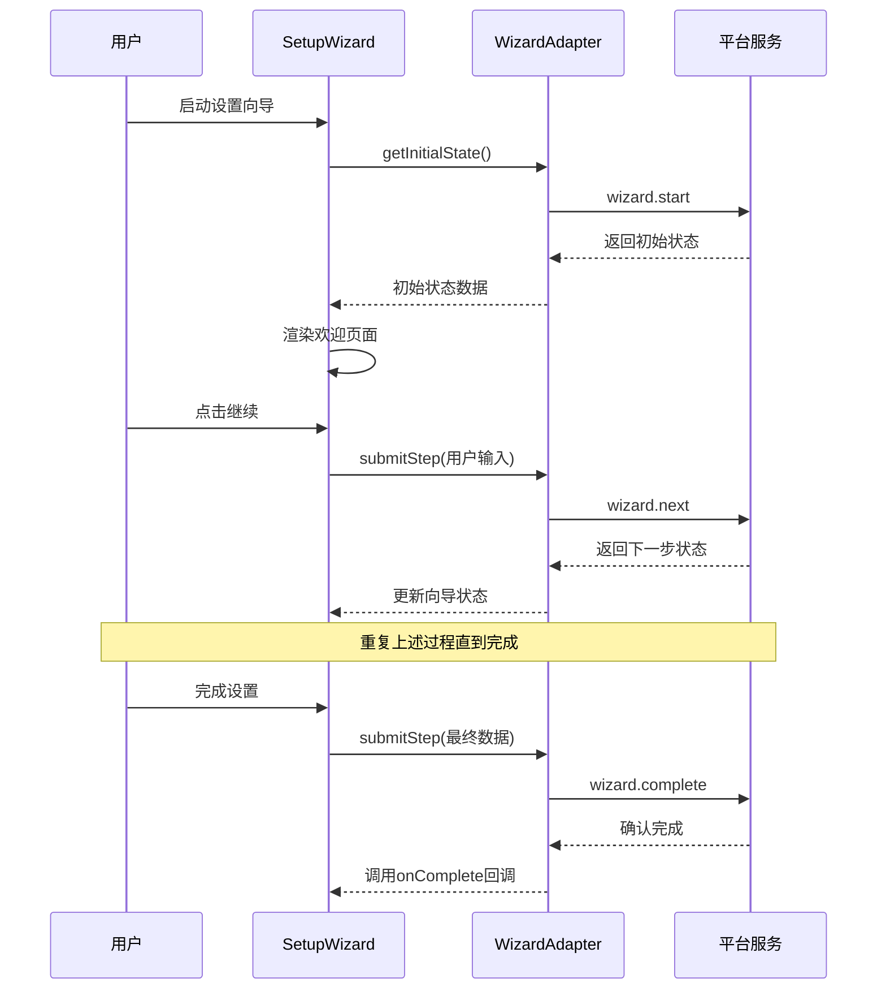
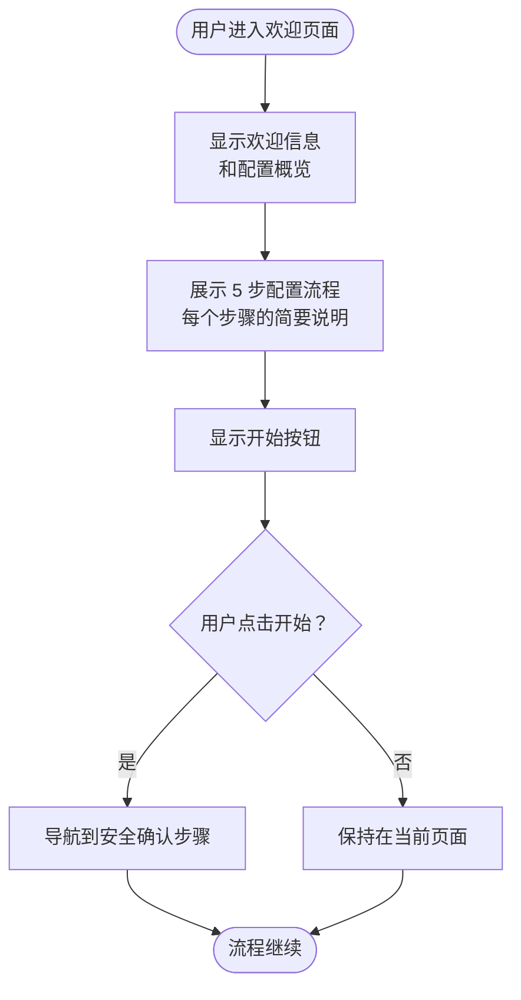
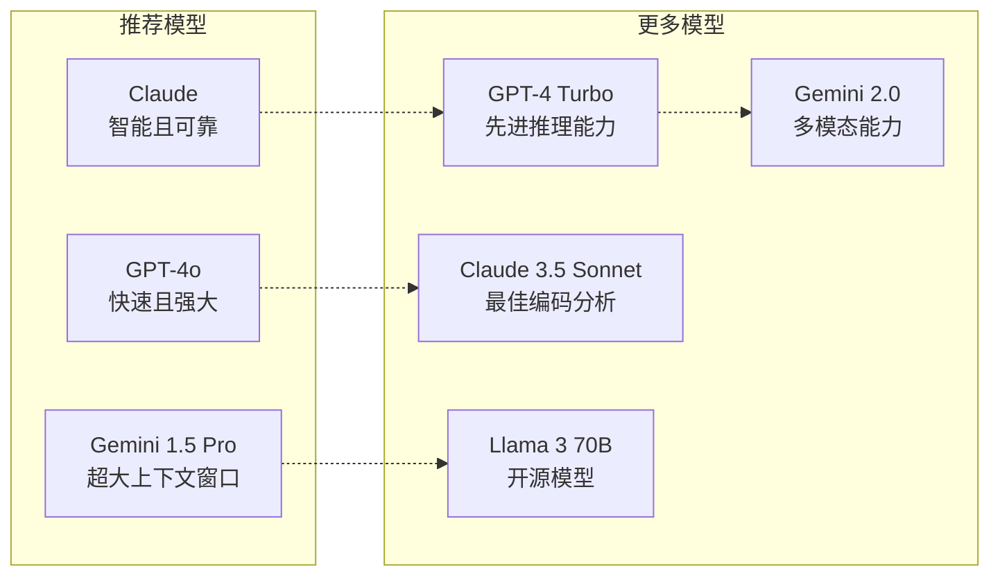
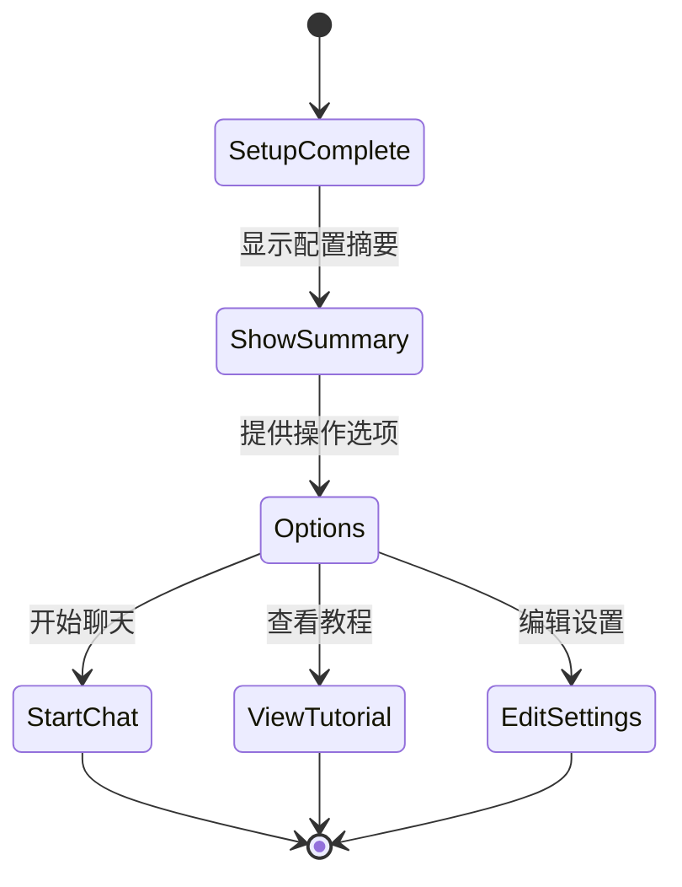
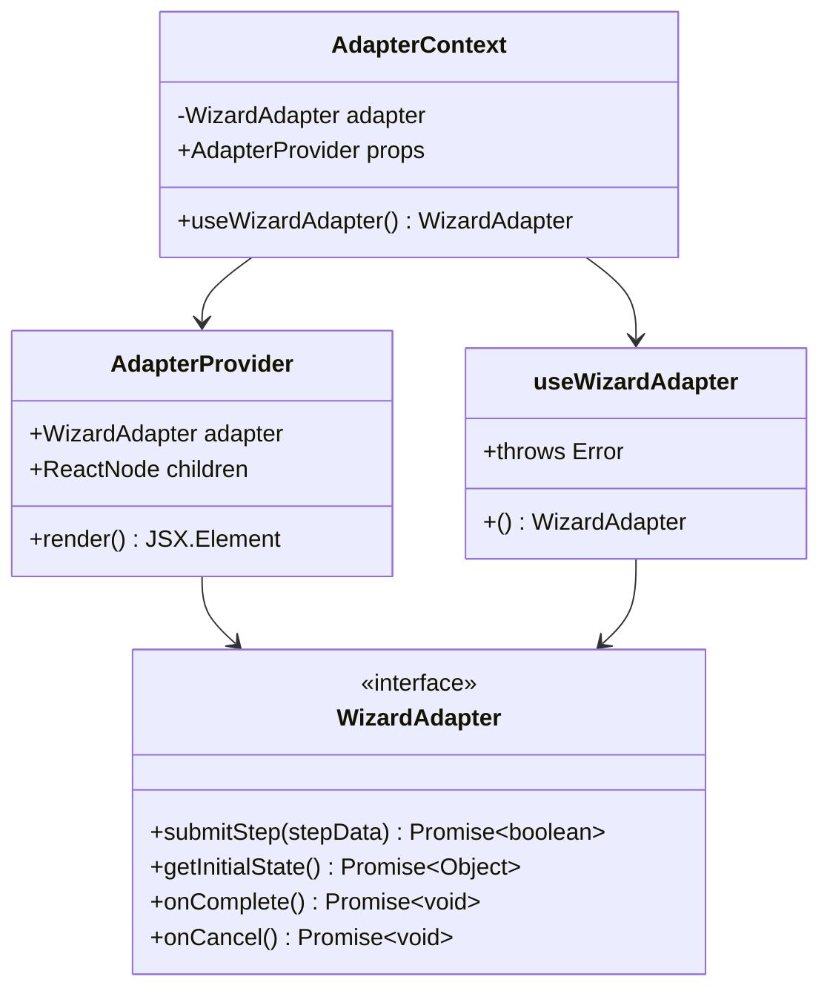
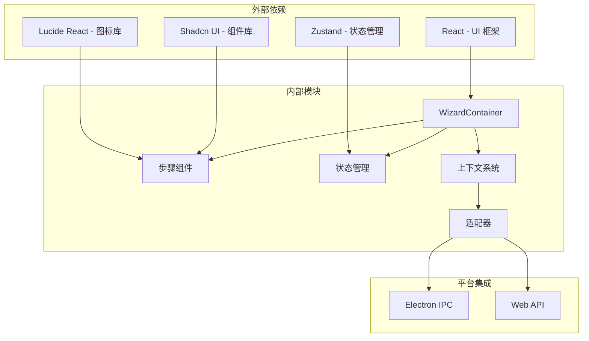
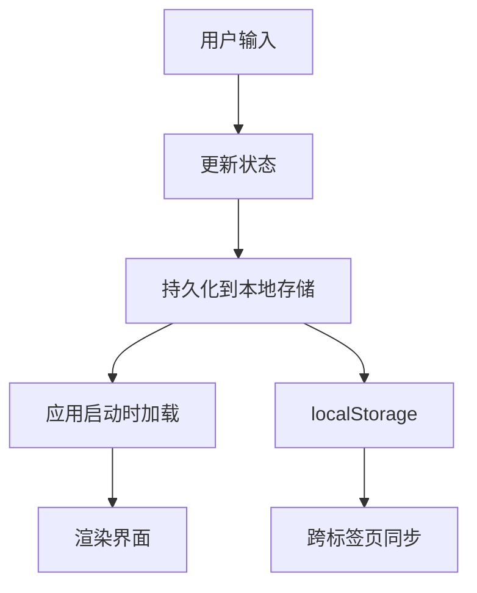
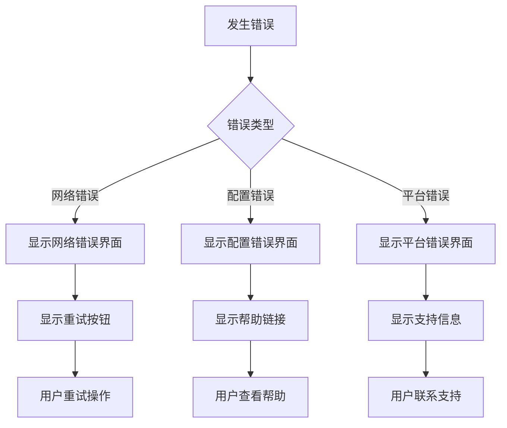

# 设置向导设计文档

<cite>
**本文档引用的文件**
- [SETUP_WIZARD_INTEGRATION_GUIDE.md](file://SETUP_WIZARD_INTEGRATION_GUIDE.md)
- [index.ts](file://packages/setup-wizard/src/index.ts)
- [setup-wizard.store.ts](file://packages/setup-wizard/src/store/setup-wizard.store.ts)
- [ElectronWizardAdapter.ts](file://packages/setup-wizard/src/adapters/ElectronWizardAdapter.ts)
- [WebWizardAdapter.ts](file://packages/setup-wizard/src/adapters/WebWizardAdapter.ts)
- [SetupWizardPage.tsx](file://packages/setup-wizard/src/pages/SetupWizardPage.tsx)
- [AdapterContext.tsx](file://packages/setup-wizard/src/context/AdapterContext.tsx)
- [WizardContainer.tsx](file://packages/setup-wizard/src/components/setup-wizard/WizardContainer.tsx)
- [WelcomeStep.tsx](file://packages/setup-wizard/src/components/setup-wizard/steps/WelcomeStep.tsx)
- [SecurityStep.tsx](file://packages/setup-wizard/src/components/setup-wizard/steps/SecurityStep.tsx)
- [ModelSelectionStep.tsx](file://packages/setup-wizard/src/components/setup-wizard/steps/ModelSelectionStep.tsx)
- [ApiKeyStep.tsx](file://packages/setup-wizard/src/components/setup-wizard/steps/ApiKeyStep.tsx)
- [OptionalFeaturesStep.tsx](file://packages/setup-wizard/src/components/setup-wizard/steps/OptionalFeaturesStep.tsx)
- [CompletionStep.tsx](file://packages/setup-wizard/src/components/setup-wizard/steps/CompletionStep.tsx)
- [adapter.ts](file://packages/setup-wizard/src/types/adapter.ts)
</cite>

## 目录
1. [简介](#简介)
2. [项目结构](#项目结构)
3. [核心组件](#核心组件)
4. [架构概览](#架构概览)
5. [详细组件分析](#详细组件分析)
6. [依赖关系分析](#依赖关系分析)
7. [性能考虑](#性能考虑)
8. [故障排除指南](#故障排除指南)
9. [结论](#结论)

## 简介

OpenClaw 设置向导是一个现代化的多平台配置工具，旨在为用户提供直观、安全且高效的初始配置体验。该系统采用适配器模式设计，支持 Electron 和 Web 两种运行环境，通过 6 个精心设计的步骤引导用户完成 AI 助手的完整配置。

设置向导的核心目标是简化复杂的配置过程，同时确保用户能够充分理解每个配置选项的重要性和影响。系统提供了完整的错误处理机制、状态持久化功能，以及灵活的扩展性设计。

## 项目结构

设置向导项目采用模块化的组织结构，主要分为以下几个核心部分：

**图表来源**
- [index.ts:1-33](file://packages/setup-wizard/src/index.ts#L1-L33)
- [adapter.ts:1-46](file://packages/setup-wizard/src/types/adapter.ts#L1-L46)

**章节来源**
- [SETUP_WIZARD_INTEGRATION_GUIDE.md:1-292](file://SETUP_WIZARD_INTEGRATION_GUIDE.md#L1-L292)
- [index.ts:1-33](file://packages/setup-wizard/src/index.ts#L1-L33)

## 核心组件

设置向导系统由多个精心设计的核心组件构成，每个组件都有明确的职责和作用：

### 主要组件架构

**图表来源**
- [WizardContainer.tsx:1-114](file://packages/setup-wizard/src/components/setup-wizard/WizardContainer.tsx#L1-L114)
- [ElectronWizardAdapter.ts:1-82](file://packages/setup-wizard/src/adapters/ElectronWizardAdapter.ts#L1-L82)
- [WebWizardAdapter.ts:1-76](file://packages/setup-wizard/src/adapters/WebWizardAdapter.ts#L1-L76)
- [setup-wizard.store.ts:1-86](file://packages/setup-wizard/src/store/setup-wizard.store.ts#L1-L86)

### 状态管理系统

设置向导采用 Zustand 状态管理库，提供响应式的状态更新和持久化存储：

| 状态类别 | 属性名称 | 默认值 | 描述 |
|---------|----------|--------|------|
| 基础设置 | selectedModel | "claude" | 选择的 AI 模型 |
| 基础设置 | apiKey | "" | API 密钥 |
| 基础设置 | workspace | "~/.openclaw/workspace" | 工作空间路径 |
| 可选功能 | optionalFeatures.messaging | false | 消息功能开关 |
| 可选功能 | optionalFeatures.browser | true | 浏览器功能开关 |
| 可选功能 | optionalFeatures.fileAccess | false | 文件访问功能开关 |
| 网关设置 | gatewayPort | 18789 | 网关端口号 |
| 网关设置 | gatewayBind | "loopback" | 绑定地址类型 |
| 网关设置 | gatewayAuth | "token" | 认证方式 |
| 守护进程 | installDaemon | true | 是否安装守护进程 |
| 守护进程 | daemonRuntime | "node" | 守护进程运行时 |

**章节来源**
- [setup-wizard.store.ts:1-86](file://packages/setup-wizard/src/store/setup-wizard.store.ts#L1-L86)

## 架构概览

设置向导系统采用分层架构设计，通过适配器模式实现平台无关性：

**图表来源**
- [ElectronWizardAdapter.ts:59-80](file://packages/setup-wizard/src/adapters/ElectronWizardAdapter.ts#L59-L80)
- [WebWizardAdapter.ts:54-74](file://packages/setup-wizard/src/adapters/WebWizardAdapter.ts#L54-L74)

### 适配器模式优势

设置向导系统采用适配器模式的主要优势包括：

1. **平台无关性** - 同一套 UI 代码支持多种运行环境
2. **易于测试** - 可以轻松创建模拟适配器进行单元测试
3. **扩展性强** - 新增平台只需实现 WizardAdapter 接口
4. **关注点分离** - UI 逻辑与平台通信细节完全分离

**章节来源**
- [SETUP_WIZARD_INTEGRATION_GUIDE.md:237-245](file://SETUP_WIZARD_INTEGRATION_GUIDE.md#L237-L245)

## 详细组件分析

### 步骤组件系统

设置向导包含 6 个精心设计的步骤组件，每个组件都有特定的功能和用户体验目标：

#### 欢迎步骤 (WelcomeStep)

欢迎步骤是用户旅程的起点，负责建立期望和介绍配置流程：

**图表来源**
- [WelcomeStep.tsx:27-86](file://packages/setup-wizard/src/components/setup-wizard/steps/WelcomeStep.tsx#L27-L86)

#### 安全确认步骤 (SecurityStep)

安全确认步骤强调系统的安全性，要求用户确认理解安全风险：

| 安全要点 | 描述 | 影响 |
|---------|------|------|
| 受信任设备运行 | 确保环境安全 | 防止恶意执行 |
| API 密钥保密 | 保护敏感凭证 | 防止账户滥用 |
| 日志监控 | 跟踪活动 | 防止异常行为 |

**章节来源**
- [SecurityStep.tsx:1-96](file://packages/setup-wizard/src/components/setup-wizard/steps/SecurityStep.tsx#L1-L96)

#### 模型选择步骤 (ModelSelectionStep)

模型选择步骤提供多种 AI 模型供用户选择，支持推荐系统和高级筛选：

**图表来源**
- [ModelSelectionStep.tsx:17-118](file://packages/setup-wizard/src/components/setup-wizard/steps/ModelSelectionStep.tsx#L17-L118)

#### API 密钥步骤 (ApiKeyStep)

API 密钥步骤提供清晰的指导和连接测试功能：

| 步骤 | 操作 | 目标 |
|------|------|------|
| 1 | 打开提供商网站 | 获取 API 密钥 |
| 2 | 输入密钥 | 配置认证凭据 |
| 3 | 测试连接 | 验证配置正确性 |

**章节来源**
- [ApiKeyStep.tsx:1-191](file://packages/setup-wizard/src/components/setup-wizard/steps/ApiKeyStep.tsx#L1-L191)

#### 可选功能步骤 (OptionalFeaturesStep)

可选功能步骤允许用户自定义功能组合：

| 功能 | 图标 | 描述 | 默认状态 |
|------|------|------|----------|
| Messaging | 💬 | 内置聊天功能 | ✅ 启用 |
| Browser | 🌐 | 浏览网页能力 | ❌ 禁用 |
| File Access | 📁 | 文件管理和存储 | ✅ 启用 |

**章节来源**
- [OptionalFeaturesStep.tsx:1-108](file://packages/setup-wizard/src/components/setup-wizard/steps/OptionalFeaturesStep.tsx#L1-L108)

#### 完成步骤 (CompletionStep)

完成步骤提供最终确认和后续操作指引：

**图表来源**
- [CompletionStep.tsx:17-147](file://packages/setup-wizard/src/components/setup-wizard/steps/CompletionStep.tsx#L17-L147)

**章节来源**
- [CompletionStep.tsx:1-147](file://packages/setup-wizard/src/components/setup-wizard/steps/CompletionStep.tsx#L1-L147)

### 上下文和适配器系统

设置向导使用 React Context 和适配器模式实现组件间的通信：

**图表来源**
- [AdapterContext.tsx:1-35](file://packages/setup-wizard/src/context/AdapterContext.tsx#L1-L35)

**章节来源**
- [AdapterContext.tsx:1-35](file://packages/setup-wizard/src/context/AdapterContext.tsx#L1-L35)

## 依赖关系分析

设置向导系统的依赖关系清晰明确，遵循单一职责原则：

**图表来源**
- [index.ts:1-33](file://packages/setup-wizard/src/index.ts#L1-L33)

### 核心依赖特性

| 依赖项 | 版本 | 用途 | 重要性 |
|-------|------|------|--------|
| zustand | 最新 | 状态管理 | 核心 |
| lucide-react | 最新 | 图标系统 | UI |
| @radix-ui/react-dialog | 最新 | 对话框组件 | UI |
| react | 最新 | 核心框架 | 基础 |

**章节来源**
- [index.ts:1-33](file://packages/setup-wizard/src/index.ts#L1-L33)

## 性能考虑

设置向导系统在设计时充分考虑了性能优化：

### 状态持久化策略

系统使用 Zustand 的持久化中间件，自动保存用户配置到本地存储：

**图表来源**
- [setup-wizard.store.ts:78-84](file://packages/setup-wizard/src/store/setup-wizard.store.ts#L78-L84)

### 组件渲染优化

- 使用 React.memo 优化频繁更新的组件
- 实现懒加载机制减少初始包大小
- 采用虚拟滚动处理大量列表数据

## 故障排除指南

### 常见问题及解决方案

| 问题类型 | 症状 | 解决方案 |
|---------|------|----------|
| 适配器初始化失败 | 界面卡在加载状态 | 检查平台集成是否正确 |
| 状态丢失 | 重新加载后配置重置 | 验证 localStorage 权限 |
| API 连接失败 | 测试连接按钮无响应 | 检查网络连接和密钥有效性 |
| 步骤导航异常 | 无法前进或后退 | 确认 WizardContainer 状态管理 |

### 错误处理机制

设置向导实现了多层次的错误处理：

**章节来源**
- [SetupWizardPage.tsx:87-119](file://packages/setup-wizard/src/pages/SetupWizardPage.tsx#L87-L119)

## 结论

OpenClaw 设置向导系统展现了现代前端架构的最佳实践，通过精心设计的组件结构、灵活的适配器模式和完善的错误处理机制，为用户提供了卓越的配置体验。

系统的主要优势包括：

1. **高度模块化** - 清晰的组件分离和职责划分
2. **平台无关性** - 通过适配器模式支持多种运行环境
3. **用户体验优秀** - 直观的步骤引导和即时反馈
4. **可扩展性强** - 易于添加新步骤和新平台支持
5. **可靠性高** - 完善的错误处理和状态管理

该系统为类似的应用程序设置向导提供了优秀的参考模板，展示了如何在保持代码质量的同时实现功能的复杂性和用户体验的简洁性。