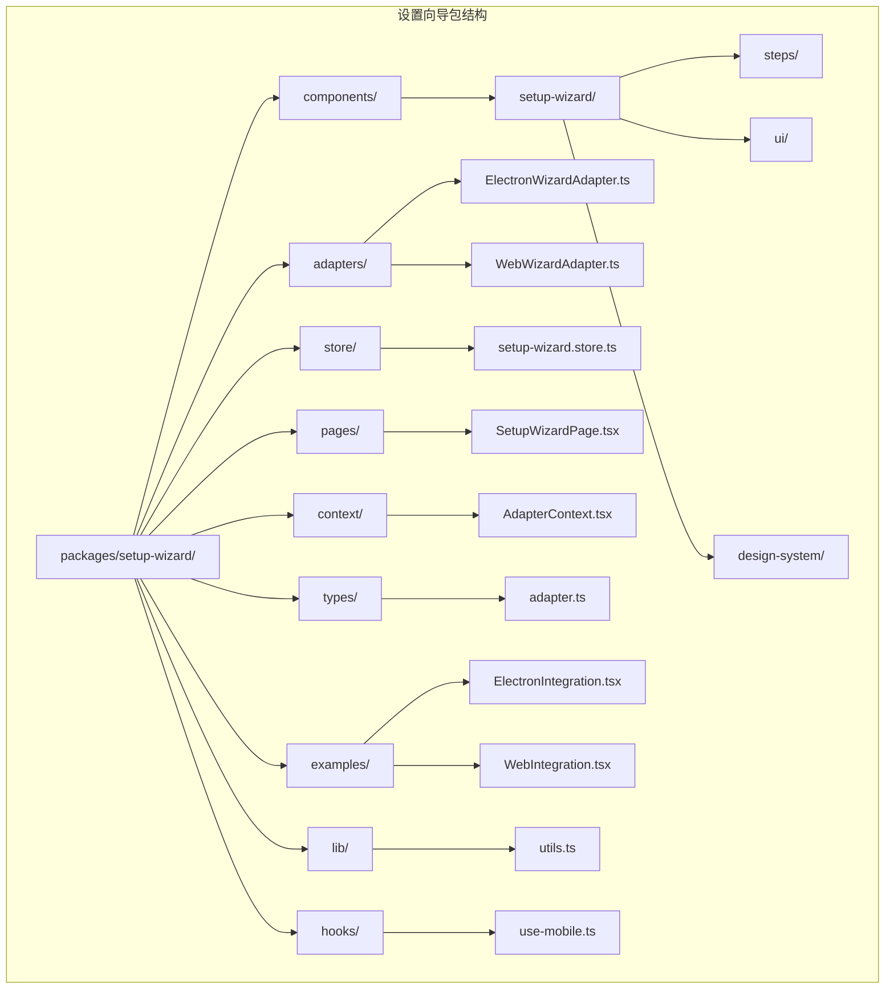
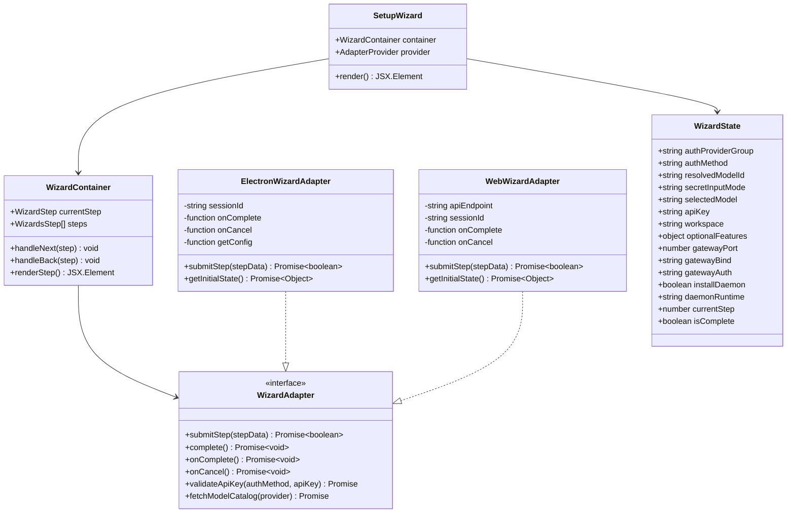
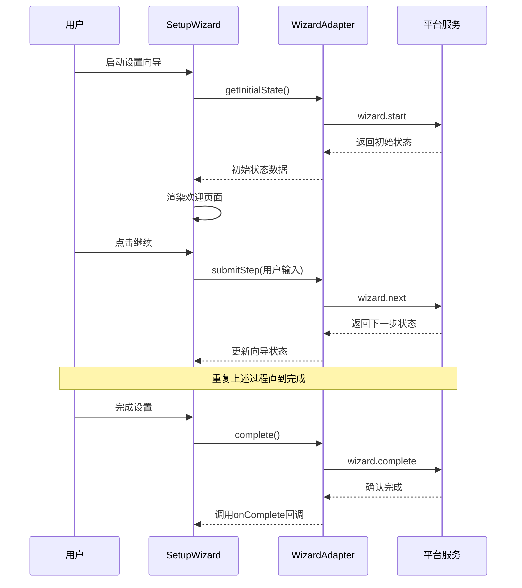
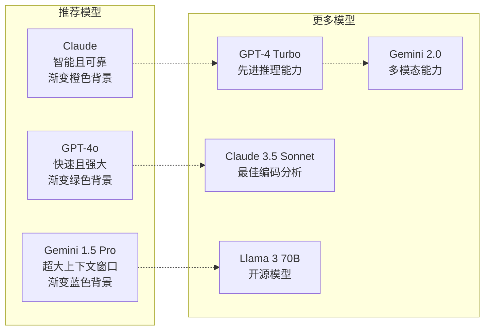
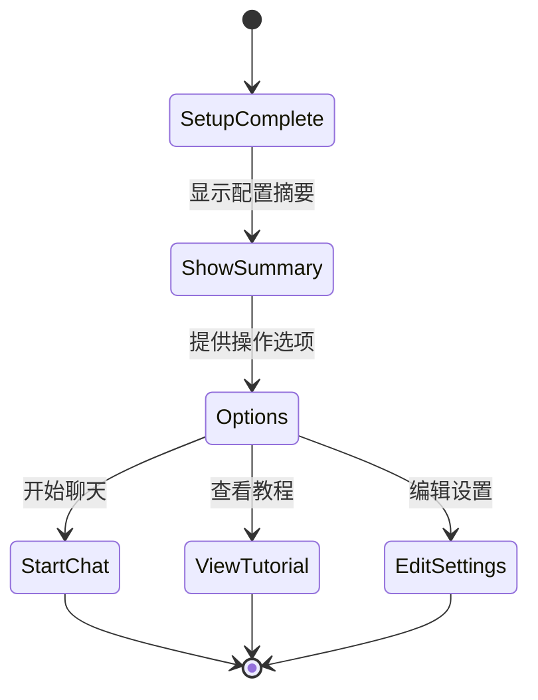
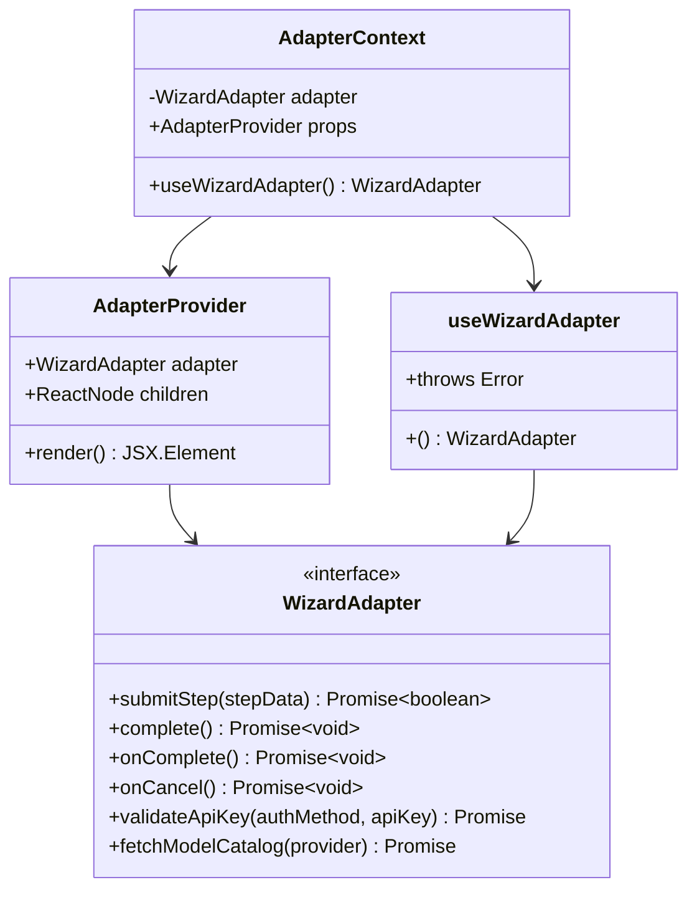
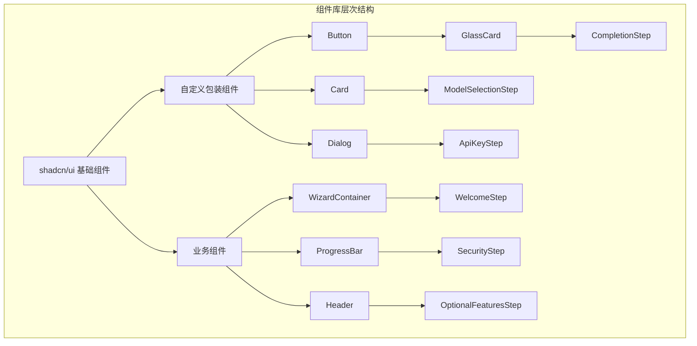
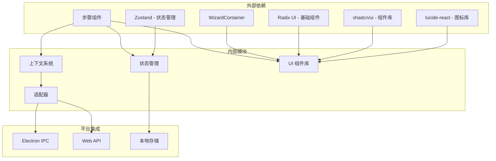
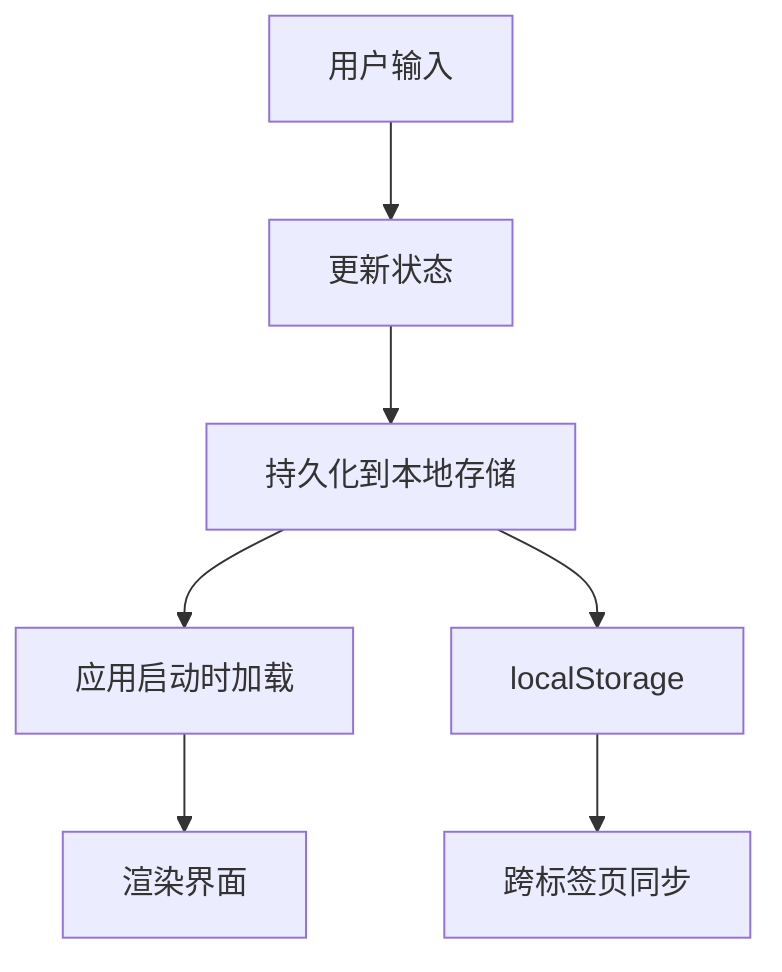
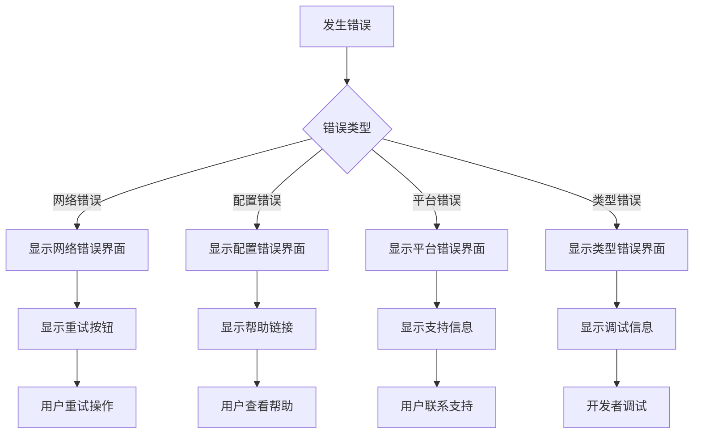

# 设置向导设计文档

<cite>
**本文档引用的文件**
- [DESIGN.md](file://packages/setup-wizard/src/components/setup-wizard/DESIGN.md)
- [index.ts](file://packages/setup-wizard/src/index.ts)
- [setup-wizard.store.ts](file://packages/setup-wizard/src/store/setup-wizard.store.ts)
- [ElectronWizardAdapter.ts](file://packages/setup-wizard/src/adapters/ElectronWizardAdapter.ts)
- [WebWizardAdapter.ts](file://packages/setup-wizard/src/adapters/WebWizardAdapter.ts)
- [SetupWizardPage.tsx](file://packages/setup-wizard/src/pages/SetupWizardPage.tsx)
- [AdapterContext.tsx](file://packages/setup-wizard/src/context/AdapterContext.tsx)
- [WizardContainer.tsx](file://packages/setup-wizard/src/components/setup-wizard/WizardContainer.tsx)
- [WelcomeStep.tsx](file://packages/setup-wizard/src/components/setup-wizard/steps/WelcomeStep.tsx)
- [SecurityStep.tsx](file://packages/setup-wizard/src/components/setup-wizard/steps/SecurityStep.tsx)
- [ModelSelectionStep.tsx](file://packages/setup-wizard/src/components/setup-wizard/steps/ModelSelectionStep.tsx)
- [ApiKeyStep.tsx](file://packages/setup-wizard/src/components/setup-wizard/steps/ApiKeyStep.tsx)
- [OptionalFeaturesStep.tsx](file://packages/setup-wizard/src/components/setup-wizard/steps/OptionalFeaturesStep.tsx)
- [CompletionStep.tsx](file://packages/setup-wizard/src/components/setup-wizard/steps/CompletionStep.tsx)
- [adapter.ts](file://packages/setup-wizard/src/types/adapter.ts)
- [button.tsx](file://packages/setup-wizard/src/components/ui/button.tsx)
- [card.tsx](file://packages/setup-wizard/src/components/ui/card.tsx)
- [GlassCard.tsx](file://packages/setup-wizard/src/components/setup-wizard/GlassCard.tsx)
- [Header.tsx](file://packages/setup-wizard/src/components/setup-wizard/Header.tsx)
- [ProgressBar.tsx](file://packages/setup-wizard/src/components/setup-wizard/ProgressBar.tsx)
</cite>

## 更新摘要
**所做更改**
- 更新了组件结构分析，反映新的设计系统架构
- 添加了新的 UI 组件系统说明，包括 shadcn/ui 集成
- 更新了状态管理架构，反映新的 WizardState 接口
- 增强了设计系统文档，包括样式指南和组件规范
- 更新了适配器模式实现，反映新的平台集成方式

## 目录
1. [简介](#简介)
2. [项目结构](#项目结构)
3. [核心组件](#核心组件)
4. [架构概览](#架构概览)
5. [详细组件分析](#详细组件分析)
6. [设计系统](#设计系统)
7. [依赖关系分析](#依赖关系分析)
8. [性能考虑](#性能考虑)
9. [故障排除指南](#故障排除指南)
10. [结论](#结论)

## 简介

OpenClaw 设置向导是一个现代化的多平台配置工具，采用全新的设计系统架构，旨在为用户提供直观、安全且高效的初始配置体验。该系统基于 React + TypeScript + shadcn/ui 构建，通过适配器模式设计支持 Electron 和 Web 两种运行环境，通过 6 个精心设计的步骤引导用户完成 AI 助手的完整配置。

设置向导的核心目标是简化复杂的配置过程，同时确保用户能够充分理解每个配置选项的重要性和影响。系统提供了完整的错误处理机制、状态持久化功能，以及灵活的扩展性设计。新的架构采用了更严格的类型安全和组件化设计，提升了代码的可维护性和用户体验的一致性。

## 项目结构

设置向导项目采用模块化的组织结构，主要分为以下几个核心部分：

**图表来源**
- [index.ts:1-31](file://packages/setup-wizard/src/index.ts#L1-L31)
- [DESIGN.md:33-50](file://packages/setup-wizard/src/components/setup-wizard/DESIGN.md#L33-L50)

**章节来源**
- [DESIGN.md:33-50](file://packages/setup-wizard/src/components/setup-wizard/DESIGN.md#L33-L50)
- [index.ts:1-31](file://packages/setup-wizard/src/index.ts#L1-L31)

## 核心组件

设置向导系统由多个精心设计的核心组件构成，每个组件都有明确的职责和作用。新的架构采用了更严格的组件分层和职责分离：

### 主要组件架构

**图表来源**
- [WizardContainer.tsx:1-114](file://packages/setup-wizard/src/components/setup-wizard/WizardContainer.tsx#L1-L114)
- [ElectronWizardAdapter.ts:1-82](file://packages/setup-wizard/src/adapters/ElectronWizardAdapter.ts#L1-L82)
- [WebWizardAdapter.ts:1-76](file://packages/setup-wizard/src/adapters/WebWizardAdapter.ts#L1-L76)
- [setup-wizard.store.ts:4-63](file://packages/setup-wizard/src/store/setup-wizard.store.ts#L4-L63)

### 状态管理系统

设置向导采用 Zustand 状态管理库，提供响应式的状态更新和持久化存储。新的状态管理架构更加严格和类型安全：

| 状态类别 | 属性名称 | 类型 | 默认值 | 描述 |
|---------|----------|------|--------|------|
| 认证设置 | authProviderGroup | string | "anthropic" | 选择的提供商组 |
| 认证设置 | authMethod | string | "apiKey" | 具体的认证方法 |
| 认证设置 | resolvedModelId | string | "anthropic/claude-opus-4-5" | 解析后的模型ID |
| 认证设置 | secretInputMode | "plaintext" \| "ref" | "plaintext" | API密钥存储模式 |
| 基础设置 | selectedModel | string | "claude" | 兼容性保留字段 |
| 基础设置 | apiKey | string | "" | API密钥 |
| 基础设置 | workspace | string | "~/.openclaw/workspace" | 工作空间路径 |
| 可选功能 | optionalFeatures.messaging | boolean | false | 消息功能开关 |
| 可选功能 | optionalFeatures.browser | boolean | true | 浏览器功能开关 |
| 可选功能 | optionalFeatures.fileAccess | boolean | false | 文件访问功能开关 |
| 网关设置 | gatewayPort | number | 18789 | 网关端口号 |
| 网关设置 | gatewayBind | "loopback" \| "lan" \| "custom" | "loopback" | 绑定地址类型 |
| 网关设置 | gatewayAuth | "token" \| "password" | "token" | 认证方式 |
| 守护进程 | installDaemon | boolean | true | 是否安装守护进程 |
| 守护进程 | daemonRuntime | "node" \| "bun" | "node" | 守护进程运行时 |
| UI状态 | currentStep | number | 0 | 当前步骤 |
| UI状态 | isComplete | boolean | false | 是否完成 |

**章节来源**
- [setup-wizard.store.ts:4-93](file://packages/setup-wizard/src/store/setup-wizard.store.ts#L4-L93)

## 架构概览

设置向导系统采用分层架构设计，通过适配器模式实现平台无关性。新的架构更加注重类型安全和错误处理：

**图表来源**
- [ElectronWizardAdapter.ts:59-80](file://packages/setup-wizard/src/adapters/ElectronWizardAdapter.ts#L59-L80)
- [WebWizardAdapter.ts:54-74](file://packages/setup-wizard/src/adapters/WebWizardAdapter.ts#L54-L74)

### 适配器模式优势

设置向导系统采用适配器模式的主要优势包括：

1. **平台无关性** - 同一套 UI 代码支持多种运行环境
2. **类型安全** - 严格的接口定义确保平台集成的正确性
3. **易于测试** - 可以轻松创建模拟适配器进行单元测试
4. **扩展性强** - 新增平台只需实现 WizardAdapter 接口
5. **关注点分离** - UI 逻辑与平台通信细节完全分离
6. **错误处理** - 统一的错误处理机制和回退策略

**章节来源**
- [DESIGN.md:271-289](file://packages/setup-wizard/src/components/setup-wizard/DESIGN.md#L271-L289)

## 详细组件分析

### 步骤组件系统

设置向导包含 6 个精心设计的步骤组件，每个组件都有特定的功能和用户体验目标。新的架构采用了更一致的设计语言和交互模式：

#### 欢迎步骤 (WelcomeStep)

欢迎步骤是用户旅程的起点，负责建立期望和介绍配置流程。新的设计采用了更现代的玻璃效果卡片和渐变背景：

**图表来源**
- [WelcomeStep.tsx:27-86](file://packages/setup-wizard/src/components/setup-wizard/steps/WelcomeStep.tsx#L27-L86)

#### 安全确认步骤 (SecurityStep)

安全确认步骤强调系统的安全性，要求用户确认理解安全风险。新的设计采用了更清晰的安全检查清单和视觉反馈：

| 安全要点 | 描述 | 视觉设计 |
|---------|------|----------|
| 受信任设备运行 | 确保环境安全 | 🛡️盾牌图标 + 红色警告 |
| API 密钥保密 | 保护敏感凭证 | 🔑钥匙图标 + 加密提示 |
| 日志监控 | 跟踪活动 | 📋日志图标 + 定期检查建议 |

**章节来源**
- [SecurityStep.tsx:1-96](file://packages/setup-wizard/src/components/setup-wizard/steps/SecurityStep.tsx#L1-L96)

#### 模型选择步骤 (ModelSelectionStep)

模型选择步骤提供多种 AI 模型供用户选择，支持推荐系统和高级筛选。新的架构采用了卡片式设计和渐变背景：

**图表来源**
- [ModelSelectionStep.tsx:17-118](file://packages/setup-wizard/src/components/setup-wizard/steps/ModelSelectionStep.tsx#L17-L118)

#### API 密钥步骤 (ApiKeyStep)

API 密钥步骤提供清晰的指导和连接测试功能。新的设计采用了分步引导和实时验证：

| 步骤 | 操作 | 目标 | 视觉反馈 |
|------|------|------|----------|
| 1 | 打开提供商网站 | 获取 API 密钥 | 🌐外部链接图标 |
| 2 | 输入密钥 | 配置认证凭据 | 🔑密码输入框 |
| 3 | 测试连接 | 验证配置正确性 | ✅连接测试按钮 |

**章节来源**
- [ApiKeyStep.tsx:1-191](file://packages/setup-wizard/src/components/setup-wizard/steps/ApiKeyStep.tsx#L1-L191)

#### 可选功能步骤 (OptionalFeaturesStep)

可选功能步骤允许用户自定义功能组合。新的设计采用了更直观的开关控件和功能描述：

| 功能 | 图标 | 描述 | 默认状态 | 视觉设计 |
|------|------|------|----------|----------|
| Messaging | 💬 | 内置聊天功能 | ✅ 启用 | 🟢绿色开关 |
| Browser | 🌐 | 浏览网页能力 | ❌ 禁用 | 🔴红色开关 |
| File Access | 📁 | 文件管理和存储 | ✅ 启用 | 🟢绿色开关 |

**章节来源**
- [OptionalFeaturesStep.tsx:1-108](file://packages/setup-wizard/src/components/setup-wizard/steps/OptionalFeaturesStep.tsx#L1-L108)

#### 完成步骤 (CompletionStep)

完成步骤提供最终确认和后续操作指引。新的设计采用了更丰富的视觉反馈和操作选项：

**图表来源**
- [CompletionStep.tsx:17-147](file://packages/setup-wizard/src/components/setup-wizard/steps/CompletionStep.tsx#L17-L147)

**章节来源**
- [CompletionStep.tsx:1-171](file://packages/setup-wizard/src/components/setup-wizard/steps/CompletionStep.tsx#L1-L171)

### 上下文和适配器系统

设置向导使用 React Context 和适配器模式实现组件间的通信。新的架构增强了类型安全和错误处理：

**图表来源**
- [AdapterContext.tsx:1-35](file://packages/setup-wizard/src/context/AdapterContext.tsx#L1-L35)

**章节来源**
- [AdapterContext.tsx:1-35](file://packages/setup-wizard/src/context/AdapterContext.tsx#L1-L35)

## 设计系统

设置向导采用了全新的设计系统，基于 shadcn/ui 和 Tailwind CSS 构建，提供了一致的视觉语言和交互体验。

### 设计原则

新的设计系统遵循以下核心原则：

#### 1. 简化 (Simplification)
- 一次只问一个问题
- 避免信息过载
- 清晰的视觉层级

#### 2. 引导 (Guidance)
- 智能默认值
- 内联帮助文本
- 实时验证反馈

#### 3. 可控 (Control)
- 随时返回修改
- 进度可视化
- 清晰的行动按钮

#### 4. 包容 (Inclusive)
- 支持深色/浅色主题
- 键盘导航支持
- 屏幕阅读器友好

### 组件库架构

设置向导使用 shadcn/ui 作为基础组件库，结合自定义组件构建完整的 UI 系统：

**图表来源**
- [button.tsx:1-65](file://packages/setup-wizard/src/components/ui/button.tsx#L1-L65)
- [card.tsx:1-75](file://packages/setup-wizard/src/components/ui/card.tsx#L1-L75)

### 样式指南

#### 颜色系统

使用 Tailwind CSS 的 slate 和 blue 颜色系统：

- **主色**: `blue-600` (深蓝)
- **背景**: `slate-50` (浅色) / `slate-950` (深色)
- **边框**: `slate-200` (浅色) / `slate-800` (深色)
- **文本**: `slate-900` (浅色) / `white` (深色)
- **成功**: `green-600`
- **警告**: `amber-600`
- **错误**: `red-600`

#### 间距系统

- 容器内边距: `px-6 py-12`
- 卡片内边距: `p-4` 或 `p-6`
- 元素间距: `gap-3` 或 `gap-4`
- 部分间距: `space-y-3` 或 `space-y-6`

#### 圆角系统

- 按钮: `rounded-lg`
- 卡片: `rounded-lg`
- 输入框: `rounded-md`
- 进度条: `rounded-full`

#### 字体系统

- 标题: `font-bold` + `text-2xl` 或 `text-3xl`
- 副标题: `font-semibold` + `text-lg`
- 正文: `text-sm` 或 `text-base`
- 辅助文本: `text-xs` + `text-slate-500`

#### 动画系统

- 页面过渡: `animate-in fade-in duration-300`
- 进度条: `transition-all duration-500 ease-out`
- 按钮悬停: `hover:bg-blue-700 transition-colors`
- 成功动画: `animate-bounce`

### 响应式设计

所有组件都支持响应式设计：

- **移动设备** (< 640px): 单列布局，全宽按钮
- **平板** (640px - 1024px): 两列网格
- **桌面** (> 1024px): 三列网格，最大宽度 2xl

### 可访问性

#### 键盘导航

- Tab 键在按钮和输入框之间导航
- Enter 键激活按钮
- Space 键切换复选框

#### 屏幕阅读器

- 所有按钮都有清晰的标签
- 表单字段有关联的 label
- 使用语义化 HTML

#### 颜色对比

- 所有文本都满足 WCAG AA 标准
- 不仅依赖颜色传达信息

**章节来源**
- [DESIGN.md:185-269](file://packages/setup-wizard/src/components/setup-wizard/DESIGN.md#L185-L269)

## 依赖关系分析

设置向导系统的依赖关系清晰明确，遵循单一职责原则。新的架构采用了更严格的依赖管理：

**图表来源**
- [index.ts:1-31](file://packages/setup-wizard/src/index.ts#L1-L31)

### 核心依赖特性

| 依赖项 | 版本 | 用途 | 重要性 | 新特性 |
|-------|------|------|--------|--------|
| zustand | 最新 | 状态管理 | 核心 | 持久化中间件 |
| lucide-react | 最新 | 图标系统 | UI | 200+ 图标 |
| @radix-ui/react-dialog | 最新 | 对话框组件 | UI | 无障碍支持 |
| tailwindcss | 最新 | 样式框架 | 基础 | JIT 编译 |
| class-variance-authority | 最新 | 组件变体 | UI | 类名组合 |
| radix-ui | 最新 | 基础组件 | UI | 无障碍原生 |

**章节来源**
- [index.ts:1-31](file://packages/setup-wizard/src/index.ts#L1-L31)

## 性能考虑

设置向导系统在设计时充分考虑了性能优化。新的架构采用了更多的性能优化技术：

### 状态持久化策略

系统使用 Zustand 的持久化中间件，自动保存用户配置到本地存储：

**图表来源**
- [setup-wizard.store.ts:117-124](file://packages/setup-wizard/src/store/setup-wizard.store.ts#L117-L124)

### 组件渲染优化

- 使用 React.memo 优化频繁更新的组件
- 实现懒加载机制减少初始包大小
- 采用虚拟滚动处理大量列表数据
- 使用 CSS 动画替代 JavaScript 动画
- 实现组件级别的代码分割

### 类型安全优化

- 严格的 TypeScript 类型定义
- 自定义类型守卫函数
- 泛型约束确保类型安全
- 编译时错误检测

## 故障排除指南

### 常见问题及解决方案

| 问题类型 | 症状 | 解决方案 | 预防措施 |
|---------|------|----------|----------|
| 适配器初始化失败 | 界面卡在加载状态 | 检查平台集成是否正确 | 实现完整的适配器接口 |
| 状态丢失 | 重新加载后配置重置 | 验证 localStorage 权限 | 检查持久化配置 |
| API 连接失败 | 测试连接按钮无响应 | 检查网络连接和密钥有效性 | 实现 validateApiKey 方法 |
| 步骤导航异常 | 无法前进或后退 | 确认 WizardContainer 状态管理 | 检查步骤索引计算 |
| 组件渲染错误 | UI 显示异常 | 检查 props 类型和默认值 | 实现类型守卫函数 |

### 错误处理机制

设置向导实现了多层次的错误处理：

**章节来源**
- [SetupWizardPage.tsx:87-119](file://packages/setup-wizard/src/pages/SetupWizardPage.tsx#L87-L119)

## 结论

OpenClaw 设置向导系统展现了现代前端架构的最佳实践，通过精心设计的组件结构、灵活的适配器模式和完善的错误处理机制，为用户提供了卓越的配置体验。

系统的主要优势包括：

1. **高度模块化** - 清晰的组件分离和职责划分
2. **平台无关性** - 通过适配器模式支持多种运行环境
3. **类型安全** - 严格的 TypeScript 类型定义确保代码质量
4. **用户体验优秀** - 直观的步骤引导和即时反馈
5. **可扩展性强** - 易于添加新步骤和新平台支持
6. **设计系统完善** - 基于 shadcn/ui 的一致视觉语言
7. **性能优化** - 多层次的性能优化技术和最佳实践

新的架构为类似的应用程序设置向导提供了优秀的参考模板，展示了如何在保持代码质量的同时实现功能的复杂性和用户体验的简洁性。通过采用更严格的类型安全、更好的组件化设计和完善的错误处理机制，系统为未来的功能扩展和维护奠定了坚实的基础。