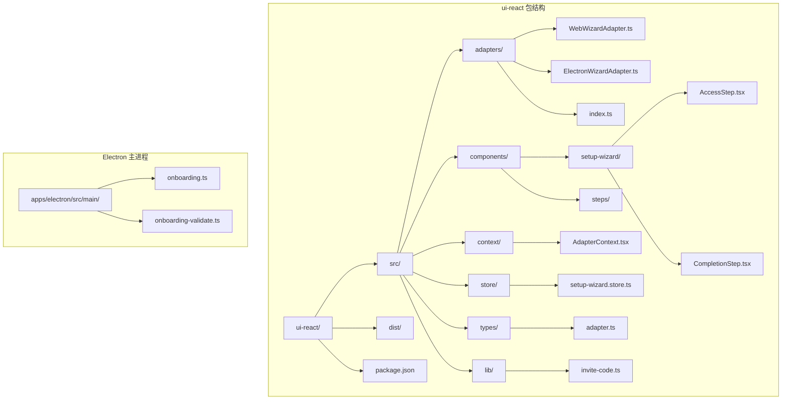
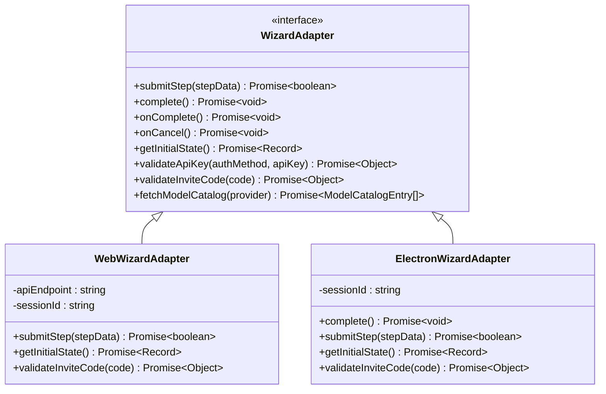
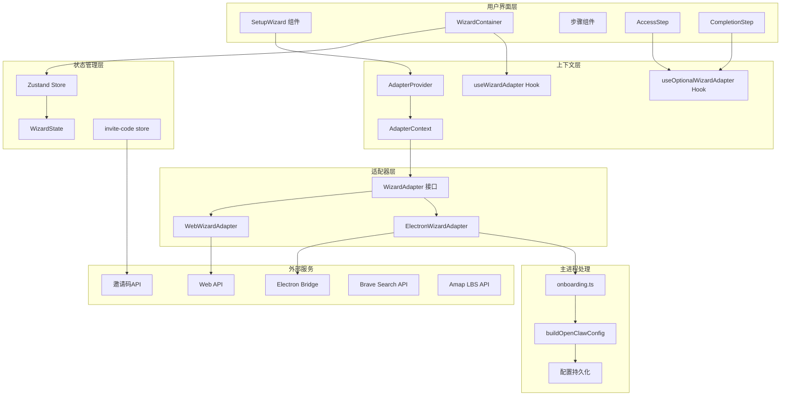
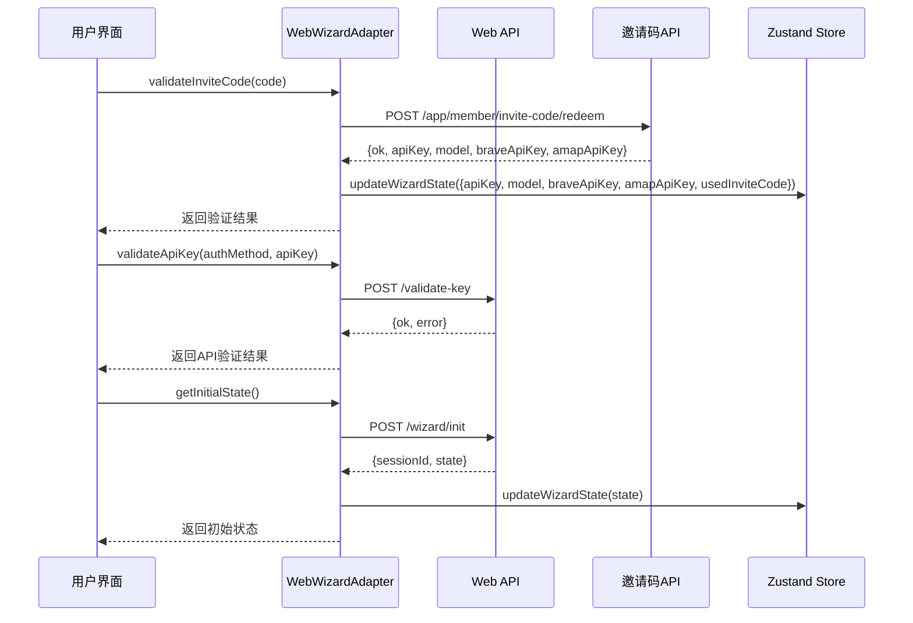
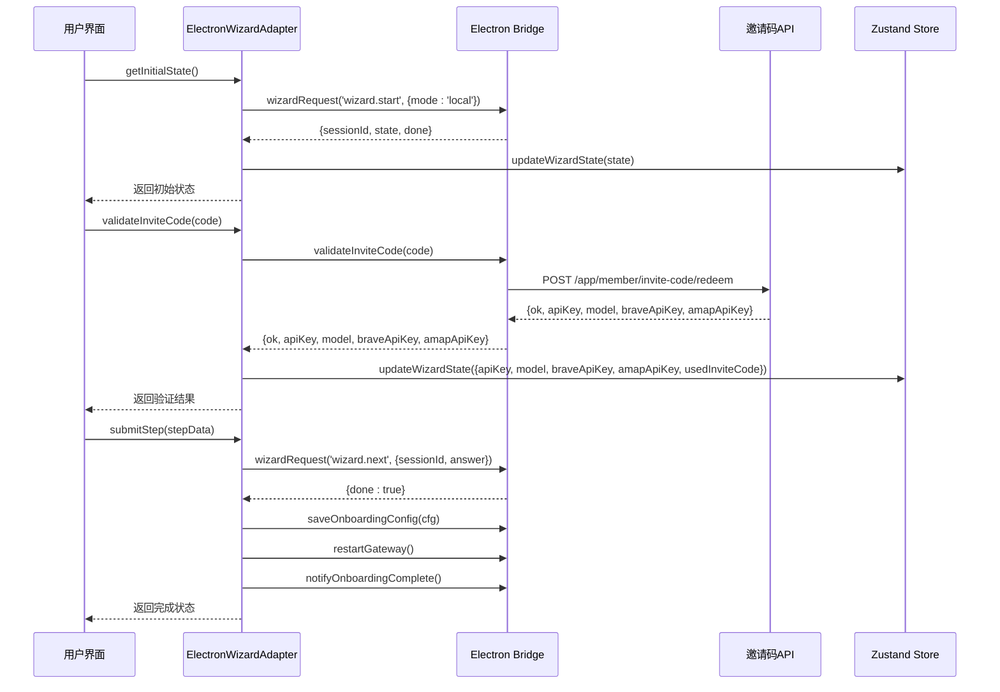
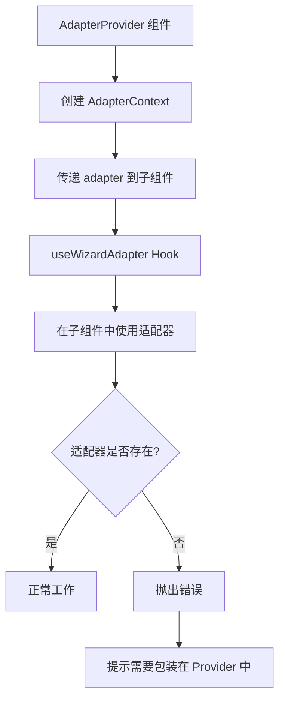
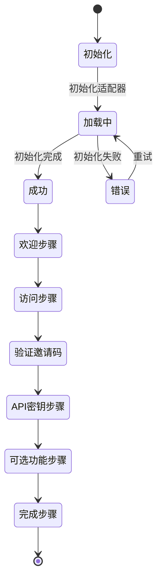
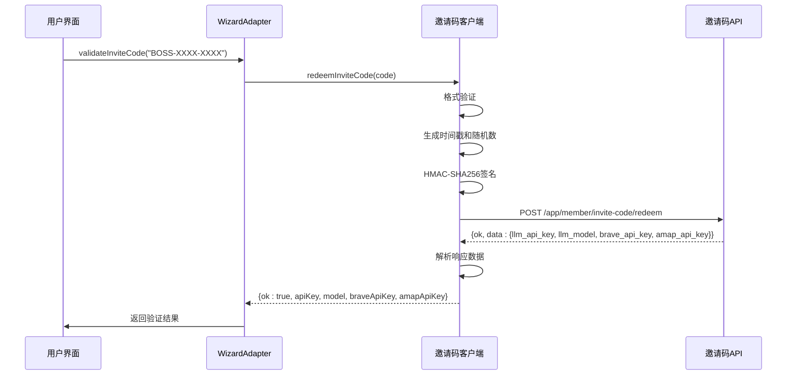
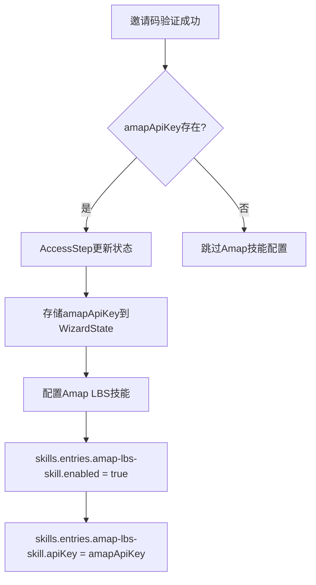
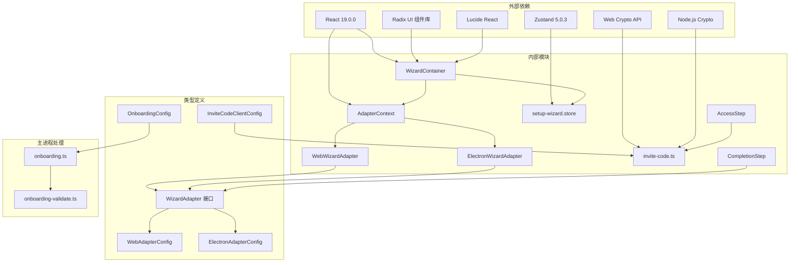

# 设置向导适配器

<cite>
**本文档引用的文件**
- [ui-react/src/types/adapter.ts](file://ui-react/src/types/adapter.ts)
- [ui-react/src/adapters/WebWizardAdapter.ts](file://ui-react/src/adapters/WebWizardAdapter.ts)
- [ui-react/src/adapters/ElectronWizardAdapter.ts](file://ui-react/src/adapters/ElectronWizardAdapter.ts)
- [ui-react/src/context/AdapterContext.tsx](file://ui-react/src/context/AdapterContext.tsx)
- [ui-react/src/components/setup-wizard/index.tsx](file://ui-react/src/components/setup-wizard/index.tsx)
- [ui-react/src/components/setup-wizard/WizardContainer.tsx](file://ui-react/src/components/setup-wizard/WizardContainer.tsx)
- [ui-react/src/store/setup-wizard.store.ts](file://ui-react/src/store/setup-wizard.store.ts)
- [ui-react/src/adapters/index.ts](file://ui-react/src/adapters/index.ts)
- [ui-react/package.json](file://ui-react/package.json)
- [docs/start/wizard.md](file://docs/start/wizard.md)
- [docs/reference/wizard.md](file://docs/reference/wizard.md)
- [ui-react/src/lib/invite-code.ts](file://ui-react/src/lib/invite-code.ts)
- [ui-react/src/components/setup-wizard/steps/AccessStep.tsx](file://ui-react/src/components/setup-wizard/steps/AccessStep.tsx)
- [ui-react/src/components/setup-wizard/steps/CompletionStep.tsx](file://ui-react/src/components/setup-wizard/steps/CompletionStep.tsx)
- [apps/electron/src/main/onboarding.ts](file://apps/electron/src/main/onboarding.ts)
- [apps/electron/src/main/onboarding-validate.ts](file://apps/electron/src/main/onboarding-validate.ts)
</cite>

## 更新摘要
**所做更改**
- 新增邀请码验证功能，支持 BOSS-XXXX-XXXX 格式的邀请码验证
- 增强API密钥验证基础设施，提供完整的验证流程
- 更新适配器接口以支持新的邀请码系统
- 新增 `usedInviteCode` 状态字段用于跟踪邀请码使用情况
- 完善邀请码格式验证和HMAC-SHA256签名机制
- 增强Web和Electron平台的邀请码验证实现
- **新增** ElectronWizardAdapter支持返回Brave Search和Amap API密钥
- **新增** AccessStep处理和存储Brave Search和Amap API密钥
- **新增** OnboardingConfig接口包含braveApiKey和amapApiKey字段
- **新增** 自动配置Brave Search工具和Amap技能的逻辑

## 目录
1. [简介](#简介)
2. [项目结构](#项目结构)
3. [核心组件](#核心组件)
4. [架构概览](#架构概览)
5. [详细组件分析](#详细组件分析)
6. [邀请码系统](#邀请码系统)
7. [API密钥处理增强](#api密钥处理增强)
8. [依赖关系分析](#依赖关系分析)
9. [性能考虑](#性能考虑)
10. [故障排除指南](#故障排除指南)
11. [结论](#结论)

## 简介

设置向导适配器是 OpenClaw 项目中的一个关键组件，它提供了一个统一的接口来适配不同的平台环境（Web 和 Electron），使得设置向导能够在多种运行环境中无缝工作。该适配器模式的设计允许开发者轻松地为新的平台添加支持，同时保持核心功能的一致性。

**重要更新** 适配器系统已从 `packages/setup-wizard` 包迁移到 `ui-react` 包中，位于 `ui-react/src/adapters/` 和 `ui-react/src/context/` 目录下，实现了更好的模块化和组织结构。

**最新更新** 新增了完整的邀请码验证系统，支持通过邀请码自动获取API密钥和预配置模型，大大简化了用户的初始配置过程。该系统包含严格的格式验证、HMAC-SHA256签名机制和完整的错误处理。

**新增功能** 适配器现在支持在邀请码验证过程中返回和处理Brave Search和Amap API密钥，这些密钥会在向导完成后自动配置到系统中，为用户提供即开即用的搜索和地理位置服务功能。

适配器系统的核心价值在于其抽象能力，它将平台特定的实现细节封装起来，为上层组件提供一致的 API 接口。这种设计不仅提高了代码的可维护性，还增强了系统的可扩展性。

## 项目结构

设置向导适配器已迁移到 `ui-react` 包中，采用更加清晰的模块化组织方式：



**图表来源**
- [ui-react/src/types/adapter.ts:1-131](file://ui-react/src/types/adapter.ts#L1-L131)
- [ui-react/src/adapters/WebWizardAdapter.ts:1-106](file://ui-react/src/adapters/WebWizardAdapter.ts#L1-L106)
- [ui-react/src/adapters/ElectronWizardAdapter.ts:1-229](file://ui-react/src/adapters/ElectronWizardAdapter.ts#L1-L229)
- [ui-react/src/lib/invite-code.ts:1-221](file://ui-react/src/lib/invite-code.ts#L1-L221)
- [apps/electron/src/main/onboarding.ts:1-552](file://apps/electron/src/main/onboarding.ts#L1-L552)

**章节来源**
- [ui-react/package.json:1-61](file://ui-react/package.json#L1-L61)

## 核心组件

设置向导适配器系统由以下几个核心组件构成：

### 适配器接口定义

适配器接口定义了所有平台适配器必须实现的标准方法，新增了 API 密钥验证和模型目录获取功能，以及邀请码验证的新API密钥字段：



**图表来源**
- [ui-react/src/types/adapter.ts:15-108](file://ui-react/src/types/adapter.ts#L15-L108)
- [ui-react/src/adapters/WebWizardAdapter.ts:8-26](file://ui-react/src/adapters/WebWizardAdapter.ts#L8-L26)
- [ui-react/src/adapters/ElectronWizardAdapter.ts:27-38](file://ui-react/src/adapters/ElectronWizardAdapter.ts#L27-L38)

### 状态管理

使用 Zustand 进行状态管理，提供响应式的状态更新机制，新增了Brave Search和Amap API密钥的状态字段：

| 状态字段 | 类型 | 默认值 | 描述 |
|---------|------|--------|------|
| authProviderGroup | string | "anthropic" | 认证提供商组 |
| authMethod | string | "apiKey" | 具体认证方法 |
| resolvedModelId | string | "anthropic/claude-opus-4-5" | 解析后的模型ID |
| secretInputMode | enum | "plaintext" | API密钥存储模式 |
| apiKey | string | "" | API密钥 |
| usedInviteCode | boolean | undefined | 是否使用邀请码 |
| braveApiKey | string | undefined | Brave Search API密钥 |
| amapApiKey | string | undefined | Amap LBS API密钥 |
| workspace | string | "~/.openclaw/workspace" | 工作空间路径 |
| optionalFeatures.messaging | boolean | false | 消息功能开关 |
| optionalFeatures.browser | boolean | true | 浏览器功能开关 |
| optionalFeatures.fileAccess | boolean | false | 文件访问功能开关 |
| gatewayPort | number | 18789 | 网关端口号 |
| gatewayBind | enum | "loopback" | 网关绑定地址类型 |
| gatewayAuth | enum | "token" | 网关认证方式 |
| installDaemon | boolean | true | 是否安装守护进程 |
| daemonRuntime | enum | "node" | 守护进程运行时类型 |
| currentStep | number | 0 | 当前步骤索引 |
| isComplete | boolean | false | 是否完成 |

**章节来源**
- [ui-react/src/store/setup-wizard.store.ts:4-152](file://ui-react/src/store/setup-wizard.store.ts#L4-L152)

## 架构概览

设置向导适配器采用了清晰的分层架构设计，现已完全迁移到 ui-react 包中，并集成了新的API密钥处理功能：



**图表来源**
- [ui-react/src/components/setup-wizard/index.tsx:11-28](file://ui-react/src/components/setup-wizard/index.tsx#L11-L28)
- [ui-react/src/context/AdapterContext.tsx:19-36](file://ui-react/src/context/AdapterContext.tsx#L19-L36)
- [ui-react/src/adapters/WebWizardAdapter.ts:8-26](file://ui-react/src/adapters/WebWizardAdapter.ts#L8-L26)
- [ui-react/src/adapters/ElectronWizardAdapter.ts:27-38](file://ui-react/src/adapters/ElectronWizardAdapter.ts#L27-L38)
- [apps/electron/src/main/onboarding.ts:195-429](file://apps/electron/src/main/onboarding.ts#L195-L429)

## 详细组件分析

### Web 平台适配器

WebWizardAdapter 负责处理 Web 环境中的设置向导通信：



**图表来源**
- [ui-react/src/adapters/WebWizardAdapter.ts:28-105](file://ui-react/src/adapters/WebWizardAdapter.ts#L28-L105)

Web 平台适配器的关键特性：
- 使用标准的 fetch API 进行 HTTP 通信
- 自动处理会话 ID 的存储和传递
- 支持异步完成回调
- 错误处理和重试机制
- **新增** 邀请码验证功能，支持通过邀请码自动获取API密钥和模型配置
- **新增** 完整的API密钥验证基础设施
- **新增** 支持Brave Search和Amap API密钥的返回和处理

**更新** 新增对 WebWizardAdapter 的完整实现分析，包括邀请码验证和API密钥验证功能。

### Electron 平台适配器

ElectronWizardAdapter 处理桌面应用程序中的设置向导，包含完整的配置持久化和网关重启机制：



**图表来源**
- [ui-react/src/adapters/ElectronWizardAdapter.ts:132-147](file://ui-react/src/adapters/ElectronWizardAdapter.ts#L132-L147)

Electron 平台适配器的特殊处理：
- 通过 window.electronBridge 进行 IPC 通信
- 自动重启网关服务
- 通知主进程向导完成状态
- 延迟执行完成回调以确保 UI 更新
- 完整的日志记录和调试支持
- **新增** 邀请码验证功能，支持通过邀请码自动获取API密钥和模型配置
- **新增** 支持Brave Search和Amap API密钥的返回和处理

**更新** 新增对 ElectronWizardAdapter 的完整实现分析，包括邀请码验证功能和配置持久化机制。

### 上下文提供者模式

适配器上下文系统实现了 React 的 Provider 模式：



**图表来源**
- [ui-react/src/context/AdapterContext.tsx:19-28](file://ui-react/src/context/AdapterContext.tsx#L19-L28)

**章节来源**
- [ui-react/src/context/AdapterContext.tsx:1-37](file://ui-react/src/context/AdapterContext.tsx#L1-L37)

### 步骤容器组件

WizardContainer 负责管理整个设置向导的生命周期：



**图表来源**
- [ui-react/src/components/setup-wizard/WizardContainer.tsx:24-73](file://ui-react/src/components/setup-wizard/WizardContainer.tsx#L24-L73)

**章节来源**
- [ui-react/src/components/setup-wizard/WizardContainer.tsx:1-121](file://ui-react/src/components/setup-wizard/WizardContainer.tsx#L1-L121)

## 邀请码系统

**新增** 邀请码系统是本次更新的核心功能，提供了完整的邀请码验证和API密钥获取机制。

### 邀请码格式规范

邀请码采用严格的 BOSS-XXXX-XXXX 格式：
- 必须以 "BOSS-" 开头
- 第二个部分：4个字母数字字符
- 第三个部分：4个字母数字字符
- 示例：`BOSS-ABCD-EFGH`

### 邀请码验证流程



**图表来源**
- [ui-react/src/lib/invite-code.ts:100-220](file://ui-react/src/lib/invite-code.ts#L100-L220)

### HMAC-SHA256 签名机制

邀请码系统使用HMAC-SHA256进行安全签名：

1. **签名负载**：`app_id={appId}&timestamp={timestamp}&nonce={nonce}&code={code}`
2. **签名算法**：HMAC-SHA256
3. **随机数生成**：使用 `crypto.getRandomValues()` 生成12字节随机数
4. **时间戳**：使用当前Unix时间戳（秒）
5. **请求头**：
   - `X-App-Id`: 应用ID
   - `X-Timestamp`: 时间戳
   - `X-Nonce`: 随机数
   - `X-Signature`: 签名值

### 邀请码配置管理

系统支持多环境配置：

| 环境 | 基础URL | 应用ID | 应用密钥 |
|------|---------|--------|----------|
| 开发环境 | http://localhost:8080 | boss-simulator | boss-simulator-dev-secret-change-in-prod |
| 生产环境 | https://verse-ai-service-production-22b8.up.railway.app/api/v1 | boss-simulator | 生产密钥（需替换） |

### 错误处理机制

邀请码验证包含完整的错误处理：

- **格式错误**：`Invalid invite code format. Expected: BOSS-XXXX-XXXX`
- **网络超时**：`Connection timed out. Check your network.`
- **验证码不存在或已使用**：`Invite code not found or already used.`
- **请求过于频繁**：`Too many attempts. Please try again later.`
- **其他HTTP错误**：`Validation failed (HTTP {status}).`

**章节来源**
- [ui-react/src/lib/invite-code.ts:1-221](file://ui-react/src/lib/invite-code.ts#L1-L221)
- [ui-react/src/components/setup-wizard/steps/AccessStep.tsx:22-79](file://ui-react/src/components/setup-wizard/steps/AccessStep.tsx#L22-L79)

## API密钥处理增强

**新增功能** 适配器现在支持在邀请码验证过程中返回和处理Brave Search和Amap API密钥，这些密钥会在向导完成后自动配置到系统中。

### Brave Search API密钥处理

当邀请码验证成功时，如果返回了 `braveApiKey` 字段，系统会自动配置Brave Search工具：

```mermaid
flowchart TD
A[邀请码验证成功] --> B{braveApiKey存在?}
B --> |是| C[AccessStep更新状态]
C --> D[存储braveApiKey到WizardState]
D --> E[配置Brave Search工具]
E --> F[tools.web.search.enabled = true]
F --> G[tools.web.search.provider = "brave"]
G --> H[tools.web.search.apiKey = braveApiKey]
B --> |否| I[跳过Brave Search配置]
```

**图表来源**
- [ui-react/src/components/setup-wizard/steps/AccessStep.tsx:41-71](file://ui-react/src/components/setup-wizard/steps/AccessStep.tsx#L41-L71)
- [apps/electron/src/main/onboarding.ts:352-367](file://apps/electron/src/main/onboarding.ts#L352-L367)

### Amap API密钥处理

当邀请码验证成功时，如果返回了 `amapApiKey` 字段，系统会自动配置Amap LBS技能：



**图表来源**
- [ui-react/src/components/setup-wizard/steps/AccessStep.tsx:41-71](file://ui-react/src/components/setup-wizard/steps/AccessStep.tsx#L41-L71)
- [apps/electron/src/main/onboarding.ts:373-383](file://apps/electron/src/main/onboarding.ts#L373-L383)

### 配置持久化机制

主进程在保存配置时会自动处理这些API密钥：

1. **Brave Search配置**：将 `cfg.braveApiKey` 写入 `tools.web.search.apiKey`
2. **Amap技能配置**：将 `cfg.amapApiKey` 写入 `skills.entries.amap-lbs-skill.apiKey`
3. **API密钥存储**：标准的API密钥存储机制继续工作

**章节来源**
- [apps/electron/src/main/onboarding.ts:38-73](file://apps/electron/src/main/onboarding.ts#L38-L73)
- [apps/electron/src/main/onboarding.ts:352-383](file://apps/electron/src/main/onboarding.ts#L352-L383)

## 依赖关系分析

设置向导适配器的依赖关系图：



**图表来源**
- [ui-react/package.json:21-56](file://ui-react/package.json#L21-L56)

主要依赖项说明：
- **React 19.0.0**: 核心 UI 框架
- **Radix UI**: 无障碍的 UI 组件库
- **Zustand**: 轻量级状态管理
- **Lucide React**: 图标库
- **Web Crypto API**: 浏览器端加密功能
- **Node.js Crypto**: Electron主进程加密功能

**章节来源**
- [ui-react/package.json:1-61](file://ui-react/package.json#L1-L61)

## 性能考虑

设置向导适配器在设计时充分考虑了性能优化：

### 内存管理
- 使用 Zustand 的持久化中间件减少不必要的重新渲染
- 适配器实例的生命周期管理
- 会话状态的智能缓存策略
- **新增** 邀请码验证结果的本地缓存机制
- **新增** Brave Search和Amap API密钥的本地存储优化

### 网络优化
- Web 适配器的请求去重机制
- Electron 适配器的批量操作支持
- 错误重试的指数退避策略
- **新增** 邀请码验证的超时控制（15秒）
- **新增** HMAC签名的异步生成机制
- **新增** API密钥验证的并发处理

### 渲染优化
- React.memo 的合理使用
- 条件渲染避免不必要的组件更新
- 异步加载和懒加载策略
- **新增** 邀请码验证的防抖机制
- **新增** API密钥处理的延迟更新

**更新** 新增对邀请码系统和API密钥处理性能优化的具体分析，包括缓存机制、超时控制和并发处理。

## 故障排除指南

### 常见问题及解决方案

| 问题类型 | 症状 | 解决方案 |
|---------|------|----------|
| 适配器未初始化 | 抛出 "useWizardAdapter must be used within AdapterProvider" 错误 | 确保 SetupWizard 包装在 AdapterProvider 中 |
| Web API 请求失败 | HTTP 4xx/5xx 错误 | 检查 API 端点配置和网络连接 |
| Electron Bridge 不存在 | window.electronBridge 未定义 | 确保主进程正确设置了桥接对象 |
| 状态同步问题 | UI 与实际状态不一致 | 检查 Zustand store 的更新逻辑 |
| 适配器方法缺失 | 调用 complete() 或 getInitialState() 失败 | 确保适配器实现完整的接口方法 |
| 配置持久化失败 | Electron 完成后配置未保存 | 检查 getConfig 回调是否正确实现 |
| 邀请码格式错误 | "Invalid invite code format" | 确保输入格式为 BOSS-XXXX-XXXX |
| 邀请码验证失败 | "Invite code not found or already used" | 检查邀请码有效性 |
| HMAC签名错误 | 网络请求被拒绝 | 检查应用ID、密钥和时间戳同步 |
| API密钥验证失败 | "Validation failed" | 检查API密钥格式和提供商支持 |
| Brave Search配置失败 | tools.web.search.apiKey未设置 | 检查邀请码响应中的braveApiKey字段 |
| Amap技能配置失败 | skills.entries.amap-lbs-skill.apiKey未设置 | 检查邀请码响应中的amapApiKey字段 |
| 配置合并冲突 | Brave Search或Amap配置被覆盖 | 检查现有配置和邀请码响应的优先级 |

### 调试技巧

1. **启用开发模式**: 使用 `process.env.NODE_ENV !== 'production'` 条件输出调试信息
2. **状态检查**: 通过浏览器开发者工具检查 Zustand store 的状态变化
3. **网络监控**: 使用浏览器网络面板监控 API 请求和响应
4. **日志记录**: 在关键节点添加详细的日志输出
5. **错误边界**: 实现适当的错误处理和降级策略
6. **邀请码调试**: 检查邀请码客户端配置和签名生成过程
7. **API密钥验证**: 验证API密钥格式和提供商兼容性
8. **API密钥处理调试**: 检查AccessStep中的API密钥状态更新
9. **配置持久化调试**: 监控主进程的配置构建和保存过程
10. **Brave Search配置调试**: 验证tools.web.search配置的正确性
11. **Amap技能配置调试**: 验证skills.entries.amap-lbs-skill配置的正确性

**更新** 扩展故障排除指南，新增邀请码系统、API密钥验证和新API密钥处理相关的故障排除技巧。

**章节来源**
- [ui-react/src/context/AdapterContext.tsx:20-26](file://ui-react/src/context/AdapterContext.tsx#L20-L26)
- [ui-react/src/adapters/WebWizardAdapter.ts:37-40](file://ui-react/src/adapters/WebWizardAdapter.ts#L37-L40)
- [ui-react/src/adapters/ElectronWizardAdapter.ts:128-133](file://ui-react/src/adapters/ElectronWizardAdapter.ts#L128-L133)

## 结论

设置向导适配器系统通过精心设计的架构和清晰的抽象层次，成功实现了跨平台的设置向导功能。该系统的主要优势包括：

### 设计优势
- **高度可扩展**: 适配器模式允许轻松添加新的平台支持
- **代码复用**: 核心逻辑在不同平台间共享
- **类型安全**: 完整的 TypeScript 类型定义
- **状态管理**: 响应式的状态更新机制
- **安全性**: 完整的邀请码验证和API密钥验证系统
- **智能化**: 自动化的API密钥处理和配置

### 实现特点
- **渐进式集成**: 支持本地模式和完整适配器模式
- **错误处理**: 完善的错误捕获和恢复机制
- **用户体验**: 流畅的用户交互和反馈
- **文档完善**: 详细的使用示例和集成指南
- **邀请码系统**: 自动化的API密钥和模型配置
- **安全验证**: HMAC-SHA256签名和严格格式验证
- **智能配置**: 自动化的Brave Search和Amap技能配置

**更新** 基于完整的代码分析，提供了更深入的架构理解和实现细节。新增的邀请码系统大大简化了用户的初始配置过程，通过严格的格式验证和安全的签名机制确保系统的安全性。特别是新增的Brave Search和Amap API密钥处理功能，为用户提供了即开即用的搜索和地理位置服务，进一步提升了用户体验。

该系统通过模块化的架构设计，为未来的平台扩展和功能增强奠定了坚实的基础。适配器接口的清晰定义和完整的实现示例，使得开发者能够快速理解和使用这个强大的组件系统。

**重要更新** 适配器系统已成功迁移到 ui-react 包中，实现了更好的模块化组织和维护性。新的实现包含了完整的 API 密钥验证、邀请码验证和模型目录获取功能，以及新增的Brave Search和Amap API密钥处理能力，为用户提供更丰富的配置选项和更安全的初始配置体验。

该系统通过精心设计的邀请码验证机制和智能的API密钥处理，为 OpenClaw 项目提供了一个强大而灵活的基础，使得设置向导能够在各种运行环境中保持一致的功能和用户体验，同时大大简化了用户的初始配置过程。新增的Brave Search和Amap技能配置功能，让用户能够立即开始使用高级搜索和地理位置服务，无需手动配置复杂的API密钥。