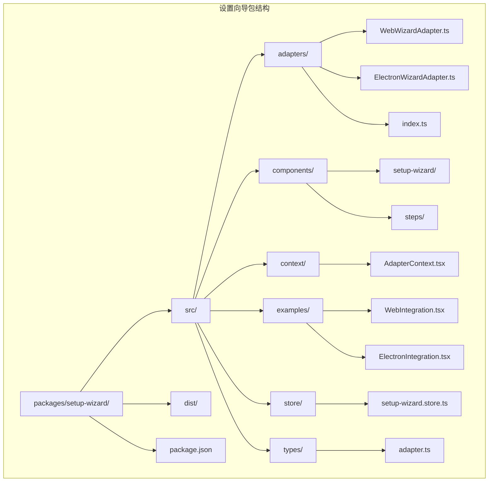
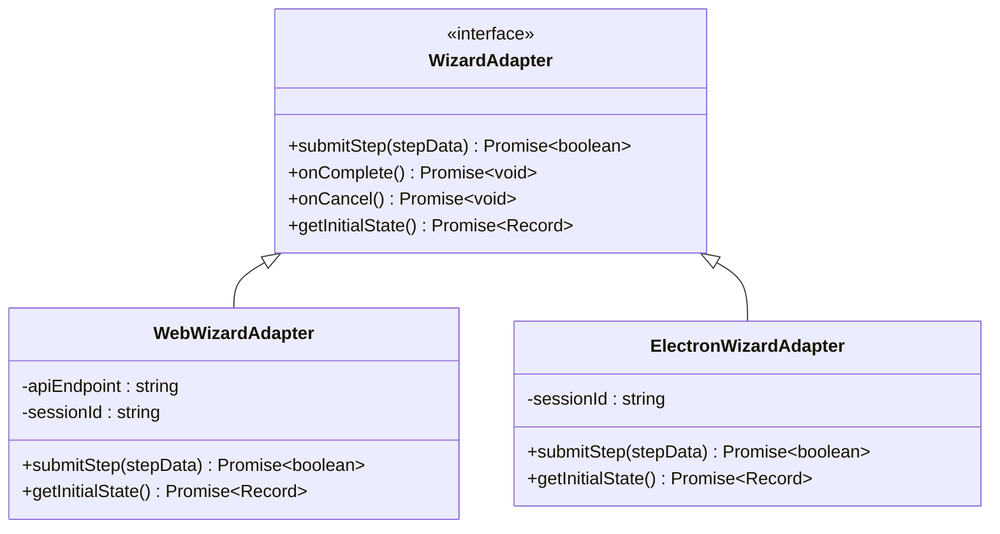
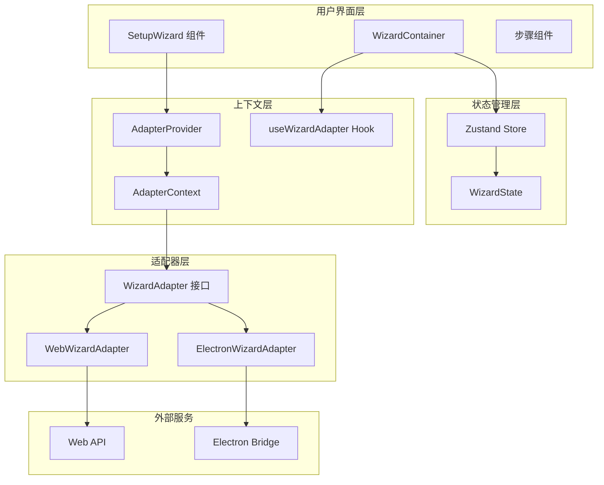
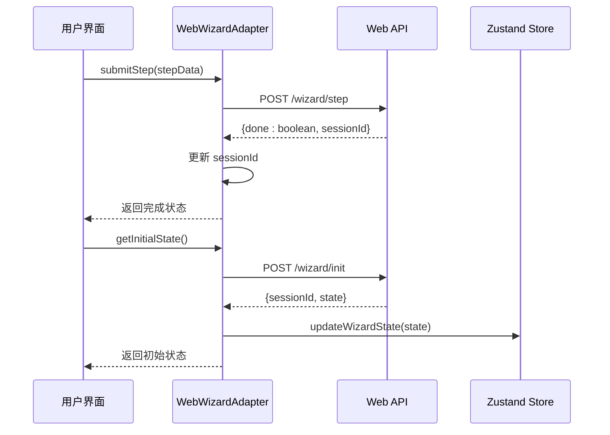
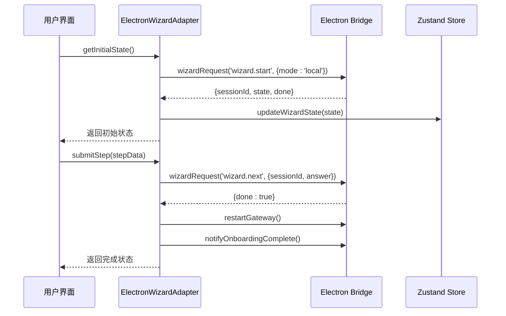
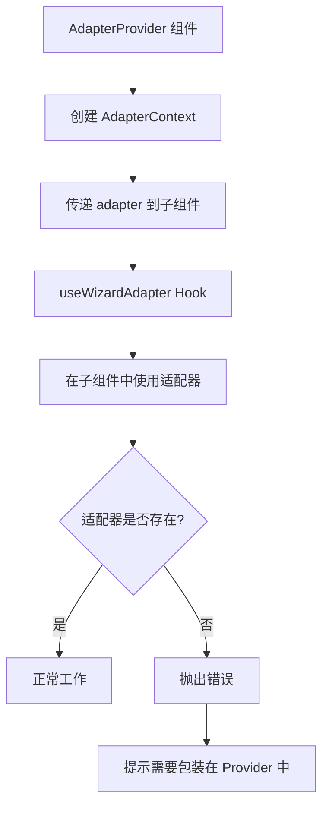
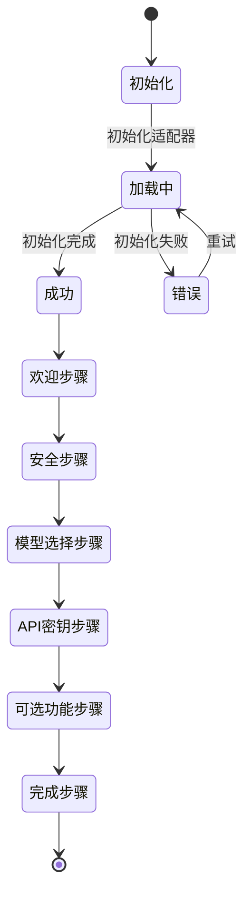
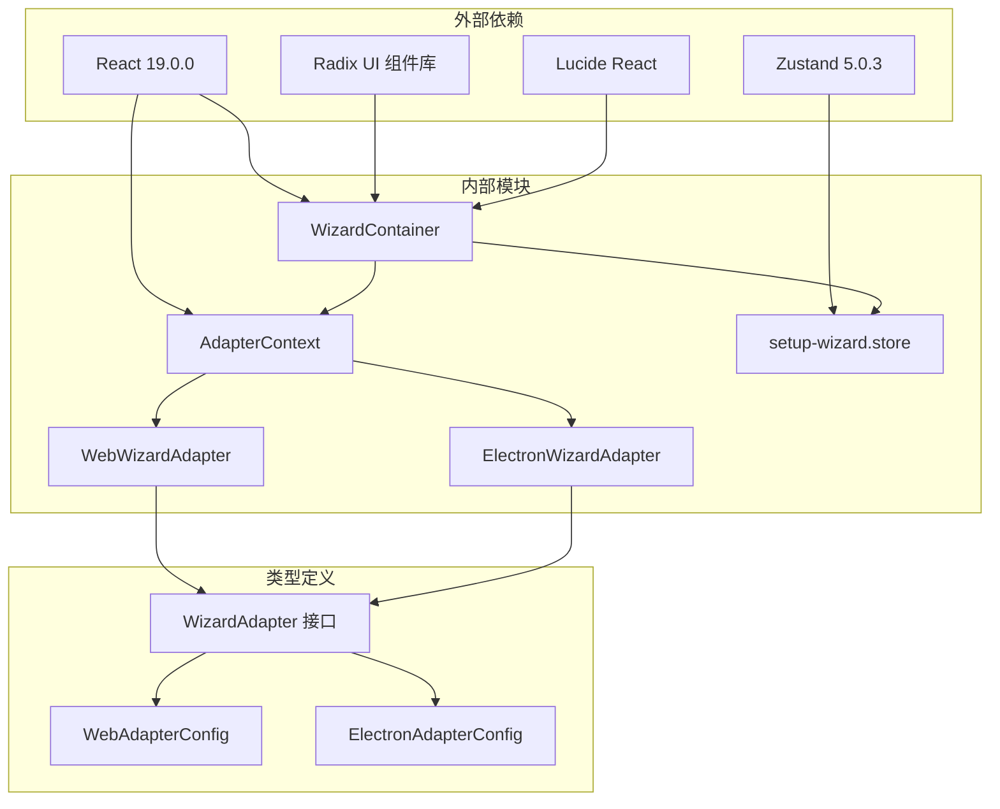

# 设置向导适配器

<cite>
**本文档引用的文件**
- [packages/setup-wizard/src/types/adapter.ts](file://packages/setup-wizard/src/types/adapter.ts)
- [packages/setup-wizard/src/adapters/WebWizardAdapter.ts](file://packages/setup-wizard/src/adapters/WebWizardAdapter.ts)
- [packages/setup-wizard/src/adapters/ElectronWizardAdapter.ts](file://packages/setup-wizard/src/adapters/ElectronWizardAdapter.ts)
- [packages/setup-wizard/src/context/AdapterContext.tsx](file://packages/setup-wizard/src/context/AdapterContext.tsx)
- [packages/setup-wizard/src/components/setup-wizard/index.tsx](file://packages/setup-wizard/src/components/setup-wizard/index.tsx)
- [packages/setup-wizard/src/components/setup-wizard/WizardContainer.tsx](file://packages/setup-wizard/src/components/setup-wizard/WizardContainer.tsx)
- [packages/setup-wizard/src/store/setup-wizard.store.ts](file://packages/setup-wizard/src/store/setup-wizard.store.ts)
- [packages/setup-wizard/src/examples/WebIntegration.tsx](file://packages/setup-wizard/src/examples/WebIntegration.tsx)
- [packages/setup-wizard/src/examples/ElectronIntegration.tsx](file://packages/setup-wizard/src/examples/ElectronIntegration.tsx)
- [packages/setup-wizard/package.json](file://packages/setup-wizard/package.json)
- [docs/start/wizard.md](file://docs/start/wizard.md)
- [docs/reference/wizard.md](file://docs/reference/wizard.md)
</cite>

## 目录
1. [简介](#简介)
2. [项目结构](#项目结构)
3. [核心组件](#核心组件)
4. [架构概览](#架构概览)
5. [详细组件分析](#详细组件分析)
6. [依赖关系分析](#依赖关系分析)
7. [性能考虑](#性能考虑)
8. [故障排除指南](#故障排除指南)
9. [结论](#结论)

## 简介

设置向导适配器是 OpenClaw 项目中的一个关键组件，它提供了一个统一的接口来适配不同的平台环境（Web 和 Electron），使得设置向导能够在多种运行环境中无缝工作。该适配器模式的设计允许开发者轻松地为新的平台添加支持，同时保持核心功能的一致性。

适配器系统的核心价值在于其抽象能力，它将平台特定的实现细节封装起来，为上层组件提供一致的 API 接口。这种设计不仅提高了代码的可维护性，还增强了系统的可扩展性。

## 项目结构

设置向导适配器位于 `packages/setup-wizard` 包中，采用模块化的组织方式：

**图表来源**
- [packages/setup-wizard/src/types/adapter.ts:1-46](file://packages/setup-wizard/src/types/adapter.ts#L1-L46)
- [packages/setup-wizard/src/adapters/WebWizardAdapter.ts:1-76](file://packages/setup-wizard/src/adapters/WebWizardAdapter.ts#L1-L76)
- [packages/setup-wizard/src/adapters/ElectronWizardAdapter.ts:1-82](file://packages/setup-wizard/src/adapters/ElectronWizardAdapter.ts#L1-L82)

**章节来源**
- [packages/setup-wizard/package.json:1-61](file://packages/setup-wizard/package.json#L1-L61)

## 核心组件

设置向导适配器系统由以下几个核心组件构成：

### 适配器接口定义

适配器接口定义了所有平台适配器必须实现的标准方法：

**图表来源**
- [packages/setup-wizard/src/types/adapter.ts:6-28](file://packages/setup-wizard/src/types/adapter.ts#L6-L28)
- [packages/setup-wizard/src/adapters/WebWizardAdapter.ts:7-21](file://packages/setup-wizard/src/adapters/WebWizardAdapter.ts#L7-L21)
- [packages/setup-wizard/src/adapters/ElectronWizardAdapter.ts:17-25](file://packages/setup-wizard/src/adapters/ElectronWizardAdapter.ts#L17-L25)

### 状态管理

使用 Zustand 进行状态管理，提供响应式的状态更新机制：

| 状态字段 | 类型 | 默认值 | 描述 |
|---------|------|--------|------|
| selectedModel | string | "claude" | 选择的模型名称 |
| apiKey | string | "" | API 密钥 |
| workspace | string | "~/.openclaw/workspace" | 工作空间路径 |
| optionalFeatures.messaging | boolean | false | 消息功能开关 |
| optionalFeatures.browser | boolean | true | 浏览器功能开关 |
| optionalFeatures.fileAccess | boolean | false | 文件访问功能开关 |
| gatewayPort | number | 18789 | 网关端口号 |
| gatewayBind | enum | "loopback" | 网关绑定地址类型 |
| gatewayAuth | enum | "token" | 网关认证方式 |
| installDaemon | boolean | true | 是否安装守护进程 |
| daemonRuntime | enum | "node" | 守护进程运行时类型 |
| currentStep | number | 0 | 当前步骤索引 |
| isComplete | boolean | false | 是否完成 |

**章节来源**
- [packages/setup-wizard/src/store/setup-wizard.store.ts:4-86](file://packages/setup-wizard/src/store/setup-wizard.store.ts#L4-L86)

## 架构概览

设置向导适配器采用了清晰的分层架构设计：

**图表来源**
- [packages/setup-wizard/src/components/setup-wizard/index.tsx:22-40](file://packages/setup-wizard/src/components/setup-wizard/index.tsx#L22-L40)
- [packages/setup-wizard/src/context/AdapterContext.tsx:14-34](file://packages/setup-wizard/src/context/AdapterContext.tsx#L14-L34)
- [packages/setup-wizard/src/adapters/WebWizardAdapter.ts:7-21](file://packages/setup-wizard/src/adapters/WebWizardAdapter.ts#L7-L21)
- [packages/setup-wizard/src/adapters/ElectronWizardAdapter.ts:17-25](file://packages/setup-wizard/src/adapters/ElectronWizardAdapter.ts#L17-L25)

## 详细组件分析

### Web 平台适配器

WebWizardAdapter 负责处理 Web 环境中的设置向导通信：

**图表来源**
- [packages/setup-wizard/src/adapters/WebWizardAdapter.ts:23-74](file://packages/setup-wizard/src/adapters/WebWizardAdapter.ts#L23-L74)

Web 平台适配器的关键特性：
- 使用标准的 fetch API 进行 HTTP 通信
- 自动处理会话 ID 的存储和传递
- 支持异步完成回调
- 错误处理和重试机制

### Electron 平台适配器

ElectronWizardAdapter 处理桌面应用程序中的设置向导：

**图表来源**
- [packages/setup-wizard/src/adapters/ElectronWizardAdapter.ts:59-80](file://packages/setup-wizard/src/adapters/ElectronWizardAdapter.ts#L59-L80)

Electron 平台适配器的特殊处理：
- 通过 window.electronBridge 进行 IPC 通信
- 自动重启网关服务
- 通知主进程向导完成状态
- 延迟执行完成回调以确保 UI 更新

### 上下文提供者模式

适配器上下文系统实现了 React 的 Provider 模式：

**图表来源**
- [packages/setup-wizard/src/context/AdapterContext.tsx:14-34](file://packages/setup-wizard/src/context/AdapterContext.tsx#L14-L34)

**章节来源**
- [packages/setup-wizard/src/context/AdapterContext.tsx:1-34](file://packages/setup-wizard/src/context/AdapterContext.tsx#L1-L34)

### 步骤容器组件

WizardContainer 负责管理整个设置向导的生命周期：

**图表来源**
- [packages/setup-wizard/src/components/setup-wizard/WizardContainer.tsx:25-160](file://packages/setup-wizard/src/components/setup-wizard/WizardContainer.tsx#L25-L160)

**章节来源**
- [packages/setup-wizard/src/components/setup-wizard/WizardContainer.tsx:1-212](file://packages/setup-wizard/src/components/setup-wizard/WizardContainer.tsx#L1-L212)

## 依赖关系分析

设置向导适配器的依赖关系图：

**图表来源**
- [packages/setup-wizard/package.json:25-49](file://packages/setup-wizard/package.json#L25-L49)

主要依赖项说明：
- **React 19.0.0**: 核心 UI 框架
- **Radix UI**: 无障碍的 UI 组件库
- **Zustand**: 轻量级状态管理
- **Lucide React**: 图标库

**章节来源**
- [packages/setup-wizard/package.json:1-61](file://packages/setup-wizard/package.json#L1-L61)

## 性能考虑

设置向导适配器在设计时充分考虑了性能优化：

### 内存管理
- 使用 Zustand 的持久化中间件减少不必要的重新渲染
- 适配器实例的生命周期管理
- 会话状态的智能缓存策略

### 网络优化
- Web 适配器的请求去重机制
- Electron 适配器的批量操作支持
- 错误重试的指数退避策略

### 渲染优化
- React.memo 的合理使用
- 条件渲染避免不必要的组件更新
- 异步加载和懒加载策略

## 故障排除指南

### 常见问题及解决方案

| 问题类型 | 症状 | 解决方案 |
|---------|------|----------|
| 适配器未初始化 | 抛出 "useWizardAdapter must be used within AdapterProvider" 错误 | 确保 SetupWizard 包装在 AdapterProvider 中 |
| Web API 请求失败 | HTTP 4xx/5xx 错误 | 检查 API 端点配置和网络连接 |
| Electron Bridge 不存在 | window.electronBridge 未定义 | 确保主进程正确设置了桥接对象 |
| 状态同步问题 | UI 与实际状态不一致 | 检查 Zustand store 的更新逻辑 |

### 调试技巧

1. **启用开发模式**: 使用 `process.env.NODE_ENV !== 'production'` 条件输出调试信息
2. **状态检查**: 通过浏览器开发者工具检查 Zustand store 的状态变化
3. **网络监控**: 使用浏览器网络面板监控 API 请求和响应
4. **日志记录**: 在关键节点添加详细的日志输出

**章节来源**
- [packages/setup-wizard/src/context/AdapterContext.tsx:27-32](file://packages/setup-wizard/src/context/AdapterContext.tsx#L27-L32)
- [packages/setup-wizard/src/adapters/WebWizardAdapter.ts:48-51](file://packages/setup-wizard/src/adapters/WebWizardAdapter.ts#L48-L51)
- [packages/setup-wizard/src/adapters/ElectronWizardAdapter.ts:53-56](file://packages/setup-wizard/src/adapters/ElectronWizardAdapter.ts#L53-L56)

## 结论

设置向导适配器系统通过精心设计的架构和清晰的抽象层次，成功实现了跨平台的设置向导功能。该系统的主要优势包括：

### 设计优势
- **高度可扩展**: 适配器模式允许轻松添加新的平台支持
- **代码复用**: 核心逻辑在不同平台间共享
- **类型安全**: 完整的 TypeScript 类型定义
- **状态管理**: 响应式的状态更新机制

### 实现特点
- **渐进式集成**: 支持本地模式和完整适配器模式
- **错误处理**: 完善的错误捕获和恢复机制
- **用户体验**: 流畅的用户交互和反馈
- **文档完善**: 详细的使用示例和集成指南

该适配器系统为 OpenClaw 项目提供了一个强大而灵活的基础，使得设置向导能够在各种运行环境中保持一致的功能和用户体验。通过模块化的架构设计，未来可以轻松扩展到更多的平台和场景中。