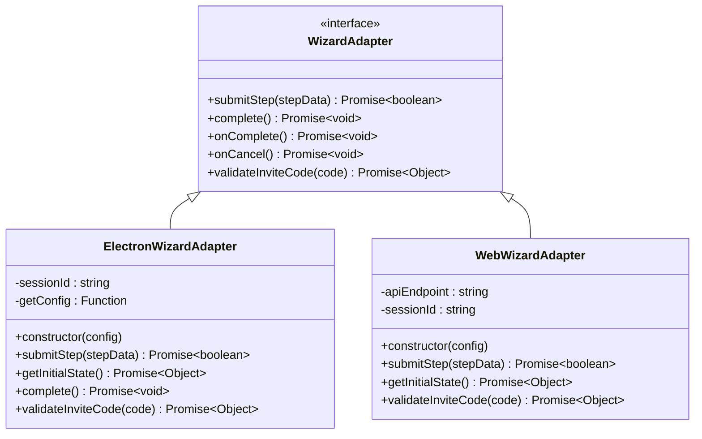
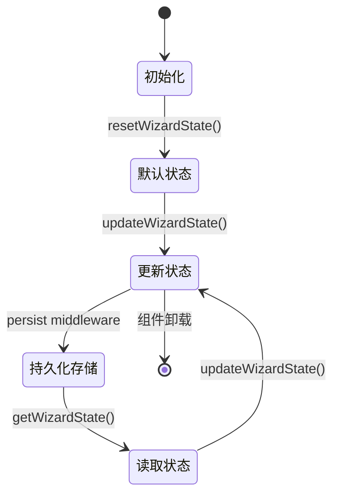
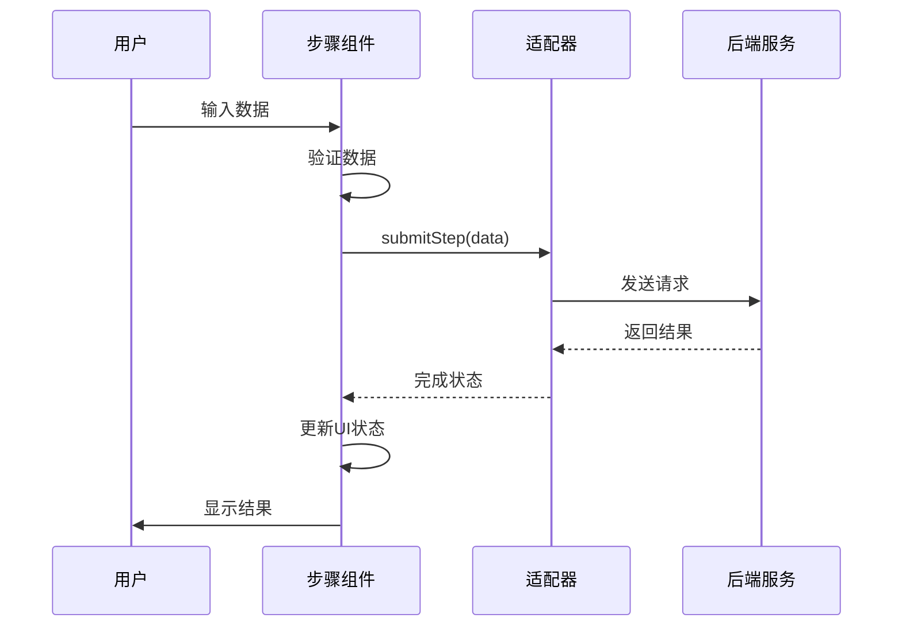
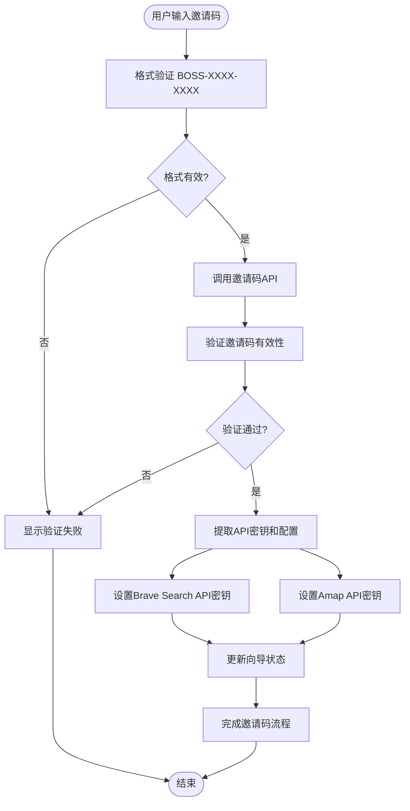
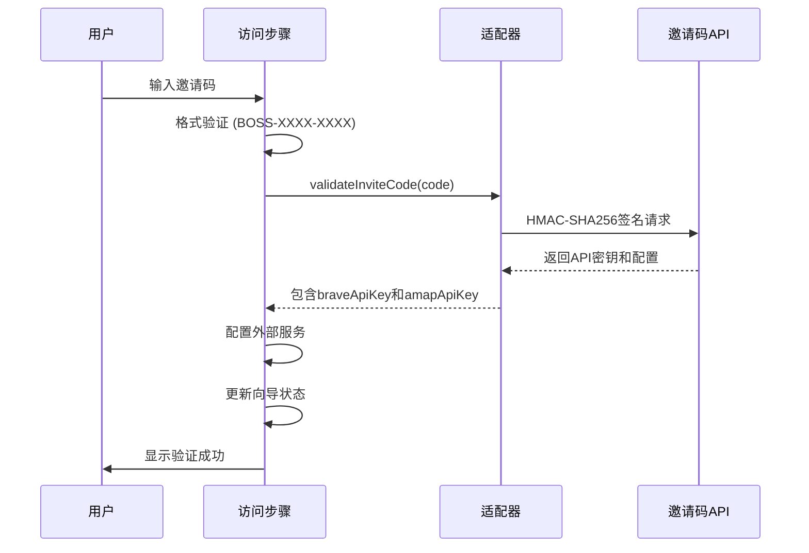
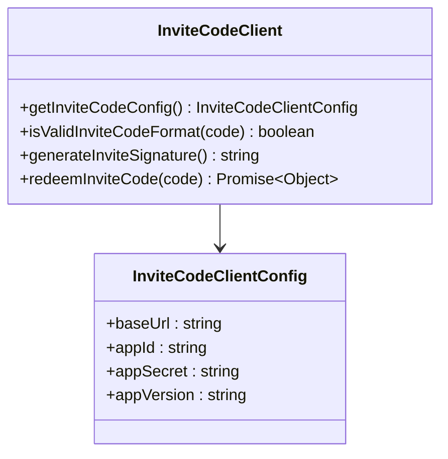
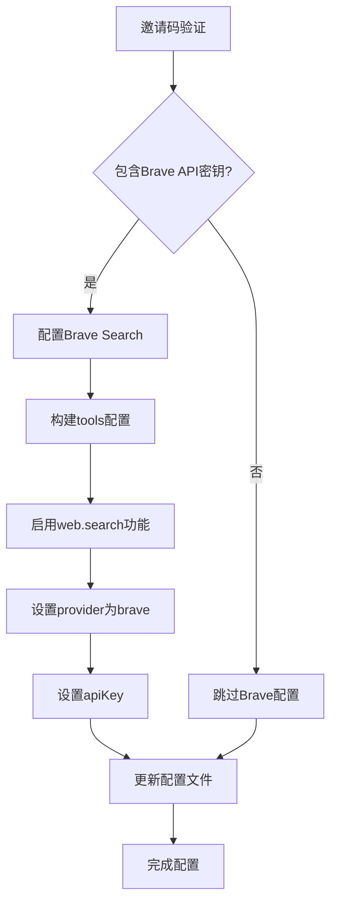
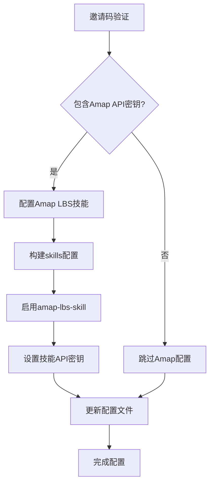
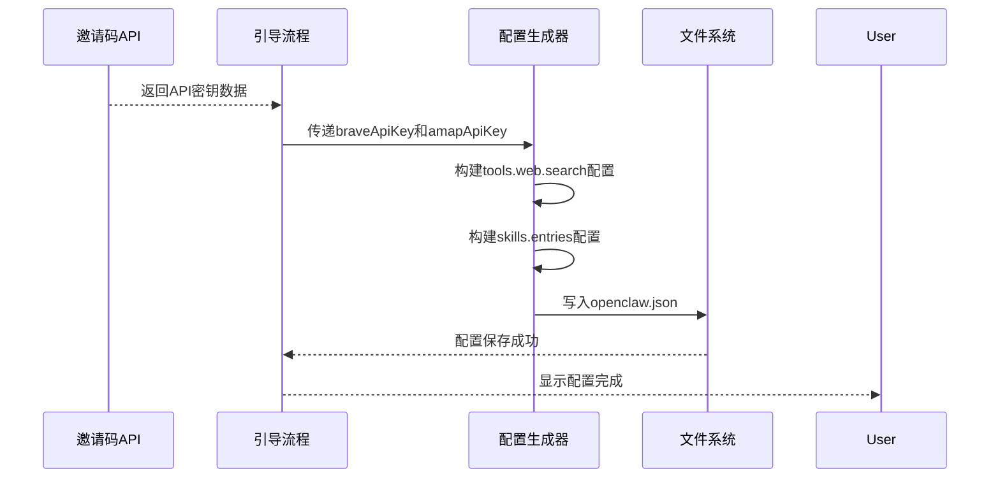
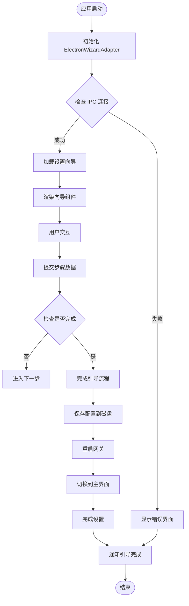

# 设置向导集成指南

<cite>
**本文档引用的文件**
- [package.json](file://ui-react/package.json)
- [index.tsx](file://ui-react/src/components/setup-wizard/index.tsx)
- [WizardContainer.tsx](file://ui-react/src/components/setup-wizard/WizardContainer.tsx)
- [AdapterContext.tsx](file://ui-react/src/context/AdapterContext.tsx)
- [adapter.ts](file://ui-react/src/types/adapter.ts)
- [AccessStep.tsx](file://ui-react/src/components/setup-wizard/steps/AccessStep.tsx)
- [WelcomeStep.tsx](file://ui-react/src/components/setup-wizard/steps/WelcomeStep.tsx)
- [CompletionStep.tsx](file://ui-react/src/components/setup-wizard/steps/CompletionStep.tsx)
- [ModelSelectionStep.tsx](file://ui-react/src/components/setup-wizard/steps/model-selection/ModelSelectionStep.tsx)
- [ApiKeyStep.tsx](file://ui-react/src/components/setup-wizard/steps/api-key-step/ApiKeyStep.tsx)
- [setup-wizard.store.ts](file://ui-react/src/store/setup-wizard.store.ts)
- [invite-code.ts](file://ui-react/src/lib/invite-code.ts)
- [ElectronWizardAdapter.ts](file://ui-react/src/adapters/ElectronWizardAdapter.ts)
- [WebWizardAdapter.ts](file://ui-react/src/adapters/WebWizardAdapter.ts)
- [INTEGRATION.tsx](file://ui-react/src/components/setup-wizard/components/INTEGRATION.tsx)
- [onboarding.ts](file://apps/electron/src/main/onboarding.ts)
- [invite-code-config.ts](file://apps/electron/src/main/invite-code-config.ts)
- [SKILL.md](file://skills/amap-lbs-skill/SKILL.md)
- [brave-search.md](file://docs/zh-CN/brave-search.md)
</cite>

## 更新摘要
**所做更改**
- 新增了Brave Search和Amap API key的自动集成功能说明
- 更新了邀请码系统，现在支持返回外部服务API密钥
- 增强了外部服务配置的最佳实践指导
- 完善了邀请码验证流程中API密钥的处理机制

## 目录
1. [简介](#简介)
2. [项目结构](#项目结构)
3. [核心组件](#核心组件)
4. [架构概览](#架构概览)
5. [详细组件分析](#详细组件分析)
6. [集成方案](#集成方案)
7. [邀请码系统集成](#邀请码系统集成)
8. [外部服务集成](#外部服务集成)
9. [依赖关系分析](#依赖关系分析)
10. [性能考虑](#性能考虑)
11. [故障排除指南](#故障排除指南)
12. [结论](#结论)
13. [附录](#附录)

## 简介

OpenClaw 设置向导是一个高度模块化的用户界面组件，专为新用户快速配置和启动 OpenClaw AI 助手而设计。该向导采用现代化的 React 架构，支持多种平台集成，包括 Electron 和 Web 应用程序。

### 核心特性

- **完整的五步配置流程**：从欢迎页面到最终完成，提供流畅的用户体验
- **适配器模式设计**：支持多平台集成，包括 Electron IPC 通信和 Web API 通信
- **邀请码系统**：支持基于邀请码的预配置访问，简化用户设置流程
- **外部服务自动集成**：通过邀请码自动配置Brave Search和Amap API密钥
- **状态管理**：基于 Zustand 的高效状态管理，支持持久化存储
- **响应式设计**：使用 shadcn/ui 组件库，确保跨设备兼容性
- **类型安全**：完整的 TypeScript 类型定义，提供编译时安全保障
- **灵活的集成方案**：支持多种部署和集成方式

## 项目结构

设置向导包采用清晰的分层架构，将功能按职责进行模块化组织：

```mermaid
graph TB
subgraph "ui-react/src/components/setup-wizard"
IDX[index.tsx]
WC[WizardContainer.tsx]
STEPS[steps/]
UI[ui/]
HC[Header.tsx]
PC[ProgressBar.tsx]
GC[GlassCard.tsx]
END
subgraph "steps/"
WS[WelcomeStep.tsx]
SS[SecurityStep.tsx]
AS[AccessStep.tsx]
MS[ModelSelectionStep.tsx]
AKS[ApiKeyStep.tsx]
OFS[OptionalFeaturesStep.tsx]
CS[CompletionStep.tsx]
END
subgraph "adapters/"
EW[ElectronWizardAdapter.ts]
WW[WebWizardAdapter.ts]
EI[index.ts]
END
subgraph "context/"
AC[AdapterContext.tsx]
END
subgraph "store/"
SWS[setup-wizard.store.ts]
SI[index.ts]
END
subgraph "types/"
AT[adapter.ts]
IT[index.ts]
END
INT[INTEGRATION.tsx]
LIB[lib/]
IC[invite-code.ts]
END
PKG[package.json]
TSC[tsconfig.json]
END
```

**图表来源**
- [package.json:1-58](file://ui-react/package.json#L1-L58)
- [index.tsx:1-31](file://ui-react/src/components/setup-wizard/index.tsx#L1-L31)

**章节来源**
- [package.json:1-58](file://ui-react/package.json#L1-L58)
- [index.tsx:1-31](file://ui-react/src/components/setup-wizard/index.tsx#L1-L31)

## 核心组件

### SetupWizard 主组件

SetupWizard 是整个向导系统的核心入口组件，负责协调各个子组件和状态管理。它提供了统一的接口，使得开发者可以轻松地将向导集成到不同的应用程序中。

### 适配器系统

适配器模式是设置向导架构的关键设计模式，它允许同一个 UI 组件在不同平台上运行，而无需修改核心逻辑。

#### ElectronWizardAdapter

Electron 平台专用适配器，通过 IPC 通信与主进程交互，支持桌面应用程序的原生功能。该适配器实现了完整的向导生命周期管理，包括配置持久化、网关重启和界面切换。

#### WebWizardAdapter

Web 平台适配器，通过 HTTP API 与后端服务通信，适用于浏览器环境。该适配器提供简洁的 API 接口，支持向导状态的远程管理和持久化。

### 状态管理系统

基于 Zustand 的轻量级状态管理解决方案，提供全局状态共享和持久化存储功能。状态管理器包含完整的向导配置状态，支持模型选择、API 密钥、可选功能等配置项。

**章节来源**
- [index.tsx:1-31](file://ui-react/src/components/setup-wizard/index.tsx#L1-L31)
- [ElectronWizardAdapter.ts:128-167](file://ui-react/src/adapters/ElectronWizardAdapter.ts#L128-L167)
- [WebWizardAdapter.ts:94-106](file://ui-react/src/adapters/WebWizardAdapter.ts#L94-L106)
- [setup-wizard.store.ts:1-138](file://ui-react/src/store/setup-wizard.store.ts#L1-L138)

## 架构概览

设置向导采用分层架构设计，确保各组件之间的松耦合和高内聚性：

```mermaid
graph TD
subgraph "应用层"
UI[用户界面组件]
CONT[WizardContainer]
STEPS[步骤组件]
END
subgraph "适配器层"
ADAPTER[适配器接口]
ELEC[ElectronWizardAdapter]
WEB[WebWizardAdapter]
END
subgraph "状态管理层"
STORE[Zustand Store]
STATE[WizardState]
END
subgraph "上下文层"
CONTEXT[AdapterContext]
PROVIDER[AdapterProvider]
END
subgraph "外部系统"
IPC[Electron IPC]
API[Web API]
LOCAL[本地存储]
INVITE[邀请码服务]
BRave[Brave Search API]
AMAP[Amap API]
END
UI --> CONTEXT
CONT --> STEPS
ADAPTER --> ELEC
ADAPTER --> WEB
STORE --> STATE
CONTEXT --> ADAPTER
ELEC --> IPC
WEB --> API
STORE --> LOCAL
STEPS --> INVITE
INVITE --> BRave
INVITE --> AMAP
```

**图表来源**
- [AdapterContext.tsx:1-37](file://ui-react/src/context/AdapterContext.tsx#L1-L37)
- [ElectronWizardAdapter.ts:128-167](file://ui-react/src/adapters/ElectronWizardAdapter.ts#L128-L167)
- [WebWizardAdapter.ts:94-106](file://ui-react/src/adapters/WebWizardAdapter.ts#L94-L106)
- [setup-wizard.store.ts:98-138](file://ui-react/src/store/setup-wizard.store.ts#L98-L138)

## 详细组件分析

### 适配器模式实现

适配器模式的设计使得设置向导可以在不同平台上无缝运行，同时保持一致的 API 接口。



**图表来源**
- [adapter.ts:15-110](file://ui-react/src/types/adapter.ts#L15-L110)
- [ElectronWizardAdapter.ts:128-167](file://ui-react/src/adapters/ElectronWizardAdapter.ts#L128-L167)
- [WebWizardAdapter.ts:94-106](file://ui-react/src/adapters/WebWizardAdapter.ts#L94-L106)

### 状态管理架构

Zustand 提供了轻量级但功能强大的状态管理解决方案，支持中间件和持久化存储。



**图表来源**
- [setup-wizard.store.ts:98-138](file://ui-react/src/store/setup-wizard.store.ts#L98-L138)

### 步骤组件流程

每个步骤组件都遵循相同的生命周期模式，确保一致的用户体验。



**图表来源**
- [WizardContainer.tsx:21-112](file://ui-react/src/components/setup-wizard/WizardContainer.tsx#L21-L112)
- [ElectronWizardAdapter.ts:155-167](file://ui-react/src/adapters/ElectronWizardAdapter.ts#L155-L167)
- [WebWizardAdapter.ts:23-41](file://ui-react/src/adapters/WebWizardAdapter.ts#L23-L41)

**章节来源**
- [adapter.ts:1-110](file://ui-react/src/types/adapter.ts#L1-L110)
- [setup-wizard.store.ts:1-138](file://ui-react/src/store/setup-wizard.store.ts#L1-L138)
- [WizardContainer.tsx:1-112](file://ui-react/src/components/setup-wizard/WizardContainer.tsx#L1-L112)

## 集成方案

### 方案一：独立页面集成

最简单的集成方式，将 SetupWizard 作为独立页面使用：

```typescript
// 方案 1: 作为独立页面
export function SetupPage() {
  return (
    <div>
      <SetupWizard />
    </div>
  );
}
```

### 方案二：条件渲染集成

根据用户是否已完成设置来决定是否显示向导：

```typescript
// 方案 2: 条件渲染（首次用户）
export function AppWithSetupCheck() {
  const [setupComplete] = useState(() => {
    return localStorage.getItem("openclaw-setup-complete") === "true";
  });

  if (!setupComplete) {
    return (
      <div>
        <SetupWizard />
      </div>
    );
  }

  return <MainApp />;
}
```

### 方案三：模态框集成

将设置向导嵌入到主应用的模态框中：

```typescript
// 方案 3: 模态框中的 Setup Wizard
export function AppWithSetupModal() {
  const [showSetup, setShowSetup] = useState(false);

  return (
    <div>
      <MainApp />
      {showSetup && (
        <div className="fixed inset-0 bg-black/50 flex items-center justify-center z-50">
          <div className="bg-white dark:bg-slate-900 rounded-lg max-w-2xl w-full max-h-[90vh] overflow-y-auto">
            <SetupWizard />
          </div>
        </div>
      )}
      <button
        onClick={() => setShowSetup(true)}
        className="fixed bottom-4 right-4 px-4 py-2 bg-blue-600 text-white rounded-lg hover:bg-blue-700"
      >
        重新配置
      </button>
    </div>
  );
}
```

### 方案四：路由集成

将设置向导集成到应用的路由系统中：

```typescript
// 方案 4: 路由集成
export const setupRoutes = [
  {
    path: "/setup",
    element: <SetupPage />,
    meta: {
      title: "Setup Wizard",
      requiresAuth: false,
    },
  },
];
```

**章节来源**
- [INTEGRATION.tsx:1-89](file://ui-react/src/components/setup-wizard/components/INTEGRATION.tsx#L1-L89)

## 邀请码系统集成

### 邀请码验证流程

设置向导集成了完整的邀请码验证系统，支持预配置的访问控制和外部服务API密钥的自动配置：



**图表来源**
- [AccessStep.tsx:22-79](file://ui-react/src/components/setup-wizard/steps/AccessStep.tsx#L22-L79)
- [invite-code.ts:100-221](file://ui-react/src/lib/invite-code.ts#L100-L221)

### 邀请码验证实现

邀请码验证系统包含严格的格式检查和安全的签名机制，现在支持返回外部服务API密钥：



**图表来源**
- [AccessStep.tsx:42-79](file://ui-react/src/components/setup-wizard/steps/AccessStep.tsx#L42-L79)
- [ElectronWizardAdapter.ts:176-206](file://ui-react/src/adapters/ElectronWizardAdapter.ts#L176-L206)
- [WebWizardAdapter.ts:100-106](file://ui-react/src/adapters/WebWizardAdapter.ts#L100-L106)

### 邀请码客户端配置

邀请码客户端支持动态配置和安全签名，现在支持外部服务API密钥的自动配置：



**图表来源**
- [invite-code.ts:10-35](file://ui-react/src/lib/invite-code.ts#L10-L35)
- [invite-code.ts:100-221](file://ui-react/src/lib/invite-code.ts#L100-L221)

**章节来源**
- [AccessStep.tsx:1-221](file://ui-react/src/components/setup-wizard/steps/AccessStep.tsx#L1-L221)
- [invite-code.ts:1-221](file://ui-react/src/lib/invite-code.ts#L1-L221)
- [ElectronWizardAdapter.ts:128-167](file://ui-react/src/adapters/ElectronWizardAdapter.ts#L128-L167)
- [WebWizardAdapter.ts:94-106](file://ui-react/src/adapters/WebWizardAdapter.ts#L94-L106)

## 外部服务集成

### Brave Search API 集成

设置向导现在支持通过邀请码自动配置Brave Search API密钥，实现无缝的外部服务集成：



**图表来源**
- [onboarding.ts:352-367](file://apps/electron/src/main/onboarding.ts#L352-L367)

### Amap API 集成

设置向导支持通过邀请码自动配置Amap API密钥，为用户提供本地化服务能力：



**图表来源**
- [onboarding.ts:373-383](file://apps/electron/src/main/onboarding.ts#L373-L383)

### 配置生成流程

外部服务配置通过邀请码数据自动生成，确保配置的一致性和完整性：



**图表来源**
- [onboarding.ts:347-428](file://apps/electron/src/main/onboarding.ts#L347-L428)

### API密钥配置选项

外部服务API密钥支持多种配置方式和最佳实践：

#### Brave Search API 配置

- **自动配置**：通过邀请码自动设置Brave Search API密钥
- **手动配置**：支持用户手动输入API密钥
- **环境变量**：支持通过环境变量配置API密钥
- **配置文件**：支持在配置文件中设置API密钥

#### Amap API 配置

- **自动配置**：通过邀请码自动设置Amap API密钥
- **手动配置**：支持用户手动输入API密钥
- **环境变量**：支持通过环境变量配置API密钥
- **配置文件**：支持在配置文件中设置API密钥

**章节来源**
- [onboarding.ts:347-428](file://apps/electron/src/main/onboarding.ts#L347-L428)
- [invite-code-config.ts:1-93](file://apps/electron/src/main/invite-code-config.ts#L1-L93)
- [SKILL.md:1-475](file://skills/amap-lbs-skill/SKILL.md#L1-L475)
- [brave-search.md:1-49](file://docs/zh-CN/brave-search.md#L1-L49)

## 依赖关系分析

设置向导包具有明确的依赖层次结构，确保模块间的清晰边界和低耦合性。

```mermaid
graph LR
subgraph "外部依赖"
RADIX[Radix UI]
ZUSTAND[Zustand]
REACT[React]
LUCIDE[Lucide React]
TAILWIND[Tailwind Merge]
END
subgraph "内部模块"
ADAPTERS[adapters/]
COMPONENTS[components/setup-wizard/]
CONTEXT[context/]
STORE[store/]
TYPES[types/]
LIB[lib/]
END
subgraph "入口点"
INDEX[index.tsx]
END
subgraph "外部服务"
BRAVE[Brave Search API]
AMAP[Amap API]
INVITE[邀请码服务]
END
RADIX --> COMPONENTS
ZUSTAND --> STORE
REACT --> INDEX
LUCIDE --> COMPONENTS
TAILWIND --> COMPONENTS
INDEX --> ADAPTERS
INDEX --> COMPONENTS
INDEX --> CONTEXT
INDEX --> STORE
INDEX --> TYPES
COMPONENTS --> CONTEXT
COMPONENTS --> STORE
ADAPTERS --> TYPES
STORE --> TYPES
LIB --> TYPES
LIB --> INVITE
INVITE --> BRAVE
INVITE --> AMAP
```

**图表来源**
- [package.json:21-56](file://ui-react/package.json#L21-L56)
- [index.tsx:1-31](file://ui-react/src/components/setup-wizard/index.tsx#L1-L31)

### Electron 集成流程

Electron 应用程序中的设置向导集成需要特殊的初始化和错误处理机制。



**图表来源**
- [INTEGRATION.tsx:37-79](file://ui-react/src/components/setup-wizard/components/INTEGRATION.tsx#L37-L79)
- [ElectronWizardAdapter.ts:55-103](file://ui-react/src/adapters/ElectronWizardAdapter.ts#L55-L103)

**章节来源**
- [package.json:1-58](file://ui-react/package.json#L1-L58)
- [INTEGRATION.tsx:1-89](file://ui-react/src/components/setup-wizard/components/INTEGRATION.tsx#L1-L89)

## 性能考虑

设置向导在设计时充分考虑了性能优化，采用了多种策略来确保流畅的用户体验：

### 状态管理优化
- 使用 Zustand 替代 Redux，减少不必要的重渲染
- 实现状态持久化，避免重复配置
- 组件级别的状态隔离，提高更新效率

### 渲染性能
- 使用 React.memo 优化组件渲染
- 条件渲染减少 DOM 元素数量
- 懒加载非关键资源

### 网络请求优化
- 适配器层统一处理 API 调用
- 错误重试机制
- 请求缓存策略

### 外部服务集成优化
- 邀请码验证与外部服务配置并行处理
- API密钥的延迟加载和按需配置
- 配置文件的增量更新机制

## 故障排除指南

### 常见问题及解决方案

#### 适配器初始化失败
**症状**：Electron 应用启动时出现适配器初始化错误
**解决方案**：
1. 检查 Electron 主进程是否正确设置了 `window.electronBridge`
2. 验证 IPC 通道的可用性
3. 确认 `@openclaw/setup-wizard` 版本兼容性

#### 状态同步问题
**症状**：向导状态在不同组件间不一致
**解决方案**：
1. 检查 `AdapterProvider` 是否正确包装组件树
2. 验证 `useWizardAdapter` 钩子的使用位置
3. 确认状态更新函数的调用时机

#### 邀请码验证失败
**症状**：邀请码无法通过验证
**解决方案**：
1. 检查邀请码格式是否符合 BOSS-XXXX-XXXX 模式
2. 验证网络连接和 API 可用性
3. 确认应用密钥和签名算法正确性

#### 外部服务配置失败
**症状**：Brave Search或Amap API配置失败
**解决方案**：
1. 检查API密钥的有效性和权限范围
2. 验证网络连接和API服务可用性
3. 确认邀请码包含相应的API密钥数据
4. 检查配置文件的写入权限

#### 样式问题
**症状**：组件样式显示异常或缺失
**解决方案**：
1. 检查 Tailwind CSS 配置
2. 验证 shadcn/ui 组件的导入路径
3. 确认主题配置的正确性

**章节来源**
- [AdapterContext.tsx:19-37](file://ui-react/src/context/AdapterContext.tsx#L19-L37)
- [ElectronWizardAdapter.ts:155-167](file://ui-react/src/adapters/ElectronWizardAdapter.ts#L155-L167)

## 结论

OpenClaw 设置向导提供了一个完整、灵活且高性能的用户配置解决方案。其基于适配器模式的设计使得集成变得简单直观，而基于 Zustand 的状态管理确保了良好的性能表现。

### 主要优势

1. **平台无关性**：通过适配器模式支持多种部署环境
2. **开发友好**：清晰的 API 设计和完善的类型定义
3. **性能优秀**：轻量级状态管理和优化的渲染策略
4. **易于维护**：模块化架构便于功能扩展和 bug 修复
5. **灵活集成**：支持多种集成方案满足不同需求
6. **安全可靠**：完整的邀请码验证和 HMAC-SHA256 签名机制
7. **智能外部服务集成**：通过邀请码自动配置Brave Search和Amap API密钥

### 最佳实践建议

1. 在生产环境中始终使用 `AdapterProvider` 包装组件树
2. 合理使用状态持久化功能，提升用户体验
3. 为适配器实现适当的错误处理和重试机制
4. 定期更新依赖包以获得最新的安全补丁和性能改进
5. 根据应用场景选择合适的集成方案
6. 实施严格的邀请码格式验证和安全检查
7. 为外部服务API密钥配置提供降级方案和错误处理
8. 定期监控外部服务的可用性和性能指标

## 附录

### 集成步骤清单

1. **安装依赖**：更新 `package.json` 中的 `@openclaw/setup-wizard` 依赖
2. **配置适配器**：根据目标平台选择合适的适配器实现
3. **初始化状态**：设置默认配置和初始状态
4. **集成 UI**：将 `SetupWizard` 组件集成到应用程序中
5. **测试验证**：在目标平台上进行全面的功能测试
6. **外部服务配置**：验证Brave Search和Amap API的自动配置功能

### 支持的平台

- **Electron 应用**：桌面应用程序的原生体验
- **Web 应用**：浏览器环境的响应式设计
- **移动应用**：通过 WebView 集成的移动端支持

### 扩展指南

设置向导架构支持自定义适配器的开发，开发者可以根据特定需求创建新的平台适配器，而无需修改核心组件逻辑。

### 步骤组件详细说明

#### WelcomeStep - 欢迎页面
- 展示向导功能概览
- 提供开始按钮触发下一步

#### SecurityStep - 安全确认
- 列出安全注意事项
- 用户确认条款

#### AccessStep - 访问控制
- 邀请码输入和验证
- 外部服务API密钥的自动配置
- 手动模型选择选项

#### ModelSelectionStep - 模型选择
- 提供多个 AI 模型选项
- 支持模型搜索和筛选

#### ApiKeyStep - API密钥配置
- 引导用户获取和输入 API 密钥
- OAuth 和 API Key 两种认证方式
- 外部服务API密钥的配置选项

#### CompletionStep - 完成页面
- 显示配置摘要
- 启动聊天功能

### 邀请码系统特性

#### 格式验证
- 严格检查 BOSS-XXXX-XXXX 格式
- 大小写不敏感的验证
- 实时格式反馈

#### 安全机制
- HMAC-SHA256 签名
- 随机 nonce 生成
- 时间戳验证

#### API密钥返回
- 支持返回Brave Search API密钥
- 支持返回Amap API密钥
- 自动配置外部服务

#### 错误处理
- 网络超时处理
- 404/410 状态码处理
- 429 限流处理

### 外部服务集成特性

#### Brave Search 集成
- 自动配置web.search功能
- 设置provider为brave
- 配置API密钥和搜索参数

#### Amap 集成
- 自动启用amap-lbs-skill
- 配置API密钥和技能参数
- 支持POI搜索、路径规划等功能

#### 配置生成
- 基于邀请码数据自动生成配置
- 支持增量配置更新
- 保持现有配置的完整性

### 集成方案对比

| 集成方案 | 适用场景 | 优点 | 缺点 |
|---------|----------|------|------|
| 独立页面 | 简单应用、首次启动 | 实现简单、易于理解 | 界面切换复杂 |
| 条件渲染 | 需要检测设置状态的应用 | 状态控制精确 | 需要本地存储支持 |
| 模态框 | 需要随时重新配置的应用 | 用户体验好 | 样式处理复杂 |
| 路由集成 | 单页应用、复杂导航 | 符合 SPA 模式 | 路由配置复杂 |

**章节来源**
- [INTEGRATION.tsx:1-89](file://ui-react/src/components/setup-wizard/components/INTEGRATION.tsx#L1-L89)
- [onboarding.ts:347-428](file://apps/electron/src/main/onboarding.ts#L347-L428)
- [invite-code-config.ts:1-93](file://apps/electron/src/main/invite-code-config.ts#L1-L93)