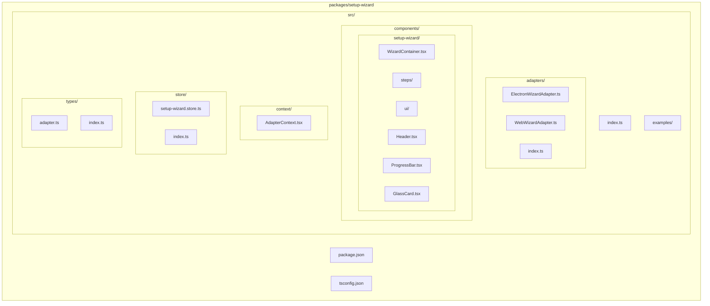
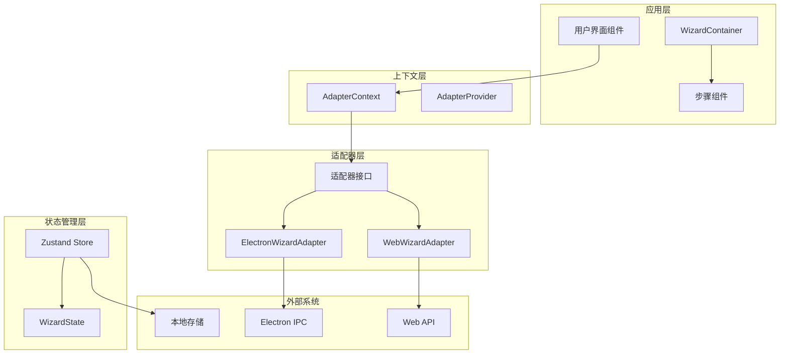
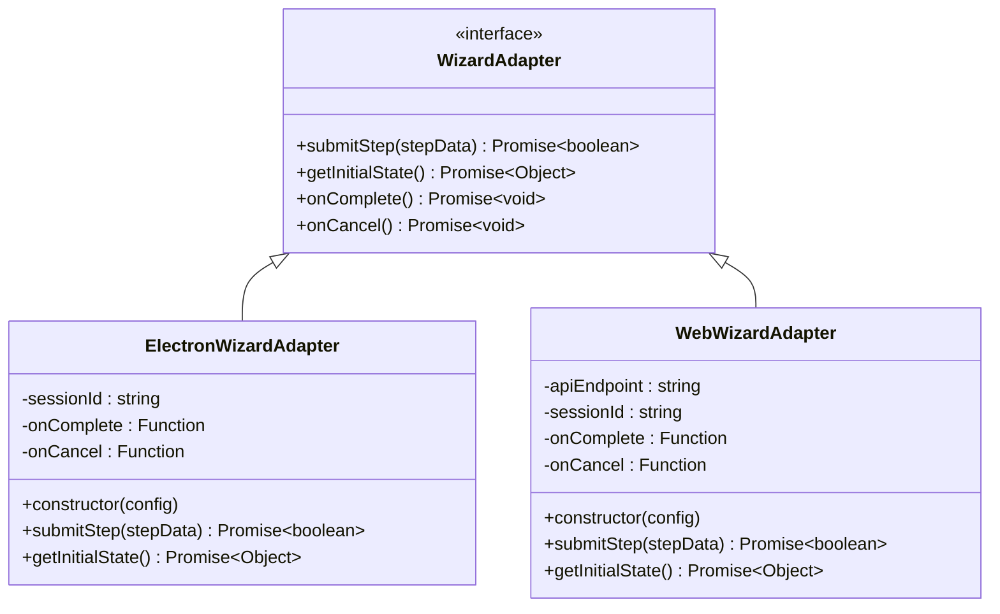
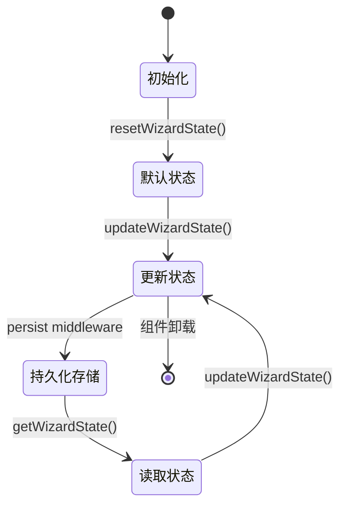
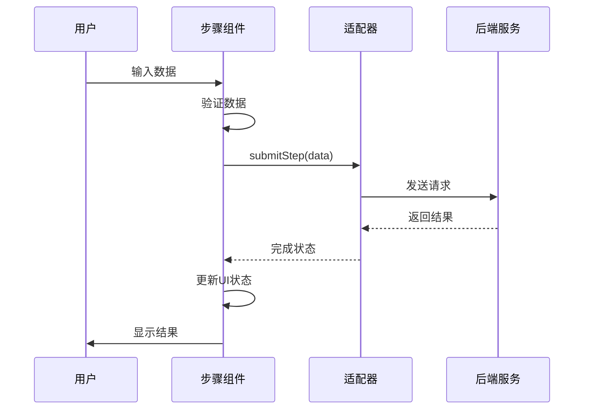
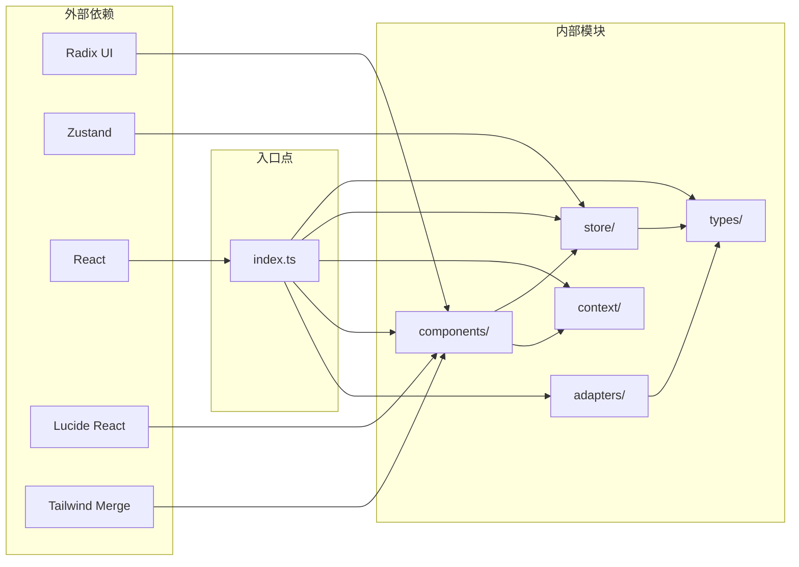
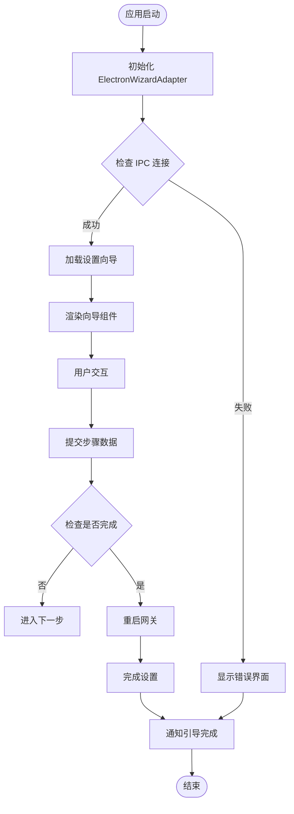

# 设置向导集成指南

<cite>
**本文档引用的文件**
- [SETUP_WIZARD_INTEGRATION_GUIDE.md](file://SETUP_WIZARD_INTEGRATION_GUIDE.md)
- [package.json](file://packages/setup-wizard/package.json)
- [index.ts](file://packages/setup-wizard/src/index.ts)
- [ElectronWizardAdapter.ts](file://packages/setup-wizard/src/adapters/ElectronWizardAdapter.ts)
- [WebWizardAdapter.ts](file://packages/setup-wizard/src/adapters/WebWizardAdapter.ts)
- [AdapterContext.tsx](file://packages/setup-wizard/src/context/AdapterContext.tsx)
- [WizardContainer.tsx](file://packages/setup-wizard/src/components/setup-wizard/WizardContainer.tsx)
- [setup-wizard.store.ts](file://packages/setup-wizard/src/store/setup-wizard.store.ts)
- [adapter.ts](file://packages/setup-wizard/src/types/adapter.ts)
- [WelcomeStep.tsx](file://packages/setup-wizard/src/components/setup-wizard/steps/WelcomeStep.tsx)
- [App.tsx](file://apps/electron/renderer/src/onboarding/App.tsx)
- [WebIntegration.tsx](file://packages/setup-wizard/src/examples/WebIntegration.tsx)
</cite>

## 目录
1. [简介](#简介)
2. [项目结构](#项目结构)
3. [核心组件](#核心组件)
4. [架构概览](#架构概览)
5. [详细组件分析](#详细组件分析)
6. [依赖关系分析](#依赖关系分析)
7. [性能考虑](#性能考虑)
8. [故障排除指南](#故障排除指南)
9. [结论](#结论)
10. [附录](#附录)

## 简介

OpenClaw 设置向导是一个高度模块化的用户界面组件，专为新用户快速配置和启动 OpenClaw AI 助手而设计。该向导采用现代化的 React 架构，支持多种平台集成，包括 Electron 和 Web 应用程序。

### 核心特性

- **完整的六步配置流程**：从欢迎页面到最终完成，提供流畅的用户体验
- **适配器模式设计**：支持多平台集成，包括 Electron IPC 通信和 Web API 通信
- **状态管理**：基于 Zustand 的高效状态管理，支持持久化存储
- **响应式设计**：使用 shadcn/ui 组件库，确保跨设备兼容性
- **类型安全**：完整的 TypeScript 类型定义，提供编译时安全保障

## 项目结构

设置向导包采用清晰的分层架构，将功能按职责进行模块化组织：

**图表来源**
- [package.json:1-61](file://packages/setup-wizard/package.json#L1-L61)
- [index.ts:1-33](file://packages/setup-wizard/src/index.ts#L1-L33)

**章节来源**
- [package.json:1-61](file://packages/setup-wizard/package.json#L1-L61)
- [index.ts:1-33](file://packages/setup-wizard/src/index.ts#L1-L33)

## 核心组件

### SetupWizard 主组件

SetupWizard 是整个向导系统的核心入口组件，负责协调各个子组件和状态管理。它提供了统一的接口，使得开发者可以轻松地将向导集成到不同的应用程序中。

### 适配器系统

适配器模式是设置向导架构的关键设计模式，它允许同一个 UI 组件在不同平台上运行，而无需修改核心逻辑。

#### ElectronWizardAdapter

Electron 平台专用适配器，通过 IPC 通信与主进程交互，支持桌面应用程序的原生功能。

#### WebWizardAdapter

Web 平台适配器，通过 HTTP API 与后端服务通信，适用于浏览器环境。

### 状态管理系统

基于 Zustand 的轻量级状态管理解决方案，提供全局状态共享和持久化存储功能。

**章节来源**
- [index.ts:1-33](file://packages/setup-wizard/src/index.ts#L1-L33)
- [ElectronWizardAdapter.ts:1-82](file://packages/setup-wizard/src/adapters/ElectronWizardAdapter.ts#L1-L82)
- [WebWizardAdapter.ts:1-76](file://packages/setup-wizard/src/adapters/WebWizardAdapter.ts#L1-L76)
- [setup-wizard.store.ts:1-86](file://packages/setup-wizard/src/store/setup-wizard.store.ts#L1-L86)

## 架构概览

设置向导采用分层架构设计，确保各组件之间的松耦合和高内聚性：

**图表来源**
- [AdapterContext.tsx:1-35](file://packages/setup-wizard/src/context/AdapterContext.tsx#L1-L35)
- [ElectronWizardAdapter.ts:17-82](file://packages/setup-wizard/src/adapters/ElectronWizardAdapter.ts#L17-L82)
- [WebWizardAdapter.ts:7-76](file://packages/setup-wizard/src/adapters/WebWizardAdapter.ts#L7-L76)
- [setup-wizard.store.ts:56-86](file://packages/setup-wizard/src/store/setup-wizard.store.ts#L56-L86)

## 详细组件分析

### 适配器模式实现

适配器模式的设计使得设置向导可以在不同平台上无缝运行，同时保持一致的 API 接口。

**图表来源**
- [adapter.ts:6-46](file://packages/setup-wizard/src/types/adapter.ts#L6-L46)
- [ElectronWizardAdapter.ts:17-82](file://packages/setup-wizard/src/adapters/ElectronWizardAdapter.ts#L17-L82)
- [WebWizardAdapter.ts:7-76](file://packages/setup-wizard/src/adapters/WebWizardAdapter.ts#L7-L76)

### 状态管理架构

Zustand 提供了轻量级但功能强大的状态管理解决方案，支持中间件和持久化存储。

**图表来源**
- [setup-wizard.store.ts:56-86](file://packages/setup-wizard/src/store/setup-wizard.store.ts#L56-L86)

### 步骤组件流程

每个步骤组件都遵循相同的生命周期模式，确保一致的用户体验。

**图表来源**
- [WizardContainer.tsx:24-73](file://packages/setup-wizard/src/components/setup-wizard/WizardContainer.tsx#L24-L73)
- [ElectronWizardAdapter.ts:27-57](file://packages/setup-wizard/src/adapters/ElectronWizardAdapter.ts#L27-L57)
- [WebWizardAdapter.ts:23-52](file://packages/setup-wizard/src/adapters/WebWizardAdapter.ts#L23-L52)

**章节来源**
- [adapter.ts:1-46](file://packages/setup-wizard/src/types/adapter.ts#L1-L46)
- [setup-wizard.store.ts:1-86](file://packages/setup-wizard/src/store/setup-wizard.store.ts#L1-L86)
- [WizardContainer.tsx:1-114](file://packages/setup-wizard/src/components/setup-wizard/WizardContainer.tsx#L1-L114)

## 依赖关系分析

设置向导包具有明确的依赖层次结构，确保模块间的清晰边界和低耦合性。

**图表来源**
- [package.json:25-59](file://packages/setup-wizard/package.json#L25-L59)
- [index.ts:1-33](file://packages/setup-wizard/src/index.ts#L1-L33)

### Electron 集成流程

Electron 应用程序中的设置向导集成需要特殊的初始化和错误处理机制。

**图表来源**
- [App.tsx:11-97](file://apps/electron/renderer/src/onboarding/App.tsx#L11-L97)
- [ElectronWizardAdapter.ts:59-80](file://packages/setup-wizard/src/adapters/ElectronWizardAdapter.ts#L59-L80)

**章节来源**
- [package.json:1-61](file://packages/setup-wizard/package.json#L1-L61)
- [App.tsx:1-97](file://apps/electron/renderer/src/onboarding/App.tsx#L1-L97)

## 性能考虑

设置向导在设计时充分考虑了性能优化，采用了多种策略来确保流畅的用户体验：

### 状态管理优化
- 使用 Zustand 替代 Redux，减少不必要的重渲染
- 实现状态持久化，避免重复配置
- 组件级别的状态隔离，提高更新效率

### 渲染性能
- 使用 React.memo 优化组件渲染
- 条件渲染减少 DOM 元素数量
- 懒加载非关键资源

### 网络请求优化
- 适配器层统一处理 API 调用
- 错误重试机制
- 请求缓存策略

## 故障排除指南

### 常见问题及解决方案

#### 适配器初始化失败
**症状**：Electron 应用启动时出现适配器初始化错误
**解决方案**：
1. 检查 Electron 主进程是否正确设置了 `window.electronBridge`
2. 验证 IPC 通道的可用性
3. 确认 `@openclaw/setup-wizard` 版本兼容性

#### 状态同步问题
**症状**：向导状态在不同组件间不一致
**解决方案**：
1. 检查 `AdapterProvider` 是否正确包装组件树
2. 验证 `useWizardAdapter` 钩子的使用位置
3. 确认状态更新函数的调用时机

#### 样式问题
**症状**：组件样式显示异常或缺失
**解决方案**：
1. 检查 Tailwind CSS 配置
2. 验证 shadcn/ui 组件的导入路径
3. 确认主题配置的正确性

**章节来源**
- [AdapterContext.tsx:25-34](file://packages/setup-wizard/src/context/AdapterContext.tsx#L25-L34)
- [ElectronWizardAdapter.ts:27-57](file://packages/setup-wizard/src/adapters/ElectronWizardAdapter.ts#L27-L57)

## 结论

OpenClaw 设置向导提供了一个完整、灵活且高性能的用户配置解决方案。其基于适配器模式的设计使得集成变得简单直观，而基于 Zustand 的状态管理确保了良好的性能表现。

### 主要优势

1. **平台无关性**：通过适配器模式支持多种部署环境
2. **开发友好**：清晰的 API 设计和完善的类型定义
3. **性能优秀**：轻量级状态管理和优化的渲染策略
4. **易于维护**：模块化架构便于功能扩展和 bug 修复

### 最佳实践建议

1. 在生产环境中始终使用 `AdapterProvider` 包装组件树
2. 合理使用状态持久化功能，提升用户体验
3. 为适配器实现适当的错误处理和重试机制
4. 定期更新依赖包以获得最新的安全补丁和性能改进

## 附录

### 集成步骤清单

1. **安装依赖**：更新 `package.json` 中的 `@openclaw/setup-wizard` 依赖
2. **配置适配器**：根据目标平台选择合适的适配器实现
3. **初始化状态**：设置默认配置和初始状态
4. **集成 UI**：将 `SetupWizard` 组件集成到应用程序中
5. **测试验证**：在目标平台上进行全面的功能测试

### 支持的平台

- **Electron 应用**：桌面应用程序的原生体验
- **Web 应用**：浏览器环境的响应式设计
- **移动应用**：通过 WebView 集成的移动端支持

### 扩展指南

设置向导架构支持自定义适配器的开发，开发者可以根据特定需求创建新的平台适配器，而无需修改核心组件逻辑。