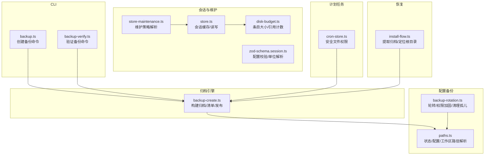
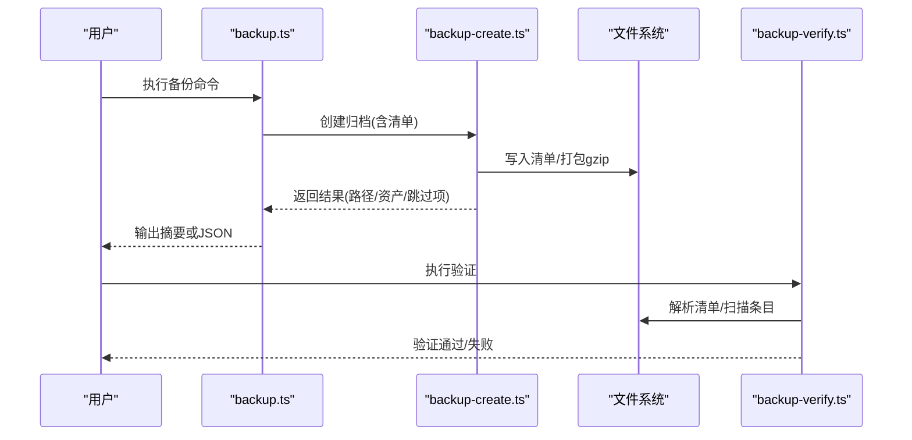
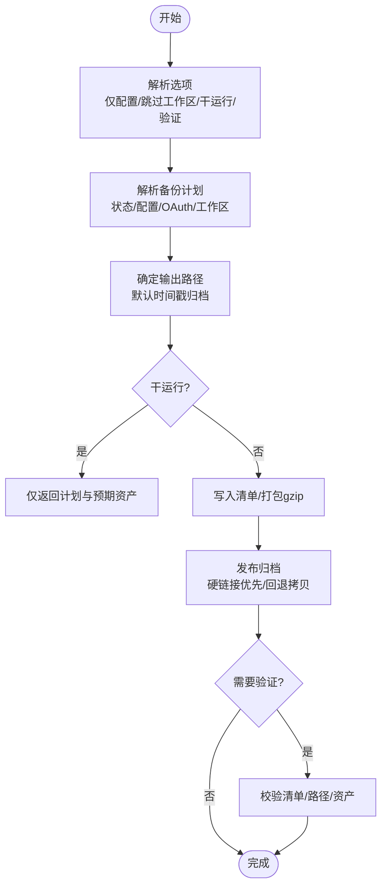
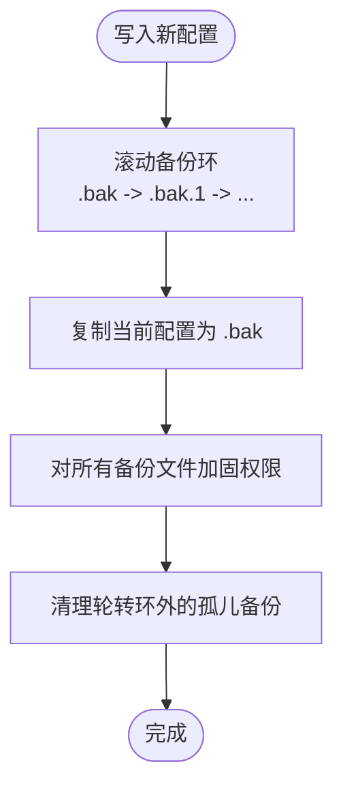
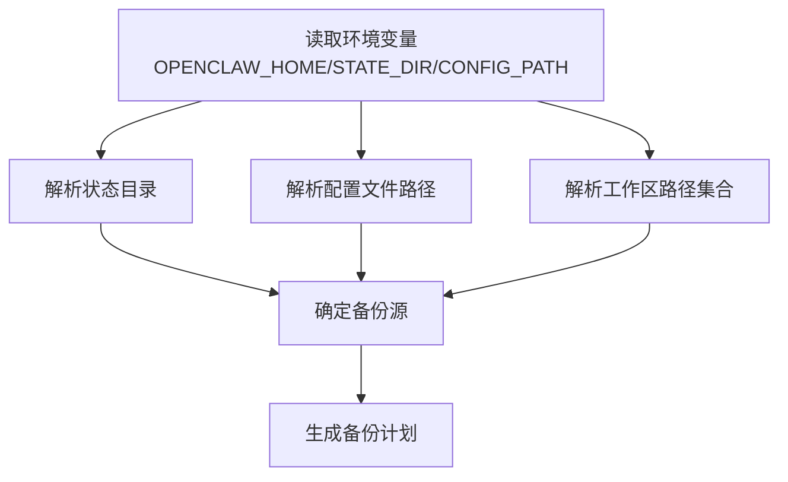
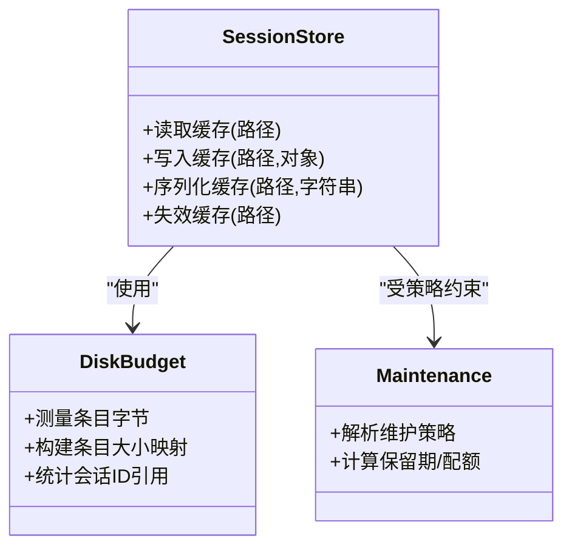
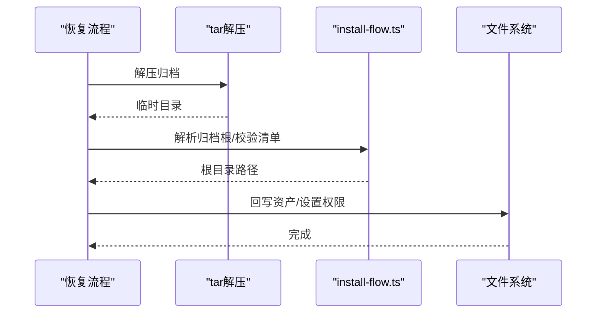
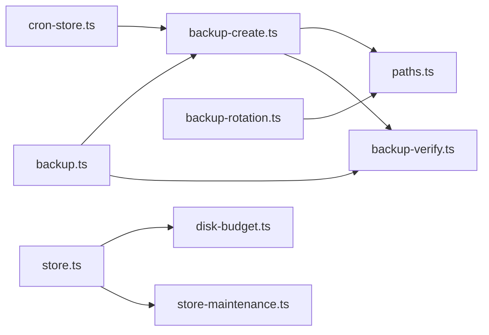

# 备份与恢复

<cite>
**本文引用的文件**
- [backup.md](file://docs/cli/backup.md)
- [backup.ts](file://src/commands/backup.ts)
- [backup-verify.ts](file://src/commands/backup-verify.ts)
- [backup-create.ts](file://src/infra/backup-create.ts)
- [backup-rotation.ts](file://src/config/backup-rotation.ts)
- [paths.ts](file://src/config/paths.ts)
- [store.ts](file://src/config/sessions/store.ts)
- [disk-budget.ts](file://src/config/sessions/disk-budget.ts)
- [store-maintenance.ts](file://src/config/sessions/store-maintenance.ts)
- [cron-store.ts](file://src/cron/store.ts)
- [install-flow.ts](file://src/infra/install-flow.ts)
- [zod-schema.session.ts](file://src/config/zod-schema.session.ts)
</cite>

## 目录

1. [简介](#简介)
2. [项目结构](#项目结构)
3. [核心组件](#核心组件)
4. [架构总览](#架构总览)
5. [详细组件分析](#详细组件分析)
6. [依赖关系分析](#依赖关系分析)
7. [性能考量](#性能考量)
8. [故障排查指南](#故障排查指南)
9. [结论](#结论)
10. [附录](#附录)

## 简介

本指南面向OpenClaw用户与运维人员，提供一套可执行的备份与恢复方案。内容覆盖：

- 数据备份策略：配置文件、会话数据、插件相关数据与工作区的备份范围与边界
- 自动化备份：CLI命令、参数与典型调度方式
- 备份类型选择：全量、增量与差异的策略建议（基于仓库能力现状）
- 存储位置、权限与版本管理
- 完整恢复流程：从归档到系统可用
- 灾难恢复计划与演练
- 验证、监控与清理管理

## 项目结构

围绕备份与恢复的关键模块如下：

- CLI层：提供备份创建与验证命令
- 归档引擎：构建归档、生成清单、输出压缩包
- 配置备份轮转：维护配置文件的多级备份与权限加固
- 路径解析：确定状态目录、配置文件与工作区路径
- 会话存储与维护：会话数据的缓存、预算与清理策略
- 计划任务存储：定时任务持久化与安全模式
- 恢复流程：解压归档、定位根目录、回写目标

**图表来源**

- [backup.ts:11-31](file://src/commands/backup.ts#L11-L31)
- [backup-verify.ts:279-324](file://src/commands/backup-verify.ts#L279-L324)
- [backup-create.ts:272-368](file://src/infra/backup-create.ts#L272-L368)
- [backup-rotation.ts:16-125](file://src/config/backup-rotation.ts#L16-L125)
- [paths.ts:154-194](file://src/config/paths.ts#L154-L194)
- [store.ts:195-211](file://src/config/sessions/store.ts#L195-L211)
- [disk-budget.ts:50-89](file://src/config/sessions/disk-budget.ts#L50-L89)
- [store-maintenance.ts:130-148](file://src/config/sessions/store-maintenance.ts#L130-L148)
- [cron-store.ts:59-75](file://src/cron/store.ts#L59-L75)
- [install-flow.ts:41-61](file://src/infra/install-flow.ts#L41-L61)

**章节来源**

- [backup.md:9-77](file://docs/cli/backup.md#L9-L77)
- [backup.ts:11-31](file://src/commands/backup.ts#L11-L31)
- [backup-verify.ts:279-324](file://src/commands/backup-verify.ts#L279-L324)
- [backup-create.ts:272-368](file://src/infra/backup-create.ts#L272-L368)
- [backup-rotation.ts:16-125](file://src/config/backup-rotation.ts#L16-L125)
- [paths.ts:154-194](file://src/config/paths.ts#L154-L194)
- [store.ts:195-211](file://src/config/sessions/store.ts#L195-L211)
- [disk-budget.ts:50-89](file://src/config/sessions/disk-budget.ts#L50-L89)
- [store-maintenance.ts:130-148](file://src/config/sessions/store-maintenance.ts#L130-L148)
- [cron-store.ts:59-75](file://src/cron/store.ts#L59-L75)
- [install-flow.ts:41-61](file://src/infra/install-flow.ts#L41-L61)

## 核心组件

- 备份创建命令：封装归档构建、清单生成与输出发布，支持仅配置备份、跳过工作区、验证等选项
- 备份验证命令：校验归档内清单唯一性、路径规范化、资产存在性与完整性
- 归档引擎：解析源路径、构建清单、写入清单、打包为gzip归档、发布最终产物
- 配置备份轮转：在配置写入时自动维护环形备份、权限加固与孤儿备份清理
- 路径解析：根据环境变量与默认规则解析状态目录、配置文件与工作区路径
- 会话存储与维护：会话缓存、预算与清理策略，支撑会话数据的备份与恢复
- 计划任务存储：定时任务持久化，确保任务配置的可恢复性
- 恢复流程：从归档中提取、定位根目录并回写目标

**章节来源**

- [backup.md:9-77](file://docs/cli/backup.md#L9-L77)
- [backup.ts:11-31](file://src/commands/backup.ts#L11-L31)
- [backup-verify.ts:279-324](file://src/commands/backup-verify.ts#L279-L324)
- [backup-create.ts:272-368](file://src/infra/backup-create.ts#L272-L368)
- [backup-rotation.ts:16-125](file://src/config/backup-rotation.ts#L16-L125)
- [paths.ts:154-194](file://src/config/paths.ts#L154-L194)
- [store.ts:195-211](file://src/config/sessions/store.ts#L195-L211)
- [store-maintenance.ts:130-148](file://src/config/sessions/store-maintenance.ts#L130-L148)
- [cron-store.ts:59-75](file://src/cron/store.ts#L59-L75)
- [install-flow.ts:41-61](file://src/infra/install-flow.ts#L41-L61)

## 架构总览

下图展示从CLI到归档、再到验证与恢复的整体流程。

**图表来源**

- [backup.ts:11-31](file://src/commands/backup.ts#L11-L31)
- [backup-create.ts:272-368](file://src/infra/backup-create.ts#L272-L368)
- [backup-verify.ts:279-324](file://src/commands/backup-verify.ts#L279-L324)

## 详细组件分析

### 备份创建与验证

- 备份创建
  - 支持仅配置备份、跳过工作区、干运行、验证等选项
  - 输出为时间戳命名的归档，默认位于当前目录或用户家目录
  - 归档内包含清单，记录归档根、创建时间、平台信息、选项与资产列表
- 备份验证
  - 校验清单唯一性、路径规范化、资产存在性与完整性
  - 拒绝路径穿越、重复条目、根目录声明异常等情况

**图表来源**

- [backup-create.ts:272-368](file://src/infra/backup-create.ts#L272-L368)
- [backup-verify.ts:279-324](file://src/commands/backup-verify.ts#L279-L324)

**章节来源**

- [backup.md:9-77](file://docs/cli/backup.md#L9-L77)
- [backup.ts:11-31](file://src/commands/backup.ts#L11-L31)
- [backup-create.ts:272-368](file://src/infra/backup-create.ts#L272-L368)
- [backup-verify.ts:279-324](file://src/commands/backup-verify.ts#L279-L324)

### 配置文件备份轮转与权限

- 轮转策略：维护固定数量的配置备份环，写入新配置时滚动旧备份
- 权限加固：对所有备份文件设置严格权限，避免跨用户泄露
- 孤儿清理：移除不在轮转环内的多余备份文件

**图表来源**

- [backup-rotation.ts:16-125](file://src/config/backup-rotation.ts#L16-L125)

**章节来源**

- [backup-rotation.ts:16-125](file://src/config/backup-rotation.ts#L16-L125)

### 路径解析与备份范围

- 状态目录、配置文件与工作区路径由环境变量与默认规则解析
- 备份范围包括状态目录、活动配置文件、OAuth目录以及工作区（可选）

**图表来源**

- [paths.ts:154-194](file://src/config/paths.ts#L154-L194)
- [backup-create.ts:272-368](file://src/infra/backup-create.ts#L272-L368)

**章节来源**

- [paths.ts:154-194](file://src/config/paths.ts#L154-L194)
- [backup.md:34-47](file://docs/cli/backup.md#L34-L47)

### 会话数据备份与恢复

- 会话存储具备缓存与序列化缓存，支持按路径读取与写入
- 维护策略包含保留期、最大条目数、磁盘配额与高水位阈值
- 会话数据属于“工作区”范畴，可通过备份工作区实现备份；恢复时需注意会话文件与索引一致性

**图表来源**

- [store.ts:195-211](file://src/config/sessions/store.ts#L195-L211)
- [disk-budget.ts:50-89](file://src/config/sessions/disk-budget.ts#L50-L89)
- [store-maintenance.ts:130-148](file://src/config/sessions/store-maintenance.ts#L130-L148)

**章节来源**

- [store.ts:195-211](file://src/config/sessions/store.ts#L195-L211)
- [disk-budget.ts:50-89](file://src/config/sessions/disk-budget.ts#L50-L89)
- [store-maintenance.ts:130-148](file://src/config/sessions/store-maintenance.ts#L130-L148)
- [zod-schema.session.ts:92-131](file://src/config/zod-schema.session.ts#L92-L131)

### 计划任务存储与安全

- 定时任务存储在独立文件中，写入时设置严格权限，避免被其他用户读取
- 该文件属于“状态目录”的一部分，因此在备份范围内

**章节来源**

- [cron-store.ts:59-75](file://src/cron/store.ts#L59-L75)

### 恢复流程

- 提取归档：解压归档至临时目录
- 定位根目录：解析归档根，确保清单唯一且路径合法
- 回写目标：将资产回写到对应路径（注意覆盖策略与权限）

**图表来源**

- [install-flow.ts:41-61](file://src/infra/install-flow.ts#L41-L61)
- [backup-verify.ts:279-324](file://src/commands/backup-verify.ts#L279-L324)

**章节来源**

- [install-flow.ts:41-61](file://src/infra/install-flow.ts#L41-L61)
- [backup-verify.ts:279-324](file://src/commands/backup-verify.ts#L279-L324)

## 依赖关系分析

- CLI命令依赖归档引擎；验证命令独立于创建流程但共享清单格式
- 归档引擎依赖路径解析以确定备份源
- 配置轮转与路径解析共同保障配置文件的安全与可恢复性
- 会话存储与维护策略影响备份体积与恢复效率
- 计划任务存储作为状态的一部分参与备份

**图表来源**

- [backup.ts:11-31](file://src/commands/backup.ts#L11-L31)
- [backup-create.ts:272-368](file://src/infra/backup-create.ts#L272-L368)
- [backup-verify.ts:279-324](file://src/commands/backup-verify.ts#L279-L324)
- [paths.ts:154-194](file://src/config/paths.ts#L154-L194)
- [backup-rotation.ts:16-125](file://src/config/backup-rotation.ts#L16-L125)
- [store.ts:195-211](file://src/config/sessions/store.ts#L195-L211)
- [disk-budget.ts:50-89](file://src/config/sessions/disk-budget.ts#L50-L89)
- [store-maintenance.ts:130-148](file://src/config/sessions/store-maintenance.ts#L130-L148)
- [cron-store.ts:59-75](file://src/cron/store.ts#L59-L75)

**章节来源**

- [backup.ts:11-31](file://src/commands/backup.ts#L11-L31)
- [backup-create.ts:272-368](file://src/infra/backup-create.ts#L272-L368)
- [backup-verify.ts:279-324](file://src/commands/backup-verify.ts#L279-L324)
- [paths.ts:154-194](file://src/config/paths.ts#L154-L194)
- [backup-rotation.ts:16-125](file://src/config/backup-rotation.ts#L16-L125)
- [store.ts:195-211](file://src/config/sessions/store.ts#L195-L211)
- [disk-budget.ts:50-89](file://src/config/sessions/disk-budget.ts#L50-L89)
- [store-maintenance.ts:130-148](file://src/config/sessions/store-maintenance.ts#L130-L148)
- [cron-store.ts:59-75](file://src/cron/store.ts#L59-L75)

## 性能考量

- 备份大小主要由工作区决定；如需更快更小的备份，可禁用工作区备份
- 验证会重新扫描归档，建议在CI或离线环境中执行
- 发布阶段优先使用硬链接，不支持时回退到排他拷贝，避免覆盖已有文件

**章节来源**

- [backup.md:63-77](file://docs/cli/backup.md#L63-L77)
- [backup-create.ts:134-168](file://src/infra/backup-create.ts#L134-L168)

## 故障排查指南

- 归档路径问题：拒绝写入到源路径内部，避免自包含
- 输出覆盖：拒绝覆盖已存在的归档文件
- 清单校验失败：检查清单唯一性、路径规范化与资产存在性
- 配置损坏：当配置无效时，仍可进行仅配置备份或跳过工作区备份
- 权限问题：确认备份文件权限与目标目录权限一致

**章节来源**

- [backup-create.ts:295-303](file://src/infra/backup-create.ts#L295-L303)
- [backup-create.ts:113-124](file://src/infra/backup-create.ts#L113-L124)
- [backup-verify.ts:279-324](file://src/commands/backup-verify.ts#L279-L324)
- [backup.md:49-61](file://docs/cli/backup.md#L49-L61)

## 结论

OpenClaw提供了完善的本地备份与验证能力，并通过配置轮转与路径解析确保关键状态的可恢复性。结合会话与计划任务的备份范围，可满足大多数场景下的备份需求。建议在生产环境中采用定期全量备份与周期性验证，并配合清理策略与灾难演练，持续提升可靠性。

## 附录

### 备份策略设计与实施

- 全量备份：默认行为，包含状态目录、配置文件、OAuth目录与工作区（可选）
- 增量/差异备份：仓库未内置增量/差异算法；建议通过外部工具（如rsync、卷快照）实现
- 仅配置备份：用于快速获取配置文件，跳过状态与工作区

**章节来源**

- [backup.md:34-47](file://docs/cli/backup.md#L34-L47)
- [backup-create.ts:272-368](file://src/infra/backup-create.ts#L272-L368)

### 自动化备份脚本与调度

- 使用系统定时器（如cron或systemd timer）调用备份命令
- 推荐参数组合：指定输出目录、启用验证、必要时仅备份配置
- 在CI中执行验证，确保归档有效性

**章节来源**

- [backup.md:13-21](file://docs/cli/backup.md#L13-L21)

### 备份数据存储位置、加密与版本管理

- 存储位置：默认输出为时间戳命名的归档；可指定输出目录或文件路径
- 加密：仓库未内置加密；建议在归档后使用外部加密工具处理
- 版本管理：归档内包含清单与创建时间，便于版本识别与回溯

**章节来源**

- [backup-create.ts:78-111](file://src/infra/backup-create.ts#L78-L111)
- [backup-create.ts:190-231](file://src/infra/backup-create.ts#L190-L231)

### 数据恢复流程（完整与部分）

- 完整恢复：解压归档、定位根目录、回写资产、设置权限
- 部分恢复：仅恢复配置文件或特定工作区子集（通过仅配置备份或跳过工作区策略）

**章节来源**

- [install-flow.ts:41-61](file://src/infra/install-flow.ts#L41-L61)
- [backup.md:49-61](file://docs/cli/backup.md#L49-L61)

### 灾难恢复计划与演练

- 制定恢复目标（RTO/RPO）、恢复步骤与责任人
- 定期演练：使用历史归档进行恢复测试，验证路径解析与权限设置
- 回归验证：恢复后执行验证命令，确保清单与资产一致

**章节来源**

- [backup-verify.ts:279-324](file://src/commands/backup-verify.ts#L279-L324)

### 备份验证、监控与清理

- 验证：使用验证命令检查清单、路径与资产
- 监控：在CI中集成验证步骤，记录结果
- 清理：定期清理过期归档与孤儿备份（配置轮转已内置孤儿清理逻辑）

**章节来源**

- [backup-verify.ts:279-324](file://src/commands/backup-verify.ts#L279-L324)
- [backup-rotation.ts:72-109](file://src/config/backup-rotation.ts#L72-L109)
