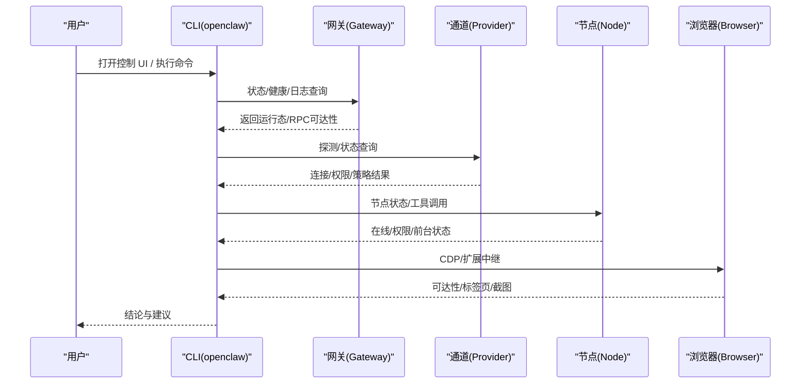
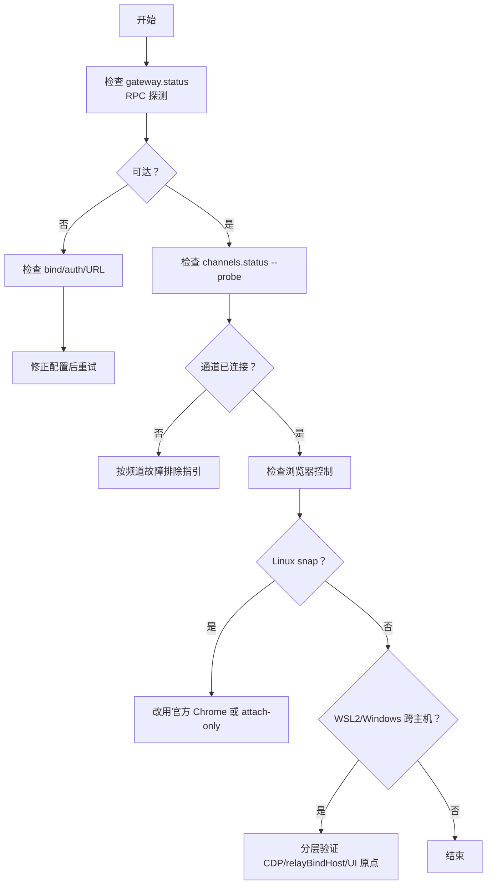
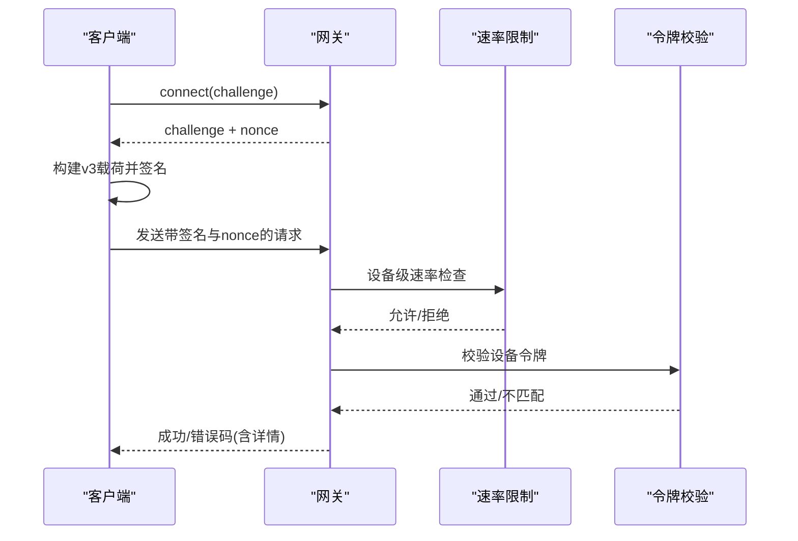
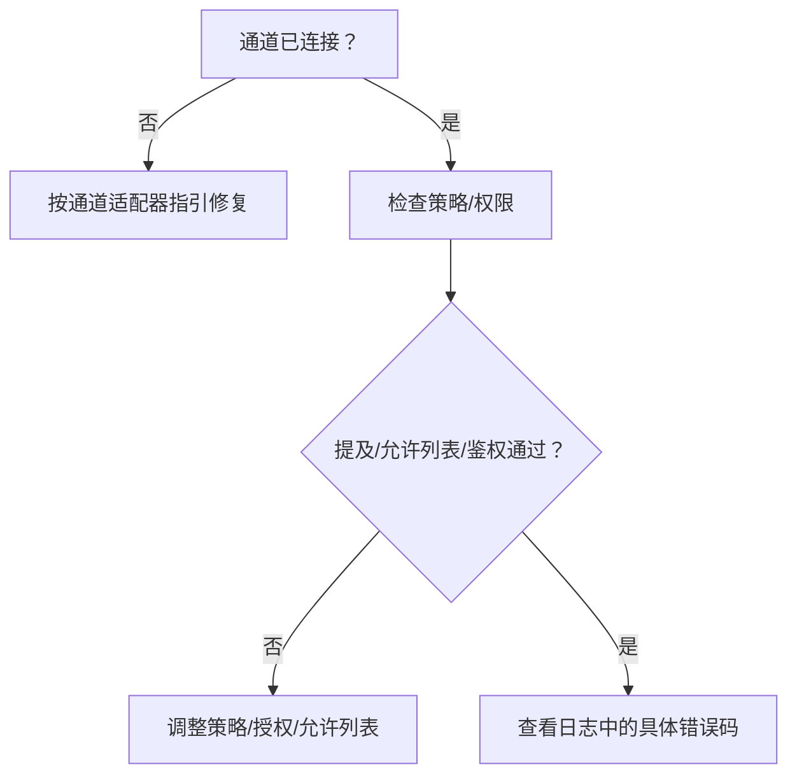
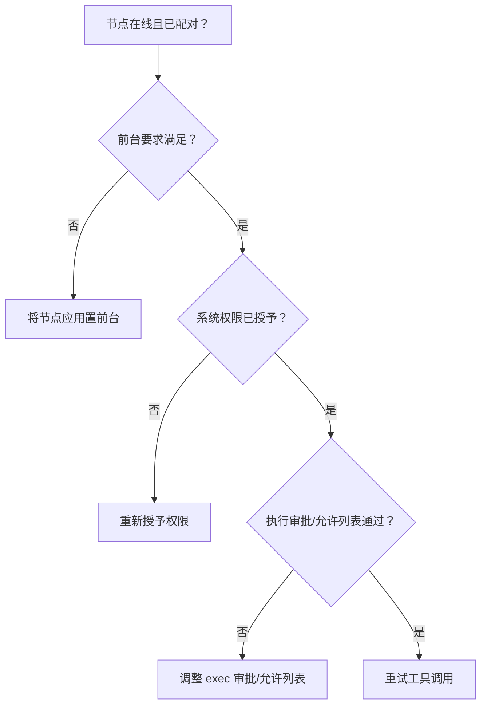
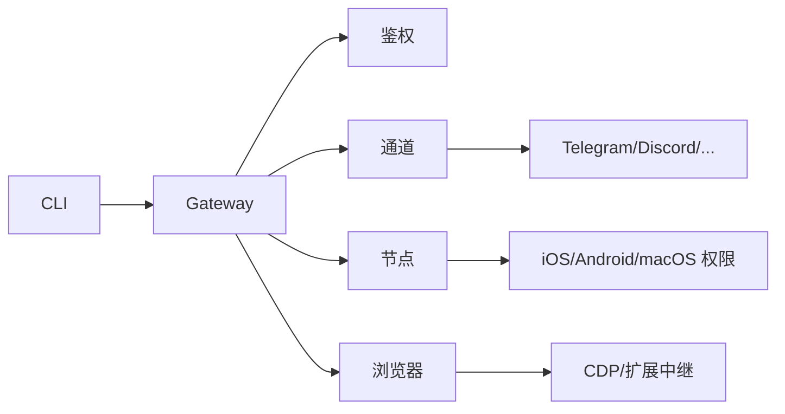

# 故障排除

<cite>
**本文引用的文件**
- [故障排除（帮助）](file://docs/help/troubleshooting.md)
- [网关故障排除](file://docs/gateway/troubleshooting.md)
- [频道故障排除](file://docs/channels/troubleshooting.md)
- [节点故障排除](file://docs/nodes/troubleshooting.md)
- [浏览器故障排除（Linux）](file://docs/tools/browser-linux-troubleshooting.md)
- [WSL2 + Windows + 远程 Chrome CDP 故障排除](file://docs/tools/browser-wsl2-windows-remote-cdp-troubleshooting.md)
- [日志与诊断](file://docs/logging.md)
- [诊断标志](file://docs/diagnostics/flags.md)
- [平台总览](file://docs/platforms/index.md)
- [FAQ 快速问答](file://docs/help/faq.md)
- [状态与健康命令](file://src/commands/status-all.ts)
- [健康状态汇总](file://src/commands/health.ts)
- [设备认证载荷构建](file://src/gateway/device-auth.ts)
- [WebSocket 设备认证上下文](file://src/gateway/server/ws-connection/auth-context.ts)
- [协议校验错误格式化](file://src/gateway/protocol/index.ts)
- [Android 端设备认证载荷测试](file://apps/android/app/src/test/java/ai/openclaw/app/gateway/DeviceAuthPayloadTest.kt)
- [Android 端网关会话（设备认证）](file://apps/android/app/src/main/java/ai/openclaw/app/gateway/GatewaySession.kt)
- [macOS 频道状态与探测](file://apps/macos/Sources/OpenClaw/ChannelsSettings+ChannelState.swift)
- [macOS 节点菜单与平台识别](file://apps/macos/Sources/OpenClaw/NodesMenu.swift)
- [平台命令策略（节点命令白名单）](file://src/gateway/node-command-policy.ts)
</cite>

## 目录

1. [简介](#简介)
2. [项目结构与定位](#项目结构与定位)
3. [核心组件与职责](#核心组件与职责)
4. [架构总览](#架构总览)
5. [详细组件分析与排障流程](#详细组件分析与排障流程)
6. [依赖关系与耦合分析](#依赖关系与耦合分析)
7. [性能考量与优化建议](#性能考量与优化建议)
8. [故障排除指南](#故障排除指南)
9. [结论](#结论)
10. [附录：问题报告模板与信息收集清单](#附录问题报告模板与信息收集清单)

## 简介

本指南面向 OpenClaw 用户与运维工程师，提供系统化的故障诊断方法与解决步骤，覆盖网络连接、认证失败、通道异常、自动化与节点工具执行、浏览器控制、以及跨平台差异等场景。文档以“症状优先”的方式组织，配合命令阶梯、日志分析与诊断标志，帮助快速定位并修复问题。

## 项目结构与定位

OpenClaw 由多语言模块组成：核心网关（TypeScript）、CLI 命令、各平台配套应用（macOS/Android/iOS/Windows/Linux），以及大量频道插件与工具。排障工作主要围绕以下方面展开：

- 网关运行态与健康：服务是否启动、RPC 是否可达、绑定与鉴权是否正确
- 通道层：各频道连接状态、权限与策略、消息流是否正常
- 自动化与心跳：定时任务是否触发、投递是否成功
- 节点与工具：节点在线、前台要求、权限与执行审批
- 浏览器控制：CDP 启动、扩展中继、跨主机连接
- 平台差异：Linux 封装限制、WSL2/Windows 远程 CDP、macOS 权限与图标

```mermaid
graph TB
subgraph "用户界面"
UI["控制 UI / 终端"]
end
subgraph "CLI"
CLI["openclaw 命令集"]
end
subgraph "网关"
GW["Gateway 运行时"]
AUTH["设备/令牌鉴权"]
HEALTH["健康/状态/日志"]
end
subgraph "通道"
CH["各频道适配器<br/>Telegram/Discord/Slack/..."]
end
subgraph "节点"
NODE["节点应用<br/>iOS/Android/macOS"]
TOOLS["屏幕/相机/位置/系统执行"]
end
subgraph "浏览器"
BROWSE["浏览器控制<br/>CDP/扩展中继"]
end
UI --> CLI
CLI --> GW
GW --> AUTH
GW --> HEALTH
GW --> CH
GW --> NODE
GW --> BROWSE
```

图示来源

- [网关故障排除](file://docs/gateway/troubleshooting.md)
- [日志与诊断](file://docs/logging.md)

章节来源

- [平台总览](file://docs/platforms/index.md)
- [故障排除（帮助）](file://docs/help/troubleshooting.md)

## 核心组件与职责

- 网关（Gateway）：承载运行时、鉴权、健康检查、日志与诊断导出、通道与节点交互中枢
- CLI：提供 status/health/logs/doctor/cron 等排障命令
- 通道（Channels）：各即时通讯平台适配器，负责连接、鉴权、消息收发与策略
- 节点（Nodes）：移动/桌面端应用，提供屏幕/相机/位置/系统执行能力
- 浏览器（Browser）：通过 CDP 控制 Chrome/Chromium，支持扩展中继与远程 CDP
- 平台差异：Linux 封装限制、WSL2/Windows 远程 CDP、macOS 权限与图标

章节来源

- [网关故障排除](file://docs/gateway/troubleshooting.md)
- [频道故障排除](file://docs/channels/troubleshooting.md)
- [节点故障排除](file://docs/nodes/troubleshooting.md)
- [浏览器故障排除（Linux）](file://docs/tools/browser-linux-troubleshooting.md)
- [WSL2 + Windows + 远程 Chrome CDP 故障排除](file://docs/tools/browser-wsl2-windows-remote-cdp-troubleshooting.md)
- [日志与诊断](file://docs/logging.md)

## 架构总览

下图展示从用户到网关、通道、节点与浏览器的关键交互路径，以及排障关注点：



图示来源

- [故障排除（帮助）](file://docs/help/troubleshooting.md)
- [网关故障排除](file://docs/gateway/troubleshooting.md)
- [频道故障排除](file://docs/channels/troubleshooting.md)
- [节点故障排除](file://docs/nodes/troubleshooting.md)
- [浏览器故障排除（Linux）](file://docs/tools/browser-linux-troubleshooting.md)
- [WSL2 + Windows + 远程 Chrome CDP 故障排除](file://docs/tools/browser-wsl2-windows-remote-cdp-troubleshooting.md)

## 详细组件分析与排障流程

### 一、网络连接问题

- 典型症状
  - RPC 探测失败、UI 不可用、远程模式不可达
  - WSL2 无法访问 Windows Chrome CDP、扩展中继不可达
  - Linux snap Chromium 启动失败
- 快速检查
  - 使用命令阶梯验证：status、gateway status、logs --follow、doctor、channels status --probe
  - 检查绑定与鉴权：gateway.bind、gateway.auth.token、gateway.remote.url
  - 跨主机场景：确认 relayBindHost、allowedOrigins、HTTPS/安全上下文
- Linux 特有
  - snap 包干扰导致 CDP 启动失败，推荐安装官方 Google Chrome 或使用 attach-only 模式
- WSL2/Windows
  - 分层验证：Windows 本地 CDP 可达性 → WSL2 可达性 → OpenClaw 配置 → 控制 UI 原点与鉴权



图示来源

- [网关故障排除](file://docs/gateway/troubleshooting.md)
- [浏览器故障排除（Linux）](file://docs/tools/browser-linux-troubleshooting.md)
- [WSL2 + Windows + 远程 Chrome CDP 故障排除](file://docs/tools/browser-wsl2-windows-remote-cdp-troubleshooting.md)

章节来源

- [网关故障排除](file://docs/gateway/troubleshooting.md)
- [浏览器故障排除（Linux）](file://docs/tools/browser-linux-troubleshooting.md)
- [WSL2 + Windows + 远程 Chrome CDP 故障排除](file://docs/tools/browser-wsl2-windows-remote-cdp-troubleshooting.md)

### 二、认证失败与设备鉴权

- 典型症状
  - device identity required、AUTH_TOKEN_MISMATCH、device nonce mismatch、device signature invalid
  - 重复 unauthorized、PAIRING_REQUIRED
- 关键点
  - 验证客户端是否完成挑战签名流程（connect.challenge + device.nonce）
  - 检查缓存设备令牌是否过期或被撤销
  - 确认共享令牌与设备令牌一致性
- 平台差异
  - macOS/iOS/Android 的设备身份与权限模型不同，需分别核对



图示来源

- [设备认证载荷构建](file://src/gateway/device-auth.ts)
- [WebSocket 设备认证上下文](file://src/gateway/server/ws-connection/auth-context.ts)
- [Android 端设备认证载荷测试](file://apps/android/app/src/test/java/ai/openclaw/app/gateway/DeviceAuthPayloadTest.kt)
- [Android 端网关会话（设备认证）](file://apps/android/app/src/main/java/ai/openclaw/app/gateway/GatewaySession.kt)

章节来源

- [网关故障排除](file://docs/gateway/troubleshooting.md)
- [设备认证载荷构建](file://src/gateway/device-auth.ts)
- [WebSocket 设备认证上下文](file://src/gateway/server/ws-connection/auth-context.ts)
- [Android 端设备认证载荷测试](file://apps/android/app/src/test/java/ai/openclaw/app/gateway/DeviceAuthPayloadTest.kt)
- [Android 端网关会话（设备认证）](file://apps/android/app/src/main/java/ai/openclaw/app/gateway/GatewaySession.kt)

### 三、通道异常（连接但消息不流动）

- 典型症状
  - mention required、pairing/pending、missing_scope/not_in_channel/401/403
- 快速检查
  - channels status --probe、pairing list、config get channels
  - 针对不同频道的策略与权限差异（Discord 群组提及、Telegram 隐私模式、WhatsApp 登录状态）
- 建议
  - 先确认通道连接与鉴权，再检查策略与允许列表



图示来源

- [频道故障排除](file://docs/channels/troubleshooting.md)
- [网关故障排除](file://docs/gateway/troubleshooting.md)

章节来源

- [频道故障排除](file://docs/channels/troubleshooting.md)
- [网关故障排除](file://docs/gateway/troubleshooting.md)

### 四、自动化与心跳未触发/投递失败

- 典型症状
  - scheduler disabled、heartbeat skipped（quiet-hours/requests-in-flight/unknown accountId）
- 快速检查
  - cron status/list/runs、system heartbeat last、active hours 设置
- 建议
  - 确保调度器启用、目标账户存在、不在静默时段

章节来源

- [网关故障排除](file://docs/gateway/troubleshooting.md)

### 五、节点工具执行失败

- 典型症状
  - NODE_BACKGROUND_UNAVAILABLE、\*\_PERMISSION_REQUIRED、SYSTEM_RUN_DENIED
- 快速检查
  - nodes status/describe、approvals get、前台要求（iOS/Android 的 canvas/camera/screen）
- 建议
  - 将节点应用置于前台、授予所需系统权限、配置 exec 审批与允许列表



图示来源

- [节点故障排除](file://docs/nodes/troubleshooting.md)
- [平台命令策略（节点命令策略）](file://src/gateway/node-command-policy.ts)
- [macOS 频道状态与探测](file://apps/macos/Sources/OpenClaw/ChannelsSettings+ChannelState.swift)
- [macOS 节点菜单与平台识别](file://apps/macos/Sources/OpenClaw/NodesMenu.swift)

章节来源

- [节点故障排除](file://docs/nodes/troubleshooting.md)
- [平台命令策略（节点命令策略）](file://src/gateway/node-command-policy.ts)
- [macOS 频道状态与探测](file://apps/macos/Sources/OpenClaw/ChannelsSettings+ChannelState.swift)
- [macOS 节点菜单与平台识别](file://apps/macos/Sources/OpenClaw/NodesMenu.swift)

### 六、浏览器控制失败

- 典型症状
  - Failed to start Chrome CDP on port、browser.executablePath not found、扩展中继无标签页连接、attach-only 无可达目标
- Linux
  - snap 包干扰，建议安装官方 Chrome 或使用 attach-only 模式
- WSL2/Windows
  - 分层验证：Windows 本地 CDP → WSL2 可达性 → OpenClaw 配置 → relayBindHost → 控制 UI 原点

章节来源

- [浏览器故障排除（Linux）](file://docs/tools/browser-linux-troubleshooting.md)
- [WSL2 + Windows + 远程 Chrome CDP 故障排除](file://docs/tools/browser-wsl2-windows-remote-cdp-troubleshooting.md)

## 依赖关系与耦合分析

- CLI 与网关：通过 RPC 交互，依赖健康与鉴权配置
- 通道与 Provider：依赖各自 API/SDK 与权限，策略与允许列表影响消息流
- 节点与网关：依赖设备配对、前台状态、系统权限与执行审批
- 浏览器与 CDP：依赖浏览器二进制、端口与扩展中继可达性
- 平台差异：Linux 封装、WSL2/Windows 网络边界、macOS 权限模型



图示来源

- [网关故障排除](file://docs/gateway/troubleshooting.md)
- [浏览器故障排除（Linux）](file://docs/tools/browser-linux-troubleshooting.md)
- [WSL2 + Windows + 远程 Chrome CDP 故障排除](file://docs/tools/browser-wsl2-windows-remote-cdp-troubleshooting.md)

章节来源

- [网关故障排除](file://docs/gateway/troubleshooting.md)
- [浏览器故障排除（Linux）](file://docs/tools/browser-linux-troubleshooting.md)
- [WSL2 + Windows + 远程 Chrome CDP 故障排除](file://docs/tools/browser-wsl2-windows-remote-cdp-troubleshooting.md)

## 性能考量与优化建议

- 日志级别与诊断标志：使用诊断标志定向开启特定子系统日志，避免提升全局日志级别
- 采样与导出：OTLP 导出可配置采样率与刷新间隔，降低高吞吐场景开销
- 资源占用：浏览器 headless/no-sandbox 配置需结合平台安全策略评估
- 节点前台与权限：减少后台限制导致的重试与失败

章节来源

- [日志与诊断](file://docs/logging.md)
- [诊断标志](file://docs/diagnostics/flags.md)

## 故障排除指南

### 一、通用排障流程（症状优先）

- 第一步：快速命令阶梯
  - openclaw status
  - openclaw status --all
  - openclaw gateway probe
  - openclaw gateway status
  - openclaw doctor
  - openclaw channels status --probe
  - openclaw logs --follow
- 第二步：根据症状选择专项排障
  - 无回复：检查路由与策略、配对状态
  - 控制 UI 无法连接：检查 URL、鉴权模式、安全上下文
  - 网关未启动/服务异常：检查绑定与鉴权、端口冲突
  - 通道连接但消息不流：检查策略/权限/提及要求
  - 自动化/心跳未触发：检查调度器与投递目标
  - 节点工具失败：检查前台、权限、执行审批
  - 浏览器控制失败：检查 CDP/扩展中继/跨主机可达性

章节来源

- [故障排除（帮助）](file://docs/help/troubleshooting.md)
- [网关故障排除](file://docs/gateway/troubleshooting.md)
- [频道故障排除](file://docs/channels/troubleshooting.md)
- [节点故障排除](file://docs/nodes/troubleshooting.md)
- [浏览器故障排除（Linux）](file://docs/tools/browser-linux-troubleshooting.md)
- [WSL2 + Windows + 远程 Chrome CDP 故障排除](file://docs/tools/browser-wsl2-windows-remote-cdp-troubleshooting.md)

### 二、日志与诊断工具使用

- 日志位置与读取
  - 默认文件：/tmp/openclaw/openclaw-YYYY-MM-DD.log
  - CLI 实时跟踪：openclaw logs --follow
  - 控制 UI Logs 标签页
- 日志级别与格式
  - logging.level、logging.consoleLevel、consoleStyle
  - JSONL 文件日志，控制台可切换 pretty/compact/json
- 诊断标志与定向日志
  - diagnostics.flags 支持通配符，如 telegram._、_
  - 环境变量覆盖：OPENCLAW_DIAGNOSTICS
- OpenTelemetry 导出
  - diagnostics-otel 插件，OTLP/HTTP 协议，支持 traces/metrics/logs
  - 可配置采样率与刷新间隔

章节来源

- [日志与诊断](file://docs/logging.md)
- [诊断标志](file://docs/diagnostics/flags.md)

### 三、紧急故障快速处理流程

- 立即执行命令阶梯，获取状态快照与日志
- 若 UI 不可用：检查 gateway.bind、gateway.auth、allowedOrigins
- 若通道异常：检查配对、允许列表、提及策略
- 若节点工具失败：确认前台、权限、执行审批
- 若浏览器失败：确认 CDP/扩展中继/跨主机可达性
- 无法定位：启用诊断标志，导出 OTLP，结合日志与健康快照

章节来源

- [故障排除（帮助）](file://docs/help/troubleshooting.md)
- [网关故障排除](file://docs/gateway/troubleshooting.md)
- [日志与诊断](file://docs/logging.md)

### 四、常见问题分类与处理方案

- 认证类
  - device identity required、AUTH_TOKEN_MISMATCH、nonce/signature 错误
  - 处理：完成挑战签名流程、更新/轮换设备令牌、检查共享令牌一致性
- 通道类
  - mention required、pairing/pending、missing_scope、not_in_channel、401/403
  - 处理：调整策略/允许列表、检查鉴权/权限
- 节点类
  - NODE_BACKGROUND_UNAVAILABLE、\*\_PERMISSION_REQUIRED、SYSTEM_RUN_DENIED
  - 处理：前台运行、重新授予权限、配置执行审批/允许列表
- 浏览器类
  - Linux snap 干扰、WSL2/Windows 跨主机 CDP 不可达、扩展中继无标签页
  - 处理：官方 Chrome、attach-only 模式、分层验证与 relayBindHost

章节来源

- [网关故障排除](file://docs/gateway/troubleshooting.md)
- [频道故障排除](file://docs/channels/troubleshooting.md)
- [节点故障排除](file://docs/nodes/troubleshooting.md)
- [浏览器故障排除（Linux）](file://docs/tools/browser-linux-troubleshooting.md)
- [WSL2 + Windows + 远程 Chrome CDP 故障排除](file://docs/tools/browser-wsl2-windows-remote-cdp-troubleshooting.md)

### 五、平台特有问题与解决方案

- Linux
  - snap 包导致 CDP 启动失败：安装官方 Chrome 或使用 attach-only 模式
- WSL2/Windows
  - 跨主机 CDP：分层验证 Windows 本地 CDP → WSL2 可达性 → OpenClaw 配置 → relayBindHost → 控制 UI 原点
- macOS
  - 频道状态与探测细节、节点图标与平台识别逻辑

章节来源

- [浏览器故障排除（Linux）](file://docs/tools/browser-linux-troubleshooting.md)
- [WSL2 + Windows + 远程 Chrome CDP 故障排除](file://docs/tools/browser-wsl2-windows-remote-cdp-troubleshooting.md)
- [macOS 频道状态与探测](file://apps/macos/Sources/OpenClaw/ChannelsSettings+ChannelState.swift)
- [macOS 节点菜单与平台识别](file://apps/macos/Sources/OpenClaw/NodesMenu.swift)

## 结论

通过症状优先的命令阶梯、日志与诊断工具、以及针对平台与组件的专项排障流程，大多数 OpenClaw 问题可在短时间内定位并修复。建议在日常运维中：

- 建立标准化命令阶梯与健康检查
- 合理使用诊断标志与 OTLP 导出
- 针对平台差异制定操作手册
- 定期演练紧急故障处理流程

## 附录：问题报告模板与信息收集清单

### 一、问题报告标准格式

- 问题标题：简明描述（如“Telegram 通道连接但消息不流”）
- 重现步骤：最小化复现步骤
- 期望行为：预期结果
- 实际行为：实际结果与错误信息
- 环境信息：操作系统、OpenClaw 版本、运行模式（本地/远程）
- 配置摘要：关键配置片段（脱敏敏感信息）
- 日志片段：相关时间段的日志与错误码
- 截图/录屏：必要时附带

### 二、信息收集要点

- 网关与通道
  - openclaw status、openclaw status --all、openclaw gateway status
  - openclaw channels status --probe、openclaw pairing list
- 自动化与心跳
  - openclaw cron status、openclaw cron runs、openclaw system heartbeat last
- 节点与工具
  - openclaw nodes status、openclaw nodes describe、openclaw approvals get
- 浏览器
  - openclaw browser status、openclaw browser profiles
- 日志
  - openclaw logs --follow（或 tail -f 最新日志文件）
  - 附上诊断标志与 OTLP 导出（如启用）

章节来源

- [故障排除（帮助）](file://docs/help/troubleshooting.md)
- [网关故障排除](file://docs/gateway/troubleshooting.md)
- [频道故障排除](file://docs/channels/troubleshooting.md)
- [节点故障排除](file://docs/nodes/troubleshooting.md)
- [浏览器故障排除（Linux）](file://docs/tools/browser-linux-troubleshooting.md)
- [WSL2 + Windows + 远程 Chrome CDP 故障排除](file://docs/tools/browser-wsl2-windows-remote-cdp-troubleshooting.md)
- [日志与诊断](file://docs/logging.md)
- [诊断标志](file://docs/diagnostics/flags.md)
- [平台总览](file://docs/platforms/index.md)
- [FAQ 快速问答](file://docs/help/faq.md)
