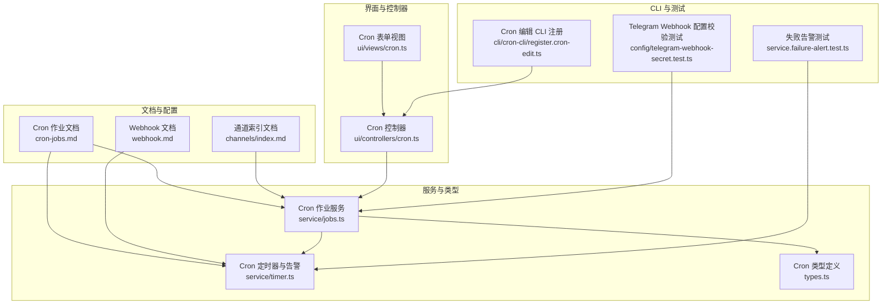
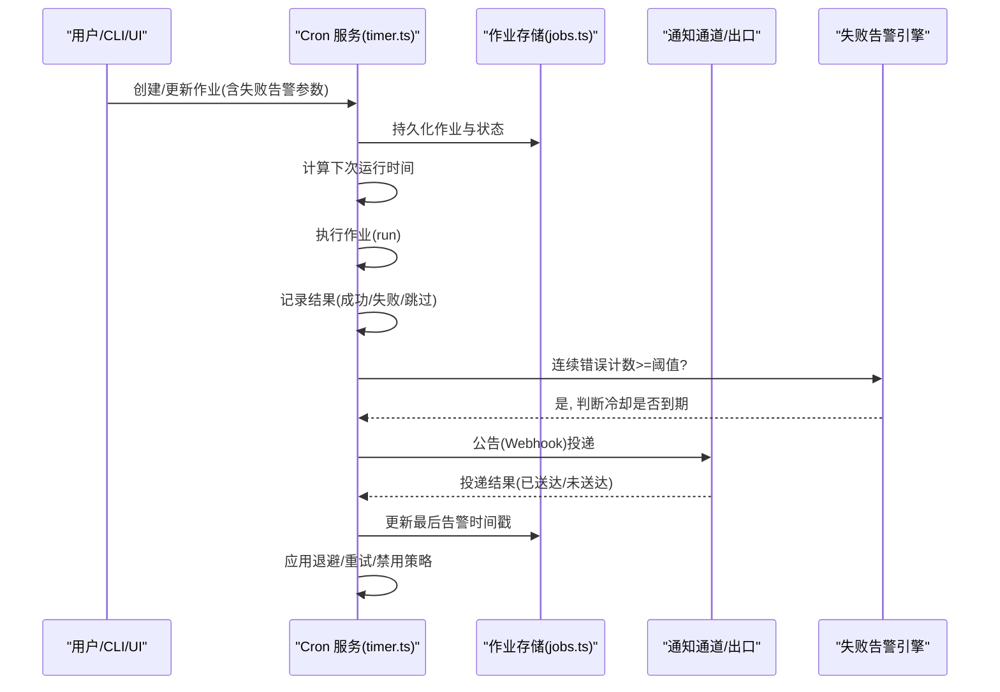
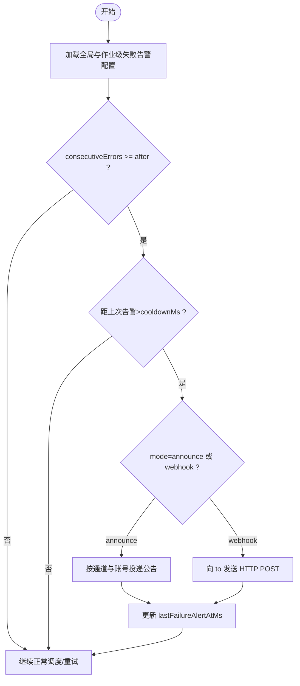
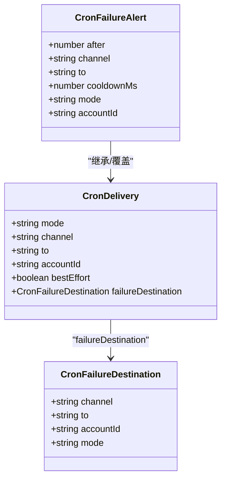
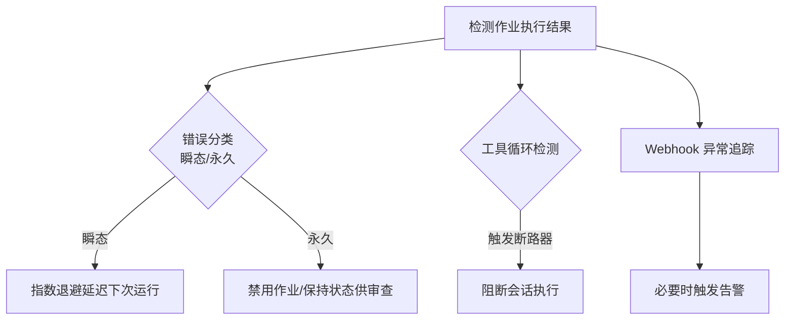
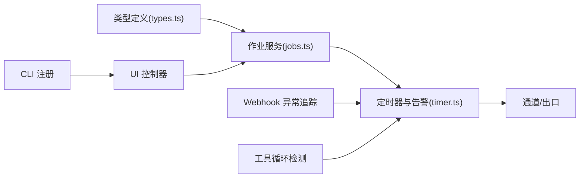

# 告警与通知

<cite>
**本文引用的文件**
- [cron-jobs.md](file://docs/automation/cron-jobs.md)
- [webhook.md](file://docs/automation/webhook.md)
- [index.md](file://docs/channels/index.md)
- [jobs.ts](file://src/cron/service/jobs.ts)
- [timer.ts](file://src/cron/service/timer.ts)
- [types.ts](file://src/cron/types.ts)
- [cron.ts](file://ui/src/ui/views/cron.ts)
- [cron.ts](file://ui/src/ui/controllers/cron.ts)
- [telegram-webhook-secret.test.ts](file://src/config/telegram-webhook-secret.test.ts)
- [webhook-memory-guards.ts](file://src/plugin-sdk/webhook-memory-guards.ts)
- [register.cron-edit.ts](file://src/cli/cron-cli/register.cron-edit.ts)
- [failure-alert.test.ts](file://src/cron/service.failure-alert.test.ts)
- [cron-cli-register.cron-edit.ts](file://src/cli/cron-cli/register.cron-edit.ts)
- [cron-cli-register.cron-edit.ts](file://src/cli/cron-cli/register.cron-edit.ts)
- [cron-cli-register.cron-edit.ts](file://src/cli/cron-cli/register.cron-edit.ts)
- [cron-cli-register.cron-edit.ts](file://src/cli/cron-cli/register.cron-edit.ts)
- [cron-cli-register.cron-edit.ts](file://src/cli/cron-cli/register.cron-edit.ts)
- [cron-cli-register.cron-edit.ts](file://src/cli/cron-cli/register.cron-edit.ts)
- [cron-cli-register.cron-edit.ts](file://src/cli/cron-cli/register.cron-edit.ts)
- [cron-cli-register.cron-edit.ts](file://src/cli/cron-cli/register.cron-edit.ts)
- [cron-cli-register.cron-edit.ts](file://src/cli/cron-cli/register.cron-edit.ts)
- [cron-cli-register.cron-edit.ts](file://src/cli/cron-cli/register.cron-edit.ts)
- [cron-cli-register.cron-edit.ts](file://src/cli/cron-cli/register.cron-edit.ts)
- [cron-cli-register.cron-edit.ts](file://src/cli/cron-cli/register.cron-edit.ts)
- [cron-cli-register.cron-edit.ts](file://src/cli/cron-cli/register.cron-edit.ts)
- [cron-cli-register.cron-edit.ts](file://src/cli/cron-cli/register.cron-edit.ts)
- [cron-cli-register.cron-edit.ts](file://src/cli/cron-cli/register.cron-edit.ts)
- [cron-cli-register.cron-edit.ts](file://src/cli/cron-cli/register.cron-edit.ts)
- [cron-cli-register.cron-edit.ts](file://src/cli/cron-cli/register.cron-edit.ts)
- [cron-cli-register.cron-edit.ts](file://src/cli/cron-cli/register.cron-edit.ts)
- [cron-cli-register.cron-edit.ts](file://src/cli/cron-cli/register.cron-edit.ts)
- [cron-cli-register.cron-edit.ts](file://src/cli/cron-cli/register.cron-edit.ts)
- [cron-cli-register.cron-edit.ts](file://src/cli/cron-cli/register.cron-edit.ts)
- [cron-cli-register.cron-edit.ts](file://src/cli/cron-cli/register.cron-edit.ts)
- [cron-cli-register.cron-edit.ts](......)
</cite>

## 目录

1. [简介](#简介)
2. [项目结构](#项目结构)
3. [核心组件](#核心组件)
4. [架构总览](#架构总览)
5. [详细组件分析](#详细组件分析)
6. [依赖关系分析](#依赖关系分析)
7. [性能考量](#性能考量)
8. [故障排查指南](#故障排查指南)
9. [结论](#结论)
10. [附录](#附录)

## 简介

本指南系统化阐述 OpenClaw 的告警与通知体系，覆盖告警规则配置、阈值与级别、通知渠道集成、消息模板定制、自动化故障检测、异常行为识别、预防性维护告警、告警收敛与重复抑制、告警升级机制、历史与趋势分析、根因分析方法，以及告警有效性评估与误报控制策略。内容从基础配置到高级管理形成完整闭环，帮助读者在生产环境中稳定、可运维地使用告警与通知能力。

## 项目结构

OpenClaw 将告警与通知能力分布在多个层面：

- 文档层：提供用户可读的配置与使用说明，如 Cron 作业、Webhook、通道支持等。
- 服务层：Gateway 内置的 Cron 调度器负责周期性任务执行、失败告警、重试与退避、会话清理等。
- UI 层：提供可视化表单与控制器，用于创建、编辑、查看 Cron 作业及其失败告警参数。
- 插件与通道层：通过插件系统对接多种即时通讯渠道（Telegram、Discord、Slack 等），并支持 Webhook 出口。
- CLI 层：提供命令行接口以创建/更新/运行 Cron 作业，并配置失败告警参数。

**图表来源**

- [cron-jobs.md](file://docs/automation/cron-jobs.md)
- [webhook.md](file://docs/automation/webhook.md)
- [index.md](file://docs/channels/index.md)
- [jobs.ts](file://src/cron/service/jobs.ts)
- [timer.ts](file://src/cron/service/timer.ts)
- [types.ts](file://src/cron/types.ts)
- [cron.ts](file://ui/src/ui/views/cron.ts)
- [cron.ts](file://ui/src/ui/controllers/cron.ts)
- [register.cron-edit.ts](file://src/cli/cron-cli/register.cron-edit.ts)
- [failure-alert.test.ts](file://src/cron/service.failure-alert.test.ts)
- [telegram-webhook-secret.test.ts](file://src/config/telegram-webhook-secret.test.ts)

**章节来源**

- [cron-jobs.md](file://docs/automation/cron-jobs.md)
- [webhook.md](file://docs/automation/webhook.md)
- [index.md](file://docs/channels/index.md)

## 核心组件

- Cron 调度器：负责作业持久化、调度计算、执行、重试与退避、失败告警、会话清理与运行日志修剪。
- 失败告警引擎：基于连续错误次数、冷却时间、目标通道与账号、告警模式（公告或 Webhook）进行告警决策与投递。
- 通知通道适配：支持多通道（Telegram、Discord、Slack、WebChat 等），并提供 Webhook 出口。
- UI 与 CLI：提供可视化与命令行入口，便于配置失败告警参数（触发阈值、冷却、通道、收件人、模式、账号）。
- 运行时安全与异常检测：内置内存限制、Webhook 异常追踪、工具循环检测等，辅助告警与诊断。

**章节来源**

- [jobs.ts](file://src/cron/service/jobs.ts)
- [timer.ts](file://src/cron/service/timer.ts)
- [types.ts](file://src/cron/types.ts)
- [cron.ts](file://ui/src/ui/views/cron.ts)
- [cron.ts](file://ui/src/ui/controllers/cron.ts)
- [register.cron-edit.ts](file://src/cli/cron-cli/register.cron-edit.ts)

## 架构总览

下图展示从作业创建到失败告警投递的关键流程，包括阈值判断、冷却控制、通道选择与投递路径。

**图表来源**

- [timer.ts](file://src/cron/service/timer.ts)
- [jobs.ts](file://src/cron/service/jobs.ts)
- [types.ts](file://src/cron/types.ts)

## 详细组件分析

### 组件一：Cron 作业与失败告警配置

- 作业类型与生命周期
  - 支持一次性(at)、固定间隔(every)与标准 cron 表达式；默认对整点类表达式施加确定性抖动以缓解峰值压力。
  - 主会话(main)与隔离会话(isolated)两种执行模式；隔离会话默认公告摘要，可通过 delivery.mode 控制。
- 失败告警参数
  - 触发阈值 after：连续错误达到该次数后开始告警。
  - 冷却时间 cooldownMs：同一作业在冷却期内仅发送一次告警。
  - 告警通道 channel 与收件人 to：支持 last 或具体通道标识；Webhook 模式下 to 为 URL。
  - 告警模式 mode：announce（通道公告）或 webhook（HTTP POST）。
  - 账号标识 accountId：多账号场景（如多个 Telegram Bot）选择特定账号。
- 配置来源与优先级
  - 作业级 failureAlert 覆盖全局 cron.failureAlert；若未显式开启且未设置作业级覆盖，则不发送告警。
  - delivery 与 failureDestination 的约束：主会话仅支持 webhook；failureDestination 仅在隔离会话或 webhook 模式下可用。

**图表来源**

- [timer.ts](file://src/cron/service/timer.ts)
- [jobs.ts](file://src/cron/service/jobs.ts)
- [types.ts](file://src/cron/types.ts)

**章节来源**

- [jobs.ts](file://src/cron/service/jobs.ts)
- [timer.ts](file://src/cron/service/timer.ts)
- [types.ts](file://src/cron/types.ts)
- [cron.ts](file://ui/src/ui/views/cron.ts)
- [cron.ts](file://ui/src/ui/controllers/cron.ts)
- [register.cron-edit.ts](file://src/cli/cron-cli/register.cron-edit.ts)

### 组件二：通知渠道集成与消息模板定制

- 支持通道
  - 包括 Telegram、Discord、Slack、Mattermost、Signal、iMessage、WebChat 等；通道列表与特性见通道索引文档。
- Webhook 出口
  - 可通过 delivery.mode = "webhook" 将完成事件以 JSON 形式 POST 至指定 URL；可选 Authorization: Bearer 头。
- 消息模板
  - 失败告警文本由系统生成，包含作业名与最近错误摘要；公告投递遵循各通道格式与分块策略。
  - 对于 Telegram 等通道的主题/论坛线程，支持通过 to 字段编码 topic 信息。
- 验证与安全
  - Telegram Webhook 需要 webhookSecret 与 webhookUrl 配置匹配；测试用例验证了配置合法性与回退逻辑。

**图表来源**

- [types.ts](file://src/cron/types.ts)
- [webhook.md](file://docs/automation/webhook.md)
- [index.md](file://docs/channels/index.md)
- [telegram-webhook-secret.test.ts](file://src/config/telegram-webhook-secret.test.ts)

**章节来源**

- [index.md](file://docs/channels/index.md)
- [webhook.md](file://docs/automation/webhook.md)
- [types.ts](file://src/cron/types.ts)
- [telegram-webhook-secret.test.ts](file://src/config/telegram-webhook-secret.test.ts)

### 组件三：自动化故障检测与异常行为识别

- 故障检测
  - 连续错误计数与阈值触发；对隔离会话的 bestEffort 模式在投递失败时不发送告警。
  - 对主会话的失败目的地限制：仅 webhook 模式或隔离会话允许。
- 异常行为识别
  - 通过内置异常追踪器对 Webhook 状态码进行计数与日志记录，辅助识别异常波动。
  - 工具循环检测：当工具调用出现无进展的重复调用并超过阈值时，触发全局断路器，防止资源浪费。
- 预防性维护告警
  - 通过 Cron 作业定期执行健康检查、会话清理、运行日志修剪等维护任务，降低故障概率。

**图表来源**

- [timer.ts](file://src/cron/service/timer.ts)
- [webhook-memory-guards.ts](file://src/plugin-sdk/webhook-memory-guards.ts)
- [tool-loop-detection.ts](file://src/agents/tool-loop-detection.ts)

**章节来源**

- [timer.ts](file://src/cron/service/timer.ts)
- [webhook-memory-guards.ts](file://src/plugin-sdk/webhook-memory-guards.ts)
- [tool-loop-detection.ts](file://src/agents/tool-loop-detection.ts)

### 组件四：告警收敛策略、重复抑制与升级机制

- 收敛与抑制
  - 冷却时间：同一作业在冷却期内不会重复发送告警，避免噪声。
  - 最佳努力投递：bestEffort 模式下投递失败不触发告警。
- 升级机制
  - 连续错误次数超过阈值后才触发告警；若未恢复，后续每次达到阈值时均会发送告警（受冷却控制）。
  - 对于隔离会话，可将失败告警路由至独立的 failureDestination，实现差异化升级路径。

**章节来源**

- [timer.ts](file://src/cron/service/timer.ts)
- [jobs.ts](file://src/cron/service/jobs.ts)
- [types.ts](file://src/cron/types.ts)

### 组件五：告警历史记录、趋势分析与根因分析

- 历史记录
  - 运行历史以 JSONL 文件形式保存，支持按作业 ID 查看；可配置最大字节与保留行数，自动修剪。
  - 隔离会话运行记录按会话保留策略清理，避免长期占用磁盘。
- 趋势分析
  - 结合运行日志与异常追踪统计，观察错误分布、退避频率与通道投递成功率。
- 根因分析
  - 使用内置诊断与修复建议技能，输出结构化报告，包含症状、证据、因果链与修复建议。

**章节来源**

- [cron-jobs.md](file://docs/automation/cron-jobs.md)

## 依赖关系分析

- Cron 服务依赖类型定义与 UI/CLI 输入，最终落地到通道适配与 Webhook 出口。
- 失败告警引擎与重试/退避策略耦合紧密，共同决定告警频率与系统稳定性。
- 异常追踪与工具循环检测作为横切关注点，贯穿执行链路，提升可观测性与鲁棒性。

**图表来源**

- [types.ts](file://src/cron/types.ts)
- [jobs.ts](file://src/cron/service/jobs.ts)
- [timer.ts](file://src/cron/service/timer.ts)
- [webhook-memory-guards.ts](file://src/plugin-sdk/webhook-memory-guards.ts)
- [tool-loop-detection.ts](file://src/agents/tool-loop-detection.ts)

**章节来源**

- [types.ts](file://src/cron/types.ts)
- [jobs.ts](file://src/cron/service/jobs.ts)
- [timer.ts](file://src/cron/service/timer.ts)
- [webhook-memory-guards.ts](file://src/plugin-sdk/webhook-memory-guards.ts)
- [tool-loop-detection.ts](file://src/agents/tool-loop-detection.ts)

## 性能考量

- 退避与抖动：对瞬态错误采用指数退避，减少重试风暴；对整点 cron 表达式施加抖动，降低并发峰值。
- 并发控制：可配置最大并发运行数，避免资源争用。
- 日志与会话清理：定期修剪运行日志与过期会话，控制 IO 与存储开销。
- 冷却与最佳努力：通过冷却与 bestEffort 降低无效告警带来的网络与通道压力。

[本节为通用指导，无需列出具体文件来源]

## 故障排查指南

- 告警未触发
  - 检查 failureAlert 是否启用、after 阈值是否合理、冷却时间是否过长。
  - 确认作业处于隔离会话且 delivery.mode 不为 none，否则可能无法投递。
- 告警过于频繁
  - 适当提高 after 阈值与 cooldownMs；启用 bestEffort 以避免投递失败导致的告警。
- 通道投递失败
  - 核对通道账号、收件人格式与权限；Telegram 主题需使用冒号分隔的 topic 格式。
- Webhook 异常
  - 使用异常追踪器定位高频状态码；检查认证头与目标 URL；必要时启用更严格的日志记录。
- 工具循环
  - 关注工具循环检测告警，必要时调整阈值或修复工具逻辑。

**章节来源**

- [timer.ts](file://src/cron/service/timer.ts)
- [jobs.ts](file://src/cron/service/jobs.ts)
- [webhook-memory-guards.ts](file://src/plugin-sdk/webhook-memory-guards.ts)
- [tool-loop-detection.ts](file://src/agents/tool-loop-detection.ts)

## 结论

OpenClaw 的告警与通知体系以 Cron 为核心，结合失败告警引擎、通道适配与 Webhook 出口，形成从规则配置、阈值设定、级别定义到通知投递的完整闭环。通过退避、抖动、冷却与最佳努力等策略，有效平衡告警的及时性与稳定性；借助运行日志、异常追踪与根因分析，持续优化告警质量与系统可靠性。建议在生产中结合业务场景合理设置阈值与冷却，启用最佳努力与失败目的地分离，并定期审视运行日志与异常统计，以达成低误报、高价值的告警运营。

[本节为总结性内容，无需列出具体文件来源]

## 附录

- 快速参考
  - 创建一次性提醒并立即触发：使用 CLI 添加作业并设置 deleteAfterRun。
  - 定时公告到 Telegram 主题：使用冒号分隔的 topic 格式 to 字段。
  - 启用失败告警：在作业上设置 failureAlert.after/cooldownMs/channel/mode/accountId。
  - Webhook 认证：在 cron 配置中设置 webhookToken，服务端将附加 Authorization 头。
- 相关文档
  - Cron 作业与重试策略：参见 Cron 作业文档。
  - Webhook 入口与认证：参见 Webhook 文档。
  - 通道支持与特性：参见通道索引文档。

**章节来源**

- [cron-jobs.md](file://docs/automation/cron-jobs.md)
- [webhook.md](file://docs/automation/webhook.md)
- [index.md](file://docs/channels/index.md)
