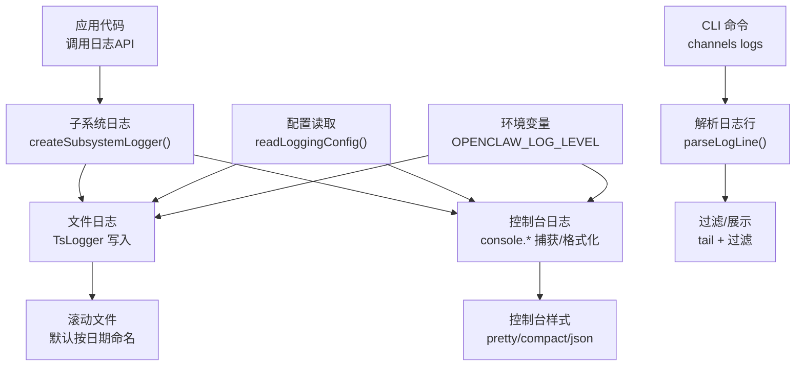
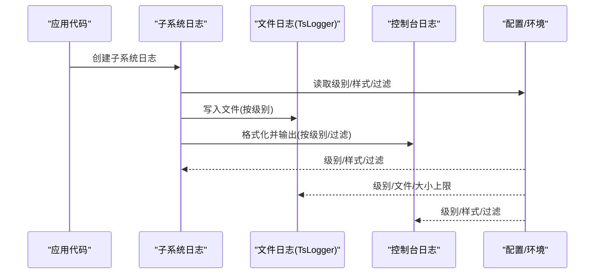
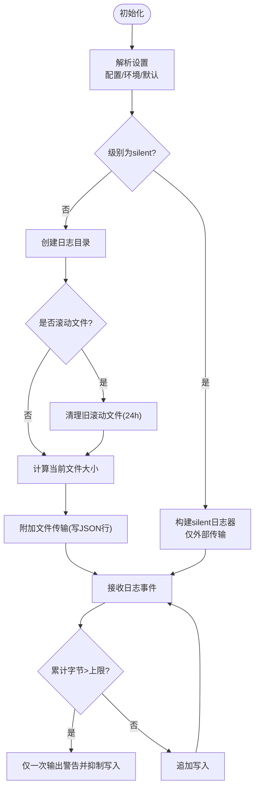
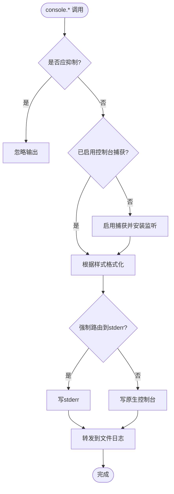
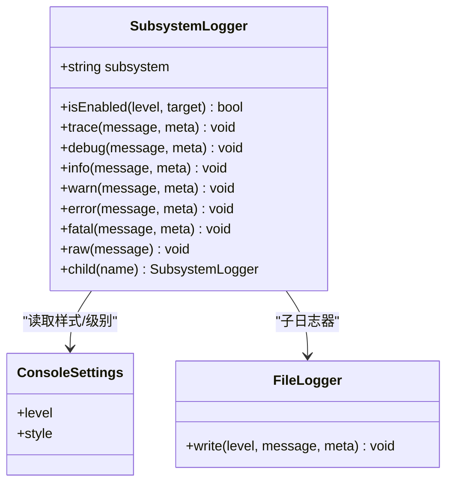
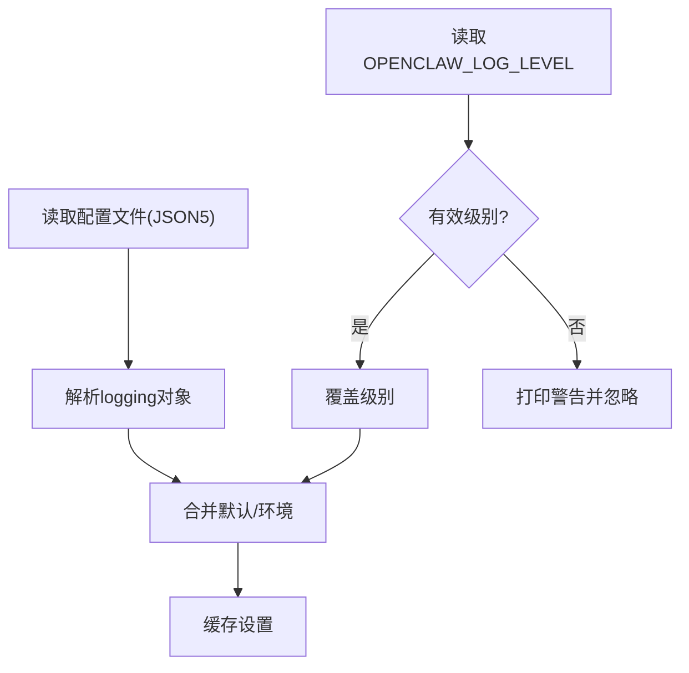
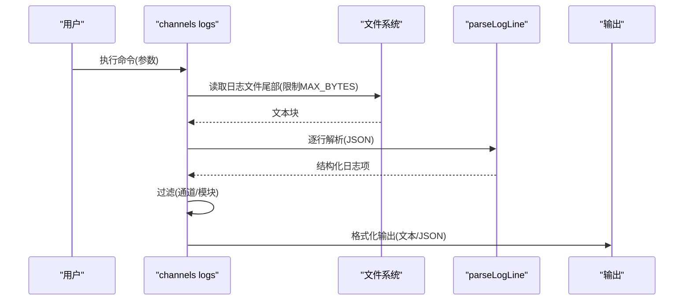
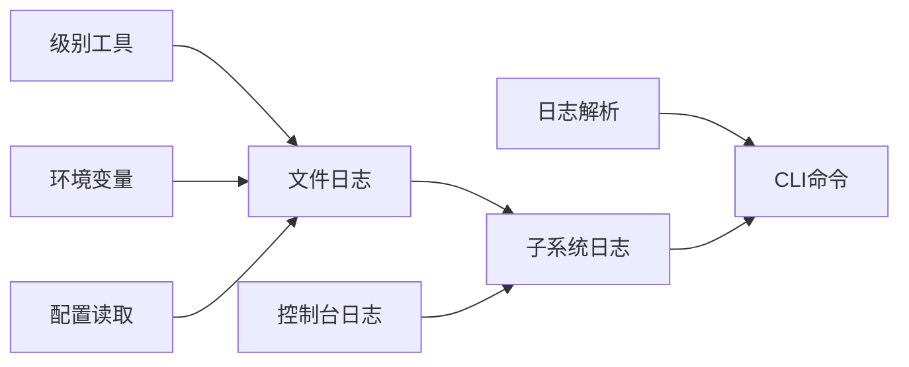

# 应用日志

<cite>
**本文引用的文件**
- [src/logging.ts](file://src/logging.ts)
- [src/logger.ts](file://src/logger.ts)
- [src/logging/logger.ts](file://src/logging/logger.ts)
- [src/logging/levels.ts](file://src/logging/levels.ts)
- [src/logging/console.ts](file://src/logging/console.ts)
- [src/logging/subsystem.ts](file://src/logging/subsystem.ts)
- [src/logging/config.ts](file://src/logging/config.ts)
- [src/logging/env-log-level.ts](file://src/logging/env-log-level.ts)
- [src/logging/state.ts](file://src/logging/state.ts)
- [src/logging/timestamps.ts](file://src/logging/timestamps.ts)
- [src/logging/parse-log-line.ts](file://src/logging/parse-log-line.ts)
- [src/commands/channels/logs.ts](file://src/commands/channels/logs.ts)
- [docs/logging.md](file://docs/logging.md)
- [docs/gateway/logging.md](file://docs/gateway/logging.md)
- [docs/zh-CN/logging.md](file://docs/zh-CN/logging.md)
- [docs/zh-CN/gateway/logging.md](file://docs/zh-CN/gateway/logging.md)
</cite>

## 目录

1. [简介](#简介)
2. [项目结构](#项目结构)
3. [核心组件](#核心组件)
4. [架构总览](#架构总览)
5. [详细组件分析](#详细组件分析)
6. [依赖关系分析](#依赖关系分析)
7. [性能考量](#性能考量)
8. [故障排查指南](#故障排查指南)
9. [结论](#结论)
10. [附录](#附录)

## 简介

本指南面向OpenClaw应用的日志系统，覆盖从基础配置到高级分析的完整流程。内容包括：

- 日志级别与格式规范
- 输出目标（控制台、文件、外部传输）
- 日志轮转与清理策略
- CLI日志命令、实时查看与过滤
- WebSocket服务器日志、通道适配器日志、AI代理日志的分类与解读
- 日志分析工具集成、聚合与搜索
- 敏感信息脱敏、日志安全与合规建议

## 项目结构

OpenClaw的日志子系统由以下模块组成：

- 日志导出入口：统一导出日志能力（级别、控制台、子系统、文件等）
- 文件日志：基于TsLogger，支持滚动文件、大小限制、自动清理
- 控制台日志：可选pretty/compact/json样式，支持时间戳前缀、子系统过滤、EPIPE防护
- 子系统日志：按子系统命名空间输出，支持颜色、裁剪、元数据透传
- 配置与环境：从配置文件读取，支持OPENCLAW_LOG_LEVEL环境变量覆盖
- CLI命令：通道日志尾读、过滤、JSON输出
- 解析工具：解析单行JSON日志为结构化对象，便于搜索与分析

图表来源

- [src/logging.ts:34-69](file://src/logging.ts#L34-L69)
- [src/logging/logger.ts:15-106](file://src/logging/logger.ts#L15-L106)
- [src/logging/console.ts:100-111](file://src/logging/console.ts#L100-L111)
- [src/logging/subsystem.ts:308-402](file://src/logging/subsystem.ts#L308-L402)
- [src/logging/config.ts:8-24](file://src/logging/config.ts#L8-L24)
- [src/logging/env-log-level.ts:4-23](file://src/logging/env-log-level.ts#L4-L23)
- [src/commands/channels/logs.ts:76-113](file://src/commands/channels/logs.ts#L76-L113)
- [src/logging/parse-log-line.ts:41-63](file://src/logging/parse-log-line.ts#L41-L63)

章节来源

- [src/logging.ts:1-70](file://src/logging.ts#L1-L70)
- [src/logging/logger.ts:1-348](file://src/logging/logger.ts#L1-L348)
- [src/logging/console.ts:1-327](file://src/logging/console.ts#L1-L327)
- [src/logging/subsystem.ts:1-426](file://src/logging/subsystem.ts#L1-L426)
- [src/logging/config.ts:1-25](file://src/logging/config.ts#L1-L25)
- [src/logging/env-log-level.ts:1-24](file://src/logging/env-log-level.ts#L1-L24)
- [src/logging/state.ts:1-20](file://src/logging/state.ts#L1-L20)
- [src/logging/timestamps.ts:1-37](file://src/logging/timestamps.ts#L1-L37)
- [src/logging/parse-log-line.ts:1-64](file://src/logging/parse-log-line.ts#L1-L64)
- [src/commands/channels/logs.ts:1-114](file://src/commands/channels/logs.ts#L1-L114)

## 核心组件

- 日志级别与规范化
  - 支持级别：silent、fatal、error、warn、info、debug、trace
  - 规范化函数将字符串映射到受支持级别，或回退到默认值
  - 级别到最小级别数值映射用于TsLogger
- 文件日志
  - 默认目录：临时目录；默认文件：openclaw.log（兼容旧版）
  - 滚动文件：按日期生成文件名（例如openclaw-YYYY-MM-DD.log），保留最多24小时
  - 大小限制：默认500MB，超过阈值会抑制写入并输出警告
  - 外部传输：可注册外部传输函数，不阻塞主日志路径
- 控制台日志
  - 样式：pretty/compact/json；TTY时默认pretty，非TTY默认compact
  - 时间戳：可开启前缀；支持本地ISO时区偏移格式
  - 过滤：支持子系统白名单过滤；在非verbose模式下抑制部分噪声消息
  - 安全：捕获console.\*并转发至文件日志，同时处理EPIPE异步错误
- 子系统日志
  - 自动裁剪冗余前缀（如gateway/channels），保留关键段
  - 彩色显示子系统标签；支持raw消息直写
  - 元数据透传：支持consoleMessage覆盖、\_meta透传
- 配置与环境
  - 配置文件：JSON5读取，键为logging
  - 环境变量：OPENCLAW_LOG_LEVEL覆盖级别；无效值会打印警告
- CLI命令
  - channels logs：从文件尾部读取、解析、过滤、展示；支持JSON输出

章节来源

- [src/logging/levels.ts:1-38](file://src/logging/levels.ts#L1-L38)
- [src/logging/logger.ts:15-106](file://src/logging/logger.ts#L15-L106)
- [src/logging/logger.ts:126-184](file://src/logging/logger.ts#L126-L184)
- [src/logging/logger.ts:309-347](file://src/logging/logger.ts#L309-L347)
- [src/logging/console.ts:100-111](file://src/logging/console.ts#L100-L111)
- [src/logging/console.ts:169-178](file://src/logging/console.ts#L169-L178)
- [src/logging/console.ts:199-326](file://src/logging/console.ts#L199-L326)
- [src/logging/subsystem.ts:126-145](file://src/logging/subsystem.ts#L126-L145)
- [src/logging/subsystem.ts:193-235](file://src/logging/subsystem.ts#L193-L235)
- [src/logging/subsystem.ts:308-402](file://src/logging/subsystem.ts#L308-L402)
- [src/logging/config.ts:8-24](file://src/logging/config.ts#L8-L24)
- [src/logging/env-log-level.ts:4-23](file://src/logging/env-log-level.ts#L4-L23)
- [src/commands/channels/logs.ts:76-113](file://src/commands/channels/logs.ts#L76-L113)

## 架构总览

OpenClaw日志系统采用“子系统命名空间 + TsLogger文件 + 控制台捕获”的双通路设计。配置与环境变量贯穿解析阶段，最终形成统一的运行态设置。

图表来源

- [src/logging/subsystem.ts:308-402](file://src/logging/subsystem.ts#L308-L402)
- [src/logging/logger.ts:126-184](file://src/logging/logger.ts#L126-L184)
- [src/logging/console.ts:100-111](file://src/logging/console.ts#L100-L111)
- [src/logging/config.ts:8-24](file://src/logging/config.ts#L8-L24)
- [src/logging/env-log-level.ts:4-23](file://src/logging/env-log-level.ts#L4-L23)

## 详细组件分析

### 文件日志与轮转

- 默认路径与滚动
  - 默认目录：临时目录
  - 默认文件：openclaw.log（兼容旧版）
  - 滚动文件：按日期生成文件名；保留最近24小时；过期自动删除
- 大小限制与抑制
  - 默认最大文件字节：500MB
  - 超限时输出警告并抑制后续写入，避免磁盘打满
- 外部传输
  - 可注册外部传输函数，写入不阻塞主日志路径
- 测试优化
  - Vitest静默文件日志快速路径：未显式设置且无环境覆盖时，直接silent并跳过配置读取

图表来源

- [src/logging/logger.ts:73-106](file://src/logging/logger.ts#L73-L106)
- [src/logging/logger.ts:126-184](file://src/logging/logger.ts#L126-L184)
- [src/logging/logger.ts:186-191](file://src/logging/logger.ts#L186-L191)
- [src/logging/logger.ts:193-208](file://src/logging/logger.ts#L193-L208)
- [src/logging/logger.ts:309-347](file://src/logging/logger.ts#L309-L347)

章节来源

- [src/logging/logger.ts:15-106](file://src/logging/logger.ts#L15-L106)
- [src/logging/logger.ts:126-184](file://src/logging/logger.ts#L126-L184)
- [src/logging/logger.ts:186-191](file://src/logging/logger.ts#L186-L191)
- [src/logging/logger.ts:193-208](file://src/logging/logger.ts#L193-L208)
- [src/logging/logger.ts:309-347](file://src/logging/logger.ts#L309-L347)

### 控制台日志与样式

- 样式选择
  - pretty：带本地时间戳（HH:mm:ss），彩色子系统标签
  - compact：简洁输出，TTY时默认
  - json：输出JSON行，便于机器解析
- 时间戳与噪声抑制
  - 可开启时间戳前缀；对非JSON首行自动添加
  - 在非verbose模式下抑制特定前缀与探测类消息
- EPIPE防护
  - 捕获console.\*调用，转发至文件日志；安装stderr监听以避免管道关闭导致崩溃
- 子系统过滤
  - 白名单机制，支持精确匹配与前缀匹配

图表来源

- [src/logging/console.ts:148-162](file://src/logging/console.ts#L148-L162)
- [src/logging/console.ts:169-178](file://src/logging/console.ts#L169-L178)
- [src/logging/console.ts:203-326](file://src/logging/console.ts#L203-L326)
- [src/logging/console.ts:119-138](file://src/logging/console.ts#L119-L138)

章节来源

- [src/logging/console.ts:100-111](file://src/logging/console.ts#L100-L111)
- [src/logging/console.ts:148-162](file://src/logging/console.ts#L148-L162)
- [src/logging/console.ts:169-178](file://src/logging/console.ts#L169-L178)
- [src/logging/console.ts:203-326](file://src/logging/console.ts#L203-L326)
- [src/logging/console.ts:119-138](file://src/logging/console.ts#L119-L138)

### 子系统日志与元数据

- 命名空间与裁剪
  - 自动去除冗余前缀（如gateway、channels、providers）
  - 通道类子系统仅显示通道名（如telegram）
  - 最多保留两段，避免过长标签
- 彩色与格式化
  - 按子系统哈希分配颜色；支持级别颜色区分
  - JSON样式直接输出JSON对象
- 元数据透传
  - 支持consoleMessage覆盖，仅影响控制台显示
  - \_meta中可携带subsystem/module等字段，供解析与过滤使用
- 运行时集成
  - 提供runtimeForLogger/createSubsystemRuntime，将日志绑定到运行时

图表来源

- [src/logging/subsystem.ts:17-28](file://src/logging/subsystem.ts#L17-L28)
- [src/logging/subsystem.ts:308-402](file://src/logging/subsystem.ts#L308-L402)
- [src/logging/console.ts:100-111](file://src/logging/console.ts#L100-L111)

章节来源

- [src/logging/subsystem.ts:126-145](file://src/logging/subsystem.ts#L126-L145)
- [src/logging/subsystem.ts:193-235](file://src/logging/subsystem.ts#L193-L235)
- [src/logging/subsystem.ts:308-402](file://src/logging/subsystem.ts#L308-L402)

### 配置与环境变量

- 配置文件
  - 通过resolveConfigPath定位配置文件，使用JSON5解析
  - 读取logging对象中的字段（如level、consoleLevel、consoleStyle、file、maxFileBytes）
- 环境变量
  - OPENCLAW_LOG_LEVEL：覆盖日志级别；非法值会打印警告并忽略
- 设置缓存
  - loggingState缓存解析结果，避免重复开销

图表来源

- [src/logging/config.ts:8-24](file://src/logging/config.ts#L8-L24)
- [src/logging/env-log-level.ts:4-23](file://src/logging/env-log-level.ts#L4-L23)
- [src/logging/state.ts:1-20](file://src/logging/state.ts#L1-L20)

章节来源

- [src/logging/config.ts:1-25](file://src/logging/config.ts#L1-L25)
- [src/logging/env-log-level.ts:1-24](file://src/logging/env-log-level.ts#L1-L24)
- [src/logging/state.ts:1-20](file://src/logging/state.ts#L1-L20)

### CLI日志命令与实时查看

- 命令：channels logs
  - 功能：从日志文件尾部读取、解析、过滤、展示
  - 参数：
    - --channel：指定通道或all（默认）
    - --lines：显示行数（默认200，最大约800）
    - --json：以JSON输出（含file、channel、lines）
  - 过滤规则：
    - 匹配子系统包含“gateway/channels/{channel}”
    - 或模块名包含通道名
- 实时查看
  - 通过tail方式读取最近文件片段，适合轻量实时观察
  - 对于生产级实时流，建议结合外部日志平台或管道

图表来源

- [src/commands/channels/logs.ts:76-113](file://src/commands/channels/logs.ts#L76-L113)
- [src/logging/parse-log-line.ts:41-63](file://src/logging/parse-log-line.ts#L41-L63)

章节来源

- [src/commands/channels/logs.ts:1-114](file://src/commands/channels/logs.ts#L1-L114)
- [src/logging/parse-log-line.ts:1-64](file://src/logging/parse-log-line.ts#L1-L64)

### 日志格式规范

- 文件格式：每行一条JSON对象
  - 字段示例：time、level、subsystem、module、message、raw等
  - 时间格式：本地ISO 8601（含时区偏移）
- 控制台格式：
  - pretty：带时间戳与彩色子系统标签
  - compact：简洁文本
  - json：直接输出JSON对象
- 元数据：
  - \_meta.name可包含subsystem/module
  - \_meta.logLevelName用于记录原始级别名称
  - consoleMessage可用于控制台覆盖显示

章节来源

- [src/logging/logger.ts:149-155](file://src/logging/logger.ts#L149-L155)
- [src/logging/timestamps.ts:10-36](file://src/logging/timestamps.ts#L10-L36)
- [src/logging/subsystem.ts:193-235](file://src/logging/subsystem.ts#L193-L235)
- [src/logging/parse-log-line.ts:41-63](file://src/logging/parse-log-line.ts#L41-L63)

### 日志级别设置

- 支持级别：silent、fatal、error、warn、info、debug、trace
- 规范化与映射：
  - 字符串级别会被标准化；无效值回退到默认
  - 级别到TsLogger最小级别的映射决定实际写入行为
- 默认行为：
  - 非测试环境默认info；测试环境默认silent（可通过环境变量或配置覆盖）

章节来源

- [src/logging/levels.ts:1-38](file://src/logging/levels.ts#L1-L38)
- [src/logging/logger.ts:99-105](file://src/logging/logger.ts#L99-L105)
- [src/logging/console.ts:40-48](file://src/logging/console.ts#L40-L48)

### 输出目标与远程日志

- 文件输出
  - 默认滚动文件（按日期），大小上限500MB
  - silent级别不写文件，仅保留外部传输
- 控制台输出
  - 可强制路由到stderr，保持stdout纯净
  - 支持三种样式：pretty/compact/json
- 外部传输
  - registerLogTransport可注册自定义传输，实现远程日志服务或聚合平台对接
  - 传输失败不会阻断主日志路径

章节来源

- [src/logging/logger.ts:126-184](file://src/logging/logger.ts#L126-L184)
- [src/logging/logger.ts:287-296](file://src/logging/logger.ts#L287-L296)
- [src/logging/console.ts:115-117](file://src/logging/console.ts#L115-L117)
- [src/logging/console.ts:203-207](file://src/logging/console.ts#L203-L207)

### 日志轮转策略

- 滚动文件命名：openclaw-YYYY-MM-DD.log
- 清理策略：保留最近24小时，过期自动删除
- 大小限制：达到上限后抑制写入并输出一次警告

章节来源

- [src/logging/logger.ts:309-347](file://src/logging/logger.ts#L309-L347)
- [src/logging/logger.ts:186-191](file://src/logging/logger.ts#L186-L191)

### 分类与解读：WebSocket服务器、通道适配器、AI代理

- WebSocket服务器日志
  - 子系统前缀：通常位于gateway/ws-\*或类似命名空间
  - 关注点：连接建立/断开、握手失败、消息编解码异常、心跳超时
- 通道适配器日志
  - 子系统前缀：gateway/channels/{channel}
  - 关注点：认证、消息收发、重试/退避、上游限流、序列化错误
- AI代理日志
  - 子系统前缀：agent/_ 或 model-fallback/_
  - 关注点：提示构造、流式响应、模型切换、费用统计、上下文截断

章节来源

- [src/commands/channels/logs.ts:30-42](file://src/commands/channels/logs.ts#L30-L42)
- [src/logging/subsystem.ts:101-110](file://src/logging/subsystem.ts#L101-L110)

### 日志分析工具集成、聚合与搜索

- 工具集成
  - 控制台json样式便于管道处理
  - 外部传输可对接集中式日志平台（如ELK、Loki、Cloud Logging）
- 聚合与搜索
  - 使用subsystem/module字段进行聚合
  - 使用level/time/message进行过滤与检索
- CLI辅助
  - channels logs支持按通道过滤与JSON输出，便于脚本化处理

章节来源

- [src/logging/subsystem.ts:308-402](file://src/logging/subsystem.ts#L308-L402)
- [src/logging/parse-log-line.ts:41-63](file://src/logging/parse-log-line.ts#L41-L63)
- [src/commands/channels/logs.ts:76-113](file://src/commands/channels/logs.ts#L76-L113)

### 敏感信息脱敏、日志安全与合规

- 脱敏建议
  - 不在日志中记录明文密码、令牌、私钥
  - 对请求/响应体进行结构化脱敏（如掩码中间字符、替换为占位符）
  - 使用元数据consoleMessage仅在控制台显示简化版本
- 安全
  - 控制台捕获保证所有console.\*都会落盘
  - EPIPE异步错误处理避免管道关闭导致进程崩溃
  - 文件写入失败不阻断主流程
- 合规
  - 限制日志保留周期（默认24小时滚动）
  - 通过环境变量或配置调整级别，避免生产泄露过多细节
  - 对PII字段建立脱敏策略并纳入审计

章节来源

- [src/logging/console.ts:203-207](file://src/logging/console.ts#L203-L207)
- [src/logging/console.ts:215-225](file://src/logging/console.ts#L215-L225)
- [src/logging/logger.ts:149-178](file://src/logging/logger.ts#L149-L178)
- [src/logging/logger.ts:323-347](file://src/logging/logger.ts#L323-L347)

## 依赖关系分析

- 组件耦合
  - 子系统日志依赖控制台与文件日志设置
  - 文件日志依赖配置与环境变量解析
  - CLI命令依赖日志解析工具
- 外部依赖
  - TsLogger：提供结构化日志与子日志器
  - JSON5：配置文件解析
  - Node fs/path：文件操作与路径管理

图表来源

- [src/logging/levels.ts:1-38](file://src/logging/levels.ts#L1-L38)
- [src/logging/env-log-level.ts:1-24](file://src/logging/env-log-level.ts#L1-L24)
- [src/logging/config.ts:1-25](file://src/logging/config.ts#L1-L25)
- [src/logging/logger.ts:1-348](file://src/logging/logger.ts#L1-L348)
- [src/logging/subsystem.ts:1-426](file://src/logging/subsystem.ts#L1-L426)
- [src/logging/console.ts:1-327](file://src/logging/console.ts#L1-L327)
- [src/logging/parse-log-line.ts:1-64](file://src/logging/parse-log-line.ts#L1-L64)
- [src/commands/channels/logs.ts:1-114](file://src/commands/channels/logs.ts#L1-L114)

章节来源

- [src/logging.ts:1-70](file://src/logging.ts#L1-L70)
- [src/logging/logger.ts:1-348](file://src/logging/logger.ts#L1-L348)
- [src/logging/console.ts:1-327](file://src/logging/console.ts#L1-L327)
- [src/logging/subsystem.ts:1-426](file://src/logging/subsystem.ts#L1-L426)
- [src/logging/levels.ts:1-38](file://src/logging/levels.ts#L1-L38)
- [src/logging/config.ts:1-25](file://src/logging/config.ts#L1-L25)
- [src/logging/env-log-level.ts:1-24](file://src/logging/env-log-level.ts#L1-L24)
- [src/logging/parse-log-line.ts:1-64](file://src/logging/parse-log-line.ts#L1-L64)
- [src/commands/channels/logs.ts:1-114](file://src/commands/channels/logs.ts#L1-L114)

## 性能考量

- 避免在热路径频繁解析配置；loggingState缓存设置
- 控制台样式与颜色在TTY上启用，在非TTY降级为compact
- 文件写入失败与外部传输异常均不阻断主流程
- 测试环境下silent文件日志快速路径减少启动开销

## 故障排查指南

- 无效环境变量
  - OPENCLAW_LOG_LEVEL非法值会被忽略并打印警告
- 控制台EPIPE
  - 安装stream error handler，避免管道关闭导致崩溃
- 文件写入失败
  - 写入异常被吞掉，不影响主流程；检查磁盘空间与权限
- 日志过大
  - 达到上限后会抑制写入并输出一次警告；调整maxFileBytes或清理历史

章节来源

- [src/logging/env-log-level.ts:16-23](file://src/logging/env-log-level.ts#L16-L23)
- [src/logging/console.ts:215-225](file://src/logging/console.ts#L215-L225)
- [src/logging/logger.ts:175-178](file://src/logging/logger.ts#L175-L178)
- [src/logging/logger.ts:156-171](file://src/logging/logger.ts#L156-L171)

## 结论

OpenClaw日志系统提供了清晰的子系统命名空间、灵活的级别与样式控制、稳健的文件轮转与外部传输能力，并通过CLI工具与解析器支撑日常运维与分析。遵循本文档的配置与使用建议，可在开发、测试与生产环境中获得一致、可观测且安全的日志体验。

## 附录

- 参考文档
  - [docs/logging.md](file://docs/logging.md)
  - [docs/gateway/logging.md](file://docs/gateway/logging.md)
  - [docs/zh-CN/logging.md](file://docs/zh-CN/logging.md)
  - [docs/zh-CN/gateway/logging.md](file://docs/zh-CN/gateway/logging.md)
