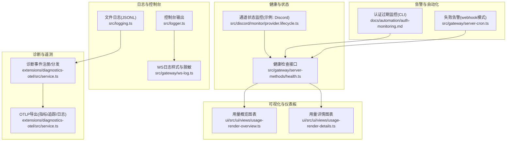
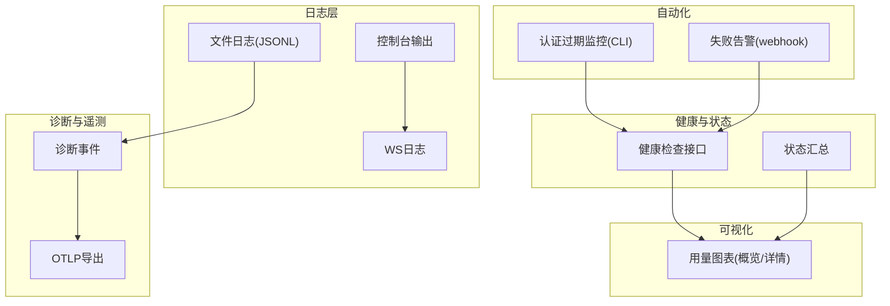
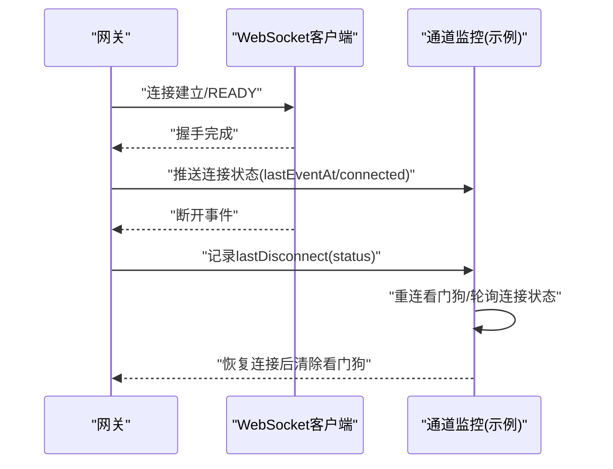
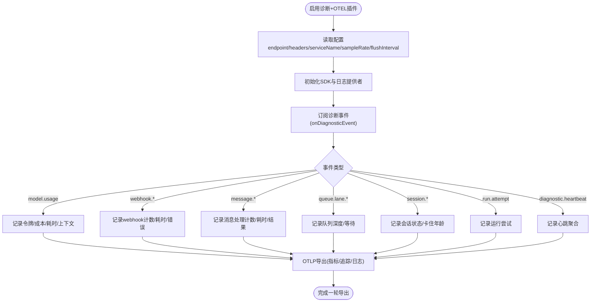
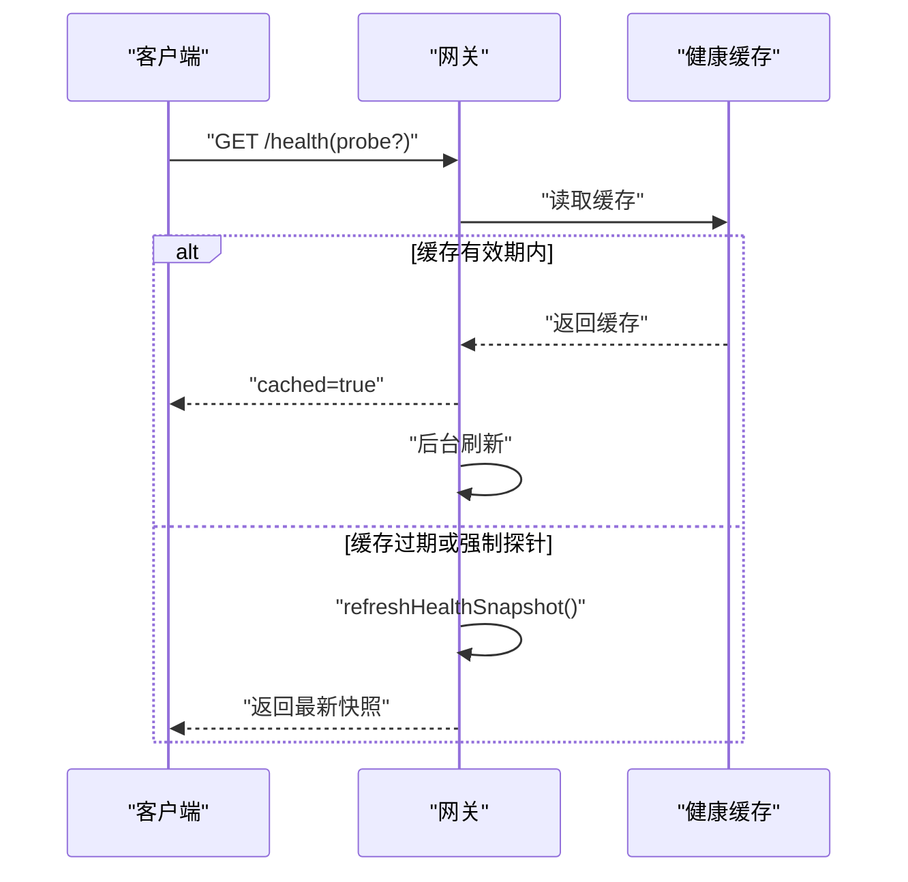
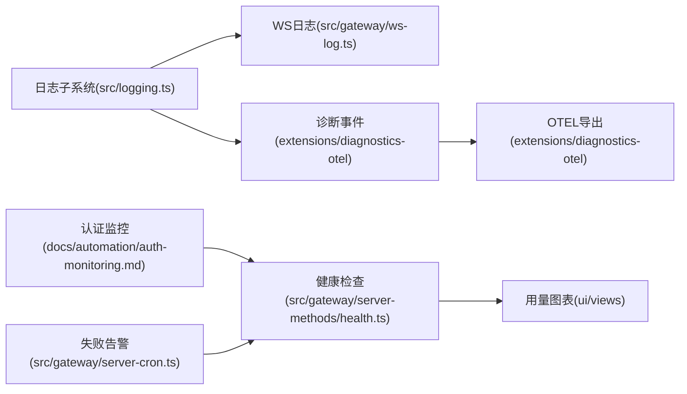

# 监控与日志

<cite>
**本文引用的文件**
- [src/logging.ts](file://src/logging.ts)
- [src/logger.ts](file://src/logger.ts)
- [src/gateway/ws-log.ts](file://src/gateway/ws-log.ts)
- [extensions/diagnostics-otel/src/service.ts](file://extensions/diagnostics-otel/src/service.ts)
- [docs/logging.md](file://docs/logging.md)
- [docs/gateway/logging.md](file://docs/gateway/logging.md)
- [src/gateway/server-methods/health.ts](file://src/gateway/server-methods/health.ts)
- [src/discord/monitor/provider.lifecycle.ts](file://src/discord/monitor/provider.lifecycle.ts)
- [src/gateway/server-cron.ts](file://src/gateway/server-cron.ts)
- [docs/automation/auth-monitoring.md](file://docs/automation/auth-monitoring.md)
- [ui/src/ui/views/usage-render-overview.ts](file://ui/src/ui/views/usage-render-overview.ts)
- [ui/src/ui/views/usage-render-details.ts](file://ui/src/ui/views/usage-render-details.ts)
</cite>

## 目录

1. [简介](#简介)
2. [项目结构](#项目结构)
3. [核心组件](#核心组件)
4. [架构总览](#架构总览)
5. [详细组件分析](#详细组件分析)
6. [依赖关系分析](#依赖关系分析)
7. [性能考量](#性能考量)
8. [故障排查指南](#故障排查指南)
9. [结论](#结论)
10. [附录](#附录)

## 简介

本指南面向OpenClaw的监控与日志体系，覆盖实时指标采集、存储与展示，系统健康检查、性能监控与错误追踪，日志级别与轮转、日志分析，告警规则与通知渠道，以及WebSocket连接、通道状态与AI代理性能监控。文档同时提供监控仪表板搭建与关键指标解读方法，帮助从基础日志到高级监控构建完整可观测性。

## 项目结构

OpenClaw的日志与监控由多层能力组成：

- 日志子系统：统一的文件日志（JSON Lines）与控制台输出，支持子系统前缀、级别过滤、敏感信息脱敏。
- WebSocket日志：网关侧对WS请求/响应进行结构化记录与可选脱敏，支持多种显示风格。
- 诊断事件与OpenTelemetry导出：在启用插件时，将模型使用、消息流、队列与会话等事件转换为指标、追踪与日志，并通过OTLP协议导出。
- 健康检查与状态接口：提供健康查询与状态汇总，支撑自动化巡检与告警。
- 控制界面与用量图表：提供可视化面板，用于查看Token与成本趋势、峰值与洞察。

**图示来源**

- [src/logging.ts:1-70](file://src/logging.ts#L1-L70)
- [src/logger.ts:1-86](file://src/logger.ts#L1-L86)
- [src/gateway/ws-log.ts:1-439](file://src/gateway/ws-log.ts#L1-L439)
- [extensions/diagnostics-otel/src/service.ts:1-686](file://extensions/diagnostics-otel/src/service.ts#L1-L686)
- [src/gateway/server-methods/health.ts:1-38](file://src/gateway/server-methods/health.ts#L1-L38)
- [src/discord/monitor/provider.lifecycle.ts:151-204](file://src/discord/monitor/provider.lifecycle.ts#L151-L204)
- [src/gateway/server-cron.ts:302-337](file://src/gateway/server-cron.ts#L302-L337)
- [docs/automation/auth-monitoring.md:1-45](file://docs/automation/auth-monitoring.md#L1-L45)
- [ui/src/ui/views/usage-render-overview.ts:158-543](file://ui/src/ui/views/usage-render-overview.ts#L158-L543)
- [ui/src/ui/views/usage-render-details.ts:394-429](file://ui/src/ui/views/usage-render-details.ts#L394-L429)

**章节来源**

- [docs/logging.md:1-353](file://docs/logging.md#L1-L353)
- [docs/gateway/logging.md:1-114](file://docs/gateway/logging.md#L1-L114)

## 核心组件

- 日志子系统
  - 文件日志：默认滚动写入，支持通过配置文件指定路径与级别；CLI与控制界面均支持实时跟踪。
  - 控制台输出：TTY感知格式化，支持子系统前缀、颜色、紧凑/JSON模式；可独立于文件日志调整级别与样式。
  - 敏感信息脱敏：工具摘要与WS日志均内置默认脱敏策略，可按需扩展正则模式。
- WebSocket日志
  - 支持“优化/紧凑/全量”三种风格；非verbose仅打印异常/慢调用/解析错误；verbose打印所有帧。
  - 对连接ID、消息ID等进行短ID化处理，便于快速识别。
- 诊断与OpenTelemetry
  - 事件类型覆盖模型使用、Webhook收发/错误、消息入队/处理、队列深度/等待、会话状态/卡住、运行尝试、心跳聚合等。
  - 指标包括令牌计数、成本USD、运行耗时直方图、上下文大小、Webhook计数/耗时、消息处理计数/耗时、队列深度/等待、会话状态/卡住年龄、运行尝试等。
  - 可导出至任意支持OTLP/HTTP的后端，支持采样率与刷新间隔配置。
- 健康检查与状态
  - 提供健康查询与状态汇总接口，支持后台刷新与缓存控制，便于自动化巡检与仪表板集成。
- 可视化与仪表板
  - 控制界面提供用量概览与详情图表，支持按天/按类型拆分、范围选择与累计/逐次模式切换。
- 告警与自动化
  - 认证过期监控可通过CLI返回码驱动自动化脚本与定时任务。
  - 失败告警支持webhook模式，具备URL校验与SSRF防护。

**章节来源**

- [src/logging.ts:1-70](file://src/logging.ts#L1-L70)
- [src/logger.ts:1-86](file://src/logger.ts#L1-L86)
- [src/gateway/ws-log.ts:1-439](file://src/gateway/ws-log.ts#L1-L439)
- [extensions/diagnostics-otel/src/service.ts:1-686](file://extensions/diagnostics-otel/src/service.ts#L1-L686)
- [src/gateway/server-methods/health.ts:1-38](file://src/gateway/server-methods/health.ts#L1-L38)
- [ui/src/ui/views/usage-render-overview.ts:158-543](file://ui/src/ui/views/usage-render-overview.ts#L158-L543)
- [ui/src/ui/views/usage-render-details.ts:394-429](file://ui/src/ui/views/usage-render-details.ts#L394-L429)
- [docs/automation/auth-monitoring.md:1-45](file://docs/automation/auth-monitoring.md#L1-L45)
- [src/gateway/server-cron.ts:302-337](file://src/gateway/server-cron.ts#L302-L337)

## 架构总览

下图展示了OpenClaw监控与日志的关键交互：日志子系统负责结构化记录；WebSocket日志增强网关调试；诊断事件在启用插件后转化为指标/追踪/日志并通过OTLP导出；健康检查与状态接口为自动化与仪表板提供数据源；可视化组件消费这些数据形成报表。

**图示来源**

- [src/logging.ts:1-70](file://src/logging.ts#L1-L70)
- [src/gateway/ws-log.ts:1-439](file://src/gateway/ws-log.ts#L1-L439)
- [extensions/diagnostics-otel/src/service.ts:1-686](file://extensions/diagnostics-otel/src/service.ts#L1-L686)
- [src/gateway/server-methods/health.ts:1-38](file://src/gateway/server-methods/health.ts#L1-L38)
- [ui/src/ui/views/usage-render-overview.ts:158-543](file://ui/src/ui/views/usage-render-overview.ts#L158-L543)
- [ui/src/ui/views/usage-render-details.ts:394-429](file://ui/src/ui/views/usage-render-details.ts#L394-L429)
- [docs/automation/auth-monitoring.md:1-45](file://docs/automation/auth-monitoring.md#L1-L45)
- [src/gateway/server-cron.ts:302-337](file://src/gateway/server-cron.ts#L302-L337)

## 详细组件分析

### 日志子系统与配置

- 文件日志
  - 默认滚动文件位于/tmp/openclaw/openclaw-YYYY-MM-DD.log，可通过配置文件覆盖路径与级别。
  - CLI支持实时跟踪、JSON/纯文本输出、禁色等选项；控制界面同样提供日志标签页。
- 控制台输出
  - TTY感知格式化，支持pretty/compact/json风格；可独立设置consoleLevel与consoleStyle。
  - 子系统前缀稳定着色，便于快速定位模块。
- 敏感信息脱敏
  - 工具摘要与WS日志采用默认脱敏策略，可自定义正则模式；不影响文件日志内容。

**章节来源**

- [docs/logging.md:20-141](file://docs/logging.md#L20-L141)
- [docs/gateway/logging.md:18-114](file://docs/gateway/logging.md#L18-L114)

### WebSocket日志与连接监控

- 风格与阈值
  - 非verbose：仅打印错误、慢调用（默认≥50ms）、解析错误。
  - verbose：打印所有帧；支持auto/compact/full三种风格。
- 连接状态
  - 通过连接ID与消息ID短ID化提升可读性；在慢连接/断开/重连场景下辅助定位问题。
- 通道状态监控示例
  - Discord提供连接状态变更与断开事件处理逻辑，可用于构建通用通道健康监控模板。

**图示来源**

- [src/gateway/ws-log.ts:256-314](file://src/gateway/ws-log.ts#L256-L314)
- [src/gateway/ws-log.ts:316-378](file://src/gateway/ws-log.ts#L316-L378)
- [src/gateway/ws-log.ts:380-439](file://src/gateway/ws-log.ts#L380-L439)
- [src/discord/monitor/provider.lifecycle.ts:151-204](file://src/discord/monitor/provider.lifecycle.ts#L151-L204)

**章节来源**

- [src/gateway/ws-log.ts:1-439](file://src/gateway/ws-log.ts#L1-L439)
- [src/discord/monitor/provider.lifecycle.ts:151-204](file://src/discord/monitor/provider.lifecycle.ts#L151-L204)

### 诊断事件与OpenTelemetry导出

- 事件类型
  - 模型使用：tokens、cost、duration、context、provider/model/channel、session标识。
  - 消息流：webhook接收/处理/错误、消息入队/处理。
  - 队列与会话：队列深度/等待、会话状态/卡住、运行尝试、心跳聚合。
- 指标与属性
  - 指标命名遵循openclaw.\*规范，属性包含渠道、提供商、模型、会话键/ID等。
  - 追踪包含span名称与关键属性，便于端到端关联。
- 导出配置
  - 支持OTLP/HTTP(protobuf)，可配置endpoint、headers、serviceName、traces/metrics/logs开关、采样率、刷新间隔。
  - 环境变量覆盖部分参数；若endpoint已含/v1/traces或/v1/metrics/logs则直接使用。

**图示来源**

- [extensions/diagnostics-otel/src/service.ts:72-104](file://extensions/diagnostics-otel/src/service.ts#L72-L104)
- [extensions/diagnostics-otel/src/service.ts:110-156](file://extensions/diagnostics-otel/src/service.ts#L110-L156)
- [extensions/diagnostics-otel/src/service.ts:167-242](file://extensions/diagnostics-otel/src/service.ts#L167-L242)
- [extensions/diagnostics-otel/src/service.ts:382-444](file://extensions/diagnostics-otel/src/service.ts#L382-L444)
- [extensions/diagnostics-otel/src/service.ts:446-501](file://extensions/diagnostics-otel/src/service.ts#L446-L501)
- [extensions/diagnostics-otel/src/service.ts:503-558](file://extensions/diagnostics-otel/src/service.ts#L503-L558)
- [extensions/diagnostics-otel/src/service.ts:560-577](file://extensions/diagnostics-otel/src/service.ts#L560-L577)
- [extensions/diagnostics-otel/src/service.ts:579-607](file://extensions/diagnostics-otel/src/service.ts#L579-L607)
- [extensions/diagnostics-otel/src/service.ts:609-617](file://extensions/diagnostics-otel/src/service.ts#L609-L617)
- [extensions/diagnostics-otel/src/service.ts:619-664](file://extensions/diagnostics-otel/src/service.ts#L619-L664)

**章节来源**

- [docs/logging.md:142-353](file://docs/logging.md#L142-L353)
- [extensions/diagnostics-otel/src/service.ts:1-686](file://extensions/diagnostics-otel/src/service.ts#L1-L686)

### 健康检查与状态接口

- 健康查询
  - 支持探针模式与缓存控制；后台刷新失败会记录错误日志。
- 状态汇总
  - 根据权限范围决定是否包含敏感信息；用于仪表板与自动化巡检。

**图示来源**

- [src/gateway/server-methods/health.ts:10-37](file://src/gateway/server-methods/health.ts#L10-L37)

**章节来源**

- [src/gateway/server-methods/health.ts:1-38](file://src/gateway/server-methods/health.ts#L1-L38)

### 告警规则与通知渠道

- 认证过期监控
  - 使用CLI返回码驱动自动化脚本与定时任务；支持JSON输出以供解析。
- 失败告警（webhook模式）
  - 支持URL校验与SSRF防护；失败时记录阻断与失败日志；可配置令牌与负载。

**章节来源**

- [docs/automation/auth-monitoring.md:1-45](file://docs/automation/auth-monitoring.md#L1-L45)
- [src/gateway/server-cron.ts:302-337](file://src/gateway/server-cron.ts#L302-L337)

### 监控仪表板搭建与关键指标解读

- 用量概览与详情
  - 支持按天/按类型拆分、范围选择、累计/逐次模式切换；提供Top模型/提供商/工具/代理/渠道与峰值错误洞察。
- 关键指标建议
  - 模型使用：openclaw.tokens、openclaw.cost.usd、openclaw.run.duration_ms、openclaw.context.tokens。
  - 消息流：openclaw.webhook.received、openclaw.webhook.error、openclaw.webhook.duration_ms、openclaw.message.queued、openclaw.message.processed、openclaw.message.duration_ms。
  - 队列与会话：openclaw.queue.lane.enqueue、openclaw.queue.lane.dequeue、openclaw.queue.depth、openclaw.queue.wait_ms、openclaw.session.state、openclaw.session.stuck、openclaw.session.stuck_age_ms、openclaw.run.attempt。

**章节来源**

- [ui/src/ui/views/usage-render-overview.ts:158-543](file://ui/src/ui/views/usage-render-overview.ts#L158-L543)
- [ui/src/ui/views/usage-render-details.ts:394-429](file://ui/src/ui/views/usage-render-details.ts#L394-L429)
- [docs/logging.md:268-326](file://docs/logging.md#L268-L326)

## 依赖关系分析

- 组件耦合
  - 日志子系统与WebSocket日志相互独立但共享脱敏策略；诊断事件与OTEL导出解耦，可按需启用。
  - 健康检查接口不依赖诊断插件，但可被仪表板与自动化脚本消费。
- 外部依赖
  - OTLP导出依赖HTTP/Protobuf协议；环境变量可覆盖端点、服务名与协议。
- 潜在循环依赖
  - 当前实现未发现循环导入；插件服务通过事件总线注册与注销，避免强耦合。

**图示来源**

- [src/logging.ts:1-70](file://src/logging.ts#L1-L70)
- [src/gateway/ws-log.ts:1-439](file://src/gateway/ws-log.ts#L1-L439)
- [extensions/diagnostics-otel/src/service.ts:1-686](file://extensions/diagnostics-otel/src/service.ts#L1-L686)
- [src/gateway/server-methods/health.ts:1-38](file://src/gateway/server-methods/health.ts#L1-L38)
- [docs/automation/auth-monitoring.md:1-45](file://docs/automation/auth-monitoring.md#L1-L45)
- [src/gateway/server-cron.ts:302-337](file://src/gateway/server-cron.ts#L302-L337)
- [ui/src/ui/views/usage-render-overview.ts:158-543](file://ui/src/ui/views/usage-render-overview.ts#L158-L543)

**章节来源**

- [src/logging.ts:1-70](file://src/logging.ts#L1-L70)
- [src/gateway/ws-log.ts:1-439](file://src/gateway/ws-log.ts#L1-L439)
- [extensions/diagnostics-otel/src/service.ts:1-686](file://extensions/diagnostics-otel/src/service.ts#L1-L686)
- [src/gateway/server-methods/health.ts:1-38](file://src/gateway/server-methods/health.ts#L1-L38)
- [docs/automation/auth-monitoring.md:1-45](file://docs/automation/auth-monitoring.md#L1-L45)
- [src/gateway/server-cron.ts:302-337](file://src/gateway/server-cron.ts#L302-L337)
- [ui/src/ui/views/usage-render-overview.ts:158-543](file://ui/src/ui/views/usage-render-overview.ts#L158-L543)

## 性能考量

- 日志级别与样式
  - 将文件日志级别设为debug/trace以捕获详细信息；控制台级别可独立调整，避免过度输出影响性能。
- WS日志风格
  - 在生产中优先使用优化/紧凑风格，仅在排障时开启verbose。
- OTLP导出
  - 合理设置flushIntervalMs与sampleRate，避免高吞吐场景下的网络与CPU压力。
- 健康检查
  - 利用缓存与后台刷新减少重复探针开销；必要时开启探针模式以获取最新状态。

[本节为通用指导，无需特定文件引用]

## 故障排查指南

- 网关不可达
  - 使用doctor命令检查环境与配置；确认日志文件路径与权限。
- 日志为空
  - 检查网关是否运行、日志文件是否存在且可写；适当提高文件日志级别。
- 需要更详细信息
  - 设置logging.level为debug或trace；在CLI中使用--log-level覆盖。
- 认证过期
  - 使用models status --check获取状态；根据返回码触发告警或自动刷新。
- 失败告警
  - 检查webhook URL有效性与SSRF防护；查看失败日志与阻断提示。

**章节来源**

- [docs/logging.md:347-353](file://docs/logging.md#L347-L353)
- [docs/automation/auth-monitoring.md:14-26](file://docs/automation/auth-monitoring.md#L14-L26)
- [src/gateway/server-cron.ts:302-337](file://src/gateway/server-cron.ts#L302-L337)

## 结论

OpenClaw提供了从基础日志到高级监控的完整能力：结构化的文件日志与控制台输出、细粒度的WS日志、丰富的诊断事件与OTLP导出、健康检查与状态接口、以及直观的可视化面板。通过合理配置日志级别、脱敏策略、OTLP导出参数与告警规则，可在保证安全与性能的前提下，构建稳健的可观测性体系。

[本节为总结，无需特定文件引用]

## 附录

- 快速参考
  - 日志配置项：logging.level、logging.file、logging.consoleLevel、logging.consoleStyle、logging.redactSensitive、logging.redactPatterns。
  - OTLP导出配置：diagnostics.otel.enabled、endpoint、protocol、serviceName、traces、metrics、logs、sampleRate、flushIntervalMs、headers。
  - 健康检查：GET /health，支持probe参数与缓存控制。
  - 认证监控：openclaw models status --check，返回码0/1/2分别表示正常/过期缺失/即将过期。

**章节来源**

- [docs/logging.md:99-267](file://docs/logging.md#L99-L267)
- [src/gateway/server-methods/health.ts:10-37](file://src/gateway/server-methods/health.ts#L10-L37)
- [docs/automation/auth-monitoring.md:14-26](file://docs/automation/auth-monitoring.md#L14-L26)
