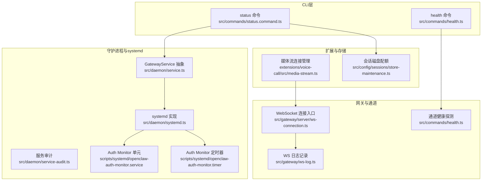
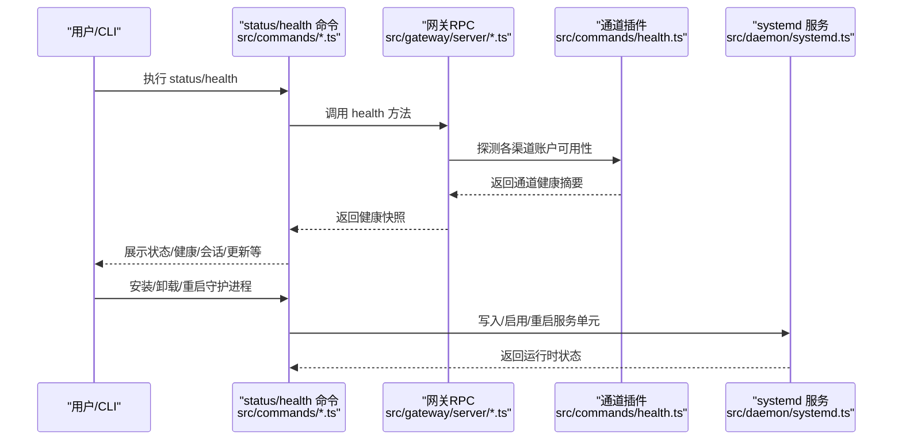
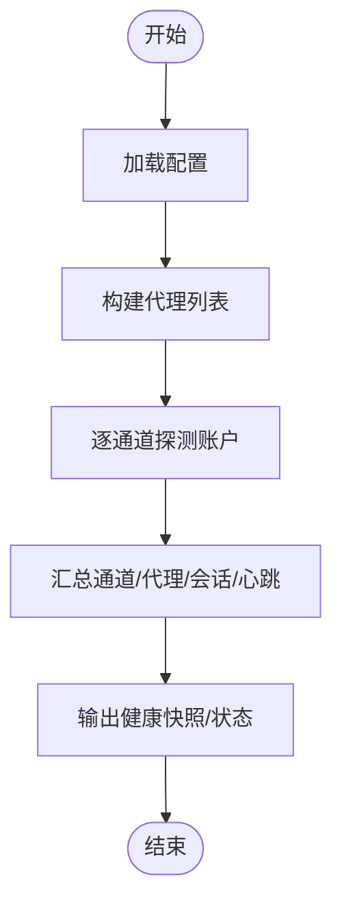
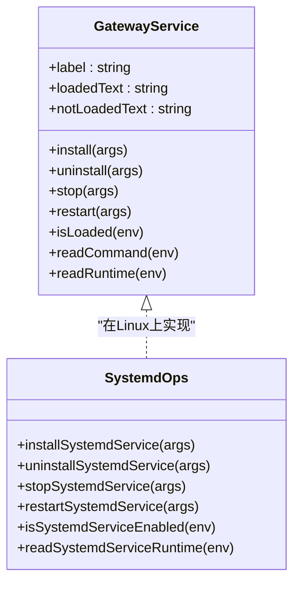
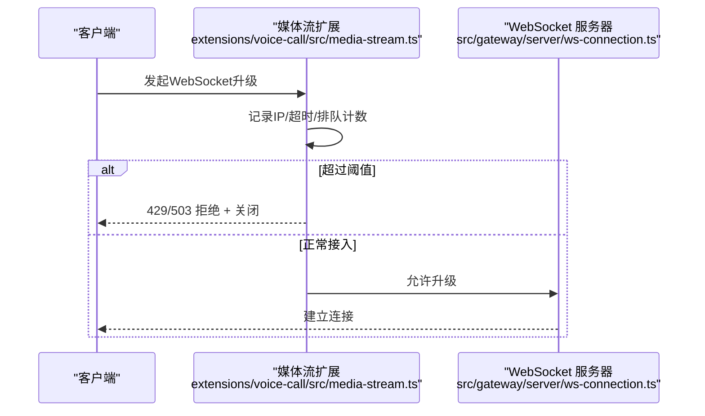
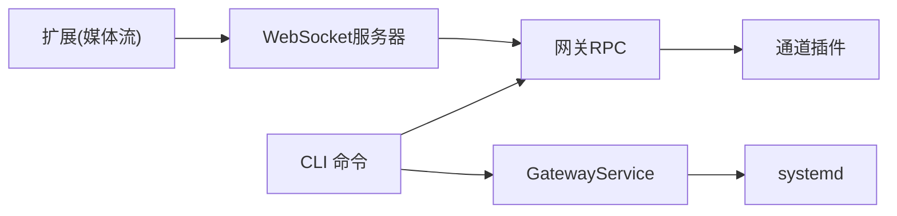

# 系统监控

<cite>
**本文引用的文件**
- [src/commands/health.ts](file://src/commands/health.ts)
- [src/commands/status.command.ts](file://src/commands/status.command.ts)
- [src/commands/status.scan.ts](file://src/commands/status.scan.ts)
- [src/daemon/service.ts](file://src/daemon/service.ts)
- [src/daemon/systemd.ts](file://src/daemon/systemd.ts)
- [src/daemon/service-audit.ts](file://src/daemon/service-audit.ts)
- [scripts/systemd/openclaw-auth-monitor.service](file://scripts/systemd/openclaw-auth-monitor.service)
- [scripts/systemd/openclaw-auth-monitor.timer](file://scripts/systemd/openclaw-auth-monitor.timer)
- [extensions/voice-call/src/media-stream.ts](file://extensions/voice-call/src/media-stream.ts)
- [src/gateway/server/ws-connection.ts](file://src/gateway/server/ws-connection.ts)
- [src/gateway/ws-log.ts](file://src/gateway/ws-log.ts)
- [src/agents/pi-embedded-runner/run.ts](file://src/agents/pi-embedded-runner/run.ts)
- [scripts/test-perf-budget.mjs](file://scripts/test-perf-budget.mjs)
- [scripts/test-parallel.mjs](file://scripts/test-parallel.mjs)
- [src/config/sessions/store-maintenance.ts](file://src/config/sessions/store-maintenance.ts)
- [apps/macos/Sources/OpenClaw/HealthStore.swift](file://apps/macos/Sources/OpenClaw/HealthStore.swift)
</cite>

## 目录

1. [简介](#简介)
2. [项目结构](#项目结构)
3. [核心组件](#核心组件)
4. [架构总览](#架构总览)
5. [详细组件分析](#详细组件分析)
6. [依赖关系分析](#依赖关系分析)
7. [性能考量](#性能考量)
8. [故障排查指南](#故障排查指南)
9. [结论](#结论)
10. [附录](#附录)

## 简介

本文件面向OpenClaw系统监控与运维，覆盖系统资源监控（CPU、内存、磁盘、网络）、守护进程状态监控、服务可用性检查、系统健康指标采集、systemd集成与服务重启策略、系统资源限制配置、WebSocket连接数监控、并发请求处理能力与系统负载均衡监控方案，并提供性能基准测试、资源使用优化建议以及异常情况下的自动恢复机制。目标是为从基础系统监控到高级性能调优提供完整指南。

## 项目结构

OpenClaw通过命令行工具与守护进程协同工作：CLI负责状态查询、健康检查、安装/卸载/重启等操作；守护进程在systemd（Linux）或对应平台的服务框架中运行；通道插件负责具体渠道的可用性探测；网关服务器承载WebSocket连接并记录日志；扩展模块（如语音通话）对连接进行限流与拒绝控制。

图表来源

- [src/commands/status.command.ts:67-216](file://src/commands/status.command.ts#L67-L216)
- [src/commands/health.ts:348-523](file://src/commands/health.ts#L348-L523)
- [src/daemon/service.ts:54-120](file://src/daemon/service.ts#L54-L120)
- [src/daemon/systemd.ts:451-521](file://src/daemon/systemd.ts#L451-L521)
- [src/daemon/service-audit.ts:60-122](file://src/daemon/service-audit.ts#L60-L122)
- [scripts/systemd/openclaw-auth-monitor.service:1-15](file://scripts/systemd/openclaw-auth-monitor.service#L1-L15)
- [scripts/systemd/openclaw-auth-monitor.timer:1-11](file://scripts/systemd/openclaw-auth-monitor.timer#L1-L11)
- [src/gateway/server/ws-connection.ts:115-139](file://src/gateway/server/ws-connection.ts#L115-L139)
- [src/gateway/ws-log.ts:380-418](file://src/gateway/ws-log.ts#L380-L418)
- [extensions/voice-call/src/media-stream.ts:302-345](file://extensions/voice-call/src/media-stream.ts#L302-L345)
- [src/config/sessions/store-maintenance.ts:80-124](file://src/config/sessions/store-maintenance.ts#L80-L124)

章节来源

- [src/commands/status.command.ts:67-216](file://src/commands/status.command.ts#L67-L216)
- [src/commands/health.ts:348-523](file://src/commands/health.ts#L348-L523)
- [src/daemon/service.ts:54-120](file://src/daemon/service.ts#L54-L120)
- [src/daemon/systemd.ts:451-521](file://src/daemon/systemd.ts#L451-L521)
- [src/daemon/service-audit.ts:60-122](file://src/daemon/service-audit.ts#L60-L122)
- [scripts/systemd/openclaw-auth-monitor.service:1-15](file://scripts/systemd/openclaw-auth-monitor.service#L1-L15)
- [scripts/systemd/openclaw-auth-monitor.timer:1-11](file://scripts/systemd/openclaw-auth-monitor.timer#L1-L11)
- [src/gateway/server/ws-connection.ts:115-139](file://src/gateway/server/ws-connection.ts#L115-L139)
- [src/gateway/ws-log.ts:380-418](file://src/gateway/ws-log.ts#L380-L418)
- [extensions/voice-call/src/media-stream.ts:302-345](file://extensions/voice-call/src/media-stream.ts#L302-L345)
- [src/config/sessions/store-maintenance.ts:80-124](file://src/config/sessions/store-maintenance.ts#L80-L124)

## 核心组件

- 状态与健康命令：提供系统状态概览、通道健康检查、最近心跳、会话统计、更新信息、安全审计等。
- 守护进程服务抽象：统一不同平台（macOS/Linux/Windows）的服务安装、卸载、启动、停止、重启与运行时状态读取。
- systemd 集成：在Linux上生成并启用服务单元，支持用户态服务、环境变量注入、执行参数解析、运行时状态查询与错误诊断。
- 通道健康探测：对各渠道账户进行可用性探测，输出成功/失败、耗时、错误原因等。
- WebSocket 连接与日志：记录入站/出站消息、请求响应往返、连接建立与关闭细节。
- 扩展连接管理：在扩展（如语音通话）中对WebSocket升级进行排队、限流与拒绝控制。
- 存储维护：会话磁盘配额上限、高水位阈值计算与清理策略。
- 认证过期监控：systemd定时任务定期检查认证有效期并发出告警。

章节来源

- [src/commands/status.command.ts:67-216](file://src/commands/status.command.ts#L67-L216)
- [src/commands/health.ts:348-523](file://src/commands/health.ts#L348-L523)
- [src/daemon/service.ts:54-120](file://src/daemon/service.ts#L54-L120)
- [src/daemon/systemd.ts:451-521](file://src/daemon/systemd.ts#L451-L521)
- [src/gateway/server/ws-connection.ts:115-139](file://src/gateway/server/ws-connection.ts#L115-L139)
- [src/gateway/ws-log.ts:380-418](file://src/gateway/ws-log.ts#L380-L418)
- [extensions/voice-call/src/media-stream.ts:302-345](file://extensions/voice-call/src/media-stream.ts#L302-L345)
- [src/config/sessions/store-maintenance.ts:80-124](file://src/config/sessions/store-maintenance.ts#L80-L124)
- [scripts/systemd/openclaw-auth-monitor.service:1-15](file://scripts/systemd/openclaw-auth-monitor.service#L1-L15)
- [scripts/systemd/openclaw-auth-monitor.timer:1-11](file://scripts/systemd/openclaw-auth-monitor.timer#L1-L11)

## 架构总览

OpenClaw监控体系由“CLI查询—守护进程—systemd—网关—通道—扩展”构成闭环。CLI通过RPC调用网关健康接口，网关汇总通道状态；systemd负责服务生命周期与运行时状态；WebSocket承载实时通信并记录日志；扩展在连接侧实施限流与保护；存储层提供磁盘配额保障。

图表来源

- [src/commands/status.command.ts:144-159](file://src/commands/status.command.ts#L144-L159)
- [src/commands/health.ts:525-544](file://src/commands/health.ts#L525-L544)
- [src/gateway/server/ws-connection.ts:115-139](file://src/gateway/server/ws-connection.ts#L115-L139)
- [src/daemon/systemd.ts:451-521](file://src/daemon/systemd.ts#L451-L521)

## 详细组件分析

### 系统健康与状态采集

- 健康快照：聚合通道账户配置状态、链接状态、认证年龄、探测结果（含耗时、状态码、错误）、心跳间隔、会话数量与最近活动。
- 状态命令：在JSON模式下输出包含操作系统、更新通道、网关可达性、服务状态、代理/节点服务、代理状态、内存插件状态、最近心跳、会话详情、安全审计、密钥诊断等字段。
- 通道健康格式化：根据探测结果输出“已链接/未链接/未配置/已配置/失败”等状态，并标注耗时与错误信息。

图表来源

- [src/commands/health.ts:348-523](file://src/commands/health.ts#L348-L523)
- [src/commands/status.command.ts:144-159](file://src/commands/status.command.ts#L144-L159)

章节来源

- [src/commands/health.ts:348-523](file://src/commands/health.ts#L348-L523)
- [src/commands/status.command.ts:144-159](file://src/commands/status.command.ts#L144-L159)

### 守护进程状态监控与systemd集成

- 服务抽象：统一平台差异，提供安装、卸载、停止、重启、是否已加载、读取命令与运行时等接口。
- systemd 实现：生成服务单元文件、写入工作目录与环境变量、启用并重启服务；读取ActiveState/SubState/MainPID/ExecMainStatus/ExecMainCode等运行时信息；对systemctl不可用、用户作用域不可达等情况进行诊断与降级处理。
- 服务审计：解析单元文件的After/Wants/RestartSec，判断重启间隔偏好（例如5秒）以评估配置合理性。

图表来源

- [src/daemon/service.ts:54-120](file://src/daemon/service.ts#L54-L120)
- [src/daemon/systemd.ts:451-646](file://src/daemon/systemd.ts#L451-L646)
- [src/daemon/service-audit.ts:60-122](file://src/daemon/service-audit.ts#L60-L122)

章节来源

- [src/daemon/service.ts:54-120](file://src/daemon/service.ts#L54-L120)
- [src/daemon/systemd.ts:451-646](file://src/daemon/systemd.ts#L451-L646)
- [src/daemon/service-audit.ts:60-122](file://src/daemon/service-audit.ts#L60-L122)

### 服务重启策略与资源限制配置

- 重启策略：systemd单元文件解析支持RestartSec字段，代码中存在对“5秒”偏好的判断逻辑，用于评估配置是否符合推荐重启间隔。
- 资源限制：通过Environment/EnvironmentFile注入环境变量，结合WorkingDirectory设置工作路径；systemd支持LimitNOFILE、LimitNPROC等内核级限制（需在单元文件中显式配置）。
- 用户作用域与sudo兼容：当SUDO_USER非root时，优先使用机器用户作用域；否则回退至直接用户作用域；若systemd不可用则抛出明确错误。

章节来源

- [src/daemon/service-audit.ts:105-122](file://src/daemon/service-audit.ts#L105-L122)
- [src/daemon/systemd.ts:419-449](file://src/daemon/systemd.ts#L419-L449)
- [src/daemon/systemd.ts:349-417](file://src/daemon/systemd.ts#L349-L417)

### WebSocket连接数监控与并发请求处理

- 连接入口：WebSocket升级时记录远端地址、Host/Origin/User-Agent/X-Forwarded-\*等头部，便于定位来源与反向代理信息。
- 并发与队列：扩展媒体流对升级进行排队（pendingConnections/pendingByIp），超过阈值时按429/503拒绝并销毁socket，防止拥塞。
- 请求追踪：WS日志记录请求/响应往返、inflight队列、耗时标记，便于定位慢请求与堆积。

图表来源

- [extensions/voice-call/src/media-stream.ts:302-345](file://extensions/voice-call/src/media-stream.ts#L302-L345)
- [src/gateway/server/ws-connection.ts:115-139](file://src/gateway/server/ws-connection.ts#L115-L139)

章节来源

- [extensions/voice-call/src/media-stream.ts:302-345](file://extensions/voice-call/src/media-stream.ts#L302-L345)
- [src/gateway/server/ws-connection.ts:115-139](file://src/gateway/server/ws-connection.ts#L115-L139)
- [src/gateway/ws-log.ts:380-418](file://src/gateway/ws-log.ts#L380-L418)

### 系统负载均衡与通道健康

- 通道健康：对每个渠道账户执行探测，返回ok/fail、耗时、状态码、错误信息；支持多账户聚合展示。
- 负载均衡建议：基于通道健康与探针耗时，动态选择更健康的账户；在高负载场景下可降低探针频率或仅对关键账户探测。

章节来源

- [src/commands/health.ts:418-490](file://src/commands/health.ts#L418-L490)
- [apps/macos/Sources/OpenClaw/HealthStore.swift:147-163](file://apps/macos/Sources/OpenClaw/HealthStore.swift#L147-L163)

### 系统资源监控（CPU/内存/磁盘/网络）

- CPU/内存/网络：通过系统工具（如systemd、top、iostat、iftop等）与应用内部指标（会话数量、内存插件状态、代理运行时）综合观测。
- 磁盘：会话存储采用高水位策略，当达到上限时触发清理；可通过maxDiskBytes与高水位阈值控制占用。
- 通道健康：作为间接指标，通道可用性下降通常反映网络或上游服务异常。

章节来源

- [src/config/sessions/store-maintenance.ts:80-124](file://src/config/sessions/store-maintenance.ts#L80-L124)
- [src/commands/health.ts:348-523](file://src/commands/health.ts#L348-L523)

### 认证过期监控与自动恢复

- 定时任务：每30分钟检查一次认证有效期，支持环境变量配置告警阈值与通知通道。
- 自动恢复：当检测到认证即将过期，可在CLI中触发重新授权流程；systemd服务在异常退出后按策略重启。

章节来源

- [scripts/systemd/openclaw-auth-monitor.service:1-15](file://scripts/systemd/openclaw-auth-monitor.service#L1-L15)
- [scripts/systemd/openclaw-auth-monitor.timer:1-11](file://scripts/systemd/openclaw-auth-monitor.timer#L1-L11)
- [src/daemon/systemd.ts:570-580](file://src/daemon/systemd.ts#L570-L580)

### 性能基准测试与资源优化

- 基准测试：通过脚本对执行时间设定上限与回归阈值，避免性能退化引入。
- 并行与负载感知：测试脚本根据主机CPU数与负载比率动态调整并发度，极端负载下降低并发以保证稳定性。
- 使用统计：代理运行器内置使用量累加与重试迭代上限，避免长时间阻塞与资源耗尽。

章节来源

- [scripts/test-perf-budget.mjs:98-127](file://scripts/test-perf-budget.mjs#L98-L127)
- [scripts/test-parallel.mjs:243-275](file://scripts/test-parallel.mjs#L243-L275)
- [src/agents/pi-embedded-runner/run.ts:121-155](file://src/agents/pi-embedded-runner/run.ts#L121-L155)

## 依赖关系分析

- CLI依赖网关RPC获取健康与状态；网关依赖通道插件执行探测；守护进程依赖systemd实现服务生命周期；扩展依赖网关WebSocket提供实时通信。
- systemd解析与运行时读取为跨平台服务抽象的核心实现；通道健康与WS日志为可观测性的关键数据源。

图表来源

- [src/commands/status.command.ts:144-159](file://src/commands/status.command.ts#L144-L159)
- [src/commands/health.ts:348-523](file://src/commands/health.ts#L348-L523)
- [src/daemon/service.ts:54-120](file://src/daemon/service.ts#L54-L120)
- [src/daemon/systemd.ts:451-646](file://src/daemon/systemd.ts#L451-L646)
- [src/gateway/server/ws-connection.ts:115-139](file://src/gateway/server/ws-connection.ts#L115-L139)

章节来源

- [src/commands/status.command.ts:144-159](file://src/commands/status.command.ts#L144-L159)
- [src/commands/health.ts:348-523](file://src/commands/health.ts#L348-L523)
- [src/daemon/service.ts:54-120](file://src/daemon/service.ts#L54-L120)
- [src/daemon/systemd.ts:451-646](file://src/daemon/systemd.ts#L451-L646)
- [src/gateway/server/ws-connection.ts:115-139](file://src/gateway/server/ws-connection.ts#L115-L139)

## 性能考量

- 并发与限流：扩展媒体流对同一IP的升级进行排队与限流，必要时返回429/503，避免雪崩。
- 探测开销：通道健康探测应合理设置超时与频率，避免对上游造成压力。
- 存储配额：磁盘配额与高水位策略可防止会话数据无限增长导致IO与空间压力。
- 负载感知：测试脚本根据系统负载动态调整并发，提升稳定性。

章节来源

- [extensions/voice-call/src/media-stream.ts:302-345](file://extensions/voice-call/src/media-stream.ts#L302-L345)
- [src/config/sessions/store-maintenance.ts:80-124](file://src/config/sessions/store-maintenance.ts#L80-L124)
- [scripts/test-parallel.mjs:243-275](file://scripts/test-parallel.mjs#L243-L275)

## 故障排查指南

- systemd不可用：当systemctl缺失或用户作用域不可达时，明确报错提示；检查D-Bus、XDG_RUNTIME_DIR、用户会话状态。
- 服务状态异常：通过systemd show ActiveState/SubState/MainPID/ExecMainStatus/ExecMainCode等字段定位运行时问题。
- 通道健康失败：查看探针耗时、状态码与错误信息；确认凭据有效性与网络连通性。
- WebSocket异常：检查升级头部、连接关闭原因与日志中的inflight耗时；关注429/503拒绝与拥塞窗口。

章节来源

- [src/daemon/systemd.ts:254-321](file://src/daemon/systemd.ts#L254-L321)
- [src/daemon/systemd.ts:606-646](file://src/daemon/systemd.ts#L606-L646)
- [src/commands/health.ts:175-220](file://src/commands/health.ts#L175-L220)
- [src/gateway/ws-log.ts:380-418](file://src/gateway/ws-log.ts#L380-L418)

## 结论

OpenClaw提供了从CLI到守护进程、从通道健康到WebSocket可观测性的完整监控链路。通过systemd集成与服务审计、通道健康探测与WS日志、扩展连接限流与存储配额策略，能够有效支撑系统稳定运行与性能优化。建议在生产环境中结合负载感知与告警机制，持续优化重启策略与资源限制，确保在高并发与异常情况下仍能保持可靠的服务质量。

## 附录

- 常用命令与配置要点
  - status/health：查看系统状态、通道健康、最近心跳、会话与更新信息。
  - systemd服务：安装/卸载/重启、读取运行时状态、解析单元文件。
  - 认证监控：定时检查认证有效期，支持告警阈值与通知通道。
  - WebSocket：记录请求/响应往返、连接建立与关闭细节，扩展侧实施限流与拒绝。

章节来源

- [src/commands/status.command.ts:67-216](file://src/commands/status.command.ts#L67-L216)
- [src/commands/health.ts:348-523](file://src/commands/health.ts#L348-L523)
- [src/daemon/systemd.ts:451-646](file://src/daemon/systemd.ts#L451-L646)
- [scripts/systemd/openclaw-auth-monitor.service:1-15](file://scripts/systemd/openclaw-auth-monitor.service#L1-L15)
- [src/gateway/ws-log.ts:380-418](file://src/gateway/ws-log.ts#L380-L418)
